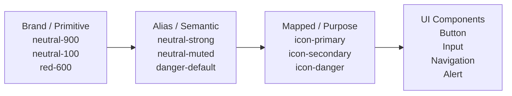
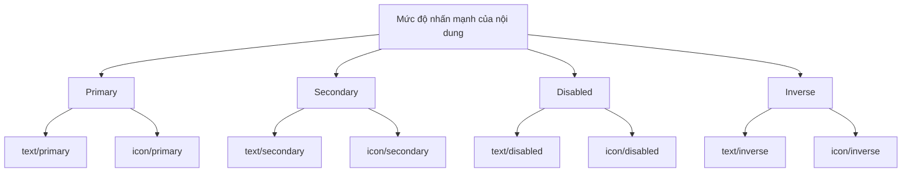
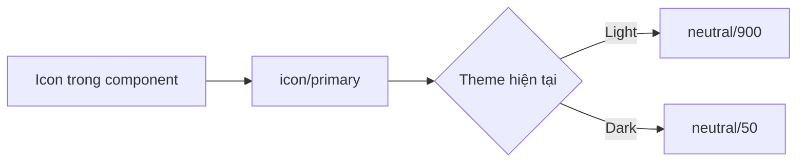
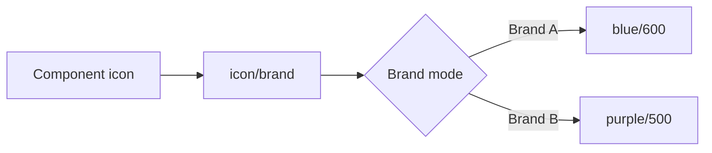
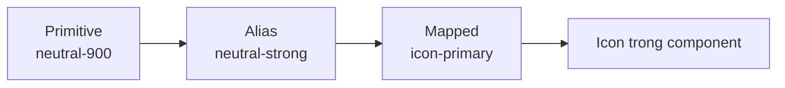

# 016 — Icon Variables

## 1. Thông tin bài học

| Mục                   | Nội dung                                                            |
| --------------------- | ------------------------------------------------------------------- |
| **Module**            | Multi-Brand, Themes & Mapped Variables                              |
| **Thời điểm bắt đầu** | 45:15 trong video đầy đủ                                            |
| **Chủ đề chính**      | Xây dựng các biến màu dành cho biểu tượng ở tầng **Mapped**         |
| **Mục tiêu**          | Giúp màu icon nhất quán với văn bản, thương hiệu và chế độ sáng/tối |

> **Lưu ý:** Đoạn transcript được cung cấp ở cuối nói về `font size`, `line height` và thang typography. Nội dung này không khớp trực tiếp với bài **Icon Variables**. Phần trình bày dưới đây được xây dựng dựa trên tiêu đề, ý chính và các chủ đề đã nêu của bài học.

---

## 2. Ý tưởng chính

Bài học xây dựng các **Mapped icon-color tokens** — những biến màu có mục đích sử dụng rõ ràng dành cho icon.

Thay vì gán trực tiếp một màu cố định như:

```text
#1A1A1A
```

hoặc liên kết icon trực tiếp với một biến màu nguyên thủy như:

```text
neutral/900
```

icon sẽ được liên kết với token theo vai trò:

```text
icon/primary
icon/secondary
icon/disabled
icon/inverse
icon/brand
icon/danger
```

Các token này có thể tự động đổi giá trị khi:

* Chuyển thương hiệu.
* Chuyển từ Light Mode sang Dark Mode.
* Thay đổi trạng thái của component.
* Thay đổi ngữ cảnh sử dụng icon.

---

## 3. Vị trí của Icon Variables trong hệ thống token

Hệ thống token có thể được tổ chức thành ba tầng:



### Tầng Brand hoặc Primitive

Chứa các giá trị màu cơ bản:

```text
brand/blue/500
neutral/100
neutral/700
neutral/900
red/600
white
black
```

Đây là các giá trị nguyên thủy, chưa mô tả mục đích sử dụng trong giao diện.

### Tầng Alias

Chuyển màu nguyên thủy thành màu mang ý nghĩa ngữ nghĩa:

```text
color/primary/default
color/neutral/strong
color/neutral/subtle
color/danger/default
color/on-dark
```

### Tầng Mapped

Mô tả màu theo vị trí hoặc mục đích sử dụng thực tế:

```text
icon/primary
icon/secondary
icon/disabled
icon/inverse
icon/danger
```

Đây là tầng mà icon trong component nên sử dụng trực tiếp.

---

## 4. Tại sao cần Icon Variables riêng?

Icon và văn bản thường xuất hiện cạnh nhau:

```text
[Icon tìm kiếm]  Tìm kiếm
[Icon cảnh báo]  Có lỗi xảy ra
[Icon người dùng]  Hồ sơ cá nhân
```

Nếu icon và văn bản sử dụng các hệ thống màu khác nhau, giao diện có thể gặp những vấn đề như:

* Icon đậm hơn hoặc nhạt hơn chữ bên cạnh.
* Icon không đổi màu khi chuyển sang Dark Mode.
* Icon trạng thái vô hiệu hóa vẫn quá nổi bật.
* Icon cảnh báo không đồng nhất với nội dung cảnh báo.
* Mỗi component tự chọn một mã màu khác nhau.
* Việc thay đổi nhận diện thương hiệu trở nên khó kiểm soát.

Icon Variables tạo ra một quy tắc thống nhất:

```text
text/primary  ↔ icon/primary
text/secondary ↔ icon/secondary
text/disabled ↔ icon/disabled
text/inverse ↔ icon/inverse
```

Nhờ đó, icon và văn bản có cùng mức độ nhấn mạnh và tương phản.

---

## 5. Cấu trúc token đề xuất

Một hệ thống cơ bản có thể gồm các token sau:

| Token            | Mục đích                                |
| ---------------- | --------------------------------------- |
| `icon/primary`   | Icon có mức độ ưu tiên cao nhất         |
| `icon/secondary` | Icon hỗ trợ hoặc ít quan trọng hơn      |
| `icon/tertiary`  | Icon có độ nhấn thấp                    |
| `icon/disabled`  | Icon trong trạng thái vô hiệu hóa       |
| `icon/inverse`   | Icon đặt trên nền tối hoặc nền màu mạnh |
| `icon/brand`     | Icon mang màu nhận diện thương hiệu     |
| `icon/success`   | Icon biểu thị thành công                |
| `icon/warning`   | Icon cảnh báo                           |
| `icon/danger`    | Icon lỗi hoặc hành động nguy hiểm       |
| `icon/info`      | Icon cung cấp thông tin                 |

Ví dụ cấu trúc trong Figma:

```text
Mapped
└── icon
    ├── primary
    ├── secondary
    ├── tertiary
    ├── disabled
    ├── inverse
    ├── brand
    ├── success
    ├── warning
    ├── danger
    └── info
```

---

## 6. Tái sử dụng cấu trúc của Text Variables

Một trong những ý tưởng quan trọng của bài học là **không cần phát minh một cấu trúc hoàn toàn mới cho icon**.

Có thể sử dụng lại mô hình từ Text Variables:

| Text token       | Icon token tương ứng |
| ---------------- | -------------------- |
| `text/primary`   | `icon/primary`       |
| `text/secondary` | `icon/secondary`     |
| `text/tertiary`  | `icon/tertiary`      |
| `text/disabled`  | `icon/disabled`      |
| `text/inverse`   | `icon/inverse`       |
| `text/brand`     | `icon/brand`         |
| `text/danger`    | `icon/danger`        |

Cách tổ chức song song này mang lại nhiều lợi ích:

* Dễ ghi nhớ.
* Dễ bảo trì.
* Dễ kiểm tra tính nhất quán.
* Designer dễ chọn đúng token.
* Developer dễ ánh xạ token sang code.
* Giảm số lượng quyết định thủ công.

---

## 7. Quan hệ giữa text và icon



Điều này không nhất thiết có nghĩa icon và text luôn dùng chính xác cùng một màu. Tuy nhiên, chúng nên có:

* Cùng vai trò.
* Cùng mức độ nhấn mạnh.
* Độ tương phản tương đương.
* Hành vi chuyển theme nhất quán.

Ví dụ, icon có thể hơi nhạt hơn text trong một số hệ thống, nhưng cả hai vẫn phải được quản lý thông qua token tương ứng.

---

## 8. Thiết lập mode cho Light Theme và Dark Theme

Mapped Variables đóng vai trò như một bảng điều khiển theme.

### Ví dụ ánh xạ

| Icon token       | Light Mode    | Dark Mode     |
| ---------------- | ------------- | ------------- |
| `icon/primary`   | `neutral/900` | `neutral/50`  |
| `icon/secondary` | `neutral/600` | `neutral/300` |
| `icon/tertiary`  | `neutral/500` | `neutral/400` |
| `icon/disabled`  | `neutral/300` | `neutral/700` |
| `icon/inverse`   | `white`       | `black`       |
| `icon/danger`    | `red/600`     | `red/400`     |

Sơ đồ hoạt động:



Component không cần đổi biến khi chuyển theme. Giá trị của `icon/primary` sẽ tự thay đổi theo mode.

---

## 9. Hỗ trợ nhiều thương hiệu

Ngoài Light và Dark Mode, Icon Variables còn có thể hỗ trợ nhiều thương hiệu.

Ví dụ:

| Token          | Brand A         | Brand B         |
| -------------- | --------------- | --------------- |
| `icon/brand`   | `blue/600`      | `purple/500`    |
| `icon/primary` | `neutral-A/900` | `neutral-B/900` |
| `icon/inverse` | `white`         | `cream/50`      |

Component vẫn chỉ sử dụng:

```text
icon/brand
```

Khi đổi mode thương hiệu, màu icon sẽ tự cập nhật.



---

## 10. Các bước thực hiện trong Figma

### Bước 1: Mở collection Mapped

Mở collection chứa các token theo mục đích sử dụng:

```text
Mapped
```

Nếu chưa có nhóm dành cho icon, tạo nhóm:

```text
icon
```

---

### Bước 2: Tạo các biến màu icon

Tạo các biến kiểu `Color`:

```text
icon/primary
icon/secondary
icon/tertiary
icon/disabled
icon/inverse
icon/brand
icon/success
icon/warning
icon/danger
icon/info
```

Không nên nhập mã hex trực tiếp ở tầng này.

---

### Bước 3: Liên kết với Alias Variables

Ví dụ:

```text
icon/primary
→ color/neutral/strong

icon/secondary
→ color/neutral/muted

icon/disabled
→ color/neutral/disabled

icon/danger
→ color/danger/default
```

Luồng tham chiếu hoàn chỉnh:

```text
icon/primary
→ color/neutral/strong
→ neutral/900
→ #171717
```

---

### Bước 4: Đặt giá trị cho từng mode

Ví dụ collection có các mode:

```text
Brand A — Light
Brand A — Dark
Brand B — Light
Brand B — Dark
```

Thiết lập giá trị cho từng token ở mỗi mode.

| Mode            | `icon/primary`                      |
| --------------- | ----------------------------------- |
| Brand A — Light | `alias/neutral/900`                 |
| Brand A — Dark  | `alias/neutral/50`                  |
| Brand B — Light | `alias/neutral/strong` của Brand B  |
| Brand B — Dark  | `alias/neutral/inverse` của Brand B |

---

### Bước 5: Gắn token vào icon

Chọn vector hoặc icon instance trong Figma:

1. Mở thuộc tính **Fill**.
2. Chọn **Apply variable**.
3. Chọn token phù hợp, ví dụ:

```text
Mapped/icon/primary
```

Không nên gắn trực tiếp:

```text
Brand/neutral/900
```

---

### Bước 6: Kiểm tra trong nhiều trạng thái

Kiểm tra icon trong:

* Light Mode.
* Dark Mode.
* Từng thương hiệu.
* Trạng thái mặc định.
* Trạng thái hover.
* Trạng thái disabled.
* Nền sáng.
* Nền tối.
* Nền màu thương hiệu.

---

## 11. Ví dụ áp dụng thực tế

### 11.1 Navigation item

```text
[Home icon] Trang chủ
```

Ánh xạ:

```text
Icon: icon/secondary
Text: text/secondary
```

Khi item được chọn:

```text
Icon: icon/brand
Text: text/brand
```

---

### 11.2 Nút có icon

```text
[Save icon] Lưu thay đổi
```

Đối với nút nền thương hiệu:

```text
Icon: icon/inverse
Text: text/inverse
Surface: surface/brand
```

---

### 11.3 Trường nhập liệu

```text
[Search icon] Tìm kiếm
```

Trạng thái mặc định:

```text
Icon: icon/secondary
Placeholder: text/secondary
```

Trạng thái disabled:

```text
Icon: icon/disabled
Text: text/disabled
Surface: surface/disabled
```

---

### 11.4 Thông báo lỗi

```text
[Error icon] Mật khẩu không hợp lệ
```

Ánh xạ:

```text
Icon: icon/danger
Text: text/danger
Border: border/danger
Surface: surface/danger-subtle
```

Các token cùng chung ngữ nghĩa `danger`, giúp trạng thái lỗi nhất quán trên toàn hệ thống.

---

## 12. Không nên sử dụng icon token theo cách nào?

### Không gán màu cứng

```text
Fill: #667085
```

Vấn đề:

* Không tự đổi theo theme.
* Khó thay đổi toàn hệ thống.
* Không rõ vai trò của màu.
* Có thể lệch với text bên cạnh.

---

### Không liên kết trực tiếp với Primitive

```text
Icon → neutral/600
```

Cách này vẫn hoạt động nhưng làm component phụ thuộc vào màu nguyên thủy.

Nên dùng:

```text
Icon → icon/secondary
```

---

### Không đặt tên theo màu cụ thể

Không nên:

```text
icon/gray
icon/white
icon/black
icon/blue
```

Nên:

```text
icon/primary
icon/inverse
icon/brand
icon/secondary
```

Tên theo mục đích giúp token tiếp tục hợp lý khi màu thực tế thay đổi.

---

### Không tạo quá nhiều token theo từng component

Không nên:

```text
icon/button-left
icon/card-header
icon/profile-menu
icon/sidebar-search
```

Trừ khi các trường hợp đó thực sự có yêu cầu màu riêng biệt.

Nên ưu tiên các vai trò có thể tái sử dụng:

```text
icon/primary
icon/secondary
icon/inverse
icon/disabled
```

---

## 13. Rủi ro và hạn chế

### 13.1 Icon và text cùng vai trò nhưng không đủ tương phản

Việc dùng token tương ứng không đảm bảo tự động đạt tiêu chuẩn accessibility. Cần kiểm tra màu icon trên từng nền thực tế.

---

### 13.2 Dùng opacity thay cho token disabled

Một số hệ thống tạo trạng thái disabled bằng cách giảm opacity toàn bộ component. Cách này có thể khiến màu cuối cùng khó kiểm soát và không đồng nhất giữa các nền.

Tốt hơn nên có token rõ ràng:

```text
icon/disabled
```

---

### 13.3 Quá nhiều vai trò icon

Nếu tạo quá nhiều token gần giống nhau, designer sẽ khó biết nên chọn token nào.

Ví dụ không cần thiết:

```text
icon/secondary-light
icon/secondary-medium
icon/secondary-soft
icon/secondary-muted
```

Chỉ nên mở rộng khi có nhu cầu thiết kế thực tế.

---

### 13.4 Icon nhiều màu

Icon Variables phù hợp nhất với icon một màu. Với illustration hoặc icon nhiều màu, có thể cần:

* Nhiều token cho từng lớp.
* Component properties.
* Màu cố định có kiểm soát.
* Asset riêng cho từng theme.

---

### 13.5 Stroke và Fill không đồng nhất

Một số icon sử dụng `Fill`, một số khác sử dụng `Stroke`. Khi áp dụng token, cần kiểm tra đúng thuộc tính để tránh icon không đổi màu.

---

## 14. Nguyên tắc khuyến nghị

1. Component chỉ nên sử dụng Mapped Variables.
2. Không nhập mã hex trực tiếp vào icon.
3. Icon và text bên cạnh nên dùng các token có vai trò tương ứng.
4. Tên token nên mô tả mục đích, không mô tả màu.
5. Mọi token quan trọng cần có giá trị cho cả Light và Dark Mode.
6. Kiểm tra icon trên nhiều loại surface.
7. Ưu tiên một bộ token nhỏ, rõ ràng và có thể tái sử dụng.
8. Chỉ tạo token mới khi vai trò mới thực sự khác biệt.
9. Icon trạng thái nên đồng bộ với text, border và surface cùng trạng thái.
10. Kiểm tra cả `Fill` và `Stroke` khi binding variable.

---

## 15. Trả lời câu hỏi ôn tập

### Câu 1: Mục đích chính của Icon Variables là gì?

Mục đích chính là tạo các token màu icon theo vai trò sử dụng, giúp icon:

* Nhất quán với text.
* Tự động thay đổi theo theme.
* Hỗ trợ nhiều thương hiệu.
* Dễ cập nhật trên toàn hệ thống.
* Không phụ thuộc trực tiếp vào mã màu hoặc primitive token.

---

### Câu 2: Áp dụng vào một Figma Design System thực tế như thế nào?

Quy trình áp dụng:

1. Tạo nhóm `icon` trong Mapped collection.
2. Tạo các token như `icon/primary`, `icon/secondary`, `icon/disabled`.
3. Liên kết chúng với Alias Variables.
4. Đặt giá trị riêng cho từng theme và thương hiệu.
5. Gắn các token này vào `Fill` hoặc `Stroke` của icon.
6. Kiểm tra icon cùng text trong nhiều trạng thái và bối cảnh.

---

### Câu 3: Các bước hoặc ý tưởng quan trọng của bài học là gì?

Các ý chính gồm:

* Xây dựng token màu dành riêng cho icon.
* Tái sử dụng cấu trúc từ Text Variables.
* Đồng bộ vai trò giữa icon và text.
* Sử dụng Mapped Variables cho component.
* Thiết lập giá trị theo mode.
* Kiểm tra độ tương phản trong Light và Dark Theme.

---

### Câu 4: Rủi ro hoặc hạn chế cần lưu ý là gì?

Các rủi ro chính:

* Icon không đủ tương phản với background.
* Tạo quá nhiều token gây khó sử dụng.
* Liên kết trực tiếp với primitive làm giảm khả năng đổi theme.
* Dùng opacity cho disabled gây kết quả không nhất quán.
* Icon nhiều màu không phù hợp với cấu trúc token đơn giản.
* Một số icon dùng stroke thay vì fill nên dễ binding sai thuộc tính.

---

## 16. Tóm tắt bài học

**Icon Variables** mở rộng tầng Mapped bằng các token màu dành cho icon như:

```text
icon/primary
icon/secondary
icon/disabled
icon/inverse
icon/brand
icon/danger
```

Các token này được xây dựng theo cùng mô hình với Text Variables, giúp icon và văn bản có mức độ nhấn mạnh, độ tương phản và hành vi chuyển theme nhất quán.

Luồng sử dụng đề xuất:



Component không cần biết màu thực tế là trắng, đen, xám hay màu thương hiệu. Component chỉ cần biết vai trò của icon:

```text
Đây là icon chính.
Đây là icon phụ.
Đây là icon disabled.
Đây là icon trên nền tối.
```

Nhờ đó, hệ thống có thể thay đổi thương hiệu hoặc Light/Dark Theme mà không cần chỉnh sửa thủ công từng icon.
