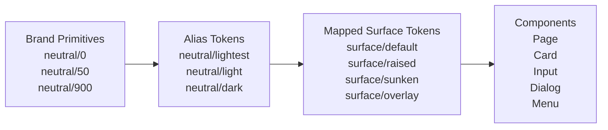
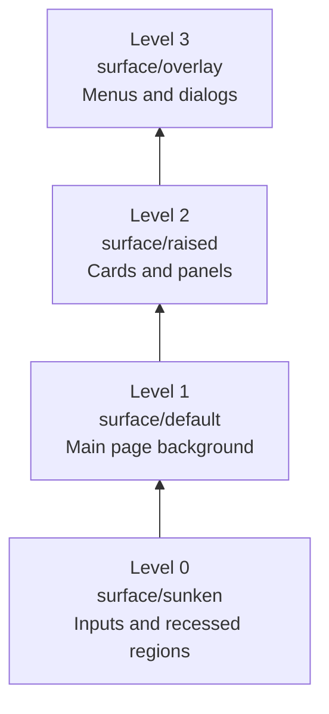
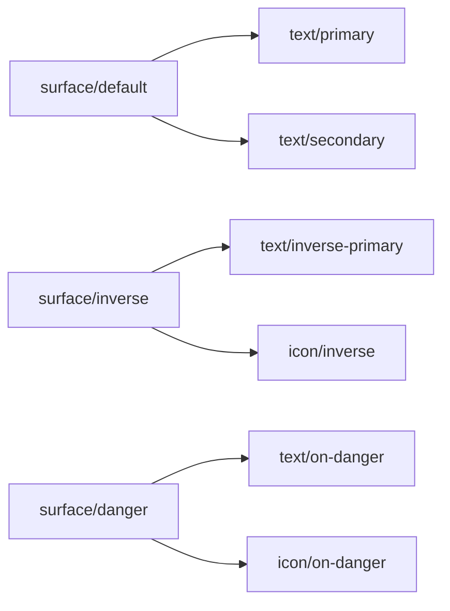
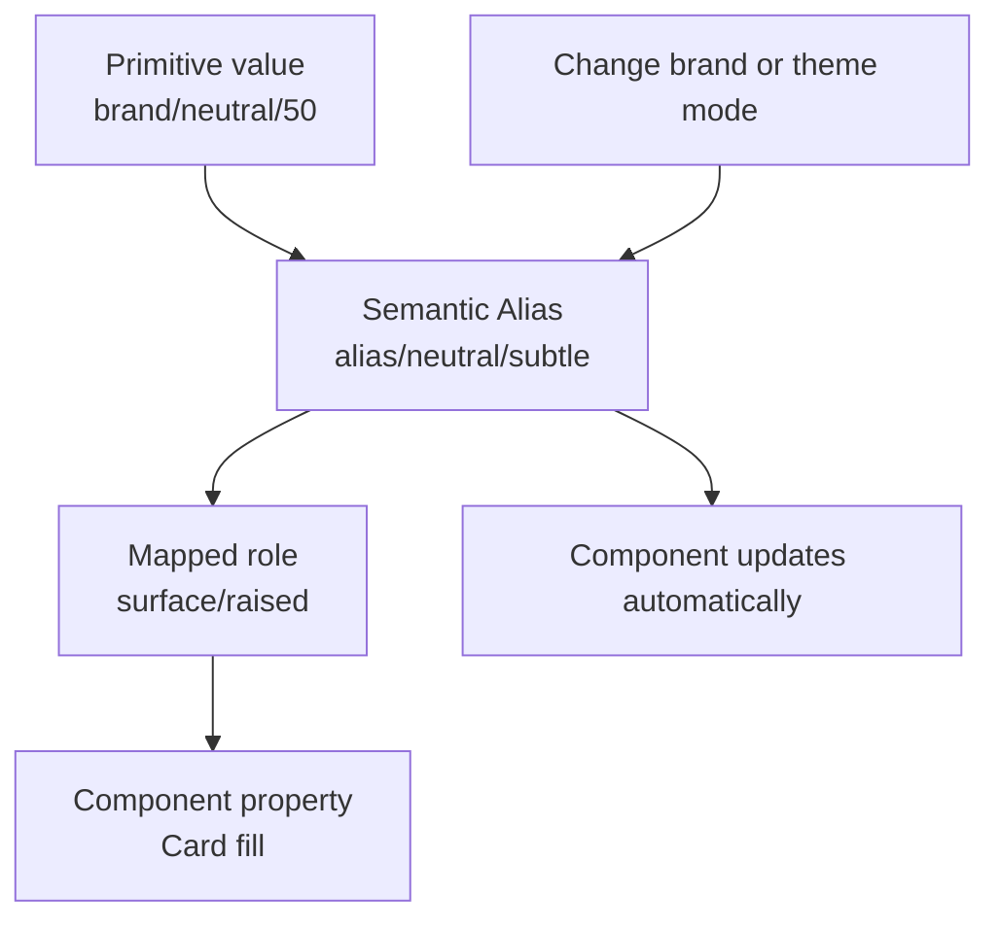

# 017 — Surface Variables

## Module

**Multi-Brand, Themes & Mapped Variables**

## Video Timestamp

**46:20** — start time in the full-length course video

---

## Lesson Overview

Surface variables are purpose-based color tokens used for the backgrounds of pages, containers, cards, dialogs, inputs, and other interface elements.

Instead of applying primitive colors such as `neutral/50` or `neutral/900` directly to components, the design system introduces Mapped variables such as:

```text
surface/default
surface/raised
surface/sunken
surface/overlay
```

These variables describe the **role of a surface**, not its exact color.

As a result, the same component can automatically adapt across:

* Different brands
* Light and dark themes
* Different elevation levels
* Interactive states
* Different visual contexts

---

## Main Idea

The purpose of this lesson is to build a collection of Mapped surface and background tokens for different interface layers.

Typical surface roles include:

* **Default:** the primary page or application background
* **Raised:** containers visually positioned above the default surface
* **Sunken:** recessed areas positioned below the surrounding surface
* **Overlay:** temporary content displayed above the main interface
* **Interactive:** clickable or selectable surfaces
* **Disabled:** unavailable or inactive surfaces

These tokens allow components to communicate hierarchy without binding them directly to specific color values.

---

## Why Surface Variables Are Important

A modern interface usually contains several visual layers.

For example:

```text
Application background
    └── Section
         └── Card
              └── Dropdown menu
                   └── Tooltip
```

Each layer may need a slightly different background color so users can understand which elements are above, below, or separate from one another.

Without surface variables, designers may manually choose different shades for every component. This creates several problems:

* Inconsistent elevation
* Poor contrast
* Difficult theme switching
* Duplicate color decisions
* Components that fail in dark mode
* Components that are tied to one brand

Surface variables centralize these decisions.

---

## Surface Token Architecture

Surface variables normally belong to the **Mapped layer** of the token architecture.



### The three layers

#### 1. Brand primitives

These store literal values:

```text
brand/neutral/0    → #FFFFFF
brand/neutral/50   → #F7F8FA
brand/neutral/100  → #ECEEF2
brand/neutral/800  → #25282D
brand/neutral/900  → #17191C
brand/neutral/1000 → #000000
```

#### 2. Alias variables

These provide semantic access to the primitive scale:

```text
alias/neutral/lightest
alias/neutral/lighter
alias/neutral/darker
alias/neutral/darkest
```

#### 3. Mapped surface variables

These describe where the colors are used:

```text
surface/default
surface/raised
surface/sunken
surface/overlay
```

Components should normally consume the Mapped tokens rather than primitive or Alias values.

---

## Recommended Surface Roles

A practical surface token set may include the following groups.

### Base surfaces

| Token               | Purpose                        | Common usage                                             |
| ------------------- | ------------------------------ | -------------------------------------------------------- |
| `surface/default`   | Main application background    | Pages, dashboards, application shells                    |
| `surface/secondary` | Secondary background area      | Sidebars, grouped sections                               |
| `surface/tertiary`  | Additional visual separation   | Nested sections, secondary panels                        |
| `surface/inverse`   | High-contrast opposite surface | Dark banners in light mode or light banners in dark mode |

### Elevation surfaces

| Token             | Purpose                      | Common usage                        |
| ----------------- | ---------------------------- | ----------------------------------- |
| `surface/sunken`  | Recessed surface             | Input fields, wells, inset sections |
| `surface/raised`  | Slightly elevated surface    | Cards, panels, floating controls    |
| `surface/overlay` | Surface above normal content | Dialogs, menus, popovers            |
| `surface/scrim`   | Background behind overlays   | Modal backdrops, drawers            |

### State surfaces

| Token              | Purpose                     | Common usage                     |
| ------------------ | --------------------------- | -------------------------------- |
| `surface/hover`    | Hovered interactive surface | Menu items, table rows           |
| `surface/pressed`  | Pressed or active surface   | Buttons, tabs, selected controls |
| `surface/selected` | Selected surface            | Selected rows, active options    |
| `surface/disabled` | Disabled surface            | Disabled inputs and controls     |

### Status surfaces

| Token                 | Purpose                          | Common usage        |
| --------------------- | -------------------------------- | ------------------- |
| `surface/information` | Informational content            | Information banners |
| `surface/success`     | Positive feedback                | Success messages    |
| `surface/warning`     | Cautionary feedback              | Warning banners     |
| `surface/danger`      | Destructive or critical feedback | Error alerts        |

---

## Elevation and Layering Convention

Surface variables can communicate elevation by changing background color, shadow, border, or a combination of these properties.

A simple elevation model might look like this:



### Example hierarchy

```text
surface/overlay
      ↑
surface/raised
      ↑
surface/default
      ↑
surface/sunken
```

However, elevation should not depend on color alone. A complete elevation system may combine:

* Surface color
* Border color
* Box shadow
* Background blur
* Opacity
* Spacing and overlap

---

## Light and Dark Theme Mapping

The meaning of a surface token remains stable, but its underlying value changes by mode.

| Mapped token        | Light theme           | Dark theme           |
| ------------------- | --------------------- | -------------------- |
| `surface/default`   | `alias/neutral/white` | `alias/neutral/950`  |
| `surface/secondary` | `alias/neutral/50`    | `alias/neutral/900`  |
| `surface/sunken`    | `alias/neutral/100`   | `alias/neutral/1000` |
| `surface/raised`    | `alias/neutral/white` | `alias/neutral/850`  |
| `surface/overlay`   | `alias/neutral/white` | `alias/neutral/800`  |
| `surface/scrim`     | `alias/black/60%`     | `alias/black/75%`    |

The component still uses the same variable:

```text
surface/raised
```

Only the selected mode changes.

---

## Multi-Brand Mapping

The same surface role may map to different brand-specific values.

For example:

| Surface role        | Brand A            | Brand B            |
| ------------------- | ------------------ | ------------------ |
| `surface/default`   | Cool neutral white | Warm neutral white |
| `surface/secondary` | Blue-gray tint     | Beige tint         |
| `surface/selected`  | Blue tint          | Purple tint        |
| `surface/inverse`   | Navy               | Dark violet        |

The component remains brand-agnostic:

```text
Card background → surface/raised
```

The selected brand mode determines the final rendered color.

---

## Suggested Figma Variable Structure

A clear naming structure could be:

```text
Mapped
└── Surface
    ├── Base
    │   ├── default
    │   ├── secondary
    │   ├── tertiary
    │   └── inverse
    │
    ├── Elevation
    │   ├── sunken
    │   ├── raised
    │   ├── overlay
    │   └── scrim
    │
    ├── State
    │   ├── hover
    │   ├── pressed
    │   ├── selected
    │   └── disabled
    │
    └── Status
        ├── information
        ├── success
        ├── warning
        └── danger
```

In Figma, slash-separated variable names can be used to create these groups:

```text
surface/base/default
surface/base/secondary
surface/elevation/sunken
surface/elevation/raised
surface/elevation/overlay
surface/state/hover
surface/state/selected
surface/status/danger
```

---

## Implementation Process in Figma

### Step 1: Review existing surfaces

Identify all background roles currently used in the design:

* Application backgrounds
* Cards
* Sidebars
* Input fields
* Menus
* Dialogs
* Tooltips
* Selected rows
* Alert messages

Do not begin by creating a token for every component. First identify the repeated visual roles.

---

### Step 2: Create the surface group

Inside the Mapped collection, create a group named:

```text
surface
```

Add the essential variables first:

```text
surface/default
surface/raised
surface/sunken
surface/overlay
```

Additional roles can be introduced when the interface requires them.

---

### Step 3: Configure modes

Create the required modes, such as:

```text
Brand A — Light
Brand A — Dark
Brand B — Light
Brand B — Dark
```

Alternatively, brand and theme may be handled in separate collections, depending on the design-system architecture.

---

### Step 4: Map each variable to an Alias token

Example:

```text
surface/default
├── Brand A Light → alias/neutral/lightest
├── Brand A Dark  → alias/neutral/darkest
├── Brand B Light → alias/neutral/warm-lightest
└── Brand B Dark  → alias/neutral/warm-darkest
```

Avoid entering raw hex values directly into the Mapped collection.

---

### Step 5: Apply tokens to design layers

Bind surface variables to the fill property of relevant layers.

Examples:

```text
Application frame → surface/default
Sidebar           → surface/secondary
Card              → surface/raised
Input field       → surface/sunken
Dialog            → surface/overlay
Modal backdrop    → surface/scrim
```

---

### Step 6: Test theme switching

Switch between every supported mode and check:

* Whether elevation remains understandable
* Whether adjacent surfaces remain distinguishable
* Whether text has sufficient contrast
* Whether borders remain visible
* Whether overlays feel visually above the page
* Whether selected and hover states remain recognizable

---

## Component Examples

### Page layout

```text
Page
└── Fill: surface/default
```

### Card

```text
Card
├── Fill: surface/raised
├── Border: border/subtle
└── Shadow: elevation/low
```

### Input field

```text
Input
├── Fill: surface/sunken
├── Border: border/default
├── Text: text/primary
└── Placeholder: text/secondary
```

### Dialog

```text
Dialog
├── Fill: surface/overlay
├── Border: border/subtle
└── Shadow: elevation/high
```

### Selected table row

```text
Table row
└── Selected fill: surface/selected
```

---

## Relationship Between Surface and Text Tokens

Surface and text tokens must be designed together.

A text color that works on `surface/default` may not work on `surface/inverse` or `surface/danger`.



For example:

```text
surface/default + text/primary
surface/raised + text/primary
surface/inverse + text/inverse
surface/danger + text/on-danger
```

Using coordinated token pairs reduces contrast problems.

---

## Naming by Purpose Instead of Appearance

Avoid names that describe only the visual value:

```text
surface/white
surface/light-gray
surface/dark-gray
```

These names become inaccurate when switching themes.

For example, `surface/white` may need to become nearly black in dark mode.

Prefer names that describe function:

```text
surface/default
surface/raised
surface/sunken
surface/overlay
```

The purpose remains stable even when the rendered color changes.

---

## Review Questions and Answers

### 1. What is the main purpose of Surface Variables?

Surface variables provide standardized, purpose-based background tokens for different layers and states of an interface.

They separate component design from literal color values, allowing surfaces to adapt automatically across brands and light or dark themes.

---

### 2. How would you apply this to a real Figma design system?

Create surface tokens inside the Mapped collection and connect each token to an Alias color variable.

For example:

```text
Card fill → surface/raised
Input fill → surface/sunken
Dialog fill → surface/overlay
Page fill → surface/default
```

Configure the variable values for every supported brand and theme mode. Components should use these Mapped tokens rather than primitive colors.

---

### 3. What are the key steps demonstrated in this lesson?

The key steps are:

1. Identify repeated surface roles in the interface.
2. Create purpose-based surface variables.
3. Organize them by base, elevation, state, and status.
4. Map them to Alias variables.
5. Configure values for each brand and theme mode.
6. Bind the tokens to component fill properties.
7. Test elevation, contrast, and theme switching.

---

### 4. What risk or limitation should you keep in mind?

The main risk is creating too many surface tokens without clearly defined roles.

For example:

```text
surface/card
surface/panel
surface/container
surface/box
surface/widget
```

These tokens may all represent the same visual role and create unnecessary complexity.

Another risk is assuming that changing the surface color alone is enough to communicate elevation. Some themes may require borders or shadows because neighboring surface colors are too similar.

Surface tokens must also be tested together with text, icon, and border tokens to maintain sufficient contrast.

---

## Best Practices

### Use a small foundational set

Begin with:

```text
surface/default
surface/raised
surface/sunken
surface/overlay
```

Add more roles only when there is a clear and repeated requirement.

### Keep components brand-agnostic

Components should not reference:

```text
brand-a/neutral/50
```

They should reference:

```text
surface/raised
```

### Avoid component-specific names

Prefer:

```text
surface/raised
```

instead of:

```text
surface/card
```

A raised surface can be reused by cards, panels, dropdowns, and floating controls.

### Test tokens in real combinations

Review surfaces together with:

* Text tokens
* Icon tokens
* Border tokens
* Focus tokens
* Shadow tokens

### Document the elevation model

Designers should understand when to use each role.

| Level | Surface token     | Intended meaning           |
| ----: | ----------------- | -------------------------- |
|     0 | `surface/sunken`  | Recessed or inset          |
|     1 | `surface/default` | Base application layer     |
|     2 | `surface/raised`  | Elevated container         |
|     3 | `surface/overlay` | Temporary foreground layer |

---

## Common Mistakes

### Applying primitive colors directly

```text
Card → neutral/0
```

This prevents the component from adapting consistently across modes.

Use:

```text
Card → surface/raised
```

### Creating tokens for individual components

```text
surface/card
surface/modal
surface/dropdown
```

This often causes duplication. A dialog and dropdown may both use `surface/overlay`.

### Using the same surface values in every theme

Dark mode usually needs a carefully designed elevation strategy. Simply reversing a neutral scale may produce unclear or overly bright layers.

### Ignoring contrast relationships

Changing the background without changing text, icons, and borders may create inaccessible combinations.

### Overusing subtle differences

If `surface/default` and `surface/raised` are nearly identical, users may not understand the interface hierarchy. Borders or shadows may also be needed.

---

## Final Token Flow



---

## Key Takeaway

Surface variables define the background hierarchy of the interface through stable, purpose-based roles.

```text
Brand primitive
      ↓
Alias color
      ↓
Mapped surface role
      ↓
Component fill
```

Components bind to roles such as `surface/default`, `surface/raised`, `surface/sunken`, and `surface/overlay`. The variable modes then determine the appropriate color for each brand and theme.

This keeps the design system:

* Consistent
* Theme-ready
* Multi-brand compatible
* Easier to maintain
* Less dependent on literal color values

---

## Lesson Summary

Surface Variables extend the Mapped token layer with purpose-based background roles for pages, containers, elevated elements, recessed areas, and overlays.

By connecting these roles to Alias variables, a component can use the same surface token across multiple brands and light or dark themes. The exact color changes by mode, while the purpose of the token remains stable.

> **Transcript note:** The supplied transcript excerpt discusses font sizes and line-height calculations using ratios such as `1.6` and `1.2`. It likely belongs to a typography or line-height variables lesson rather than this Surface Variables lesson.
