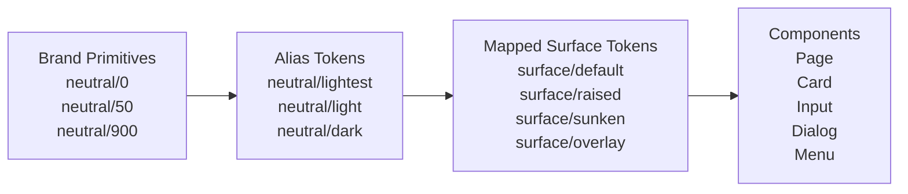
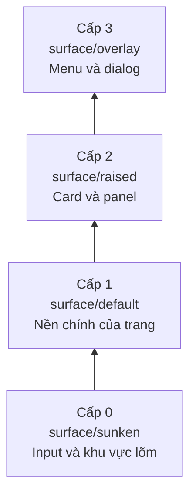
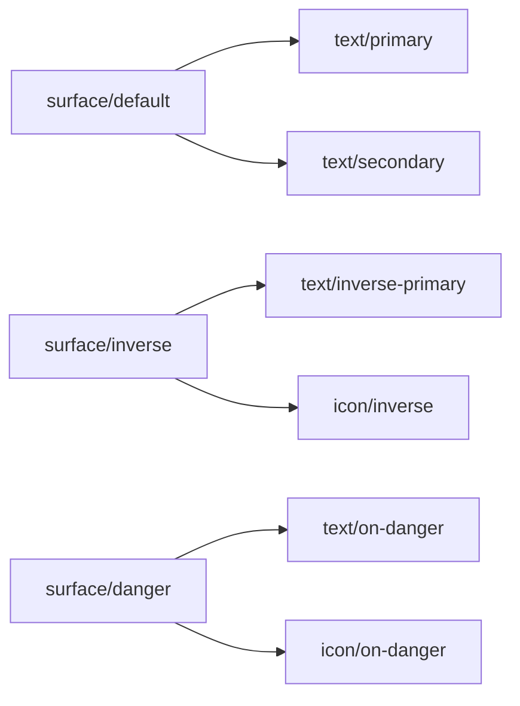
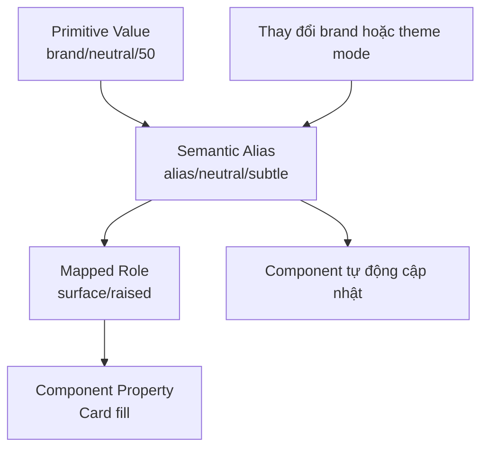

# 017 — Surface Variables

## Module

**Multi-Brand, Themes & Mapped Variables**

## Thời điểm trong video

**46:20** — thời điểm bắt đầu bài học trong video đầy đủ

---

## Tổng quan bài học

Surface Variables là các biến màu theo mục đích sử dụng, được dùng cho phần nền của:

* Trang
* Khu vực nội dung
* Card
* Sidebar
* Input
* Menu
* Dialog
* Tooltip
* Overlay

Thay vì gán trực tiếp các màu Primitive như:

```text
neutral/50
neutral/900
```

hệ thống thiết kế sẽ sử dụng các biến thuộc lớp Mapped như:

```text
surface/default
surface/raised
surface/sunken
surface/overlay
```

Các biến này mô tả **vai trò của bề mặt**, thay vì mô tả một màu sắc cụ thể.

Nhờ đó, cùng một component có thể tự động thích ứng với:

* Nhiều thương hiệu
* Light Mode và Dark Mode
* Nhiều cấp độ chiều sâu
* Các trạng thái tương tác
* Các ngữ cảnh giao diện khác nhau

---

## Ý tưởng chính

Mục tiêu của bài học là xây dựng một tập hợp các token bề mặt và màu nền trong lớp Mapped.

Các vai trò phổ biến gồm:

* **Default:** bề mặt nền chính của trang hoặc ứng dụng
* **Raised:** bề mặt được nâng lên so với nền chính
* **Sunken:** bề mặt lõm xuống hoặc nằm bên trong một khu vực
* **Overlay:** bề mặt tạm thời nằm phía trên nội dung chính
* **Interactive:** bề mặt có thể tương tác
* **Disabled:** bề mặt của thành phần đang bị vô hiệu hóa

Các token này giúp thể hiện thứ bậc giao diện mà không cần liên kết component với một màu cụ thể.

---

## Tại sao Surface Variables quan trọng?

Một giao diện hiện đại thường có nhiều lớp bề mặt.

Ví dụ:

```text
Nền ứng dụng
    └── Khu vực nội dung
         └── Card
              └── Dropdown
                   └── Tooltip
```

Mỗi lớp có thể cần một màu nền hơi khác nhau để người dùng nhận biết:

* Thành phần nào nằm phía trên
* Thành phần nào nằm bên trong
* Thành phần nào tách biệt
* Thành phần nào đang nổi trên giao diện

Nếu không sử dụng Surface Variables, designer có thể chọn màu thủ công cho từng component.

Điều này dễ gây ra:

* Cấp độ bề mặt không nhất quán
* Độ tương phản kém
* Khó chuyển đổi theme
* Lặp lại quyết định màu sắc
* Component không hoạt động tốt trong Dark Mode
* Component bị phụ thuộc vào một thương hiệu cụ thể

Surface Variables giúp tập trung và chuẩn hóa các quyết định này.

---

## Kiến trúc Surface Token

Surface Variables thường nằm trong lớp **Mapped** của hệ thống token.



### Ba lớp token

#### 1. Brand Primitives

Lưu các giá trị màu cụ thể:

```text
brand/neutral/0    → #FFFFFF
brand/neutral/50   → #F7F8FA
brand/neutral/100  → #ECEEF2
brand/neutral/800  → #25282D
brand/neutral/900  → #17191C
brand/neutral/1000 → #000000
```

#### 2. Alias Variables

Cung cấp tên gọi có ý nghĩa ngữ nghĩa cho các giá trị Primitive:

```text
alias/neutral/lightest
alias/neutral/lighter
alias/neutral/darker
alias/neutral/darkest
```

#### 3. Mapped Surface Variables

Mô tả nơi màu được sử dụng:

```text
surface/default
surface/raised
surface/sunken
surface/overlay
```

Component nên sử dụng Mapped Token thay vì tham chiếu trực tiếp đến Primitive hoặc Alias.

---

## Các vai trò Surface được đề xuất

Một hệ thống Surface Token thực tế có thể được chia thành các nhóm sau.

### Base Surfaces

| Token               | Mục đích                     | Trường hợp sử dụng                  |
| ------------------- | ---------------------------- | ----------------------------------- |
| `surface/default`   | Nền chính của ứng dụng       | Trang, dashboard, application shell |
| `surface/secondary` | Nền phụ                      | Sidebar, khu vực được nhóm          |
| `surface/tertiary`  | Tạo thêm phân tách trực quan | Khu vực lồng nhau, panel phụ        |
| `surface/inverse`   | Nền có độ tương phản ngược   | Banner tối trong Light Mode         |

### Elevation Surfaces

| Token             | Mục đích                       | Trường hợp sử dụng              |
| ----------------- | ------------------------------ | ------------------------------- |
| `surface/sunken`  | Bề mặt lõm xuống               | Input, inset area, content well |
| `surface/raised`  | Bề mặt được nâng nhẹ           | Card, panel, floating control   |
| `surface/overlay` | Bề mặt nằm trên nội dung chính | Dialog, menu, popover           |
| `surface/scrim`   | Lớp nền phía sau overlay       | Modal backdrop, drawer backdrop |

### State Surfaces

| Token              | Mục đích                  | Trường hợp sử dụng     |
| ------------------ | ------------------------- | ---------------------- |
| `surface/hover`    | Trạng thái di chuột       | Menu item, table row   |
| `surface/pressed`  | Trạng thái đang nhấn      | Button, tab, control   |
| `surface/selected` | Trạng thái được chọn      | Table row, option      |
| `surface/disabled` | Trạng thái bị vô hiệu hóa | Input, button, control |

### Status Surfaces

| Token                 | Mục đích           | Trường hợp sử dụng |
| --------------------- | ------------------ | ------------------ |
| `surface/information` | Thông tin          | Information banner |
| `surface/success`     | Thành công         | Success message    |
| `surface/warning`     | Cảnh báo           | Warning banner     |
| `surface/danger`      | Lỗi hoặc nguy hiểm | Error alert        |

---

## Quy ước độ cao và phân lớp

Surface Variables có thể truyền tải cảm giác về độ cao thông qua:

* Màu nền
* Border
* Shadow
* Blur
* Opacity
* Khoảng cách
* Sự chồng lấn

Một mô hình phân lớp đơn giản:



### Thứ tự phân lớp

```text
surface/overlay
      ↑
surface/raised
      ↑
surface/default
      ↑
surface/sunken
```

Không nên chỉ dựa vào màu nền để truyền tải độ cao.

Một hệ thống elevation hoàn chỉnh có thể kết hợp:

* Surface color
* Border color
* Box shadow
* Background blur
* Opacity
* Spacing
* Overlap

---

## Ánh xạ Light Mode và Dark Mode

Ý nghĩa của token không thay đổi, nhưng giá trị màu bên dưới sẽ thay đổi theo mode.

| Mapped Token        | Light Mode            | Dark Mode            |
| ------------------- | --------------------- | -------------------- |
| `surface/default`   | `alias/neutral/white` | `alias/neutral/950`  |
| `surface/secondary` | `alias/neutral/50`    | `alias/neutral/900`  |
| `surface/sunken`    | `alias/neutral/100`   | `alias/neutral/1000` |
| `surface/raised`    | `alias/neutral/white` | `alias/neutral/850`  |
| `surface/overlay`   | `alias/neutral/white` | `alias/neutral/800`  |
| `surface/scrim`     | `alias/black/60%`     | `alias/black/75%`    |

Component vẫn sử dụng cùng một biến:

```text
surface/raised
```

Chỉ có mode của biến thay đổi.

---

## Ánh xạ cho nhiều thương hiệu

Cùng một vai trò Surface có thể ánh xạ đến những màu khác nhau giữa các thương hiệu.

| Vai trò             | Brand A               | Brand B             |
| ------------------- | --------------------- | ------------------- |
| `surface/default`   | Trắng trung tính lạnh | Trắng trung tính ấm |
| `surface/secondary` | Xám xanh nhạt         | Beige nhạt          |
| `surface/selected`  | Xanh dương nhạt       | Tím nhạt            |
| `surface/inverse`   | Xanh navy             | Tím đậm             |

Component không cần biết thương hiệu đang được sử dụng:

```text
Card background → surface/raised
```

Mode của thương hiệu sẽ quyết định màu cuối cùng.

---

## Cấu trúc biến được đề xuất trong Figma

Một cấu trúc rõ ràng có thể được tổ chức như sau:

```text
Mapped
└── Surface
    ├── Base
    │   ├── default
    │   ├── secondary
    │   ├── tertiary
    │   └── inverse
    │
    ├── Elevation
    │   ├── sunken
    │   ├── raised
    │   ├── overlay
    │   └── scrim
    │
    ├── State
    │   ├── hover
    │   ├── pressed
    │   ├── selected
    │   └── disabled
    │
    └── Status
        ├── information
        ├── success
        ├── warning
        └── danger
```

Trong Figma, có thể dùng dấu `/` để tạo nhóm:

```text
surface/base/default
surface/base/secondary
surface/elevation/sunken
surface/elevation/raised
surface/elevation/overlay
surface/state/hover
surface/state/selected
surface/status/danger
```

---

## Quy trình triển khai trong Figma

### Bước 1: Kiểm tra các bề mặt hiện có

Xác định tất cả vai trò nền đang được dùng trong thiết kế:

* Application background
* Card
* Sidebar
* Input
* Menu
* Dialog
* Tooltip
* Selected row
* Alert

Không nên tạo một token riêng cho mọi component.

Trước tiên, hãy tìm các vai trò trực quan được lặp lại.

---

### Bước 2: Tạo nhóm Surface

Trong collection Mapped, tạo nhóm:

```text
surface
```

Bắt đầu với các biến quan trọng nhất:

```text
surface/default
surface/raised
surface/sunken
surface/overlay
```

Chỉ bổ sung thêm token khi có nhu cầu thực tế.

---

### Bước 3: Tạo các Mode

Ví dụ:

```text
Brand A — Light
Brand A — Dark
Brand B — Light
Brand B — Dark
```

Thương hiệu và theme cũng có thể được tách thành các collection riêng, tùy theo kiến trúc hệ thống.

---

### Bước 4: Ánh xạ mỗi biến đến Alias Token

Ví dụ:

```text
surface/default
├── Brand A Light → alias/neutral/lightest
├── Brand A Dark  → alias/neutral/darkest
├── Brand B Light → alias/neutral/warm-lightest
└── Brand B Dark  → alias/neutral/warm-darkest
```

Không nên nhập trực tiếp mã màu hex vào collection Mapped.

---

### Bước 5: Áp dụng token vào các layer

Gắn Surface Variable vào thuộc tính Fill của layer.

Ví dụ:

```text
Application frame → surface/default
Sidebar           → surface/secondary
Card              → surface/raised
Input field       → surface/sunken
Dialog            → surface/overlay
Modal backdrop    → surface/scrim
```

---

### Bước 6: Kiểm tra chuyển đổi Theme

Chuyển qua tất cả mode được hỗ trợ và kiểm tra:

* Các cấp elevation có còn rõ ràng không?
* Các bề mặt liền kề có phân biệt được không?
* Text có đủ độ tương phản không?
* Border có còn nhìn thấy không?
* Overlay có tạo cảm giác nằm trên trang không?
* Hover và selected có dễ nhận biết không?

---

## Ví dụ áp dụng cho Component

### Page

```text
Page
└── Fill: surface/default
```

### Card

```text
Card
├── Fill: surface/raised
├── Border: border/subtle
└── Shadow: elevation/low
```

### Input

```text
Input
├── Fill: surface/sunken
├── Border: border/default
├── Text: text/primary
└── Placeholder: text/secondary
```

### Dialog

```text
Dialog
├── Fill: surface/overlay
├── Border: border/subtle
└── Shadow: elevation/high
```

### Table Row được chọn

```text
Table row
└── Selected fill: surface/selected
```

---

## Mối quan hệ giữa Surface và Text Token

Surface Token và Text Token phải được thiết kế cùng nhau.

Một màu chữ hoạt động tốt trên `surface/default` chưa chắc hoạt động tốt trên:

* `surface/inverse`
* `surface/danger`
* `surface/selected`
* `surface/overlay`



Ví dụ:

```text
surface/default + text/primary
surface/raised + text/primary
surface/inverse + text/inverse
surface/danger + text/on-danger
```

Sử dụng các cặp token phối hợp giúp hạn chế lỗi tương phản.

---

## Đặt tên theo mục đích thay vì màu sắc

Không nên đặt tên như:

```text
surface/white
surface/light-gray
surface/dark-gray
```

Các tên này sẽ trở nên không chính xác khi chuyển theme.

Ví dụ, `surface/white` có thể phải chuyển thành màu gần đen trong Dark Mode.

Nên sử dụng tên theo mục đích:

```text
surface/default
surface/raised
surface/sunken
surface/overlay
```

Mục đích của token vẫn giữ nguyên dù màu hiển thị thay đổi.

---

## Câu hỏi ôn tập và trả lời

### 1. Mục đích chính của Surface Variables là gì?

Surface Variables cung cấp các token nền theo mục đích sử dụng cho nhiều lớp và trạng thái của giao diện.

Chúng tách component khỏi giá trị màu cụ thể, giúp component tự động thích ứng với:

* Nhiều thương hiệu
* Light Mode
* Dark Mode
* Nhiều trạng thái khác nhau

---

### 2. Áp dụng Surface Variables vào một Design System thực tế như thế nào?

Tạo các Surface Token trong Mapped Collection, sau đó liên kết mỗi token đến một Alias Color Variable.

Ví dụ:

```text
Card fill → surface/raised
Input fill → surface/sunken
Dialog fill → surface/overlay
Page fill → surface/default
```

Thiết lập giá trị cho từng brand và theme mode.

Component chỉ nên sử dụng các Mapped Token này, thay vì sử dụng trực tiếp Primitive Color.

---

### 3. Các bước chính được trình bày trong bài học là gì?

1. Xác định các vai trò Surface được lặp lại.
2. Tạo Surface Variables theo mục đích sử dụng.
3. Tổ chức token theo Base, Elevation, State và Status.
4. Ánh xạ Surface Token đến Alias Variable.
5. Cấu hình giá trị cho từng brand và theme.
6. Áp dụng token vào thuộc tính Fill của component.
7. Kiểm tra elevation, contrast và khả năng chuyển theme.

---

### 4. Rủi ro hoặc hạn chế cần lưu ý là gì?

Rủi ro lớn nhất là tạo quá nhiều Surface Token mà không có vai trò rõ ràng.

Ví dụ:

```text
surface/card
surface/panel
surface/container
surface/box
surface/widget
```

Các token này có thể đang mô tả cùng một vai trò và làm hệ thống trở nên phức tạp.

Một rủi ro khác là cho rằng chỉ cần thay đổi màu nền là đủ để truyền tải elevation.

Trong một số theme, các bề mặt có thể quá giống nhau. Khi đó cần kết hợp thêm:

* Border
* Shadow
* Blur
* Spacing
* Overlap

Surface Token cũng cần được kiểm tra cùng Text, Icon và Border Token để đảm bảo độ tương phản.

---

## Các nguyên tắc nên áp dụng

### Bắt đầu với một bộ token nhỏ

Nên bắt đầu với:

```text
surface/default
surface/raised
surface/sunken
surface/overlay
```

Chỉ tạo thêm khi có nhu cầu rõ ràng và lặp lại.

### Giữ component độc lập với thương hiệu

Không nên sử dụng:

```text
brand-a/neutral/50
```

Nên sử dụng:

```text
surface/raised
```

### Hạn chế tên theo component

Nên sử dụng:

```text
surface/raised
```

thay vì:

```text
surface/card
```

Một bề mặt được nâng lên có thể được dùng cho:

* Card
* Panel
* Dropdown
* Floating control
* Menu

### Kiểm tra token trong tổ hợp thực tế

Surface Token cần được kiểm tra cùng với:

* Text Token
* Icon Token
* Border Token
* Focus Token
* Shadow Token

### Ghi lại quy tắc elevation

Designer cần hiểu rõ khi nào nên dùng từng token.

| Cấp độ | Surface Token     | Ý nghĩa                        |
| -----: | ----------------- | ------------------------------ |
|      0 | `surface/sunken`  | Khu vực lõm hoặc nằm bên trong |
|      1 | `surface/default` | Bề mặt nền chính               |
|      2 | `surface/raised`  | Container được nâng lên        |
|      3 | `surface/overlay` | Lớp tạm thời nằm trên cùng     |

---

## Các lỗi thường gặp

### Gán Primitive Color trực tiếp

Không nên:

```text
Card → neutral/0
```

Điều này khiến component khó thích ứng với các mode.

Nên dùng:

```text
Card → surface/raised
```

### Tạo token riêng cho từng component

Không nên:

```text
surface/card
surface/modal
surface/dropdown
```

Dialog và dropdown có thể cùng sử dụng:

```text
surface/overlay
```

### Sử dụng cùng một giá trị trong mọi theme

Dark Mode cần một chiến lược elevation riêng.

Chỉ đảo ngược thang màu trung tính có thể tạo ra:

* Lớp bề mặt không rõ ràng
* Màu quá sáng
* Độ tương phản không hợp lý
* Giao diện thiếu chiều sâu

### Bỏ qua mối quan hệ về độ tương phản

Thay đổi màu nền mà không thay đổi:

* Text
* Icon
* Border
* Focus state

có thể khiến giao diện không đạt yêu cầu về khả năng tiếp cận.

### Sử dụng khác biệt màu quá nhỏ

Nếu `surface/default` và `surface/raised` gần như giống nhau, người dùng có thể không nhận biết được thứ bậc giao diện.

Khi đó cần bổ sung border hoặc shadow.

---

## Luồng token hoàn chỉnh



---

## Điểm chính cần ghi nhớ

Surface Variables xác định hệ thống phân lớp nền của giao diện thông qua các vai trò ổn định và có ý nghĩa.

```text
Brand Primitive
      ↓
Alias Color
      ↓
Mapped Surface Role
      ↓
Component Fill
```

Component liên kết với các vai trò như:

```text
surface/default
surface/raised
surface/sunken
surface/overlay
```

Mode của biến sẽ quyết định màu phù hợp cho từng thương hiệu và theme.

Cách tiếp cận này giúp Design System:

* Nhất quán hơn
* Hỗ trợ nhiều theme
* Hỗ trợ nhiều thương hiệu
* Dễ bảo trì
* Ít phụ thuộc vào mã màu cụ thể

---

## Tóm tắt bài học

Surface Variables mở rộng lớp Mapped bằng các token nền theo mục đích sử dụng dành cho:

* Trang
* Container
* Thành phần được nâng lên
* Khu vực lõm
* Overlay
* Trạng thái tương tác
* Trạng thái thông báo

Bằng cách liên kết Surface Token với Alias Variable, cùng một component có thể sử dụng một token duy nhất trên nhiều thương hiệu và nhiều theme.

Màu thực tế thay đổi theo mode, nhưng ý nghĩa của token vẫn giữ nguyên.

> **Lưu ý về transcript:** Phần transcript được cung cấp nói về kích thước chữ và cách tính line-height bằng các tỷ lệ như `1.6` và `1.2`. Nội dung đó có khả năng thuộc một bài học về Typography Variables hoặc Line Height Variables, không phải Surface Variables.
