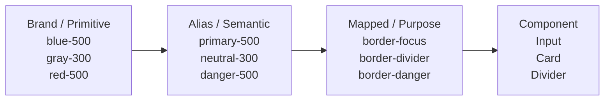
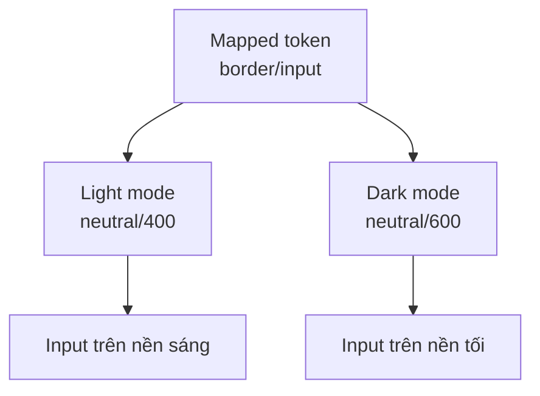
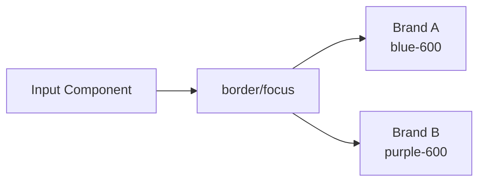

# 018 — Border Variables

## Thông tin bài học

| Thuộc tính            | Nội dung                                                                               |
| --------------------- | -------------------------------------------------------------------------------------- |
| **Module**            | Multi-Brand, Themes & Mapped Variables                                                 |
| **Thời điểm bắt đầu** | 49:02 trong video đầy đủ                                                               |
| **Chủ đề**            | Xây dựng các biến màu đường viền ở tầng Mapped                                         |
| **Mục tiêu chính**    | Tạo các token màu viền theo mục đích sử dụng như divider, input outline và focus state |

---

## 1. Border Variables là gì?

**Border Variables** là các biến thiết kế dùng để kiểm soát màu sắc của đường viền trong giao diện.

Thay vì gán trực tiếp một mã màu như:

```text
#D1D5DB
```

vào một component, chúng ta sử dụng một token có ý nghĩa rõ ràng hơn:

```text
border/default
border/divider
border/input
border/focus
border/danger
```

Các token này thuộc tầng **Mapped**, nghĩa là chúng mô tả:

> Đường viền được dùng để làm gì trong giao diện?

Thay vì mô tả:

> Đường viền đang sử dụng màu nào?

---

## 2. Vai trò của Border Variables trong hệ thống token

Một hệ thống design token thường có ba tầng:



Ví dụ:

```text
Brand:
blue/500 = #3366FF

Alias:
color/primary/500 → blue/500

Mapped:
border/focus → color/primary/500

Component:
Input Focus Border → border/focus
```

Khi màu thương hiệu hoặc theme thay đổi, component không cần được chỉnh sửa trực tiếp.

---

## 3. Mục đích chính của Border Variables

Border Variables giúp hệ thống thiết kế:

* Duy trì màu viền nhất quán trên toàn bộ sản phẩm.
* Phân biệt rõ từng vai trò của đường viền.
* Hỗ trợ nhiều thương hiệu bằng Variable Modes.
* Hỗ trợ light theme và dark theme.
* Thay đổi toàn bộ giao diện từ một vị trí trung tâm.
* Tránh việc component sử dụng màu nguyên thủy trực tiếp.
* Giữ trạng thái focus, error và disabled nhất quán.

---

## 4. Những nhóm Border Variables phổ biến

### 4.1. Border mặc định

Token:

```text
border/default
```

Dùng cho những đường viền thông thường như:

* Card.
* Container.
* Table.
* Dropdown.
* Panel.
* Modal.

Ví dụ:

```text
Card Border → border/default
```

---

### 4.2. Border nhẹ

Token:

```text
border/subtle
```

Dùng khi cần một đường viền nhẹ, ít nổi bật:

* Card nằm trên surface tương phản nhẹ.
* Nhóm nội dung phụ.
* Khung trang trí.
* Các vùng không cần nhấn mạnh.

```text
border/subtle
    ↓
Độ tương phản thấp hơn border/default
```

---

### 4.3. Divider

Token:

```text
border/divider
```

Divider dùng để phân tách các khu vực nội dung:

* Giữa các hàng trong danh sách.
* Giữa các mục trong menu.
* Giữa header và nội dung.
* Giữa các nhóm thiết lập.
* Giữa các cột trong bảng.

Ví dụ:

```text
List Item
──────────────  ← border/divider
List Item
──────────────
List Item
```

Divider thường có độ tương phản thấp hơn đường viền của input hoặc focus state.

---

### 4.4. Input outline

Token:

```text
border/input
```

Dùng cho trạng thái mặc định của:

* Text field.
* Textarea.
* Select.
* Date picker.
* Search field.
* Checkbox hoặc radio có outline.

Ví dụ:

```text
┌───────────────────────────┐
│ Email address             │
└───────────────────────────┘
          ↑
      border/input
```

Input outline cần đủ rõ để người dùng nhận biết vùng có thể tương tác, nhưng không nên nổi bật hơn nội dung chính.

---

### 4.5. Hover border

Token:

```text
border/hover
```

Dùng khi người dùng di chuột lên một thành phần tương tác:

```text
Default:
border/input

Hover:
border/hover
```

Border ở trạng thái hover thường có độ tương phản cao hơn trạng thái mặc định.

---

### 4.6. Focus border

Token:

```text
border/focus
```

Dùng khi component nhận focus thông qua:

* Bàn phím.
* Nhấp chuột.
* Điều hướng bằng phím Tab.
* Công nghệ hỗ trợ.

Ví dụ:

```text
┏━━━━━━━━━━━━━━━━━━━━━━━━━━━┓
┃ Email address             ┃
┗━━━━━━━━━━━━━━━━━━━━━━━━━━━┛
          ↑
      border/focus
```

Focus border thường sử dụng màu thương hiệu hoặc màu tương tác chính.

Ví dụ ánh xạ:

```text
border/focus
    ↓
alias/primary/500
    ↓
brand/blue/500
```

---

### 4.7. Error hoặc danger border

Token:

```text
border/danger
```

Dùng cho:

* Input không hợp lệ.
* Form có lỗi.
* Khu vực cảnh báo nguy hiểm.
* Component destructive.
* Thông báo lỗi.

Ví dụ:

```text
┌───────────────────────────┐
│ example@                  │
└───────────────────────────┘
Email không hợp lệ
```

Cả đường viền và thông báo lỗi có thể tham chiếu đến cùng một nhóm semantic danger:

```text
border/danger → alias/danger/500
text/danger   → alias/danger/600
icon/danger   → alias/danger/500
```

---

### 4.8. Success và warning border

Nếu hệ thống có nhiều trạng thái phản hồi, có thể bổ sung:

```text
border/success
border/warning
border/info
```

Ví dụ:

| Token            | Mục đích                                |
| ---------------- | --------------------------------------- |
| `border/success` | Dữ liệu hợp lệ hoặc thao tác thành công |
| `border/warning` | Cảnh báo cần chú ý                      |
| `border/info`    | Nội dung cung cấp thông tin             |
| `border/danger`  | Lỗi hoặc hành động nguy hiểm            |

---

### 4.9. Disabled border

Token:

```text
border/disabled
```

Dùng cho component không thể tương tác:

```text
Input mặc định  → border/input
Input disabled → border/disabled
```

Đường viền disabled thường có độ tương phản thấp hơn nhưng vẫn phải giúp người dùng nhận biết cấu trúc của component.

---

### 4.10. Inverse border

Token:

```text
border/inverse
```

Dùng trên các surface tối hoặc surface có màu tương phản:

* Hero section tối.
* Banner dùng màu thương hiệu.
* Button nền đậm.
* Overlay.
* Dark card trên light theme.

Ví dụ:

```text
Dark Surface
┌───────────────────────────┐
│ Border dùng màu sáng      │
└───────────────────────────┘
        border/inverse
```

---

## 5. Cấu trúc Border Variables đề xuất

```text
border/
├── default
├── subtle
├── strong
├── divider
├── input
├── hover
├── focus
├── disabled
├── inverse
├── success
├── warning
├── danger
└── info
```

Không phải hệ thống nào cũng cần toàn bộ token trên. Chỉ nên tạo token khi có một vai trò sử dụng thực tế và lặp lại.

---

## 6. Divider, Input Outline và Focus khác nhau như thế nào?

| Token            | Vai trò                            |     Độ nổi bật |
| ---------------- | ---------------------------------- | -------------: |
| `border/divider` | Phân tách nội dung                 |           Thấp |
| `border/subtle`  | Tạo ranh giới nhẹ                  |           Thấp |
| `border/default` | Đường viền thông thường            |     Trung bình |
| `border/input`   | Xác định vùng nhập liệu            |     Trung bình |
| `border/hover`   | Phản hồi khi di chuột              | Trung bình–cao |
| `border/focus`   | Thể hiện component đang nhận focus |            Cao |
| `border/danger`  | Thể hiện trạng thái lỗi            |            Cao |

Có thể hình dung mức độ nhấn mạnh như sau:

```text
Ít nổi bật
    │
    ├── border/subtle
    ├── border/divider
    ├── border/default
    ├── border/input
    ├── border/hover
    └── border/focus
    │
Nổi bật nhất
```

---

## 7. Kết hợp màu viền với độ dày đường viền

Border Variables trong bài học này tập trung vào **màu sắc**, nhưng màu viền cần được kết hợp với token về độ dày.

Ví dụ:

```text
Màu:
border/focus

Độ dày:
border-width/focus
```

Một component hoàn chỉnh có thể sử dụng:

```text
Input Default
├── Color: border/input
└── Width: border-width/default

Input Focus
├── Color: border/focus
└── Width: border-width/focus
```

---

## 8. Consistent Border Weight Pairing

**Consistent border weight pairing** nghĩa là mỗi loại màu viền nên được kết hợp nhất quán với một độ dày phù hợp.

Ví dụ:

| Trạng thái | Màu viền         |           Độ dày |
| ---------- | ---------------- | ---------------: |
| Default    | `border/input`   |            `1px` |
| Hover      | `border/hover`   |            `1px` |
| Focus      | `border/focus`   |            `2px` |
| Error      | `border/danger`  | `1px` hoặc `2px` |
| Divider    | `border/divider` |            `1px` |

Không nên để cùng một token `border/focus` lúc dùng với `1px`, lúc dùng với `3px` mà không có quy tắc rõ ràng.

---

## 9. Border và Focus Ring

Trong nhiều hệ thống, focus state không chỉ sử dụng border mà còn sử dụng **focus ring** bên ngoài component.

```text
┌───────────────────────────────┐  ← focus ring
│ ┌───────────────────────────┐ │
│ │ Input                     │ │ ← border
│ └───────────────────────────┘ │
└───────────────────────────────┘
```

Có thể tách token:

```text
border/focus
focus-ring/color
focus-ring/width
focus-ring/offset
```

Ví dụ:

```text
border/focus       → primary/600
focus-ring/color   → primary/300
focus-ring/width   → 3px
focus-ring/offset  → 2px
```

Cách này giúp focus state rõ ràng hơn mà không làm thay đổi kích thước của component.

---

## 10. Border Variables trong Light Theme và Dark Theme

Cùng một Mapped token có thể tham chiếu đến các giá trị khác nhau theo theme.

### Light theme

```text
border/default → neutral/300
border/divider → neutral/200
border/input   → neutral/400
border/focus   → primary/600
```

### Dark theme

```text
border/default → neutral/700
border/divider → neutral/800
border/input   → neutral/600
border/focus   → primary/400
```

Sơ đồ:



Component luôn sử dụng:

```text
border/input
```

Component không cần biết giao diện đang ở light mode hay dark mode.

---

## 11. Border Variables trong hệ thống đa thương hiệu

Giả sử có hai thương hiệu:

```text
Brand A → màu xanh dương
Brand B → màu tím
```

Token focus có thể được ánh xạ như sau:

| Mapped token    | Brand A     | Brand B     |
| --------------- | ----------- | ----------- |
| `border/focus`  | Blue 600    | Purple 600  |
| `border/input`  | Neutral 400 | Neutral 400 |
| `border/danger` | Red 600     | Red 600     |

Component vẫn chỉ tham chiếu:

```text
border/focus
```

Khi đổi mode thương hiệu, màu focus tự động thay đổi.



---

## 12. Cách áp dụng vào Figma Design System

### Bước 1: Kiểm tra các primitive hiện có

Đảm bảo Brand Collection có các thang màu cần thiết:

```text
neutral/0
neutral/100
neutral/200
neutral/300
...
neutral/900

primary/100
primary/200
...
primary/900

danger/100
danger/200
...
danger/900
```

---

### Bước 2: Kiểm tra Alias Collection

Các Alias Variables cần mô tả vai trò semantic của màu:

```text
color/neutral/weak
color/neutral/default
color/neutral/strong

color/primary/default
color/primary/strong

color/danger/default
color/success/default
color/warning/default
```

---

### Bước 3: Tạo nhóm Border trong Mapped Collection

Trong Figma Variables:

```text
Mapped
└── Border
    ├── default
    ├── subtle
    ├── divider
    ├── input
    ├── hover
    ├── focus
    ├── disabled
    ├── inverse
    └── danger
```

---

### Bước 4: Ánh xạ sang Alias Variables

Ví dụ:

```text
border/default  → color/neutral/default
border/subtle   → color/neutral/weak
border/divider  → color/neutral/weak
border/input    → color/neutral/default
border/hover    → color/neutral/strong
border/focus    → color/primary/default
border/disabled → color/neutral/weak
border/danger   → color/danger/default
```

---

### Bước 5: Thiết lập các mode

Ví dụ Mapped Collection có các mode:

```text
Brand A — Light
Brand A — Dark
Brand B — Light
Brand B — Dark
```

Bảng ánh xạ minh họa:

| Token            | Brand A Light | Brand A Dark | Brand B Light | Brand B Dark |
| ---------------- | ------------- | ------------ | ------------- | ------------ |
| `border/default` | Neutral 300   | Neutral 700  | Neutral 300   | Neutral 700  |
| `border/divider` | Neutral 200   | Neutral 800  | Neutral 200   | Neutral 800  |
| `border/input`   | Neutral 400   | Neutral 600  | Neutral 400   | Neutral 600  |
| `border/focus`   | Blue 600      | Blue 400     | Purple 600    | Purple 400   |
| `border/danger`  | Red 600       | Red 400      | Red 600       | Red 400      |

---

### Bước 6: Bind token vào component

Ví dụ với Input:

```text
Input / Default
Stroke → border/input

Input / Hover
Stroke → border/hover

Input / Focus
Stroke → border/focus

Input / Error
Stroke → border/danger

Input / Disabled
Stroke → border/disabled
```

---

### Bước 7: Kiểm tra component ở mọi mode

Cần kiểm tra ít nhất:

```text
✓ Brand A Light
✓ Brand A Dark
✓ Brand B Light
✓ Brand B Dark
```

Đặc biệt kiểm tra:

* Divider có bị biến mất trên surface hay không.
* Border input có đủ rõ hay không.
* Focus state có dễ nhận biết hay không.
* Danger border có đủ khác biệt với focus border hay không.
* Disabled border có quá mờ hay không.

---

## 13. Ví dụ áp dụng cho Input Component

### Trạng thái mặc định

```text
Surface: surface/default
Text: text/primary
Placeholder: text/secondary
Border: border/input
Border width: border-width/default
```

### Trạng thái hover

```text
Border: border/hover
```

### Trạng thái focus

```text
Border: border/focus
Focus ring: focus-ring/default
```

### Trạng thái error

```text
Border: border/danger
Supporting text: text/danger
Icon: icon/danger
```

### Trạng thái disabled

```text
Surface: surface/disabled
Text: text/disabled
Border: border/disabled
```

Sơ đồ trạng thái:

```mermaid
stateDiagram-v2
    [*] --> Default
    Default --> Hover: Pointer hover
    Hover --> Focus: Click hoặc Tab
    Default --> Focus: Keyboard Tab
    Focus --> Error: Validation failed
    Error --> Focus: User chỉnh sửa
    Default --> Disabled: Component bị vô hiệu hóa
```

---

## 14. Ví dụ áp dụng cho các component khác

### Card

```text
Card border → border/default
Nested card border → border/subtle
Selected card border → border/focus
```

### Table

```text
Table outer border → border/default
Row divider → border/divider
Selected row border → border/focus
```

### Modal

```text
Modal border → border/subtle
Modal separator → border/divider
```

### Button

```text
Secondary button → border/default
Secondary button hover → border/hover
Danger button outline → border/danger
```

### Checkbox

```text
Default → border/input
Hover → border/hover
Focus → border/focus
Error → border/danger
Disabled → border/disabled
```

---

## 15. Quy tắc đặt tên

Tên token nên mô tả **vai trò**, không mô tả giá trị màu.

### Nên sử dụng

```text
border/default
border/divider
border/input
border/focus
border/danger
```

### Không nên sử dụng

```text
border/gray-300
border/light-gray
border/blue
border/red
border/dark
```

Lý do:

```text
border/blue
```

sẽ không còn đúng về mặt ngữ nghĩa khi Brand B sử dụng màu tím hoặc khi dark theme sử dụng một sắc độ khác.

---

## 16. Những lỗi thường gặp

### 16.1. Component tham chiếu trực tiếp Primitive

Không nên:

```text
Input Border → neutral/400
```

Nên:

```text
Input Border → border/input
```

---

### 16.2. Dùng chung một token cho mọi loại border

Ví dụ không tốt:

```text
border/default
```

được dùng đồng thời cho:

* Divider.
* Input.
* Focus state.
* Error state.
* Disabled state.

Điều này khiến hệ thống khó điều chỉnh vì các vai trò có yêu cầu thị giác khác nhau.

---

### 16.3. Tạo quá nhiều token

Không nên tạo token theo từng component nếu vai trò giống nhau:

```text
border/card
border/modal
border/dropdown
border/table
border/sidebar
```

Nếu tất cả chỉ là đường viền mặc định, có thể sử dụng:

```text
border/default
```

Chỉ tạo token riêng khi có sự khác biệt có chủ đích và được sử dụng lặp lại.

---

### 16.4. Focus state chỉ dựa vào màu

Không nên chỉ đổi màu viền rất nhẹ để thể hiện focus.

Focus state nên có ít nhất một trong các yếu tố:

* Màu sắc rõ ràng.
* Độ dày khác biệt.
* Focus ring.
* Outline bên ngoài.
* Sự thay đổi tương phản đủ lớn.

---

### 16.5. Border làm thay đổi kích thước component

Nếu border mặc định là `1px` nhưng focus chuyển thành `2px`, component có thể bị thay đổi kích thước hoặc làm layout dịch chuyển.

Các giải pháp:

* Duy trì border `2px` ở mọi trạng thái nhưng dùng màu trong suốt ở trạng thái mặc định.
* Sử dụng focus ring hoặc outline bên ngoài.
* Dùng inner stroke nếu nền tảng hỗ trợ.
* Tính trước border trong kích thước component.

---

### 16.6. Border không đủ tương phản với surface

Một border có thể nhìn rõ trên nền trắng nhưng biến mất trên nền xám hoặc nền tối.

Do đó, cần đánh giá border cùng với surface:

```text
border/default + surface/default
border/default + surface/raised
border/divider + surface/sunken
border/inverse + surface/inverse
```

---

## 17. Rủi ro và giới hạn cần lưu ý

### Khả năng truy cập

Đường viền của form control và focus indicator cần đủ rõ để người dùng nhận biết:

* Vùng có thể tương tác.
* Component đang được chọn.
* Trạng thái lỗi.
* Trạng thái disabled.

Không nên đánh giá border riêng lẻ; cần kiểm tra độ tương phản giữa border và các màu nằm bên cạnh nó.

---

### Quá phụ thuộc vào màu sắc

Không nên dùng màu là tín hiệu duy nhất.

Ví dụ trạng thái error nên kết hợp:

```text
Border màu danger
+ Error icon
+ Supporting text
+ Nội dung mô tả lỗi
```

---

### Số lượng mode tăng nhanh

Khi kết hợp nhiều thương hiệu và nhiều theme:

```text
3 thương hiệu × 2 theme = 6 mode
```

Nếu có thêm high-contrast mode:

```text
3 thương hiệu × 3 theme = 9 mode
```

Mỗi Border Variable cần được kiểm tra ở tất cả các mode này.

---

### Mất đồng bộ giữa màu và độ dày

Nếu màu border được token hóa nhưng độ dày vẫn nhập thủ công, giao diện vẫn có thể thiếu nhất quán.

Nên quản lý đồng thời:

```text
border color
border width
border radius
focus ring
```

---

## 18. Checklist kiểm tra Border Variables

### Cấu trúc token

* [ ] Tên token mô tả đúng mục đích sử dụng.
* [ ] Component không tham chiếu trực tiếp Primitive Variables.
* [ ] Divider, input và focus có token riêng.
* [ ] Error, disabled và inverse được bổ sung khi cần.
* [ ] Không có quá nhiều token trùng vai trò.

### Theme và thương hiệu

* [ ] Border hiển thị rõ trong light theme.
* [ ] Border hiển thị rõ trong dark theme.
* [ ] Focus color phù hợp với từng thương hiệu.
* [ ] Danger color nhất quán giữa các thương hiệu.
* [ ] Divider không biến mất trên surface.

### Component

* [ ] Input có đủ các trạng thái default, hover, focus, error và disabled.
* [ ] Focus state không làm layout dịch chuyển.
* [ ] Border width được áp dụng nhất quán.
* [ ] Focus indicator dễ nhận biết bằng bàn phím.
* [ ] Error state không chỉ được biểu thị bằng màu sắc.

---

# Trả lời câu hỏi ôn tập

## 1. Mục đích chính của Border Variables là gì?

Mục đích chính của Border Variables là tạo một hệ thống token màu viền theo mục đích sử dụng như divider, input outline, focus, error và disabled.

Trong hệ thống đa thương hiệu và đa theme, component không sử dụng màu trực tiếp mà tham chiếu tới các token như:

```text
border/input
border/focus
border/danger
```

Các token này tự động đổi giá trị khi người dùng chuyển thương hiệu hoặc theme.

---

## 2. Áp dụng Border Variables vào một Figma Design System thực tế như thế nào?

Quy trình cơ bản:

1. Chuẩn bị thang màu ở Brand Collection.
2. Ánh xạ các màu sang Alias Collection.
3. Tạo nhóm `border` trong Mapped Collection.
4. Tạo các token như `border/divider`, `border/input` và `border/focus`.
5. Cấu hình giá trị cho từng brand và theme mode.
6. Bind các token vào component.
7. Kiểm tra component trong mọi trạng thái và mọi mode.

Ví dụ:

```text
Input / Default → border/input
Input / Hover   → border/hover
Input / Focus   → border/focus
Input / Error   → border/danger
```

---

## 3. Các bước và ý tưởng quan trọng trong bài học là gì?

Các ý tưởng chính gồm:

* Xác định các vai trò màu viền trong giao diện.
* Phân biệt divider, input outline và focus border.
* Tạo Border Variables ở tầng Mapped.
* Ánh xạ Mapped Variables sang Alias Variables.
* Thiết lập giá trị theo từng theme và thương hiệu.
* Bind token vào các component.
* Kết hợp màu border với độ dày border nhất quán.
* Kiểm tra focus state và khả năng truy cập.

---

## 4. Rủi ro hoặc giới hạn nào cần lưu ý?

Những rủi ro chính gồm:

* Border có độ tương phản quá thấp và khó nhận biết.
* Focus state không rõ ràng với người dùng bàn phím.
* Dùng màu sắc làm tín hiệu duy nhất cho error hoặc success.
* Dùng chung một token cho quá nhiều vai trò.
* Tạo quá nhiều token theo từng component.
* Border focus làm thay đổi kích thước component.
* Không kiểm tra token trên mọi surface, theme và thương hiệu.
* Màu border và độ dày border không được quản lý đồng bộ.

---

# Tóm tắt bài học

**Border Variables** mở rộng tầng Mapped bằng các token màu viền theo mục đích sử dụng.

Các token tiêu biểu:

```text
border/default
border/divider
border/input
border/hover
border/focus
border/disabled
border/danger
```

Component chỉ cần tham chiếu tới các Mapped Variables này. Khi brand hoặc theme thay đổi, các token sẽ tự động ánh xạ sang màu phù hợp mà không cần sửa từng component.

Mô hình tổng quát:

```text
Brand Primitive
      ↓
Semantic Alias
      ↓
Mapped Border Token
      ↓
Component State
```

Ví dụ:

```text
brand/blue/600
      ↓
alias/primary/strong
      ↓
border/focus
      ↓
Input / Focus
```

Bài học hoàn thiện nhóm token màu theo mục đích sử dụng trong Mapped Collection:

```text
Mapped Collection
├── Text Variables
├── Icon Variables
├── Surface Variables
└── Border Variables
```

Nhờ đó, hệ thống thiết kế có thể hỗ trợ nhiều thương hiệu và light/dark theme trong khi vẫn giữ component nhất quán, dễ bảo trì và dễ mở rộng.

---

# Bài luyện tập

## Mục tiêu


## Đề bài


## Yêu cầu hoàn thành

- [ ] 
- [ ] 
- [ ] 

## Kết quả / lời giải


## Ghi chú
