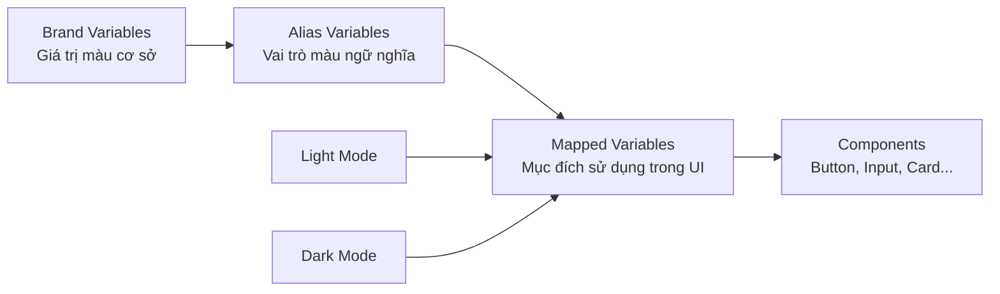
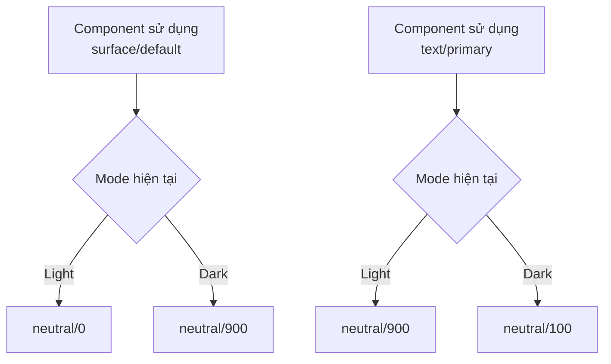
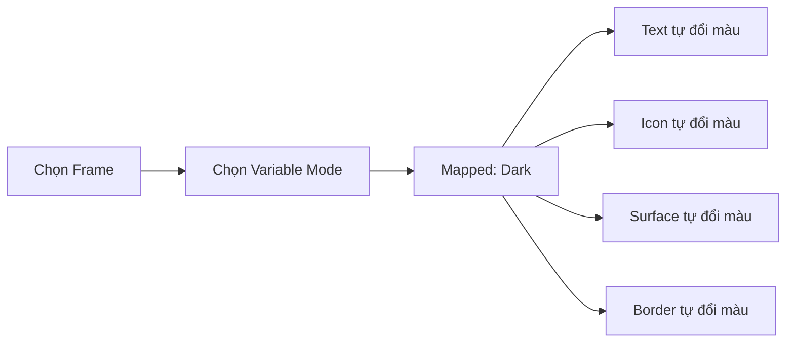
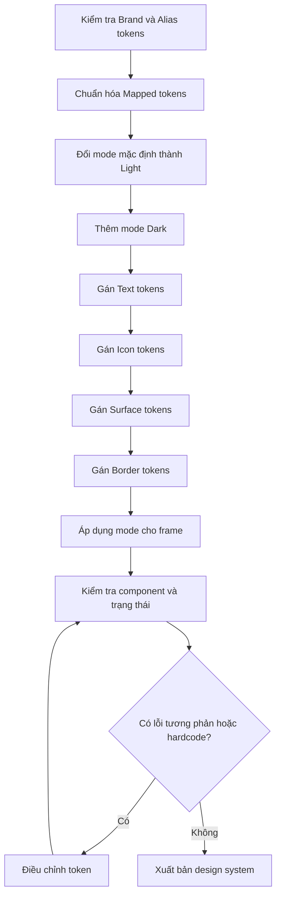

# 019 – Xây dựng chế độ tối trong Figma

## Thông tin bài học

| Nội dung            | Chi tiết                                                                                                          |
| ------------------- | ----------------------------------------------------------------------------------------------------------------- |
| **Module**          | Multi-Brand, Themes & Mapped Variables                                                                            |
| **Bài học**         | Building Dark Mode                                                                                                |
| **Thời điểm video** | 51:32                                                                                                             |
| **Chủ đề chính**    | Thêm chế độ Dark vào bộ sưu tập Mapped để toàn bộ giao diện tự động đổi màu mà không cần chỉnh sửa từng component |

---

## 1. Tổng quan

Bài học hướng dẫn cách xây dựng **Dark Mode** bằng hệ thống Variables trong Figma.

Thay vì tạo một phiên bản component riêng cho giao diện sáng và một phiên bản khác cho giao diện tối, chúng ta chỉ cần:

1. Thêm mode `Dark` vào collection `Mapped`.
2. Gán lại các Mapped token cho từng mode.
3. Áp dụng mode cho frame hoặc section.
4. Kiểm tra toàn bộ component ở cả Light Mode và Dark Mode.

Các component vẫn sử dụng cùng một nhóm token như:

```text
text/primary
icon/default
surface/default
border/default
```

Khi mode thay đổi, giá trị đứng sau các token này sẽ tự động đổi theo.

---

## 2. Mục đích chính của Building Dark Mode

Mục đích chính là tạo ra một hệ thống theme trong đó:

* Component không phụ thuộc trực tiếp vào màu cụ thể.
* Light Mode và Dark Mode sử dụng chung component.
* Màu chữ, biểu tượng, nền và đường viền tự động thay đổi.
* Có thể cập nhật theme ở một nơi thay vì sửa từng màn hình.
* Hệ thống dễ mở rộng sang nhiều thương hiệu và nhiều theme khác.

Ví dụ, một nút bấm không nên sử dụng trực tiếp:

```text
Fill: blue/600
Text: white
Border: gray/300
```

Thay vào đó, component nên sử dụng:

```text
Fill: surface/action-primary
Text: text/on-action
Border: border/action-primary
```

Giá trị thực tế của các token này được quyết định bởi mode đang hoạt động.

---

## 3. Kiến trúc Variables

Hệ thống có thể được tổ chức thành ba lớp:



### Brand Variables

Chứa các giá trị nguyên thủy:

```text
brand/blue/500
brand/blue/700
neutral/0
neutral/100
neutral/900
neutral/1000
```

### Alias Variables

Diễn tả vai trò màu:

```text
color/primary
color/neutral-light
color/neutral-dark
color/danger
color/success
```

### Mapped Variables

Diễn tả mục đích sử dụng trực tiếp trong giao diện:

```text
text/primary
text/secondary
icon/default
surface/default
surface/raised
border/default
border/focus
```

Component nên liên kết với **Mapped Variables**, không nên liên kết trực tiếp với màu Brand.

---

## 4. Cách Light Mode và Dark Mode hoạt động

Một Mapped token có thể trỏ tới các Alias token khác nhau trong từng mode.

Ví dụ:

| Mapped token      | Light Mode    | Dark Mode      |
| ----------------- | ------------- | -------------- |
| `text/primary`    | `neutral/900` | `neutral/100`  |
| `text/secondary`  | `neutral/600` | `neutral/400`  |
| `text/disabled`   | `neutral/400` | `neutral/600`  |
| `icon/default`    | `neutral/700` | `neutral/300`  |
| `surface/default` | `neutral/0`   | `neutral/900`  |
| `surface/raised`  | `neutral/50`  | `neutral/800`  |
| `surface/sunken`  | `neutral/100` | `neutral/1000` |
| `border/default`  | `neutral/300` | `neutral/700`  |
| `border/focus`    | `primary/600` | `primary/400`  |

Luồng thay đổi:



Component không thay đổi. Chỉ giá trị của Variables thay đổi theo mode.

---

## 5. Các bước xây dựng Dark Mode trong Figma

### Bước 1: Mở collection Mapped

Trong bảng Variables của Figma:

1. Mở collection `Mapped`.
2. Kiểm tra các nhóm token hiện có.
3. Đảm bảo các token đã được chia theo mục đích sử dụng.

Ví dụ:

```text
Mapped
├── text
│   ├── primary
│   ├── secondary
│   ├── disabled
│   └── inverse
├── icon
│   ├── default
│   ├── muted
│   └── inverse
├── surface
│   ├── default
│   ├── raised
│   ├── sunken
│   └── overlay
└── border
    ├── default
    ├── subtle
    ├── input
    └── focus
```

---

### Bước 2: Đổi tên mode hiện tại thành Light

Nếu collection chỉ có một mode mặc định:

```text
Mode 1
```

Hãy đổi tên thành:

```text
Light
```

Tên mode cần rõ ràng để các designer khác hiểu được mục đích sử dụng.

---

### Bước 3: Thêm mode Dark

Trong collection `Mapped`:

1. Chọn chức năng thêm mode.
2. Tạo mode mới.
3. Đặt tên là `Dark`.

Kết quả:

```text
Mapped Collection
├── Light
└── Dark
```

Figma sẽ tạo thêm một cột giá trị cho toàn bộ Variables trong collection.

---

### Bước 4: Gán lại Text Variables

Thiết lập các token chữ cho Dark Mode.

Ví dụ:

```text
text/primary   → neutral/100
text/secondary → neutral/400
text/disabled  → neutral/600
text/inverse   → neutral/900
text/link      → primary/400
text/danger    → danger/400
```

Không nên đảo màu một cách máy móc. Cần kiểm tra độ tương phản và mức độ phân cấp thị giác.

---

### Bước 5: Gán lại Icon Variables

Icon thường cần giữ cùng mức độ tương phản với văn bản đứng cạnh nó.

Ví dụ:

```text
icon/default  → neutral/300
icon/muted    → neutral/500
icon/disabled → neutral/600
icon/inverse  → neutral/900
icon/action   → primary/400
```

Nếu icon và text có cùng vai trò, chúng nên có độ nổi bật tương đương nhau.

---

### Bước 6: Gán lại Surface Variables

Surface là phần quan trọng nhất khi tạo Dark Mode.

Ví dụ:

```text
surface/default → neutral/900
surface/raised  → neutral/800
surface/sunken  → neutral/1000
surface/overlay → neutral/800
```

Trong Light Mode, độ cao thường được thể hiện bằng:

* Nền sáng hơn.
* Shadow.
* Border nhẹ.

Trong Dark Mode, độ cao có thể được thể hiện bằng:

* Surface raised sáng hơn một chút so với nền.
* Border có độ tương phản phù hợp.
* Shadow nhẹ hoặc gần như không nhìn thấy.

Ví dụ:

```text
Light Mode:
surface/sunken  = gray/100
surface/default = white
surface/raised  = white + shadow

Dark Mode:
surface/sunken  = gray/1000
surface/default = gray/900
surface/raised  = gray/800
```

---

### Bước 7: Gán lại Border Variables

Border trong Dark Mode không nên quá sáng vì có thể làm giao diện bị chia cắt mạnh.

Ví dụ:

```text
border/subtle  → neutral/800
border/default → neutral/700
border/input   → neutral/600
border/focus   → primary/400
border/danger  → danger/400
```

Cần phân biệt rõ:

* Border phân chia nội dung.
* Border của input.
* Border trạng thái focus.
* Border trạng thái lỗi.
* Border của component đang được chọn.

---

### Bước 8: Áp dụng mode cho frame

Để kiểm tra theme:

1. Chọn frame hoặc section.
2. Tìm phần Variables hoặc Mode.
3. Chọn collection `Mapped`.
4. Chuyển từ `Light` sang `Dark`.

Tất cả layer con sử dụng Mapped Variables sẽ tự động cập nhật.



---

## 6. Áp dụng vào design system thực tế

### Button

Button nên sử dụng token theo vai trò:

```text
Background: surface/action-primary
Label: text/on-action
Icon: icon/on-action
Border: border/action-primary
```

Khi đổi mode, Button không cần variant riêng như:

```text
Button / Light
Button / Dark
```

Cả hai theme dùng chung một component.

---

### Input

Một trường nhập liệu có thể sử dụng:

```text
Background: surface/input
Text: text/primary
Placeholder: text/secondary
Border: border/input
Focus border: border/focus
Error border: border/danger
```

Các trạng thái vẫn hoạt động trong cả Light và Dark Mode:

```text
Default
Hover
Focus
Filled
Disabled
Error
```

---

### Card

Một Card có thể sử dụng:

```text
Background: surface/raised
Heading: text/primary
Description: text/secondary
Icon: icon/default
Divider: border/subtle
```

Khi frame chuyển sang Dark Mode, Card tự động sử dụng giá trị Dark tương ứng.

---

### Navigation

Navigation thường cần các token riêng cho trạng thái:

```text
surface/navigation
text/navigation-default
text/navigation-active
icon/navigation-default
icon/navigation-active
border/navigation
```

Điều này giúp navigation hoạt động tốt trong nhiều thương hiệu và nhiều theme.

---

## 7. Kiểm tra component trên cả hai mode

Không nên chỉ kiểm tra một màn hình hoàn chỉnh. Cần xây dựng một trang kiểm thử component.

Ví dụ:

```text
Theme Test Page
├── Typography
├── Buttons
├── Inputs
├── Cards
├── Navigation
├── Alerts
├── Tables
├── Modals
└── Disabled states
```

Đặt hai frame cạnh nhau:

```text
┌──────────────────────┐   ┌──────────────────────┐
│      Light Mode      │   │      Dark Mode       │
│                      │   │                      │
│  Button              │   │  Button              │
│  Input               │   │  Input               │
│  Card                │   │  Card                │
│  Alert               │   │  Alert               │
└──────────────────────┘   └──────────────────────┘
```

### Những yếu tố cần kiểm tra

* Chữ chính có đủ tương phản không?
* Chữ phụ có bị quá mờ không?
* Disabled state có còn đọc được không?
* Icon có đồng nhất với text không?
* Các cấp độ surface có phân biệt được không?
* Border có quá sáng hoặc quá tối không?
* Focus state có dễ nhận biết không?
* Trạng thái lỗi, cảnh báo và thành công có rõ ràng không?
* Component có còn sử dụng màu cố định nào không?
* Hình ảnh, logo và illustration có phù hợp với Dark Mode không?

---

## 8. Rủi ro và hạn chế

### 8.1. Chỉ đảo màu sáng thành tối

Dark Mode không đơn giản là:

```text
White → Black
Black → White
```

Đảo màu trực tiếp có thể gây ra:

* Độ tương phản quá mạnh.
* Màu thương hiệu bị chói.
* Border quá nổi bật.
* Surface không thể hiện được độ cao.
* Giao diện gây mỏi mắt.

Cần thiết kế lại quan hệ màu dựa trên vai trò của từng token.

---

### 8.2. Component vẫn chứa màu cố định

Nếu một layer đang sử dụng mã màu trực tiếp:

```text
#FFFFFF
#1A1A1A
#D0D5DD
```

Layer đó sẽ không tự động đổi theo mode.

Cần kiểm tra và thay thế bằng Mapped Variables:

```text
surface/default
text/primary
border/default
```

---

### 8.3. Dùng Brand Variables trực tiếp trong component

Ví dụ không nên dùng:

```text
neutral/900
primary/600
danger/500
```

Component cần sử dụng token theo mục đích:

```text
text/primary
surface/action-primary
border/danger
```

Nếu dùng Brand token trực tiếp, hệ thống sẽ khó thay đổi theme và khó hỗ trợ nhiều thương hiệu.

---

### 8.4. Thiếu token cho trạng thái tương tác

Dark Mode có thể hoạt động ở trạng thái mặc định nhưng lỗi ở:

```text
Hover
Pressed
Selected
Focus
Disabled
Error
```

Cần chuẩn bị token cho toàn bộ trạng thái.

Ví dụ:

```text
surface/action-primary/default
surface/action-primary/hover
surface/action-primary/pressed
surface/action-primary/disabled
```

---

### 8.5. Độ tương phản không đạt yêu cầu

Một màu nhìn đẹp trong Light Mode chưa chắc hoạt động tốt trong Dark Mode.

Đặc biệt cần kiểm tra:

* Văn bản nhỏ.
* Placeholder.
* Disabled text.
* Focus ring.
* Link.
* Border mỏng.
* Nội dung trên surface có màu.

Không nên dựa hoàn toàn vào cảm nhận thị giác. Cần sử dụng công cụ kiểm tra contrast.

---

### 8.6. Quá nhiều mode trong một collection

Khi kết hợp nhiều thương hiệu và theme, số mode có thể tăng nhanh:

```text
Brand A – Light
Brand A – Dark
Brand B – Light
Brand B – Dark
Brand C – Light
Brand C – Dark
```

Cần xác định rõ:

* Collection nào chịu trách nhiệm cho thương hiệu.
* Collection nào chịu trách nhiệm cho theme.
* Mode nào được áp dụng ở cấp frame.
* Token nào cần dùng chung giữa các thương hiệu.

Nếu kiến trúc không rõ ràng, việc quản lý Variables sẽ trở nên phức tạp.

---

## 9. Quy trình đề xuất



---

## 10. Nguyên tắc quan trọng

> Component chỉ cần biết nó đang sử dụng màu cho mục đích gì, không cần biết màu thực tế là màu nào.

Ví dụ:

```text
Không nên:
Card background = gray/900

Nên:
Card background = surface/raised
```

Dark Mode nên được xử lý ở lớp token:

```text
Component
   ↓
Mapped token
   ↓
Giá trị theo Light hoặc Dark Mode
```

Không nên xử lý bằng cách tạo thêm hàng loạt component riêng cho từng theme.

---

## 11. Trả lời câu hỏi ôn tập

### Câu 1: Mục đích chính của Building Dark Mode là gì?

Mục đích chính là thêm mode `Dark` vào collection `Mapped`, sau đó cấu hình lại các token chữ, biểu tượng, surface và border cho chế độ tối.

Nhờ đó, toàn bộ giao diện có thể chuyển giữa Light Mode và Dark Mode mà không cần chỉnh sửa hoặc nhân bản component.

---

### Câu 2: Áp dụng bài học này vào một design system Figma thực tế như thế nào?

Có thể áp dụng theo quy trình:

1. Xây dựng đầy đủ Brand và Alias Variables.
2. Tạo Mapped Variables theo mục đích sử dụng.
3. Thêm hai mode `Light` và `Dark`.
4. Gán giá trị riêng cho mỗi mode.
5. Liên kết component với Mapped Variables.
6. Áp dụng mode ở cấp frame hoặc section.
7. Kiểm tra component trong cả hai theme.
8. Kiểm tra contrast và toàn bộ trạng thái tương tác.

---

### Câu 3: Các bước và ý tưởng chính được trình bày trong bài là gì?

Các ý tưởng chính gồm:

* Thêm mode vào một Variable Collection.
* Sử dụng Mapped token làm lớp chuyển đổi theme.
* Gán lại giá trị token theo từng mode.
* Giữ component độc lập với màu cụ thể.
* Áp dụng mode ở cấp frame.
* Kiểm tra toàn bộ component trong cả Light và Dark Mode.
* Phát hiện các layer còn sử dụng màu hardcode.

---

### Câu 4: Rủi ro hoặc hạn chế cần lưu ý là gì?

Các rủi ro chính:

* Đảo màu máy móc thay vì thiết kế Dark Mode đúng nghĩa.
* Component sử dụng màu trực tiếp thay vì Variables.
* Dùng Brand token trực tiếp trong component.
* Thiếu token cho hover, focus, disabled và error.
* Độ tương phản không đạt yêu cầu.
* Surface không thể hiện rõ độ cao.
* Số lượng mode trở nên khó quản lý khi kết hợp nhiều thương hiệu.
* Hình ảnh, logo hoặc illustration không phù hợp với nền tối.

---

## 12. Tóm tắt bài học

**Building Dark Mode** mở rộng collection `Mapped` bằng cách thêm mode `Dark`.

Mỗi Mapped token được cấu hình với hai giá trị:

```text
Light Mode → giá trị dành cho giao diện sáng
Dark Mode  → giá trị dành cho giao diện tối
```

Các component chỉ liên kết với token theo mục đích như:

```text
text/primary
icon/default
surface/default
border/focus
```

Khi thay đổi mode ở cấp frame, toàn bộ màu chữ, icon, surface và border tự động thay đổi mà không cần sửa component.

Đây là nền tảng quan trọng để xây dựng một design system có khả năng hỗ trợ:

* Light Mode.
* Dark Mode.
* Nhiều thương hiệu.
* Nhiều theme.
* Quản lý màu tập trung.
* Tái sử dụng component ở quy mô lớn.

---

# Bài luyện tập

## Mục tiêu


## Đề bài


## Yêu cầu hoàn thành

- [ ] 
- [ ] 
- [ ] 

## Kết quả / lời giải


## Ghi chú
