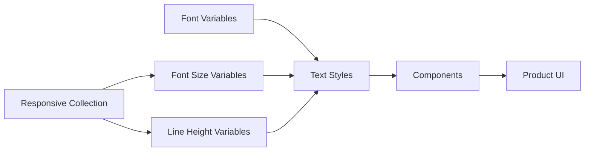
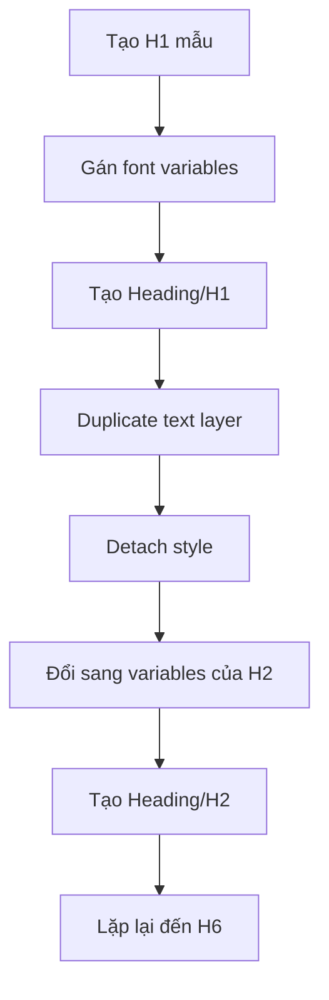
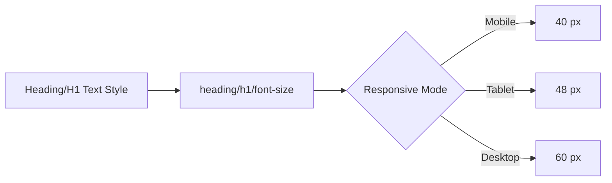
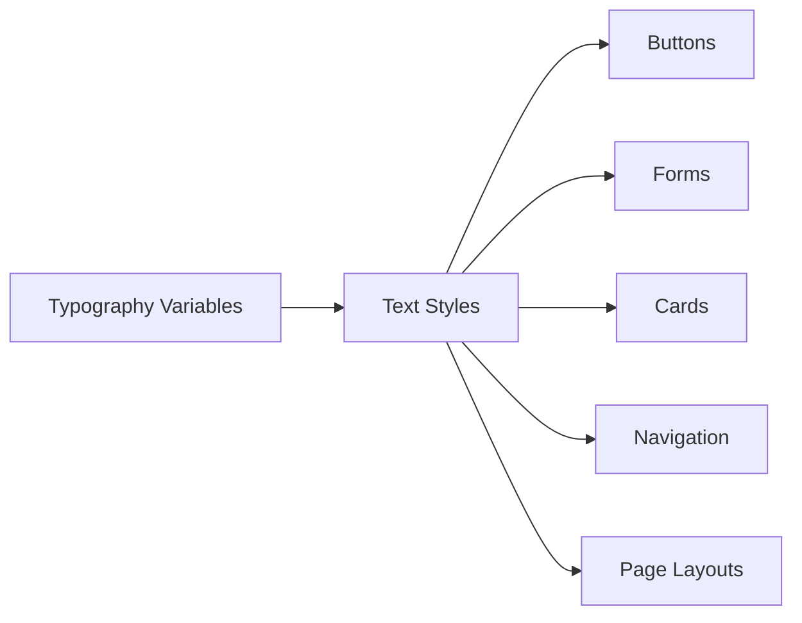

# 022 — Xây dựng Text Styles

## Thông tin bài học

| Thuộc tính            | Nội dung                                                                                 |
| --------------------- | ---------------------------------------------------------------------------------------- |
| **Module**            | Typography & Responsive System                                                           |
| **Thời điểm bắt đầu** | `1:05:51`                                                                                |
| **Chủ đề chính**      | Chuyển hệ thống biến typography thành các Text Styles có thể tái sử dụng trong component |

---

## 1. Mục tiêu của bài học

Sau khi đã xây dựng:

* Font variables
* Type scale
* Line-height scale
* Responsive variable collection

bước tiếp theo là tạo ra các **Text Styles trong Figma**.

Text Style đóng vai trò là lớp giao diện giúp designer sử dụng hệ thống typography một cách nhanh chóng mà không phải lựa chọn từng biến riêng lẻ cho mỗi text layer.



Nói cách khác:

> Variables lưu trữ các giá trị của hệ thống, còn Text Styles đóng gói những giá trị đó thành các kiểu chữ có thể sử dụng trực tiếp.

---

## 2. Vị trí của Text Styles trong hệ thống typography

Hệ thống typography có thể được chia thành ba lớp:

```text
Primitive Variables
        ↓
Responsive Typography Variables
        ↓
Text Styles
        ↓
Components
```

### Lớp 1: Primitive Variables

Lưu trữ các giá trị cơ bản:

* Font family
* Font weight
* Font size
* Line height
* Letter spacing

Ví dụ:

```text
font-size/60
font-size/48
font-size/16

line-height/72
line-height/56
line-height/24

font-weight/regular
font-weight/semibold
```

### Lớp 2: Responsive Variables

Ánh xạ các giá trị typography theo breakpoint:

```text
font-size/heading/h1
font-size/heading/h2
font-size/body/medium
```

Ví dụ:

| Variable                 | Mobile | Tablet | Desktop |
| ------------------------ | -----: | -----: | ------: |
| `heading/h1/font-size`   |  40 px |  48 px |   60 px |
| `heading/h1/line-height` |  48 px |  56 px |   72 px |
| `body/medium/font-size`  |  16 px |  16 px |   16 px |

### Lớp 3: Text Styles

Kết hợp các biến thành một typography preset hoàn chỉnh:

```text
Heading/H1
Heading/H2
Body/Medium/Regular
Body/Medium/Semibold
Body/Medium/Link
```

---

## 3. Vì sao cần tạo Text Styles?

Có thể gán trực tiếp các variable vào từng text layer, nhưng cách này khiến designer phải thiết lập nhiều thuộc tính thủ công:

* Chọn font family
* Chọn font weight
* Chọn font size variable
* Chọn line-height variable
* Thiết lập underline cho liên kết
* Kiểm tra lại tên và cấu trúc

Text Style gom các thuộc tính này thành một lựa chọn duy nhất.

### Khi không sử dụng Text Style

```text
Text Layer
├── Font family: chọn thủ công
├── Font weight: chọn thủ công
├── Font size: chọn variable
├── Line height: chọn variable
└── Decoration: chọn thủ công
```

### Khi sử dụng Text Style

```text
Text Layer
└── Apply: Body/Medium/Link
```

Điều này giúp:

* Thiết kế nhanh hơn
* Hạn chế sai sót
* Duy trì tính nhất quán
* Dễ cập nhật toàn hệ thống
* Dễ bàn giao cho designer và developer

---

# 4. Xây dựng nhóm Heading Styles

Bài học bắt đầu với các kiểu tiêu đề từ `H1` đến `H6`.

Mỗi Heading Style được tạo bằng cách kết hợp:

* Font family dành cho heading
* Font weight
* Font-size variable tương ứng
* Line-height variable tương ứng

---

## 4.1. Cấu trúc của một Heading Style

Ví dụ với `Heading/H1`:

```text
Heading/H1
├── Font family: Heading
├── Font weight: Semibold
├── Font size: heading/h1/font-size
└── Line height: heading/h1/line-height
```

Trong bài học, H1 sử dụng giá trị desktop tương đương:

```text
Font size: 60 px
Line height: 72 px
```

Tuy nhiên, các giá trị này không nên được nhập trực tiếp. Text Style cần tham chiếu đến variable để có thể thay đổi theo breakpoint.

---

## 4.2. Các Heading Styles cần tạo

```text
Heading/
├── H1
├── H2
├── H3
├── H4
├── H5
└── H6
```

Bảng cấu trúc tham khảo:

| Text Style   | Font-size variable     | Line-height variable     | Weight   |
| ------------ | ---------------------- | ------------------------ | -------- |
| `Heading/H1` | `heading/h1/font-size` | `heading/h1/line-height` | Semibold |
| `Heading/H2` | `heading/h2/font-size` | `heading/h2/line-height` | Semibold |
| `Heading/H3` | `heading/h3/font-size` | `heading/h3/line-height` | Semibold |
| `Heading/H4` | `heading/h4/font-size` | `heading/h4/line-height` | Semibold |
| `Heading/H5` | `heading/h5/font-size` | `heading/h5/line-height` | Semibold |
| `Heading/H6` | `heading/h6/font-size` | `heading/h6/line-height` | Semibold |

> Các giá trị cụ thể phụ thuộc vào type scale đã được xây dựng trong bài học trước.

---

## 4.3. Quy trình tạo Heading Style

### Bước 1: Tạo text layer mẫu

Nhập nội dung đại diện:

```text
Heading H1
```

### Bước 2: Gán font family

Chọn font family dành cho heading.

Ví dụ:

```text
Font family: Inter
Font weight: Semibold
```

### Bước 3: Gán font-size variable

```text
heading/h1/font-size
```

### Bước 4: Gán line-height variable

```text
heading/h1/line-height
```

### Bước 5: Tạo Text Style

Đặt tên:

```text
Heading/H1
```

### Bước 6: Nhân bản cho H2–H6

Sau khi nhân bản:

1. Detach Text Style cũ.
2. Thay font-size variable.
3. Thay line-height variable.
4. Tạo Text Style mới.
5. Đổi tên đúng cấp heading.



---

# 5. Xây dựng nhóm Body Styles

Body text thường phức tạp hơn heading vì cùng một kích thước có thể cần nhiều biến thể.

Trong bài học, mỗi kích thước body có ba biến thể:

1. Regular
2. Semibold
3. Link

---

## 5.1. Các kích thước Body

Hệ thống trong bài học sử dụng bốn kích thước:

```text
Extra Small
Small
Medium
Large
```

Có thể biểu diễn bằng token:

```text
xs
sm
md
lg
```

---

## 5.2. Các biến thể cho mỗi kích thước

Mỗi kích thước bao gồm:

```text
Regular
Semibold
Link
```

Ví dụ với kích thước Medium:

```text
Body/Medium/Regular
Body/Medium/Semibold
Body/Medium/Link
```

Cấu trúc tổng thể:

```text
Body/
├── Extra Small/
│   ├── Regular
│   ├── Semibold
│   └── Link
├── Small/
│   ├── Regular
│   ├── Semibold
│   └── Link
├── Medium/
│   ├── Regular
│   ├── Semibold
│   └── Link
└── Large/
    ├── Regular
    ├── Semibold
    └── Link
```

Tổng cộng:

```text
4 kích thước × 3 biến thể = 12 Body Styles
```

---

## 5.3. Body Regular

Body Regular sử dụng font weight thông thường.

```text
Body/Medium/Regular
├── Font family: Body
├── Font weight: Regular
├── Font size: body/medium/font-size
└── Line height: body/medium/line-height
```

Body Regular phù hợp với:

* Đoạn văn
* Nội dung mô tả
* Nội dung bài viết
* Text trong card
* Nội dung biểu mẫu

---

## 5.4. Body Semibold

Body Semibold sử dụng cùng font size và line height với Body Regular nhưng thay đổi font weight.

```text
Body/Medium/Semibold
├── Font family: Body
├── Font weight: Semibold
├── Font size: body/medium/font-size
└── Line height: body/medium/line-height
```

Body Semibold phù hợp với:

* Text cần nhấn mạnh
* Label
* Button text
* Tên trường dữ liệu
* Thông tin quan trọng trong đoạn văn

---

## 5.5. Body Link

Body Link thường sử dụng:

* Font weight Regular hoặc Medium
* Text decoration: Underline
* Cùng font size và line height với Body Regular

```text
Body/Medium/Link
├── Font family: Body
├── Font weight: Regular
├── Font size: body/medium/font-size
├── Line height: body/medium/line-height
└── Text decoration: Underline
```

> Màu của liên kết không nhất thiết phải nằm trong Text Style. Màu nên được kiểm soát bởi semantic color variable như `text/link/default`.

---

# 6. Bảng Text Styles đề xuất

## Heading

| Style        | Weight   | Mục đích                |
| ------------ | -------- | ----------------------- |
| `Heading/H1` | Semibold | Tiêu đề chính của trang |
| `Heading/H2` | Semibold | Tiêu đề section lớn     |
| `Heading/H3` | Semibold | Tiêu đề section         |
| `Heading/H4` | Semibold | Tiêu đề nhóm nội dung   |
| `Heading/H5` | Semibold | Tiêu đề card hoặc block |
| `Heading/H6` | Semibold | Tiêu đề nhỏ             |

## Body

| Style                       | Weight   | Decoration | Mục đích                      |
| --------------------------- | -------- | ---------- | ----------------------------- |
| `Body/Extra Small/Regular`  | Regular  | None       | Chú thích rất nhỏ             |
| `Body/Extra Small/Semibold` | Semibold | None       | Nhãn nhỏ                      |
| `Body/Extra Small/Link`     | Regular  | Underline  | Liên kết nhỏ                  |
| `Body/Small/Regular`        | Regular  | None       | Nội dung phụ                  |
| `Body/Small/Semibold`       | Semibold | None       | Nhãn hoặc metadata            |
| `Body/Small/Link`           | Regular  | Underline  | Liên kết phụ                  |
| `Body/Medium/Regular`       | Regular  | None       | Nội dung mặc định             |
| `Body/Medium/Semibold`      | Semibold | None       | Nội dung nhấn mạnh            |
| `Body/Medium/Link`          | Regular  | Underline  | Liên kết mặc định             |
| `Body/Large/Regular`        | Regular  | None       | Đoạn mở đầu hoặc nội dung lớn |
| `Body/Large/Semibold`       | Semibold | None       | Nội dung lớn cần nhấn mạnh    |
| `Body/Large/Link`           | Regular  | Underline  | Liên kết kích thước lớn       |

---

# 7. Quy tắc đặt tên Text Styles

Tên style nên phản ánh rõ ba thông tin:

```text
Nhóm / Kích thước hoặc cấp độ / Biến thể
```

Ví dụ:

```text
Heading/H1
Body/Small/Regular
Body/Small/Semibold
Body/Small/Link
```

## Tại sao sử dụng dấu `/`?

Figma sử dụng dấu `/` để tạo nhóm phân cấp trong danh sách styles.

Ví dụ:

```text
Body/Medium/Regular
```

sẽ được hiển thị thành:

```text
Body
└── Medium
    └── Regular
```

Điều này giúp danh sách style:

* Dễ tìm kiếm
* Dễ quét bằng mắt
* Có cấu trúc rõ ràng
* Không trở nên lộn xộn khi số lượng style tăng lên

---

## 7.1. Giữ thứ tự biến thể nhất quán

Một thứ tự hợp lý là:

```text
Regular
Semibold
Link
```

Áp dụng giống nhau cho tất cả kích thước:

```text
Body/Small/Regular
Body/Small/Semibold
Body/Small/Link

Body/Medium/Regular
Body/Medium/Semibold
Body/Medium/Link
```

Không nên sử dụng thứ tự khác nhau giữa các nhóm:

```text
Body/Small/Link
Body/Small/Regular
Body/Small/Semibold

Body/Medium/Semibold
Body/Medium/Link
Body/Medium/Regular
```

Sự không nhất quán này sẽ khiến thư viện khó sử dụng.

---

# 8. Text Styles và Raw Variables khác nhau như thế nào?

## Raw Variables

Raw variables cung cấp các giá trị riêng lẻ.

Ví dụ:

```text
font-size/body/medium
line-height/body/medium
font-weight/semibold
```

Designer phải tự kết hợp các biến này.

## Text Styles

Text Styles đóng gói nhiều thuộc tính thành một preset.

Ví dụ:

```text
Body/Medium/Semibold
```

Style này có thể chứa:

```text
Font family    → Body font
Font weight    → Semibold
Font size      → body/medium/font-size
Line height    → body/medium/line-height
Letter spacing → body/medium/letter-spacing
```

## So sánh

| Tiêu chí         | Raw Variables        | Text Styles                        |
| ---------------- | -------------------- | ---------------------------------- |
| Mức độ chi tiết  | Một giá trị riêng lẻ | Một cấu hình typography hoàn chỉnh |
| Cách sử dụng     | Gán từng thuộc tính  | Áp dụng một style                  |
| Độ linh hoạt     | Cao                  | Có kiểm soát                       |
| Tốc độ thiết kế  | Chậm hơn             | Nhanh hơn                          |
| Nguy cơ sai lệch | Cao hơn              | Thấp hơn                           |
| Phù hợp với      | Xây dựng hệ thống    | Sử dụng trong component            |

Hai cơ chế này không thay thế nhau mà bổ sung cho nhau:

```text
Variables = nền tảng dữ liệu
Text Styles = giao diện sử dụng
```

---

# 9. Text Styles hoạt động với Responsive Collection

Một lợi ích quan trọng là Text Style không lưu một giá trị cố định mà có thể tham chiếu đến responsive variable.

Ví dụ:

```text
Heading/H1
└── Font size → responsive/heading/h1/font-size
```

Variable này có thể thay đổi theo mode:

| Mode    | Giá trị |
| ------- | ------: |
| Mobile  |   40 px |
| Tablet  |   48 px |
| Desktop |   60 px |

Khi mode của Responsive Collection thay đổi, text layer sử dụng `Heading/H1` cũng nhận giá trị mới.



Nhờ đó:

* Không cần tạo `H1 Mobile`, `H1 Tablet`, `H1 Desktop`
* Không cần sửa từng text layer
* Component có thể thích ứng theo breakpoint
* Typography được quản lý từ một nguồn duy nhất

---

# 10. Quy trình thực hiện hoàn chỉnh

## Bước 1: Chuẩn bị text layer mẫu

Tạo các text layer cho:

```text
H1
H2
H3
H4
H5
H6

Body Extra Small
Body Small
Body Medium
Body Large
```

## Bước 2: Gán font family

Phân biệt font dành cho:

```text
Heading
Body
```

Nếu hệ thống chỉ sử dụng một font family, cả hai có thể cùng trỏ đến một font.

## Bước 3: Gán font weight

Ví dụ:

```text
Heading → Semibold
Body Regular → Regular
Body Semibold → Semibold
Body Link → Regular
```

## Bước 4: Gán font-size variable

Ví dụ:

```text
heading/h1/font-size
body/small/font-size
body/medium/font-size
```

## Bước 5: Gán line-height variable

Ví dụ:

```text
heading/h1/line-height
body/small/line-height
body/medium/line-height
```

## Bước 6: Thêm decoration cho Link

```text
Text decoration: Underline
```

## Bước 7: Tạo Text Styles

Đặt tên theo cấu trúc đã thống nhất.

## Bước 8: Kiểm tra danh sách style

Đảm bảo:

* Không bị trùng tên
* Không thiếu style
* Không gán nhầm variable
* Các nhóm có cùng thứ tự
* Heading và Body được phân nhóm rõ ràng

## Bước 9: Kiểm tra responsive mode

Chuyển frame qua các mode:

```text
Mobile → Tablet → Desktop
```

Quan sát:

* Font size có thay đổi đúng không?
* Line height có thay đổi đúng không?
* Style có còn liên kết với variable không?
* Text có bị tràn hoặc xuống dòng bất thường không?

---

# 11. Những quyết định được đơn giản hóa trong bài học

Bài học chỉ tạo một font weight chính cho mỗi heading:

```text
Heading/H1
Heading/H2
...
```

Một hệ thống lớn hơn có thể tạo thêm:

```text
Heading/H1/Medium
Heading/H1/Semibold
Heading/H1/Bold
```

Tuy nhiên, điều này làm số lượng styles tăng rất nhanh.

Ví dụ:

```text
6 heading levels × 3 weights = 18 heading styles
```

Nếu thêm ba breakpoint dưới dạng styles riêng:

```text
18 styles × 3 breakpoints = 54 styles
```

Do đó, nên dùng responsive variables để xử lý breakpoint thay vì tạo style riêng cho từng kích thước màn hình.

---

# 12. Biến “Jumper” được tạm hoãn

Bài học có nhắc đến khái niệm **responsive jumper variables**.

Đây là một kỹ thuật nâng cao, cho phép một biến thay đổi cách ánh xạ tùy theo ngữ cảnh hoặc breakpoint. Tuy nhiên, chủ đề này được tạm hoãn đến giai đoạn xây dựng component vì:

* Khá khó hiểu với người mới
* Cần có component thực tế để minh họa
* Dễ làm hệ thống trở nên quá phức tạp
* Không cần thiết để hoàn thành bộ Text Styles cơ bản

Quy trình hiện tại tập trung vào:

```text
Type Scale
    ↓
Responsive Variables
    ↓
Text Styles
    ↓
Components
```

---

# 13. Áp dụng vào Design System thực tế

## Ví dụ với Button

Button có thể sử dụng:

```text
Body/Medium/Semibold
```

```text
Button
├── Text style: Body/Medium/Semibold
├── Text color: text/button/primary
├── Background: surface/action/primary
├── Padding: spacing/button/medium
└── Radius: radius/button
```

## Ví dụ với Card

```text
Card
├── Title: Heading/H5
├── Description: Body/Medium/Regular
└── Link: Body/Small/Link
```

## Ví dụ với Form Field

```text
Form Field
├── Label: Body/Small/Semibold
├── Input: Body/Medium/Regular
├── Helper text: Body/Small/Regular
└── Error message: Body/Small/Regular
```

Nhờ đó, component không tự tạo typography riêng mà sử dụng các style đã được quản lý tập trung.

---

# 14. Rủi ro và giới hạn

## 14.1. Tạo quá nhiều Text Styles

Nếu tạo style cho mọi sự kết hợp giữa:

* Kích thước
* Font weight
* Breakpoint
* Màu sắc
* Trạng thái
* Letter spacing

thư viện sẽ trở nên rất lớn.

Ví dụ:

```text
4 sizes
× 4 weights
× 3 breakpoints
× 4 states
= 192 styles
```

Chỉ nên tạo các style thực sự có mục đích sử dụng rõ ràng.

---

## 14.2. Gán nhầm variable

Khi nhân bản nhiều text layer, rất dễ xảy ra lỗi:

```text
Heading/H3
└── Font size → heading/h2/font-size  ❌
```

Cần kiểm tra lại từng style sau khi tạo.

---

## 14.3. Đặt tên không nhất quán

Các tên sau đây có cùng ý nghĩa nhưng tạo ra cấu trúc lộn xộn:

```text
Body/Small/Semibold
Body/Medium/Semi Bold
Body/Large/600
```

Nên chọn một quy ước duy nhất:

```text
Regular
Medium
Semibold
Bold
```

---

## 14.4. Đưa màu vào Text Style

Nếu tạo các style như:

```text
Body/Medium/Primary
Body/Medium/Secondary
Body/Medium/Danger
```

số lượng style sẽ tăng mạnh và typography bị phụ thuộc vào màu sắc.

Tốt hơn nên tách riêng:

```text
Text Style → Body/Medium/Regular
Color Variable → text/primary
```

---

## 14.5. Text Styles không tự giải quyết mọi vấn đề responsive

Typography responsive vẫn cần được kiểm tra trong layout thực tế.

Font size thay đổi có thể gây:

* Text overflow
* Button quá cao
* Card thay đổi chiều cao
* Tiêu đề xuống dòng
* Khoảng cách giữa các thành phần bị lệch

Vì vậy, cần kiểm tra Text Styles cùng với:

* Auto Layout
* Min/max width
* Component properties
* Spacing variables
* Responsive layout rules

---

# 15. Checklist kiểm tra Text Styles

## Cấu trúc

* [ ] Có đầy đủ H1–H6
* [ ] Có đầy đủ các kích thước Body
* [ ] Mỗi Body size có Regular, Semibold và Link
* [ ] Heading và Body được phân nhóm rõ ràng

## Variables

* [ ] Font size được liên kết với variable
* [ ] Line height được liên kết với variable
* [ ] Font weight đúng với tên style
* [ ] Không có giá trị quan trọng bị hard-code

## Naming

* [ ] Tên style sử dụng cùng một quy ước
* [ ] Không có style trùng lặp
* [ ] Không trộn `Small`, `sm` và `14px`
* [ ] Thứ tự Regular, Semibold, Link nhất quán

## Responsive

* [ ] Heading thay đổi đúng theo breakpoint
* [ ] Line height thay đổi đồng bộ với font size
* [ ] Không xuất hiện text overflow
* [ ] Component vẫn giữ layout ổn định

---

# 16. Trả lời câu hỏi ôn tập

## Câu 1: Mục đích chính của Building Text Styles là gì?

Mục đích chính là chuyển type scale và font variables thành các Text Styles có thể tái sử dụng trực tiếp trong thiết kế.

Text Styles là bước cuối cùng giúp hệ thống typography sẵn sàng để sử dụng trong component.

---

## Câu 2: Áp dụng bài học này vào Design System thực tế như thế nào?

Có thể thực hiện theo quy trình:

1. Xây dựng font và typography variables.
2. Xây dựng responsive modes.
3. Tạo Heading Styles từ H1 đến H6.
4. Tạo Body Styles theo kích thước và biến thể.
5. Đặt tên style theo cấu trúc phân cấp.
6. Áp dụng Text Styles vào component.
7. Kiểm tra component ở các breakpoint.

Ví dụ:

```text
Card Title       → Heading/H5
Card Description → Body/Medium/Regular
Card Link        → Body/Small/Link
Button Label     → Body/Medium/Semibold
```

---

## Câu 3: Các bước và ý tưởng chính được trình bày trong bài là gì?

Các ý tưởng chính gồm:

* Tạo Text Styles từ typography variables
* Tạo Heading Styles từ H1 đến H6
* Tạo Body Styles theo nhiều kích thước
* Tạo các biến thể Regular, Semibold và Link
* Gán font-size và line-height variables vào style
* Sử dụng cấu trúc tên có phân cấp
* Sắp xếp danh sách styles nhất quán
* Chuẩn bị typography để sử dụng trong component

---

## Câu 4: Rủi ro hoặc giới hạn cần lưu ý là gì?

Rủi ro lớn nhất là tạo quá nhiều styles hoặc tạo các style không nhất quán.

Ngoài ra cần lưu ý:

* Có thể gán nhầm variable khi nhân bản
* Style có thể bị hard-code thay vì liên kết với variable
* Responsive type có thể làm hỏng layout
* Không nên kết hợp màu sắc vào mọi Text Style
* Không nên tạo style riêng cho từng breakpoint nếu variables đã xử lý được việc đó

---

# 17. Tóm tắt bài học

Bài học xây dựng các Text Styles dựa trên hệ thống typography variables đã tạo trước đó.

Các style chính bao gồm:

```text
Heading/
├── H1
├── H2
├── H3
├── H4
├── H5
└── H6

Body/
├── Extra Small/
│   ├── Regular
│   ├── Semibold
│   └── Link
├── Small/
│   ├── Regular
│   ├── Semibold
│   └── Link
├── Medium/
│   ├── Regular
│   ├── Semibold
│   └── Link
└── Large/
    ├── Regular
    ├── Semibold
    └── Link
```

Text Styles là cầu nối giữa hệ thống variables và các component thực tế:



Kết quả cuối cùng là một hệ thống typography:

* Có cấu trúc
* Dễ tìm kiếm
* Có thể tái sử dụng
* Thích ứng theo breakpoint
* Dễ cập nhật
* Sẵn sàng để xây dựng component

---

# Bài luyện tập

## Mục tiêu


## Đề bài


## Yêu cầu hoàn thành

- [ ] 
- [ ] 
- [ ] 

## Kết quả / lời giải


## Ghi chú
