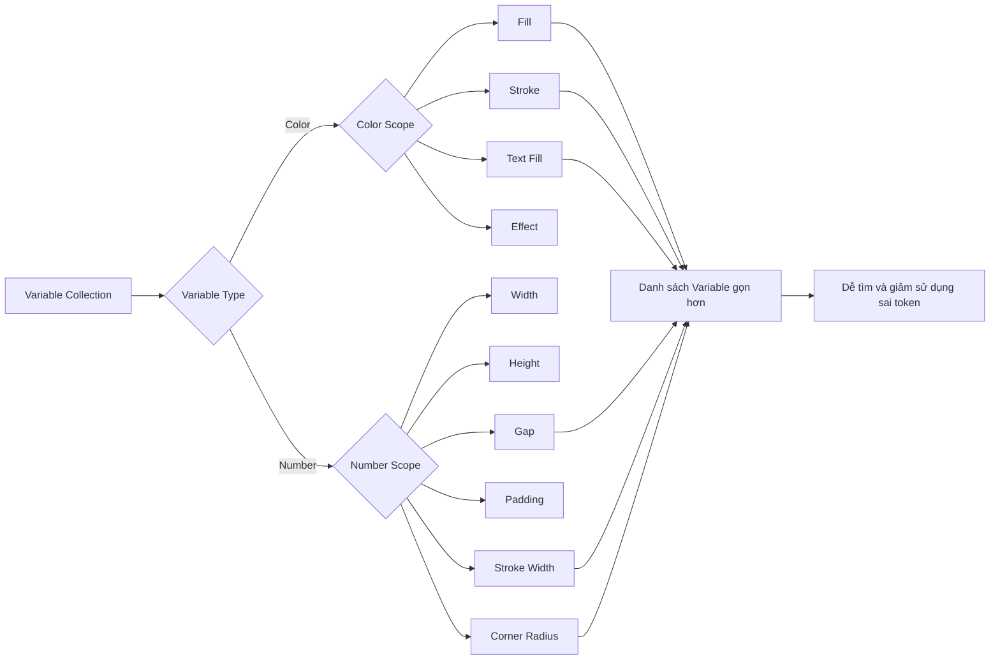
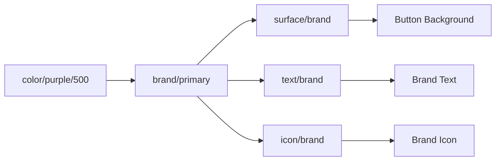
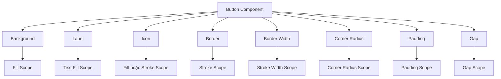

# 024 — Thiết lập phạm vi cho Figma Variables

## Thông tin bài học

| Nội dung              | Chi tiết                                                                                                                |
| --------------------- | ----------------------------------------------------------------------------------------------------------------------- |
| **Module**            | Icons, Variable Scoping & First Component                                                                               |
| **Chủ đề**            | Thiết lập phạm vi sử dụng cho Figma Variables                                                                           |
| **Thời điểm bắt đầu** | 1:14:48                                                                                                                 |
| **Mục tiêu chính**    | Giới hạn mỗi biến để chúng chỉ xuất hiện trong những thuộc tính phù hợp như Fill, Stroke, Gap, Width hoặc Corner Radius |

---

## 1. Tổng quan

Khi một Design System phát triển, số lượng Variables có thể tăng từ vài chục lên hàng trăm hoặc hàng nghìn biến.

Nếu không thiết lập phạm vi, khi chọn một thuộc tính như màu nền, Figma có thể hiển thị cả:

* Màu chữ;
* Màu biểu tượng;
* Màu đường viền;
* Kích thước khoảng cách;
* Độ rộng đường viền;
* Bán kính bo góc;
* Các Primitive Variables không nên được dùng trực tiếp.

Điều này khiến danh sách Variables trở nên dài, khó tìm kiếm và dễ sử dụng sai.

**Variable Scoping** giúp giới hạn nơi một Variable được phép xuất hiện trong giao diện chọn thuộc tính của Figma.

---

## 2. Variable Scoping là gì?

Variable Scoping là cơ chế xác định một Variable nên xuất hiện trong những loại thuộc tính nào.

Ví dụ:

| Variable               | Kiểu dữ liệu | Phạm vi phù hợp |
| ---------------------- | ------------ | --------------- |
| `surface/default`      | Color        | Fill            |
| `border/default`       | Color        | Stroke          |
| `text/primary`         | Color        | Text fill       |
| `icon/primary`         | Color        | Fill            |
| `border/width/default` | Number       | Stroke width    |
| `radius/md`            | Number       | Corner radius   |
| `spacing/300`          | Number       | Gap, padding    |
| `size/icon/md`         | Number       | Width, height   |

Nhờ đó, khi người thiết kế chỉnh sửa `Corner radius`, Figma chỉ hiển thị những biến liên quan đến bán kính, thay vì toàn bộ hệ thống biến số.

---

## 3. Scoping không làm thay đổi giá trị của Variable

Cần phân biệt hai khái niệm:

* **Giá trị Variable** quyết định kết quả được áp dụng.
* **Scope của Variable** quyết định Variable xuất hiện ở đâu trong giao diện Figma.

Ví dụ:

```text
radius/md = 8
```

Giá trị `8` không thay đổi khi thiết lập scope.

Scope chỉ giúp Figma hiểu rằng:

```text
radius/md → chỉ nên xuất hiện trong Corner radius
```

Variable vẫn tồn tại trong collection và vẫn có thể được quản lý như bình thường.

---

## 4. Vấn đề khi không thiết lập Scope

Giả sử hệ thống có các Variables sau:

```text
Primitive
├── color/blue/100
├── color/blue/500
├── color/purple/500
├── spacing/100
├── spacing/200
├── radius/md
└── border-width/default

Alias
├── brand/primary
├── brand/secondary
├── border/default
├── border/width/default
└── radius/component

Mapped
├── surface/default
├── text/primary
├── icon/primary
└── border/focus
```

Khi người dùng chọn thuộc tính Stroke, nếu không có Scope, danh sách có thể xuất hiện cả màu nền, màu chữ và các biến không liên quan.

```text
Không có Scope
        │
        ▼
Property Picker
├── surface/default
├── text/primary
├── icon/primary
├── border/focus
├── brand/primary
└── nhiều biến không liên quan
```

Hậu quả:

* Khó tìm đúng token;
* Dễ gán nhầm token;
* Các Primitive Variables bị sử dụng trực tiếp;
* Thành viên mới khó hiểu cấu trúc hệ thống;
* Component thiếu tính nhất quán.

---

## 5. Cách Variable Scoping cải thiện hệ thống

Sau khi thiết lập Scope:

```text
Fill Picker
├── surface/default
├── surface/raised
├── icon/primary
└── brand/primary
```

```text
Stroke Picker
├── border/default
├── border/subtle
└── border/focus
```

```text
Corner Radius Picker
├── radius/sm
├── radius/md
├── radius/lg
└── radius/full
```

```text
Gap và Padding Picker
├── spacing/100
├── spacing/200
├── spacing/300
└── spacing/400
```

Mỗi danh sách chỉ hiển thị những Variables phù hợp với thuộc tính đang được chỉnh sửa.

---

## 6. Sơ đồ hoạt động



---

## 7. Thiết lập Scope cho Color Variables

### 7.1. Surface Variables

Các token bề mặt thường được sử dụng cho màu nền của component hoặc container.

```text
surface/default
surface/raised
surface/sunken
surface/overlay
surface/brand
```

Scope đề xuất:

```text
Fill
```

Ví dụ:

```text
Button background → surface/brand
Card background   → surface/raised
Page background   → surface/default
```

---

### 7.2. Border Variables

Các token đường viền được sử dụng cho Stroke.

```text
border/default
border/subtle
border/strong
border/focus
border/error
```

Scope đề xuất:

```text
Stroke
```

Việc này giúp `border/focus` không xuất hiện trong danh sách màu nền nếu token không được thiết kế cho Fill.

---

### 7.3. Text Variables

Các token dành cho văn bản:

```text
text/primary
text/secondary
text/disabled
text/inverse
text/brand
text/error
```

Scope đề xuất:

```text
Text fill
```

Trong một số trường hợp, Figma có thể nhóm Text Fill cùng cơ chế Fill. Khi đó, nhóm token và cách đặt tên vẫn đóng vai trò quan trọng trong việc hướng dẫn người dùng.

---

### 7.4. Icon Variables

Các biểu tượng thường sử dụng Vector Fill hoặc Stroke tùy theo thư viện icon.

```text
icon/primary
icon/secondary
icon/disabled
icon/inverse
icon/brand
```

Scope có thể là:

```text
Fill
```

hoặc:

```text
Stroke
```

Nếu hệ thống sử dụng cả icon dạng Fill và Stroke, có thể cho phép token icon xuất hiện trong cả hai phạm vi.

---

### 7.5. Primitive và Brand Variables

Các Primitive Variables thường không nên được component sử dụng trực tiếp.

Ví dụ:

```text
purple/100
purple/200
purple/300
purple/400
purple/500
```

Thay vào đó, component nên sử dụng:

```text
surface/brand
text/brand
icon/brand
border/brand
```

Vì vậy, có thể ẩn hoặc hạn chế các Primitive Variables khỏi những property picker thông thường.



Điều này bảo vệ kiến trúc token ba tầng:

```text
Primitive → Alias → Mapped → Component
```

---

## 8. Thiết lập Scope cho Number Variables

Number Variables có thể được sử dụng cho nhiều thuộc tính khác nhau. Vì vậy, việc thiết lập Scope cho biến số đặc biệt quan trọng.

### 8.1. Border Width

Ví dụ:

```text
border-width/none   = 0
border-width/thin   = 1
border-width/medium = 2
border-width/thick  = 4
```

Scope đề xuất:

```text
Stroke width
```

Khi chỉnh độ rộng đường viền, người dùng chỉ nhìn thấy các token `border-width`.

---

### 8.2. Corner Radius

Ví dụ:

```text
radius/none = 0
radius/sm   = 4
radius/md   = 8
radius/lg   = 16
radius/full = 999
```

Scope đề xuất:

```text
Corner radius
```

Khi chọn thuộc tính bo góc, Figma sẽ chỉ hiển thị các token bán kính.

---

### 8.3. Spacing

Ví dụ:

```text
spacing/0   = 0
spacing/100 = 4
spacing/200 = 8
spacing/300 = 12
spacing/400 = 16
spacing/500 = 24
```

Scope đề xuất:

```text
Gap
Padding
```

Tùy theo cách hệ thống được xây dựng, spacing scale cũng có thể được phép xuất hiện trong:

```text
Width
Height
```

Tuy nhiên, không nên bật quá nhiều phạm vi nếu không có nhu cầu thực tế.

---

### 8.4. Size Scale

Trong nội dung bài học, giảng viên giữ lại một phần scale thay vì ẩn toàn bộ.

Lý do hợp lý là một scale số có thể được tái sử dụng trong nhiều thuộc tính:

```text
scale/100 = 4
scale/200 = 8
scale/300 = 12
scale/400 = 16
```

Các giá trị này có thể được dùng cho:

* Width;
* Height;
* Gap;
* Padding;
* Corner radius;
* Kích thước icon;
* Kích thước component.

Tuy nhiên, việc dùng một scale chung hay tách thành `spacing`, `size`, `radius` phụ thuộc vào kiến trúc Design System.

Một hệ thống lớn thường nên ưu tiên token có mục đích rõ ràng:

```text
scale/400
```

được ánh xạ thành:

```text
spacing/md
size/icon/md
radius/lg
```

Component sau đó sử dụng các token theo vai trò thay vì liên kết trực tiếp với scale gốc.

---

## 9. Quy trình thiết lập Scope trong Figma

### Bước 1: Mở Variables

Mở bảng quản lý Variables và chọn collection cần chỉnh sửa.

Ví dụ:

```text
Primitives
Alias
Mapped
Responsive
```

---

### Bước 2: Chọn Variable

Chọn một hoặc nhiều Variables có cùng mục đích.

Ví dụ:

```text
border/default
border/subtle
border/focus
```

Nên chỉnh sửa theo nhóm để tránh cấu hình không đồng nhất.

---

### Bước 3: Mở phần chỉnh sửa Variable

Trong phần cấu hình Variable, tìm tùy chọn liên quan đến phạm vi xuất hiện hoặc phạm vi sử dụng.

---

### Bước 4: Chọn Scope phù hợp

Ví dụ:

```text
border color → Stroke
border width → Stroke width
radius       → Corner radius
spacing      → Gap và Padding
surface      → Fill
```

---

### Bước 5: Ẩn các biến không nên sử dụng trực tiếp

Các Primitive hoặc biến nội bộ có thể được ẩn khỏi property picker nếu chúng chỉ đóng vai trò làm dữ liệu nguồn.

Ví dụ:

```text
color/purple/500
```

không nên được sử dụng trực tiếp trên Button.

Button nên sử dụng:

```text
button/background/default
```

hoặc:

```text
surface/brand
```

---

### Bước 6: Kiểm tra trên một đối tượng thực tế

Tạo một Frame hoặc Component thử nghiệm và kiểm tra từng thuộc tính:

1. Mở Fill picker;
2. Mở Stroke picker;
3. Mở Corner radius picker;
4. Mở Gap hoặc Padding picker;
5. Kiểm tra danh sách Variables được hiển thị.

Mục tiêu là bảo đảm mỗi danh sách chỉ chứa những token liên quan.

---

## 10. Ví dụ áp dụng vào Button Component

Một Button có thể cần các thuộc tính sau:

```text
Button
├── Background color
├── Label color
├── Icon color
├── Border color
├── Border width
├── Corner radius
├── Horizontal padding
├── Vertical padding
└── Gap giữa icon và label
```

Ánh xạ Variables:

| Thuộc tính Button  | Variable                    |
| ------------------ | --------------------------- |
| Background         | `button/background/default` |
| Label              | `button/label/default`      |
| Icon               | `button/icon/default`       |
| Border             | `button/border/default`     |
| Border width       | `border-width/thin`         |
| Corner radius      | `radius/md`                 |
| Horizontal padding | `spacing/400`               |
| Vertical padding   | `spacing/300`               |
| Icon-label gap     | `spacing/200`               |

Scope tương ứng:



Nhờ scoping, khi xây dựng Button, người thiết kế không phải cuộn qua toàn bộ Variables của hệ thống.

---

## 11. Vì sao Scoping quan trọng khi làm việc theo nhóm?

Trong một dự án nhỏ, người tạo Design System có thể nhớ mục đích của từng Variable.

Tuy nhiên, ở quy mô nhóm:

* Thành viên mới không biết token nào nên sử dụng;
* Nhiều người có thể hiểu tên token theo những cách khác nhau;
* Primitive Variables có thể bị áp dụng trực tiếp;
* Component có thể sử dụng sai layer token;
* Việc kiểm tra và bảo trì trở nên khó khăn.

Variable Scoping hoạt động như một lớp hướng dẫn ngay trong giao diện Figma.

```text
Người thiết kế chọn thuộc tính
              ↓
Figma lọc Variables theo Scope
              ↓
Chỉ hiển thị lựa chọn phù hợp
              ↓
Giảm lỗi và tăng tính nhất quán
```

Nó không thay thế tài liệu Design System, nhưng giúp thực thi quy tắc ngay trong quá trình thiết kế.

---

## 12. Những rủi ro và hạn chế

### 12.1. Thiết lập Scope quá hẹp

Một Variable có thể cần được sử dụng trong nhiều thuộc tính.

Ví dụ, màu icon có thể được áp dụng cho cả:

```text
Fill
Stroke
```

Nếu chỉ cho phép Fill, icon dạng outline có thể không tìm thấy token cần thiết.

---

### 12.2. Thiết lập Scope quá rộng

Nếu bật tất cả phạm vi cho mọi Variable, scoping gần như mất tác dụng.

```text
Mọi Variable → Mọi Property Picker
```

Danh sách Variables sẽ tiếp tục dài và khó sử dụng.

---

### 12.3. Ẩn Primitive không có nghĩa là không thể sử dụng sai

Scoping chủ yếu kiểm soát khả năng hiển thị trong các property picker.

Nó không thay thế:

* Quy ước đặt tên;
* Kiến trúc Primitive–Alias–Mapped;
* Tài liệu sử dụng token;
* Review component;
* Quy trình quản trị Design System.

---

### 12.4. Scope không sửa được kiến trúc token chưa tốt

Nếu hệ thống có các token tên không rõ mục đích như:

```text
blue-color
gray-2
number-small
size-big
```

thì dù có Scope, người dùng vẫn khó hiểu nên chọn token nào.

Tên token vẫn cần thể hiện rõ vai trò:

```text
text/secondary
border/focus
spacing/component-gap
radius/button
```

---

### 12.5. Cần kiểm tra lại khi token thay đổi vai trò

Khi một Variable được đổi mục đích hoặc tái cấu trúc, Scope của nó cũng cần được cập nhật.

Ví dụ:

```text
color/brand
```

ban đầu chỉ dùng cho Fill nhưng sau đó được sử dụng cho cả Stroke. Scope cũ có thể khiến token không xuất hiện ở vị trí cần thiết.

---

## 13. Nguyên tắc đề xuất

### Nguyên tắc 1: Scope theo mục đích, không chỉ theo kiểu dữ liệu

Không phải mọi Color Variable đều nên xuất hiện trong mọi Color Picker.

```text
surface/* → Fill
border/*  → Stroke
text/*    → Text fill
```

---

### Nguyên tắc 2: Hạn chế component sử dụng Primitive trực tiếp

```text
Không nên:
Button → purple/500
```

```text
Nên:
Button → button/background/default
       → surface/brand
       → brand/primary
       → purple/500
```

---

### Nguyên tắc 3: Chỉ mở rộng Scope khi có trường hợp sử dụng thực tế

Không nên bật Width, Height, Gap, Padding và Radius cho mọi Number Variable chỉ vì chúng có cùng kiểu dữ liệu.

---

### Nguyên tắc 4: Kiểm tra Scope bằng component thật

Scope chỉ thực sự hiệu quả khi được kiểm tra trong quá trình xây dựng:

* Button;
* Input;
* Card;
* Navigation;
* Icon button;
* Dialog.

---

## 14. Trả lời câu hỏi ôn tập

### Câu 1. Mục đích chính của bài học là gì?

Mục đích chính là sử dụng Variable Scoping để giới hạn mỗi Variable vào những thuộc tính phù hợp trong Figma.

Điều này giúp:

* Làm gọn danh sách Variables;
* Tìm token nhanh hơn;
* Hạn chế sử dụng sai token;
* Ngăn Primitive Variables bị áp dụng trực tiếp;
* Chuẩn bị hệ thống token cho việc xây dựng Button Component.

---

### Câu 2. Áp dụng vào một Figma Design System thực tế như thế nào?

Có thể áp dụng theo bảng sau:

| Nhóm token     | Scope            |
| -------------- | ---------------- |
| Surface color  | Fill             |
| Text color     | Text fill        |
| Icon color     | Fill hoặc Stroke |
| Border color   | Stroke           |
| Border width   | Stroke width     |
| Radius         | Corner radius    |
| Spacing        | Gap và Padding   |
| Component size | Width và Height  |

Sau khi cấu hình, cần kiểm tra trên các component thực tế để bảo đảm token xuất hiện đúng vị trí.

---

### Câu 3. Các bước hoặc ý tưởng chính trong bài học là gì?

1. Xác định những Variables không nên xuất hiện trực tiếp trong property picker.
2. Ẩn hoặc hạn chế các Primitive và Brand Variables không cần thiết.
3. Thiết lập Scope cho Color Variables.
4. Thiết lập Scope cho Number Variables như border width và radius.
5. Giữ lại những scale có thể được tái sử dụng hợp lý.
6. Kiểm tra danh sách Variables trên các thuộc tính thực tế.
7. Sử dụng hệ thống đã được làm sạch để bắt đầu xây dựng Button Component.

---

### Câu 4. Rủi ro hoặc hạn chế cần lưu ý là gì?

Rủi ro lớn nhất là thiết lập Scope quá hẹp hoặc quá rộng.

* Quá hẹp khiến Variable không xuất hiện ở nơi cần thiết.
* Quá rộng khiến danh sách tiếp tục lộn xộn.
* Scope không thể thay thế kiến trúc token và quy tắc đặt tên tốt.
* Khi token thay đổi mục đích, Scope cũng phải được cập nhật.
* Cần kiểm tra với nhiều component và loại icon khác nhau.

---

## 15. Tóm tắt bài học

Variable Scoping giúp kiểm soát Variable nào xuất hiện trong từng property picker của Figma.

```text
Color Variables
├── Surface → Fill
├── Border → Stroke
├── Text → Text fill
└── Icon → Fill hoặc Stroke

Number Variables
├── Border width → Stroke width
├── Radius → Corner radius
├── Spacing → Gap và Padding
└── Size → Width và Height
```

Khi được cấu hình đúng, hệ thống Variables sẽ:

* Gọn gàng hơn;
* Dễ sử dụng hơn;
* Giảm lỗi chọn token;
* Bảo vệ kiến trúc token;
* Hoạt động tốt hơn khi nhóm và Design System mở rộng.

Đây là bước chuẩn bị quan trọng trước khi xây dựng component thực tế đầu tiên — **Button Component** — dựa trên toàn bộ hệ thống token đã được thiết lập.
