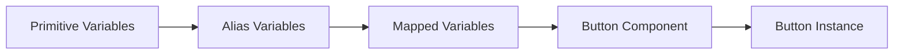
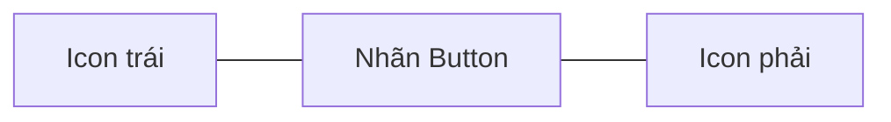
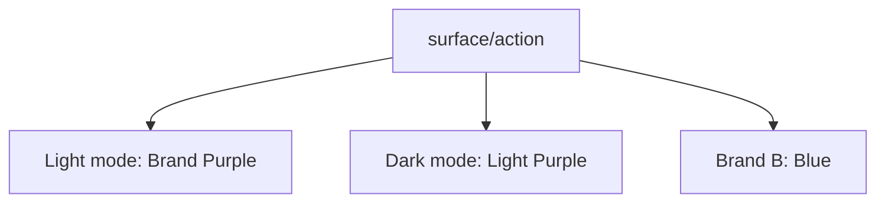
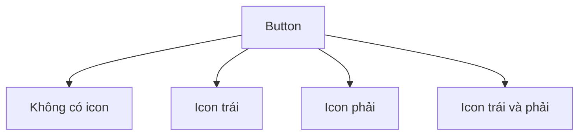
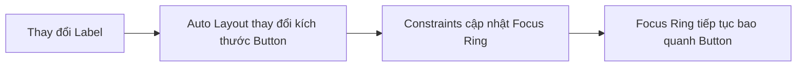
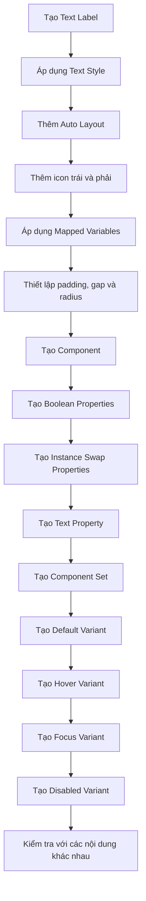
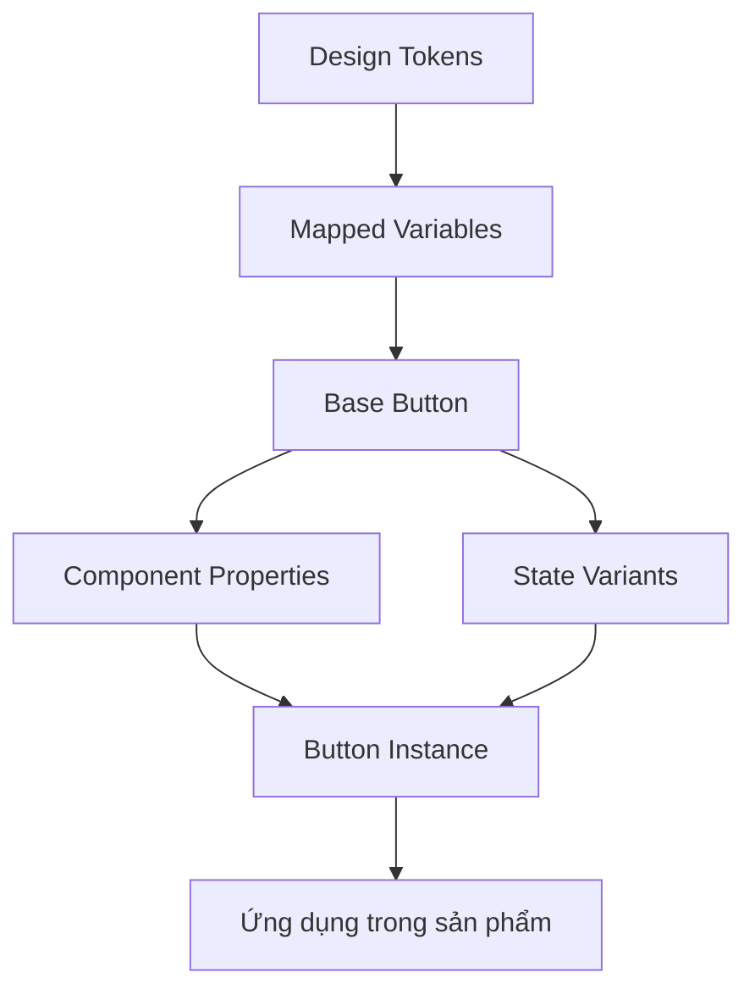

# 025 — Xây dựng Button Component

## Thông tin bài học

| Thuộc tính              | Nội dung                                               |
| ----------------------- | ------------------------------------------------------ |
| **Module**              | Icons, Variable Scoping & First Component              |
| **Chủ đề**              | Xây dựng Button Component                              |
| **Thời điểm bắt đầu**   | `1:16:53` trong video đầy đủ                           |
| **Công cụ**             | Figma                                                  |
| **Thành phần chính**    | Button                                                 |
| **Kiến thức liên quan** | Variables, Auto Layout, Component Properties, Variants |

---

## 1. Mục tiêu bài học

Bài học hướng dẫn xây dựng một **Button component hoàn chỉnh** dựa trên hệ thống design token đã tạo trước đó.

Thay vì nhập trực tiếp các giá trị màu sắc, khoảng cách và bo góc, Button sẽ sử dụng các **Mapped Variables** cho:

* Màu nền.
* Màu đường viền.
* Màu chữ.
* Màu biểu tượng.
* Khoảng đệm.
* Khoảng cách giữa các phần tử.
* Bán kính bo góc.
* Các trạng thái tương tác như hover và focus.

Mục tiêu là tạo ra một Button có thể:

* Thay đổi nhãn.
* Hiện hoặc ẩn icon bên trái.
* Hiện hoặc ẩn icon bên phải.
* Thay thế icon.
* Chuyển đổi giữa các trạng thái.
* Tự động thích nghi với nội dung.
* Hoạt động nhất quán khi đổi theme hoặc thương hiệu.

---

## 2. Ý tưởng chính

Button không nên được xây dựng bằng các giá trị cố định như:

```text
Background: #6750A4
Text: #FFFFFF
Padding: 8px 12px
Radius: 8px
```

Thay vào đó, Button phải tham chiếu đến các token có ý nghĩa sử dụng:

```text
surface/action
text/on-action
icon/on-action
border/action
spacing/2
spacing/3
radius/2
```

Điều này tạo ra chuỗi liên kết:



Khi giá trị ở tầng token thay đổi, tất cả Button đang sử dụng token đó sẽ được cập nhật tự động.

---

## 3. Cấu trúc cơ bản của Button

Button trong bài học gồm ba phần:

```text
Button
├── Icon Left
├── Label
└── Icon Right
```

Cấu trúc trực quan:



Cả ba phần tử được đặt bên trong một **Auto Layout frame**.

---

## 4. Bước 1 — Tạo nhãn Button

Tạo một Text layer với nội dung ví dụ:

```text
Join UI Group
```

Có thể sử dụng bất kỳ nhãn cơ bản nào như:

```text
Learn more
Continue
Submit
Get started
```

Áp dụng Text Style phù hợp, chẳng hạn:

```text
Body / Medium
Font size: 16px
```

Text Style giúp đảm bảo Button sử dụng đúng font, kích thước chữ, độ đậm và line-height trong hệ thống typography.

---

## 5. Bước 2 — Thêm Auto Layout

Chọn Text layer và nhấn:

```text
Shift + A
```

Figma sẽ tạo một Auto Layout frame bao quanh nội dung.

Thiết lập hướng Auto Layout:

```text
Direction: Horizontal
Alignment: Center
Width: Hug contents
Height: Hug contents
```

Auto Layout giúp Button:

* Tự mở rộng khi nhãn dài hơn.
* Giữ icon và chữ luôn thẳng hàng.
* Duy trì khoảng cách nhất quán.
* Không cần điều chỉnh thủ công kích thước Button.

---

## 6. Bước 3 — Áp dụng token màu nền

Gán màu nền Button bằng Mapped Variable:

```text
surface/action
```

Không nên chọn trực tiếp màu primitive như:

```text
purple/600
blue/500
```

### Vì sao?

Tên `surface/action` mô tả **vai trò của màu**, không mô tả màu sắc cụ thể.

Nhờ đó, Button có thể tự động đổi màu theo:

* Light mode.
* Dark mode.
* Brand A.
* Brand B.
* Theme tùy chỉnh.

Ví dụ:



---

## 7. Bước 4 — Áp dụng token màu chữ

Màu chữ của Button được gán token:

```text
text/on-action
```

Tên này mang ý nghĩa:

> Màu chữ được sử dụng trên một bề mặt mang tính hành động.

Ví dụ:

```text
Button background: surface/action
Button label: text/on-action
```

Cặp token này giúp duy trì độ tương phản giữa nền Button và nội dung phía trên.

---

## 8. Bước 5 — Thêm đường viền

Ngay cả khi Button chưa cần đường viền riêng biệt, bài học khuyến nghị vẫn nên thêm stroke từ đầu.

Áp dụng token:

```text
border/action
```

Trong trạng thái mặc định, đường viền có thể cùng màu với nền:

```text
surface/action = purple
border/action  = purple
```

### Vì sao vẫn cần thêm stroke?

Nếu bỏ qua stroke ngay từ đầu, khi thiết kế cần thêm đường viền cho trạng thái hover, focus hoặc một variant khác, designer phải quay lại chỉnh sửa toàn bộ component.

Thêm stroke từ đầu giúp:

* Cấu trúc component nhất quán.
* Dễ xây dựng các trạng thái.
* Tránh sửa lại component sau này.
* Hạn chế thay đổi layout khi bật đường viền.

---

## 9. Bước 6 — Thêm icon

Kéo icon từ thư viện Material Symbols vào Button.

Ví dụ:

```text
info
arrow_forward
download
add
check
```

Thiết lập kích thước icon:

```text
20 × 20px
```

Gán màu icon bằng token:

```text
icon/on-action
```

Như vậy, icon và chữ sẽ có màu nhất quán:

```text
Label: text/on-action
Icon:  icon/on-action
```

Không nên liên kết icon trực tiếp với token của text, mặc dù chúng có thể đang có cùng giá trị màu. Việc sử dụng token riêng giúp hệ thống linh hoạt hơn trong tương lai.

---

## 10. Bước 7 — Thiết lập padding và gap

Thiết lập khoảng đệm ví dụ:

| Thuộc tính                   | Giá trị |
| ---------------------------- | ------: |
| Padding ngang                |  `12px` |
| Padding dọc                  |   `8px` |
| Khoảng cách giữa icon và chữ |   `8px` |

Có thể liên kết các giá trị này với spacing variables:

```text
padding-horizontal → spacing/3
padding-vertical   → spacing/2
item-spacing       → spacing/2
```

Cấu trúc khoảng cách:

```text
┌───────────────────────────────────┐
│  12px  [Icon]  8px  [Label]  12px │
│          ↑ Padding dọc: 8px        │
└───────────────────────────────────┘
```

---

## 11. Bước 8 — Thiết lập bán kính bo góc

Áp dụng radius variable cho Button:

```text
radius/2
```

Ví dụ giá trị thực tế của token:

```text
radius/2 = 8px
```

Không nên nhập trực tiếp `8px`, vì khi hệ thống thay đổi phong cách bo góc, Button sẽ không được cập nhật tự động.

---

## 12. Bước 9 — Tạo Component

Sau khi hoàn thiện cấu trúc cơ bản, chuyển Button thành component:

```text
Create component
```

Phím tắt thường dùng:

```text
Ctrl + Alt + K — Windows
⌥ + ⌘ + K — macOS
```

Đặt tên component:

```text
Button
```

Hoặc theo cấu trúc thư viện:

```text
Actions/Button
```

---

# 13. Tạo Component Properties

Một Button tái sử dụng cần cho phép người dùng tùy chỉnh nội dung mà không phải tách component.

Các thuộc tính cần tạo:

| Thuộc tính     | Loại          | Công dụng                  |
| -------------- | ------------- | -------------------------- |
| `Icon Left`    | Boolean       | Hiện hoặc ẩn icon bên trái |
| `Icon Left ↓`  | Instance swap | Thay thế icon bên trái     |
| `Icon Right`   | Boolean       | Hiện hoặc ẩn icon bên phải |
| `Icon Right ↓` | Instance swap | Thay thế icon bên phải     |
| `Label`        | Text          | Thay đổi nhãn Button       |

---

## 14. Thuộc tính hiển thị icon trái

Không phải Button nào cũng cần icon bên trái.

Tạo một Boolean property cho layer icon:

```text
Icon Left
```

Người sử dụng component có thể bật hoặc tắt icon:

```text
Icon Left = true
```

Kết quả:

```text
[Icon] Learn more
```

Hoặc:

```text
Icon Left = false
```

Kết quả:

```text
Learn more
```

---

## 15. Thuộc tính thay thế icon trái

Chỉ bật hoặc tắt icon là chưa đủ. Người sử dụng còn cần thay icon thông tin bằng các icon khác.

Tạo một **Instance Swap Property**:

```text
Icon Left ↓
```

Dấu mũi tên giúp phân biệt giữa:

* Thuộc tính bật/tắt icon.
* Thuộc tính chọn loại icon.

Ví dụ:

```text
Icon Left
└── Icon Left ↓
```

Người sử dụng có thể đổi:

```text
info → add → download → arrow_forward
```

---

## 16. Thuộc tính cho icon phải

Thực hiện tương tự với icon bên phải.

### Boolean property

```text
Icon Right
```

### Instance swap property

```text
Icon Right ↓
```

Các cấu hình có thể tạo:

```text
[Icon] Label [Icon]
[Icon] Label
Label [Icon]
Label
```

Sơ đồ các trường hợp sử dụng:



---

## 17. Thuộc tính nhãn

Tạo Text Property cho Text layer:

```text
Label
```

Người sử dụng Button instance có thể thay đổi nội dung trực tiếp:

```text
Join UI Group
Learn more
Continue
Submit form
```

Button sẽ tự mở rộng nhờ Auto Layout.

---

# 18. Xây dựng các trạng thái Button

Sau khi hoàn thành base component, bắt đầu tạo variants cho các trạng thái tương tác.

Các trạng thái cơ bản gồm:

```text
Default
Hover
Focus
Disabled
```

Có thể mở rộng thêm:

```text
Pressed
Loading
Selected
```

---

## 19. Tạo thuộc tính State

Kết hợp các Button thành một Component Set và tạo variant property:

```text
State
```

Các giá trị:

```text
State=Default
State=Hover
State=Focus
State=Disabled
```

Cấu trúc tên component:

```text
Button / State=Default
Button / State=Hover
Button / State=Focus
Button / State=Disabled
```

---

## 20. Trạng thái Default

Đây là trạng thái bình thường của Button.

| Thuộc tính | Token            |
| ---------- | ---------------- |
| Background | `surface/action` |
| Border     | `border/action`  |
| Text       | `text/on-action` |
| Icon       | `icon/on-action` |

Ví dụ:

```text
State=Default
```

---

## 21. Trạng thái Hover

Hover xuất hiện khi con trỏ chuột nằm trên Button.

Thay đổi các token:

| Thuộc tính | Default          | Hover                  |
| ---------- | ---------------- | ---------------------- |
| Background | `surface/action` | `surface/action-hover` |
| Border     | `border/action`  | `border/action-hover`  |
| Text       | `text/on-action` | `text/on-action`       |
| Icon       | `icon/on-action` | `icon/on-action`       |

Trong bài học, màu chữ và icon được giữ nguyên để giảm độ phức tạp.

Chỉ thay đổi:

```text
Background
Border
```

Điều này giúp người dùng nhận biết rằng Button có thể tương tác.

---

## 22. Trạng thái Focus

Focus xuất hiện khi người dùng điều hướng giao diện bằng bàn phím, thường bằng phím:

```text
Tab
```

Focus rất quan trọng đối với:

* Người dùng bàn phím.
* Người có hạn chế vận động.
* Người khiếm thị sử dụng công nghệ hỗ trợ.
* Khả năng truy cập của website và ứng dụng.

### Focus không giống Hover

| Trạng thái | Kích hoạt bởi                  |
| ---------- | ------------------------------ |
| Hover      | Con trỏ chuột                  |
| Focus      | Bàn phím hoặc chương trình     |
| Pressed    | Chuột hoặc phím đang được nhấn |
| Disabled   | Thành phần không thể tương tác |

---

## 23. Xây dựng Focus Ring

Focus ring được tạo bằng một layer hoặc frame bao quanh Button.

Thiết lập ví dụ:

```text
Stroke width: 2px
Stroke color: border/focus
```

Focus ring cần đủ rõ để người dùng nhận biết phần tử đang được chọn.

Cấu trúc:

```text
Focus Container
└── Button
    ├── Icon Left
    ├── Label
    └── Icon Right
```

Có thể hình dung:

```text
┌─────────────────────────────┐  ← Focus ring
│  ┌───────────────────────┐  │
│  │ [Icon] Learn more     │  │  ← Button
│  └───────────────────────┘  │
└─────────────────────────────┘
```

---

## 24. Thiết lập kích thước Focus Ring

Focus ring nên nằm cách Button khoảng:

```text
2px
```

Ví dụ:

```text
Button radius: radius/2
Focus radius:  radius/3
```

Focus ring thường cần bán kính lớn hơn Button một chút để đi theo đường viền bên ngoài.

Tuy nhiên, không nên chọn radius tùy ý. Nên tạo công thức hoặc token rõ ràng:

```text
focus-radius = button-radius + focus-offset
```

---

## 25. Thiết lập Constraints cho Focus Ring

Một vấn đề xảy ra khi nhãn Button thay đổi:

```text
Learn more
```

thành:

```text
Hello
```

Kích thước Button thay đổi nhưng focus ring có thể không tự thay đổi theo.

Để khắc phục, chọn focus ring và thiết lập Constraints:

```text
Horizontal: Left and Right
Vertical: Top and Bottom
```

Khi đó, focus ring sẽ luôn mở rộng theo Button.



---

# 26. Base Component và Variants

## Base Component

Base component chứa cấu trúc nền tảng:

* Auto Layout.
* Icon trái.
* Nhãn.
* Icon phải.
* Component properties.
* Mapped variables.
* Padding.
* Gap.
* Radius.

## Variants

Variants thể hiện những thay đổi có giới hạn của component:

* Trạng thái.
* Kiểu hiển thị.
* Kích thước.
* Mức độ nhấn mạnh.

Ví dụ cấu trúc mở rộng:

```text
Button
├── Hierarchy
│   ├── Primary
│   ├── Secondary
│   └── Tertiary
├── Size
│   ├── Small
│   ├── Medium
│   └── Large
└── State
    ├── Default
    ├── Hover
    ├── Focus
    └── Disabled
```

Tuy nhiên, không nên tạo quá nhiều variants ngay từ đầu. Bài học bắt đầu bằng Base Button và State để giữ hệ thống đơn giản.

---

# 27. Quy trình xây dựng Button hoàn chỉnh



---

# 28. Cấu hình đề xuất

## Base Button

```yaml
layout:
  direction: horizontal
  alignment: center
  width: hug-contents
  height: hug-contents

spacing:
  horizontal-padding: 12
  vertical-padding: 8
  item-gap: 8

icon:
  width: 20
  height: 20

radius:
  token: radius/2

tokens:
  background: surface/action
  border: border/action
  text: text/on-action
  icon: icon/on-action
```

## Component Properties

```yaml
properties:
  label:
    type: text
    default: Button

  icon-left:
    type: boolean
    default: true

  icon-left-swap:
    type: instance-swap

  icon-right:
    type: boolean
    default: false

  icon-right-swap:
    type: instance-swap
```

## Variants

```yaml
variants:
  state:
    - default
    - hover
    - focus
    - disabled
```

---

# 29. Áp dụng vào Design System thực tế

Trong một design system thực tế, Button có thể được phát triển theo nhiều trục khác nhau.

## Theo mức độ nhấn mạnh

```text
Primary
Secondary
Tertiary
Danger
```

## Theo kích thước

```text
Small
Medium
Large
```

## Theo trạng thái

```text
Default
Hover
Pressed
Focus
Disabled
Loading
```

## Theo chiều rộng

```text
Hug contents
Fill container
```

Ví dụ tổ hợp:

```text
Button
Hierarchy=Primary
Size=Medium
State=Default
Width=Hug
```

Cần kiểm soát số lượng tổ hợp để tránh component set trở nên quá lớn.

Ví dụ:

```text
4 hierarchy × 3 size × 6 state × 2 width
= 144 variants
```

Do đó, những thuộc tính không làm thay đổi cấu trúc trực quan lớn nên được triển khai bằng component properties hoặc nested component thay vì variant.

---

# 30. Những rủi ro và hạn chế

## 30.1. Sử dụng giá trị thô

Không nên nhập trực tiếp:

```text
#6750A4
8px
12px
```

Điều này làm component không thể cập nhật đồng bộ với hệ thống token.

---

## 30.2. Sử dụng Primitive Variable trực tiếp

Không nên gán:

```text
purple/600
white
radius/medium
```

trực tiếp vào Button.

Component nên sử dụng Mapped Variable:

```text
surface/action
text/on-action
border/action
```

Primitive token mô tả giá trị; Mapped token mô tả mục đích sử dụng.

---

## 30.3. Không tạo stroke từ đầu

Nếu Button không có stroke trong cấu trúc mặc định, việc thêm stroke cho hover hoặc focus sau này có thể:

* Làm thay đổi kích thước.
* Làm lệch layout.
* Buộc phải cập nhật nhiều variants.
* Tạo sự không nhất quán.

---

## 30.4. Focus ring không co giãn

Nếu focus ring dùng kích thước cố định, nó sẽ không theo Button khi:

* Nhãn thay đổi.
* Icon bị ẩn.
* Icon được thêm vào.
* Padding thay đổi.

Cần sử dụng Auto Layout hoặc Constraints phù hợp.

---

## 30.5. Tạo quá nhiều variants

Không nên biến mọi thay đổi nhỏ thành một variant.

Ví dụ không cần tạo các variant riêng:

```text
With Left Icon
Without Left Icon
With Right Icon
Without Right Icon
```

Nên sử dụng Boolean Properties cho các trường hợp này.

---

## 30.6. Bỏ qua khả năng truy cập

Chỉ thiết kế trạng thái hover là chưa đủ.

Component cần thể hiện ít nhất:

* Focus.
* Disabled.
* Độ tương phản phù hợp.
* Kích thước vùng bấm đủ lớn.
* Không chỉ sử dụng màu sắc để biểu thị trạng thái.

---

## 30.7. Nhãn Button quá dài

Button cần được kiểm tra với các nhãn khác nhau:

```text
OK
Continue
Create account
Continue to payment
Download monthly financial report
```

Với văn bản quá dài, cần xác định rõ:

* Button có được xuống dòng hay không?
* Button có giới hạn chiều rộng hay không?
* Nhãn có bị cắt hay không?
* Button có chuyển sang `Fill container` không?

---

# 31. Câu hỏi ôn tập

## Câu 1: Mục đích chính của bài “Building a Button Component” là gì?

Mục đích chính là xây dựng component Button đầu tiên dựa hoàn toàn trên hệ thống token đã thiết lập.

Button sử dụng các Mapped Variables cho:

* Màu nền.
* Màu chữ.
* Màu icon.
* Đường viền.
* Khoảng cách.
* Bán kính.

Nhờ đó, Button có thể thích nghi với theme, thương hiệu và các thay đổi trong design system mà không cần sửa từng component.

---

## Câu 2: Áp dụng bài học này vào một design system thực tế như thế nào?

Quy trình áp dụng gồm:

1. Xác định cấu trúc Button.
2. Sử dụng Auto Layout.
3. Áp dụng Text Style và Icon component.
4. Gán Mapped Variables thay cho giá trị thô.
5. Tạo Boolean Property để bật hoặc tắt icon.
6. Tạo Instance Swap Property để thay icon.
7. Tạo Text Property cho nhãn.
8. Tạo variants cho các trạng thái.
9. Thêm focus ring để hỗ trợ khả năng truy cập.
10. Kiểm tra Button trong các theme và kích thước nội dung khác nhau.

---

## Câu 3: Những bước hoặc ý tưởng quan trọng nào được trình bày?

Các ý tưởng quan trọng gồm:

* Xây dựng component chỉ từ token.
* Sử dụng Auto Layout cho padding và gap.
* Phân biệt base component với variants.
* Thêm stroke từ đầu dù màu stroke giống màu nền.
* Dùng Boolean Property để hiện hoặc ẩn icon.
* Dùng Instance Swap Property để thay icon.
* Dùng Text Property để sửa nhãn.
* Tạo các trạng thái Default, Hover và Focus.
* Sử dụng Constraints để focus ring tự co giãn.
* Thể hiện focus state nhằm hỗ trợ người dùng bàn phím.

---

## Câu 4: Rủi ro hoặc hạn chế nào cần lưu ý?

Các rủi ro chính gồm:

* Gán giá trị màu và kích thước trực tiếp.
* Gán primitive token trực tiếp vào component.
* Không chuẩn bị stroke từ trạng thái mặc định.
* Focus ring không thích nghi với kích thước Button.
* Tạo quá nhiều variants.
* Không kiểm tra Button với nhãn dài.
* Không xây dựng focus và disabled state.
* Token `on-action` không đủ độ tương phản với nền.
* Icon và text không sử dụng đúng token theo vai trò.

---

# 32. Checklist hoàn thành Button

## Cấu trúc

* [ ] Button sử dụng Auto Layout.
* [ ] Chiều rộng và chiều cao sử dụng `Hug contents`.
* [ ] Icon và nhãn được căn giữa.
* [ ] Padding và gap sử dụng spacing variables.
* [ ] Radius sử dụng radius variable.

## Token

* [ ] Nền sử dụng `surface/action`.
* [ ] Chữ sử dụng `text/on-action`.
* [ ] Icon sử dụng `icon/on-action`.
* [ ] Viền sử dụng `border/action`.
* [ ] Không còn màu hoặc kích thước bị nhập trực tiếp.

## Component Properties

* [ ] Có Text Property cho nhãn.
* [ ] Có Boolean Property cho icon trái.
* [ ] Có Instance Swap cho icon trái.
* [ ] Có Boolean Property cho icon phải.
* [ ] Có Instance Swap cho icon phải.

## States

* [ ] Có trạng thái Default.
* [ ] Có trạng thái Hover.
* [ ] Có trạng thái Focus.
* [ ] Có trạng thái Disabled.
* [ ] Focus ring tự thích nghi với kích thước Button.

## Kiểm thử

* [ ] Button hoạt động khi không có icon.
* [ ] Button hoạt động khi chỉ có icon trái.
* [ ] Button hoạt động khi chỉ có icon phải.
* [ ] Button hoạt động khi có cả hai icon.
* [ ] Button hoạt động với nhãn ngắn và dài.
* [ ] Button hiển thị đúng trong Light mode.
* [ ] Button hiển thị đúng trong Dark mode.
* [ ] Button hiển thị đúng với các brand modes.

---

# 33. Tổng kết

Bài học này đánh dấu bước chuyển từ việc xây dựng token sang việc sử dụng token trong một component thực tế.

Button được tạo bằng:

```text
Mapped Variables
+ Auto Layout
+ Text Style
+ Icon Components
+ Component Properties
+ Variants
```

Kiến trúc tổng thể:



Nguyên tắc quan trọng nhất là:

> Component không nên biết màu sắc hoặc giá trị cụ thể. Component chỉ nên biết vai trò của từng token.

Nhờ đó, Button trở thành một thành phần:

* Có thể tái sử dụng.
* Dễ bảo trì.
* Dễ mở rộng.
* Hỗ trợ nhiều theme.
* Hỗ trợ nhiều thương hiệu.
* Nhất quán với toàn bộ design system.

---

# Bài luyện tập

## Mục tiêu


## Đề bài


## Yêu cầu hoàn thành

- [ ] 
- [ ] 
- [ ] 

## Kết quả / lời giải


## Ghi chú
