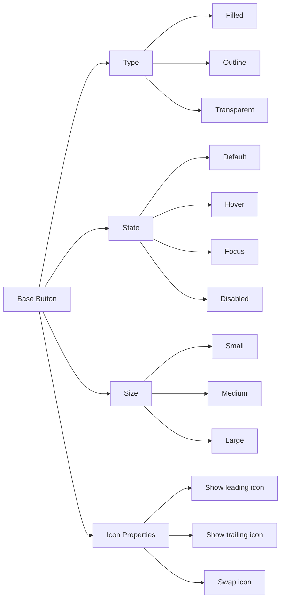
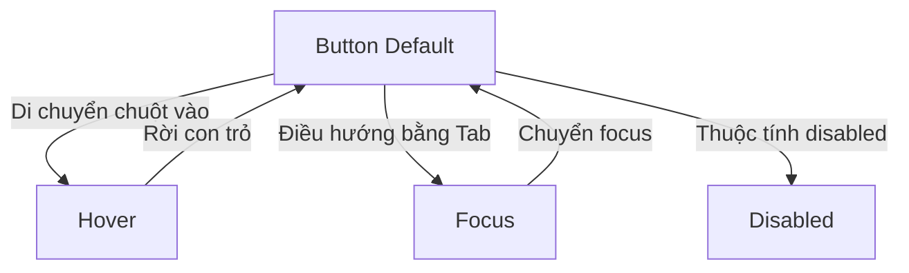
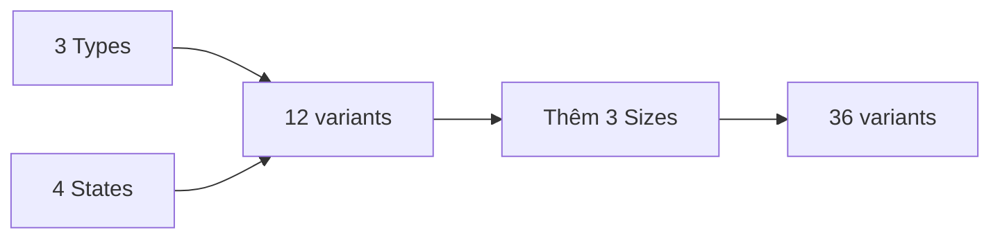
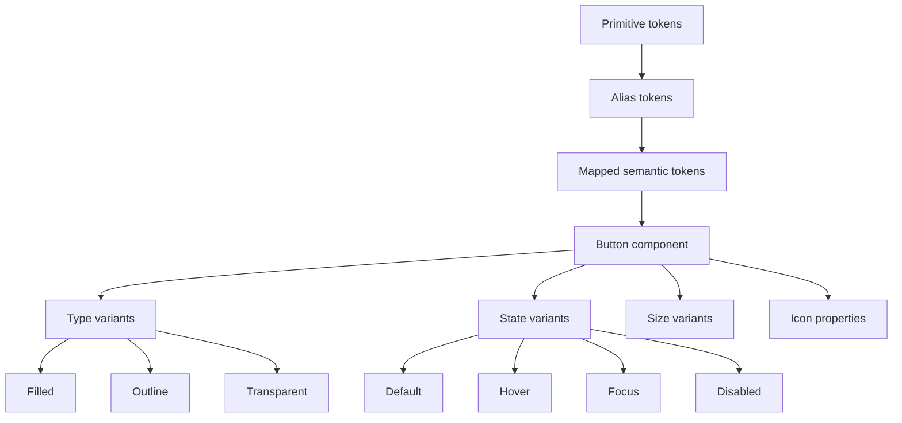

# 026 — Thêm các biến thể cho Button

## Thông tin bài học

| Thuộc tính               | Nội dung                                                              |
| ------------------------ | --------------------------------------------------------------------- |
| **Module**               | Icons, Variable Scoping & First Component                             |
| **Chủ đề**               | Thêm các biến thể cho Button                                          |
| **Thời điểm bắt đầu**    | `1:23:45` trong video đầy đủ                                          |
| **Thành phần thực hành** | Button component                                                      |
| **Kiến thức chính**      | Component properties, variant, state, style, boolean và instance swap |

---

## 1. Ý tưởng chính

Bài học mở rộng Button cơ bản thành một **Component Set** có nhiều biến thể. Thay vì tạo từng component riêng cho từng loại nút, chúng ta sử dụng các thuộc tính của Figma để một Button duy nhất có thể đáp ứng nhiều trường hợp sử dụng.

Các thuộc tính chính gồm:

* **Type/Style**: Filled, Outline, Transparent.
* **State**: Default, Hover, Focus, Disabled.
* **Size**: Small, Medium, Large.
* **Boolean properties**: bật hoặc tắt icon.
* **Instance swap properties**: thay đổi icon bên trong Button.

Mục tiêu là tạo ra một Button:

* dễ tái sử dụng;
* nhất quán với hệ thống token;
* dễ thay đổi trong bảng thuộc tính;
* hỗ trợ nhiều trạng thái tương tác;
* không phải tách thành hàng loạt component độc lập.

---

## 2. Từ Button cơ bản đến hệ thống Button

Trong bài trước, Button đã được xây dựng từ các token như:

* màu nền;
* màu chữ;
* màu icon;
* màu đường viền;
* border radius;
* padding;
* khoảng cách giữa icon và label.

Trong bài này, Button được mở rộng bằng các trục biến thể.



Kết quả cuối cùng không phải là nhiều Button rời rạc mà là một **Component Set** có thể cấu hình từ bảng Design của Figma.

---

# 3. Component properties trong Figma

## 3.1. Variant property

Variant property dùng để biểu diễn các lựa chọn có nhiều giá trị xác định trước.

Ví dụ:

```text
Type = Filled | Outline | Transparent
State = Default | Hover | Focus | Disabled
Size = Small | Medium | Large
```

Khi sử dụng một instance của Button, designer chỉ cần chọn giá trị tương ứng trong bảng thuộc tính.

Ví dụ:

```text
Type: Outline
State: Hover
Size: Medium
```

---

## 3.2. Boolean property

Boolean property phù hợp với những thành phần chỉ có hai trạng thái:

```text
Có / Không
Bật / Tắt
Hiển thị / Ẩn
```

Trong Button, Boolean property thường được dùng cho:

* hiển thị icon bên trái;
* hiển thị icon bên phải;
* hiển thị loading indicator;
* hiển thị label phụ.

Ví dụ:

```text
Show leading icon = True
Show trailing icon = False
```

Designer có thể bật hoặc tắt icon mà không cần detach component.

---

## 3.3. Instance swap property

Instance swap property cho phép thay thế một component con bằng một component khác.

Trong Button, nó thường được dùng để thay icon:

```text
Icon = Add
Icon = Arrow Right
Icon = Download
Icon = Delete
```

Nhờ đó, designer không cần truy cập sâu vào layer để thay icon thủ công.

Cấu trúc đề xuất:

```text
Button
├── Leading icon
├── Label
└── Trailing icon
```

Mỗi icon có thể được cấu hình bằng một instance swap property riêng.

---

# 4. Xây dựng các trạng thái của Button

## 4.1. Trạng thái Default

`Default` là trạng thái bình thường khi người dùng chưa tương tác với Button.

Ví dụ với Filled Button:

* nền sử dụng token `surface-action`;
* chữ sử dụng `text-on-action`;
* icon sử dụng `icon-on-action`;
* đường viền sử dụng token phù hợp với nền hoặc không hiển thị rõ.

```text
State = Default
```

Đây thường là trạng thái mặc định của property `State`.

---

## 4.2. Trạng thái Hover

`Hover` xuất hiện khi con trỏ chuột được đưa lên Button.

Các token có thể thay đổi:

```text
surface-action
→ surface-action-hover

text-on-action
→ text-on-action-hover

icon-on-action
→ icon-on-action-hover
```

Hover cần đủ khác biệt để người dùng nhận biết Button đang có thể tương tác, nhưng không nên thay đổi quá mạnh khiến giao diện bị giật hoặc mất ổn định.

---

## 4.3. Trạng thái Focus

`Focus` cho biết Button đang được chọn bằng bàn phím hoặc công nghệ hỗ trợ.

Thông thường, trạng thái Focus giữ màu gần giống Default nhưng bổ sung một vòng focus ở bên ngoài.

Ví dụ:

```text
Fill: surface-action
Text: text-on-action
Icon: icon-on-action
Focus ring: border-focus
```

Focus ring không nên chỉ dựa vào thay đổi màu nền. Nó cần đủ rõ ràng để hỗ trợ người dùng điều hướng bằng bàn phím.



---

## 4.4. Trạng thái Disabled

`Disabled` được sử dụng khi Button tạm thời không thể tương tác.

Trong bài học, trạng thái này được điều chỉnh để trông nhẹ hơn và ít tương phản hơn:

* nền chuyển sang `surface-disabled`;
* đường viền chuyển sang `border-disabled`;
* chữ chuyển sang `text-disabled`;
* icon chuyển sang `icon-disabled`.

Ví dụ:

```text
Background: surface-disabled
Border: border-disabled
Text: text-disabled
Icon: icon-disabled
```

Mục tiêu là giúp Button trông không hoạt động, nhưng nội dung vẫn có thể đọc được.

### Lưu ý

Không nên chỉ giảm opacity của toàn bộ Button một cách tùy ý vì:

* có thể làm chữ quá mờ;
* khó kiểm soát độ tương phản;
* icon và đường viền có thể bị mờ không đồng đều;
* kết quả có thể khác nhau trên từng loại nền.

Cách tốt hơn là sử dụng token riêng cho trạng thái Disabled.

---

# 5. Xây dựng các loại Button

Trong bài học, một property mới có tên `Type` được thêm vào Component Set.

Các giá trị chính gồm:

```text
Type = Filled
Type = Outline
Type = Transparent
```

---

## 5.1. Filled Button

Filled là Button có màu nền nổi bật.

Đặc điểm:

* có lớp fill;
* thường sử dụng màu hành động chính;
* chữ và icon sử dụng màu tương phản với nền;
* phù hợp với hành động chính.

Ví dụ:

```text
Fill: surface-action
Text: text-on-action
Icon: icon-on-action
Border: border-action hoặc không cần border
```

### Trường hợp sử dụng

* Submit;
* Continue;
* Save;
* Buy now;
* Confirm.

Filled Button thường là loại có mức độ nhấn mạnh cao nhất.

---

## 5.2. Outline Button

Outline Button có đường viền rõ ràng và nền trung tính.

Trong bài học, phần fill ban đầu bị loại bỏ nhưng sau đó được thêm lại bằng token nền mặc định. Điều này giúp phân biệt Outline với Transparent.

Ví dụ:

```text
Fill: surface-default
Border: border-action
Text: text-action
Icon: icon-action
```

Khi Hover:

```text
Fill: surface-default
Border: border-action-hover
Text: text-action-hover
Icon: icon-action-hover
```

### Điểm quan trọng

Outline Button không nhất thiết phải hoàn toàn trong suốt. Nó có thể có nền như:

```text
surface-default
```

Nhờ đó, Button vẫn giữ được một vùng nền ổn định khi đặt trên các surface phức tạp.

---

## 5.3. Transparent Button

Transparent Button không có nền và thường không có đường viền.

Ví dụ:

```text
Fill: None
Border: None
Text: text-action
Icon: icon-action
```

Transparent Button có mức độ nhấn mạnh thấp hơn Filled và Outline.

### Trường hợp sử dụng

* hành động phụ;
* Button trong toolbar;
* điều hướng;
* hành động nằm trong card;
* thao tác không cần quá nổi bật.

### Phân biệt Outline và Transparent

| Thuộc tính                     | Outline                       | Transparent                   |
| ------------------------------ | ----------------------------- | ----------------------------- |
| Nền                            | Có thể dùng `surface-default` | Không có fill                 |
| Đường viền                     | Có                            | Không                         |
| Mức độ nhấn mạnh               | Trung bình                    | Thấp                          |
| Khả năng nổi trên nền phức tạp | Tốt hơn                       | Phụ thuộc vào nền             |
| Trường hợp sử dụng             | Hành động phụ quan trọng      | Hành động nhẹ hoặc điều hướng |

---

# 6. Ma trận biến thể Button

Một Component Set có thể được tổ chức theo hai thuộc tính chính:

```text
Type × State
```

Ví dụ:

| Type        | Default | Hover | Focus | Disabled |
| ----------- | ------- | ----- | ----- | -------- |
| Filled      | Có      | Có    | Có    | Có       |
| Outline     | Có      | Có    | Có    | Có       |
| Transparent | Có      | Có    | Có    | Có       |

Tổng số biến thể:

```text
3 Types × 4 States = 12 variants
```

Nếu bổ sung ba kích thước:

```text
3 Types × 4 States × 3 Sizes = 36 variants
```

Đây là lý do cần thiết kế trục variant có chủ đích. Chỉ một thuộc tính mới cũng có thể làm số lượng variant tăng rất nhanh.



---

# 7. Đặt tên variant

Tên variant cần nhất quán và không bị trùng lặp.

Cấu trúc đề xuất:

```text
Type=Filled, State=Default, Size=Medium
Type=Outline, State=Hover, Size=Medium
Type=Transparent, State=Disabled, Size=Medium
```

Không nên sử dụng các cách đặt tên không nhất quán như:

```text
Style=Outline
Type=Transparent
Kind=Filled
```

Nếu các component sử dụng những tên property khác nhau, Figma có thể không gom chúng đúng vào cùng một Component Set hoặc tạo ra các thuộc tính trùng lặp.

Trong đoạn thực hành, một lỗi tên biến thể đã xuất hiện do một component vẫn mang tên property cũ. Cách xử lý là kiểm tra và chuẩn hóa lại:

```text
Type = Filled
Type = Outline
Type = Transparent
```

---

# 8. Quy trình thực hiện trong Figma

## Bước 1: Hoàn thiện Base Button

Đảm bảo Button cơ bản đã có:

* Auto Layout;
* label;
* icon nếu cần;
* padding;
* gap;
* radius;
* token màu;
* token typography.

---

## Bước 2: Tạo trạng thái Disabled

Nhân bản Button mặc định và đổi token:

```text
Surface → surface-disabled
Border → border-disabled
Text → text-disabled
Icon → icon-disabled
```

Đặt property:

```text
State = Disabled
```

---

## Bước 3: Tạo property Type

Tạo property mới:

```text
Type
```

Giá trị mặc định:

```text
Filled
```

---

## Bước 4: Tạo Outline Button

Nhân bản nhóm state của Filled và đổi:

```text
Type = Outline
```

Sau đó:

* chuyển nền sang `surface-default`;
* giữ đường viền;
* đổi chữ thành `text-action`;
* đổi icon thành `icon-action`;
* sử dụng token Hover tương ứng cho trạng thái Hover.

---

## Bước 5: Tạo Transparent Button

Nhân bản nhóm Outline và đổi:

```text
Type = Transparent
```

Sau đó:

* loại bỏ fill;
* loại bỏ border;
* giữ màu chữ và icon theo token hành động;
* kiểm tra độ tương phản trên nhiều loại nền.

---

## Bước 6: Kiểm tra tên property

Đảm bảo mọi component có cùng bộ property:

```text
Type
State
Size
```

Không để xuất hiện các property trùng ý nghĩa như:

```text
Type
Style
Button Type
Variant
```

---

## Bước 7: Combine as variants

Chọn toàn bộ Button và sử dụng:

```text
Combine as variants
```

Sau đó kiểm tra bảng Component Properties để bảo đảm Figma nhận đúng các giá trị.

---

## Bước 8: Kiểm thử trên nhiều nền

Đặt các Button lên:

* nền sáng;
* nền tối;
* surface mặc định;
* surface raised;
* hình ảnh hoặc nền phức tạp.

Việc này đặc biệt quan trọng với Transparent Button vì nó không có vùng nền bảo vệ chữ và icon.

---

# 9. Áp dụng vào một design system thực tế

Một cấu hình Button thực tế có thể gồm:

```text
Type:
- Primary
- Secondary
- Outline
- Ghost
- Destructive

Size:
- Small
- Medium
- Large

State:
- Default
- Hover
- Focus
- Pressed
- Disabled
- Loading

Leading icon:
- True
- False

Trailing icon:
- True
- False
```

Tuy nhiên, không nên thêm mọi biến thể ngay từ đầu.

Nên bắt đầu với những trường hợp thực sự xuất hiện trong sản phẩm:

```text
Filled
Outline
Transparent

Default
Hover
Focus
Disabled
```

Sau đó mở rộng khi có nhu cầu rõ ràng.

---

# 10. Token mapping đề xuất

## Filled Button

| State    | Surface                | Text                   | Icon                   | Border                |
| -------- | ---------------------- | ---------------------- | ---------------------- | --------------------- |
| Default  | `surface-action`       | `text-on-action`       | `icon-on-action`       | `border-action`       |
| Hover    | `surface-action-hover` | `text-on-action-hover` | `icon-on-action-hover` | `border-action-hover` |
| Focus    | `surface-action`       | `text-on-action`       | `icon-on-action`       | `border-focus`        |
| Disabled | `surface-disabled`     | `text-disabled`        | `icon-disabled`        | `border-disabled`     |

## Outline Button

| State    | Surface            | Text                | Icon                | Border                |
| -------- | ------------------ | ------------------- | ------------------- | --------------------- |
| Default  | `surface-default`  | `text-action`       | `icon-action`       | `border-action`       |
| Hover    | `surface-default`  | `text-action-hover` | `icon-action-hover` | `border-action-hover` |
| Focus    | `surface-default`  | `text-action`       | `icon-action`       | `border-focus`        |
| Disabled | `surface-disabled` | `text-disabled`     | `icon-disabled`     | `border-disabled`     |

## Transparent Button

| State    | Surface                           | Text                | Icon                | Border         |
| -------- | --------------------------------- | ------------------- | ------------------- | -------------- |
| Default  | None                              | `text-action`       | `icon-action`       | None           |
| Hover    | `surface-action-subtle` hoặc None | `text-action-hover` | `icon-action-hover` | None           |
| Focus    | None                              | `text-action`       | `icon-action`       | `border-focus` |
| Disabled | None                              | `text-disabled`     | `icon-disabled`     | None           |

Tên token trên chỉ là ví dụ. Design system thực tế có thể sử dụng quy ước đặt tên khác.

---

# 11. Rủi ro và giới hạn

## 11.1. Variant explosion

Số lượng variant có thể tăng rất nhanh.

Ví dụ:

```text
5 Types × 4 Sizes × 6 States × 4 Icon options
= 480 tổ hợp
```

Không phải tất cả các tổ hợp đều cần được tạo thành variant trực tiếp.

Có thể giảm số lượng bằng cách:

* dùng Boolean property cho việc bật/tắt icon;
* dùng Instance swap để thay icon;
* dùng text property để thay label;
* chỉ dùng variant cho những thay đổi ảnh hưởng đến cấu trúc hoặc giao diện chính.

---

## 11.2. Trùng lặp tên property

Nếu một số component dùng `Type`, số khác dùng `Style`, Figma có thể tạo ra hai property riêng biệt.

Cần kiểm tra tên trước khi combine thành variants.

---

## 11.3. Disabled không đủ rõ ràng

Button Disabled cần thể hiện rằng nó không thể tương tác nhưng vẫn phải đọc được.

Không nên:

* làm opacity quá thấp;
* để chữ gần như biến mất;
* dùng màu giống trạng thái Default;
* chỉ thay đổi con trỏ mà không thay đổi giao diện.

---

## 11.4. Transparent Button phụ thuộc vào nền

Transparent Button có thể trông tốt trên nền sáng nhưng mất độ tương phản trên nền tối hoặc ảnh.

Do đó cần:

* kiểm tra nhiều surface;
* sử dụng semantic token;
* cân nhắc phiên bản inverse;
* không hard-code màu chữ và icon.

---

## 11.5. Không phải sản phẩm nào cũng cần mọi loại Button

Một hệ thống có thể không cần:

* Outline Button;
* Transparent Button;
* nhiều kích thước;
* trạng thái riêng cho từng trường hợp thành công hoặc lỗi.

Component nên phản ánh nhu cầu thực tế của sản phẩm, không phải cố gắng bao phủ mọi khả năng tưởng tượng.

---

# 12. Trả lời câu hỏi ôn tập

## Câu 1: Mục đích chính của bài “Adding Button Variants” là gì?

Mục đích chính là biến Button cơ bản thành một component linh hoạt bằng cách thêm các thuộc tính như `Type`, `State` và `Size`.

Nhờ đó, một Button component có thể đại diện cho nhiều loại và trạng thái khác nhau mà không cần tạo các component độc lập.

Bài học cũng cho thấy cách kết hợp:

* variant properties;
* boolean properties;
* instance swap properties;
* semantic tokens.

---

## Câu 2: Áp dụng nội dung này vào một design system thực tế như thế nào?

Có thể xây dựng một Component Set với cấu trúc:

```text
Button
├── Type
│   ├── Filled
│   ├── Outline
│   └── Transparent
├── State
│   ├── Default
│   ├── Hover
│   ├── Focus
│   └── Disabled
├── Size
│   ├── Small
│   ├── Medium
│   └── Large
├── Leading icon
└── Trailing icon
```

Mỗi variant cần liên kết với semantic token thay vì sử dụng giá trị màu, khoảng cách hoặc radius cố định.

Designer có thể chọn Button, sau đó cấu hình trực tiếp trong bảng thuộc tính mà không cần detach component.

---

## Câu 3: Các bước và ý tưởng quan trọng được trình bày là gì?

Các bước chính gồm:

1. Hoàn thiện trạng thái Disabled.
2. Điều chỉnh token nền, đường viền, chữ và icon cho Disabled.
3. Thêm property `Type`.
4. Giữ Filled làm loại mặc định.
5. Tạo Outline Button với nền mặc định và đường viền.
6. Tạo Transparent Button không có fill và border.
7. Đồng bộ màu chữ và icon theo từng trạng thái.
8. Kiểm tra và sửa tên property bị trùng hoặc không nhất quán.
9. Gom các Button thành một Component Set.
10. Kiểm thử trên nhiều loại nền khác nhau.

---

## Câu 4: Rủi ro hoặc giới hạn cần lưu ý là gì?

Rủi ro lớn nhất là số lượng variant tăng quá nhanh khi kết hợp nhiều thuộc tính.

Ngoài ra còn có các vấn đề như:

* tên property không đồng nhất;
* trạng thái Disabled có độ tương phản quá thấp;
* Transparent Button khó đọc trên một số nền;
* sử dụng giá trị màu trực tiếp thay vì token;
* tạo nhiều loại Button mà sản phẩm không thực sự cần;
* cấu trúc component trở nên khó bảo trì.

Giải pháp là chỉ dùng variant cho các thay đổi quan trọng, đồng thời chuyển những lựa chọn nhị phân hoặc thay thế nội dung sang Boolean property và Instance swap property.

---

# 13. Tóm tắt bài học

Bài học mở rộng Button cơ bản thành một Component Set có thể tái sử dụng trong toàn bộ sản phẩm.

Ba loại Button chính được tạo ra:

```text
Filled → nền nổi bật, dành cho hành động chính
Outline → có nền trung tính và đường viền
Transparent → không có nền và đường viền
```

Mỗi loại hỗ trợ các trạng thái:

```text
Default
Hover
Focus
Disabled
```

Toàn bộ màu nền, chữ, icon và đường viền tiếp tục được liên kết với semantic token. Vì vậy, Button có thể thích ứng với theme, brand và các thay đổi của design system mà không cần chỉnh sửa từng instance.



Đây là bước chuyển quan trọng từ một component đơn lẻ sang một **component API** có cấu trúc, giúp designer sử dụng Button nhanh hơn, nhất quán hơn và an toàn hơn trong các sản phẩm lớn.
