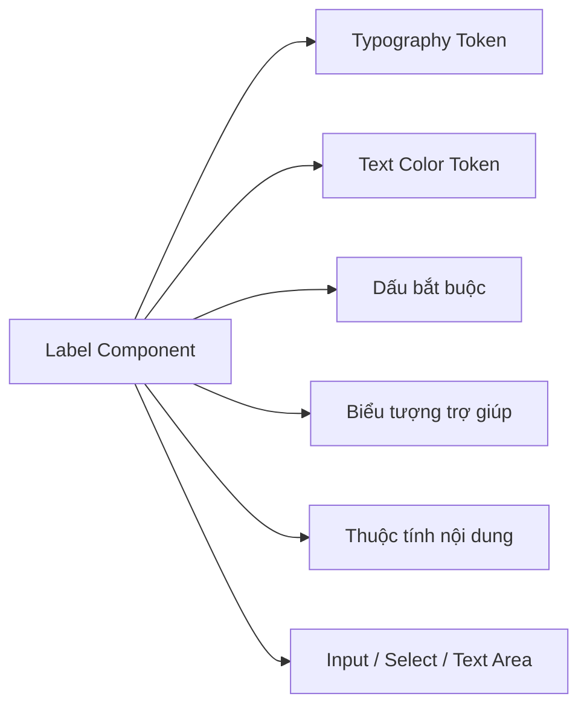
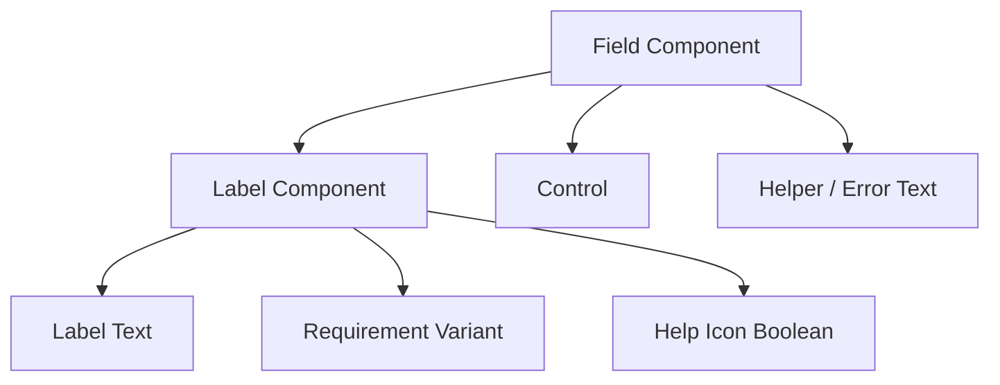

# 027 — Xây dựng Label Component

## Mô-đun

**Form Components — Các thành phần biểu mẫu**

## Mốc thời gian video

**1:27:28** — thời điểm bắt đầu trong video đầy đủ

## Tổng quan bài học

Bài học này xây dựng một **Label Component** có thể tái sử dụng cho các trường biểu mẫu. Thay vì tạo các lớp văn bản riêng lẻ phía trên từng ô nhập liệu, hệ thống thiết kế sử dụng một component duy nhất để quản lý kiểu chữ, màu sắc, khoảng cách, trạng thái bắt buộc và biểu tượng trợ giúp.

Label có thể được dùng lại cho:

- Input
- Text Area
- Select
- Checkbox Group
- Radio Group
- Switch
- Date Picker
- File Upload

## Mục tiêu học tập

Sau bài học này, bạn có thể:

- Tạo Label bằng Auto Layout.
- Liên kết typography và màu sắc với design token.
- Tạo thuộc tính chỉnh sửa nội dung nhãn.
- Hỗ trợ trạng thái mặc định, bắt buộc và không bắt buộc.
- Thêm hoặc ẩn biểu tượng trợ giúp.
- Dùng Label như một component con trong Field.

## Vì sao nên tách Label thành component riêng?

Label có các quy tắc và hành vi riêng:

- Có thể là trường bắt buộc hoặc không bắt buộc.
- Có thể chứa biểu tượng trợ giúp.
- Phải đồng nhất về typography và màu sắc.
- Phải căn thẳng hàng giữa các trường.
- Có thể được dùng trong nhiều loại form control khác nhau.

Nếu gộp Label trực tiếp vào từng Input, hệ thống sẽ bị lặp lại cấu trúc và khó cập nhật về sau.



## Cấu trúc component

```text
Label
├── Required Indicator
├── Label Content
│   ├── Label Text
│   └── Help Icon
```

Ví dụ:

```text
*  Địa chỉ email  [?]
│  │               │
│  │               └─ Biểu tượng trợ giúp
│  └─ Nội dung nhãn
└─ Dấu hiệu trường bắt buộc
```

## Thiết lập Auto Layout đề xuất

| Thuộc tính | Giá trị đề xuất |
|---|---|
| Hướng | Horizontal |
| Căn chỉnh | Center |
| Khoảng cách | 4–8 px |
| Padding ngang | 0 |
| Padding dọc | 0 |
| Chiều rộng | Hug contents |
| Chiều cao | Hug contents |

Các giá trị khoảng cách nên lấy từ spacing token.

## Liên kết với token

| Thuộc tính | Token đề xuất |
|---|---|
| Font family | Typography token |
| Font size | Typography token |
| Font weight | Typography token |
| Line height | Typography token |
| Màu nhãn mặc định | `text/default` |
| Màu nhãn disabled | `text/disabled` |
| Màu dấu bắt buộc | `icon/error` hoặc `text/error` |
| Màu biểu tượng trợ giúp | `icon/secondary` |
| Gap | Spacing token |

Ví dụ:

```text
Label text     → text/default
Required mark  → icon/error
Help icon      → icon/secondary
Disabled label → text/disabled
```

## Các bước xây dựng

### 1. Tạo nội dung Label

Tạo một text layer như `Label` và áp dụng Text Style dành cho nhãn biểu mẫu.

Không nên nhập trực tiếp font size, font weight hoặc line height nếu hệ thống đã có token.

### 2. Thêm biểu tượng trợ giúp

Đặt một biểu tượng Help hoặc Info bên cạnh Label.

Kích thước **20 × 20 px** thường phù hợp với body text hơn biểu tượng 24 × 24 px.

### 3. Áp dụng Auto Layout

Bọc Label Text và Help Icon trong Auto Layout ngang.

Thiết lập:

- Width: Hug contents
- Height: Hug contents
- Alignment: Center
- Gap: dùng spacing token

### 4. Chuyển thành component

Tên đề xuất:

```text
Form/Label
```

### 5. Tạo Component Properties

| Property | Loại | Mục đích |
|---|---|---|
| `Label` | Text | Thay đổi nội dung nhãn |
| `Show help icon` | Boolean | Hiện hoặc ẩn biểu tượng trợ giúp |
| `Help icon` | Instance swap | Thay thế biểu tượng |
| `Requirement` | Variant | Default, Required, Optional |
| `State` | Variant | Default, Disabled |

Chỉ nên expose những property thực sự hữu ích cho người sử dụng component.

## Biến thể bắt buộc và không bắt buộc

```text
Requirement = Default
Requirement = Required
Requirement = Optional
```

### Trường bắt buộc

Có thể thêm dấu `*` trước Label:

```text
* Email
```

Việc đặt dấu bắt buộc trước nội dung giúp người dùng nhận biết trạng thái trước khi đọc tên trường.

### Giữ thẳng hàng Label

Nếu dấu `*` nằm trong Auto Layout thông thường, Label bắt buộc có thể bị đẩy sang phải.

Một giải pháp là dùng **Absolute Position** cho dấu `*`.

```text
* Email
  Phone
  Name
  ↑
Các Label vẫn bắt đầu tại cùng một vị trí
```

Cần kiểm tra kỹ component bounds và hành vi resize khi dùng Absolute Position.

### Trường không bắt buộc

Có thể hiển thị:

```text
Số điện thoại (không bắt buộc)
```

Phần `(không bắt buộc)` nên dùng màu chữ phụ.

## Khả năng truy cập

Trong code, Label cần:

- Được liên kết với đúng input.
- Không dùng placeholder thay cho Label.
- Không chỉ dùng màu sắc để thể hiện trạng thái bắt buộc.
- Help Icon cần accessible name.
- Tooltip phải dùng được bằng bàn phím.
- Trạng thái disabled phải vẫn đủ độ tương phản.

## Áp dụng trong design system



Label nên được dùng như nested instance trong các component lớn hơn.

## Lỗi thường gặp

### Dùng text layer rời

Dễ gây sai lệch font, màu và spacing.

### Dùng placeholder thay Label

Placeholder biến mất sau khi nhập nội dung.

### Tạo quá nhiều variants

Không cần tạo variant cho từng nội dung Label. Nội dung nên dùng Text Property.

### Dấu bắt buộc làm lệch hàng

Cần kiểm tra Alignment giữa các Label khi xếp dọc.

### Biểu tượng quá lớn

Icon 24 px có thể làm component cao hơn cần thiết.

## Câu hỏi ôn tập

### 1. Mục đích chính của Label Component là gì?

Tạo một thành phần nhãn dùng lại được, giúp quản lý typography, màu sắc, trạng thái bắt buộc và biểu tượng trợ giúp một cách thống nhất.

### 2. Áp dụng vào design system thực tế như thế nào?

Tạo Label sử dụng token, expose Text Property, Boolean Property và Requirement Variant, sau đó dùng nó bên trong Field.

### 3. Các bước chính là gì?

Tạo text, thêm icon, dùng Auto Layout, bind token, chuyển thành component và tạo các property cần thiết.

### 4. Rủi ro cần lưu ý là gì?

Quá nhiều property có thể khiến component khó sử dụng. Absolute Position cũng có thể gây lỗi căn chỉnh khi resize.

## Checklist hoàn thành

- [ ] Typography dùng Text Style hoặc token.
- [ ] Màu chữ và icon dùng semantic token.
- [ ] Spacing dùng spacing token.
- [ ] Nội dung Label được expose.
- [ ] Help Icon có thể bật hoặc tắt.
- [ ] Có trạng thái Required và Optional.
- [ ] Label bắt buộc không làm lệch hàng.
- [ ] Có trạng thái Disabled.
- [ ] Đã kiểm tra trong nhiều loại form control.
- [ ] Có hướng dẫn accessibility cho developer.

## Tóm tắt

Label Component là một thành phần nhỏ nhưng quan trọng. Việc tách Label thành component riêng giúp giảm lặp lại, giữ giao diện nhất quán và tạo nền tảng cho Field, Input, Text Area cùng các form component khác.

---

# Bài luyện tập

## Mục tiêu


## Đề bài


## Yêu cầu hoàn thành

- [ ] 
- [ ] 
- [ ] 

## Kết quả / lời giải


## Ghi chú
