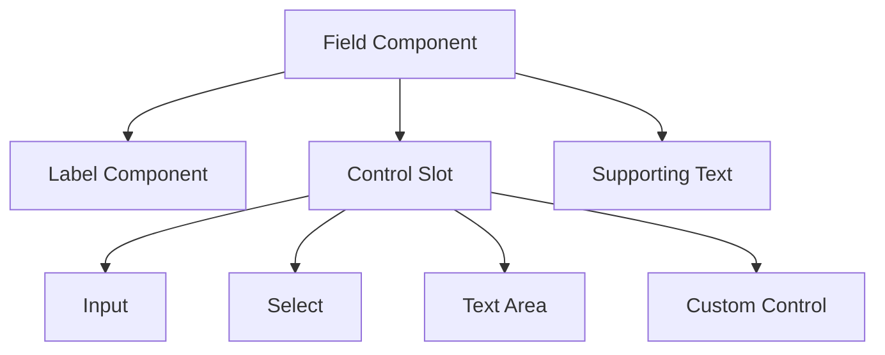
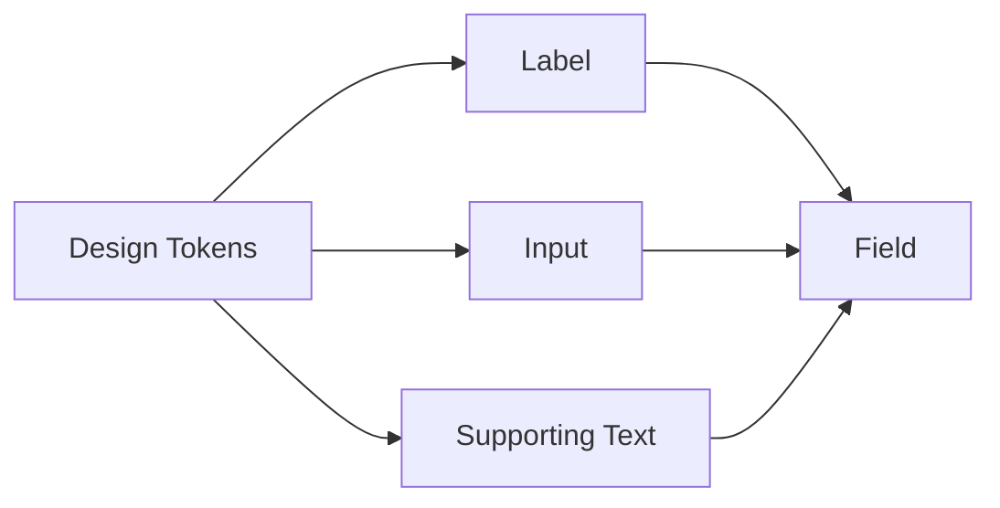

# 028 — Xây dựng Field Component

## Mô-đun

**Form Components — Các thành phần biểu mẫu**

## Mốc thời gian video

**1:31:09**

## Tổng quan bài học

Bài học này xây dựng **Field Component**, một wrapper kết hợp:

- Label
- Form control
- Helper text
- Error text

Field chịu trách nhiệm tổ chức bố cục và trạng thái ở cấp trường biểu mẫu, trong khi Input hoặc Text Area chịu trách nhiệm hiển thị control.

## Mục tiêu học tập

- Kết hợp nhiều component nhỏ thành một component lớn.
- Dùng nested instance.
- Tạo khu vực control có thể thay thế.
- Hiển thị Helper Text hoặc Error Text.
- Expose các property cần thiết.
- Phân biệt trách nhiệm của Field và Input.

## Cấu trúc Field

```text
Field
├── Label
├── Control Slot
└── Supporting Text
```

Ví dụ:

```text
Địa chỉ email
[ name@example.com            ]
Chúng tôi sẽ dùng email này để khôi phục tài khoản.
```

## Sơ đồ composition



## Cấu trúc layer đề xuất

```text
Form/Field
├── Label Instance
├── Control Container
│   └── Control Instance
└── Supporting Text
    ├── Supporting Icon
    └── Supporting Message
```

## Auto Layout

Field thường dùng Auto Layout dọc.

| Thuộc tính | Giá trị |
|---|---|
| Hướng | Vertical |
| Width | Fill container |
| Height | Hug contents |
| Alignment | Stretch hoặc Left |
| Gap Label–Control | Small spacing token |
| Gap Control–Message | Small spacing token |

## Các bước xây dựng

### 1. Chèn Label Component

Dùng Label Component từ bài trước.

Có thể expose:

- Label text
- Requirement
- Help icon
- Help icon visibility

### 2. Tạo Control Slot

Control Slot có thể dùng:

- Instance Swap
- Nested Instance
- Preferred Values
- Component Property

Ví dụ các control được phép thay thế:

```text
Input
Select
Text Area
Date Picker
```

### 3. Thêm Supporting Text

Supporting Text có thể là:

- Helper text
- Error text
- Success message
- Disabled explanation

### 4. Dùng Auto Layout dọc

Field nên Fill Width và Hug Height.

Control và Supporting Text nên Fill Container.

### 5. Chuyển thành component

Tên đề xuất:

```text
Form/Field
```

### 6. Tạo properties

| Property | Loại | Mục đích |
|---|---|---|
| `Label` | Text | Tên trường |
| `Requirement` | Variant | Default, Required, Optional |
| `Control` | Instance swap | Đổi loại control |
| `Supporting text` | Text | Helper hoặc validation message |
| `Show supporting text` | Boolean | Hiện hoặc ẩn message |
| `Show supporting icon` | Boolean | Hiện hoặc ẩn icon |
| `State` | Variant | Default, Error, Disabled, Success |

## Helper Text và Error Text

| Loại | Mục đích |
|---|---|
| Helper Text | Hướng dẫn người dùng trước khi nhập |
| Error Text | Giải thích giá trị hiện tại sai ở đâu |
| Success Text | Xác nhận dữ liệu hợp lệ |
| Disabled Text | Giải thích lý do không thể sử dụng |

Ví dụ Helper:

```text
Mật khẩu phải có ít nhất 8 ký tự.
```

Ví dụ Error:

```text
Mật khẩu hiện chỉ có 5 ký tự.
```

## Atomic Design

Field là ví dụ của việc ghép các component nhỏ thành component lớn hơn.



## Khả năng truy cập

Trong code:

- Label phải liên kết với control.
- Helper và Error Text phải được liên kết bằng thuộc tính mô tả.
- Error state phải được truyền đạt ngoài màu sắc.
- Required state phải có semantic attribute.
- Error message cần rõ ràng và có hướng dẫn sửa.

## Lỗi thường gặp

### Tạo một siêu component quá lớn

Không nên đưa mọi loại control vào một component có hàng trăm biến thể.

### Expose quá nhiều nested properties

Instance Panel sẽ trở nên khó sử dụng.

### Field và Input không đồng bộ state

Ví dụ:

```text
Field State = Error
Input State = Default
```

### Hiện Helper và Error cùng lúc không có quy tắc

Cần xác định Error thay thế Helper hay hiển thị đồng thời.

## Câu hỏi ôn tập

### 1. Mục đích của Field Component là gì?

Tạo một cấu trúc dùng lại được gồm Label, Control và Supporting Text.

### 2. Áp dụng thực tế như thế nào?

Dùng nested Label, nested Input, Auto Layout dọc và expose các property quan trọng.

### 3. Ý tưởng chính là gì?

Component composition, Control Slot, Nested Properties, Helper Text và Error Text.

### 4. Rủi ro cần lưu ý?

Field có thể trở thành component quá phức tạp nếu hỗ trợ quá nhiều control và state.

## Checklist

- [ ] Field dùng Auto Layout dọc.
- [ ] Label là nested instance.
- [ ] Control Fill Container.
- [ ] Supporting Text có thể chỉnh sửa.
- [ ] Có thể bật hoặc tắt Supporting Text.
- [ ] Control Slot chỉ chứa component được phê duyệt.
- [ ] State giữa Field và Control đồng bộ.
- [ ] Có hướng dẫn accessibility.
- [ ] Đã kiểm tra trên nhiều kích thước.
- [ ] Property name dễ hiểu.

## Tóm tắt

Field Component giúp gom Label, Control và Supporting Text thành một cấu trúc thống nhất. Cách làm này giảm trùng lặp và giúp các form component duy trì cùng một hệ thống layout và trạng thái.

---

# Bài luyện tập

## Mục tiêu


## Đề bài


## Yêu cầu hoàn thành

- [ ] 
- [ ] 
- [ ] 

## Kết quả / lời giải


## Ghi chú
