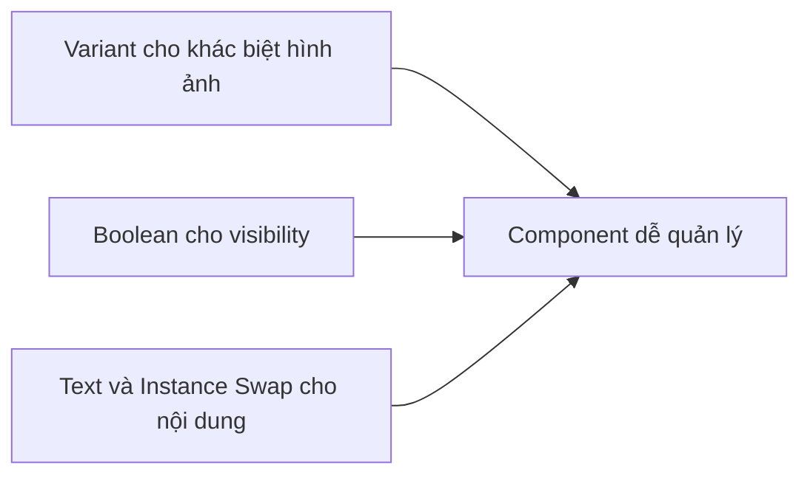

# 029 — Thêm biến thể cho Field

## Mô-đun

**Form Components**

## Mốc thời gian video

**1:34:53**

## Tổng quan bài học

Bài học này thêm các variant cho Field Component nhằm biểu diễn các trạng thái:

- Default
- Error
- Disabled
- Success

Ngoài ra, Supporting Text được điều khiển bằng Boolean Property để tránh tạo quá nhiều tổ hợp variant.

## Mục tiêu học tập

- Xây dựng state model rõ ràng.
- Tạo Field Variant.
- Dùng Boolean Property cho visibility.
- Đồng bộ state giữa Field và Input.
- Bind semantic token theo từng state.
- Tránh variant explosion.

## State Model đề xuất

```text
State = Default
State = Error
State = Disabled
State = Success
```

Hệ thống lớn hơn có thể thêm:

```text
Hover
Focus
Filled
Read-only
Loading
```

## Sơ đồ trạng thái

```mermaid
stateDiagram-v2
    [*] --> Default
    Default --> Focus: Control nhận focus
    Focus --> Filled: Người dùng nhập dữ liệu
    Default --> Error: Validation thất bại
    Focus --> Error: Validation thất bại
    Error --> Focus: Người dùng sửa dữ liệu
    Default --> Disabled: Field không khả dụng
```

## Component Properties

| Property | Loại |
|---|---|
| `State` | Variant |
| `Requirement` | Variant |
| `Show supporting text` | Boolean |
| `Supporting text` | Text |
| `Show supporting icon` | Boolean |
| `Control` | Instance swap |
| `Show label` | Boolean |

## Các bước tạo variant

### 1. Nhân bản Field gốc

Tạo các biến thể từ cùng một cấu trúc gốc.

### 2. Tạo Variant Property

```text
State = Default
State = Error
State = Disabled
State = Success
```

### 3. Đổi token theo state

| State | Border | Supporting Text | Icon |
|---|---|---|---|
| Default | `border/default` | `text/secondary` | `icon/secondary` |
| Error | `border/error` | `text/error` | `icon/error` |
| Success | `border/success` | `text/success` | `icon/success` |
| Disabled | `border/disabled` | `text/disabled` | `icon/disabled` |

### 4. Thêm Boolean Property

Không nên tạo các variant:

```text
Default + Helper
Default + No Helper
Error + Helper
Error + No Helper
```

Thay vào đó:

```text
Show supporting text = True / False
```

### 5. Expose nội dung message

Dùng Text Property cho Supporting Text.

### 6. Đồng bộ nested Input

Khi Field là Error, Input cũng phải hiển thị Error.

## Cách đồng bộ state

### Cách A — Chỉnh thủ công nested property

Ưu điểm: linh hoạt  
Nhược điểm: dễ sai

### Cách B — Field Variant chứa Input đã cấu hình sẵn

Ưu điểm: đáng tin cậy  
Nhược điểm: nhiều variant hơn

### Cách C — Mapping property

Dùng property name đồng nhất để giảm số thao tác.

### Cách D — Tách từng Field theo control

```text
Text Field
Select Field
Text Area Field
```

Ưu điểm: rõ ràng  
Nhược điểm: nhiều component cấp cao hơn

## Variant Explosion

Giả sử có:

- 5 state
- 3 requirement
- 2 label visibility
- 2 message visibility
- 3 control type

Số tổ hợp:

```text
5 × 3 × 2 × 2 × 3 = 180
```



## Quy tắc Error State

Error State cần trả lời:

1. Lỗi nằm ở đâu?
2. Lỗi là gì?
3. Người dùng sửa như thế nào?

Không tốt:

```text
Không hợp lệ.
```

Tốt hơn:

```text
Nhập email theo định dạng name@example.com.
```

## Disabled State

Disabled có thể thay đổi:

- Label color
- Surface
- Border
- Placeholder
- Icon
- Supporting Text

Không nên dùng opacity quá thấp làm nội dung khó đọc.

## Lỗi thường gặp

- Dùng variant để lưu nội dung.
- Trộn Interaction State và Validation State.
- Chỉ dùng màu để báo lỗi.
- Field và nested Input không đồng bộ.
- Tạo mọi tổ hợp dưới dạng variant.

## Câu hỏi ôn tập

### 1. Mục đích của Field Variant là gì?

Giúp một Field Component biểu diễn các trạng thái khác nhau mà không cần tạo component riêng.

### 2. Áp dụng thực tế như thế nào?

Dùng Variant cho State, Boolean cho visibility, Text Property cho message và đồng bộ nested Input.

### 3. Ý tưởng chính là gì?

State-driven variant, Boolean Property, semantic token và state synchronization.

### 4. Rủi ro cần lưu ý?

Variant Explosion và state mismatch.

## Checklist

- [ ] Có state model rõ ràng.
- [ ] Tên state nhất quán.
- [ ] Mỗi state dùng semantic token.
- [ ] Supporting Text dùng Boolean Property.
- [ ] Message dùng Text Property.
- [ ] Error không chỉ thể hiện bằng màu.
- [ ] Disabled đủ độ tương phản.
- [ ] Nested Control đồng bộ.
- [ ] Đã loại bỏ tổ hợp không cần thiết.
- [ ] Instance Panel dễ sử dụng.

## Tóm tắt

Field Variant giúp kiểm soát trạng thái của biểu mẫu một cách nhất quán. Variant chỉ nên dùng cho khác biệt hình ảnh có ý nghĩa, còn visibility và nội dung nên dùng Boolean, Text và Instance Swap Property.