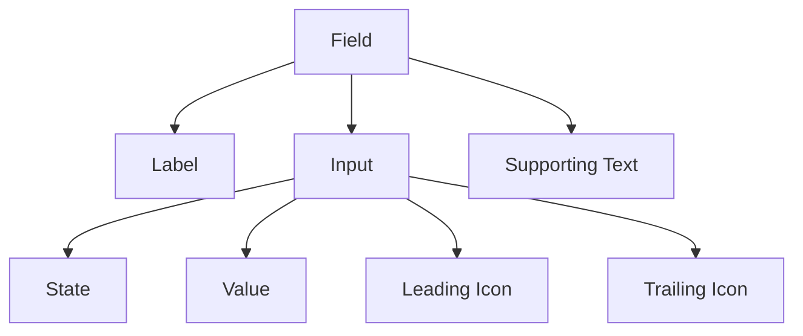

# 030 — Xây dựng Input Component

## Mô-đun

**Form Components**

## Mốc thời gian video

**1:38:27**

## Tổng quan bài học

Bài học này xây dựng **Input Component**, phần bề mặt nhập liệu gồm border, surface, placeholder, value và các icon.

Mọi trạng thái của Input nên được điều khiển bằng semantic token.

## Mục tiêu học tập

- Xây dựng cấu trúc Input.
- Dùng Auto Layout cho padding và icon alignment.
- Bind surface, border, text, radius và spacing token.
- Tạo Default, Hover, Focus, Error và Disabled.
- Hỗ trợ Leading Icon và Trailing Icon.
- Phân biệt Placeholder và Filled Value.

## Cấu trúc Input

```text
┌────────────────────────────────────┐
│ [Icon]  Nội dung          [Icon]   │
└────────────────────────────────────┘
```

## Layer Structure

```text
Form/Input
├── Focus Ring
└── Input Container
    ├── Leading Icon
    ├── Value
    └── Trailing Icon
```

Focus Ring có thể dùng Absolute Position để không làm thay đổi kích thước component.

## Auto Layout

| Thuộc tính | Giá trị |
|---|---|
| Hướng | Horizontal |
| Alignment | Center |
| Width | Fill Container |
| Height | Fixed hoặc Hug |
| Value | Fill Container |
| Icon | 20 × 20 px |
| Padding | Spacing token |
| Gap | Spacing token |

```text
[Icon] [Value chiếm toàn bộ vùng còn lại.........] [Icon]
```

## Token Mapping

| Thuộc tính | Token |
|---|---|
| Surface | `surface/form-control` |
| Border mặc định | `border/input-default` |
| Hover Border | `border/input-hover` |
| Focus Ring | `border/focus` |
| Error Border | `border/error` |
| Disabled Surface | `surface/disabled` |
| Placeholder | `text/placeholder` |
| Value | `text/primary` |
| Icon | `icon/secondary` |
| Radius | Radius token |
| Padding | Spacing token |

## Các bước xây dựng

### 1. Tạo Container

Dùng frame với Auto Layout ngang.

### 2. Thêm Leading và Trailing Icon

Dùng icon instance thay vì vector rời.

Properties đề xuất:

```text
Show leading icon
Leading icon
Show trailing icon
Trailing icon
```

### 3. Thêm Value Layer

Text Layer nên Fill Container.

Expose nội dung:

```text
Value
```

### 4. Bind Border và Surface

Không dùng màu hard-code.

### 5. Chuyển thành component

```text
Form/Input
```

### 6. Tạo State Variants

```text
State = Default
State = Hover
State = Focus
State = Error
State = Disabled
```

## Trạng thái Input

### Default

- Default border
- Default surface
- Placeholder hoặc Value
- Icon trung tính

### Hover

- Border nổi bật hơn
- Có thể đổi nhẹ Surface
- Không nên giống Focus hoặc Error

### Focus

Focus cần dễ nhận biết.

```text
┌────────────────────────────────────┐
│ ┌────────────────────────────────┐ │
│ │ Input                          │ │
│ └────────────────────────────────┘ │
└────────────────────────────────────┘
```

Nên dùng Focus Ring bên ngoài.

### Error

- Error Border
- Có thể có Error Icon
- Error Message nằm ở Field

### Disabled

- Disabled Surface
- Disabled Border
- Disabled Text
- Disabled Icon

## Placeholder và Filled

```text
Empty  → text/placeholder
Filled → text/primary
```

Có thể dùng:

- `Content = Placeholder / Filled`
- Boolean `Has value`
- Documentation nếu khác biệt nhỏ

## Component Properties

| Property | Loại |
|---|---|
| `State` | Variant |
| `Value` | Text |
| `Show leading icon` | Boolean |
| `Leading icon` | Instance swap |
| `Show trailing icon` | Boolean |
| `Trailing icon` | Instance swap |
| `Content` | Variant hoặc Boolean |
| `Type` | Variant khi thật sự cần |

Không nên tạo variant chỉ để mô phỏng HTML input type nếu giao diện không khác nhau.

## Sơ đồ composition



## Khả năng truy cập

- Focus phải nhìn thấy rõ.
- Placeholder không thay thế Label.
- Disabled khác Read-only.
- Icon button cần accessible name.
- Error Message phải liên kết với Input.
- Text contrast phải đủ.
- Target của icon action phải đủ lớn.

## Lỗi thường gặp

- Dùng fixed width.
- Text không Fill Container.
- Thay border width làm component bị nhảy kích thước.
- Dùng opacity cho mọi Disabled State.
- Tạo variant theo từng placeholder.
- Focus State quá khó nhận biết.

## Câu hỏi ôn tập

### 1. Mục đích chính của Input Component là gì?

Tạo bề mặt nhập liệu có thể tái sử dụng, được điều khiển bởi token và component property.

### 2. Áp dụng thực tế như thế nào?

Dùng Auto Layout ngang, bind semantic token, expose icon và text property, sau đó đặt Input trong Field.

### 3. Các bước chính là gì?

Tạo Container, thêm icon, thêm Value, bind token, tạo component và thêm state variants.

### 4. Rủi ro cần lưu ý?

Variant có thể quá nhiều, Focus có thể không đạt accessibility và Figma không mô phỏng được hành vi input thực.

## Checklist

- [ ] Input dùng Auto Layout ngang.
- [ ] Value Fill Container.
- [ ] Icon dùng instance.
- [ ] Icon có Boolean và Instance Swap.
- [ ] Border, Surface, Text dùng token.
- [ ] Padding và Radius dùng token.
- [ ] Có Default, Hover, Focus, Error, Disabled.
- [ ] Focus không làm đổi kích thước.
- [ ] Placeholder và Value khác nhau.
- [ ] Đã kiểm tra bên trong Field.

## Tóm tắt

Input Component là thành phần nhập liệu cốt lõi. Auto Layout, semantic token, state variant và component property giúp Input hoạt động nhất quán trong toàn bộ design system.

---

# Bài luyện tập

## Mục tiêu


## Đề bài


## Yêu cầu hoàn thành

- [ ] 
- [ ] 
- [ ] 

## Kết quả / lời giải


## Ghi chú
