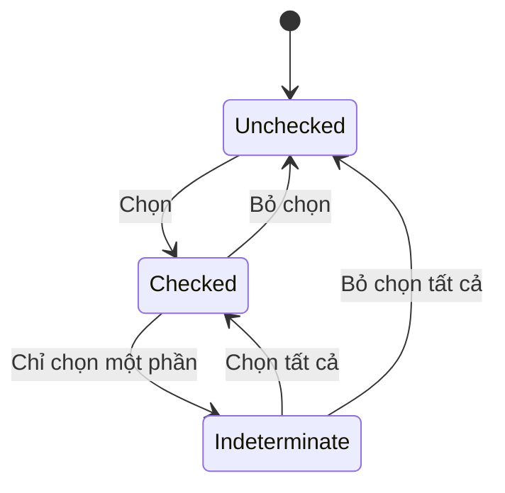

# 031 — Xây dựng Checkbox

## Mô-đun

**Form Components**

## Mốc thời gian video

**1:54:00**

## Tổng quan bài học

Bài học này xây dựng Checkbox với các trạng thái:

- Unchecked
- Checked
- Indeterminate
- Hover
- Focus
- Disabled

Checkbox được dùng khi người dùng có thể chọn không, một hoặc nhiều lựa chọn độc lập.

## Mục tiêu học tập

- Tạo Checkbox Control.
- Tách Selection và Interaction State.
- Bind token cho từng trạng thái.
- Ghép Checkbox với Label.
- Hỗ trợ Indeterminate.
- Đảm bảo Focus và target size.

## Cấu trúc

```text
[✓] Nhận thông báo sản phẩm
 │  └─ Label
 └─ Checkbox Control
```

## Layer Structure

```text
Form/Checkbox
├── Control
│   └── Indicator Icon
└── Content
    ├── Label
    └── Supporting Text
```

## State Model

```text
Selection = Unchecked
Selection = Checked
Selection = Indeterminate
```

```text
State = Default
State = Hover
State = Focus
State = Disabled
```



## Token Mapping

| Thuộc tính | Token |
|---|---|
| Unchecked Surface | Control Surface |
| Unchecked Border | Default Border |
| Checked Surface | Selected Surface |
| Check Icon | On-action Icon |
| Focus Ring | Focus Token |
| Disabled Surface | Disabled Surface |
| Label | Default hoặc Disabled Text |

## Các bước xây dựng

### 1. Tạo Control

Tạo frame hình vuông với Border, Surface và Radius Token.

### 2. Thêm Indicator

- Check Icon cho Checked
- Minus Icon cho Indeterminate
- Ẩn icon ở Unchecked

### 3. Tạo Selection Variants

```text
Unchecked
Checked
Indeterminate
```

### 4. Tạo Interaction Variants

```text
Default
Hover
Focus
Disabled
```

### 5. Thêm Focus Ring

Focus Ring phải rõ và không làm thay đổi kích thước component.

### 6. Ghép với Label

Dùng Auto Layout ngang.

Nếu Label dài nhiều dòng, Checkbox nên căn theo dòng đầu tiên.

## Component Properties

| Property | Loại |
|---|---|
| `Selection` | Variant |
| `State` | Variant |
| `Label` | Text |
| `Show label` | Boolean |
| `Show supporting text` | Boolean |
| `Supporting text` | Text |

Không nên chỉ dùng Boolean `Checked` nếu hệ thống có Indeterminate.

## Accessibility

- Dùng native checkbox trong code nếu có thể.
- Label phải click được.
- Hỗ trợ bàn phím và phím Space.
- Indeterminate phải được truyền đạt bằng semantic.
- Không dùng màu là tín hiệu duy nhất.
- Focus phải nhìn thấy.
- Target tương tác phải đủ lớn.
- Disabled không được tương tác.

## Khi nào dùng Checkbox?

- Chọn nhiều filter.
- Đồng ý điều khoản.
- Chọn nhiều mục trong danh sách.
- Chọn tất cả hoặc một phần các mục con.
- Bật lựa chọn sẽ được gửi cùng form.

Không dùng Checkbox cho lựa chọn loại trừ lẫn nhau.

## Lỗi thường gặp

- Dùng Checkbox thay Switch.
- Chỉ có Checked và Unchecked.
- Chỉ cho phép click vào ô vuông.
- Căn giữa Checkbox với đoạn text nhiều dòng.
- Ẩn Focus Ring.
- Dùng màu duy nhất để biểu diễn Checked.

## Câu hỏi ôn tập

### 1. Mục đích của Checkbox Component là gì?

Cung cấp một control đa lựa chọn có trạng thái Selection và Interaction rõ ràng.

### 2. Áp dụng thực tế như thế nào?

Tạo Control bằng token, thêm Checked và Indeterminate Icon, tạo state variants và ghép với Label.

### 3. Ý tưởng chính là gì?

Selection State, Interaction State, token binding, Label pairing và Accessibility.

### 4. Rủi ro cần lưu ý?

Variant Matrix có thể lớn và Figma không thể mô phỏng đầy đủ hành vi bàn phím hoặc mixed state.

## Checklist

- [ ] Có Unchecked, Checked, Indeterminate.
- [ ] Có Default, Hover, Focus, Disabled.
- [ ] Mọi màu dùng token.
- [ ] Checked không chỉ biểu diễn bằng màu.
- [ ] Focus Ring rõ ràng.
- [ ] Căn đúng với Label nhiều dòng.
- [ ] Label có Text Property.
- [ ] Supporting Text có thể bật hoặc tắt.
- [ ] Có tài liệu phân biệt Checkbox và Radio.
- [ ] Có hướng dẫn Accessibility.

## Tóm tắt

Checkbox cần thể hiện đầy đủ trạng thái chọn, trạng thái hỗn hợp và trạng thái tương tác. Một Checkbox tốt phải nhất quán về token, rõ ràng về hành vi và có thể kết hợp với Label trong nhiều ngữ cảnh.