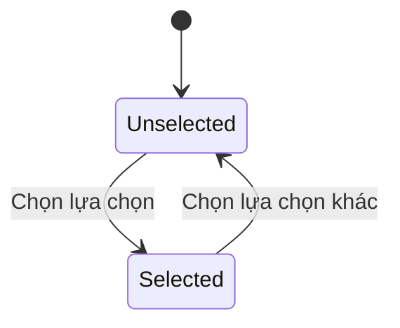
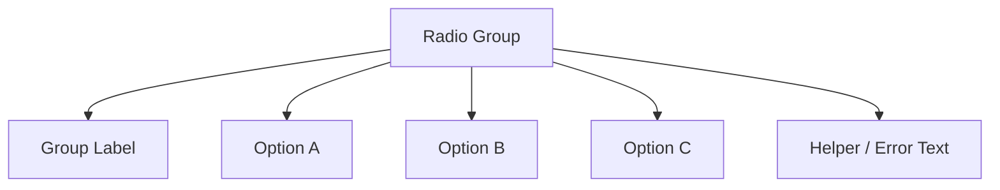

# 032 — Xây dựng Radio Button

## Mô-đun

**Form Components**

## Mốc thời gian video

**2:00:30**

## Tổng quan bài học

Radio Button dùng khi người dùng chỉ được chọn **một lựa chọn duy nhất** trong một nhóm.

Bài học tái sử dụng pattern đã xây dựng cho Checkbox.

## Mục tiêu học tập

- Tạo Selected và Unselected State.
- Tái sử dụng cấu trúc Checkbox.
- Thêm Hover, Focus và Disabled.
- Tạo Radio Option có Label.
- Xây dựng Radio Group.
- Phân biệt Radio với Checkbox.

## Cấu trúc

```text
(●) Giao hàng tiêu chuẩn
 │  └─ Label
 └─ Radio Control
```

## Layer Structure

```text
Form/Radio
├── Control
│   └── Selection Dot
└── Content
    ├── Label
    └── Supporting Text
```

## So sánh với Checkbox

| Checkbox | Radio Button |
|---|---|
| Hình vuông | Hình tròn |
| Có Check hoặc Minus | Có Selection Dot |
| Có thể chọn nhiều | Chỉ chọn một trong nhóm |
| Có Indeterminate | Không có Indeterminate |

## State Model

```text
Selection = Unselected
Selection = Selected
```

```text
State = Default
State = Hover
State = Focus
State = Disabled
```



Radio Button đã chọn thường không tự bỏ chọn khi click lại.

## Các bước xây dựng

### 1. Tạo Outer Control

Tạo frame hình tròn bằng Full Radius Token.

### 2. Thêm Selection Dot

Tạo hình tròn nhỏ bên trong.

- Ẩn ở Unselected
- Hiện ở Selected

### 3. Căn giữa Dot

Dùng Alignment hoặc Constraints.

### 4. Tạo Selection Variants

```text
Unselected
Selected
```

### 5. Tạo Interaction Variants

```text
Default
Hover
Focus
Disabled
```

### 6. Ghép với Label

Dùng Auto Layout ngang và căn theo dòng đầu của Label.

## Component Properties

| Property | Loại |
|---|---|
| `Selection` | Variant |
| `State` | Variant |
| `Label` | Text |
| `Show supporting text` | Boolean |
| `Supporting text` | Text |

## Radio Group



Radio Group có thể chứa:

- Group Label
- Description
- Required State
- Orientation
- Error Message
- Danh sách Radio Option

## Vertical và Horizontal Layout

### Vertical

Phù hợp khi:

- Label dài.
- Thiết bị di động.
- Có supporting text.
- Nhiều lựa chọn.

### Horizontal

Phù hợp khi:

- Label ngắn.
- Ít lựa chọn.
- Màn hình rộng.

## Accessibility

- Dùng native radio input.
- Các lựa chọn phải nằm trong cùng group.
- Group cần Group Label.
- Chỉ một lựa chọn được Selected.
- Hỗ trợ Arrow Key.
- Label phải click được.
- Error Message nên đặt ở cấp Group.
- Focus phải rõ.

## Khi nào dùng Radio Button?

Dùng khi:

- Chỉ chọn một lựa chọn.
- Cần hiển thị tất cả option.
- Người dùng cần so sánh option.
- Số lượng option không quá lớn.

Nếu danh sách quá dài, cân nhắc Select.

## Lỗi thường gặp

- Dùng Radio để chọn nhiều.
- Không tạo Group.
- Cho phép Selected tự bỏ chọn.
- Thiếu Group Error.
- Target click quá nhỏ.
- Chỉ dùng màu để biểu diễn Selected.

## Câu hỏi ôn tập

### 1. Mục đích của Radio Button là gì?

Cung cấp control lựa chọn duy nhất trong một nhóm.

### 2. Áp dụng thực tế như thế nào?

Tái sử dụng pattern Checkbox, thay hình dạng, tạo Selection Dot và xây dựng Radio Group.

### 3. Các bước chính là gì?

Tạo Outer Circle, Dot, Selection Variant, Interaction Variant và ghép với Label.

### 4. Rủi ro cần lưu ý?

Radio Button riêng lẻ không thể hiện đầy đủ hành vi của Group. Figma cũng không mô phỏng tốt keyboard navigation.

## Checklist

- [ ] Có Selected và Unselected.
- [ ] Có Default, Hover, Focus, Disabled.
- [ ] Control dùng Full Radius.
- [ ] Dot được căn giữa.
- [ ] Mọi màu dùng token.
- [ ] Label có thể chỉnh sửa.
- [ ] Hỗ trợ Label nhiều dòng.
- [ ] Có Radio Group Pattern.
- [ ] Có Group Error.
- [ ] Có tài liệu keyboard behavior.

## Tóm tắt

Radio Button có cấu trúc gần giống Checkbox nhưng đại diện cho lựa chọn loại trừ lẫn nhau. Component chỉ hoàn chỉnh khi được đặt trong Radio Group có Label, Error State và quy tắc accessibility rõ ràng.

---

# Bài luyện tập

## Mục tiêu


## Đề bài


## Yêu cầu hoàn thành

- [ ] 
- [ ] 
- [ ] 

## Kết quả / lời giải


## Ghi chú
