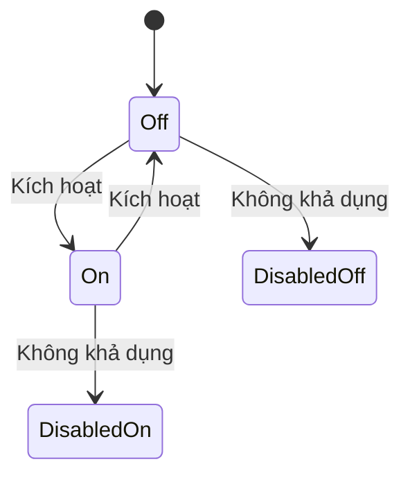
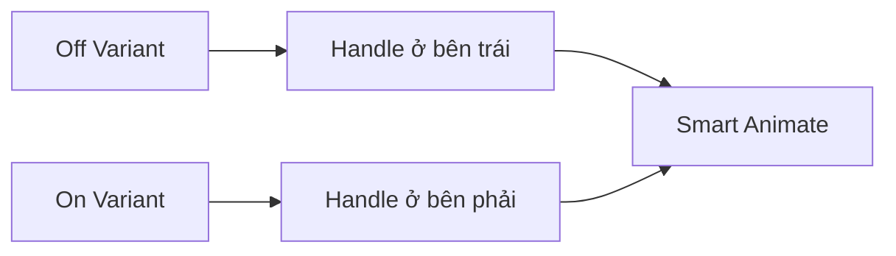

# 033 — Xây dựng Switch

## Mô-đun

**Form Components**

## Mốc thời gian video

**2:05:53**

## Tổng quan bài học

Switch biểu diễn trạng thái bật hoặc tắt của một cài đặt. Thay đổi thường được áp dụng ngay lập tức.

Component gồm:

- Track
- Handle
- Label
- Supporting Text

## Mục tiêu học tập

- Tạo Track và Handle.
- Đặt Handle ở vị trí On hoặc Off.
- Tạo Interaction State.
- Bind token.
- Phân biệt Switch và Checkbox.
- Mô phỏng chuyển động bằng Smart Animate.

## Cấu trúc

```text
Off:  (●────)  Thông báo
On:   (────●)  Thông báo
```

## Layer Structure

```text
Form/Switch
├── Track
│   └── Handle
└── Content
    ├── Label
    └── Supporting Text
```

## State Model

```text
Value = Off
Value = On
```

```text
State = Default
State = Hover
State = Focus
State = Disabled
```



## Track

Track thường có:

- Fixed Width
- Fixed Height
- Full Radius
- Surface Token
- Internal Padding

## Handle

Handle thường có:

- Hình tròn.
- Surface Token.
- Có thể có Shadow hoặc Border.
- Nằm bên trái khi Off.
- Nằm bên phải khi On.

## Cách định vị Handle

### Auto Layout

Dùng Spacer hoặc Alignment để đẩy Handle sang trái hoặc phải.

### Absolute Position

Đặt tọa độ cụ thể cho Handle trong từng variant.

### Constraints

Dùng Left Constraint cho Off và Right Constraint cho On.



## Token Mapping

| Thuộc tính | Off | On |
|---|---|---|
| Track Surface | Neutral Token | Selected Token |
| Handle | Control Surface | On-action Surface |
| Hover | Hover Token | Selected Hover Token |
| Focus Ring | Focus Token | Focus Token |
| Disabled | Disabled Token | Disabled Selected Token |

Không nên chỉ dùng màu để phân biệt On và Off. Vị trí Handle cũng phải thay đổi.

## Các bước xây dựng

### 1. Tạo Track

Dùng Frame bo tròn và bind token.

### 2. Tạo Handle

Tạo hình tròn bên trong Track.

### 3. Tạo On và Off Variant

Thay đổi:

- Vị trí Handle
- Track Surface
- Có thể thay Border

### 4. Tạo Interaction State

```text
Default
Hover
Focus
Disabled
```

### 5. Thêm Focus Ring

Focus Ring phải xuất hiện ở cả On và Off.

### 6. Ghép với Label

Hai pattern phổ biến:

```text
[Switch] Label
```

hoặc:

```text
Label và mô tả                    [Switch]
```

## Component Properties

| Property | Loại |
|---|---|
| `Value` | Variant |
| `State` | Variant |
| `Label` | Text |
| `Show label` | Boolean |
| `Show supporting text` | Boolean |
| `Supporting text` | Text |
| `Label position` | Variant nếu cần |

## Switch và Checkbox

| Switch | Checkbox |
|---|---|
| Đại diện trạng thái cài đặt | Đại diện lựa chọn |
| Áp dụng ngay | Có thể submit sau |
| On / Off | Checked / Unchecked |
| Thường dùng trong Settings | Thường dùng trong Form |

Ví dụ Switch:

```text
Chế độ tối                  [On]
```

Ví dụ Checkbox:

```text
[ ] Bao gồm dự án đã lưu trữ
```

## Accessibility

- Dùng semantic switch phù hợp.
- State phải được đọc là On hoặc Off.
- Label phải mô tả tên cài đặt.
- Hỗ trợ bàn phím.
- Focus phải rõ.
- Không chỉ dùng màu.
- Disabled On và Disabled Off đều phải tồn tại.

Label tốt:

```text
Thông báo qua email
```

Không rõ ràng:

```text
Bật thông báo qua email
```

## Motion

Smart Animate chỉ mô phỏng.

Production cần xác định:

- Duration
- Easing
- Reduced Motion
- Track Color Transition
- Handle Movement
- Focus Ring Stability

## Lỗi thường gặp

- Dùng Switch cho lựa chọn submit sau.
- Chỉ dùng màu để biểu diễn state.
- On và Off khác kích thước.
- Không có Disabled On.
- Label mô tả hành động thay vì tên trạng thái.
- Focus Ring biến mất.

## Câu hỏi ôn tập

### 1. Mục đích của Switch là gì?

Tạo control bật hoặc tắt cho một cài đặt có hiệu lực ngay.

### 2. Áp dụng thực tế như thế nào?

Tạo Track và Handle bằng token, thêm On/Off Variant và Interaction State.

### 3. Ý tưởng chính là gì?

Track, Handle, Positioning, State Variant và Smart Animate.

### 4. Rủi ro cần lưu ý?

Figma không mô phỏng đầy đủ semantic hoặc behavior, và Switch thường bị dùng sai thay cho Checkbox.

## Checklist

- [ ] Có On và Off.
- [ ] Có Default, Hover, Focus, Disabled.
- [ ] Có Disabled On và Disabled Off.
- [ ] Track và Handle dùng token.
- [ ] Vị trí Handle thể hiện rõ state.
- [ ] Kích thước không thay đổi.
- [ ] Focus Ring rõ.
- [ ] Label chỉnh sửa được.
- [ ] Có hướng dẫn phân biệt Checkbox.
- [ ] Có tài liệu Motion và Accessibility.

## Tóm tắt

Switch là control trạng thái nhị phân. Component tốt cần dùng cả màu sắc và vị trí Handle để biểu diễn On/Off, đồng thời có đầy đủ Focus, Disabled và hướng dẫn sử dụng đúng ngữ cảnh.