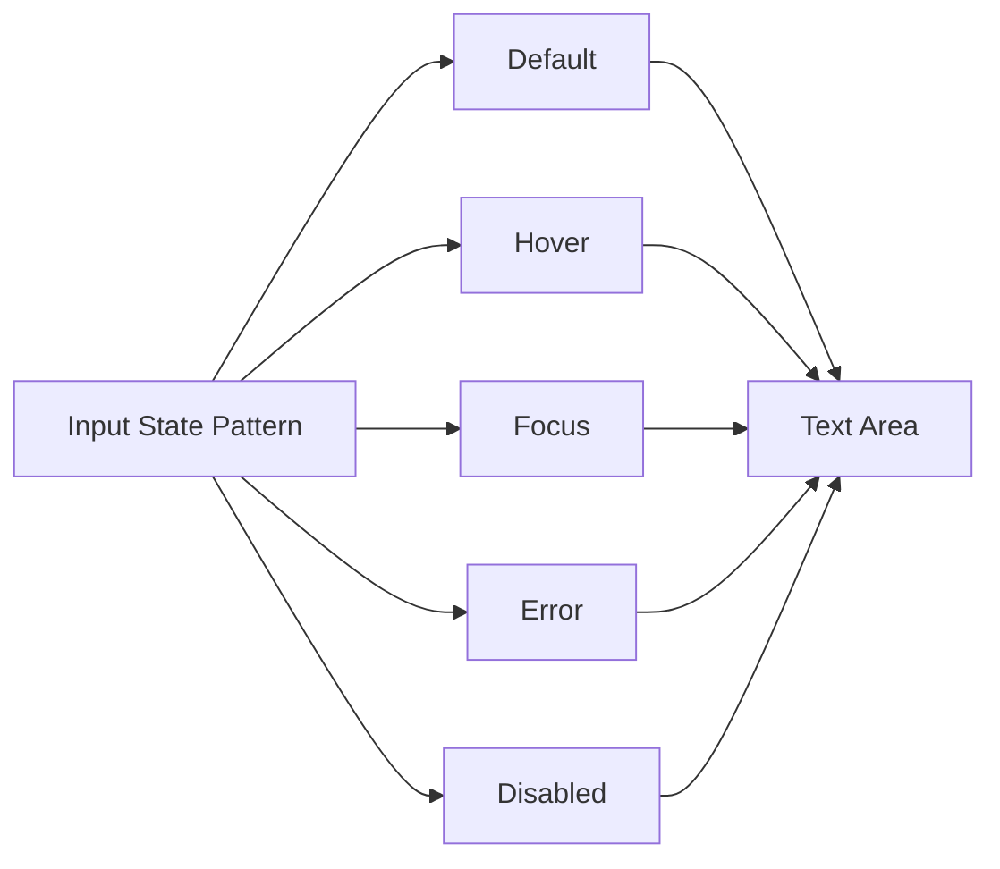
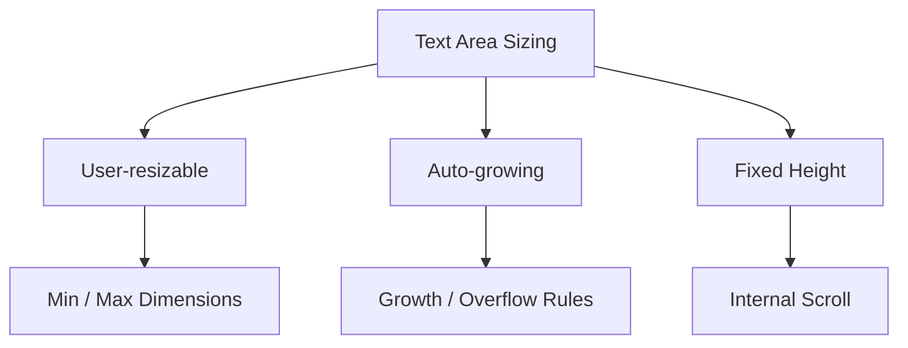

# 034 — Xây dựng Text Area

## Mô-đun

**Form Components**

## Mốc thời gian video

**2:14:43**

## Tổng quan bài học

Text Area là phiên bản nhập liệu nhiều dòng của Input.

Component tái sử dụng:

- Border Token
- Surface Token
- Text Token
- Focus State
- Error State
- Disabled State

và bổ sung:

- Chiều cao lớn hơn.
- Resize Handle.
- Character Count.
- Multi-line Content.

## Mục tiêu học tập

- Chuyển Input Pattern thành Multi-line Control.
- Thiết lập minimum height.
- Tái sử dụng Input State.
- Thêm Resize Handle.
- Hỗ trợ Character Count.
- Tài liệu hóa hành vi resize thực tế.

## Cấu trúc

```text
┌──────────────────────────────────────┐
│ Nhập nội dung dài hơn...             │
│                                      │
│                                      │
│                                  ◢   │
└──────────────────────────────────────┘
```

## Layer Structure

```text
Form/Text Area
├── Focus Ring
└── Container
    ├── Value
    └── Footer
        ├── Character Count
        └── Resize Handle
```

## Tái sử dụng Input Pattern

| Thuộc tính | Input | Text Area |
|---|---|---|
| Border Token | Dùng chung | Dùng chung |
| Surface Token | Dùng chung | Dùng chung |
| Radius Token | Dùng chung | Dùng chung |
| Focus Ring | Dùng chung | Dùng chung |
| Error State | Dùng chung | Dùng chung |
| Disabled State | Dùng chung | Dùng chung |
| Layout | Horizontal | Vertical |
| Height | Một dòng | Nhiều dòng |
| Resize | Không có | Có thể có |



## Auto Layout

| Thuộc tính | Giá trị |
|---|---|
| Width | Fill Container |
| Height | Fixed Minimum hoặc Variant |
| Hướng | Vertical |
| Alignment | Stretch |
| Value | Fill Width |
| Text Alignment | Top Left |
| Padding | Spacing Token |
| Resize Handle | Bottom Right |

## Các bước xây dựng

### 1. Bắt đầu từ Input

Tái sử dụng Border, Surface, Radius, Text và Focus Ring Token.

### 2. Tăng chiều cao Container

Tạo minimum height.

Có thể có:

```text
Size = Small
Size = Medium
Size = Large
```

Chỉ tạo size variant nếu design system thực sự cần.

### 3. Cấu hình Multi-line Text

Text phải bắt đầu từ góc trên bên trái.

### 4. Thêm Resize Handle

Resize Handle có thể:

- Luôn hiển thị.
- Bật hoặc tắt bằng Boolean.
- Ẩn nếu Text Area Auto-grow.
- Không dùng nếu fixed height.

### 5. Tạo State Variants

```text
Default
Hover
Focus
Error
Disabled
```

### 6. Thêm Metadata

Có thể hiển thị:

```text
245 / 500
```

Character Count không nên thay thế Helper hoặc Error Text.

## Component Properties

| Property | Loại |
|---|---|
| `State` | Variant |
| `Value` | Text |
| `Size` | Variant |
| `Show resize handle` | Boolean |
| `Show character count` | Boolean |
| `Character count` | Text |
| `Content` | Variant hoặc Boolean |

Không nên tạo variant theo từng số dòng.

## Resize Models

### User-resizable

Người dùng kéo Resize Handle.

Cần xác định:

- Min Width
- Max Width
- Min Height
- Max Height

### Auto-growing

Text Area tự tăng chiều cao.

Cần xác định:

- Initial Height
- Max Height
- Overflow Behavior

### Fixed Height

Text Area giữ nguyên chiều cao và scroll bên trong.



## Token Mapping

| Thuộc tính | Token |
|---|---|
| Surface | Form Control Surface |
| Border | Input Border |
| Hover | Hover Border |
| Focus Ring | Focus Token |
| Error | Error Token |
| Disabled | Disabled Token |
| Placeholder | Placeholder Text |
| Value | Primary Text |
| Character Count | Secondary Text |
| Resize Handle | Secondary Icon |
| Padding | Spacing Token |
| Radius | Radius Token |

## Character Count

Có thể dùng:

```text
120 / 500
```

hoặc:

```text
Còn lại 380 ký tự
```

Cần xác định:

- Space có được tính không?
- Maximum có bắt buộc không?
- Khi vượt giới hạn sẽ xảy ra gì?
- Có Error State không?
- Screen Reader được thông báo thế nào?

## Accessibility

- Luôn có Label rõ ràng.
- Helper và Error Text phải liên kết với control.
- Focus Ring phải nhìn thấy.
- Placeholder không chứa hướng dẫn quan trọng.
- Character Count phải đọc được bằng assistive technology.
- Disabled và Read-only phải khác nhau.
- Resize không làm nội dung bị mất.

## Áp dụng thực tế

Text Area thường dùng cho:

- Comment
- Feedback
- Description
- Message
- Support Request
- Biography
- Notes

Text Area thường nằm trong Field:

```text
Field
├── Label
├── Text Area
└── Helper / Error Text
```

## Lỗi thường gặp

- Căn text theo chiều dọc ở giữa.
- Dùng Figma Variant thay cho behavior resize thực.
- Tạo variant theo từng line count.
- State không đồng nhất với Input.
- Đặt Error Message bên trong vùng nhập.
- Không định nghĩa overflow.

## Câu hỏi ôn tập

### 1. Mục đích của Text Area là gì?

Tạo control nhập nhiều dòng, mở rộng từ Input Pattern.

### 2. Áp dụng thực tế như thế nào?

Tái sử dụng Input Token và State, chuyển layout sang nhiều dòng và định nghĩa Resize Model.

### 3. Các bước chính là gì?

Tái sử dụng Input Style, tăng height, cấu hình text top-left, thêm Resize Handle và State Variants.

### 4. Rủi ro cần lưu ý?

Figma không mô phỏng được việc nhập, scroll, auto-grow hoặc resize thật.

## Checklist

- [ ] Text Area dùng lại Input Token.
- [ ] Text bắt đầu từ top-left.
- [ ] Có minimum height.
- [ ] Width Fill Container.
- [ ] Có Default, Hover, Focus, Error, Disabled.
- [ ] Resize Model được mô tả.
- [ ] Resize Handle có thể bật hoặc tắt.
- [ ] Character Count có quy tắc rõ ràng.
- [ ] Hoạt động tốt trong Field.
- [ ] Có hướng dẫn Accessibility và Overflow.

## Tóm tắt

Text Area nên được xem là phần mở rộng của Input, không phải component hoàn toàn riêng biệt. Việc tái sử dụng token và state giúp giữ giao diện thống nhất, trong khi Resize Model và Character Count cần được tài liệu hóa rõ ràng cho developer.