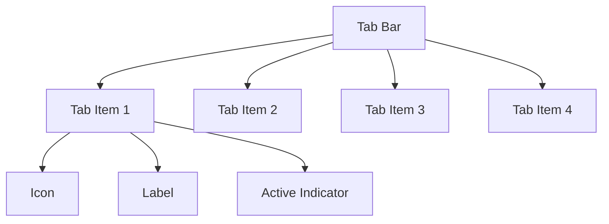
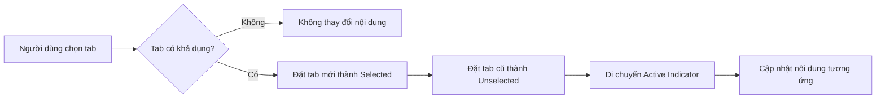
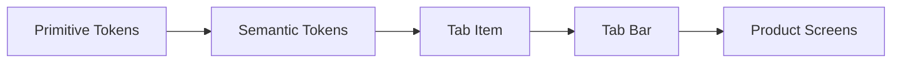
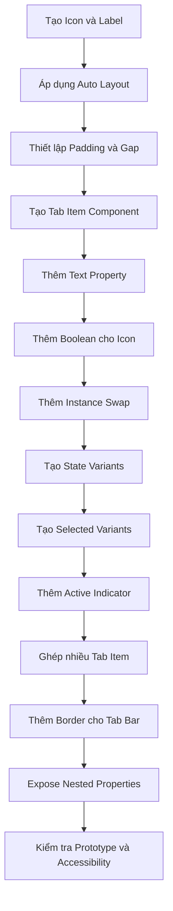

# 036 – Xây dựng Tab Bar

## Thông tin bài học

| Thuộc tính          | Nội dung                                                         |
| ------------------- | ---------------------------------------------------------------- |
| **Module**          | Navigation & Layout Components                                   |
| **Tên bài học**     | Build a Tab Bar                                                  |
| **Thời điểm video** | 2:20:02                                                          |
| **Công cụ**         | Figma                                                            |
| **Chủ đề chính**    | Xây dựng Tab Bar có trạng thái, biến thể và thuộc tính tùy chỉnh |

---

## 1. Tổng quan

Trong bài học này, chúng ta sẽ xây dựng một **Tab Bar component** dùng để chuyển đổi giữa các khu vực nội dung hoặc các chế độ xem khác nhau.

Mỗi tab có thể bao gồm:

* Biểu tượng.
* Nhãn văn bản.
* Trạng thái tương tác.
* Trạng thái được chọn hoặc chưa được chọn.
* Đường chỉ báo tab đang hoạt động.

Sau khi hoàn thành, Tab Bar có thể được tái sử dụng trong nhiều màn hình khác nhau mà không cần thiết kế lại từng tab riêng lẻ.

---

## 2. Mục tiêu bài học

Sau bài học, bạn có thể:

* Xây dựng một `Tab Item` bằng Auto Layout.
* Tạo thuộc tính văn bản cho nhãn tab.
* Tạo thuộc tính bật hoặc tắt biểu tượng.
* Cho phép thay thế biểu tượng bằng Instance Swap.
* Xây dựng các trạng thái tương tác như Default, Hover, Focus và Disabled.
* Tạo biến thể Selected và Unselected.
* Sử dụng đường viền dưới làm chỉ báo tab đang hoạt động.
* Ghép nhiều Tab Item thành một Tab Bar hoàn chỉnh.
* Hiển thị các thuộc tính của instance lồng nhau trên Tab Bar.

---

## 3. Tab Bar là gì?

**Tab Bar** là thành phần điều hướng cho phép người dùng chuyển đổi giữa nhiều khu vực nội dung có liên quan trong cùng một màn hình.

Ví dụ:

```text
┌─────────────┬─────────────┬─────────────┐
│  Overview   │  Activity   │  Settings   │
└─────────────┴─────────────┴─────────────┘
      ▲
 Tab đang được chọn
```

Tab Bar thường được sử dụng trong:

* Trang hồ sơ người dùng.
* Trang cài đặt.
* Dashboard quản trị.
* Trang chi tiết sản phẩm.
* Giao diện phân tích dữ liệu.
* Ứng dụng di động.
* Thanh điều hướng theo danh mục.

---

## 4. Cấu trúc component

Tab Bar nên được chia thành hai cấp component:



### 4.1. Tab Item

`Tab Item` là component cơ sở đại diện cho một tab.

Một Tab Item thường gồm:

```text
Tab Item
├── Icon
├── Label
└── Active Indicator
```

### 4.2. Tab Bar

`Tab Bar` là component cha chứa nhiều instance của `Tab Item`.

```text
Tab Bar
├── Tab Item
├── Tab Item
├── Tab Item
└── Tab Item
```

---

# 5. Xây dựng Tab Item

## Bước 1: Tạo nội dung tab

Tạo một Frame gồm:

* Một biểu tượng ở bên trái.
* Một nhãn văn bản ở bên phải.

Ví dụ:

```text
♥  Favorites
```

Bạn có thể sử dụng bất kỳ biểu tượng nào phù hợp với nội dung, chẳng hạn:

* Home.
* Favorites.
* Settings.
* Notifications.
* Profile.
* Analytics.

---

## Bước 2: Điều chỉnh kích thước biểu tượng

Có thể đặt kích thước biểu tượng thành:

```text
20 × 20 px
```

Kích thước này giúp biểu tượng nhỏ gọn và không lấn át nhãn văn bản.

Đây không phải kích thước bắt buộc. Design System có thể sử dụng các kích thước khác như:

* 16 × 16 px.
* 20 × 20 px.
* 24 × 24 px.

Nên sử dụng token kích thước nếu hệ thống đã có sẵn:

```text
icon/sm = 16
icon/md = 20
icon/lg = 24
```

---

## Bước 3: Áp dụng Auto Layout

Chọn Frame chứa biểu tượng và nhãn, sau đó bật Auto Layout.

Thiết lập đề xuất:

| Thuộc tính         | Giá trị gợi ý |
| ------------------ | ------------: |
| Direction          |    Horizontal |
| Alignment          |        Center |
| Gap                |          8 px |
| Width              |  Hug contents |
| Height             |  Hug contents |
| Horizontal padding |         12 px |
| Vertical padding   |       8–12 px |

Cấu trúc:

```text
┌──────────────────────────┐
│   [Icon]  [Tab label]    │
└──────────────────────────┘
   12px             12px
```

Nếu padding quá lớn, Tab Item có thể trông giống Button hơn là Tab. Vì vậy, cần điều chỉnh theo phong cách của sản phẩm.

---

## Bước 4: Quyết định nền của Tab Item

Tab Item có thể:

### Không có nền

Phù hợp với Tab Bar có thiết kế tối giản:

```text
Overview    Activity    Settings
────────
```

### Có nền khi tương tác

Nền chỉ xuất hiện ở trạng thái Hover hoặc Selected:

```text
┌────────────┐
│  Overview  │
└────────────┘
```

Không nhất thiết phải đặt màu nền mặc định cho Tab Item. Điều này phụ thuộc vào phong cách thiết kế của hệ thống.

---

## Bước 5: Đặt tên layer

Đặt tên rõ ràng để dễ quản lý:

```text
Tab Item
├── Icon
└── Label
```

Tên component đề xuất:

```text
Navigation/Tab Item
```

Hoặc:

```text
Tab/Item
```

Cách đặt tên nên thống nhất với cấu trúc component library hiện tại.

---

# 6. Tạo component properties

Sau khi hoàn thành cấu trúc cơ bản, chuyển Frame thành component.

## 6.1. Thuộc tính Label

Tạo Text Property cho layer văn bản.

Tên thuộc tính:

```text
Label
```

Ví dụ giá trị:

```text
Overview
Favorites
Settings
Activity
```

Nhờ đó, người sử dụng component có thể thay đổi nội dung tab trực tiếp từ bảng Properties.

---

## 6.2. Thuộc tính bật hoặc tắt biểu tượng

Tạo Boolean Property cho layer biểu tượng.

Tên thuộc tính đề xuất:

```text
Show icon
```

Các giá trị:

```text
True  → Hiển thị biểu tượng
False → Ẩn biểu tượng
```

Nhờ đó, cùng một Tab Item có thể hỗ trợ:

```text
♥ Favorites
```

hoặc:

```text
Favorites
```

---

## 6.3. Thuộc tính thay thế biểu tượng

Tạo Instance Swap Property cho biểu tượng.

Tên thuộc tính:

```text
Icon
```

Người dùng có thể thay thế biểu tượng mà không cần tháo instance:

```text
Heart → Home → Settings → User
```

Nên cấu hình danh sách preferred values để chỉ hiển thị các icon phù hợp trong thư viện.

---

## 6.4. Thuộc tính Tab Item hoàn chỉnh

```text
Tab Item Properties
├── Label: Text
├── Show icon: Boolean
└── Icon: Instance swap
```

---

# 7. Tạo các trạng thái tương tác

Tạo Variant Property:

```text
State
```

Các trạng thái cơ bản:

```text
Default
Hover
Focus
Disabled
```

Sơ đồ trạng thái:

```mermaid
stateDiagram-v2
    [*] --> Default
    Default --> Hover: Di chuột
    Hover --> Default: Rời con trỏ
    Default --> Focus: Điều hướng bằng bàn phím
    Focus --> Default: Mất focus
    Default --> Disabled: Không khả dụng
```

---

## 7.1. Default

Đây là trạng thái bình thường của Tab Item.

Token gợi ý:

```text
Text: text/action/default
Icon: icon/action/default
Surface: transparent
```

---

## 7.2. Hover

Hover xuất hiện khi con trỏ nằm trên tab.

Có thể thay đổi:

* Màu văn bản.
* Màu biểu tượng.
* Màu nền.
* Màu đường chỉ báo.

Ví dụ token:

```text
Text: text/action/hover
Icon: icon/action/hover
Surface: surface/action/hover-subtle
Border: border/action/hover
```

Nền Hover không bắt buộc. Một số Design System chỉ thay đổi màu chữ hoặc biểu tượng.

---

## 7.3. Focus

Focus giúp người dùng bàn phím nhận biết tab nào đang được điều hướng.

Ví dụ:

```text
╔════════════════╗
║  ♥ Favorites   ║
╚════════════════╝
```

Bạn có thể tái sử dụng Focus Ring từ Button component thay vì xây dựng lại.

Quy trình:

1. Mở Button component.
2. Sao chép layer Focus Ring.
3. Dán vào Tab Item.
4. Căn chỉnh Focus Ring bao quanh Tab Item.
5. Kiểm tra padding và corner radius.
6. Gắn với token focus chung.

Token đề xuất:

```text
border/focus
```

Hoặc:

```text
focus/ring
```

Việc tái sử dụng giúp các component có trải nghiệm focus nhất quán.

---

## 7.4. Disabled

Disabled được sử dụng khi tab không thể tương tác.

Thay đổi các token:

```text
Text: text/disabled
Icon: icon/disabled
Surface: surface/disabled
Border: border/disabled
```

Ví dụ:

```text
[ ⚙ Settings ]
      ↓
Màu nhạt, không thể nhấn
```

Cần lưu ý rằng nền Disabled có thể khiến Tab Bar trông nặng nề. Trong nhiều trường hợp, chỉ cần giảm độ tương phản của chữ và icon.

---

# 8. Tạo trạng thái Selected và Unselected

Ngoài trạng thái tương tác, Tab Item cần một thuộc tính biểu thị việc tab có đang được chọn hay không.

Tạo Variant Property:

```text
Selection
```

Các giá trị:

```text
Unselected
Selected
```

Ma trận biến thể:

| State    | Unselected | Selected |
| -------- | ---------- | -------- |
| Default  | Có         | Có       |
| Hover    | Có         | Có       |
| Focus    | Có         | Có       |
| Disabled | Có         | Có       |

Tổng số biến thể:

```text
4 State × 2 Selection = 8 variants
```

---

## 8.1. Unselected

Tab chưa được chọn thường không có chỉ báo dưới.

```text
Overview
```

Màu chữ có thể sử dụng:

```text
text/action/default
```

Hoặc màu có độ tương phản thấp hơn:

```text
text/secondary
```

---

## 8.2. Selected

Tab được chọn có thể sử dụng:

* Đường gạch dưới.
* Màu chữ nổi bật.
* Font weight cao hơn.
* Biểu tượng dạng filled.
* Nền nhẹ.

Ví dụ:

```text
Overview
────────
```

Trong bài học này, tab được chọn sử dụng **đường viền dưới 2 px**.

---

# 9. Tạo Active Indicator

## 9.1. Thêm đường viền dưới

Với các biến thể `Selected`, thêm đường viền ở cạnh dưới của Tab Item.

Thiết lập:

| Thuộc tính |                                 Giá trị |
| ---------- | --------------------------------------: |
| Position   |                                  Bottom |
| Thickness  |                                    2 px |
| Width      | Fill container hoặc bằng chiều rộng tab |
| Color      |                     Action border token |

Token gợi ý:

```text
border/action/default
```

Ở trạng thái Hover:

```text
border/action/hover
```

Ở trạng thái Disabled:

```text
border/disabled
```

---

## 9.2. Logic hiển thị

```text
Unselected
┌──────────────┐
│   Overview   │
└──────────────┘

Selected
┌──────────────┐
│   Overview   │
└──────────────┘
──────────────
```

Đường chỉ báo giúp người dùng nhận biết nội dung nào đang được hiển thị.

---

## 9.3. Tăng độ nổi bật của tab được chọn

Ngoài đường chỉ báo, có thể thay đổi font weight của tab được chọn:

```text
Unselected → Regular hoặc Medium
Selected   → Semibold
```

Ví dụ:

```text
Overview    Activity    Settings
────────
Semibold    Regular     Regular
```

Không nên dùng quá nhiều dấu hiệu cùng lúc. Thông thường, hai tín hiệu là đủ:

* Màu hành động.
* Đường chỉ báo hoặc font weight.

---

# 10. Sử dụng icon Filled cho tab được chọn

Một số hệ thống sử dụng:

```text
Unselected → Outline icon
Selected   → Filled icon
```

Ví dụ:

```text
♡ Favorites   → Chưa chọn
♥ Favorites   → Đã chọn
```

Cách này tạo sự khác biệt mạnh hơn giữa hai trạng thái.

Tuy nhiên, nó yêu cầu thư viện icon phải có đầy đủ hai phiên bản:

```text
icon/outline/favorite
icon/filled/favorite
```

Nếu thư viện icon không có cấu trúc thống nhất, việc quản lý sẽ trở nên phức tạp.

---

# 11. Xây dựng Tab Bar

Sau khi hoàn thành Tab Item, tạo một Frame mới và thêm nhiều instance của Tab Item.

Ví dụ:

```text
Tab Bar
├── Overview
├── Activity
├── Favorites
└── Settings
```

Sử dụng Auto Layout ngang:

| Thuộc tính | Thiết lập                        |
| ---------- | -------------------------------- |
| Direction  | Horizontal                       |
| Gap        | 0 px hoặc theo token             |
| Width      | Fill container hoặc Hug contents |
| Alignment  | Bottom hoặc Center               |
| Height     | Hug contents                     |

---

## 11.1. Tab có chiều rộng bằng nhau

Mỗi Tab Item sử dụng:

```text
Width: Fill container
```

Kết quả:

```text
┌────────────┬────────────┬────────────┐
│  Overview  │  Activity  │  Settings  │
└────────────┴────────────┴────────────┘
```

Phù hợp với:

* Giao diện mobile.
* Thanh tab toàn chiều rộng.
* Số lượng tab nhỏ và cố định.

---

## 11.2. Tab ôm nội dung

Mỗi Tab Item sử dụng:

```text
Width: Hug contents
```

Kết quả:

```text
Overview    Activity    Settings
```

Phù hợp với:

* Dashboard desktop.
* Tab có nhãn dài ngắn khác nhau.
* Thanh tab có thể cuộn ngang.
* Thanh điều hướng phụ.

---

# 12. Thêm đường viền cho toàn bộ Tab Bar

Ngoài đường chỉ báo của từng tab, Tab Bar có thể có một đường viền dưới chạy xuyên suốt.

```text
 Overview     Activity     Settings
──────────
───────────────────────────────────
```

Trong đó:

* Đường đậm là Active Indicator của tab được chọn.
* Đường mảnh là Border của toàn bộ Tab Bar.

Token đề xuất:

```text
Tab indicator: border/action/default
Tab bar border: border/default
```

Cần phân biệt rõ:

```text
Tab Item Selected → Active Indicator
Tab Bar           → Base Border
```

Không nên đặt cùng một đường viền vào từng Tab Item chưa được chọn, vì có thể tạo ra các đường bị ngắt hoặc chồng lên nhau.

---

# 13. Điều chỉnh số lượng tab

Tab Bar có thể chứa số lượng tab khác nhau:

```text
2 tabs
3 tabs
4 tabs
5 tabs
```

Bạn có thể tạo sẵn số lượng instance tối đa, sau đó sử dụng Boolean Property để ẩn hoặc hiện từng tab.

Ví dụ:

```text
Show tab 1: True
Show tab 2: True
Show tab 3: True
Show tab 4: False
Show tab 5: False
```

Tuy nhiên, cách này phù hợp nhất khi số lượng tab có giới hạn rõ ràng.

Nếu số lượng tab biến đổi lớn, nên sử dụng Tab Item riêng lẻ và để designer tự ghép trong Auto Layout.

---

# 14. Expose nested instance properties

Khi Tab Bar chứa nhiều instance của Tab Item, cần đưa các thuộc tính lồng nhau lên component cha.

Ví dụ, Tab Bar nên cho phép chỉnh trực tiếp:

```text
Tab 1
├── Label
├── Icon
├── Show icon
├── State
└── Selection

Tab 2
├── Label
├── Icon
├── Show icon
├── State
└── Selection
```

Trong Figma, sử dụng chức năng expose nested instance properties để hiển thị các tùy chọn này.

Nhờ đó, designer không cần mở sâu vào từng layer để thay đổi:

* Tên tab.
* Biểu tượng.
* Tab đang được chọn.
* Trạng thái.
* Việc hiển thị biểu tượng.

---

# 15. Cấu trúc Variant đề xuất

## Tab Item

```text
Component: Navigation/Tab Item

Properties:
├── State
│   ├── Default
│   ├── Hover
│   ├── Focus
│   └── Disabled
│
├── Selection
│   ├── Unselected
│   └── Selected
│
├── Label
│
├── Show icon
│
└── Icon
```

Tên variant mẫu:

```text
State=Default, Selection=Unselected
State=Default, Selection=Selected
State=Hover, Selection=Unselected
State=Hover, Selection=Selected
State=Focus, Selection=Unselected
State=Focus, Selection=Selected
State=Disabled, Selection=Unselected
State=Disabled, Selection=Selected
```

---

# 16. Sơ đồ hoạt động của Tab Bar



Nguyên tắc quan trọng:

> Trong cùng một nhóm tab, thông thường chỉ có một tab được chọn tại một thời điểm.

---

# 17. Prototype tương tác trong Figma

Có thể tạo Interactive Component để mô phỏng trạng thái.

## Hover

```text
While hovering
→ Change to
→ State=Hover
```

## Focus

```text
On click hoặc điều hướng bàn phím
→ Change to
→ State=Focus
```

## Selected

Khi nhấn vào tab:

```text
On click
→ Navigate to màn hình tương ứng
```

Hoặc:

```text
On click
→ Change to Selected variant
```

Đối với một nhóm tab hoàn chỉnh, việc mô phỏng chuyển Selected giữa các instance có thể cần:

* Variables.
* Conditional interactions.
* Nhiều variant của Tab Bar.
* Hoặc các frame màn hình riêng biệt.

---

# 18. Áp dụng Design Tokens

Tab Bar không nên sử dụng các giá trị màu và khoảng cách tùy ý.

Ví dụ token:

```text
Color
├── text/action/default
├── text/action/hover
├── text/disabled
├── icon/action/default
├── icon/action/hover
├── icon/disabled
├── surface/action/hover
├── border/default
├── border/action/default
├── border/action/hover
├── border/disabled
└── border/focus

Spacing
├── spacing/2 = 8
├── spacing/3 = 12
└── spacing/4 = 16

Size
└── icon/md = 20

Border
├── border-width/default = 1
└── border-width/active = 2
```

Luồng token:



---

# 19. Ứng dụng trong Design System thực tế

## 19.1. Dashboard

```text
Overview | Analytics | Reports | Activity
```

## 19.2. Hồ sơ người dùng

```text
Profile | Posts | Followers | Settings
```

## 19.3. Trang sản phẩm

```text
Description | Specifications | Reviews
```

## 19.4. Cài đặt ứng dụng

```text
General | Security | Notifications | Billing
```

## 19.5. Trình quản lý nội dung

```text
Published | Drafts | Scheduled | Archived
```

---

# 20. Khả năng truy cập

## 20.1. Không chỉ dùng màu sắc

Không nên chỉ đổi màu để biểu thị tab được chọn.

Nên kết hợp:

* Màu sắc.
* Đường chỉ báo.
* Font weight.
* Filled icon.

---

## 20.2. Focus phải rõ ràng

Người dùng bàn phím cần nhìn thấy tab đang được focus.

Focus Ring phải:

* Có độ tương phản đủ cao.
* Không bị cắt bởi Frame.
* Không trùng với Active Indicator.
* Xuất hiện nhất quán với Button, Link và Menu Item.

---

## 20.3. Kích thước vùng nhấn

Mặc dù nội dung có thể nhỏ, vùng tương tác nên đủ lớn.

Gợi ý:

```text
Chiều cao vùng tương tác: khoảng 40–48 px
```

Đặc biệt quan trọng trên thiết bị cảm ứng.

---

## 20.4. Nhãn tab phải rõ ràng

Tránh các nhãn quá chung chung như:

```text
Other
More
Data
Info
```

Nên sử dụng nhãn mô tả đúng nội dung:

```text
Account
Billing
Notifications
Security
```

---

# 21. Rủi ro và hạn chế

## 21.1. Quá nhiều biến thể

Khi thêm quá nhiều thuộc tính, số lượng variant có thể tăng nhanh.

Ví dụ:

```text
4 States
× 2 Selection states
× 3 Sizes
× 2 Icon positions
= 48 variants
```

Chỉ nên thêm các chiều biến thể thực sự cần thiết.

---

## 21.2. Tab trông giống Button

Nếu sử dụng:

* Nền đậm.
* Padding lớn.
* Corner radius lớn.
* Shadow.

Tab Item có thể bị nhầm với Button.

Cần giữ sự khác biệt rõ ràng giữa:

```text
Tab    → Chuyển nội dung trong cùng ngữ cảnh
Button → Thực hiện một hành động
```

---

## 21.3. Trạng thái Selected và Focus bị nhầm lẫn

Selected cho biết:

```text
Nội dung nào đang được hiển thị?
```

Focus cho biết:

```text
Phần tử nào đang được điều hướng bằng bàn phím?
```

Một tab có thể đồng thời:

```text
Selected + Focused
```

Vì vậy, hai trạng thái phải có cách hiển thị khác nhau.

---

## 21.4. Quá nhiều tab

Quá nhiều tab khiến giao diện khó đọc và không phù hợp với màn hình nhỏ.

Khi số lượng tab lớn, có thể:

* Cho phép cuộn ngang.
* Chuyển một số mục vào menu More.
* Sử dụng Sidebar.
* Chia lại kiến trúc thông tin.
* Sử dụng Dropdown để chuyển chế độ xem.

---

## 21.5. Nhãn có độ dài khác nhau

Với tab `Hug contents`, nhãn dài có thể làm Tab Bar vượt quá chiều rộng.

Với tab `Equal width`, nhãn dài có thể bị xuống dòng hoặc cắt.

Cần xác định quy tắc:

```text
Single line
No wrap
Truncate khi cần
```

---

# 22. Quy trình xây dựng hoàn chỉnh



---

# 23. Checklist kiểm tra component

## Tab Item

* [ ] Icon và Label nằm trong Auto Layout.
* [ ] Khoảng cách giữa Icon và Label sử dụng token.
* [ ] Label có Text Property.
* [ ] Icon có Boolean Property.
* [ ] Icon có Instance Swap Property.
* [ ] Có trạng thái Default.
* [ ] Có trạng thái Hover.
* [ ] Có trạng thái Focus.
* [ ] Có trạng thái Disabled.
* [ ] Có Selected và Unselected.
* [ ] Active Indicator sử dụng semantic token.
* [ ] Selected và Focus có thể hiển thị cùng lúc.

## Tab Bar

* [ ] Các Tab Item sử dụng instance, không detach.
* [ ] Tab Bar sử dụng Auto Layout ngang.
* [ ] Có lựa chọn Equal Width hoặc Hug Contents.
* [ ] Border của Tab Bar không chồng lên Active Indicator.
* [ ] Các nested properties được expose.
* [ ] Chỉ một tab được chọn trong trạng thái mặc định.
* [ ] Nhãn dài đã được kiểm tra.
* [ ] Trạng thái Disabled đã được kiểm tra.
* [ ] Focus Ring không bị cắt.
* [ ] Component hoạt động trong Light Mode và Dark Mode.

---

# 24. Câu hỏi ôn tập

## Câu 1: Mục đích chính của việc xây dựng Tab Bar là gì?

Mục đích chính là tạo một thành phần điều hướng tái sử dụng, giúp người dùng chuyển đổi giữa các chế độ xem hoặc khu vực nội dung có liên quan.

Tab Bar cần biểu thị rõ:

* Tab nào đang được chọn.
* Tab nào chưa được chọn.
* Tab nào đang Hover hoặc Focus.
* Tab nào không thể tương tác.

---

## Câu 2: Áp dụng Tab Bar vào Design System thực tế như thế nào?

Quy trình áp dụng gồm:

1. Xây dựng một Tab Item cơ sở.
2. Kết nối màu sắc, khoảng cách và đường viền với Design Tokens.
3. Tạo các trạng thái tương tác.
4. Tạo Selected và Unselected.
5. Ghép nhiều Tab Item thành Tab Bar.
6. Expose các thuộc tính lồng nhau.
7. Tài liệu hóa quy tắc sử dụng.
8. Kiểm tra accessibility và responsive behavior.

---

## Câu 3: Các bước quan trọng trong bài học là gì?

Các bước chính:

1. Tạo Icon và Label.
2. Áp dụng Auto Layout.
3. Tạo component.
4. Thêm Text Property cho Label.
5. Thêm Boolean Property cho Icon.
6. Thêm Instance Swap cho Icon.
7. Tạo Default, Hover, Focus và Disabled.
8. Tạo Selected và Unselected.
9. Thêm đường chỉ báo cho tab được chọn.
10. Ghép nhiều instance thành Tab Bar.
11. Thêm đường viền dưới cho toàn bộ thanh.
12. Expose các thuộc tính của instance lồng nhau.

---

## Câu 4: Rủi ro hoặc hạn chế cần lưu ý là gì?

Các rủi ro chính gồm:

* Số lượng variant tăng quá lớn.
* Tab trông giống Button.
* Selected và Focus không được phân biệt rõ.
* Quá nhiều tab trên một thanh.
* Nhãn dài làm vỡ layout.
* Active Indicator và border tổng thể bị chồng lên nhau.
* Chỉ sử dụng màu sắc để biểu thị trạng thái.
* Focus Ring bị cắt hoặc không đủ tương phản.

---

# 25. Kết luận

Tab Bar là một thành phần điều hướng quan trọng trong Design System. Một Tab Bar tốt không chỉ là tập hợp các nhãn nằm cạnh nhau mà còn cần có:

* Cấu trúc component rõ ràng.
* Auto Layout linh hoạt.
* Trạng thái tương tác đầy đủ.
* Selected Indicator dễ nhận biết.
* Thuộc tính có thể tùy chỉnh.
* Nested instances dễ điều khiển.
* Design Tokens nhất quán.
* Khả năng truy cập tốt.

Cấu trúc cuối cùng:

```text
Tab Bar
├── Tab Item
│   ├── Label
│   ├── Icon
│   ├── State
│   ├── Selection
│   └── Active Indicator
│
├── Tab Item
├── Tab Item
└── Base Border
```

Tab Bar hoàn chỉnh sẽ trở thành một phần của nhóm **Navigation & Layout Components**, cùng với:

```text
Navigation Components
├── Menu
├── Tab Bar
├── Button Group
├── Link
└── Breadcrumb
```

Việc xây dựng Tab Bar bằng component properties và semantic tokens giúp hệ thống dễ mở rộng, dễ bảo trì và duy trì trải nghiệm nhất quán trên toàn bộ sản phẩm.
