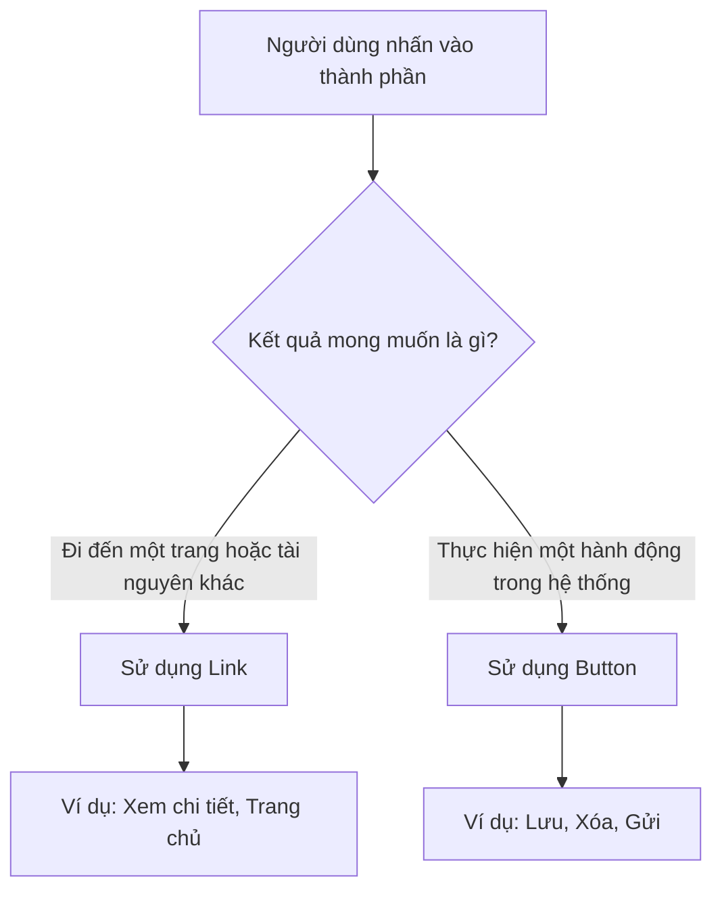
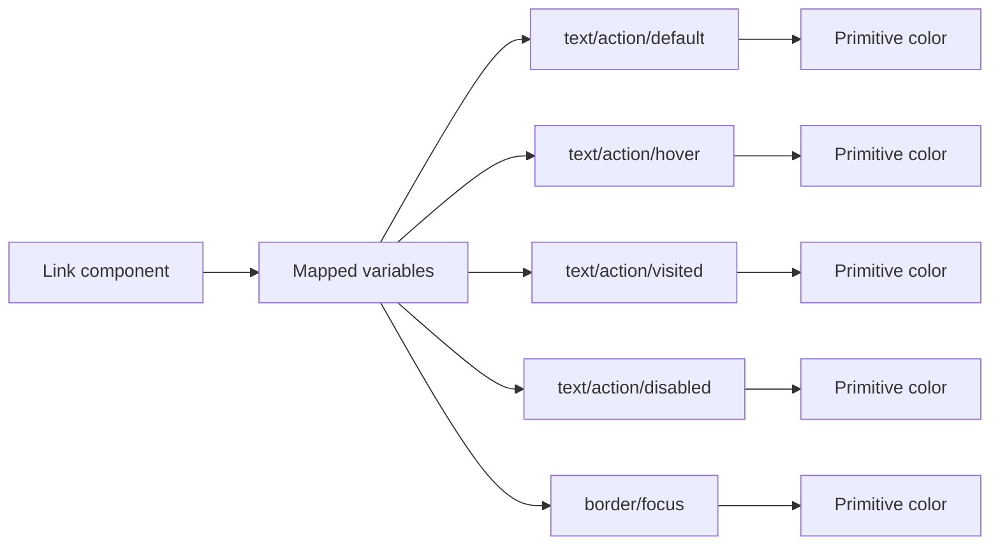
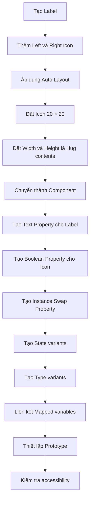

# 038 – Xây dựng Component Link trong Figma

## 1. Thông tin bài học

| Nội dung                     | Chi tiết                       |
| ---------------------------- | ------------------------------ |
| **Module**                   | Navigation & Layout Components |
| **Bài học**                  | Build a Link                   |
| **Thời điểm trong video**    | 2:32:09                        |
| **Công cụ**                  | Figma                          |
| **Thành phần được xây dựng** | Link component                 |

---

## 2. Mục tiêu bài học

Bài học hướng dẫn cách xây dựng một **Link component** dùng cho các hành động điều hướng dạng văn bản.

Component cần hỗ trợ:

* Nhãn văn bản có thể chỉnh sửa.
* Biểu tượng bên trái hoặc bên phải.
* Khả năng bật hoặc tắt từng biểu tượng.
* Hoán đổi biểu tượng bằng Instance Swap.
* Các trạng thái `Default`, `Hover`, `Focus`, `Visited` và `Disabled`.
* Các kiểu hiển thị khác nhau như `Default` và `Inline`.
* Màu sắc được liên kết với hệ thống Mapped variables.

---

## 3. Link là gì?

Link là một thành phần tương tác dạng văn bản, thường được dùng để:

* Chuyển sang một trang khác.
* Mở một tài nguyên.
* Điều hướng đến một khu vực khác trong trang.
* Mở nội dung trong cửa sổ hoặc tab mới.
* Hiển thị các liên kết nằm bên trong một đoạn văn.

Ví dụ:

```text
Trang chủ
Xem tài liệu
Đọc thêm
Mở trong cửa sổ mới
```

---

## 4. Phân biệt Link và Button

Link và Button đều có thể được nhấn, nhưng chúng phục vụ hai mục đích khác nhau.

| Tiêu chí       | Link                                 | Button                                     |
| -------------- | ------------------------------------ | ------------------------------------------ |
| Mục đích chính | Điều hướng người dùng                | Thực hiện một hành động                    |
| Ví dụ          | Xem chi tiết, Trang chủ, Đọc thêm    | Lưu, Xóa, Gửi, Xác nhận                    |
| Hình thức      | Thường là văn bản có gạch chân       | Thường có nền, viền hoặc hình khối         |
| Vị trí         | Trong nội dung, menu hoặc breadcrumb | Form, hộp thoại, thanh công cụ             |
| Hành vi        | Mở trang hoặc tài nguyên             | Thay đổi dữ liệu hoặc trạng thái giao diện |

### Quy tắc lựa chọn



Không nên sử dụng Link chỉ vì nó trông nhẹ hơn Button. Việc lựa chọn phải dựa trên **hành vi của thành phần**.

---

## 5. Cấu trúc của Link component

Một Link hoàn chỉnh có thể gồm ba phần:

```text
[Left icon]  [Label]  [Right icon]
```

Ví dụ:

```text
⌂  Trang chủ
Xem tài liệu  ↗
←  Quay lại
```

### Các thành phần

| Thành phần | Bắt buộc | Mô tả                       |
| ---------- | -------: | --------------------------- |
| Left icon  |    Không | Biểu tượng đứng trước nhãn  |
| Label      |       Có | Nội dung chính của liên kết |
| Right icon |    Không | Biểu tượng đứng sau nhãn    |

Nhãn là thành phần bắt buộc vì người dùng cần hiểu rõ liên kết sẽ dẫn đến đâu.

---

## 6. Tạo cấu trúc ban đầu

### Bước 1: Tạo nhãn

Tạo một Text layer, ví dụ:

```text
Link label
```

Áp dụng Text Style hoặc typography token phù hợp.

Ví dụ:

```text
Typography/Body/Medium
```

### Bước 2: Thêm biểu tượng

Thêm hai Icon instance:

* Một biểu tượng bên trái, chẳng hạn `home`.
* Một biểu tượng bên phải, chẳng hạn `open_in_new` hoặc `arrow_forward`.

Kích thước được sử dụng trong bài học:

```text
20 × 20 px
```

### Bước 3: Thêm Auto Layout

Chọn nhãn và các biểu tượng, sau đó áp dụng Auto Layout theo chiều ngang.

Cấu hình đề xuất:

| Thuộc tính | Giá trị         |
| ---------- | --------------- |
| Direction  | Horizontal      |
| Width      | Hug contents    |
| Height     | Hug contents    |
| Alignment  | Center          |
| Gap        | 8 px hoặc 12 px |
| Padding    | 0 px            |

Cấu trúc layer:

```text
Link
├── Left icon
├── Label
└── Right icon
```

Cả chiều rộng và chiều cao nên được đặt thành `Hug contents` để Link tự thay đổi theo nội dung.

---

## 7. Kiểm tra vị trí của biểu tượng

Trong quá trình xây dựng, Icon layer có thể vô tình được đặt thành `Absolute position`.

Khi đó, biểu tượng:

* Không còn tham gia vào Auto Layout.
* Có thể chồng lên nhãn.
* Không làm thay đổi kích thước component.
* Không tuân theo khoảng cách giữa các phần tử.

Hãy tắt `Absolute position` để các biểu tượng trở lại luồng Auto Layout bình thường.

```text
Không đúng:
Link
├── Left icon [Absolute]
└── Label

Đúng:
Link [Auto Layout]
├── Left icon
├── Label
└── Right icon
```

---

## 8. Chuyển thành Component

Chọn toàn bộ Link và sử dụng:

```text
Create component
```

Tên component có thể đặt là:

```text
Link
```

Hoặc theo cấu trúc thư viện:

```text
Navigation/Link
```

Tên các layer nên rõ ràng:

```text
Link
├── Left icon
├── Label
└── Right icon
```

Việc đặt tên layer chính xác giúp Figma tạo Component Properties dễ hiểu hơn.

---

## 9. Tạo Component Properties

## 9.1. Thuộc tính nội dung nhãn

Tạo một Text Property cho layer `Label`.

| Property | Kiểu | Giá trị mẫu |
| -------- | ---- | ----------- |
| Label    | Text | Link label  |

Khi sử dụng instance, người thiết kế có thể thay đổi nội dung mà không cần đi sâu vào cấu trúc layer.

---

## 9.2. Bật hoặc tắt biểu tượng bên trái

Tạo Boolean Property cho `Left icon`.

| Property       | Kiểu    | Giá trị    |
| -------------- | ------- | ---------- |
| Show left icon | Boolean | True/False |

Khi `False`, biểu tượng bên trái sẽ bị ẩn và Auto Layout tự động thu gọn khoảng trống.

---

## 9.3. Hoán đổi biểu tượng bên trái

Tạo Instance Swap Property cho `Left icon`.

| Property  | Kiểu          | Giá trị mẫu |
| --------- | ------------- | ----------- |
| Left icon | Instance swap | Home        |

Người dùng có thể thay `Home` bằng:

* Arrow back
* Download
* External link
* Information
* Chevron left

---

## 9.4. Bật hoặc tắt biểu tượng bên phải

Tạo Boolean Property cho `Right icon`.

| Property        | Kiểu    | Giá trị    |
| --------------- | ------- | ---------- |
| Show right icon | Boolean | True/False |

---

## 9.5. Hoán đổi biểu tượng bên phải

Tạo Instance Swap Property cho `Right icon`.

| Property   | Kiểu          | Giá trị mẫu |
| ---------- | ------------- | ----------- |
| Right icon | Instance swap | Open in new |

Ví dụ về các biểu tượng phù hợp:

* `open_in_new`: mở trong tab mới.
* `arrow_forward`: chuyển sang bước hoặc trang tiếp theo.
* `download`: tải xuống.
* `chevron_right`: điều hướng đến cấp tiếp theo.

---

## 10. Cấu trúc thuộc tính đề xuất

```text
Link
├── Label: Text Property
├── Show left icon: Boolean Property
├── Left icon: Instance Swap Property
├── Show right icon: Boolean Property
└── Right icon: Instance Swap Property
```

Trong bảng thuộc tính của instance, người dùng có thể:

1. Thay đổi nhãn.
2. Bật hoặc tắt biểu tượng trái.
3. Chọn biểu tượng trái.
4. Bật hoặc tắt biểu tượng phải.
5. Chọn biểu tượng phải.

---

## 11. Tạo các trạng thái của Link

Chuyển Link thành Component Set và tạo Variant Property:

```text
State
```

Các trạng thái đề xuất:

```text
Default
Hover
Focus
Visited
Disabled
```

Cấu trúc Component Set:

```text
Link
├── State=Default
├── State=Hover
├── State=Focus
├── State=Visited
└── State=Disabled
```

---

## 12. Trạng thái Default

Đây là trạng thái bình thường khi người dùng chưa tương tác.

Ví dụ token:

```text
Text: text/action/default
Icon: icon/action/default
```

Đặc điểm:

* Màu thể hiện khả năng tương tác.
* Có thể có gạch chân hoặc không tùy theo loại Link.
* Độ tương phản phải đủ rõ so với văn bản thông thường.

---

## 13. Trạng thái Hover

Trạng thái Hover xuất hiện khi con trỏ chuột đi qua liên kết.

Ví dụ token:

```text
Text: text/action/hover
Icon: icon/action/hover
```

Có thể tạo sự khác biệt bằng cách:

* Thay đổi màu chữ.
* Hiển thị gạch chân.
* Tăng độ đậm.
* Thay đổi màu biểu tượng.
* Thêm màu nền nhẹ.

Ví dụ:

```text
Default: Xem chi tiết
Hover:   Xem chi tiết
         ───────────
```

Không nên chỉ thay đổi rất ít khiến người dùng không nhận ra trạng thái Hover.

---

## 14. Trạng thái Focus

Trạng thái Focus rất quan trọng đối với người dùng điều hướng bằng bàn phím.

Khi Link nhận focus, cần hiển thị Focus Ring rõ ràng.

Ví dụ:

```text
┌──────────────────┐
│  Xem chi tiết ↗  │
└──────────────────┘
```

Cấu hình Focus Ring đề xuất:

| Thuộc tính   | Giá trị                      |
| ------------ | ---------------------------- |
| Stroke       | 2 px                         |
| Offset ngang | 2 px                         |
| Offset dọc   | 2 px                         |
| Radius       | Theo radius của Link         |
| Token        | border/focus hoặc focus/ring |

Trong Figma, có thể sao chép cách thiết lập Focus State từ các component đã xây dựng trước đó như Tab Bar hoặc Button.

Focus Ring không nên làm thay đổi kích thước hoặc khiến bố cục xung quanh bị dịch chuyển.

---

## 15. Trạng thái Visited

Visited cho biết người dùng đã mở liên kết trước đó.

Ví dụ token:

```text
Text: text/action/visited
Icon: icon/action/visited
```

Trạng thái này đặc biệt hữu ích trong:

* Danh sách tài liệu.
* Kết quả tìm kiếm.
* Trung tâm trợ giúp.
* Danh sách bài viết.
* Nội dung có nhiều liên kết.

Không phải sản phẩm nào cũng cần trạng thái Visited. Vì vậy, nhóm thiết kế cần xác định rõ phạm vi sử dụng trước khi đưa vào Design System.

---

## 16. Trạng thái Disabled

Disabled được sử dụng khi Link tạm thời không thể tương tác.

Ví dụ token:

```text
Text: text/action/disabled
Icon: icon/action/disabled
Surface: surface/disabled
```

Đặc điểm:

* Màu chữ và biểu tượng có độ tương phản thấp hơn.
* Không có Hover State.
* Không thể nhấn.
* Không nên giữ màu giống Link đang hoạt động.

Có thể thêm nền nhẹ để tăng khả năng nhận biết:

```text
┌──────────────────┐
│  Xem chi tiết ↗  │
└──────────────────┘
```

Nếu sử dụng nền cho trạng thái Disabled, có thể áp dụng:

```text
Radius: 2 px
```

Tuy nhiên, không nên phụ thuộc hoàn toàn vào màu nền để biểu thị trạng thái Disabled.

---

## 17. Liên kết màu sắc với Mapped Variables

Không nên sử dụng màu trực tiếp như:

```text
#2563EB
#1D4ED8
#9CA3AF
```

Thay vào đó, hãy sử dụng semantic token hoặc Mapped variable:

```text
text/action/default
text/action/hover
text/action/focus
text/action/visited
text/action/disabled

icon/action/default
icon/action/hover
icon/action/focus
icon/action/visited
icon/action/disabled

border/focus
surface/disabled
```

Sơ đồ liên kết token:



Lợi ích của cách làm này:

* Link tự thay đổi theo Light Mode và Dark Mode.
* Hỗ trợ nhiều thương hiệu.
* Dễ thay đổi toàn bộ màu tương tác.
* Không phải chỉnh sửa từng component.
* Giữ giao diện nhất quán.

---

## 18. Tạo thuộc tính Type

Ngoài State, có thể thêm Variant Property thứ hai:

```text
Type
```

Ví dụ:

```text
Default
Inline
```

Cấu trúc kết hợp:

```text
Type=Default, State=Default
Type=Default, State=Hover
Type=Default, State=Focus
Type=Default, State=Visited
Type=Default, State=Disabled

Type=Inline, State=Default
Type=Inline, State=Hover
Type=Inline, State=Focus
Type=Inline, State=Visited
Type=Inline, State=Disabled
```

---

## 19. Default Link và Inline Link

### Default Link

Default Link thường được sử dụng như một thành phần độc lập:

```text
Xem tất cả →
```

Đặc điểm có thể gồm:

* Không gạch chân ở trạng thái bình thường.
* Gạch chân khi Hover.
* Có thể đi kèm biểu tượng.
* Thường xuất hiện trong Card, Menu hoặc khu vực điều hướng.

### Inline Link

Inline Link nằm bên trong một đoạn văn:

```text
Bằng việc tiếp tục, bạn đồng ý với Điều khoản sử dụng.
```

Đặc điểm có thể gồm:

* Có gạch chân ở trạng thái Default.
* Khi Hover, gạch chân có thể đậm hơn hoặc đổi màu.
* Ít sử dụng biểu tượng.
* Cần phân biệt rõ với văn bản xung quanh.

### So sánh

| Thuộc tính          | Default Link               | Inline Link                     |
| ------------------- | -------------------------- | ------------------------------- |
| Vị trí              | Độc lập                    | Bên trong đoạn văn              |
| Icon                | Có thể sử dụng             | Thường không sử dụng            |
| Gạch chân mặc định  | Có thể không có            | Nên có                          |
| Gạch chân khi Hover | Có thể xuất hiện           | Có thể đổi màu hoặc tăng độ đậm |
| Mục tiêu            | Điều hướng trong giao diện | Liên kết trong nội dung         |

Một cách thiết lập phổ biến:

```text
Default Link:
- Default: Không gạch chân
- Hover: Có gạch chân

Inline Link:
- Default: Có gạch chân
- Hover: Đổi màu hoặc thay đổi kiểu gạch chân
```

---

## 20. Ma trận Variant hoàn chỉnh

| Type    | Default         | Hover        | Focus      | Visited     | Disabled     |
| ------- | --------------- | ------------ | ---------- | ----------- | ------------ |
| Default | Không gạch chân | Có gạch chân | Focus Ring | Màu visited | Màu disabled |
| Inline  | Có gạch chân    | Đổi màu      | Focus Ring | Màu visited | Màu disabled |

Nếu có 2 Type và 5 State, Component Set sẽ có:

```text
2 × 5 = 10 variants
```

Không nên tạo thêm variant cho mọi tổ hợp không cần thiết. Các thuộc tính như hiển thị icon nên được xử lý bằng Boolean Property thay vì Variant.

---

## 21. Prototype trạng thái Hover

Để mô phỏng tương tác trong Figma:

```text
State=Default
    ↓ While hovering
State=Hover
```

Thiết lập:

| Thuộc tính  | Giá trị                    |
| ----------- | -------------------------- |
| Trigger     | While hovering             |
| Action      | Change to                  |
| Destination | State=Hover                |
| Animation   | Instant hoặc Smart Animate |

Đối với trạng thái Focus, có thể trình bày trong thư viện như một trạng thái tài liệu hóa, vì Figma prototype không mô phỏng đầy đủ mọi hành vi bàn phím như trình duyệt thật.

---

## 22. Kiểm tra accessibility

Khi xây dựng Link component, cần kiểm tra:

### 22.1. Không chỉ dựa vào màu sắc

Link nằm trong đoạn văn không nên chỉ khác văn bản bằng màu.

Không tốt:

```text
Đọc thêm thông tin tại đây.
```

Trong đó Link chỉ khác màu rất nhẹ.

Tốt hơn:

```text
Đọc thêm thông tin tại đây.
                  ────────
```

Gạch chân giúp người dùng nhận biết liên kết mà không phải phụ thuộc hoàn toàn vào khả năng phân biệt màu sắc.

### 22.2. Focus phải rõ ràng

Không được loại bỏ Focus Ring chỉ vì cảm thấy nó không đẹp.

Focus State cần:

* Dễ nhận biết.
* Có độ tương phản tốt.
* Không bị cắt bởi Frame cha.
* Không làm dịch chuyển bố cục.

### 22.3. Nội dung liên kết phải có ý nghĩa

Tránh các nhãn chung chung như:

```text
Bấm vào đây
Xem thêm
Tại đây
```

Nên sử dụng nội dung mô tả rõ đích đến:

```text
Xem hướng dẫn cài đặt
Đọc chính sách bảo mật
Mở tài liệu API
```

### 22.4. Biểu tượng không thay thế hoàn toàn nhãn

Một biểu tượng `open_in_new` có thể bổ sung thông tin rằng liên kết mở trong tab mới, nhưng không nên thay thế nhãn chính.

---

## 23. Những lỗi thường gặp

### Lỗi 1: Dùng Link thay cho Button

Ví dụ không phù hợp:

```text
Link: Xóa tài khoản
```

Xóa tài khoản là hành động thay đổi dữ liệu, do đó nên sử dụng Button.

### Lỗi 2: Dùng Button để điều hướng đơn giản

Ví dụ:

```text
Button: Đọc điều khoản sử dụng
```

Nếu chỉ mở một trang nội dung, Link thường phù hợp hơn.

### Lỗi 3: Icon vẫn ở Absolute Position

Điều này làm Auto Layout hoạt động không chính xác.

### Lỗi 4: Tạo quá nhiều Variant cho icon

Không nên tạo các variant như:

```text
Icon left=True
Icon left=False
Icon right=True
Icon right=False
```

Hãy sử dụng Boolean Properties.

### Lỗi 5: Màu bị hard-code

Khi thay đổi theme hoặc thương hiệu, Link sẽ không tự cập nhật.

### Lỗi 6: Không có Focus State

Component có thể hoạt động với chuột nhưng khó sử dụng bằng bàn phím.

### Lỗi 7: Disabled vẫn có Hover

Một Link bị vô hiệu hóa không được phản hồi như một Link đang hoạt động.

### Lỗi 8: Nhãn và Icon sử dụng màu không đồng nhất

Text và Icon nên cùng chuyển trạng thái:

```text
Hover:
- Text → text/action/hover
- Icon → icon/action/hover
```

---

## 24. Quy trình xây dựng hoàn chỉnh



---

## 25. Cấu trúc component đề xuất

```text
Link
│
├── Properties
│   ├── Type
│   │   ├── Default
│   │   └── Inline
│   │
│   ├── State
│   │   ├── Default
│   │   ├── Hover
│   │   ├── Focus
│   │   ├── Visited
│   │   └── Disabled
│   │
│   ├── Label
│   ├── Show left icon
│   ├── Left icon
│   ├── Show right icon
│   └── Right icon
│
└── Layers
    ├── Left icon
    ├── Label
    └── Right icon
```

---

## 26. Ví dụ cách sử dụng

### Liên kết về trang chủ

```text
[Home icon] Trang chủ
```

```text
Type: Default
State: Default
Show left icon: True
Left icon: Home
Show right icon: False
```

### Liên kết mở trang mới

```text
Xem tài liệu [Open in new icon]
```

```text
Type: Default
State: Default
Show left icon: False
Show right icon: True
Right icon: Open in new
```

### Liên kết trong đoạn văn

```text
Vui lòng đọc Chính sách bảo mật trước khi tiếp tục.
```

```text
Type: Inline
State: Default
Show left icon: False
Show right icon: False
```

---

# 27. Trả lời câu hỏi ôn tập

## Câu 1: Mục đích chính của bài Build a Link là gì?

Mục đích chính là xây dựng một Link component tái sử dụng được cho Design System.

Component giúp chuẩn hóa:

* Cách hiển thị liên kết.
* Vị trí và kích thước biểu tượng.
* Trạng thái Hover, Focus, Visited và Disabled.
* Sự khác biệt giữa Link độc lập và Inline Link.
* Việc sử dụng semantic token cho màu chữ, icon và Focus Ring.

Link component cũng giúp nhóm thiết kế phân biệt rõ hành động điều hướng với hành động thực hiện bởi Button.

---

## Câu 2: Áp dụng vào một Design System thực tế như thế nào?

Trong Design System thực tế, có thể tạo một Component Set với hai thuộc tính chính:

```text
Type = Default | Inline
State = Default | Hover | Focus | Visited | Disabled
```

Kết hợp với Component Properties:

```text
Label
Show left icon
Left icon
Show right icon
Right icon
```

Sau đó liên kết các layer với Mapped variables:

```text
text/action/*
icon/action/*
border/focus
surface/disabled
```

Nhờ vậy, một Link component có thể được sử dụng trong:

* Breadcrumb.
* Menu.
* Card.
* Footer.
* Trung tâm trợ giúp.
* Danh sách bài viết.
* Nội dung văn bản.
* Liên kết mở tài nguyên bên ngoài.

---

## Câu 3: Những bước và ý tưởng chính trong bài học là gì?

Các bước chính gồm:

1. Tạo nhãn Link.
2. Thêm biểu tượng bên trái và bên phải.
3. Áp dụng Auto Layout.
4. Đặt kích thước icon thành `20 × 20 px`.
5. Đặt component thành `Hug contents`.
6. Tắt Absolute Position nếu icon bị đặt sai.
7. Chuyển cấu trúc thành component.
8. Tạo Text Property cho nhãn.
9. Tạo Boolean Property để bật hoặc tắt icon.
10. Tạo Instance Swap Property để thay icon.
11. Tạo các State variants.
12. Thiết kế Focus Ring.
13. Áp dụng token cho trạng thái Disabled.
14. Tạo thêm Type `Default` và `Inline`.
15. Kiểm tra tính nhất quán và accessibility.

---

## Câu 4: Rủi ro hoặc giới hạn cần lưu ý là gì?

Rủi ro lớn nhất là sử dụng Link và Button không đúng ngữ nghĩa.

Ngoài ra, cần lưu ý:

* Không dùng màu sắc làm dấu hiệu duy nhất của Link.
* Không bỏ qua Focus State.
* Không tạo quá nhiều variant không cần thiết.
* Không hard-code màu.
* Không để icon ở Absolute Position.
* Không để Disabled State vẫn có Hover hoặc Click.
* Không dùng nhãn quá chung chung.
* Không giả định trạng thái Visited phù hợp với mọi sản phẩm.
* Inline Link cần phân biệt rõ với văn bản xung quanh.

---

# 28. Tổng kết

Bài học xây dựng một Link component linh hoạt cho hệ thống điều hướng và bố cục.

Component hoàn chỉnh hỗ trợ:

```text
✓ Nhãn có thể chỉnh sửa
✓ Icon trái và phải
✓ Bật/tắt icon
✓ Hoán đổi icon
✓ Default State
✓ Hover State
✓ Focus State
✓ Visited State
✓ Disabled State
✓ Default Link
✓ Inline Link
✓ Mapped variables
✓ Light/Dark Mode
✓ Khả năng truy cập bằng bàn phím
```

Nguyên tắc quan trọng nhất:

> Sử dụng Link để điều hướng và sử dụng Button để thực hiện hành động.

Khi Link được xây dựng bằng Auto Layout, Component Properties, Variants và Mapped Variables, nó có thể được tái sử dụng nhất quán trong toàn bộ sản phẩm và dễ dàng thích ứng với nhiều theme hoặc thương hiệu.
