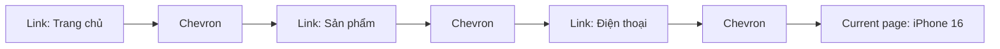
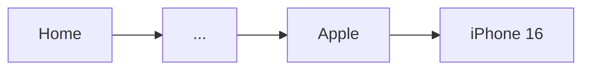
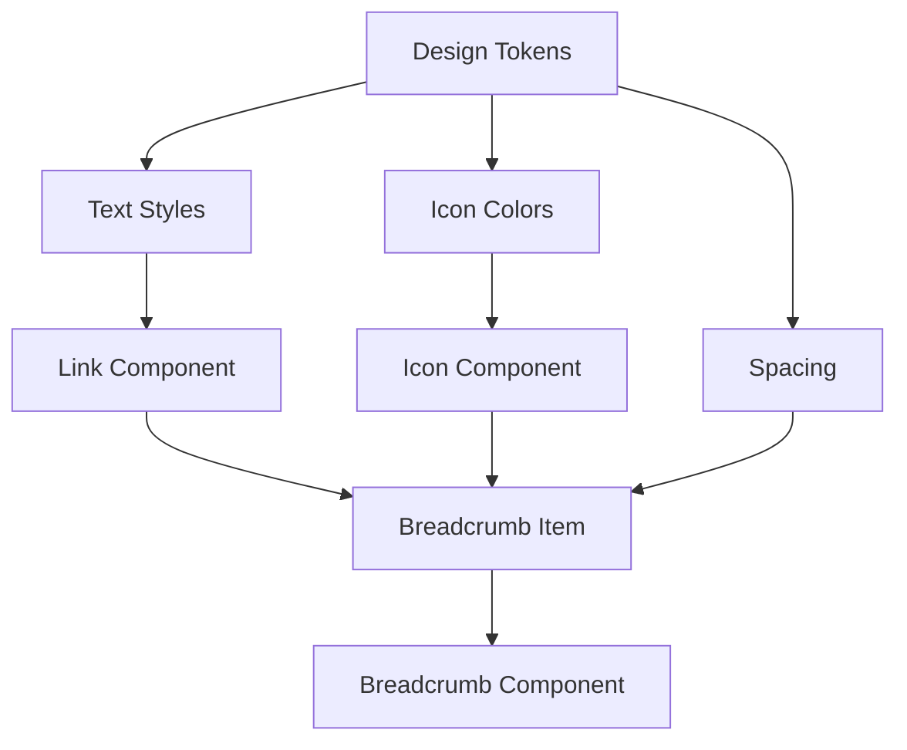
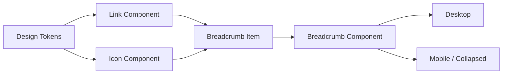

# 039 — Xây dựng Breadcrumb Component

## 1. Thông tin bài học

| Nội dung                     | Chi tiết                                                                      |
| ---------------------------- | ----------------------------------------------------------------------------- |
| **Module**                   | Navigation & Layout Components                                                |
| **Tên bài học**              | Build a Breadcrumb                                                            |
| **Thời điểm video**          | 2:35:44                                                                       |
| **Thành phần được xây dựng** | Breadcrumb                                                                    |
| **Thành phần tái sử dụng**   | Link, Icon                                                                    |
| **Mục tiêu chính**           | Xây dựng thành phần điều hướng phân cấp bằng các Link và biểu tượng phân cách |

---

## 2. Breadcrumb là gì?

**Breadcrumb** là thành phần điều hướng giúp người dùng biết vị trí hiện tại của mình trong cấu trúc phân cấp của website hoặc ứng dụng.

Ví dụ:

```text
Trang chủ / Sản phẩm / Điện thoại / iPhone 16
```

Trong đó:

* `Trang chủ` là một liên kết.
* `Sản phẩm` là một liên kết.
* `Điện thoại` là một liên kết.
* `iPhone 16` là trang hiện tại nên thường không thể nhấn.
* Dấu `/` hoặc biểu tượng `chevron-right` là phần tử phân cách.

Breadcrumb không thay thế thanh điều hướng chính. Nó bổ sung ngữ cảnh và giúp người dùng quay lại các cấp cha nhanh hơn.

---

## 3. Ý tưởng chính của bài học

Sau khi đã xây dựng `Link Component`, chúng ta có thể tái sử dụng các Link đó để tạo thành Breadcrumb.

Một Breadcrumb cơ bản bao gồm:

1. Nhiều `Breadcrumb Item`.
2. Biểu tượng phân cách giữa các mục.
3. Trạng thái riêng cho mục cuối cùng.
4. Khả năng ẩn hoặc hiện các mục tùy theo độ sâu của trang.



---

## 4. Cấu trúc đề xuất

### 4.1. Cấu trúc tổng thể

```text
Breadcrumb
├── Breadcrumb Item 1
│   ├── Link
│   └── Separator
├── Breadcrumb Item 2
│   ├── Link
│   └── Separator
├── Breadcrumb Item 3
│   ├── Link
│   └── Separator
└── Breadcrumb Item 4
    ├── Current Page
    └── Separator: Hidden
```

Mỗi `Breadcrumb Item` nên là một component riêng, thay vì đặt toàn bộ Link và Icon trực tiếp vào Breadcrumb.

Điều này giúp:

* Quản lý trạng thái dễ hơn.
* Tái sử dụng item ở nhiều Breadcrumb khác nhau.
* Ẩn hoặc hiện separator thuận tiện.
* Giảm thao tác thủ công trên Layer Panel.
* Dễ chuyển sang code sau này.

---

## 5. Các thành phần bên trong Breadcrumb

### 5.1. Link

Các mục trung gian nên tái sử dụng `Link Component` đã tạo ở bài trước.

Ví dụ:

```text
Home
Products
Phones
```

Không nên tạo lại text style, màu sắc hoặc trạng thái hover riêng trong Breadcrumb. Breadcrumb phải kế thừa hành vi từ Link Component để bảo đảm tính nhất quán.

---

### 5.2. Separator

Separator là phần tử phân cách giữa các cấp điều hướng.

Có thể sử dụng:

* Dấu `/`
* Dấu `>`
* Biểu tượng `chevron-right`
* Biểu tượng mũi tên nhỏ

Ví dụ:

```text
Home / Products / Phones
```

Hoặc:

```text
Home › Products › Phones
```

Trong một design system hiện đại, `chevron-right` thường phù hợp hơn vì:

* Dễ nhìn thấy cấu trúc phân cấp.
* Đồng bộ với thư viện icon.
* Có thể thay đổi kích thước và màu bằng token.
* Dễ hoán đổi bằng Instance Swap Property.

---

### 5.3. Current Page

Mục cuối cùng thể hiện trang mà người dùng đang xem.

Ví dụ:

```text
Home / Products / Phones / iPhone 16
```

Trong đó `iPhone 16` là trang hiện tại.

Mục cuối cùng nên:

* Không hoạt động như một liên kết.
* Không có separator ở phía sau.
* Có màu hoặc kiểu chữ khác với các mục trước.
* Có thể dùng font weight cao hơn để thể hiện vị trí hiện tại.
* Không nên có trạng thái hover giống Link.

---

## 6. Quy trình xây dựng trong Figma

## Bước 1: Tạo Breadcrumb Item

Tạo một Frame sử dụng Auto Layout ngang.

```text
Breadcrumb Item
├── Link
└── Chevron Right
```

Cài đặt gợi ý:

| Thuộc tính  | Giá trị gợi ý |
| ----------- | ------------- |
| Auto Layout | Horizontal    |
| Alignment   | Center        |
| Gap         | 8 px          |
| Width       | Hug contents  |
| Height      | Hug contents  |

---

## Bước 2: Chèn Link Component

Kéo một instance của `Link Component` vào Breadcrumb Item.

Điều chỉnh nội dung ví dụ:

```text
Home
```

Không nên detach instance vì Breadcrumb cần tiếp tục nhận cập nhật từ Link gốc.

---

## Bước 3: Thêm separator

Chèn biểu tượng `chevron-right` ở bên phải Link.

Áp dụng:

* Icon size token.
* Icon color token.
* Khoảng cách bằng spacing token.
* Instance Swap nếu muốn cho phép thay icon.

Ví dụ:

```text
Home >
```

---

## Bước 4: Chuyển Breadcrumb Item thành Component

Chuyển Frame thành Component và đặt tên rõ ràng:

```text
Navigation/Breadcrumb/Item
```

Có thể thêm các Component Properties:

| Property         | Loại          | Chức năng               |
| ---------------- | ------------- | ----------------------- |
| `Label`          | Text          | Thay đổi nội dung mục   |
| `Show separator` | Boolean       | Hiện hoặc ẩn separator  |
| `State`          | Variant       | Link hoặc Current       |
| `Separator icon` | Instance swap | Thay đổi icon phân cách |

---

## Bước 5: Tạo trạng thái Link và Current

Tạo hai trạng thái chính:

```text
State = Link
State = Current
```

### State: Link

* Có thể nhấn.
* Sử dụng Link Component.
* Có thể có underline hoặc hover.
* Separator thường được hiển thị.

### State: Current

* Không thể nhấn.
* Không sử dụng trạng thái hover.
* Có thể dùng màu text mặc định hoặc đậm hơn.
* Separator phía sau phải được ẩn.

Bảng so sánh:

| Thuộc tính  | Link                  | Current                 |
| ----------- | --------------------- | ----------------------- |
| Có thể nhấn | Có                    | Không                   |
| Hover       | Có                    | Không                   |
| Underline   | Tùy trạng thái        | Không                   |
| Separator   | Thường hiển thị       | Ẩn                      |
| Mục đích    | Điều hướng về cấp cha | Thể hiện trang hiện tại |

---

## Bước 6: Ghép nhiều Breadcrumb Item

Tạo một Auto Layout ngang mới và đặt nhiều Breadcrumb Item vào bên trong.

```text
Breadcrumb
├── Item: Home
├── Item: Products
├── Item: Phones
└── Item: iPhone 16
```

Cài đặt:

| Thuộc tính  | Giá trị      |
| ----------- | ------------ |
| Auto Layout | Horizontal   |
| Alignment   | Center       |
| Gap         | 8–12 px      |
| Width       | Hug contents |
| Height      | Hug contents |

Sau đó chuyển toàn bộ thành Component:

```text
Navigation/Breadcrumb
```

---

## 7. Xử lý mục cuối cùng

Điểm quan trọng nhất trong bài học là mục cuối cùng không nên hoạt động như Link.

Cách xử lý cơ bản:

1. Chọn Breadcrumb Item cuối cùng.
2. Đổi `State` từ `Link` sang `Current`.
3. Tắt `Show separator`.
4. Áp dụng màu text dành cho nội dung hiện tại.

```text
Home > Products > Phones > iPhone 16
                                     ↑
                            Current page
```

Không nên chỉ thay màu Link nhưng vẫn giữ tương tác nhấn, vì điều đó có thể gây nhầm lẫn cho người dùng.

---

## 8. Kiểm soát số lượng mục

Breadcrumb không nên chứa quá nhiều cấp vì sẽ:

* Chiếm nhiều chiều ngang.
* Khó đọc trên màn hình nhỏ.
* Làm lộ cấu trúc thông tin quá sâu.
* Tạo gánh nặng nhận thức cho người dùng.

Thông thường nên hiển thị khoảng:

```text
3–6 mục
```

Ví dụ hợp lý:

```text
Home / Products / Phones / iPhone 16
```

Ví dụ quá dài:

```text
Home / Electronics / Mobile Devices / Smartphones / Apple /
iPhone / iPhone 16 / iPhone 16 Pro / Product Details
```

---

## 9. Thu gọn Breadcrumb dài

Với Breadcrumb có nhiều cấp, có thể thay các cấp ở giữa bằng dấu ba chấm.

Ví dụ đầy đủ:

```text
Home / Products / Electronics / Phones / Apple / iPhone 16
```

Sau khi thu gọn:

```text
Home / … / Apple / iPhone 16
```

Sơ đồ:



Một chiến lược hiển thị phổ biến:

* Luôn giữ cấp đầu tiên.
* Luôn giữ một hoặc hai cấp gần trang hiện tại.
* Luôn giữ trang hiện tại.
* Thu gọn các cấp ở giữa.

---

## 10. Vấn đề của cách ẩn Layer thủ công

Trong nội dung bài học, một cách nhanh là tạo sẵn nhiều mục rồi ẩn những mục không cần dùng trong Layer Panel.

Ví dụ tạo sẵn sáu mục:

```text
Item 1
Item 2
Item 3
Item 4
Item 5
Item 6
```

Khi chỉ cần ba mục thì ẩn:

```text
Item 4
Item 5
Item 6
```

Cách này có thể sử dụng cho prototype nhanh nhưng không phải giải pháp tối ưu cho design system lớn.

### Hạn chế

* Người dùng component phải thao tác trực tiếp trong Layer Panel.
* Dễ quên ẩn separator của mục cuối.
* Khó quản lý khi có nhiều cấp.
* Có nhiều layer ẩn không cần thiết.
* Khó đồng bộ với cấu trúc dữ liệu động trong code.
* Dễ tạo ra lỗi khi thay đổi thứ tự các mục.

### Giải pháp tốt hơn

* Tạo `Breadcrumb Item Component`.
* Dùng nested instance.
* Dùng Boolean Property cho separator.
* Dùng Variant Property cho Link và Current.
* Tạo một số preset theo số lượng item phổ biến.
* Để frontend render danh sách động từ dữ liệu.

---

## 11. Nested Instance trong Breadcrumb

Breadcrumb là ví dụ điển hình của việc sử dụng component lồng nhau.

```text
Breadcrumb Component
└── Breadcrumb Item Component
    ├── Link Component
    └── Icon Component
```

Quan hệ phụ thuộc:



Khi Link Component thay đổi:

* Màu Link được cập nhật.
* Typography được cập nhật.
* Hover state được cập nhật.
* Breadcrumb tự động nhận thay đổi thông qua nested instance.

Đây là lợi ích lớn nhất của việc tái sử dụng component thay vì sao chép layer.

---

## 12. Component Properties đề xuất

Một Breadcrumb Item hoàn chỉnh có thể có các thuộc tính sau:

```text
Breadcrumb Item
├── State: Link | Current
├── Label: Text
├── Show separator: True | False
├── Show leading icon: True | False
├── Separator icon: Instance Swap
└── Disabled: True | False
```

Breadcrumb tổng có thể có:

```text
Breadcrumb
├── Size: Small | Medium
├── Collapse: True | False
├── Item count: 2 | 3 | 4 | 5 | 6
└── Theme: Light | Dark
```

Tuy nhiên không nên tạo quá nhiều variant chỉ để kiểm soát số lượng item. Nếu mỗi số lượng, trạng thái và kích thước đều trở thành variant, số tổ hợp sẽ tăng rất nhanh.

Ví dụ:

```text
2 kích thước
× 5 số lượng item
× 2 theme
× 2 trạng thái collapse
= 40 variants
```

Do đó cần ưu tiên:

* Nested instances.
* Boolean properties.
* Text properties.
* Instance swap properties.

---

## 13. Gắn Breadcrumb với Design Tokens

Không nên sử dụng giá trị màu và khoảng cách trực tiếp.

Ví dụ token:

```text
color.text.action.default
color.text.action.hover
color.text.secondary
color.text.current
color.icon.muted

spacing.100
spacing.200

icon.size.sm
radius.none
```

Ánh xạ:

| Thành phần       | Token                       |
| ---------------- | --------------------------- |
| Link text        | `color.text.action.default` |
| Current page     | `color.text.current`        |
| Separator        | `color.icon.muted`          |
| Khoảng cách item | `spacing.200`               |
| Kích thước icon  | `icon.size.sm`              |
| Typography       | `text.body.sm`              |

Điều này giúp Breadcrumb tự động thích ứng khi đổi theme hoặc cập nhật design system.

---

## 14. Trạng thái tương tác

Một Breadcrumb có thể bao gồm các trạng thái:

### Default

```text
Home > Products > Current Page
```

### Hover

Người dùng đưa chuột lên một Link.

```text
Home > Products > Current Page
       ↑ Hover
```

### Focus

Dành cho điều hướng bằng bàn phím.

```text
[Products]
```

Phải có focus indicator rõ ràng.

### Visited

Có thể sử dụng nếu hệ thống yêu cầu phân biệt liên kết đã truy cập. Tuy nhiên trong Breadcrumb, visited state thường không cần thiết vì có thể làm giao diện thiếu nhất quán.

### Disabled

Ít khi được dùng trong Breadcrumb. Nếu một cấp không thể truy cập, cần cân nhắc hiển thị nó dưới dạng text thay vì Link bị vô hiệu hóa.

---

## 15. Khả năng tiếp cận

Breadcrumb cần hỗ trợ accessibility, không chỉ là một hàng Link trực quan.

### Yêu cầu quan trọng

* Mục hiện tại không nên là một Link tự trỏ lại chính nó.
* Màu text phải có độ tương phản phù hợp.
* Không chỉ dùng màu để biểu thị trạng thái hiện tại.
* Focus state phải rõ ràng.
* Separator không nên được screen reader đọc như nội dung.
* Vùng Breadcrumb nên có nhãn điều hướng rõ ràng.

Cấu trúc HTML tham khảo:

```html
<nav aria-label="Breadcrumb">
  <ol>
    <li><a href="/">Trang chủ</a></li>
    <li><a href="/products">Sản phẩm</a></li>
    <li aria-current="page">iPhone 16</li>
  </ol>
</nav>
```

Thuộc tính quan trọng:

```html
aria-current="page"
```

Nó giúp công nghệ hỗ trợ nhận biết mục cuối cùng là trang hiện tại.

---

## 16. Responsive trên màn hình nhỏ

Breadcrumb có thể bị tràn trên thiết bị di động.

Một số phương án xử lý:

### Phương án 1: Thu gọn các cấp giữa

```text
Home / … / Current Page
```

### Phương án 2: Chỉ hiển thị cấp cha

```text
< Quay lại Điện thoại
```

### Phương án 3: Cho phép cuộn ngang

```text
Home / Products / Phones / Apple / iPhone 16 →
```

Phương án cuộn ngang cần được sử dụng thận trọng vì người dùng có thể không nhận ra vùng này có thể cuộn.

### Phương án 4: Ẩn Breadcrumb trên màn hình rất nhỏ

Chỉ nên dùng khi đã có cơ chế điều hướng thay thế rõ ràng.

---

## 17. Đặt tên component

Cấu trúc tên đề xuất:

```text
Navigation/Breadcrumb
Navigation/Breadcrumb/Item
Navigation/Breadcrumb/Separator
```

Tên variant:

```text
State=Link
State=Current

Size=Small
Size=Medium
```

Tên properties:

```text
Label
Show separator
Leading icon
Separator icon
```

Tránh các tên không có ý nghĩa như:

```text
Component 45
Variant 2
Icon 12
Boolean 1
```

---

## 18. Áp dụng trong một Figma Design System thực tế

Một quy trình phù hợp cho dự án thật:

### Giai đoạn 1: Chuẩn hóa nền tảng

* Xây dựng color tokens.
* Xây dựng typography styles.
* Xây dựng spacing tokens.
* Chuẩn hóa icon library.
* Hoàn thiện Link Component.

### Giai đoạn 2: Xây dựng Breadcrumb Item

* Dùng Link instance.
* Dùng Icon instance.
* Thêm Auto Layout.
* Thêm Text Property.
* Thêm Boolean Property cho separator.
* Thêm variant `Link` và `Current`.

### Giai đoạn 3: Xây dựng Breadcrumb

* Lồng nhiều Breadcrumb Item.
* Kiểm tra số lượng mục.
* Tạo ví dụ thu gọn.
* Kiểm tra Light và Dark theme.
* Kiểm tra màn hình nhỏ.

### Giai đoạn 4: Documentation

Cần mô tả rõ:

* Khi nào nên dùng Breadcrumb.
* Khi nào không nên dùng.
* Số cấp tối đa.
* Cách thể hiện trang hiện tại.
* Quy tắc thu gọn.
* Hành vi responsive.
* Quy tắc accessibility.

---

## 19. Khi nào nên và không nên dùng Breadcrumb?

### Nên dùng khi

* Website có cấu trúc nhiều cấp.
* Người dùng thường xuyên di chuyển giữa cấp cha và cấp con.
* Trang nằm sâu trong hệ thống.
* Cấu trúc phân loại sản phẩm hoặc tài liệu rõ ràng.
* Người dùng cần biết vị trí hiện tại.

Ví dụ:

```text
Trang chủ / Khóa học / Thiết kế / Figma Design System
```

### Không nên dùng khi

* Website chỉ có một hoặc hai cấp.
* Ứng dụng sử dụng quy trình tuyến tính.
* Breadcrumb lặp lại hoàn toàn thanh điều hướng.
* Cấu trúc URL không phản ánh cấu trúc thông tin.
* Các mục trong Breadcrumb không có quan hệ cha–con rõ ràng.

---

## 20. Những lỗi thường gặp

### Lỗi 1: Mục cuối vẫn là Link

```text
Home / Products / Current Page
                          ↑ vẫn nhấn được
```

Điều này khiến người dùng tải lại chính trang đang xem mà không có lợi ích rõ ràng.

---

### Lỗi 2: Separator xuất hiện sau mục cuối

Sai:

```text
Home / Products / Current Page /
```

Đúng:

```text
Home / Products / Current Page
```

---

### Lỗi 3: Breadcrumb quá dài

```text
Home / A / B / C / D / E / F / G / Current
```

Nên thu gọn:

```text
Home / … / F / G / Current
```

---

### Lỗi 4: Detach Link instance

Khi detach:

* Breadcrumb không còn nhận cập nhật từ Link Component.
* Trạng thái hover có thể không đồng bộ.
* Token có thể bị thay bằng raw values.
* Chi phí bảo trì tăng lên.

---

### Lỗi 5: Tạo quá nhiều variant

Không nên tạo mọi tổ hợp số lượng item bằng variant nếu chúng có thể được xử lý bằng nested instance hoặc Boolean Property.

---

### Lỗi 6: Không có quy tắc responsive

Breadcrumb đẹp trên desktop có thể bị tràn ngay khi chuyển sang mobile.

---

## 21. Trả lời câu hỏi ôn tập

### Câu 1: Mục đích chính của bài Build a Breadcrumb là gì?

Mục đích chính là xây dựng một thành phần điều hướng phân cấp giúp người dùng nhận biết vị trí hiện tại và quay lại các cấp cha.

Bài học cũng minh họa cách tái sử dụng những component đã có, đặc biệt là:

* Link Component.
* Icon Component.
* Auto Layout.
* Nested Instance.
* Component Properties.

Breadcrumb là một phần trong hệ thống Navigation & Layout Components, cùng với Menu, Tab Bar, Button Group và Link.

---

### Câu 2: Áp dụng vào một Figma Design System thực tế như thế nào?

Trong design system thực tế, nên xây dựng Breadcrumb theo nhiều lớp:

```text
Tokens
  ↓
Link + Icon
  ↓
Breadcrumb Item
  ↓
Breadcrumb
```

Nên tạo `Breadcrumb Item` riêng với:

* Text Property cho label.
* Boolean Property cho separator.
* Variant cho Link và Current.
* Instance Swap cho separator icon.

Sau đó dùng các Breadcrumb Item làm nested instance trong Breadcrumb tổng.

Cần bổ sung tài liệu sử dụng, quy tắc responsive và accessibility.

---

### Câu 3: Các bước hoặc ý tưởng quan trọng trong bài là gì?

Các bước chính:

1. Tái sử dụng Link Component.
2. Đặt separator icon bên cạnh Link.
3. Dùng Auto Layout để quản lý khoảng cách.
4. Sao chép các Breadcrumb Item để tạo chuỗi phân cấp.
5. Ẩn separator của mục cuối.
6. Chuyển mục cuối sang trạng thái Current.
7. Ẩn các mục không cần thiết khi Breadcrumb ngắn.
8. Chuyển các thành phần con thành nested instances.
9. Điều khiển thuộc tính từ bảng Component Properties.

---

### Câu 4: Rủi ro hoặc hạn chế cần lưu ý là gì?

Rủi ro lớn nhất là phụ thuộc quá nhiều vào việc ẩn layer thủ công.

Điều này có thể dẫn đến:

* Quên ẩn separator cuối cùng.
* Breadcrumb không nhất quán.
* Khó chỉnh sửa khi cấu trúc thay đổi.
* Khó sử dụng trong design system lớn.
* Không phản ánh đúng cách component được render trong code.
* Component có quá nhiều layer ẩn.
* Người dùng design system dễ thao tác sai.

Giải pháp tốt hơn là dùng Breadcrumb Item có trạng thái, Boolean Property và nested instance.

---

## 22. Checklist hoàn thiện Breadcrumb

### Cấu trúc

* [ ] Breadcrumb sử dụng Auto Layout.
* [ ] Mỗi mục là một Breadcrumb Item instance.
* [ ] Link được tái sử dụng từ component có sẵn.
* [ ] Separator sử dụng Icon Component.
* [ ] Mục cuối có trạng thái Current.
* [ ] Separator của mục cuối được ẩn.

### Design System

* [ ] Màu sắc được liên kết với token.
* [ ] Khoảng cách được liên kết với spacing token.
* [ ] Typography sử dụng text style.
* [ ] Icon sử dụng size và color token.
* [ ] Component được đặt tên rõ ràng.
* [ ] Không detach nested instances.

### Trải nghiệm người dùng

* [ ] Breadcrumb không quá dài.
* [ ] Có quy tắc thu gọn.
* [ ] Hoạt động tốt trên mobile.
* [ ] Có hover và focus state rõ ràng.
* [ ] Current page không thể nhấn.
* [ ] Độ tương phản đạt yêu cầu.

---

## 23. Tóm tắt bài học

Breadcrumb là một thành phần điều hướng phân cấp được tạo từ các Link và separator icon.

Cấu trúc cơ bản:

```text
Link + Separator + Link + Separator + Current Page
```

Điểm quan trọng nhất:

* Tái sử dụng Link Component thay vì tạo lại.
* Dùng Auto Layout để quản lý cấu trúc.
* Mục cuối phải là trạng thái Current, không phải Link.
* Separator cuối cùng phải được ẩn.
* Không nên hiển thị quá nhiều cấp.
* Nên dùng nested instance và Component Properties thay vì ẩn layer thủ công.
* Cần xem xét responsive và accessibility ngay từ khi thiết kế.



Breadcrumb tuy là một component tương đối đơn giản nhưng thể hiện rõ nguyên tắc quan trọng của design system:

> Không xây dựng từng thành phần một cách độc lập; hãy tái sử dụng component, token và quy tắc đã có để tạo nên một hệ thống nhất quán, dễ mở rộng và dễ bảo trì.
