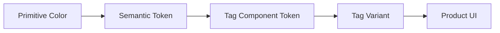
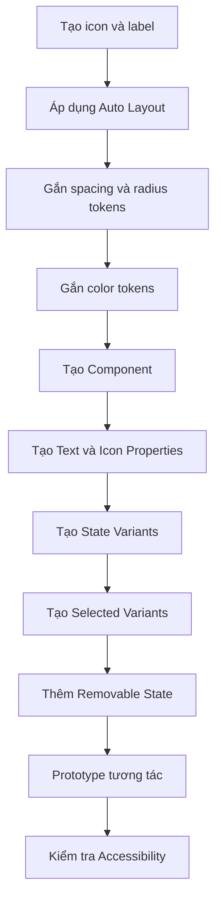

# 041 — Xây dựng Tag Component

## 1. Thông tin bài học

| Thuộc tính          | Nội dung                                                                    |
| ------------------- | --------------------------------------------------------------------------- |
| **Module**          | Display & Feedback Components                                               |
| **Thời điểm video** | 2:44:07                                                                     |
| **Thành phần**      | Tag / Chip / Pill                                                           |
| **Mục tiêu chính**  | Xây dựng Tag Component dùng để hiển thị nhãn, bộ lọc và trạng thái lựa chọn |
| **Công cụ chính**   | Auto Layout, Variables, Component Properties, Variants                      |

---

## 2. Tổng quan

**Tag** là một thành phần giao diện nhỏ dùng để:

* Hiển thị nhãn hoặc thuộc tính.
* Đại diện cho một bộ lọc.
* Cho phép người dùng chọn hoặc bỏ chọn một tùy chọn.
* Cho phép xóa một giá trị đã chọn.
* Hiển thị danh mục, trạng thái hoặc từ khóa.

Tag còn thường được gọi là:

* Chip
* Pill
* Filter chip
* Label
* Selectable tag

Ví dụ:

```text
[ + Design ]
[ ✓ Selected ]
[ React × ]
[ Đang hoạt động ]
```

Trong bài học này, Tag được xây dựng chủ yếu theo hướng **Tag tương tác**, có các trạng thái:

* Default
* Hover
* Focus
* Disabled
* Selected
* Unselected

---

## 3. Mục đích chính của Tag Component

Mục đích của Tag Component là tạo ra một thành phần nhỏ gọn, có thể tái sử dụng để biểu diễn:

* Nhãn nội dung.
* Bộ lọc đang được áp dụng.
* Giá trị đã được chọn.
* Danh mục của một đối tượng.
* Hành động chọn hoặc bỏ chọn nhanh.

Ví dụ trong sản phẩm thực tế:

```text
Bộ lọc tìm kiếm

[ Frontend ] [ Backend ] [ UI/UX ] [ Mobile ]
```

Khi người dùng nhấn vào một Tag:

```text
Unselected → Selected
```

Khi nhấn lại:

```text
Selected → Unselected
```

---

## 4. Cấu trúc của Tag

Một Tag cơ bản gồm ba thành phần:

```text
┌───────────────────────────┐
│  Icon   Label   Close Icon │
└───────────────────────────┘
```

Trong đó:

| Thành phần        | Vai trò                                                      |
| ----------------- | ------------------------------------------------------------ |
| **Leading icon**  | Biểu tượng đứng trước nội dung, ví dụ dấu cộng hoặc dấu kiểm |
| **Label**         | Nội dung văn bản của Tag                                     |
| **Trailing icon** | Biểu tượng xóa hoặc đóng                                     |
| **Container**     | Nền, đường viền, padding và bán kính                         |
| **Focus ring**    | Viền thể hiện trạng thái được focus bằng bàn phím            |

Không phải Tag nào cũng cần cả hai icon.

Ví dụ:

```text
Tag chỉ có chữ:
[ Design ]

Tag có leading icon:
[ + Design ]

Tag có trailing icon:
[ Design × ]

Tag có cả hai:
[ ✓ Design × ]
```

---

## 5. Quy trình xây dựng Tag trong Figma

## Bước 1: Tạo nội dung cơ bản

Tạo một Text Layer với nội dung mẫu:

```text
Tag
```

Thêm một biểu tượng đứng trước nội dung, ví dụ:

```text
+
```

Cấu trúc ban đầu:

```text
Icon + Text
```

Ví dụ:

```text
[ + Tag ]
```

---

## Bước 2: Áp dụng Auto Layout

Chọn icon và text, sau đó sử dụng:

```text
Shift + A
```

Thiết lập Auto Layout theo chiều ngang:

| Thuộc tính    | Giá trị tham khảo |
| ------------- | ----------------: |
| Direction     |        Horizontal |
| Width         |      Hug contents |
| Height        |      Hug contents |
| Gap           |              8 px |
| Padding ngang |             12 px |
| Padding dọc   |             12 px |
| Alignment     |            Center |

Sơ đồ khoảng cách:

```text
┌─────────────────────────────┐
│← 12 →  Icon ← 8 → Text ← 12→│
│          Padding dọc: 12     │
└─────────────────────────────┘
```

> Trong Design System thực tế, các giá trị này nên được liên kết với spacing tokens thay vì nhập trực tiếp.

Ví dụ:

```text
spacing/tag/gap        → 8
spacing/tag/padding-x  → 12
spacing/tag/padding-y  → 8 hoặc 12
```

---

## Bước 3: Thiết lập hình dạng container

Thiết lập bán kính cho Tag:

```text
Corner radius: 4 px
```

Tag có thể sử dụng nhiều kiểu bán kính khác nhau:

| Kiểu            | Bán kính |
| --------------- | -------: |
| Rectangular tag |     4 px |
| Soft tag        |     8 px |
| Pill tag        |   999 px |

Ví dụ:

```text
Radius 4:
┌──────────────┐
│ + Tag        │
└──────────────┘

Pill:
╭──────────────╮
│ + Tag        │
╰──────────────╯
```

Việc chọn bán kính phải phù hợp với ngôn ngữ thiết kế chung của hệ thống.

---

## Bước 4: Gắn màu bằng semantic tokens

Không nên sử dụng màu hex trực tiếp như:

```text
#FFFFFF
#333333
#0066FF
```

Thay vào đó, sử dụng các semantic hoặc mapped tokens.

### Trạng thái mặc định

| Thuộc tính | Token gợi ý       |
| ---------- | ----------------- |
| Background | `surface/default` |
| Border     | `border/action`   |
| Text       | `text/body`       |
| Icon       | `icon/action`     |

Cấu trúc token:

```text
Tag / Default
├── Background → surface/default
├── Border     → border/action
├── Text       → text/body
└── Icon       → icon/action
```

Điều này giúp Tag tự động thích nghi khi:

* Chuyển Light Mode sang Dark Mode.
* Đổi theme thương hiệu.
* Thay đổi semantic color system.
* Áp dụng accessibility mode.

---

## Bước 5: Chuyển thành Component

Chọn toàn bộ Tag và tạo Component:

```text
Ctrl + Alt + K
```

hoặc trên macOS:

```text
⌥ Option + ⌘ Command + K
```

Tên component nên rõ ràng:

```text
Tag
```

Hoặc nếu Design System có nhiều loại Tag:

```text
Tag/Interactive
Tag/Removable
Tag/Informational
```

Không nên đặt tên mơ hồ như:

```text
Tag Item
New Tag
Tag Copy
```

---

## 6. Tạo Text Property

Nội dung của Tag cần được chuyển thành một **Text Property** để người sử dụng instance có thể chỉnh sửa nhanh.

Tên property:

```text
Label
```

Ví dụ:

```text
Label = "Design"
Label = "Frontend"
Label = "Đang hoạt động"
```

Trong instance, người dùng chỉ cần thay đổi property:

```text
Label: Design → Mobile
```

Không cần mở cấu trúc layer bên trong component.

---

## 7. Các trạng thái tương tác

Tag tương tác nên có ít nhất các trạng thái sau:

```text
Default
   ↓
Hover
   ↓
Focus
   ↓
Selected
   ↓
Disabled
```

Một mô hình đầy đủ hơn:

```mermaid
stateDiagram-v2
    [*] --> Default
    Default --> Hover: Di chuột
    Hover --> Selected: Nhấn
    Selected --> HoverSelected: Di chuột
    HoverSelected --> Default: Nhấn lần nữa
    Default --> Focus: Điều hướng bằng bàn phím
    Selected --> FocusSelected: Điều hướng bằng bàn phím
    Default --> Disabled: Không khả dụng
    Selected --> Disabled: Không khả dụng
```

---

## 8. Trạng thái Default

Default là trạng thái ban đầu khi Tag chưa được tương tác.

```text
┌──────────────┐
│ + Tag        │
└──────────────┘
```

Token gợi ý:

| Thuộc tính | Token             |
| ---------- | ----------------- |
| Background | `surface/default` |
| Border     | `border/action`   |
| Text       | `text/body`       |
| Icon       | `icon/action`     |

Default phải đủ rõ để người dùng nhận biết rằng Tag có thể tương tác.

---

## 9. Trạng thái Hover

Hover được hiển thị khi con trỏ nằm trên Tag.

Token gợi ý:

| Thuộc tính | Token                        |
| ---------- | ---------------------------- |
| Background | `surface/action-hover-light` |
| Border     | `border/action-hover`        |
| Text       | `text/action-hover`          |
| Icon       | `icon/action-hover`          |

Ví dụ:

```text
Default                  Hover
┌──────────────┐         ┌──────────────┐
│ + Tag        │   →     │ + Tag        │
└──────────────┘         └──────────────┘
                         Nền được nhấn mạnh
```

Hover phải tạo phản hồi thị giác nhưng không nên thay đổi kích thước component.

Không nên:

* Thay đổi padding.
* Thay đổi chiều cao.
* Làm Tag dịch chuyển.
* Thêm border khiến kích thước tổng bị thay đổi.

---

## 10. Trạng thái Focus

Focus dùng cho người dùng điều hướng bằng bàn phím.

Ví dụ:

```text
╔════════════════╗
║ ┌────────────┐ ║
║ │ + Tag      │ ║
║ └────────────┘ ║
╚════════════════╝
```

Focus ring có thể dùng:

```text
Stroke width: 2 px
Offset: 2 px
```

Token gợi ý:

```text
focus/ring/action
```

Cấu trúc:

```text
Tag
└── Focus ring
    ├── Width: 2 px
    ├── Offset: 2 px
    └── Color: focus/ring/action
```

Focus không nên chỉ thể hiện bằng sự thay đổi màu nền vì điều này có thể khó nhận biết với người dùng có vấn đề về thị lực màu.

---

## 11. Trạng thái Disabled

Disabled thể hiện Tag không thể tương tác.

Token gợi ý:

| Thuộc tính | Token              |
| ---------- | ------------------ |
| Background | `surface/disabled` |
| Border     | `border/disabled`  |
| Text       | `text/disabled`    |
| Icon       | `icon/disabled`    |

Ví dụ:

```text
┌──────────────┐
│ + Tag        │
└──────────────┘
  Disabled
```

Disabled phải giảm độ nhấn mạnh, nhưng nội dung vẫn cần đủ rõ để đọc được.

Không nên chỉ giảm opacity của toàn bộ component quá thấp, vì:

* Văn bản có thể không đạt độ tương phản.
* Icon trở nên khó nhận biết.
* Trạng thái disabled không nhất quán giữa các theme.

---

## 12. Tạo biến thể Selected và Unselected

Tag tương tác cần có hai giá trị lựa chọn chính:

```text
Selected = False
Selected = True
```

Hoặc theo cách đặt tên trong bài học:

```text
Style = Unselected
Style = Selected
```

Tuy nhiên, cách đặt tên tốt hơn là sử dụng Boolean Property:

```text
Selected = True / False
```

Điều này giúp ý nghĩa của property rõ ràng hơn.

### Unselected

```text
┌──────────────┐
│ + Design     │
└──────────────┘
```

### Selected

```text
┌──────────────┐
│ ✓ Design     │
└──────────────┘
```

Sơ đồ chuyển đổi:

```text
┌────────────────┐
│ Selected=False │
│   + Design     │
└───────┬────────┘
        │ Click
        ▼
┌────────────────┐
│ Selected=True  │
│   ✓ Design     │
└───────┬────────┘
        │ Click
        ▼
┌────────────────┐
│ Selected=False │
└────────────────┘
```

---

## 13. Màu sắc của trạng thái Selected

Khi Tag được chọn, background cần nổi bật hơn.

Token gợi ý:

| Thuộc tính | Token            |
| ---------- | ---------------- |
| Background | `surface/action` |
| Border     | `border/action`  |
| Text       | `text/on-action` |
| Icon       | `icon/on-action` |

Cấu trúc token:

```text
Tag / Selected
├── Background → surface/action
├── Border     → border/action
├── Text       → text/on-action
└── Icon       → icon/on-action
```

Ví dụ:

```text
Unselected               Selected
┌──────────────┐         ┌──────────────┐
│ + Design     │   →     │ ✓ Design     │
└──────────────┘         └──────────────┘
```

Text và icon trong trạng thái Selected phải sử dụng màu có độ tương phản phù hợp với nền action.

---

## 14. Ma trận Variant đề xuất

Một Tag hoàn chỉnh có thể được tổ chức như sau:

| Property       | Giá trị                                 |
| -------------- | --------------------------------------- |
| `Selected`     | False, True                             |
| `State`        | Default, Hover, Focus, Disabled         |
| `Size`         | Small, Medium, Large                    |
| `Color`        | Neutral, Brand, Success, Warning, Error |
| `Leading Icon` | True, False                             |
| `Removable`    | True, False                             |

Số lượng tổ hợp lý thuyết:

```text
2 × 4 × 3 × 5 × 2 × 2 = 480 variants
```

Đây là số lượng quá lớn nếu tạo thủ công toàn bộ.

Do đó nên phân biệt:

### Variant Properties

Dùng cho những thay đổi cấu trúc hoặc hình thức lớn:

```text
Size
State
Selected
Color
```

### Boolean Properties

Dùng để bật hoặc tắt layer:

```text
Show leading icon
Show trailing icon
Removable
```

### Instance Swap Properties

Dùng để thay biểu tượng:

```text
Leading icon
Trailing icon
```

Cấu trúc tối ưu:

```text
Tag
├── Variant: Size
├── Variant: State
├── Variant: Selected
├── Variant: Color
├── Boolean: Leading icon
├── Boolean: Removable
├── Instance swap: Leading icon
└── Text property: Label
```

---

## 15. Tag có thể xóa — Removable Tag

Tag có thể xóa thường xuất hiện khi người dùng đã chọn một bộ lọc hoặc nhập một giá trị.

Ví dụ:

```text
[ React × ]
[ Figma × ]
[ Hà Nội × ]
```

Cấu trúc:

```text
┌────────────────────┐
│ Label   Close icon │
└────────────────────┘
```

Nên sử dụng property:

```text
Removable = True / False
```

Khi `Removable = True`:

```text
[ Design × ]
```

Khi `Removable = False`:

```text
[ Design ]
```

Icon đóng nên được thiết lập bằng:

```text
Instance Swap Property
```

Ví dụ:

```text
Trailing Icon = Close
```

Không nên biến toàn bộ Tag thành nút xóa mà không làm rõ vùng tương tác.

Trong quá trình triển khai frontend, cần xác định:

* Nhấn vào thân Tag có chọn Tag hay không.
* Nhấn vào icon `×` có xóa Tag hay không.
* Hai vùng tương tác có hành vi khác nhau hay không.

---

## 16. Color Variants

Tag có thể có nhiều biến thể màu theo mục đích ngữ nghĩa.

| Color   | Mục đích                     |
| ------- | ---------------------------- |
| Neutral | Nhãn thông thường            |
| Brand   | Nội dung hoặc lựa chọn chính |
| Success | Trạng thái thành công        |
| Warning | Cảnh báo                     |
| Error   | Lỗi hoặc nguy hiểm           |
| Info    | Thông tin                    |

Ví dụ:

```text
[ Neutral ]
[ Brand ]
[ Success ]
[ Warning ]
[ Error ]
```

Token nên được tổ chức theo ngữ nghĩa:

```text
tag/neutral/background
tag/neutral/text
tag/neutral/border

tag/success/background
tag/success/text
tag/success/border

tag/error/background
tag/error/text
tag/error/border
```

Hoặc tái sử dụng token hệ thống:

```text
surface/success-subtle
text/success
border/success
```

Không nên đặt tên token theo màu vật lý:

```text
green-100
red-500
blue-600
```

trực tiếp trong component, vì ý nghĩa của màu có thể thay đổi giữa các theme.

---

## 17. Size Variants

Tag và Badge thường có thể chia sẻ cùng hệ thống sizing tokens.

Ví dụ:

| Size   | Chiều cao | Padding ngang |  Gap |     Icon |
| ------ | --------: | ------------: | ---: | -------: |
| Small  |     24 px |          8 px | 4 px | 12–14 px |
| Medium |     32 px |         12 px | 8 px |    16 px |
| Large  |     40 px |         16 px | 8 px |    20 px |

Token dùng chung:

```text
component/small/height
component/medium/height
component/large/height

component/small/padding-x
component/medium/padding-x
component/large/padding-x
```

Hoặc cụ thể hơn:

```text
tag/size/sm/height
tag/size/md/height
tag/size/lg/height
```

Nếu Tag và Badge có cùng quy chuẩn kích thước, có thể dùng token chung:

```text
compact-control/sm/height
compact-control/md/height
compact-control/lg/height
```

Sơ đồ:

```text
Sizing tokens
     │
     ├── Tag
     ├── Badge
     └── Status label
```

Điều này giúp các component nhỏ có chiều cao, icon và typography nhất quán.

---

## 18. Cấu trúc Component Set đề xuất

```text
Tag
├── Size
│   ├── Small
│   ├── Medium
│   └── Large
│
├── State
│   ├── Default
│   ├── Hover
│   ├── Focus
│   └── Disabled
│
├── Selected
│   ├── False
│   └── True
│
├── Color
│   ├── Neutral
│   ├── Brand
│   ├── Success
│   ├── Warning
│   └── Error
│
├── Properties
│   ├── Label
│   ├── Show leading icon
│   ├── Leading icon
│   ├── Removable
│   └── Trailing icon
│
└── Token bindings
    ├── Surface
    ├── Border
    ├── Text
    ├── Icon
    ├── Radius
    ├── Spacing
    └── Focus ring
```

---

## 19. Áp dụng vào Design System thực tế

Trong Design System thực tế, Tag không nên được thiết kế như một thành phần độc lập hoàn toàn. Nó phải liên kết với:

```text
Primitive tokens
      ↓
Semantic tokens
      ↓
Component tokens
      ↓
Tag Component
```

Ví dụ:

```text
Primitive:
blue/600

Semantic:
surface/action

Component:
tag/selected/background

Component:
Tag
```

Luồng đầy đủ:



Ví dụ triển khai:

```text
blue/600
   ↓
surface/action
   ↓
tag/selected/background
   ↓
Tag / Selected
```

Nhờ vậy, khi thay đổi màu thương hiệu:

```text
blue/600 → purple/600
```

toàn bộ Tag trong sản phẩm sẽ được cập nhật tự động.

---

## 20. Prototype tương tác

Có thể sử dụng Interactive Components trong Figma để mô phỏng hành vi chọn Tag.

### Unselected sang Selected

```text
Trigger: On click
Action: Change to
Destination: Selected
Animation: Smart Animate
Duration: 100–150 ms
```

### Selected sang Unselected

```text
Trigger: On click
Action: Change to
Destination: Unselected
Animation: Smart Animate
Duration: 100–150 ms
```

Sơ đồ:

```text
Unselected
    │
    │ On click
    ▼
Selected
    │
    │ On click
    ▼
Unselected
```

Hover có thể được thiết lập:

```text
While hovering → Hover
Mouse leave → Default
```

Focus không nên chỉ được mô phỏng bằng chuột; cần được ghi chú rõ để developer triển khai với bàn phím.

---

## 21. Phân biệt Tag, Badge và Button

| Thành phần | Mục đích                          | Có tương tác? | Ví dụ             |
| ---------- | --------------------------------- | ------------: | ----------------- |
| **Tag**    | Nhãn, bộ lọc hoặc lựa chọn        |     Có thể có | `[ Design × ]`    |
| **Badge**  | Hiển thị trạng thái hoặc số lượng |  Thường không | `Notifications 8` |
| **Button** | Thực hiện một hành động           |            Có | `Lưu thay đổi`    |
| **Link**   | Điều hướng đến nội dung khác      |            Có | `Xem chi tiết`    |

### Tag

```text
[ Frontend ]
```

Ý nghĩa:

> Giá trị, nhãn hoặc bộ lọc.

### Badge

```text
● Online
```

Ý nghĩa:

> Trạng thái hoặc thông tin bổ sung.

### Button

```text
[ Tạo dự án ]
```

Ý nghĩa:

> Thực hiện hành động.

Không nên dùng Tag thay cho Button chỉ vì Tag có kích thước nhỏ hơn.

---

## 22. Các rủi ro và giới hạn

### 22.1. Quá nhiều variants

Khi kết hợp nhiều property, số lượng variant tăng rất nhanh.

Ví dụ:

```text
Size × State × Selected × Color × Icon × Removable
```

Giải pháp:

* Chỉ dùng Variant cho thay đổi quan trọng.
* Dùng Boolean Property để ẩn hoặc hiện icon.
* Dùng Instance Swap để thay icon.
* Dùng Variables cho màu và spacing.

---

### 22.2. Selected và Disabled khó phân biệt

Nếu cả Selected và Disabled đều sử dụng màu nhạt, người dùng có thể không hiểu Tag đang:

* Được chọn.
* Không được chọn.
* Không thể tương tác.

Giải pháp:

* Selected cần có dấu hiệu rõ như nền nổi bật hoặc dấu kiểm.
* Disabled cần giảm mức độ nhấn mạnh.
* Không chỉ dựa vào một thay đổi màu nhỏ.

---

### 22.3. Không rõ vùng tương tác của icon đóng

Với Tag có icon `×`, cần xác định rõ:

```text
Nhấn thân Tag → chọn hoặc bỏ chọn
Nhấn icon ×   → xóa Tag
```

Nếu toàn bộ Tag đều thực hiện cùng một hành động, icon đóng có thể gây hiểu nhầm.

---

### 22.4. Tag quá dài

Nội dung Tag có thể dài hơn dự kiến:

```text
[ Thiết kế giao diện ứng dụng dành cho thiết bị di động × ]
```

Cần xác định quy tắc:

* Tag được phép mở rộng theo nội dung.
* Tag có chiều rộng tối đa.
* Text bị cắt bằng dấu `…`.
* Tag được xuống dòng hay không.

Thông thường:

```text
White-space: nowrap
Max-width: xác định
Overflow: ellipsis
```

---

### 22.5. Khả năng truy cập

Tag tương tác phải hỗ trợ:

* Điều hướng bàn phím.
* Focus ring.
* Enter hoặc Space để chọn.
* Nhãn dễ hiểu cho screen reader.
* Vùng nhấn đủ lớn.
* Độ tương phản phù hợp.

Một Tag có chiều cao trực quan nhỏ vẫn có thể cần vùng tương tác tối thiểu lớn hơn trên thiết bị cảm ứng.

---

### 22.6. Dùng màu làm tín hiệu duy nhất

Không nên chỉ đổi màu để thể hiện trạng thái Selected.

Nên kết hợp:

```text
Màu nền + dấu kiểm + border
```

Ví dụ:

```text
Unselected: + Design
Selected:   ✓ Design
```

Điều này hỗ trợ người dùng khó phân biệt màu sắc.

---

## 23. Các bước chính của bài học

Tóm tắt quy trình:

```text
1. Tạo icon và label
2. Thêm Auto Layout
3. Thiết lập gap và padding
4. Thêm background, border và radius
5. Gắn semantic tokens
6. Chuyển thành Component
7. Tạo Text Property
8. Tạo các trạng thái Default, Hover, Focus, Disabled
9. Tạo lựa chọn Selected và Unselected
10. Thiết lập Interactive Component
11. Bổ sung removable và size variants
12. Kiểm tra accessibility
```

Sơ đồ tổng quát:



---

# 24. Trả lời câu hỏi ôn tập

## Câu 1: Mục đích chính của bài “Build a Tag” là gì?

Mục đích chính là xây dựng một Tag Component có thể tái sử dụng trong nhóm **Display & Feedback Components**.

Tag được sử dụng để:

* Hiển thị nhãn.
* Đại diện cho bộ lọc.
* Thể hiện giá trị đã chọn.
* Cho phép chọn hoặc bỏ chọn.
* Cho phép xóa giá trị bằng icon đóng.

Component được xây dựng với Auto Layout, semantic tokens, component properties và các trạng thái tương tác để đảm bảo tính nhất quán trong toàn bộ sản phẩm.

---

## Câu 2: Áp dụng bài học này vào Design System thực tế như thế nào?

Trong Design System thực tế, cần:

1. Xác định các trường hợp sử dụng của Tag.
2. Tạo cấu trúc icon, label và container bằng Auto Layout.
3. Liên kết màu, spacing, radius và typography với tokens.
4. Tạo các thuộc tính `Size`, `State`, `Selected` và `Color`.
5. Sử dụng Boolean Property cho leading icon và removable icon.
6. Sử dụng Instance Swap để thay icon.
7. Tạo Interactive Component mô phỏng thao tác chọn.
8. Kiểm tra focus, keyboard interaction và độ tương phản.
9. Viết tài liệu phân biệt Tag với Badge và Button.
10. Đồng bộ tên property với component trong mã nguồn.

Ví dụ mapping với frontend:

```text
Figma                  Code
-----------------------------------
Size=Small             size="sm"
State=Disabled         disabled
Selected=True          selected
Color=Success          tone="success"
Removable=True         removable
Label                   children
```

---

## Câu 3: Các bước hoặc ý tưởng chính được trình bày trong bài là gì?

Các ý tưởng chính gồm:

* Tạo Tag từ icon và text.
* Sử dụng Auto Layout với Hug contents.
* Thiết lập gap và padding nhất quán.
* Thêm border và corner radius.
* Gắn màu vào semantic tokens.
* Chuyển Tag thành Component.
* Tạo Text Property cho label.
* Xây dựng các trạng thái Default, Hover, Focus và Disabled.
* Tạo biến thể Selected và Unselected.
* Thay đổi màu nền, text và icon khi Tag được chọn.
* Sử dụng Interactive Components để mô phỏng hành vi nhấn.
* Chuẩn bị khả năng mở rộng cho removable, color và size variants.

---

## Câu 4: Rủi ro hoặc giới hạn nào cần lưu ý?

Các rủi ro chính gồm:

* Tạo quá nhiều variant khiến component khó quản lý.
* Selected, Hover và Disabled không đủ khác biệt.
* Dùng màu làm tín hiệu trạng thái duy nhất.
* Không làm rõ hành vi của icon đóng.
* Tag dài gây phá vỡ layout.
* Vùng tương tác quá nhỏ trên thiết bị cảm ứng.
* Không hỗ trợ bàn phím và focus state.
* Dùng Tag thay cho Button hoặc Badge sai mục đích.
* Sử dụng giá trị màu và spacing trực tiếp thay vì tokens.
* Tên property trong Figma không đồng nhất với code.

---

# 25. Checklist hoàn thiện Tag Component

## Cấu trúc

* [ ] Tag sử dụng Auto Layout.
* [ ] Width và height sử dụng Hug contents.
* [ ] Label được tạo thành Text Property.
* [ ] Icon được tạo thành Instance Swap Property.
* [ ] Leading icon có thể bật hoặc tắt.
* [ ] Trailing icon có thể bật hoặc tắt.
* [ ] Removable được tạo thành Boolean Property.

## Variants

* [ ] Có Default state.
* [ ] Có Hover state.
* [ ] Có Focus state.
* [ ] Có Disabled state.
* [ ] Có Selected state.
* [ ] Có Unselected state.
* [ ] Có các size cần thiết.
* [ ] Có các color variants cần thiết.

## Tokens

* [ ] Background liên kết với token.
* [ ] Border liên kết với token.
* [ ] Text liên kết với token.
* [ ] Icon liên kết với token.
* [ ] Spacing liên kết với token.
* [ ] Radius liên kết với token.
* [ ] Focus ring liên kết với token.

## Accessibility

* [ ] Selected không chỉ được thể hiện bằng màu.
* [ ] Focus ring dễ nhận biết.
* [ ] Text đạt độ tương phản.
* [ ] Icon đóng có nhãn chức năng rõ ràng.
* [ ] Tag có thể điều khiển bằng bàn phím.
* [ ] Vùng nhấn phù hợp với thiết bị cảm ứng.
* [ ] Disabled vẫn đủ rõ để đọc.

---

# 26. Kết luận

Tag là một component nhỏ nhưng có nhiều trạng thái và hành vi cần được xác định rõ.

Một Tag Component tốt cần đảm bảo:

```text
Tái sử dụng
+ Nhất quán
+ Dễ tùy chỉnh
+ Có phản hồi tương tác
+ Hỗ trợ accessibility
+ Liên kết với token system
= Tag Component hoàn chỉnh
```

Điểm quan trọng nhất không chỉ là tạo ra hình dạng giống một chiếc pill hoặc chip, mà là xây dựng một hệ thống Tag có thể mở rộng cho nhiều trường hợp:

* Nhãn thông tin.
* Bộ lọc.
* Lựa chọn.
* Giá trị có thể xóa.
* Trạng thái ngữ nghĩa.
* Giao diện sáng và tối.

Tag là một phần trong nhóm **Display & Feedback Components**, cùng với Avatar, Badge, Loader, Progress, Snackbar, Carousel, Icon Button và Table.

---

# Bài luyện tập

## Mục tiêu


## Đề bài


## Yêu cầu hoàn thành

- [ ] 
- [ ] 
- [ ] 

## Kết quả / lời giải


## Ghi chú
