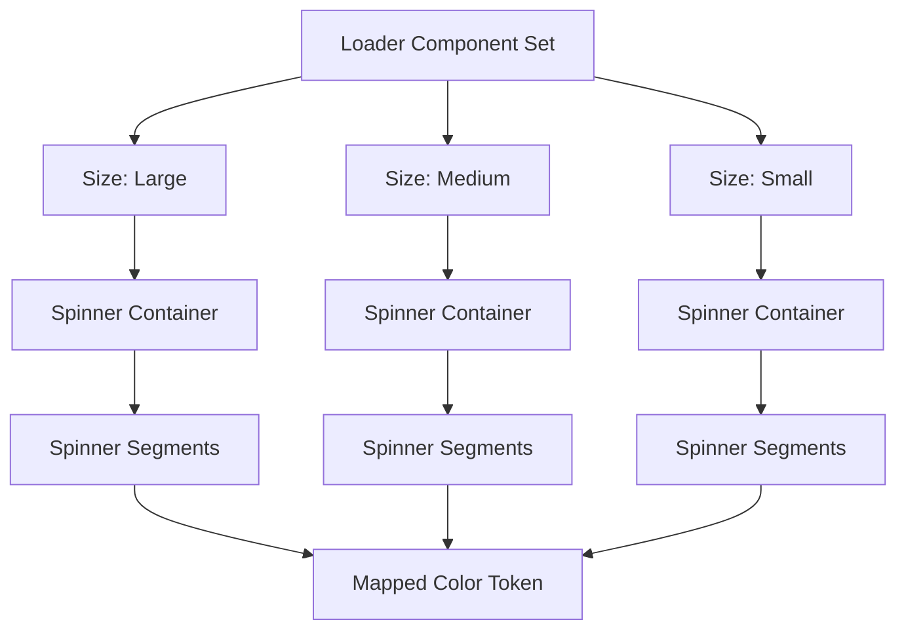
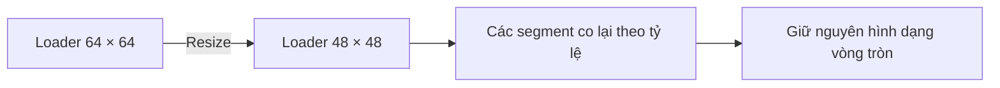
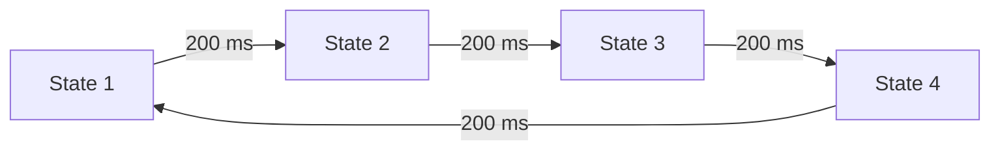
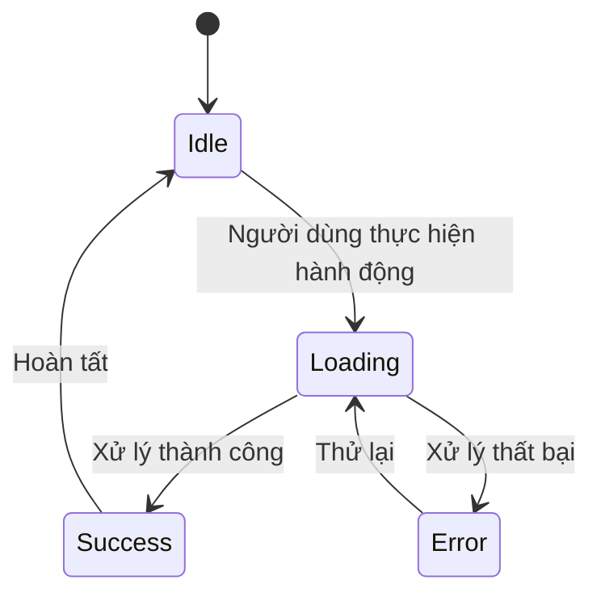
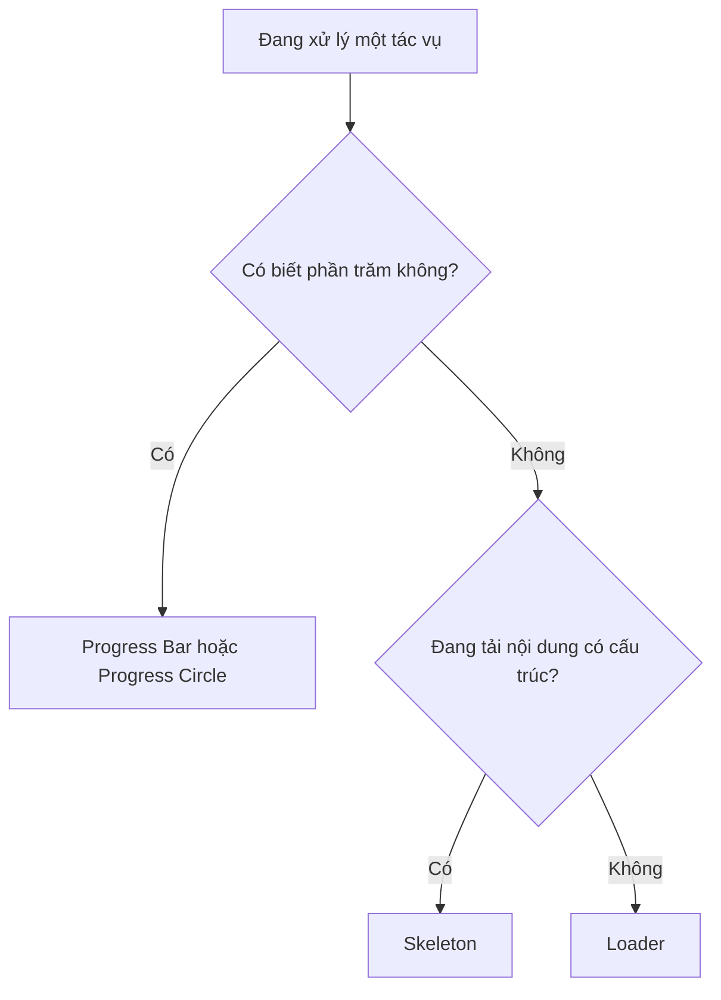

# 042 – Xây dựng Loader Component

## 1. Thông tin bài học

| Thuộc tính          | Nội dung                                                                                      |
| ------------------- | --------------------------------------------------------------------------------------------- |
| **Module**          | Display & Feedback Components                                                                 |
| **Thời điểm video** | 2:48:47                                                                                       |
| **Thành phần**      | Loader / Spinner                                                                              |
| **Mục tiêu**        | Xây dựng bộ chỉ báo trạng thái đang tải, hỗ trợ nhiều kích thước và sẵn sàng để tạo animation |

---

## 2. Loader là gì?

**Loader** là thành phần phản hồi trực quan, cho người dùng biết rằng hệ thống đang xử lý một tác vụ và nội dung chưa sẵn sàng.

Loader thường xuất hiện trong các trường hợp:

* Đang gửi biểu mẫu.
* Đang tải dữ liệu từ API.
* Đang chuyển trang.
* Đang tải nội dung của một khu vực.
* Đang thực hiện tác vụ bất đồng bộ.
* Đang xử lý một hành động trong Button.

Loader không thể hiện tiến độ chính xác. Nó chỉ cho biết:

> “Hệ thống vẫn đang xử lý, vui lòng chờ.”

Nếu có thể xác định được phần trăm hoàn thành, nên sử dụng **Progress Bar** hoặc **Progress Circle** thay cho Loader.

---

## 3. Mục đích chính của bài học

Bài học hướng dẫn cách xây dựng một Loader có:

* Cấu trúc phù hợp để tạo hiệu ứng quay hoặc nhấp nháy.
* Nhiều biến thể kích thước.
* Khả năng co giãn đồng đều.
* Màu sắc được liên kết với design token.
* Khả năng sử dụng trong Button, Section và Page.
* Khả năng mô phỏng animation bằng Interactive Components trong Figma.

---

## 4. Cấu trúc của Loader

Loader trong bài học được tạo từ nhiều phần tử nhỏ bố trí xung quanh một đường tròn.

Ví dụ:

```text
             ●

        ●         ●

    ●                 ●

        ●         ●

             ●
```

Mỗi phần tử có thể là:

* Một hình tròn.
* Một đoạn thẳng bo góc.
* Một nét vòng cung.
* Một phần của đường tròn.
* Một shape có độ trong suốt khác nhau.

Khi các phần tử lần lượt thay đổi màu hoặc độ trong suốt, người dùng sẽ có cảm giác Loader đang quay.

---

## 5. Sơ đồ cấu trúc component



Cấu trúc layer có thể được tổ chức như sau:

```text
Loader
└── Spinner
    ├── Segment 01
    ├── Segment 02
    ├── Segment 03
    ├── Segment 04
    ├── Segment 05
    ├── Segment 06
    ├── Segment 07
    └── Segment 08
```

Tên layer rõ ràng sẽ giúp quá trình tạo animation, bàn giao cho lập trình viên và bảo trì component dễ dàng hơn.

---

## 6. Các bước xây dựng Loader

### Bước 1: Tạo khung Loader

Tạo một Frame hình vuông, ví dụ:

```text
Width: 64 px
Height: 64 px
```

Frame này là vùng chứa toàn bộ Loader.

Kích thước hình vuông giúp Loader:

* Quay quanh đúng tâm.
* Dễ căn giữa.
* Giữ tỷ lệ khi thay đổi kích thước.
* Dễ sử dụng trong Auto Layout.

---

### Bước 2: Tạo các phần tử của Spinner

Tạo một shape nhỏ, sau đó nhân bản và bố trí các bản sao xung quanh tâm của Frame.

Ví dụ, nếu sử dụng tám phần tử:

```text
360° / 8 = 45°
```

Mỗi phần tử được xoay lệch nhau `45°`.

```text
Segment 01:   0°
Segment 02:  45°
Segment 03:  90°
Segment 04: 135°
Segment 05: 180°
Segment 06: 225°
Segment 07: 270°
Segment 08: 315°
```

Điều này giúp các phần tử tạo thành một vòng tròn cân đối.

---

### Bước 3: Căn chỉnh các phần tử

Đảm bảo các phần tử:

* Có cùng kích thước.
* Cách đều tâm.
* Có cùng bán kính quay.
* Không bị lệch khỏi Frame.
* Tạo thành một vòng tròn thị giác rõ ràng.

Có thể sử dụng:

* Align horizontal centers.
* Align vertical centers.
* Rotate.
* Smart selection.
* Tidy up.

---

### Bước 4: Áp dụng màu sắc từ token

Không nên sử dụng màu hex trực tiếp như:

```text
#6750A4
```

Thay vào đó, hãy liên kết Loader với semantic token, ví dụ:

```text
Loader/Default
Action/Primary
Icon/Primary
Foreground/Accent
```

Trong bài học, màu Loader được gắn với token dạng:

```text
Surface Action
```

Cách này giúp Loader tự động thích ứng với:

* Light mode.
* Dark mode.
* Theme thương hiệu.
* Trạng thái Disabled.
* Các sản phẩm khác nhau trong cùng hệ thống.

---

### Bước 5: Chuyển Loader thành Component

Chọn toàn bộ Loader và tạo component:

```text
Ctrl + Alt + K
```

Đặt tên theo hệ thống phân cấp:

```text
Loader
```

Hoặc:

```text
Feedback/Loader
```

Nếu hệ thống component lớn, cách đặt tên theo nhóm giúp tìm kiếm nhanh hơn trong Assets Panel.

---

## 7. Thiết lập Resize Constraints

Một điểm quan trọng trong bài học là thiết lập các phần tử bên trong Loader thành:

```text
Horizontal constraint: Scale
Vertical constraint: Scale
```

### Tại sao phải sử dụng Scale?

Nếu Loader từ `64 × 64 px` được thu nhỏ xuống `48 × 48 px`, các phần tử bên trong cũng sẽ thu nhỏ theo đúng tỷ lệ.



Nếu không sử dụng Scale, có thể xảy ra các lỗi:

* Frame nhỏ lại nhưng các shape bên trong vẫn giữ nguyên kích thước.
* Khoảng cách giữa các segment không đồng đều.
* Loader bị tràn ra ngoài Frame.
* Hình dạng Loader bị biến dạng.

---

## 8. Tạo các biến thể kích thước

Loader nên có nhiều kích thước để phù hợp với từng ngữ cảnh.

Ví dụ:

| Variant    | Kích thước tham khảo | Trường hợp sử dụng            |
| ---------- | -------------------: | ----------------------------- |
| **Small**  |             16–24 px | Button, Input, Inline action  |
| **Medium** |             32–48 px | Card, Panel, Section          |
| **Large**  |                64 px | Page loading, Empty state lớn |

Trong bài học, các kích thước được minh họa gần như sau:

```text
Large:  64 × 64
Medium: 48 × 48
Small:  32 × 32
```

### Property đề xuất

```text
Size = Small | Medium | Large
```

Tên component variant:

```text
Loader, Size=Small
Loader, Size=Medium
Loader, Size=Large
```

---

## 9. Ngữ cảnh sử dụng từng kích thước

### 9.1. Loader trong Button

Loader nhỏ thường được đặt bên trong Button khi người dùng vừa thực hiện một hành động.

```text
┌──────────────────────────┐
│      ◌  Đang lưu...      │
└──────────────────────────┘
```

Khi Button đang tải:

* Có thể thay icon bằng Loader.
* Có thể giữ lại nội dung Button.
* Nên vô hiệu hóa việc nhấn nhiều lần.
* Chiều rộng Button không nên thay đổi đột ngột.

Ví dụ trạng thái:

```text
Button State = Loading
```

---

### 9.2. Loader trong Section

Loader trung bình phù hợp với một khu vực đang lấy dữ liệu.

```text
┌──────────────────────────────────────┐
│                                      │
│                  ◌                   │
│          Đang tải dữ liệu...         │
│                                      │
└──────────────────────────────────────┘
```

Không nhất thiết phải chặn toàn bộ trang nếu chỉ một phần nội dung đang tải.

---

### 9.3. Loader toàn trang

Loader lớn được sử dụng khi nội dung chính của trang chưa thể hiển thị.

```text
┌──────────────────────────────────────┐
│                                      │
│                                      │
│                  ◌                   │
│             Đang tải...              │
│                                      │
│                                      │
└──────────────────────────────────────┘
```

Tuy nhiên, Loader toàn trang nên được sử dụng thận trọng vì nó làm người dùng không thể tương tác với nội dung khác.

---

## 10. Tạo animation bằng Interactive Components

Bài học còn giới thiệu cách tạo hiệu ứng Loader bằng các variant nối tiếp nhau.

### Ý tưởng

Tạo nhiều variant có cùng cấu trúc, nhưng thay đổi vị trí của phần tử đang được nhấn mạnh.

```text
Frame 1: Segment 1 nổi bật
Frame 2: Segment 2 nổi bật
Frame 3: Segment 3 nổi bật
Frame 4: Segment 4 nổi bật
```

Sau đó nối các variant bằng Prototype.

---

### Cấu hình tương tác

Ví dụ:

```text
Trigger: After delay
Delay: 200 ms
Action: Change to
Animation: Smart Animate
```

Luồng chuyển động:



Khi luồng lặp lại liên tục, Loader sẽ tạo cảm giác đang chuyển động.

---

### Cách tổ chức trạng thái animation

Có thể tạo property:

```text
Frame = 1 | 2 | 3 | 4
```

Ví dụ:

```text
Loader, Size=Medium, Frame=1
Loader, Size=Medium, Frame=2
Loader, Size=Medium, Frame=3
Loader, Size=Medium, Frame=4
```

Tuy nhiên, các trạng thái Frame chỉ phục vụ prototype. Không nhất thiết phải đưa chúng thành API công khai của component library.

Trong sản phẩm thật, animation thường được lập trình bằng:

* CSS animation.
* SVG animation.
* Lottie.
* Flutter AnimationController.
* React Native Animated.
* SwiftUI animation.
* Jetpack Compose animation.

---

## 11. Hai phương pháp tạo animation Loader

### Phương pháp 1: Xoay toàn bộ Loader

Toàn bộ vòng Loader quay quanh tâm.

```text
transform: rotate(0deg)
→
transform: rotate(360deg)
```

#### Ưu điểm

* Cấu trúc đơn giản.
* Dễ triển khai bằng code.
* Chỉ cần một shape hoặc một vòng cung.
* Chuyển động mượt.

#### Nhược điểm

* Prototype trong Figma có thể cần nhiều trạng thái.
* Phải đảm bảo đúng tâm xoay.

---

### Phương pháp 2: Thay đổi độ nổi bật của từng segment

Các segment lần lượt thay đổi:

* Màu sắc.
* Độ trong suốt.
* Kích thước.
* Vị trí.
* Độ sáng.

#### Ưu điểm

* Tạo hiệu ứng sinh động.
* Có thể mô phỏng tốt bằng Interactive Components.
* Không cần xoay toàn bộ đối tượng.

#### Nhược điểm

* Cần nhiều variant.
* Component Set có thể trở nên phức tạp.
* Khó bảo trì nếu có nhiều kích thước.

---

## 12. Component properties đề xuất

Một Loader hoàn chỉnh có thể bao gồm các property sau:

| Property | Giá trị gợi ý           | Chức năng                      |
| -------- | ----------------------- | ------------------------------ |
| `Size`   | Small, Medium, Large    | Thay đổi kích thước            |
| `Color`  | Default, Inverse, Brand | Thay đổi màu                   |
| `Label`  | True, False             | Hiển thị nội dung mô tả        |
| `State`  | Active, Paused          | Điều khiển trạng thái minh họa |
| `Frame`  | 1, 2, 3, 4              | Phục vụ prototype animation    |

Không nên thêm quá nhiều property nếu sản phẩm không thật sự cần chúng.

Phiên bản tối thiểu chỉ cần:

```text
Size = Small | Medium | Large
```

---

## 13. Loader có nhãn văn bản

Trong một số trường hợp, Loader nên đi cùng nội dung mô tả:

```text
◌ Đang tải dữ liệu...
```

Hoặc:

```text
◌ Đang xử lý thanh toán...
```

Nhãn giúp người dùng hiểu hệ thống đang làm gì, đặc biệt khi thời gian chờ tương đối lâu.

Cấu trúc:

```text
Loader with Label
├── Spinner
└── Label
```

Auto Layout đề xuất:

```text
Direction: Horizontal
Alignment: Center
Gap: 8 px
```

Hoặc với Loader toàn trang:

```text
Direction: Vertical
Alignment: Center
Gap: 12 px
```

---

## 14. Trạng thái tải trong hệ thống giao diện

Loader thường tham gia vào luồng trạng thái sau:



Điều này cho thấy Loader chỉ là một trạng thái trung gian.

Designer cũng cần thiết kế:

* Trạng thái ban đầu.
* Trạng thái đang tải.
* Trạng thái thành công.
* Trạng thái lỗi.
* Hành động thử lại.

---

## 15. Áp dụng vào một Design System thực tế

### Bước 1: Xác định ngữ cảnh sử dụng

Liệt kê các vị trí cần Loader:

```text
Button
Input
Card
Table
Page
Modal
Upload
Search
Infinite scroll
```

Không nên tạo biến thể chỉ vì chúng có thể tồn tại. Hãy tạo theo nhu cầu thực tế của sản phẩm.

---

### Bước 2: Chuẩn hóa kích thước

Kích thước Loader nên liên kết với hệ thống spacing hoặc sizing token.

Ví dụ:

```text
Loader/Small  → Size/400 → 16 px
Loader/Medium → Size/600 → 32 px
Loader/Large  → Size/800 → 64 px
```

---

### Bước 3: Chuẩn hóa màu sắc

Sử dụng semantic token:

```text
Loader/Default → Icon/Brand
Loader/Inverse → Icon/OnDark
Loader/Muted   → Icon/Secondary
```

---

### Bước 4: Viết tài liệu sử dụng

Documentation nên giải thích:

* Khi nào sử dụng Loader.
* Khi nào sử dụng Skeleton.
* Khi nào sử dụng Progress Bar.
* Kích thước nào phù hợp.
* Có cần hiển thị văn bản hay không.
* Thời gian chờ bao lâu thì cần thông báo lỗi.

---

### Bước 5: Bàn giao animation cho lập trình viên

Không chỉ gửi hình ảnh tĩnh. Designer cần mô tả:

```text
Duration: 800 ms
Loop: Infinite
Easing: Linear
Rotation: 360°
Direction: Clockwise
```

Ví dụ specification:

```text
Animation duration: 800 ms
Iteration: Infinite
Timing function: Linear
Reduced motion fallback: Static indicator
```

---

## 16. Loader, Skeleton và Progress khác nhau như thế nào?

| Thành phần          | Trường hợp sử dụng                                       |
| ------------------- | -------------------------------------------------------- |
| **Loader**          | Không biết chính xác tiến độ, tác vụ tương đối ngắn      |
| **Skeleton**        | Đang tải cấu trúc nội dung như Card, Feed hoặc danh sách |
| **Progress Bar**    | Biết được phần trăm hoàn thành                           |
| **Progress Circle** | Biết phần trăm, không gian hiển thị nhỏ                  |
| **Button Spinner**  | Đang xử lý một hành động trong Button                    |

Ví dụ quyết định:



---

## 17. Những rủi ro và hạn chế

### 17.1. Loader không cho biết tiến độ

Người dùng không biết phải chờ bao lâu.

Nếu tác vụ kéo dài, nên bổ sung:

* Thông báo trạng thái.
* Thời gian ước tính.
* Progress Bar.
* Nút hủy.
* Thông báo lỗi hoặc thử lại.

---

### 17.2. Loader có thể tạo cảm giác hệ thống bị treo

Một Loader chạy vô hạn mà không có phản hồi tiếp theo khiến người dùng không biết hệ thống còn hoạt động hay không.

Cần thiết kế timeout và error state.

```text
Loading → Timeout → Error message → Retry
```

---

### 17.3. Quá nhiều Loader trên cùng một màn hình

Nhiều Loader hoạt động đồng thời có thể:

* Gây mất tập trung.
* Làm giao diện trông không ổn định.
* Tạo cảm giác sản phẩm chậm.
* Tăng chuyển động không cần thiết.

Trong danh sách hoặc Feed, Skeleton thường hiệu quả hơn.

---

### 17.4. Animation trong Figma không hoàn toàn giống sản phẩm thật

Interactive Components chỉ mô phỏng hành vi.

Một số vấn đề có thể xảy ra:

* Chuyển động bị giật.
* Smart Animate không khớp layer.
* Delay không chính xác tuyệt đối.
* Prototype khác với animation trong code.

Cần bàn giao thêm thông số chuyển động, không chỉ dựa vào prototype.

---

### 17.5. Không hỗ trợ Reduced Motion

Một số người dùng nhạy cảm với chuyển động.

Sản phẩm nên tôn trọng thiết lập:

```text
prefers-reduced-motion
```

Khi Reduced Motion được bật, có thể:

* Giảm tốc độ animation.
* Sử dụng hiệu ứng fade nhẹ.
* Hiển thị trạng thái tĩnh.
* Thay Loader quay bằng nội dung “Đang tải…”.

---

### 17.6. Resize không đúng cách

Nếu các phần tử không được đặt constraint là `Scale`, việc thay đổi kích thước Frame có thể làm hỏng Loader.

Cần kiểm tra tất cả variant sau khi resize.

---

## 18. Checklist xây dựng Loader

### Cấu trúc

* [ ] Loader nằm trong một Frame hình vuông.
* [ ] Các segment được bố trí đều quanh tâm.
* [ ] Tên layer rõ ràng và nhất quán.
* [ ] Tâm xoay nằm chính giữa component.

### Design token

* [ ] Màu được liên kết với semantic token.
* [ ] Kích thước tuân theo sizing token.
* [ ] Không sử dụng giá trị màu tùy ý.
* [ ] Hỗ trợ Light mode và Dark mode.

### Variant

* [ ] Có các kích thước cần thiết.
* [ ] Variant được đặt tên đúng quy chuẩn.
* [ ] Các phần tử resize bằng Scale.
* [ ] Không tạo quá nhiều property không cần thiết.

### Animation

* [ ] Chuyển động tạo cảm giác liên tục.
* [ ] Thời lượng animation hợp lý.
* [ ] Animation được lặp vô hạn.
* [ ] Có mô tả bàn giao cho lập trình viên.
* [ ] Có phương án Reduced Motion.

### Trải nghiệm người dùng

* [ ] Loader chỉ xuất hiện khi thật sự cần thiết.
* [ ] Có trạng thái Error và Retry.
* [ ] Không để Loader chạy vô thời hạn.
* [ ] Tác vụ dài có thông tin bổ sung.
* [ ] Button Loading ngăn người dùng nhấn nhiều lần.

---

## 19. Trả lời câu hỏi ôn tập

### Câu 1: Mục đích chính của bài “Build a Loader” là gì?

Mục đích chính là xây dựng một Loader Component có cấu trúc phù hợp cho animation, có nhiều kích thước và có thể tái sử dụng trong nhiều ngữ cảnh như Button, Section hoặc toàn trang.

Bài học cũng giúp người học hiểu rằng Loader không chỉ là một hình ảnh quay, mà là một phần của hệ thống trạng thái phản hồi trong giao diện.

---

### Câu 2: Áp dụng bài học này vào một Figma Design System thực tế như thế nào?

Có thể áp dụng theo quy trình:

1. Xác định các ngữ cảnh cần Loader.
2. Tạo cấu trúc Spinner cân đối.
3. Liên kết màu với semantic token.
4. Thiết lập constraint thành Scale.
5. Tạo các variant Small, Medium và Large.
6. Tạo prototype animation nếu cần.
7. Viết tài liệu hướng dẫn sử dụng.
8. Bàn giao duration, easing và loop cho lập trình viên.
9. Thiết kế thêm Success, Error và Retry state.

---

### Câu 3: Các bước hoặc ý tưởng quan trọng trong bài học là gì?

Các ý tưởng quan trọng gồm:

* Xây dựng Loader từ nhiều phần tử bố trí theo vòng tròn.
* Sử dụng Frame hình vuông để giữ đúng tâm.
* Dùng constraint `Scale` để Loader co giãn đúng tỷ lệ.
* Tạo các variant kích thước.
* Gắn màu Loader với mapped token.
* Sử dụng `After Delay` và `Change To` để mô phỏng animation.
* Dùng Loader khác nhau cho Button, Section và Page.

---

### Câu 4: Rủi ro hoặc hạn chế nào cần lưu ý?

Rủi ro chính là Loader không cung cấp thông tin về tiến độ hoặc thời gian chờ. Nếu Loader chạy quá lâu, người dùng có thể nghĩ rằng ứng dụng đã bị treo.

Ngoài ra, cần lưu ý:

* Không lạm dụng Loader.
* Không để Loader chạy vô hạn.
* Cần có trạng thái lỗi và thử lại.
* Prototype Figma có thể không phản ánh hoàn toàn animation thực tế.
* Cần hỗ trợ Reduced Motion.
* Cần đảm bảo các variant resize đúng tỷ lệ.

---

## 20. Tóm tắt bài học

Loader là một component tương đối đơn giản nhưng đóng vai trò quan trọng trong việc truyền đạt trạng thái của hệ thống.

Một Loader tốt cần:

* Có hình dạng dễ nhận biết.
* Có chuyển động rõ ràng nhưng không gây mất tập trung.
* Có nhiều kích thước phù hợp với từng ngữ cảnh.
* Sử dụng design token thay vì giá trị trực tiếp.
* Co giãn đúng tỷ lệ.
* Có specification animation rõ ràng.
* Đi kèm với trạng thái lỗi và thử lại khi cần.

Cấu trúc hệ thống có thể được tóm tắt như sau:

```text
Design Tokens
     ↓
Loader Base
     ↓
Size Variants
     ↓
Animation States
     ↓
Button / Section / Page
     ↓
Loading → Success hoặc Error
```

Bài học này là một phần trong quá trình xây dựng nhóm **Display & Feedback Components**, bao gồm:

* Avatar
* Tag
* Loader
* Badge
* Progress Bar
* Progress Circle
* Snackbar
* Carousel
* Icon Button
* Table

---

# Bài luyện tập

## Mục tiêu


## Đề bài


## Yêu cầu hoàn thành

- [ ] 
- [ ] 
- [ ] 

## Kết quả / lời giải


## Ghi chú
