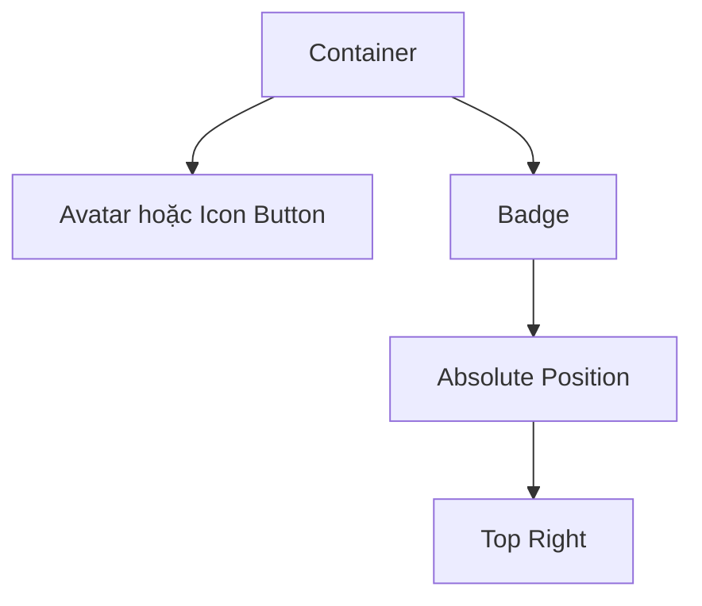
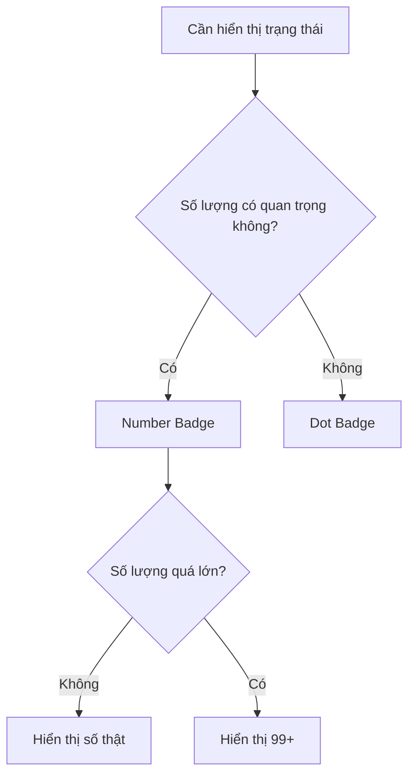

# 043 – Xây dựng Badge Component

## 1. Thông tin bài học

* **Module:** Display & Feedback Components
* **Thời điểm trong video:** `2:52:56`
* **Thành phần:** Badge
* **Mục tiêu:** Xây dựng một thành phần nhỏ dùng để hiển thị số lượng, trạng thái hoặc thông báo trên các thành phần khác.

---

## 2. Badge là gì?

**Badge** là một chỉ báo nhỏ thường được đặt đè lên một thành phần khác nhằm truyền tải nhanh thông tin như:

* Số lượng thông báo chưa đọc
* Số sản phẩm trong giỏ hàng
* Trạng thái hoạt động
* Cảnh báo hoặc lỗi
* Có nội dung mới
* Trạng thái thành công hoặc thông tin

Ví dụ:

```text
Avatar + Badge       Icon Button + Badge       Tab + Badge
     ●                       5                     12
   [👤]                    [🛒]                  [Inbox]
```

Badge không phải là nội dung chính. Nó chỉ đóng vai trò bổ sung thông tin cho một thành phần khác.

---

## 3. Mục đích chính của bài học

Bài học hướng dẫn xây dựng một Badge Component có khả năng tái sử dụng trong Design System, bao gồm:

* Badge hiển thị số
* Badge dạng chấm
* Các biến thể màu theo trạng thái
* Thuộc tính cho phép thay đổi nội dung
* Cách đặt Badge đè lên Avatar, Tab hoặc Icon Button
* Cách đảm bảo Badge luôn giữ được hình tròn

---

## 4. Cấu trúc cơ bản của Badge

Badge dạng số có thể được cấu tạo từ một frame sử dụng Auto Layout và một lớp văn bản bên trong.

```text
Badge
├── Background
└── Count
```

Ví dụ:

```text
┌──────┐
│  12  │
└──────┘
```

Trong Figma:

```text
Frame – Badge
├── Auto Layout: Horizontal
├── Width: 24 px
├── Height: 24 px
├── Alignment: Center
├── Corner Radius: 999 px
└── Text Layer: Count
```

---

## 5. Thiết lập typography

Vì Badge có kích thước nhỏ nên cần sử dụng kiểu chữ dễ đọc ở kích thước nhỏ.

Thiết lập gợi ý:

| Thuộc tính  |      Giá trị tham khảo |
| ----------- | ---------------------: |
| Font size   |                  14 px |
| Font weight |     Bold hoặc Semibold |
| Line height |               16–20 px |
| Alignment   |               Căn giữa |
| Text color  | Màu tương phản với nền |

Trong bài học, kiểu chữ nhỏ khoảng **14 px, in đậm** được sử dụng và liên kết với token typography dành cho nội dung nhỏ.

Ví dụ token:

```text
Typography/Body/Small/Bold
```

Không nên gán trực tiếp font size cho từng Badge nếu Design System đã có text style tương ứng.

---

## 6. Sử dụng Auto Layout

Ban đầu, Badge có thể được thiết lập với Auto Layout:

* Padding ngang: `4 px`
* Padding dọc: `4 px`
* Căn giữa theo cả hai chiều
* Nội dung văn bản đặt ở chế độ `Hug contents`

Tuy nhiên, nếu cả chiều rộng và chiều cao đều để `Hug contents`, Badge có thể không giữ được hình tròn khi nội dung thay đổi.

Ví dụ:

```text
1     → hình tròn
12    → hình bầu dục nhẹ
100   → hình viên thuốc
```

Vì vậy, Badge dạng số đơn hoặc hai chữ số thường được đặt kích thước tối thiểu cố định.

---

## 7. Tại sao sử dụng kích thước 24 × 24 px?

Trong bài học, Badge được thiết lập:

```text
Width: 24 px
Height: 24 px
Corner Radius: 999 px
```

Việc cố định chiều rộng và chiều cao bằng nhau giúp Badge luôn có dạng hình tròn.

```text
24 × 24 px + Radius 999 px = Badge hình tròn
```

### Ưu điểm

* Hình dạng nhất quán
* Dễ đặt lên Avatar hoặc Icon Button
* Dễ căn chỉnh
* Không bị biến dạng với số có một hoặc hai chữ số
* Tạo cảm giác gọn gàng trong giao diện

### Hạn chế

Nếu số lượng quá dài, chẳng hạn `100`, `999` hoặc `1000`, Badge 24 × 24 px sẽ không đủ không gian.

Vì vậy, Design System cần định nghĩa quy tắc hiển thị số lớn, chẳng hạn:

```text
1–9       → hiển thị trực tiếp
10–99     → hiển thị trực tiếp
Từ 100    → hiển thị 99+
```

---

## 8. Liên kết Badge với color token

Màu nền và màu chữ của Badge không nên sử dụng mã màu trực tiếp.

Ví dụ không nên:

```text
Background: #EF4444
Text: #FFFFFF
```

Nên liên kết với semantic token:

```text
Background: Surface/Action
Text: Text/On Action
```

Hoặc:

```text
Background: Icon/Error
Text: Text/On Action
```

Cách này giúp Badge tự động thích ứng khi:

* Thay đổi theme
* Chuyển Light Mode sang Dark Mode
* Điều chỉnh bảng màu thương hiệu
* Cập nhật quy tắc accessibility

---

## 9. Các biến thể trạng thái

Badge có thể có một thuộc tính variant tên là `Status`.

```text
Status:
├── Default
├── Error
├── Warning
├── Info
└── Success
```

### Bảng trạng thái tham khảo

| Status  | Ý nghĩa                    | Token nền gợi ý  |
| ------- | -------------------------- | ---------------- |
| Default | Thông báo chung            | `Surface/Action` |
| Error   | Lỗi hoặc nội dung khẩn cấp | `Icon/Error`     |
| Warning | Cảnh báo                   | `Icon/Warning`   |
| Info    | Thông tin mới              | `Icon/Info`      |
| Success | Thành công hoặc hoàn tất   | `Icon/Success`   |

Sử dụng token `Icon/Error`, `Icon/Warning` hoặc `Icon/Success` làm nền có thể tạo màu mạnh và rõ hơn cho một thành phần nhỏ như Badge.

Trong khi đó, các token `Surface/Error` đôi khi có màu quá nhạt và không tạo đủ độ tương phản.

---

## 10. Đảm bảo độ tương phản

Vì Badge có kích thước nhỏ, nội dung bên trong phải có độ tương phản cao.

Ví dụ:

```text
Nền Error mạnh + Text/On Action
Nền Success mạnh + Text/On Action
Nền Warning + Text/On Warning
```

Không nên sử dụng:

```text
Nền đỏ nhạt + chữ đỏ nhạt
```

Cách kết hợp này có thể phù hợp với Alert hoặc Banner lớn nhưng khó đọc trên Badge nhỏ.

Cần kiểm tra:

* Độ tương phản giữa chữ và nền
* Khả năng đọc ở kích thước 12–14 px
* Light Mode và Dark Mode
* Người dùng có thị lực kém hoặc rối loạn nhận biết màu sắc

---

## 11. Tạo thuộc tính Count

Lớp văn bản bên trong Badge nên được chuyển thành **Text Property**.

Ví dụ:

```text
Property name: Count
Default value: 1
```

Khi sử dụng instance, nhà thiết kế có thể thay đổi nội dung trực tiếp:

```text
Count = 5
Count = 12
Count = 98
Count = 99+
```

### Cấu trúc component property

```text
Badge
├── Status: Default
├── Type: Number
└── Count: "1"
```

Thuộc tính `Count` giúp tránh việc phải detach component chỉ để thay đổi số lượng.

---

## 12. Badge dạng số

Badge dạng số được dùng khi số lượng cụ thể có ý nghĩa đối với người dùng.

Ví dụ:

* 5 thông báo chưa đọc
* 3 sản phẩm trong giỏ hàng
* 12 nhiệm vụ đang chờ
* 2 lỗi cần xử lý

```text
Type = Number

┌────┐
│ 5  │
└────┘
```

Kích thước tham khảo:

```text
Min Width: 24 px
Height: 24 px
Horizontal Padding: 6 px
Radius: 999 px
```

Một cách triển khai linh hoạt hơn là:

* Chiều cao cố định `24 px`
* Chiều rộng tối thiểu `24 px`
* Chiều rộng thực tế `Hug contents`

Khi đó:

```text
5    → hình tròn
12   → gần hình tròn
99+  → hình viên thuốc
```

---

## 13. Badge dạng chấm

Badge dạng chấm được sử dụng khi chỉ cần báo hiệu rằng có điều gì đó mới hoặc cần chú ý, nhưng không cần hiển thị số lượng cụ thể.

Ví dụ:

* Có thông báo mới
* Người dùng đang online
* Có thay đổi chưa xem
* Có lỗi nhưng không cần hiển thị số lỗi

```text
Type = Dot

●
```

Trong bài học, Dot Badge được thiết lập:

```text
Width: 12 px
Height: 12 px
Corner Radius: 999 px
Không có lớp văn bản
```

Cấu trúc:

```text
Badge Dot
└── Background
```

---

## 14. Tạo thuộc tính Type

Tạo một variant property tên là `Type`.

```text
Type:
├── Number
└── Dot
```

Kết hợp với trạng thái:

```text
Badge
├── Type: Number | Dot
└── Status: Default | Error | Warning | Info | Success
```

Ma trận biến thể:

| Type   | Default | Error | Warning | Info | Success |
| ------ | ------: | ----: | ------: | ---: | ------: |
| Number |       ✓ |     ✓ |       ✓ |    ✓ |       ✓ |
| Dot    |       ✓ |     ✓ |       ✓ |    ✓ |       ✓ |

Tổng cộng:

```text
2 Type × 5 Status = 10 Variants
```

---

## 15. Sơ đồ cấu trúc Component Set

```text
Badge Component Set
│
├── Type = Number
│   ├── Status = Default
│   ├── Status = Error
│   ├── Status = Warning
│   ├── Status = Info
│   └── Status = Success
│
└── Type = Dot
    ├── Status = Default
    ├── Status = Error
    ├── Status = Warning
    ├── Status = Info
    └── Status = Success
```

Tên thuộc tính nên được sử dụng nhất quán:

```text
Type=Number, Status=Default
Type=Number, Status=Error
Type=Dot, Status=Success
```

Không nên đặt tên không đồng nhất như:

```text
Default Badge
Red Badge
Small Dot
Information
Success State
```

---

## 16. Quy trình xây dựng trong Figma

### Bước 1: Tạo lớp văn bản

Tạo một text layer với nội dung mẫu:

```text
1
```

Áp dụng text style:

```text
Typography/Body/Small/Bold
```

---

### Bước 2: Thêm Auto Layout

Chọn text layer và nhấn:

```text
Shift + A
```

Thiết lập:

```text
Direction: Horizontal
Alignment: Center
Padding: 4 px
```

---

### Bước 3: Thiết lập kích thước

Đặt frame:

```text
Width: 24 px
Height: 24 px
```

Căn giữa nội dung theo cả hai chiều.

---

### Bước 4: Tạo hình tròn

Đặt:

```text
Corner Radius: 999 px
```

Hoặc sử dụng giá trị bằng một nửa kích thước:

```text
Radius: 12 px
```

---

### Bước 5: Liên kết color token

Ví dụ:

```text
Fill: Surface/Action
Text: Text/On Action
```

---

### Bước 6: Tạo Component

Chọn frame và nhấn:

```text
Ctrl + Alt + K
```

Đặt tên:

```text
Badge
```

---

### Bước 7: Thêm Status Variants

Tạo các trạng thái:

```text
Default
Error
Warning
Info
Success
```

Thay đổi token màu nền tương ứng.

---

### Bước 8: Tạo Text Property

Chọn text layer và tạo thuộc tính:

```text
Count
```

Cho phép thay đổi giá trị trực tiếp từ instance panel.

---

### Bước 9: Tạo Dot Variant

Nhân bản Badge và thực hiện:

```text
Xóa text layer
Width: 12 px
Height: 12 px
```

Đặt thuộc tính:

```text
Type = Dot
```

---

### Bước 10: Kiểm tra tên variant

Xác nhận toàn bộ biến thể được đặt đúng:

```text
Type=Number, Status=Default
Type=Number, Status=Error
Type=Number, Status=Warning
Type=Number, Status=Info
Type=Number, Status=Success

Type=Dot, Status=Default
Type=Dot, Status=Error
Type=Dot, Status=Warning
Type=Dot, Status=Info
Type=Dot, Status=Success
```

---

## 17. Cách đặt Badge đè lên thành phần khác

Badge thường được đặt tại góc trên bên phải của thành phần cha.

Ví dụ với Avatar:

```text
┌────────────────┐
│ Avatar Frame   │
│          ┌───┐ │
│   [👤]   │ 3 │ │
│          └───┘ │
└────────────────┘
```

Trong Figma, có thể sử dụng:

* Absolute Position
* Frame bao ngoài
* Constraints
* Nested Component
* Slot dành cho Badge

### Cấu trúc đề xuất

```text
Avatar with Badge
├── Avatar
└── Badge
```

Thiết lập Badge:

```text
Position: Absolute
Top: -4 px
Right: -4 px
```

Tùy theo kích thước Avatar, khoảng cách có thể được điều chỉnh.

---

## 18. Mẫu định vị overlay



Quy trình hiển thị:

```text
Component cha
    ↓
Tạo vùng chứa tương đối
    ↓
Đặt Badge ở chế độ Absolute Position
    ↓
Gắn vào góc trên bên phải
```

Badge nên nằm bên trong vùng chứa của thành phần cha để khi di chuyển Avatar hoặc Icon Button, Badge cũng di chuyển theo.

---

## 19. Ứng dụng trong Design System thực tế

### 19.1. Avatar

```text
Avatar + Dot Badge
```

Ứng dụng:

* Trạng thái online
* Người dùng đang bận
* Tài khoản có cảnh báo
* Có hoạt động mới

---

### 19.2. Icon Button

```text
Cart Icon + Numeric Badge
```

Ứng dụng:

* Số sản phẩm trong giỏ hàng
* Số thông báo
* Số tin nhắn chưa đọc

---

### 19.3. Tab

```text
Messages  8
```

Ứng dụng:

* Số mục chưa xử lý
* Số nội dung mới
* Số lỗi trong một khu vực

---

### 19.4. Navigation Item

```text
Inbox             12
Drafts             3
Errors              ●
```

Badge có thể được đặt ở cuối navigation item thay vì overlay.

---

## 20. Quy tắc lựa chọn Number và Dot



### Sử dụng Number Badge khi:

* Người dùng cần biết số lượng cụ thể
* Số lượng ảnh hưởng đến quyết định
* Cần thể hiện tiến độ xử lý

### Sử dụng Dot Badge khi:

* Chỉ cần thu hút sự chú ý
* Số lượng không quan trọng
* Muốn giảm nhiễu thị giác
* Không có đủ không gian để hiển thị số

---

## 21. Quy tắc giới hạn số

Design System nên định nghĩa trước cách Badge xử lý giá trị lớn.

Ví dụ:

|   Giá trị thật | Giá trị hiển thị |
| -------------: | ---------------- |
|              0 | Ẩn Badge         |
|           1–99 | Hiển thị số thật |
|    100 trở lên | `99+`            |
| Không xác định | Dot Badge        |

Quy tắc:

```text
count = 0       → hidden
count = 1–99    → count
count >= 100    → 99+
```

Điều này giúp tránh Badge trở nên quá rộng hoặc phá vỡ bố cục.

---

## 22. Những rủi ro và hạn chế

### 22.1. Mã hóa cứng kích thước

Kích thước `24 × 24 px` giúp Badge tròn nhưng có thể không chứa được số dài.

Giải pháp:

```text
Height: Fixed 24 px
Min Width: 24 px
Width: Hug contents
```

---

### 22.2. Phụ thuộc quá nhiều vào màu sắc

Nếu chỉ sử dụng màu đỏ, vàng hoặc xanh để truyền tải trạng thái, người dùng gặp khó khăn trong việc phân biệt màu có thể không hiểu ý nghĩa.

Giải pháp:

* Kết hợp Badge với ngữ cảnh
* Sử dụng icon khi cần
* Thêm accessible label trong code
* Không dùng màu làm dấu hiệu duy nhất

---

### 22.3. Màu semantic không đủ tương phản

Một số token bề mặt được thiết kế cho Alert lớn có thể quá nhạt khi áp dụng cho Badge.

Giải pháp:

* Sử dụng token màu mạnh hơn
* Tạo token riêng cho Badge
* Kiểm tra tương phản trước khi phát hành

Ví dụ:

```text
Badge/Error/Background
Badge/Error/Foreground
```

---

### 22.4. Badge che mất nội dung

Nếu Badge quá lớn hoặc đặt sai vị trí, nó có thể che icon hoặc Avatar.

Giải pháp:

* Xác định offset theo từng kích thước
* Kiểm tra trên Avatar nhỏ, vừa và lớn
* Không dùng một vị trí cố định cho mọi component

---

### 22.5. Quá nhiều Badge trên giao diện

Nếu mọi mục đều có Badge, người dùng sẽ khó nhận biết đâu là thông tin quan trọng.

Badge nên được dùng có chọn lọc cho:

* Thông tin mới
* Tác vụ chưa hoàn tất
* Lỗi cần xử lý
* Trạng thái cần chú ý

---

### 22.6. Nội dung không được cập nhật

Badge hiển thị số lượng không chính xác có thể làm giảm niềm tin của người dùng.

Ví dụ:

```text
Badge hiển thị 5 nhưng danh sách không có nội dung mới.
```

Khi triển khai trong code, Badge phải được liên kết với nguồn dữ liệu đáng tin cậy và cập nhật đúng thời điểm.

---

## 23. Đề xuất token cho Badge

```text
Badge/
├── Default/
│   ├── Background
│   └── Foreground
├── Error/
│   ├── Background
│   └── Foreground
├── Warning/
│   ├── Background
│   └── Foreground
├── Info/
│   ├── Background
│   └── Foreground
└── Success/
    ├── Background
    └── Foreground
```

Token kích thước:

```text
Size/Badge/Dot       = 12
Size/Badge/Default   = 24
Radius/Badge         = Full
Spacing/Badge/X      = 6
```

Typography:

```text
Typography/Badge/Label
```

---

## 24. Cấu hình Component Property đề xuất

| Property   | Loại    | Giá trị                                |
| ---------- | ------- | -------------------------------------- |
| Type       | Variant | Number, Dot                            |
| Status     | Variant | Default, Error, Warning, Info, Success |
| Size       | Variant | Small, Medium                          |
| Count      | Text    | 1, 12, 99+                             |
| Show Badge | Boolean | True, False                            |

Một hệ thống nâng cao có thể sử dụng:

```text
Badge
├── Type
├── Status
├── Size
├── Count
└── Show Badge
```

Tuy nhiên, không nên tạo quá nhiều thuộc tính nếu sản phẩm chưa thực sự cần đến chúng.

---

## 25. Checklist kiểm tra Badge Component

* [ ] Badge dạng số có thể thay đổi nội dung
* [ ] Badge dạng chấm không chứa text layer
* [ ] Chiều rộng và chiều cao phù hợp
* [ ] Badge giữ được hình tròn với số ngắn
* [ ] Có quy tắc xử lý giá trị từ 100 trở lên
* [ ] Các màu được liên kết với semantic token
* [ ] Màu chữ có đủ độ tương phản
* [ ] Có đầy đủ Default, Error, Warning, Info và Success
* [ ] Variant được đặt tên nhất quán
* [ ] Badge hoạt động khi đặt lên Avatar
* [ ] Badge hoạt động khi đặt lên Icon Button
* [ ] Badge không che nội dung chính
* [ ] Đã kiểm tra Light Mode và Dark Mode
* [ ] Có quy tắc ẩn Badge khi giá trị bằng 0
* [ ] Có thông tin hỗ trợ accessibility khi triển khai trong code

---

# Trả lời câu hỏi ôn tập

## Câu 1: Mục đích chính của Build a Badge là gì?

Mục đích chính là xây dựng một thành phần nhỏ dùng để hiển thị số lượng hoặc trạng thái trên các thành phần như Avatar, Tab, Icon Button và Navigation Item.

Badge giúp người dùng nhanh chóng nhận biết:

* Có thông báo mới hay không
* Có bao nhiêu mục cần xử lý
* Một đối tượng đang ở trạng thái nào
* Có lỗi, cảnh báo hoặc thông tin mới hay không

---

## Câu 2: Áp dụng bài học vào một Figma Design System thực tế như thế nào?

Trong Design System thực tế, Badge nên được tạo thành một Component Set với các thuộc tính:

```text
Type = Number | Dot
Status = Default | Error | Warning | Info | Success
Count = Text Property
```

Badge cần liên kết với:

* Color token
* Typography token
* Spacing token
* Radius token

Sau đó, Badge có thể được sử dụng dưới dạng nested component trong Avatar, Tab, Icon Button hoặc Navigation Item.

---

## Câu 3: Các bước và ý tưởng quan trọng trong bài học là gì?

Các bước chính gồm:

1. Tạo lớp văn bản cho số lượng.
2. Áp dụng text style nhỏ và đậm.
3. Thêm Auto Layout.
4. Thiết lập Badge khoảng `24 × 24 px`.
5. Dùng corner radius lớn để tạo hình tròn.
6. Liên kết nền và chữ với semantic token.
7. Tạo các trạng thái Default, Error, Warning, Info và Success.
8. Chuyển lớp số thành Text Property.
9. Tạo biến thể Dot kích thước khoảng `12 × 12 px`.
10. Sử dụng Absolute Position để đặt Badge đè lên thành phần khác.

---

## Câu 4: Rủi ro hoặc hạn chế cần lưu ý là gì?

Rủi ro chính là kích thước cố định có thể không đủ cho số lượng lớn. Ngoài ra, Badge có thể khó đọc nếu màu không đủ tương phản hoặc bị lạm dụng quá nhiều trong giao diện.

Cần có quy tắc rõ ràng cho:

* Giá trị bằng 0
* Giá trị từ 100 trở lên
* Badge dạng số và dạng chấm
* Vị trí overlay
* Màu sắc trong Light Mode và Dark Mode
* Accessibility

---

# Tổng kết

Badge là một thành phần nhỏ nhưng quan trọng trong nhóm **Display & Feedback Components**. Một Badge tốt cần đảm bảo:

* Nhỏ gọn
* Dễ đọc
* Có độ tương phản cao
* Được liên kết với token
* Có biến thể số và dấu chấm
* Có các trạng thái semantic
* Dễ đặt lên những thành phần khác
* Có quy tắc xử lý số lượng lớn

Cấu trúc đề xuất cuối cùng:

```text
Badge
├── Type
│   ├── Number
│   └── Dot
├── Status
│   ├── Default
│   ├── Error
│   ├── Warning
│   ├── Info
│   └── Success
└── Count
```

Badge hoàn chỉnh sẽ trở thành một building block có thể tái sử dụng cho Avatar, Tab, Icon Button, Navigation và nhiều thành phần phản hồi khác trong Design System.

---

# Bài luyện tập

## Mục tiêu


## Đề bài


## Yêu cầu hoàn thành

- [ ] 
- [ ] 
- [ ] 

## Kết quả / lời giải


## Ghi chú
