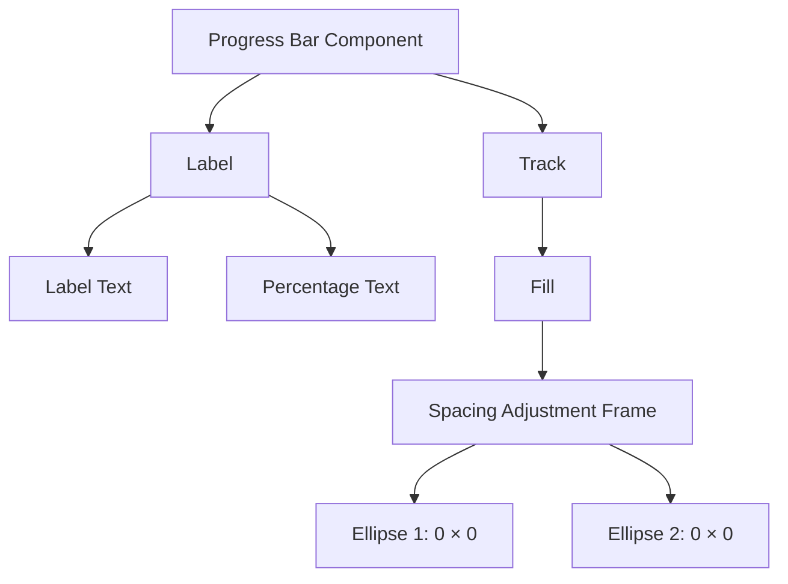
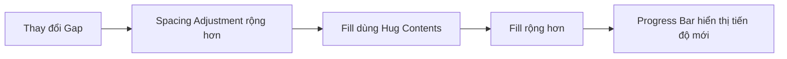
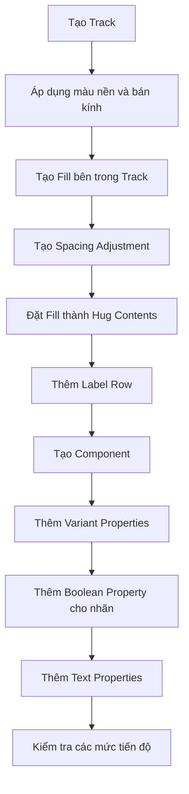

# 044 – Xây dựng Progress Bar

## 1. Thông tin bài học

| Mục                       | Nội dung                                                                                      |
| ------------------------- | --------------------------------------------------------------------------------------------- |
| **Module**                | Display & Feedback Components                                                                 |
| **Tên tiếng Việt**        | Thành phần hiển thị và phản hồi                                                               |
| **Thời điểm trong video** | 2:56:23                                                                                       |
| **Chủ đề chính**          | Xây dựng thanh tiến trình tuyến tính với phần nền, phần tiến trình và các biến thể trạng thái |

---

## 2. Mục tiêu bài học

Bài học hướng dẫn xây dựng một **Progress Bar** trong Figma để thể hiện mức độ hoàn thành của một tác vụ, quá trình tải hoặc quy trình nhiều bước.

Thành phần được thiết kế với:

* Phần nền của thanh tiến trình — `Track`
* Phần biểu thị tiến độ — `Fill`
* Chiều rộng tiến độ có thể điều chỉnh
* Biến thể xác định và không xác định
* Nhãn mô tả trạng thái hoàn thành
* Các thuộc tính component để tái sử dụng linh hoạt

---

## 3. Progress Bar là gì?

**Progress Bar** là thành phần trực quan dùng để biểu diễn mức độ hoàn thành của một quá trình.

Ví dụ:

* Tải tệp lên hệ thống
* Cài đặt phần mềm
* Hoàn thành hồ sơ người dùng
* Tiến độ học tập
* Hoàn thành bài kiểm tra
* Thực hiện quy trình thanh toán

Ví dụ hiển thị:

```text
Hoàn thành
████████████████░░░░ 80%
```

---

## 4. Cấu trúc của Progress Bar

Một Progress Bar cơ bản gồm hai lớp chính:

```text
Progress Bar
└── Track
    └── Fill
```

Trong đó:

* **Track** là phần nền thể hiện toàn bộ phạm vi tiến trình.
* **Fill** là phần màu nổi bật thể hiện mức độ đã hoàn thành.

### Sơ đồ cấu trúc mở rộng



---

## 5. Các khái niệm quan trọng

### 5.1. Track và Fill

Thanh tiến trình được xây dựng bằng cách đặt phần `Fill` bên trong phần `Track`.

```text
Track: ┌──────────────────────────────┐
Fill:  ├──────────────────────┤
       └──────────────────────────────┘
```

Ví dụ với tiến độ 70%:

```text
█████████████████████░░░░░░░░░ 70%
```

Track thường sử dụng màu nền nhẹ, trong khi Fill sử dụng màu hành động hoặc màu thương hiệu nổi bật.

---

### 5.2. Determinate Progress

**Determinate Progress** được sử dụng khi hệ thống biết chính xác mức độ hoàn thành.

Ví dụ:

```text
25%  █████░░░░░░░░░░░
50%  ██████████░░░░░░
80%  ████████████████░░░░
100% ████████████████████
```

Các trường hợp sử dụng:

* Đã tải lên 4 trong 5 tệp
* Hoàn thành 80% hồ sơ
* Đã xem 6 trong 10 bài học
* Đang cài đặt ở mức 45%

---

### 5.3. Indeterminate Progress

**Indeterminate Progress** được sử dụng khi hệ thống chưa thể xác định chính xác thời gian hoặc mức độ hoàn thành.

Ví dụ:

```text
░░░░██████░░░░░░░░░░
```

Phần Fill thường chuyển động từ trái sang phải để cho người dùng biết hệ thống vẫn đang xử lý.

Các trường hợp sử dụng:

* Đang kết nối máy chủ
* Đang tìm kiếm dữ liệu
* Đang chuẩn bị tài nguyên
* Đang xử lý yêu cầu nhưng chưa biết thời gian hoàn thành

---

## 6. Các bước xây dựng Progress Bar trong Figma

## Bước 1: Tạo Track

Tạo một hình chữ nhật với kích thước ban đầu:

```text
Width: 200 px
Height: 8 px
```

Có thể sử dụng chiều cao nhỏ hơn nếu muốn thiết kế thanh mảnh:

```text
Width: 200 px
Height: 4 px
```

Thiết lập:

* Fill: màu nền nhẹ
* Corner radius: dạng tròn hoàn toàn
* Tên layer: `Track` hoặc `Progress Track`

Ví dụ token:

```text
background/action-hover-light
```

Không nên nhập màu trực tiếp nếu hệ thống đã có design token.

---

## Bước 2: Tạo Fill

Tạo một hình chữ nhật nằm bên trong Track.

Thiết lập:

* Chiều cao bằng Track
* Chiều rộng phụ thuộc vào mức tiến độ
* Corner radius giống Track
* Fill sử dụng màu hành động hoặc màu thương hiệu
* Tên layer: `Fill` hoặc `Progress Fill`

Ví dụ:

```text
Track width: 200 px
Progress: 80%
Fill width: 160 px
```

Công thức:

```text
Fill width = Track width × Progress percentage
```

Ví dụ:

```text
200 × 80% = 160 px
```

---

## Bước 3: Tạo khung điều chỉnh khoảng cách

Bài học sử dụng một thủ thuật Figma giúp thay đổi chiều rộng Fill trên instance mà không phải detach component.

Các bước:

1. Tạo hai hình ellipse.
2. Đặt kích thước của cả hai ellipse thành:

```text
Width: 0 px
Height: 0 px
```

3. Đặt hai ellipse vào một Auto Layout frame.
4. Đặt khoảng cách giữa hai ellipse bằng chiều rộng mong muốn.
5. Đặt tên frame:

```text
Spacing Adjustment
```

6. Đặt frame này bên trong Fill.
7. Đặt chiều rộng Fill thành `Hug contents`.

Cấu trúc:

```text
Fill
└── Spacing Adjustment
    ├── Ellipse: 0 × 0
    └── Ellipse: 0 × 0
```

Khoảng cách giữa hai ellipse sẽ quyết định chiều rộng của Fill.

---

## 7. Vì sao sử dụng thủ thuật Spacing Adjustment?

Thông thường, khi một layer nằm trong component, việc thay đổi chiều rộng của layer trên instance có thể bị hạn chế.

Khung `Spacing Adjustment` giúp chuyển việc điều chỉnh chiều rộng thành việc điều chỉnh giá trị `Gap`.

Ví dụ:

```text
Gap = 50 px  → Fill width ≈ 50 px
Gap = 100 px → Fill width ≈ 100 px
Gap = 150 px → Fill width ≈ 150 px
Gap = 200 px → Fill width ≈ 200 px
```

Nhờ đó, người thiết kế có thể thay đổi tiến độ trực tiếp trên instance mà không cần:

* Detach component
* Chỉnh sửa main component
* Tạo hàng chục variant phần trăm
* Ghi đè cấu trúc component

### Luồng hoạt động



---

## 8. Tính toán chiều rộng theo phần trăm

Giả sử Track có chiều rộng `200 px`.

| Tiến độ |  Công thức | Chiều rộng Fill |
| ------: | ---------: | --------------: |
|      0% |    200 × 0 |            0 px |
|     25% | 200 × 0.25 |           50 px |
|     50% |  200 × 0.5 |          100 px |
|     75% | 200 × 0.75 |          150 px |
|     80% |  200 × 0.8 |          160 px |
|    100% |    200 × 1 |          200 px |

### Công thức tổng quát

```text
Fill width = Track width × Percentage / 100
```

Ví dụ với Track rộng `320 px` và tiến độ `65%`:

```text
320 × 65 / 100 = 208 px
```

---

## 9. Thêm nhãn cho Progress Bar

Progress Bar có thể đi kèm nhãn để cung cấp thêm thông tin.

Ví dụ:

```text
Hoàn thành                          80%
████████████████░░░░
```

Nhãn có thể bao gồm:

* Tên trạng thái
* Phần trăm hoàn thành
* Số lượng đã hoàn thành
* Thời gian còn lại
* Thông báo đang xử lý

Ví dụ:

```text
Đang tải tệp                       4/5
████████████████░░░░
```

Hoặc:

```text
Hoàn thành hồ sơ                   80%
████████████████░░░░
```

---

## 10. Cấu trúc Auto Layout đề xuất

```text
Progress Bar
├── Label Row
│   ├── Status Label
│   └── Percentage Label
└── Track
    └── Fill
        └── Spacing Adjustment
            ├── Ellipse 1
            └── Ellipse 2
```

Thiết lập Auto Layout cho component ngoài:

```text
Direction: Vertical
Width: Fill container hoặc Fixed
Height: Hug contents
Gap: 6–8 px
```

Thiết lập cho `Label Row`:

```text
Direction: Horizontal
Width: Fill container
Height: Hug contents
Spacing mode: Space between
```

---

## 11. Tạo Component Properties

Sau khi hoàn thiện cấu trúc, chuyển Progress Bar thành component.

Các thuộc tính nên thêm:

### 11.1. Boolean Property cho nhãn

Cho phép bật hoặc tắt phần nhãn.

```text
Show label: True / False
```

Ví dụ:

```text
Show label = True

Hoàn thành                          80%
████████████████░░░░
```

```text
Show label = False

████████████████░░░░
```

---

### 11.2. Text Property cho nhãn

Cho phép thay đổi nội dung nhãn trên từng instance.

```text
Label: Hoàn thành
Percentage: 80%
```

Một số nội dung khác:

```text
Đang tải
Đang cài đặt
Đang xử lý
Đã hoàn thành
Đã tải lên
Đang đồng bộ
```

---

### 11.3. Variant Property cho kích thước

Có thể tạo hai kích thước:

```text
Size = Thin
Size = Regular
```

Ví dụ:

| Kích thước | Chiều cao |
| ---------- | --------: |
| Thin       |      4 px |
| Regular    |      8 px |

Không nên tạo quá nhiều kích thước nếu sản phẩm không thực sự cần.

---

### 11.4. Variant Property cho trạng thái

```text
Type = Determinate
Type = Indeterminate
```

Hoặc mở rộng:

```text
State = Default
State = Success
State = Warning
State = Error
```

---

## 12. Design Token đề xuất

Progress Bar nên sử dụng token thay vì giá trị màu trực tiếp.

### Token màu sắc

```text
progress/track/default
progress/fill/default
progress/fill/success
progress/fill/warning
progress/fill/error
```

### Token kích thước

```text
progress/height/thin
progress/height/regular
progress/radius
```

### Token khoảng cách

```text
progress/label-gap
progress/content-gap
```

### Ví dụ ánh xạ token

| Thành phần       | Token                              |
| ---------------- | ---------------------------------- |
| Track background | `color.surface.action-hover-light` |
| Fill mặc định    | `color.action.primary`             |
| Fill thành công  | `color.feedback.success`           |
| Fill cảnh báo    | `color.feedback.warning`           |
| Fill lỗi         | `color.feedback.error`             |
| Label            | `color.text.secondary`             |
| Percentage       | `color.text.primary`               |

---

## 13. Bộ variant đề xuất

Một bộ component có thể được tổ chức như sau:

```text
Progress Bar
├── Type
│   ├── Determinate
│   └── Indeterminate
├── Size
│   ├── Thin
│   └── Regular
├── Status
│   ├── Default
│   ├── Success
│   ├── Warning
│   └── Error
└── Show label
    ├── True
    └── False
```

Không nhất thiết phải kết hợp tất cả các thuộc tính thành variant nếu điều đó tạo ra quá nhiều tổ hợp.

Ví dụ:

```text
2 Types × 2 Sizes × 4 Statuses × 2 Label States
= 32 variants
```

Trong trường hợp này, nên sử dụng kết hợp:

* Variant Property
* Boolean Property
* Text Property
* Nested Component
* Variables

để giảm số lượng variant.

---

## 14. Ứng dụng trong Design System thực tế

Trong một Design System thực tế, Progress Bar nên được chuẩn hóa để sử dụng nhất quán trên nhiều màn hình.

### Ví dụ: tải tệp

```text
Đang tải lên                       65%
█████████████░░░░░░░
```

### Ví dụ: tiến độ học tập

```text
Đã hoàn thành 8/10 bài học         80%
████████████████░░░░
```

### Ví dụ: hoàn thiện hồ sơ

```text
Mức độ hoàn thiện hồ sơ            40%
████████░░░░░░░░░░░░
```

### Ví dụ: trạng thái thành công

```text
Tải lên hoàn tất                  100%
████████████████████
```

### Ví dụ: trạng thái lỗi

```text
Tải lên thất bại                   70%
██████████████░░░░░░
```

Trong trường hợp lỗi, cần có thông báo giải thích và hành động thử lại, thay vì chỉ đổi màu Progress Bar.

---

## 15. Quy trình xây dựng tổng quát



---

## 16. Các bước kiểm tra component

Sau khi tạo Progress Bar, cần kiểm tra các trường hợp:

### Kiểm tra tiến độ

```text
0%
25%
50%
75%
100%
```

### Kiểm tra kích thước

```text
Thin
Regular
```

### Kiểm tra nhãn

```text
Không có nhãn
Có nhãn ngắn
Có nhãn dài
Phần trăm 1 chữ số
Phần trăm 3 chữ số
```

### Kiểm tra chiều rộng

```text
200 px
320 px
Fill container
```

### Kiểm tra ngôn ngữ

```text
80% Complete
Hoàn thành 80%
80 % terminé
```

Nội dung ở các ngôn ngữ khác nhau có thể dài hơn và ảnh hưởng đến bố cục.

---

## 17. Rủi ro và hạn chế

### 17.1. Điều chỉnh Fill bằng giá trị thủ công

Thủ thuật `Spacing Adjustment` giúp chỉnh chiều rộng linh hoạt trong Figma, nhưng người thiết kế vẫn phải tự tính chiều rộng tương ứng với phần trăm.

Ví dụ:

```text
80% của 200 px = 160 px
```

Nếu nhập sai giá trị, nhãn và thanh tiến trình có thể không đồng nhất.

```text
Nhãn: 80%
Fill thực tế: 65%
```

---

### 17.2. Không tự động liên kết với dữ liệu

Component trong Figma chỉ mô phỏng trạng thái giao diện. Nó không tự động nhận phần trăm từ hệ thống.

Trong sản phẩm thật, lập trình viên cần truyền giá trị:

```text
progress = 0.8
```

Sau đó tính:

```text
fillWidth = containerWidth × progress
```

---

### 17.3. Quá nhiều variant

Nếu tạo variant cho từng mức tiến độ:

```text
0%, 10%, 20%, 30%, ..., 100%
```

component set sẽ trở nên lớn và khó bảo trì.

Nên ưu tiên một cơ chế điều chỉnh linh hoạt thay vì tạo variant cho từng phần trăm.

---

### 17.4. Không nên chỉ dùng màu sắc

Người dùng gặp khó khăn trong việc phân biệt màu có thể không nhận ra sự khác biệt giữa:

* Thành công
* Cảnh báo
* Lỗi

Do đó, cần kết hợp thêm:

* Nhãn văn bản
* Phần trăm
* Biểu tượng
* Thông báo mô tả

---

### 17.5. Indeterminate Progress cần animation

Nếu trạng thái không xác định chỉ hiển thị một thanh tĩnh, người dùng có thể tưởng ứng dụng đã bị treo.

Trong prototype hoặc sản phẩm thật, nên tạo chuyển động liên tục cho phần Fill.

---

### 17.6. Không lạm dụng Progress Bar

Không nên sử dụng Progress Bar cho các tác vụ diễn ra gần như tức thì.

Việc hiển thị rồi biến mất quá nhanh có thể tạo cảm giác giao diện bị nhấp nháy.

Với tác vụ rất ngắn, có thể không cần trạng thái tải hoặc chỉ sử dụng phản hồi nhẹ trên nút.

---

## 18. Câu hỏi ôn tập

### Câu 1: Mục đích chính của bài học là gì?

Mục đích chính là xây dựng một Progress Bar tuyến tính có thể tái sử dụng trong Figma, bao gồm Track, Fill, nhãn và các biến thể trạng thái.

Component giúp biểu diễn mức độ hoàn thành của một quá trình theo cách nhất quán trong Design System.

---

### Câu 2: Áp dụng bài học vào Design System thực tế như thế nào?

Có thể áp dụng bằng cách:

1. Xây dựng Track và Fill từ design token.
2. Chuẩn hóa chiều cao, màu sắc và bán kính.
3. Tạo biến thể Determinate và Indeterminate.
4. Thêm thuộc tính bật hoặc tắt nhãn.
5. Thêm thuộc tính văn bản cho tên trạng thái và phần trăm.
6. Sử dụng cùng component cho tải tệp, tiến độ học tập, hồ sơ và quy trình nhiều bước.
7. Viết tài liệu quy định rõ khi nào nên sử dụng từng trạng thái.

---

### Câu 3: Các bước và ý tưởng quan trọng được trình bày là gì?

Các ý tưởng chính gồm:

* Tạo cấu trúc Track và Fill.
* Sử dụng Auto Layout.
* Thiết lập bán kính tròn nhất quán.
* Dùng hai ellipse kích thước `0 × 0` để tạo khung điều chỉnh khoảng cách.
* Đặt Fill thành `Hug contents`.
* Điều chỉnh chiều rộng tiến độ thông qua giá trị gap.
* Thêm nhãn và phần trăm.
* Tạo component properties cho nhãn.
* Cân nhắc kích thước thanh 4 px hoặc 8 px.

---

### Câu 4: Rủi ro hoặc hạn chế cần lưu ý là gì?

Các rủi ro chính gồm:

* Chiều rộng Fill và phần trăm có thể không khớp nhau.
* Component Figma không tự động nhận dữ liệu thật.
* Thủ thuật điều chỉnh gap vẫn yêu cầu tính toán thủ công.
* Tạo quá nhiều variant làm component khó bảo trì.
* Không nên chỉ dùng màu sắc để truyền đạt trạng thái.
* Indeterminate Progress cần animation để người dùng hiểu hệ thống vẫn hoạt động.
* Progress Bar không phù hợp với mọi tác vụ tải.

---

## 19. Checklist hoàn thiện Progress Bar

* [ ] Track sử dụng design token
* [ ] Fill sử dụng design token
* [ ] Track và Fill có cùng corner radius
* [ ] Fill không vượt quá chiều rộng Track
* [ ] Có trạng thái Determinate
* [ ] Có trạng thái Indeterminate
* [ ] Có thể bật hoặc tắt nhãn
* [ ] Nội dung nhãn có thể chỉnh sửa
* [ ] Phần trăm có thể chỉnh sửa
* [ ] Có kích thước Thin hoặc Regular nếu cần
* [ ] Kiểm tra các mức 0%, 50% và 100%
* [ ] Kiểm tra nội dung nhãn dài
* [ ] Kiểm tra khả năng tiếp cận
* [ ] Có hướng dẫn sử dụng trong Design System

---

## 20. Tóm tắt bài học

Bài học xây dựng một **Progress Bar tuyến tính** gồm phần nền `Track` và phần tiến độ `Fill`.

Điểm đáng chú ý nhất là kỹ thuật sử dụng:

```text
Auto Layout
+ hai ellipse 0 × 0
+ khoảng cách giữa các ellipse
+ Fill sử dụng Hug Contents
```

Kỹ thuật này cho phép thay đổi chiều rộng Fill trên các instance mà không cần phá vỡ component.

Progress Bar sau đó được mở rộng với:

* Nhãn trạng thái
* Phần trăm hoàn thành
* Boolean Property để ẩn hoặc hiện nhãn
* Text Property để chỉnh sửa nội dung
* Biến thể độ dày
* Trạng thái Determinate và Indeterminate

Đây là một thành phần quan trọng trong nhóm **Display & Feedback Components**, giúp người dùng biết hệ thống đang xử lý đến đâu và còn bao nhiêu công việc chưa hoàn thành.

---

# Bài luyện tập

## Mục tiêu


## Đề bài


## Yêu cầu hoàn thành

- [ ] 
- [ ] 
- [ ] 

## Kết quả / lời giải


## Ghi chú
