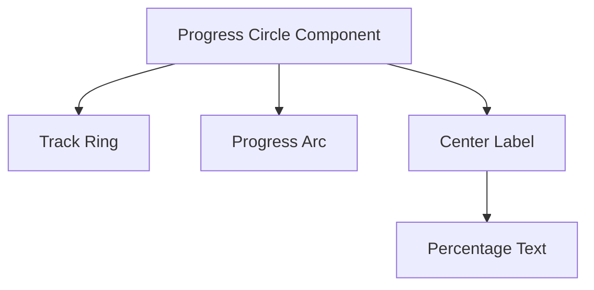
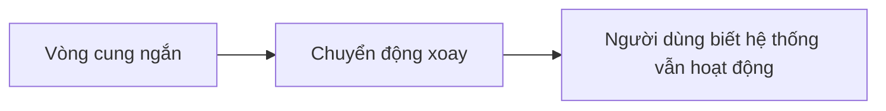
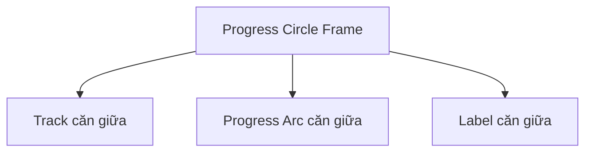
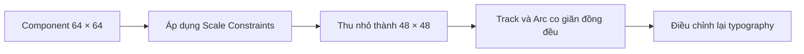
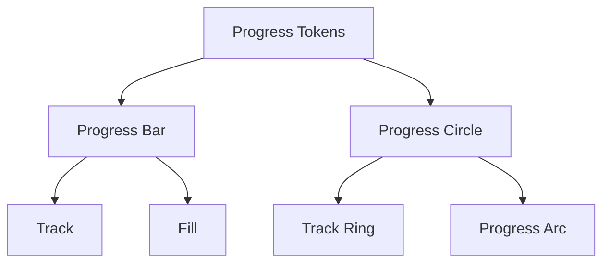
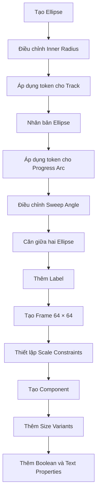

# 045 – Xây dựng Progress Circle

## 1. Thông tin bài học

| Mục                       | Nội dung                                                                                |
| ------------------------- | --------------------------------------------------------------------------------------- |
| **Module**                | Display & Feedback Components                                                           |
| **Tên tiếng Việt**        | Thành phần hiển thị và phản hồi                                                         |
| **Thời điểm trong video** | 2:59:50                                                                                 |
| **Chủ đề chính**          | Xây dựng thanh tiến trình hình tròn bằng các hình ellipse và thuộc tính Arc trong Figma |
| **Thành phần liên quan**  | Progress Bar, Loader, Label                                                             |

---

## 2. Mục tiêu bài học

Bài học hướng dẫn xây dựng một **Progress Circle**, hay còn gọi là **Circular Progress** hoặc **Progress Ring**, để biểu diễn tiến độ theo dạng vòng tròn.

Sau bài học, chúng ta có thể:

* Tạo phần nền và phần tiến độ của vòng tròn.
* Điều chỉnh mức tiến độ bằng thuộc tính Arc trong Figma.
* Xây dựng trạng thái xác định và không xác định.
* Thêm số phần trăm vào giữa vòng tròn.
* Tạo các biến thể kích thước như `64 × 64` và `48 × 48`.
* Dùng chung design token với Progress Bar.
* Thêm Component Properties để bật, tắt và chỉnh sửa nhãn.

---

## 3. Progress Circle là gì?

**Progress Circle** là thành phần thể hiện mức độ hoàn thành của một quá trình bằng một vòng cung chạy quanh hình tròn.

Ví dụ:

```text
       ╭──────╮
    ╭──╯ 80%  ╰──╮
    ╰────────────╯
```

Progress Circle thường được sử dụng trong:

* Tiến độ hoàn thiện hồ sơ.
* Tiến độ tải tệp.
* Tiến độ học tập.
* Điểm hoàn thành nhiệm vụ.
* Bảng điều khiển thống kê.
* Đồng hồ đếm ngược.
* Trạng thái xử lý dữ liệu.
* Thành phần Loader hình tròn.

---

## 4. Progress Circle và Progress Bar

Progress Circle là phiên bản hướng tâm của Progress Bar.

| Progress Bar                      | Progress Circle                    |
| --------------------------------- | ---------------------------------- |
| Hiển thị tiến độ theo chiều ngang | Hiển thị tiến độ theo vòng tròn    |
| Phù hợp với nội dung rộng         | Phù hợp với khu vực nhỏ gọn        |
| Dễ hiển thị nhãn dài              | Thường chỉ hiển thị phần trăm      |
| Thể hiện tiến trình tuyến tính    | Thể hiện tiến trình hướng tâm      |
| Sử dụng Track và Fill             | Sử dụng Track Ring và Progress Arc |

Hai component nên sử dụng chung hệ thống token về:

* Màu Track.
* Màu tiến độ.
* Trạng thái thành công.
* Trạng thái cảnh báo.
* Trạng thái lỗi.
* Độ dày của đường tiến trình.

---

## 5. Cấu trúc của Progress Circle

Progress Circle cơ bản gồm ba phần:

```text
Progress Circle
├── Track
├── Progress Arc
└── Label
```

Trong đó:

* **Track** là vòng tròn nền, biểu thị toàn bộ phạm vi tiến trình.
* **Progress Arc** là vòng cung thể hiện phần đã hoàn thành.
* **Label** là phần văn bản ở giữa, chẳng hạn `80%`.

### Sơ đồ cấu trúc



### Mô hình phân lớp

```text
┌─────────────────────────────┐
│ Progress Circle Frame       │
│                             │
│       Progress Arc          │
│       ┌───────────┐         │
│     ╱               ╲       │
│    │      80%        │      │
│     ╲               ╱       │
│       └───────────┘         │
│          Track              │
└─────────────────────────────┘
```

---

## 6. Determinate và Indeterminate

## 6.1. Determinate Progress

**Determinate** được sử dụng khi hệ thống biết chính xác mức độ hoàn thành.

Ví dụ:

```text
25%
50%
80%
100%
```

Các trường hợp phù hợp:

* Đã tải lên 8 trong 10 tệp.
* Đã hoàn thành 80% hồ sơ.
* Đã học 6 trong 10 bài.
* Quá trình cài đặt đạt 45%.

Trong Figma, mức tiến độ được thể hiện bằng cách điều chỉnh độ dài của vòng cung.

---

## 6.2. Indeterminate Progress

**Indeterminate** được sử dụng khi hệ thống đang xử lý nhưng chưa biết chính xác mức độ hoặc thời gian hoàn thành.

Ví dụ:

```text
Đang xử lý...
```

Thành phần này thường được hiển thị như một vòng cung ngắn quay liên tục.



Progress Circle dạng Indeterminate có thể được dùng như một **Loader**.

Tuy nhiên, trong Design System nên xác định rõ:

* `Progress Circle` biểu thị mức tiến độ.
* `Loader` biểu thị trạng thái đang xử lý.
* Hai component có thể dùng chung cấu trúc nhưng khác mục đích sử dụng.

---

## 7. Các bước xây dựng Progress Circle trong Figma

## Bước 1: Tạo vòng tròn nền

Sử dụng công cụ **Ellipse** để tạo một hình tròn.

Kích thước đề xuất:

```text
Width: 64 px
Height: 64 px
```

Giữ phím `Shift` khi vẽ để đảm bảo chiều rộng và chiều cao bằng nhau.

Đặt tên layer:

```text
Track
```

---

## Bước 2: Chuyển hình tròn thành dạng vòng

Sau khi tạo ellipse, sử dụng thuộc tính **Arc** trong Figma.

Điều chỉnh:

* `Inner radius` để tạo phần rỗng ở giữa.
* `Start` để xác định điểm bắt đầu.
* `Sweep` để xác định độ dài vòng cung.

Ví dụ:

```text
Outer size: 64 px
Inner radius: 75%
```

Kết quả là một vòng tròn rỗng ở giữa thay vì một hình tròn đặc.

```text
Hình tròn đặc       Vòng tròn sau khi chỉnh Inner radius

    ●                         ◯
```

---

## Bước 3: Áp dụng màu cho Track

Track nên sử dụng màu nền nhẹ, giống với Track của Progress Bar.

Ví dụ token:

```text
color/progress/track
```

Hoặc:

```text
surface/action-hover-light
```

Màu Track không nên quá nổi bật vì vai trò chính là thể hiện phần tiến độ chưa hoàn thành.

---

## Bước 4: Nhân bản ellipse để tạo Progress Arc

Sao chép ellipse Track và đặt bản sao lên phía trên.

Cấu trúc:

```text
Progress Circle
├── Progress Arc
└── Track
```

Đặt tên layer phía trên:

```text
Progress
```

Hoặc:

```text
Progress Arc
```

Áp dụng màu hành động hoặc màu thương hiệu:

```text
color/progress/fill
```

---

## Bước 5: Điều chỉnh mức tiến độ

Chọn `Progress Arc` và điều chỉnh các tay cầm của Arc.

Các thuộc tính quan trọng:

* **Start angle:** Điểm bắt đầu của vòng cung.
* **Sweep angle:** Độ dài của vòng cung.
* **Inner radius:** Độ dày của vòng tròn.

Thông thường, vòng tiến độ nên bắt đầu từ vị trí 12 giờ.

```text
          0%
           ↑
           │
75% ←──────○──────→ 25%
           │
           ↓
          50%
```

Trong đó:

* `0%` bắt đầu ở phía trên.
* Tiến trình chạy theo chiều kim đồng hồ.
* `100%` tạo thành một vòng tròn hoàn chỉnh.

---

## 8. Chuyển phần trăm thành góc

Một vòng tròn hoàn chỉnh có:

```text
360°
```

Công thức tính góc tiến độ:

```text
Sweep angle = Percentage × 360° / 100
```

Hoặc:

```text
Sweep angle = Percentage × 3.6°
```

### Bảng quy đổi

| Tiến độ | Góc vòng cung |
| ------: | ------------: |
|      0% |            0° |
|     10% |           36° |
|     25% |           90° |
|     40% |          144° |
|     50% |          180° |
|     75% |          270° |
|     80% |          288° |
|     90% |          324° |
|    100% |          360° |

Ví dụ với mức tiến độ 80%:

```text
80 × 3.6° = 288°
```

Do đó, giá trị Sweep của vòng cung sẽ vào khoảng `288°`.

---

## 9. Căn chỉnh Track và Progress Arc

Track và Progress Arc phải có:

* Cùng chiều rộng.
* Cùng chiều cao.
* Cùng vị trí tâm.
* Cùng Inner radius.
* Cùng độ dày.
* Cùng cơ chế Scale.

Thiết lập căn chỉnh:

```text
Horizontal alignment: Center
Vertical alignment: Center
```

Nếu hai ellipse không được căn giữa chính xác, vòng cung có thể bị lệch khỏi Track.

### Cấu trúc lớp đề xuất

```text
Progress Circle Frame — 64 × 64
├── Track — 64 × 64
├── Progress Arc — 64 × 64
└── Label — Hug contents
```

---

## 10. Thêm nhãn phần trăm

Có thể đặt một Text Layer vào giữa vòng tròn.

Ví dụ:

```text
80%
```

Thiết lập:

* Căn giữa theo chiều ngang.
* Căn giữa theo chiều dọc.
* Sử dụng typography token phù hợp.
* Không để văn bản chạm vào vòng tròn.

Ví dụ token:

```text
typography/body/medium
```

Hoặc với Progress Circle nhỏ:

```text
typography/body/small
```

### Sơ đồ căn giữa



---

## 11. Tạo Frame bao ngoài

Chọn tất cả các thành phần:

* Track.
* Progress Arc.
* Label.

Sau đó sử dụng **Frame Selection**.

Đặt kích thước Frame:

```text
Width: 64 px
Height: 64 px
```

Đặt tên:

```text
Progress Circle
```

Frame bao ngoài giúp:

* Kiểm soát kích thước component.
* Giữ các lớp luôn căn giữa.
* Hỗ trợ thay đổi kích thước.
* Dễ tạo variant.
* Tránh vòng cung bị tràn ra ngoài.

---

## 12. Thiết lập Scale Constraints

Để Progress Circle thay đổi kích thước đúng tỷ lệ, các lớp bên trong nên sử dụng:

```text
Horizontal constraints: Scale
Vertical constraints: Scale
```

Điều này giúp Track và Progress Arc cùng co giãn khi component thay đổi từ:

```text
64 × 64
```

thành:

```text
48 × 48
```

### Luồng thay đổi kích thước



Lưu ý rằng văn bản bên trong có thể không tự thay đổi kích thước theo cách mong muốn. Vì vậy, cần kiểm tra và điều chỉnh typography cho từng size variant.

---

## 13. Các biến thể kích thước

Bài học đề xuất ít nhất hai kích thước:

| Size      | Kích thước | Mục đích                                |
| --------- | ---------: | --------------------------------------- |
| `Default` | 64 × 64 px | Dashboard, hồ sơ, thống kê              |
| `Small`   | 48 × 48 px | Card nhỏ, danh sách, bảng               |
| `Large`   | 96 × 96 px | Tổng quan, báo cáo, màn hình thành tích |

Ví dụ Component Property:

```text
Size = Small
Size = Default
Size = Large
```

### Typography đề xuất

| Size    | Typography    |
| ------- | ------------- |
| Small   | Body Small    |
| Default | Body Medium   |
| Large   | Heading Small |

Không nên chỉ thu nhỏ toàn bộ component mà không kiểm tra:

* Độ dày vòng cung.
* Kích thước văn bản.
* Khoảng trống bên trong.
* Khả năng đọc phần trăm.

---

## 14. Component Properties cần thiết

## 14.1. Boolean Property cho Label

Tạo Boolean Property để bật hoặc tắt nhãn ở giữa.

```text
Show label = True
Show label = False
```

Ví dụ:

```text
Show label = True

     80%
    ◔
```

```text
Show label = False

    ◔
```

Thuộc tính này hữu ích khi Progress Circle được sử dụng như Loader.

---

## 14.2. Text Property cho Label

Liên kết Text Layer với một Text Property.

```text
Label = 80%
```

Người thiết kế có thể thay đổi thành:

```text
50%
8/10
4 min
Done
```

Tuy nhiên, nội dung cần ngắn để không phá vỡ bố cục hình tròn.

---

## 14.3. Variant Property cho Size

```text
Size = Small
Size = Default
Size = Large
```

Mỗi kích thước có thể sử dụng:

* Kích thước vòng tròn khác nhau.
* Độ dày khác nhau.
* Typography khác nhau.

---

## 14.4. Variant Property cho Type

```text
Type = Determinate
Type = Indeterminate
```

Trong đó:

* `Determinate` hiển thị mức phần trăm cụ thể.
* `Indeterminate` hiển thị vòng cung quay liên tục.

---

## 14.5. Variant Property cho trạng thái

Có thể mở rộng thêm:

```text
Status = Default
Status = Success
Status = Warning
Status = Error
```

Ví dụ:

| Trạng thái | Ý nghĩa                    |
| ---------- | -------------------------- |
| Default    | Đang thực hiện bình thường |
| Success    | Quá trình hoàn thành       |
| Warning    | Có vấn đề cần lưu ý        |
| Error      | Quá trình thất bại         |

---

## 15. Bộ thuộc tính đề xuất

```text
Progress Circle
├── Type
│   ├── Determinate
│   └── Indeterminate
├── Size
│   ├── Small
│   ├── Default
│   └── Large
├── Status
│   ├── Default
│   ├── Success
│   ├── Warning
│   └── Error
└── Show label
    ├── True
    └── False
```

Không nhất thiết phải biến tất cả thuộc tính thành variant.

Nên kết hợp:

* Variant Property cho `Type`, `Size` và `Status`.
* Boolean Property cho `Show label`.
* Text Property cho nội dung phần trăm.
* Variables cho màu sắc.

Cách này giúp tránh tạo quá nhiều variant.

---

## 16. Dùng chung token với Progress Bar

Progress Circle và Progress Bar nên dùng chung semantic token.

### Token màu

```text
progress/track/default
progress/fill/default
progress/fill/success
progress/fill/warning
progress/fill/error
```

### Token kích thước

```text
progress/stroke/thin
progress/stroke/regular
progress/stroke/thick
```

### Token typography

```text
progress/label/small
progress/label/default
progress/label/large
```

### Bảng ánh xạ

| Phần tử      | Token đề xuất            |
| ------------ | ------------------------ |
| Track        | `color.progress.track`   |
| Progress Arc | `color.progress.fill`    |
| Nhãn         | `color.text.primary`     |
| Success      | `color.feedback.success` |
| Warning      | `color.feedback.warning` |
| Error        | `color.feedback.error`   |

### Mối quan hệ token



Điều này giúp hai component:

* Có màu sắc nhất quán.
* Dễ cập nhật theme.
* Hỗ trợ Dark Mode.
* Giảm số lượng token trùng lặp.
* Dễ chuyển giao cho lập trình viên.

---

## 17. Quy trình xây dựng tổng quát



---

## 18. Ứng dụng trong Design System thực tế

## 18.1. Tiến độ hoàn thiện hồ sơ

```text
     80%
   Progress
```

Dùng để cho biết người dùng đã hoàn thành bao nhiêu phần trăm thông tin cá nhân.

---

## 18.2. Tiến độ học tập

```text
     6/10
```

Dùng trong:

* Danh sách khóa học.
* Dashboard học tập.
* Thống kê bài học.
* Tiến độ từng Unit.

---

## 18.3. Đồng hồ đếm ngược

```text
     04:30
```

Progress Arc giảm dần theo thời gian.

---

## 18.4. Trạng thái tải

Khi chưa biết phần trăm hoàn thành:

```text
Type = Indeterminate
Show label = False
```

Vòng cung có thể quay liên tục và hoạt động như một Loader.

---

## 18.5. Dashboard thống kê

Ví dụ:

```text
     92%
  Hoàn thành
```

Progress Circle phù hợp để hiển thị:

* Tỷ lệ hoàn thành.
* Điểm hiệu suất.
* Mức sử dụng dung lượng.
* Mục tiêu doanh thu.
* Điểm sức khỏe hệ thống.

---

## 19. Chuyển giao sang lập trình

Trong sản phẩm thật, lập trình viên thường nhận giá trị tiến độ từ `0` đến `1` hoặc từ `0` đến `100`.

Ví dụ:

```text
progress = 0.8
```

Hoặc:

```text
percentage = 80
```

Góc vòng cung được tính như sau:

```text
angle = progress × 360
```

Ví dụ:

```text
angle = 0.8 × 360
angle = 288°
```

Cần thống nhất trong tài liệu Design System:

* Điểm bắt đầu ở vị trí 12 giờ.
* Hướng chạy theo chiều kim đồng hồ.
* Giá trị nhỏ nhất là 0%.
* Giá trị lớn nhất là 100%.
* Cách xử lý khi giá trị vượt ngoài phạm vi.

Ví dụ:

```text
progress < 0   → dùng 0
progress > 100 → dùng 100
```

---

## 20. Khả năng tiếp cận

Progress Circle không nên chỉ truyền đạt thông tin bằng hình ảnh.

Trong sản phẩm thật, cần cung cấp:

* Giá trị phần trăm dưới dạng văn bản.
* Nhãn mô tả quá trình.
* Trạng thái cho công nghệ hỗ trợ.
* Thông báo khi quá trình hoàn thành hoặc thất bại.

Ví dụ ý nghĩa truy cập:

```text
Đang tải hồ sơ: đã hoàn thành 80%
```

Không nên chỉ hiển thị vòng tròn màu mà không có nội dung bổ sung.

Đối với Indeterminate Progress, cần cho người dùng biết hệ thống đang làm gì:

```text
Đang đồng bộ dữ liệu…
```

---

## 21. Rủi ro và hạn chế

## 21.1. Nhãn và vòng cung không đồng nhất

Người thiết kế có thể đặt nhãn:

```text
80%
```

nhưng vòng cung chỉ hiển thị khoảng:

```text
60%
```

Vì Figma không tự động liên kết Text Property với Sweep Angle, hai giá trị phải được điều chỉnh thủ công.

---

## 21.2. Khó thể hiện chính xác các giá trị nhỏ

Với Progress Circle nhỏ, sự khác biệt giữa:

```text
1%
2%
3%
```

gần như không thể nhận biết bằng mắt.

Trong trường hợp này, cần hiển thị thêm giá trị văn bản.

---

## 21.3. Văn bản dài không phù hợp

Không gian bên trong vòng tròn bị hạn chế.

Nội dung phù hợp:

```text
80%
8/10
4m
```

Nội dung không phù hợp:

```text
Đã hoàn thành tám trên tổng số mười bài học
```

Nhãn dài nên đặt bên ngoài component.

---

## 21.4. Scale có thể làm thay đổi độ dày

Khi thu nhỏ toàn bộ vòng tròn bằng Scale, độ dày Progress Arc cũng bị thu nhỏ.

Điều này có thể khiến vòng cung quá mỏng và khó nhìn.

Nên kiểm tra riêng từng kích thước thay vì chỉ thu nhỏ tự động.

---

## 21.5. Indeterminate cần chuyển động

Một vòng cung ngắn đứng yên có thể trông giống như tiến trình bị dừng.

Trong prototype và sản phẩm thật, trạng thái Indeterminate nên có animation xoay.

---

## 21.6. Không nên dùng Progress Circle cho mọi trường hợp

Progress Circle không phù hợp khi:

* Cần hiển thị nhãn dài.
* Cần so sánh nhiều giá trị chính xác.
* Không gian ngang không bị giới hạn.
* Người dùng cần theo dõi tiến độ chi tiết.
* Có nhiều bước cần hiển thị riêng biệt.

Trong các trường hợp đó, Progress Bar hoặc Stepper có thể phù hợp hơn.

---

## 21.7. Không chỉ dựa vào màu sắc

Các trạng thái thành công, cảnh báo và lỗi không nên chỉ được phân biệt bằng màu.

Nên kết hợp:

* Nhãn văn bản.
* Biểu tượng.
* Thông báo.
* Mô tả trạng thái.

Ví dụ:

```text
✓ 100% – Hoàn thành
! 70% – Cần kiểm tra
× 45% – Tải lên thất bại
```

---

## 22. Kiểm tra component

Sau khi hoàn thành, cần kiểm tra các trường hợp sau.

### Kiểm tra mức tiến độ

```text
0%
1%
25%
50%
75%
99%
100%
```

### Kiểm tra kích thước

```text
48 × 48
64 × 64
96 × 96
```

### Kiểm tra trạng thái

```text
Default
Success
Warning
Error
Indeterminate
```

### Kiểm tra nhãn

```text
Không có nhãn
80%
100%
8/10
04:30
```

### Kiểm tra theme

```text
Light Mode
Dark Mode
High Contrast
```

### Kiểm tra Scale

* Track và Arc có còn đồng tâm không?
* Độ dày có còn dễ nhìn không?
* Label có bị tràn không?
* Khoảng trống bên trong có đủ không?

---

## 23. Câu hỏi ôn tập

### Câu 1: Mục đích chính của bài học là gì?

Mục đích chính là xây dựng một Progress Circle có thể tái sử dụng trong Figma để biểu diễn mức độ hoàn thành theo dạng vòng tròn.

Component gồm:

* Track nền.
* Progress Arc.
* Nhãn phần trăm.
* Các biến thể kích thước.
* Trạng thái Determinate và Indeterminate.

Progress Circle là phiên bản hướng tâm của Progress Bar và có thể dùng chung hệ thống design token.

---

### Câu 2: Áp dụng vào Design System thực tế như thế nào?

Có thể áp dụng bằng cách:

1. Dùng chung semantic token với Progress Bar.
2. Chuẩn hóa kích thước và độ dày vòng cung.
3. Tạo các biến thể `Small`, `Default` và `Large`.
4. Tạo trạng thái `Determinate` và `Indeterminate`.
5. Thêm Boolean Property để bật hoặc tắt nhãn.
6. Thêm Text Property để chỉnh sửa phần trăm.
7. Quy định rõ khi nào dùng Progress Circle, Loader hoặc Progress Bar.
8. Viết hướng dẫn chuyển đổi phần trăm thành góc vòng cung.

---

### Câu 3: Các bước và ý tưởng chính trong bài học là gì?

Các bước chính gồm:

1. Tạo một ellipse.
2. Điều chỉnh thuộc tính Arc và Inner Radius.
3. Áp dụng màu Track.
4. Sao chép ellipse để tạo Progress Arc.
5. Điều chỉnh vòng cung để mô phỏng tiến độ.
6. Căn giữa Track và Progress Arc.
7. Đặt cả hai vào Frame `64 × 64`.
8. Thêm phần trăm vào giữa.
9. Tạo component.
10. Thêm biến thể `64 × 64` và `48 × 48`.
11. Thiết lập Scale Constraints.
12. Thêm Boolean Property và Text Property cho nhãn.

---

### Câu 4: Rủi ro hoặc hạn chế cần lưu ý là gì?

Những hạn chế chính gồm:

* Nhãn phần trăm không tự động liên kết với độ dài vòng cung.
* Thu nhỏ component có thể làm vòng cung quá mỏng.
* Văn bản dài không phù hợp với không gian bên trong.
* Các giá trị tiến độ nhỏ khó phân biệt bằng mắt.
* Indeterminate Progress cần animation.
* Không nên chỉ sử dụng màu để biểu thị trạng thái.
* Progress Circle không phù hợp với các tiến trình cần nhiều thông tin chi tiết.

---

## 24. Checklist hoàn thiện Progress Circle

* [ ] Track và Progress Arc có cùng kích thước
* [ ] Track và Progress Arc được căn đồng tâm
* [ ] Inner Radius của hai ellipse giống nhau
* [ ] Vòng cung bắt đầu ở vị trí 12 giờ
* [ ] Tiến độ chạy theo chiều kim đồng hồ
* [ ] Track sử dụng semantic token
* [ ] Progress Arc sử dụng semantic token
* [ ] Có trạng thái Determinate
* [ ] Có trạng thái Indeterminate
* [ ] Có thể bật hoặc tắt Label
* [ ] Label được liên kết với Text Property
* [ ] Có ít nhất hai Size Variant
* [ ] Typography phù hợp với từng kích thước
* [ ] Scale Constraints hoạt động chính xác
* [ ] Kiểm tra các mức 0%, 50% và 100%
* [ ] Nhãn và vòng cung hiển thị cùng một giá trị
* [ ] Kiểm tra Light Mode và Dark Mode
* [ ] Không chỉ sử dụng màu để truyền đạt trạng thái
* [ ] Có hướng dẫn sử dụng trong Design System

---

## 25. Tóm tắt bài học

Bài học xây dựng một **Progress Circle** bằng cách sử dụng hai hình ellipse:

```text
Ellipse nền       → Track
Ellipse phía trên → Progress Arc
```

Thuộc tính Arc trong Figma được sử dụng để:

* Tạo phần rỗng ở giữa.
* Điều chỉnh độ dày vòng tròn.
* Xác định điểm bắt đầu.
* Thay đổi độ dài vòng cung theo tiến độ.

Sau đó, component được mở rộng với:

* Nhãn phần trăm ở giữa.
* Boolean Property để bật hoặc tắt nhãn.
* Text Property để chỉnh sửa nội dung.
* Size Variant `64 × 64` và `48 × 48`.
* Trạng thái Determinate và Indeterminate.
* Semantic token dùng chung với Progress Bar.

Cấu trúc cuối cùng:

```text
Progress Circle
├── Track
├── Progress Arc
└── Label
```

Progress Circle phù hợp với những khu vực nhỏ gọn và cần biểu diễn tiến độ trực quan. Tuy nhiên, cần đảm bảo giá trị văn bản và độ dài vòng cung luôn đồng nhất, đồng thời không chỉ dựa vào màu sắc để truyền đạt trạng thái.

---

# Bài luyện tập

## Mục tiêu


## Đề bài


## Yêu cầu hoàn thành

- [ ] 
- [ ] 
- [ ] 

## Kết quả / lời giải


## Ghi chú
