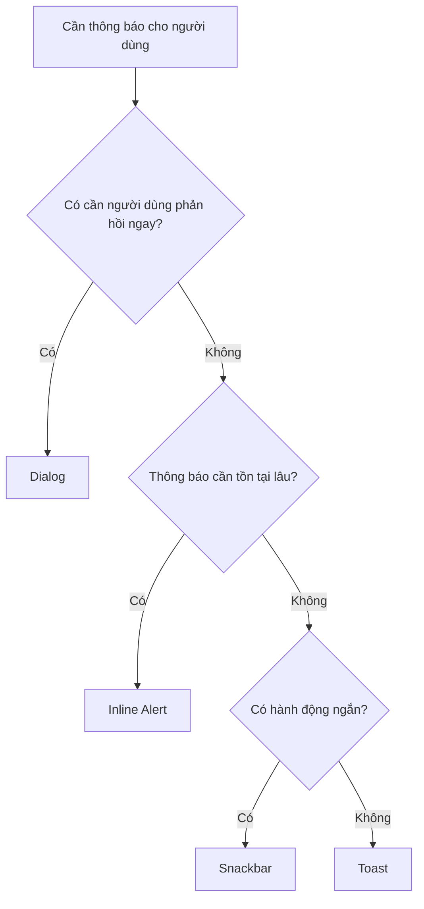
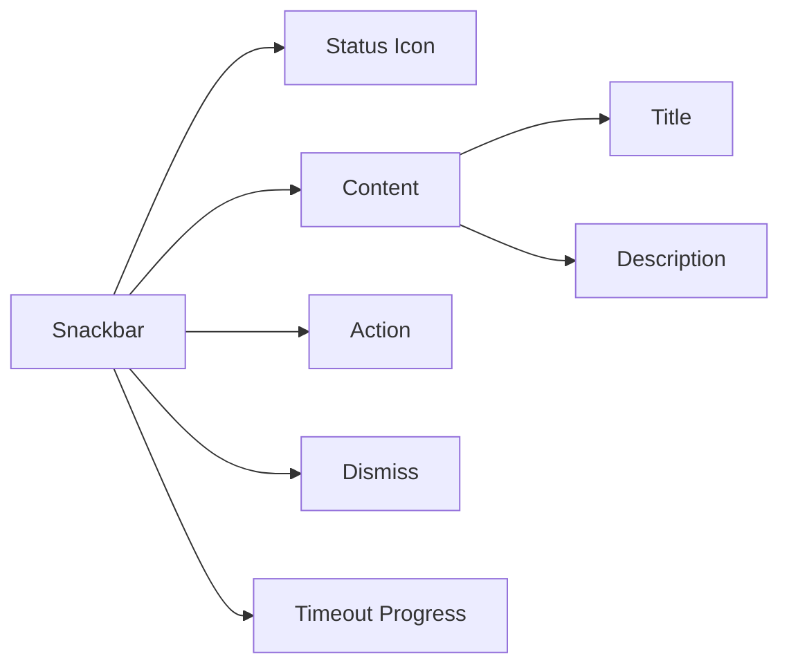
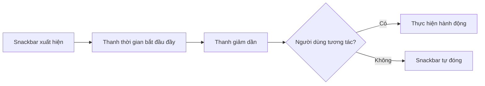
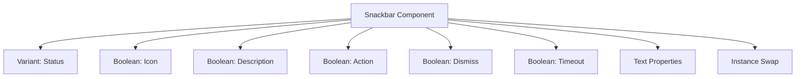
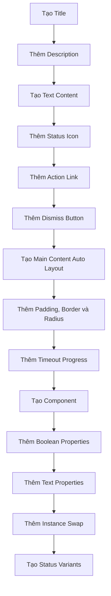

# 046 – Xây dựng Snackbar

## 1. Thông tin bài học

| Mục                       | Nội dung                                        |
| ------------------------- | ----------------------------------------------- |
| **Module**                | Display & Feedback Components                   |
| **Tên tiếng Việt**        | Thành phần hiển thị và phản hồi                 |
| **Thời điểm trong video** | 3:02:19                                         |
| **Chủ đề chính**          | Xây dựng Snackbar để hiển thị phản hồi tạm thời |
| **Thành phần liên quan**  | Icon, Link, Progress Bar, Icon Button           |

---

## 2. Mục tiêu bài học

Bài học hướng dẫn xây dựng một **Snackbar**, còn thường được gọi là **Toast notification**, dùng để hiển thị thông báo ngắn sau khi người dùng hoặc hệ thống thực hiện một hành động.

Sau bài học, chúng ta có thể:

* Xây dựng cấu trúc nội dung của Snackbar.
* Thêm tiêu đề và phần mô tả.
* Thêm biểu tượng trạng thái.
* Thêm liên kết hoặc hành động tùy chọn.
* Thêm nút đóng.
* Tạo thanh thời gian tự động đóng ở phía dưới.
* Xây dựng các biến thể trạng thái.
* Tạo Component Properties để bật, tắt hoặc hoán đổi các phần tử.
* Chuẩn hóa vị trí, khoảng cách, đường viền, bán kính và elevation.

---

## 3. Snackbar là gì?

**Snackbar** là một thành phần phản hồi tạm thời, thường xuất hiện sau khi một hành động vừa được thực hiện.

Ví dụ:

```text
✓ Đã lưu thay đổi
  Thông tin tài khoản của bạn đã được cập nhật.

  Hoàn tác                                      ×
```

Snackbar thường:

* Xuất hiện trong thời gian ngắn.
* Không làm gián đoạn toàn bộ giao diện.
* Có thể tự động biến mất.
* Có thể chứa một hành động ngắn.
* Có thể cho phép người dùng đóng thủ công.

### Các trường hợp sử dụng

* Lưu dữ liệu thành công.
* Sao chép nội dung vào clipboard.
* Xóa một mục.
* Mất kết nối mạng.
* Không thể tải dữ liệu.
* Thêm sản phẩm vào giỏ hàng.
* Hoàn tác một thao tác vừa thực hiện.
* Thông báo trạng thái hệ thống.

---

## 4. Snackbar, Toast và Alert

Các thuật ngữ này đôi khi được sử dụng thay thế cho nhau, nhưng trong Design System nên phân biệt rõ.

| Thành phần   | Mục đích                                       |
| ------------ | ---------------------------------------------- |
| **Snackbar** | Phản hồi ngắn, có thể kèm hành động            |
| **Toast**    | Thông báo rất ngắn, thường không có hành động  |
| **Alert**    | Thông báo quan trọng nằm trong luồng nội dung  |
| **Dialog**   | Yêu cầu người dùng phản hồi trước khi tiếp tục |

### Nguyên tắc lựa chọn



---

## 5. Cấu trúc của Snackbar

Snackbar trong bài học được xây dựng từ nhiều thành phần nguyên tử đã có trong Design System.

```text
Snackbar
├── Leading Icon
├── Content
│   ├── Title
│   └── Description
├── Action Link
├── Dismiss Icon
└── Timeout Progress
```

Trong đó:

* **Leading Icon** thể hiện trạng thái hoặc ngữ cảnh.
* **Title** là nội dung chính.
* **Description** bổ sung chi tiết.
* **Action Link** cho phép thực hiện một hành động ngắn.
* **Dismiss Icon** đóng Snackbar.
* **Timeout Progress** biểu diễn thời gian còn lại trước khi Snackbar biến mất.

### Sơ đồ cấu trúc



---

## 6. Cấu trúc layer đề xuất trong Figma

```text
Snackbar
├── Main Content
│   ├── Leading Icon
│   ├── Text Content
│   │   ├── Title
│   │   └── Description
│   ├── Action Link
│   └── Dismiss Button
└── Timeout Progress
```

Phần `Main Content` sử dụng Auto Layout ngang.

Phần `Text Content` sử dụng Auto Layout dọc.

Thanh `Timeout Progress` được định vị tuyệt đối ở cạnh dưới.

---

## 7. Các bước xây dựng Snackbar trong Figma

## Bước 1: Tạo tiêu đề

Tạo một Text Layer làm nội dung chính.

Ví dụ:

```text
Đã lưu thay đổi
```

Thiết lập typography:

```text
Typography: Body Large
Weight: Medium hoặc Semibold
```

Đặt tên layer:

```text
Title
```

Nội dung tiêu đề nên:

* Ngắn gọn.
* Thể hiện kết quả chính.
* Không kết thúc bằng dấu chấm nếu chỉ là một cụm ngắn.
* Tránh dùng từ ngữ kỹ thuật không cần thiết.

Ví dụ tốt:

```text
Đã tải tệp lên
```

Ví dụ chưa tốt:

```text
Quy trình xử lý thao tác tải lên đã được hoàn thành thành công
```

---

## Bước 2: Tạo phần mô tả

Thêm một Text Layer bên dưới tiêu đề.

Ví dụ:

```text
Tệp của bạn hiện đã sẵn sàng để sử dụng.
```

Thiết lập:

```text
Typography: Body Medium
Color: Text Secondary
Width: Fill container
```

Đặt tên layer:

```text
Description
```

Phần transcript sử dụng một đoạn văn bản mẫu để xây dựng cấu trúc trước, sau đó mới tổ chức toàn bộ các phần tử thành component hoàn chỉnh.

---

## Bước 3: Nhóm nội dung văn bản

Chọn `Title` và `Description`, sau đó áp dụng Auto Layout dọc.

```text
Text Content
├── Title
└── Description
```

Thiết lập đề xuất:

```text
Direction: Vertical
Width: Fill container
Height: Hug contents
Gap: 4 px
```

---

## Bước 4: Thêm biểu tượng trạng thái

Thêm một Icon Instance ở phía bên trái.

Ví dụ:

```text
Info
Success
Warning
Error
```

Kích thước đề xuất:

```text
Icon size: 20 × 20 px hoặc 24 × 24 px
```

Đặt tên layer:

```text
Leading Icon
```

Biểu tượng cần được liên kết với semantic token phù hợp.

Ví dụ:

```text
icon/status/info
icon/status/success
icon/status/warning
icon/status/error
```

---

## Bước 5: Thêm hành động

Snackbar có thể chứa một hành động ngắn bằng Link Component hoặc Text Button.

Ví dụ:

```text
Hoàn tác
Thử lại
Xem thêm
Mở tệp
```

Trong bài học, Link Component được tái sử dụng và có thể thay đổi nội dung thành một nhãn như `Learn more`, đồng thời thay đổi biểu tượng đi kèm.

### Nguyên tắc nội dung hành động

Nên dùng động từ ngắn:

```text
Hoàn tác
Thử lại
Xem
Mở
Khôi phục
```

Không nên dùng câu quá dài:

```text
Nhấn vào đây để thử thực hiện lại hành động vừa thất bại
```

---

## Bước 6: Thêm nút đóng

Thêm biểu tượng đóng ở phía bên phải.

```text
×
```

Nên sử dụng một Icon Button Component thay vì chỉ dùng icon đơn lẻ để bảo đảm:

* Có vùng tương tác đủ lớn.
* Có trạng thái Hover.
* Có trạng thái Focus.
* Có tên truy cập.
* Có thể tái sử dụng nhất quán.

Đặt tên layer:

```text
Dismiss
```

---

## Bước 7: Tạo Main Content

Đặt các thành phần vào một Auto Layout ngang.

```text
Main Content
├── Leading Icon
├── Text Content
├── Action Link
└── Dismiss
```

Thiết lập đề xuất:

```text
Direction: Horizontal
Width: Fill container hoặc Fixed
Height: Hug contents
Alignment: Top hoặc Center
Gap: 12 px
```

Phần nội dung văn bản nên sử dụng:

```text
Width: Fill container
```

Nhờ đó, Link và nút đóng luôn nằm sát phía bên phải khi Snackbar thay đổi chiều rộng. Bài học nhấn mạnh việc sử dụng `Fill container` để giữ phần cuối của Snackbar đúng vị trí.

---

## Bước 8: Tạo khung Snackbar

Đặt `Main Content` vào một Frame Auto Layout.

Thiết lập đề xuất:

```text
Direction: Vertical
Width: 480 px
Height: Hug contents
Padding horizontal: 24 px
Padding vertical: 18 px
Gap: 12 px
```

Bài học thử nghiệm khoảng cách và sử dụng padding gần với `18 × 24`, kết hợp đường viền và bán kính khoảng `8 px`.

---

## 8. Màu nền, đường viền và bán kính

### Màu nền

Snackbar nên dùng semantic surface token.

```text
surface/snackbar/default
surface/snackbar/success
surface/snackbar/warning
surface/snackbar/error
surface/snackbar/info
```

### Đường viền

```text
border/snackbar/default
border/status/success
border/status/warning
border/status/error
border/status/info
```

### Bán kính

Giá trị đề xuất:

```text
Radius: 8 px
```

Có thể sử dụng token:

```text
radius/component/medium
```

---

## 9. Thêm thanh thời gian tự động đóng

Một Snackbar có thể tự động biến mất sau vài giây.

Để thể hiện thời gian còn lại, có thể đặt một Progress Bar ở cạnh dưới.

```text
┌────────────────────────────────────┐
│ ✓ Đã lưu thay đổi               × │
│   Dữ liệu đã được cập nhật.       │
│   Hoàn tác                         │
├──────────────────────────────░░░░░─┤
└────────────────────────────────────┘
```

### Cách thiết lập

1. Kéo Progress Bar vào Snackbar.
2. Đặt Position thành Absolute.
3. Gắn thanh vào:

   * Bottom
   * Left
   * Right
4. Cho chiều rộng thay đổi cùng Snackbar.
5. Tạo Boolean Property để bật hoặc tắt thanh.

Transcript mô tả việc đặt Progress Bar ở đáy bằng Absolute Position và ràng buộc trái, phải, dưới để thanh luôn đi theo kích thước của Snackbar.

### Sơ đồ hoạt động



---

## 10. Tạo Component

Sau khi hoàn thiện cấu trúc, chọn Frame ngoài và tạo Component.

Đặt tên:

```text
Snackbar
```

Hoặc theo quy ước phân cấp:

```text
Feedback/Snackbar
```

Cấu trúc cuối cùng:

```text
Feedback/Snackbar
├── Main Content
│   ├── Leading Icon
│   ├── Text Content
│   │   ├── Title
│   │   └── Description
│   ├── Action Link
│   └── Dismiss
└── Timeout Progress
```

---

## 11. Component Properties

## 11.1. Boolean Property cho biểu tượng

Cho phép bật hoặc tắt biểu tượng trạng thái.

```text
Show icon = True
Show icon = False
```

Trong bài học, biểu tượng bên trái được liên kết với Layer Property để có thể ẩn khi không cần.

---

## 11.2. Instance Swap cho biểu tượng

Cho phép thay đổi biểu tượng trực tiếp trên instance.

```text
Icon = Info
Icon = Check Circle
Icon = Warning
Icon = Error
Icon = Download
```

Transcript cũng bổ sung Instance Swap Property cho biểu tượng bên trái để có thể thay thế bằng icon khác mà không cần detach component.

---

## 11.3. Boolean Property cho nút đóng

```text
Dismissible = True
Dismissible = False
```

Khi `False`, biểu tượng đóng sẽ được ẩn.

Bài học sử dụng Layer Property cho nút đóng vì vị trí này chỉ cần bật hoặc tắt, không cần hoán đổi sang một loại icon khác.

---

## 11.4. Boolean Property cho Action

```text
Show action = True
Show action = False
```

Khi không có hành động phù hợp, nên ẩn toàn bộ Link Component thay vì để một vùng trống.

---

## 11.5. Boolean Property cho Description

```text
Show description = True
Show description = False
```

Snackbar ngắn có thể chỉ chứa một dòng:

```text
Đã sao chép vào clipboard
```

---

## 11.6. Boolean Property cho thanh thời gian

```text
Show timeout = True
Show timeout = False
```

Transcript đề xuất thêm Layer Property để người thiết kế có thể ẩn hoặc hiện Progress Bar ở đáy.

---

## 11.7. Text Property

Các Text Property nên có:

```text
Title
Description
Action label
```

Ví dụ:

```text
Title = Tải lên thành công
Description = Tệp báo cáo đã được lưu.
Action label = Mở tệp
```

---

## 12. Các biến thể trạng thái

Snackbar nên có các trạng thái sau:

```text
Status = Default
Status = Success
Status = Warning
Status = Error
Status = Info
```

Transcript xây dựng nhiều biến thể màu như mặc định, thành công, lỗi, cảnh báo và thông tin.

---

## 13. Default Snackbar

Dùng cho các phản hồi trung tính.

Ví dụ:

```text
Đã lưu vào bản nháp
```

Token đề xuất:

```text
surface/snackbar/default
icon/snackbar/default
border/snackbar/default
```

---

## 14. Success Snackbar

Dùng khi một hành động hoàn thành thành công.

Ví dụ:

```text
✓ Thanh toán thành công
  Hóa đơn đã được gửi đến email của bạn.
```

Token đề xuất:

```text
surface/status/success-subtle
icon/status/success
border/status/success
```

---

## 15. Error Snackbar

Dùng khi một thao tác thất bại.

Ví dụ:

```text
× Không thể tải tệp lên
  Kiểm tra kết nối rồi thử lại.

  Thử lại
```

Token đề xuất:

```text
surface/status/error-subtle
icon/status/error
border/status/error
```

Lỗi quan trọng không nên tự động biến mất quá nhanh nếu người dùng cần đọc hoặc xử lý vấn đề.

---

## 16. Warning Snackbar

Dùng khi có vấn đề cần chú ý nhưng quá trình chưa thất bại hoàn toàn.

Ví dụ:

```text
! Phiên đăng nhập sắp hết hạn
  Hoạt động để tiếp tục phiên.
```

Token đề xuất:

```text
surface/status/warning-subtle
icon/status/warning
border/status/warning
```

---

## 17. Info Snackbar

Dùng để cung cấp thông tin trung tính hoặc cập nhật trạng thái.

Ví dụ:

```text
i Có phiên bản mới
  Khởi động lại ứng dụng để cập nhật.

  Xem thêm
```

Token đề xuất:

```text
surface/status/info-subtle
icon/status/info
border/status/info
```

---

## 18. Bộ thuộc tính đề xuất

```text
Snackbar
├── Status
│   ├── Default
│   ├── Success
│   ├── Warning
│   ├── Error
│   └── Info
├── Show icon
│   ├── True
│   └── False
├── Show description
│   ├── True
│   └── False
├── Show action
│   ├── True
│   └── False
├── Dismissible
│   ├── True
│   └── False
└── Show timeout
    ├── True
    └── False
```

Nên sử dụng:

* Variant Property cho `Status`.
* Boolean Property cho các phần tử tùy chọn.
* Text Property cho nội dung.
* Instance Swap Property cho biểu tượng.
* Nested Instance Property cho Link hoặc Icon Button.

---

## 19. Tránh bùng nổ số lượng variant

Nếu tạo tất cả trạng thái dưới dạng variant:

```text
5 Status
× 2 Icon
× 2 Description
× 2 Action
× 2 Dismiss
× 2 Timeout
= 160 variants
```

Đây là số lượng quá lớn và khó bảo trì.

Thay vào đó:



---

## 20. Vị trí hiển thị

Snackbar thường xuất hiện ở:

* Chính giữa phía dưới.
* Góc dưới bên phải.
* Góc trên bên phải trên giao diện desktop.
* Phía trên thanh điều hướng dưới trên mobile.

### Desktop

```text
┌──────────────────────────────────────┐
│                                      │
│                                      │
│                     ┌──────────────┐ │
│                     │ Snackbar     │ │
│                     └──────────────┘ │
└──────────────────────────────────────┘
```

### Mobile

```text
┌──────────────────────┐
│                      │
│                      │
│ ┌──────────────────┐ │
│ │ Snackbar         │ │
│ └──────────────────┘ │
│ ┌──────────────────┐ │
│ │ Bottom navigation│ │
│ └──────────────────┘ │
└──────────────────────┘
```

Snackbar không nên che:

* Bottom Navigation.
* Nút hành động chính.
* Trường nhập đang được sử dụng.
* Nội dung quan trọng.
* Bàn phím ảo.

---

## 21. Elevation

Snackbar thường nổi phía trên nội dung nên cần sử dụng elevation hoặc shadow.

Token đề xuất:

```text
elevation/snackbar
```

Ví dụ:

```text
Offset X: 0
Offset Y: 4
Blur: 12
Spread: 0
```

Không nên dùng shadow quá mạnh khiến Snackbar giống một Dialog hoặc Floating Card lớn.

---

## 22. Kích thước đề xuất

| Thuộc tính                   |           Giá trị gợi ý |
| ---------------------------- | ----------------------: |
| Chiều rộng tối thiểu         |                  320 px |
| Chiều rộng mặc định          |                  480 px |
| Chiều rộng tối đa            |                  600 px |
| Padding ngang                |                   24 px |
| Padding dọc                  |                16–18 px |
| Khoảng cách giữa các phần tử |                   12 px |
| Radius                       |                    8 px |
| Icon                         |                20–24 px |
| Nút đóng                     | 36–44 px vùng tương tác |

Trên mobile, Snackbar thường sử dụng:

```text
Width: Fill container
Margin left: 16 px
Margin right: 16 px
```

---

## 23. Quy trình xây dựng tổng quát



---

## 24. Ví dụ sử dụng trong sản phẩm

## 24.1. Lưu thành công

```text
✓ Đã lưu thay đổi                             ×
  Các cập nhật của bạn đã được lưu.
```

---

## 24.2. Xóa có thể hoàn tác

```text
Đã xóa một mục

Hoàn tác                                      ×
```

---

## 24.3. Lỗi kết nối

```text
× Mất kết nối mạng                            ×
  Một số thay đổi có thể chưa được lưu.

  Thử lại
```

---

## 24.4. Tải tệp thành công

```text
✓ Tải lên hoàn tất                            ×
  report-final.pdf đã sẵn sàng.

  Mở tệp
```

---

## 24.5. Thông tin cập nhật

```text
i Có bản cập nhật mới                         ×
  Phiên bản mới sẽ được cài đặt khi khởi động lại.

  Xem thêm
```

---

## 25. Nguyên tắc nội dung

### Tiêu đề

Nên mô tả kết quả ngay lập tức:

```text
Đã lưu thay đổi
Không thể kết nối
Tải lên hoàn tất
Đã thêm vào giỏ hàng
```

### Mô tả

Chỉ thêm khi cần giải thích:

```text
Thử kiểm tra kết nối mạng rồi thực hiện lại.
```

### Hành động

Dùng một hành động ngắn:

```text
Hoàn tác
Thử lại
Xem
Mở
```

Không nên đặt nhiều hành động trong cùng Snackbar.

---

## 26. Thời gian hiển thị

Thời gian hiển thị phụ thuộc vào độ dài và mức độ quan trọng.

| Nội dung           |             Thời gian gợi ý |
| ------------------ | --------------------------: |
| Thông báo rất ngắn |                    3–4 giây |
| Có mô tả           |                    5–7 giây |
| Có hành động       |                   6–10 giây |
| Lỗi quan trọng     | Giữ đến khi đóng hoặc xử lý |

Không nên tự động đóng quá nhanh khi Snackbar:

* Có hành động `Hoàn tác`.
* Chứa lỗi cần đọc.
* Có nội dung dài.
* Là thông báo duy nhất về kết quả của thao tác.

---

## 27. Xử lý nhiều Snackbar

Khi có nhiều thông báo liên tiếp, cần xác định chiến lược:

### Thay thế

Snackbar mới thay Snackbar cũ.

```text
Snackbar A → Snackbar B
```

Phù hợp với các cập nhật lặp lại, ít quan trọng.

### Xếp hàng

Snackbar được hiển thị lần lượt.

```text
Snackbar A → đóng → Snackbar B → đóng → Snackbar C
```

Phù hợp khi mỗi thông báo đều quan trọng.

### Xếp chồng

Nhiều Snackbar cùng xuất hiện.

```text
┌──────────────┐
│ Snackbar C   │
├──────────────┤
│ Snackbar B   │
├──────────────┤
│ Snackbar A   │
└──────────────┘
```

Cách này có thể gây rối trên mobile và chỉ nên dùng với giới hạn rõ ràng.

---

## 28. Khả năng tiếp cận

Snackbar cần hỗ trợ người dùng sử dụng công nghệ trợ năng.

Cần bảo đảm:

* Nội dung được trình đọc màn hình thông báo.
* Focus không bị di chuyển ngoài ý muốn.
* Nút đóng có accessible label.
* Hành động có tên rõ ràng.
* Thời gian hiển thị đủ để đọc.
* Không chỉ dựa vào màu sắc.
* Có icon hoặc văn bản mô tả trạng thái.

Ví dụ tên truy cập:

```text
Đóng thông báo
Hoàn tác thao tác xóa
Thử kết nối lại
```

---

## 29. Rủi ro và hạn chế

## 29.1. Snackbar biến mất quá nhanh

Nếu Snackbar chứa thông tin quan trọng nhưng chỉ xuất hiện trong hai giây, người dùng có thể không kịp đọc.

Giải pháp:

* Tăng thời gian hiển thị.
* Cho phép đóng thủ công.
* Dùng Inline Alert cho nội dung quan trọng.
* Dừng bộ đếm khi người dùng di chuột hoặc focus.

---

## 29.2. Quá nhiều nội dung

Snackbar không phù hợp với nội dung dài.

Không nên đưa vào Snackbar:

* Đoạn văn dài.
* Nhiều đường dẫn.
* Biểu mẫu.
* Nhiều lựa chọn.
* Hướng dẫn nhiều bước.

Khi nội dung phức tạp, nên dùng:

* Dialog.
* Alert.
* Notification Center.
* Trang chi tiết.

---

## 29.3. Quá nhiều hành động

Một Snackbar có nhiều nút sẽ trở nên giống một Dialog nhỏ.

Nên giới hạn:

```text
Tối đa một hành động chính
+ một nút đóng
```

---

## 29.4. Che nội dung quan trọng

Snackbar đặt sai vị trí có thể che:

* Nút Save.
* Thanh điều hướng.
* Trường nhập.
* Nội dung đang chỉnh sửa.

Cần kiểm tra trên nhiều kích thước màn hình.

---

## 29.5. Chỉ dùng màu để phân biệt trạng thái

Success, Error, Warning và Info không nên chỉ khác nhau bằng màu nền.

Nên kết hợp:

* Icon.
* Tiêu đề.
* Nội dung rõ ràng.
* Màu semantic.

---

## 29.6. Action và Dismiss quá gần nhau

Nếu Link và nút đóng nằm sát nhau, người dùng có thể bấm nhầm.

Cần bảo đảm:

* Khoảng cách hợp lý.
* Vùng tương tác đủ lớn.
* Thứ tự rõ ràng.
* Không có quá nhiều phần tử phía bên phải.

---

## 29.7. Thanh thời gian gây hiểu nhầm

Progress Bar phía dưới Snackbar cần thể hiện thời gian còn lại, không phải tiến trình xử lý.

Tài liệu Design System nên ghi rõ:

```text
Timeout Progress = thời gian Snackbar còn hiển thị
```

Không nên sử dụng nó để thể hiện:

```text
Tiến độ tải tệp
```

trừ khi Snackbar thực sự đang hiển thị một tiến trình xử lý.

---

## 30. Kiểm tra component

### Kiểm tra nội dung

```text
Tiêu đề ngắn
Tiêu đề dài
Có mô tả
Không có mô tả
Action ngắn
Không có action
```

### Kiểm tra trạng thái

```text
Default
Success
Warning
Error
Info
```

### Kiểm tra phần tử tùy chọn

```text
Có icon / Không icon
Có dismiss / Không dismiss
Có timeout / Không timeout
Có action / Không action
```

### Kiểm tra kích thước

```text
320 px
480 px
600 px
Fill container trên mobile
```

### Kiểm tra giao diện

```text
Light Mode
Dark Mode
High Contrast
```

---

## 31. Câu hỏi ôn tập

### Câu 1: Mục đích chính của bài học là gì?

Mục đích chính là xây dựng một Snackbar có thể tái sử dụng trong Figma để hiển thị phản hồi tạm thời cho người dùng.

Snackbar bao gồm:

* Nội dung thông báo.
* Biểu tượng trạng thái.
* Hành động tùy chọn.
* Nút đóng.
* Thanh thời gian tùy chọn.
* Các biến thể trạng thái.

---

### Câu 2: Áp dụng vào Design System thực tế như thế nào?

Có thể áp dụng bằng cách:

1. Tái sử dụng Icon, Link, Icon Button và Progress Bar.
2. Dùng Auto Layout để Snackbar thích nghi với nội dung.
3. Dùng semantic token cho màu nền, icon và đường viền.
4. Tạo các trạng thái Default, Success, Warning, Error và Info.
5. Thêm Boolean Property cho các phần tử tùy chọn.
6. Thêm Instance Swap cho biểu tượng.
7. Chuẩn hóa vị trí, elevation và thời gian hiển thị.
8. Viết hướng dẫn nội dung và khả năng tiếp cận.

---

### Câu 3: Các bước và ý tưởng chính được trình bày là gì?

Các ý tưởng chính gồm:

1. Tạo Title và Description.
2. Nhóm nội dung bằng Auto Layout.
3. Thêm biểu tượng trạng thái.
4. Tái sử dụng Link Component làm hành động.
5. Thêm nút đóng.
6. Dùng `Fill container` để giữ phần tử cuối bên phải.
7. Thêm padding, border và radius.
8. Đặt Progress Bar ở cạnh dưới bằng Absolute Position.
9. Tạo component.
10. Thêm Layer Property cho icon, dismiss và progress.
11. Thêm Instance Swap cho icon.
12. Tạo các biến thể trạng thái.

---

### Câu 4: Rủi ro hoặc hạn chế cần lưu ý là gì?

Các rủi ro chính gồm:

* Snackbar biến mất trước khi người dùng đọc xong.
* Nội dung quá dài.
* Có quá nhiều hành động.
* Che khuất nội dung quan trọng.
* Chỉ dùng màu để thể hiện trạng thái.
* Nút đóng và action nằm quá gần nhau.
* Thanh thời gian có thể bị nhầm với tiến độ tác vụ.
* Tạo quá nhiều variant làm component khó bảo trì.

---

## 32. Checklist hoàn thiện Snackbar

* [ ] Có Title Property
* [ ] Có Description Property
* [ ] Có Action Label Property
* [ ] Có thể ẩn hoặc hiện Leading Icon
* [ ] Có Instance Swap cho Leading Icon
* [ ] Có thể ẩn hoặc hiện Action
* [ ] Có thể ẩn hoặc hiện Dismiss
* [ ] Có thể ẩn hoặc hiện Timeout Progress
* [ ] Text Content sử dụng Fill container
* [ ] Snackbar hỗ trợ nội dung nhiều dòng
* [ ] Có các trạng thái Default, Success, Warning, Error và Info
* [ ] Màu sử dụng semantic token
* [ ] Border sử dụng semantic token
* [ ] Radius sử dụng token
* [ ] Có elevation phù hợp
* [ ] Không chỉ dùng màu để truyền đạt trạng thái
* [ ] Nút đóng có vùng tương tác đủ lớn
* [ ] Action có nội dung ngắn
* [ ] Kiểm tra Light Mode và Dark Mode
* [ ] Kiểm tra trên desktop và mobile
* [ ] Có tài liệu về vị trí và thời gian hiển thị

---

## 33. Tóm tắt bài học

Bài học xây dựng một **Snackbar** bằng cách kết hợp nhiều thành phần đã có trong Design System:

```text
Icon
+ Text
+ Link
+ Dismiss Button
+ Progress Bar
```

Cấu trúc chính:

```text
Snackbar
├── Leading Icon
├── Text Content
│   ├── Title
│   └── Description
├── Action
├── Dismiss
└── Timeout Progress
```

Điểm quan trọng trong quá trình xây dựng gồm:

* Sử dụng Auto Layout cho toàn bộ cấu trúc.
* Đặt nội dung văn bản thành `Fill container`.
* Giữ Action và Dismiss ở phía bên phải.
* Dùng Absolute Position cho thanh thời gian ở cạnh dưới.
* Thêm Boolean Property cho các phần tử tùy chọn.
* Thêm Instance Swap Property cho biểu tượng.
* Tạo các trạng thái Default, Success, Warning, Error và Info.
* Dùng semantic token để giữ màu sắc nhất quán với Progress Bar và các feedback component khác.

Snackbar là một component tốt để thể hiện khả năng xây dựng Design System vì nó kết hợp nhiều component nguyên tử, nested instance, Auto Layout, semantic token và Component Properties trong cùng một cấu trúc.

---

# Bài luyện tập

## Mục tiêu


## Đề bài


## Yêu cầu hoàn thành

- [ ] 
- [ ] 
- [ ] 

## Kết quả / lời giải


## Ghi chú
