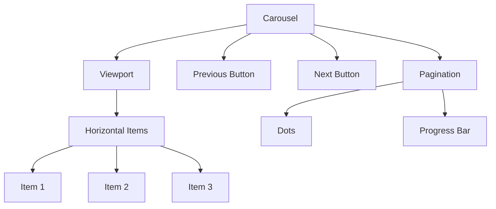
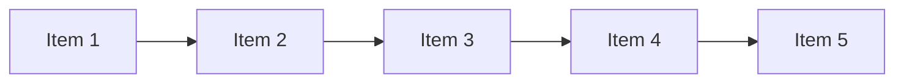
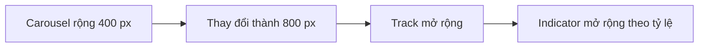
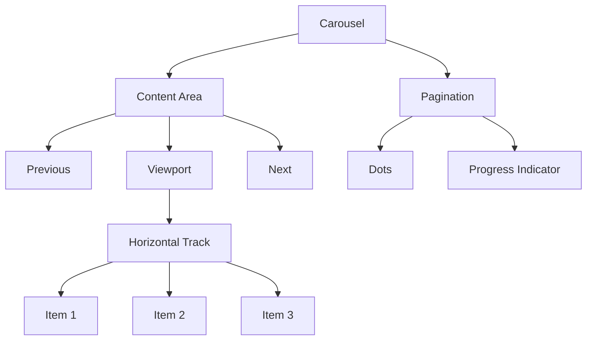
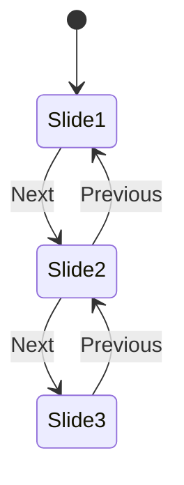
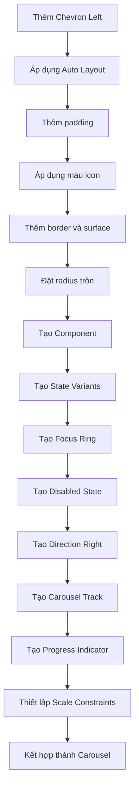

# 047 – Xây dựng Carousel

## 1. Thông tin bài học

| Mục                       | Nội dung                                                         |
| ------------------------- | ---------------------------------------------------------------- |
| **Module**                | Display & Feedback Components                                    |
| **Tên tiếng Việt**        | Thành phần hiển thị và phản hồi                                  |
| **Thời điểm trong video** | 3:08:57                                                          |
| **Chủ đề chính**          | Xây dựng Carousel với nút điều hướng và thanh chỉ báo tiến trình |
| **Thành phần liên quan**  | Icon, Icon Button, Progress Bar, Focus Ring                      |

---

## 2. Mục tiêu bài học

Bài học hướng dẫn xây dựng các thành phần cơ bản của một **Carousel** trong Figma, bao gồm:

* Nút điều hướng sang trái và phải.
* Các trạng thái tương tác của nút điều hướng.
* Thanh chỉ báo vị trí hoặc tiến độ.
* Khả năng thay đổi kích thước linh hoạt.
* Cách tái sử dụng token và component đã có.
* Cấu trúc có thể áp dụng cho hình ảnh, thẻ nội dung hoặc sản phẩm.

Carousel giúp người dùng duyệt qua một tập hợp nội dung mà không cần hiển thị tất cả các mục cùng lúc.

---

## 3. Carousel là gì?

**Carousel** là thành phần giao diện cho phép người dùng chuyển đổi giữa nhiều mục nội dung được sắp xếp theo một chuỗi.

Các mục có thể là:

* Hình ảnh.
* Banner.
* Card sản phẩm.
* Bài viết.
* Đánh giá khách hàng.
* Nội dung nổi bật.
* Bài học.
* Thành tích hoặc thống kê.

Ví dụ:

```text
┌────┐  ┌──────────────────────────────┐  ┌────┐
│ ←  │  │        Carousel item         │  │ →  │
└────┘  └──────────────────────────────┘  └────┘

             ━━━━━━━──────────
```

---

## 4. Cấu trúc tổng quát của Carousel

Một Carousel hoàn chỉnh thường gồm:

```text
Carousel
├── Viewport
│   └── Items
│       ├── Item 1
│       ├── Item 2
│       ├── Item 3
│       └── ...
├── Previous Button
├── Next Button
└── Pagination
    ├── Pagination Dots
    └── Progress Indicator
```

### Sơ đồ cấu trúc



Trong bài học, nội dung tập trung chủ yếu vào:

1. Nút điều hướng Carousel.
2. Các trạng thái của nút.
3. Hướng trái và phải.
4. Thanh chỉ báo tiến trình Carousel.

---

## 5. Carousel Item và Viewport

## 5.1. Carousel Item

`Carousel Item` là một nội dung đơn lẻ trong chuỗi Carousel.

Ví dụ:

```text
Carousel Item
├── Image
├── Title
├── Description
└── Action
```

Carousel Item có thể là:

* Một component cụ thể.
* Một Card instance.
* Một Image frame.
* Một slot chứa bất kỳ nội dung nào.
* Một nested instance có thể hoán đổi.

### Cấu trúc slot đề xuất

```text
Carousel
└── Viewport
    └── Content Track
        ├── Item Instance
        ├── Item Instance
        └── Item Instance
```

Nếu xây dựng Design System nâng cao, nên dùng **Instance Swap Property** để người thiết kế có thể thay đổi loại nội dung bên trong Carousel.

---

## 5.2. Viewport

`Viewport` là vùng nhìn thấy của Carousel.

Các mục nằm ngoài Viewport có thể:

* Bị cắt bằng `Clip content`.
* Được kéo ngang trong prototype.
* Được chuyển bằng nút Previous và Next.
* Được điều khiển bằng thao tác vuốt trên mobile.

Thiết lập đề xuất:

```text
Viewport
Width: Fill container hoặc Fixed
Height: Theo nội dung
Clip content: On
```

---

## 5.3. Content Track

Các item nên được đặt trong một Auto Layout ngang.

```text
Content Track
├── Item 1
├── Item 2
├── Item 3
└── Item 4
```

Thiết lập:

```text
Direction: Horizontal
Width: Hug contents
Height: Hug contents
Gap: 16–24 px
```

### Sơ đồ cuộn ngang



Viewport chỉ hiển thị một hoặc một số item:

```text
┌──────────────────────────────────────┐
│ Item 1        Item 2        Item 3  │ → Item 4
└──────────────────────────────────────┘
```

---

# 6. Xây dựng nút điều hướng Carousel

## Bước 1: Thêm biểu tượng Chevron

Bắt đầu bằng một biểu tượng:

```text
Chevron Left
```

Biểu tượng này được sử dụng cho nút quay lại mục trước.

Kích thước đề xuất:

```text
Icon: 20 × 20 px
```

Hoặc:

```text
Icon: 24 × 24 px
```

Đặt tên layer:

```text
Icon
```

---

## Bước 2: Thêm Auto Layout

Chọn biểu tượng và nhấn:

```text
Shift + A
```

Điều này tạo một Auto Layout Frame quanh icon.

Thiết lập padding ban đầu:

```text
Horizontal padding: 8 px
Vertical padding: 8 px
```

Nếu icon có kích thước `20 × 20 px`, nút sẽ có kích thước khoảng:

```text
36 × 36 px
```

Cấu trúc:

```text
Carousel Navigation Button
└── Chevron Icon
```

---

## Bước 3: Thiết lập màu icon

Áp dụng semantic token cho icon.

Ví dụ:

```text
icon/action/default
```

Không nên sử dụng một mã màu trực tiếp như:

```text
#6750A4
```

Nên dùng token để component hỗ trợ:

* Light Mode.
* Dark Mode.
* High Contrast.
* Theme thương hiệu.
* Các trạng thái tương tác.

---

## Bước 4: Thêm đường viền

Thêm stroke cho nút:

```text
Stroke width: 1 px
```

Token đề xuất:

```text
border/action/default
```

Đường viền giúp nút dễ nhận biết khi đặt trên các nền khác nhau.

---

## Bước 5: Thêm màu nền

Áp dụng màu nền mặc định:

```text
surface/default
```

Hoặc:

```text
surface/action/default
```

Nếu nút được đặt trực tiếp trên hình ảnh, có thể cần:

* Nền trắng bán trong suốt.
* Nền tối bán trong suốt.
* Shadow nhẹ.
* Backdrop blur trong sản phẩm thật.

---

## Bước 6: Thiết lập bán kính

Nút điều hướng thường có hình tròn.

```text
Corner radius: Full
```

Hoặc:

```text
Radius: 999 px
```

Kết quả:

```text
   ╭──────╮
   │  ←   │
   ╰──────╯
```

---

## Bước 7: Đặt tên component

Đặt tên:

```text
Carousel Navigation Button
```

Hoặc theo cấu trúc phân cấp:

```text
Carousel/Navigation
```

Nếu component này chưa sẵn sàng xuất bản, có thể thêm dấu chấm ở đầu tên:

```text
.Carousel Navigation
```

Quy ước này giúp phân biệt component nội bộ với component được đưa vào thư viện chính thức.

---

# 7. Tạo các trạng thái tương tác

Nút điều hướng nên có các trạng thái:

```text
State = Default
State = Hover
State = Focus
State = Disabled
```

### Cấu trúc Component Set

```text
Carousel Navigation
├── Default
├── Hover
├── Focus
└── Disabled
```

---

## 7.1. Default

Đây là trạng thái mặc định.

Token đề xuất:

```text
surface/action/default
icon/action/default
border/action/default
```

Ví dụ:

```text
╭──────╮
│  ←   │
╰──────╯
```

---

## 7.2. Hover

Khi người dùng di chuột lên nút, cần tạo phản hồi trực quan.

Token đề xuất:

```text
surface/action/hover
icon/action/hover
border/action/hover
```

Các thay đổi có thể gồm:

* Nền đậm hơn.
* Icon đổi màu.
* Border nổi bật hơn.
* Shadow tăng nhẹ.

```text
Default             Hover

╭──────╮          ╭──────╮
│  ←   │    →     │  ←   │
╰──────╯          ╰──────╯
```

---

## 7.3. Focus

Trạng thái Focus giúp người dùng sử dụng bàn phím biết nút nào đang được chọn.

Bài học tái sử dụng Focus Ring từ component khác, thay vì tạo lại từ đầu.

Có thể lấy Focus Ring từ:

* Radio Button.
* Button.
* Input.
* Card.
* Checkbox.

### Cấu trúc Focus

```text
Carousel Navigation
├── Focus Ring
└── Button Surface
    └── Icon
```

Focus Ring nên lớn hơn nút khoảng:

```text
2 px ở mỗi cạnh
```

Ví dụ:

```text
  ╭──────────╮
  │ ╭──────╮ │
  │ │  ←   │ │
  │ ╰──────╯ │
  ╰──────────╯
```

Token đề xuất:

```text
border/focus
```

Không nên chỉ thay đổi màu nền mà không có focus indicator rõ ràng.

---

## 7.4. Disabled

Trạng thái Disabled được sử dụng khi không còn mục để chuyển theo hướng đó.

Ví dụ:

* Đang ở item đầu tiên → nút Previous bị vô hiệu hóa.
* Đang ở item cuối cùng → nút Next bị vô hiệu hóa.

Token đề xuất:

```text
surface/disabled
icon/disabled
border/disabled
```

Ví dụ:

```text
Carousel đang ở item đầu tiên:

┌───────────┐
│ Item 1    │
└───────────┘

Previous: Disabled
Next: Active
```

Nút Disabled cần:

* Độ tương phản thấp hơn.
* Không có Hover.
* Không thể nhận tương tác.
* Có trạng thái rõ ràng nhưng vẫn nhận biết được hình dạng.

---

# 8. Tạo biến thể hướng

Sau khi tạo đầy đủ trạng thái cho Chevron Left, sao chép các variant để tạo hướng phải.

```text
Direction = Left
Direction = Right
```

Cấu trúc đầy đủ:

```text
Carousel Navigation
├── Direction = Left
│   ├── State = Default
│   ├── State = Hover
│   ├── State = Focus
│   └── State = Disabled
└── Direction = Right
    ├── State = Default
    ├── State = Hover
    ├── State = Focus
    └── State = Disabled
```

### Số lượng variant

```text
2 Directions × 4 States = 8 variants
```

---

## 8.1. Hoán đổi icon

Đổi:

```text
Chevron Left
```

thành:

```text
Chevron Right
```

Không cần xây dựng một component hoàn toàn mới.

Nếu sử dụng Instance Swap Property:

```text
Icon = Chevron Left
Icon = Chevron Right
```

Tuy nhiên, trong trường hợp hướng là một thuộc tính quan trọng của component, Variant Property thường rõ ràng hơn:

```text
Direction = Left / Right
```

---

# 9. Thanh chỉ báo tiến trình Carousel

Bên cạnh pagination dots, Carousel có thể sử dụng một thanh để biểu thị vị trí hiện tại.

Ví dụ:

```text
━━━━━━────────────────────
```

Trong đó:

* Phần nền thể hiện toàn bộ số lượng nội dung.
* Phần nổi bật thể hiện vị trí hoặc phạm vi đang hiển thị.

Cấu trúc:

```text
Carousel Progress
├── Track
└── Indicator
```

---

## 9.1. Tạo Track

Tạo một Frame hoặc Rectangle.

Thiết lập:

```text
Width: 200 px
Height: 4 px
```

Áp dụng:

```text
Fill: surface/action-hover-light
Radius: Full
```

Đặt tên:

```text
Track
```

Ví dụ:

```text
────────────────────────────
```

---

## 9.2. Tạo Indicator

Sao chép Track và đặt vào bên trong.

Thiết lập chiều rộng nhỏ hơn:

```text
Track width: 200 px
Indicator width: 48 px
```

Áp dụng token:

```text
Fill: surface/action
```

Đặt tên:

```text
Indicator
```

Kết quả:

```text
━━━━━━──────────────────────
```

---

## 9.3. Cấu trúc Frame lồng nhau

```text
Carousel Progress
└── Track
    └── Indicator
```

Hoặc:

```text
Carousel Progress
├── Track
└── Indicator
```

Nếu đặt Indicator bên trong Track, cần đảm bảo:

* Căn trái.
* Căn giữa theo chiều dọc.
* Không vượt khỏi Track.
* Có cùng chiều cao.
* Có cùng bán kính.

---

## 9.4. Thay đổi độ dày

Bài học thử nghiệm thanh có chiều cao khoảng `5 px`, sau đó đề xuất giảm xuống `4 px` để giao diện gọn hơn.

Kích thước đề xuất:

| Size    | Chiều cao |
| ------- | --------: |
| Compact |      2 px |
| Default |      4 px |
| Strong  |      6 px |

Phổ biến nhất:

```text
Height: 4 px
```

Track và Indicator phải có cùng chiều cao:

```text
Track height = 4 px
Indicator height = 4 px
```

---

# 10. Thiết lập Scale Constraints

Khi chiều rộng Carousel thay đổi, thanh chỉ báo cũng phải thay đổi theo.

Thiết lập cho Track:

```text
Horizontal constraint: Left and Right
```

Hoặc:

```text
Width: Fill container
```

Thiết lập cho Indicator trong trường hợp muốn co giãn theo tỷ lệ:

```text
Horizontal constraint: Scale
```

### Luồng thay đổi



Ví dụ:

```text
Carousel 400 px:
━━━━────────────────

Carousel 800 px:
━━━━━━━━────────────────────────
```

---

# 11. Cách tính Indicator

Giả sử Carousel có:

```text
Total items = 5
Visible items = 1
```

Chiều rộng Indicator có thể được tính:

```text
Indicator width = Track width / Total items
```

Ví dụ:

```text
Track width = 200 px
Total items = 5

Indicator width = 200 / 5 = 40 px
```

### Bảng ví dụ

| Tổng số item |  Track | Indicator |
| -----------: | -----: | --------: |
|            2 | 200 px |    100 px |
|            4 | 200 px |     50 px |
|            5 | 200 px |     40 px |
|            8 | 200 px |     25 px |

Nếu hiển thị nhiều item cùng lúc:

```text
Indicator width =
Track width × Visible items / Total items
```

Ví dụ:

```text
Track width = 240 px
Visible items = 3
Total items = 8

Indicator width = 240 × 3 / 8
Indicator width = 90 px
```

---

# 12. Vị trí của Indicator

Vị trí Indicator có thể được xác định dựa trên item hiện tại.

Công thức đơn giản:

```text
Position X =
Current index × Track width / Total items
```

Ví dụ:

```text
Track width = 200 px
Total items = 5
Current index = 2

Position X = 2 × 200 / 5
Position X = 80 px
```

Trong Figma, việc này thường được mô phỏng bằng:

* Nhiều variant.
* Smart Animate.
* Prototype states.
* Chỉnh vị trí thủ công.

Trong sản phẩm thật, vị trí sẽ được tính bằng code.

---

# 13. Pagination Dots

Ngoài thanh tiến trình, Carousel có thể sử dụng các dấu chấm.

Ví dụ:

```text
● ○ ○ ○
```

Trong đó:

* `●` là item đang hoạt động.
* `○` là item chưa hoạt động.

Cấu trúc:

```text
Pagination Dots
├── Dot Active
├── Dot Inactive
├── Dot Inactive
└── Dot Inactive
```

Thiết lập Auto Layout:

```text
Direction: Horizontal
Gap: 8 px
Width: Hug contents
Height: Hug contents
```

---

## 13.1. Dot Component

Tạo một hình tròn:

```text
Width: 8 px
Height: 8 px
```

Variants:

```text
State = Active
State = Inactive
```

Token:

```text
pagination/active
pagination/inactive
```

Có thể thêm:

```text
State = Hover
State = Focus
```

nếu dot có thể được nhấn trực tiếp.

---

## 13.2. Khi nào dùng Dots?

Pagination dots phù hợp khi:

* Có ít item.
* Mỗi item chiếm gần toàn bộ Viewport.
* Người dùng cần biết số trang.
* Số lượng item tương đối ổn định.

Không nên dùng quá nhiều dots:

```text
● ○ ○ ○ ○ ○ ○ ○ ○ ○ ○ ○ ○ ○ ○
```

Khi có quá nhiều item, nên dùng:

* Thanh tiến trình.
* Số trang.
* Bộ đếm dạng `2/10`.
* Thanh cuộn ngang.

---

# 14. Carousel Progress và Progress Bar

Carousel Progress có cấu trúc gần giống Progress Bar nhưng có ý nghĩa khác nhau.

| Progress Bar                       | Carousel Progress                   |
| ---------------------------------- | ----------------------------------- |
| Thể hiện mức hoàn thành của tác vụ | Thể hiện vị trí trong tập hợp       |
| Có thể biểu thị từ 0% đến 100%     | Biểu thị item hoặc phạm vi hiện tại |
| Thường thay đổi liên tục           | Thay đổi theo từng bước             |
| Có thể có nhãn phần trăm           | Có thể không cần nhãn               |
| Dùng trong upload, cài đặt         | Dùng trong slideshow, card list     |

Hai component có thể chia sẻ token:

```text
progress/track
progress/fill
```

Tuy nhiên, có thể tạo semantic token riêng để ý nghĩa rõ ràng hơn:

```text
carousel/indicator/track
carousel/indicator/active
```

---

# 15. Cấu trúc Carousel hoàn chỉnh

```text
Carousel
├── Content Area
│   ├── Previous Button
│   ├── Viewport
│   │   └── Content Track
│   │       ├── Item 1
│   │       ├── Item 2
│   │       └── Item 3
│   └── Next Button
└── Navigation Indicator
    ├── Pagination Dots
    └── Progress Bar
```

### Sơ đồ hoàn chỉnh



---

# 16. Auto Layout đề xuất

## Carousel ngoài

```text
Direction: Vertical
Width: Fill container
Height: Hug contents
Gap: 16–24 px
```

## Content Area

```text
Direction: Horizontal
Width: Fill container
Height: Hug contents
Gap: 12–16 px
Alignment: Center
```

## Viewport

```text
Width: Fill container
Height: Fixed hoặc Hug contents
Clip content: On
```

## Content Track

```text
Direction: Horizontal
Width: Hug contents
Height: Hug contents
Gap: 16–24 px
```

## Pagination Area

```text
Direction: Horizontal
Width: Fill container
Height: Hug contents
Alignment: Center
```

---

# 17. Component Properties đề xuất

## 17.1. Direction của nút

```text
Direction = Left
Direction = Right
```

---

## 17.2. State của nút

```text
State = Default
State = Hover
State = Focus
State = Disabled
```

---

## 17.3. Pagination Type

```text
Pagination = Dots
Pagination = Progress
Pagination = Counter
Pagination = None
```

---

## 17.4. Boolean Properties

```text
Show navigation = True / False
Show pagination = True / False
Show previous = True / False
Show next = True / False
```

---

## 17.5. Content Instance Swap

Nếu Carousel có một slot nội dung:

```text
Content = Image Card
Content = Product Card
Content = Testimonial Card
Content = Course Card
```

---

## 17.6. Size Variant

```text
Size = Small
Size = Default
Size = Large
```

Size có thể kiểm soát:

* Kích thước nút.
* Kích thước icon.
* Khoảng cách giữa item.
* Kích thước dots.
* Chiều cao progress indicator.

---

# 18. Bộ thuộc tính đề xuất

```text
Carousel Navigation
├── Direction
│   ├── Left
│   └── Right
└── State
    ├── Default
    ├── Hover
    ├── Focus
    └── Disabled
```

```text
Carousel Progress
├── Size
│   ├── Compact
│   └── Default
└── Position
    ├── Start
    ├── Middle
    └── End
```

```text
Carousel
├── Pagination
│   ├── Dots
│   ├── Progress
│   ├── Counter
│   └── None
├── Show navigation
│   ├── True
│   └── False
└── Content
    └── Instance Swap
```

---

# 19. Design Token đề xuất

## Token màu nút điều hướng

```text
carousel/control/surface/default
carousel/control/surface/hover
carousel/control/surface/disabled

carousel/control/icon/default
carousel/control/icon/hover
carousel/control/icon/disabled

carousel/control/border/default
carousel/control/border/hover
carousel/control/border/disabled
```

## Token Focus

```text
focus/ring/default
```

## Token Pagination

```text
carousel/pagination/track
carousel/pagination/indicator
carousel/pagination/dot-active
carousel/pagination/dot-inactive
```

## Token kích thước

```text
carousel/control/size
carousel/control/icon-size
carousel/pagination/height
carousel/pagination/dot-size
carousel/item/gap
```

---

# 20. Ứng dụng trong Design System thực tế

## 20.1. Hero Banner

```text
┌────┐ ┌────────────────────────────────┐ ┌────┐
│ ←  │ │       Summer Collection        │ │ →  │
└────┘ └────────────────────────────────┘ └────┘

                  ● ○ ○
```

Phù hợp cho:

* Landing page.
* Chiến dịch quảng cáo.
* Nội dung nổi bật.

---

## 20.2. Product Carousel

```text
←  [Product 1] [Product 2] [Product 3] [Product 4]  →

             ━━━━━────────────────
```

Phù hợp cho:

* Sản phẩm liên quan.
* Sản phẩm bán chạy.
* Gợi ý cá nhân hóa.

---

## 20.3. Course Carousel

```text
←  [Unit 1] [Unit 2] [Unit 3]  →
```

Có thể sử dụng trong ứng dụng học tập để hiển thị:

* Bài học gần đây.
* Unit đang học.
* Bộ từ vựng.
* Bài ôn tập.

---

## 20.4. Testimonial Carousel

```text
┌─────────────────────────────────┐
│ “Sản phẩm rất dễ sử dụng...”    │
│                                 │
│ Nguyễn Văn A                    │
└─────────────────────────────────┘

             ←   ● ○ ○   →
```

---

## 20.5. Image Gallery

```text
┌─────────────────────────────────┐
│                                 │
│             Image               │
│                                 │
└─────────────────────────────────┘

             ←   2/8   →
```

---

# 21. Carousel trên Desktop và Mobile

## Desktop

Trên desktop, Carousel thường có:

* Nút Previous.
* Nút Next.
* Hover state.
* Focus state.
* Nhiều item hiển thị cùng lúc.

```text
←  [Card 1] [Card 2] [Card 3]  →
```

---

## Mobile

Trên mobile, người dùng thường:

* Vuốt ngang.
* Không cần nút điều hướng.
* Dùng dots hoặc progress indicator.
* Nhìn thấy một phần item tiếp theo để nhận biết có thể cuộn.

```text
┌───────────────────┐
│      Card 1       │  [Card 2...]
└───────────────────┘

       ● ○ ○
```

Component nên cho phép:

```text
Show navigation = False
```

trên mobile.

---

# 22. Prototype trong Figma

Có thể tạo prototype Carousel bằng các variant:

```text
Position = 1
Position = 2
Position = 3
```

Mỗi variant thay đổi:

* Vị trí Content Track.
* Dot đang hoạt động.
* Vị trí Indicator.
* Trạng thái Disabled của nút.

### Luồng prototype



Animation đề xuất:

```text
Animation: Smart Animate
Duration: 250–400 ms
Easing: Ease Out
```

---

# 23. Trạng thái các nút theo vị trí

| Vị trí         | Previous | Next     |
| -------------- | -------- | -------- |
| Item đầu tiên  | Disabled | Enabled  |
| Item ở giữa    | Enabled  | Enabled  |
| Item cuối cùng | Enabled  | Disabled |

Nếu Carousel quay vòng vô hạn:

```text
Loop = True
```

thì cả hai nút luôn hoạt động.

---

# 24. Carousel tuần hoàn và không tuần hoàn

## Không tuần hoàn

```text
Item 1 → Item 2 → Item 3 → Dừng
```

Ở item cuối:

```text
Next = Disabled
```

Ưu điểm:

* Dễ hiểu.
* Người dùng biết đã đến cuối.
* Phù hợp với nội dung tuần tự.

---

## Tuần hoàn

```text
Item 1 → Item 2 → Item 3 → Item 1
```

Ưu điểm:

* Có thể tiếp tục duyệt.
* Phù hợp với hình ảnh quảng cáo.

Hạn chế:

* Có thể làm người dùng mất cảm giác về vị trí.
* Pagination cần rõ ràng.
* Không nên áp dụng cho mọi loại nội dung.

---

# 25. Khả năng tiếp cận

Carousel là một component có nhiều rủi ro về khả năng tiếp cận.

Cần bảo đảm:

* Nút Previous và Next có nhãn rõ ràng.
* Focus order hợp lý.
* Có thể điều khiển bằng bàn phím.
* Không tự động chuyển quá nhanh.
* Có nút tạm dừng nếu tự động chạy.
* Thông báo được item hiện tại.
* Không chỉ dựa vào dots để truyền tải vị trí.

Ví dụ accessible label:

```text
Chuyển đến mục trước
Chuyển đến mục tiếp theo
Mục 2 trên tổng số 5
Tạm dừng trình chiếu
```

---

# 26. Rủi ro và hạn chế

## 26.1. Nội dung bị ẩn

Carousel làm nhiều nội dung không được nhìn thấy ngay.

Người dùng có thể không biết rằng còn nội dung phía sau.

Giải pháp:

* Hiển thị một phần item tiếp theo.
* Có nút điều hướng rõ ràng.
* Có pagination indicator.
* Không đặt nội dung thiết yếu chỉ trong các slide sau.

---

## 26.2. Tự động chuyển quá nhanh

Auto-play có thể khiến người dùng:

* Không đọc kịp.
* Mất tập trung.
* Bấm nhầm.
* Khó tương tác với nội dung.

Nếu Carousel tự động chạy, nên:

* Cho phép tạm dừng.
* Dừng khi Hover hoặc Focus.
* Không chuyển quá nhanh.
* Không tự chạy với nội dung phức tạp.

---

## 26.3. Quá nhiều item

Pagination dots không hiệu quả nếu có quá nhiều mục.

Ví dụ không tốt:

```text
● ○ ○ ○ ○ ○ ○ ○ ○ ○ ○ ○ ○ ○
```

Giải pháp:

* Dùng progress indicator.
* Dùng bộ đếm `3/14`.
* Chia nội dung thành danh sách.
* Dùng horizontal scrolling thay vì slide từng mục.

---

## 26.4. Nút điều hướng quá nhỏ

Icon có thể nhìn thấy nhưng vùng tương tác quá nhỏ.

Vùng tương tác đề xuất:

```text
Tối thiểu khoảng 40 × 40 px
```

Trên mobile, nên gần:

```text
44 × 44 px
```

---

## 26.5. Focus state không rõ ràng

Nếu không có Focus Ring, người dùng bàn phím không biết đang chọn nút nào.

Cần tái sử dụng focus token và focus pattern chung của Design System.

---

## 26.6. Disabled state có độ tương phản quá thấp

Nút Disabled vẫn cần nhận biết được.

Không nên làm nút biến mất hoàn toàn, trừ khi thiết kế có lý do rõ ràng.

---

## 26.7. Indicator không đồng bộ

Thanh tiến trình hoặc dot có thể chỉ sai item hiện tại.

Ví dụ:

```text
Nội dung đang ở Item 3
Indicator lại hiển thị Item 2
```

Trong Figma, cần kiểm tra từng variant.

Trong sản phẩm thật, nội dung và indicator phải dùng chung state.

---

## 26.8. Carousel không phải lúc nào cũng phù hợp

Không nên dùng Carousel khi:

* Tất cả nội dung đều quan trọng.
* Người dùng cần so sánh các mục.
* Danh sách có thể hiển thị đầy đủ.
* Nội dung yêu cầu đọc liên tục.
* Có nhiều thao tác trên từng item.

Trong các trường hợp đó, Grid hoặc List có thể hiệu quả hơn.

---

# 27. Kiểm tra component

## Kiểm tra trạng thái nút

```text
Default
Hover
Focus
Disabled
```

## Kiểm tra hướng

```text
Left
Right
```

## Kiểm tra pagination

```text
Dots
Progress
Counter
None
```

## Kiểm tra vị trí

```text
First item
Middle item
Last item
```

## Kiểm tra số lượng item

```text
1 item
2 items
5 items
10+ items
```

## Kiểm tra kích thước màn hình

```text
Mobile
Tablet
Desktop
Wide desktop
```

## Kiểm tra theme

```text
Light Mode
Dark Mode
High Contrast
```

---

# 28. Quy trình xây dựng tổng quát



---

# 29. Câu hỏi ôn tập

## Câu 1: Mục đích chính của bài học là gì?

Mục đích chính là xây dựng các thành phần điều hướng và chỉ báo cho Carousel, giúp người dùng chuyển đổi giữa nhiều mục nội dung.

Các thành phần chính gồm:

* Nút Previous.
* Nút Next.
* Trạng thái Hover, Focus và Disabled.
* Thanh Carousel Progress.
* Cấu trúc mở rộng cho Viewport và Content Track.

---

## Câu 2: Áp dụng vào Design System thực tế như thế nào?

Có thể áp dụng bằng cách:

1. Tạo Navigation Button dùng chung cho hướng trái và phải.
2. Sử dụng semantic token cho surface, icon và border.
3. Chuẩn hóa các trạng thái Default, Hover, Focus và Disabled.
4. Tạo Focus Ring dùng chung với các component tương tác khác.
5. Xây dựng thanh tiến trình Carousel bằng Track và Indicator.
6. Sử dụng Auto Layout ngang cho Content Track.
7. Cho phép bật hoặc tắt điều hướng và pagination.
8. Hỗ trợ nhiều loại nội dung bằng Instance Swap.
9. Viết hướng dẫn cho desktop, mobile và khả năng tiếp cận.

---

## Câu 3: Các bước và ý tưởng chính được trình bày là gì?

Các bước chính gồm:

1. Sử dụng Chevron Left làm biểu tượng ban đầu.
2. Thêm Auto Layout với padding khoảng `8 px`.
3. Áp dụng token cho icon.
4. Thêm border `1 px`.
5. Đặt background surface.
6. Đặt bán kính tròn.
7. Tạo component.
8. Thêm các state Default, Hover, Focus và Disabled.
9. Tái sử dụng Focus Ring từ component khác.
10. Sao chép variant và đổi Chevron Left thành Chevron Right.
11. Tạo Track cho chỉ báo Carousel.
12. Tạo Indicator nằm trên Track.
13. Thiết lập Scale Constraints.
14. Điều chỉnh chiều cao thanh xuống khoảng `4 px`.

---

## Câu 4: Rủi ro hoặc hạn chế cần lưu ý là gì?

Các rủi ro chính gồm:

* Người dùng có thể không phát hiện nội dung bị ẩn.
* Auto-play có thể chuyển nội dung quá nhanh.
* Quá nhiều pagination dots gây rối.
* Nút điều hướng có vùng tương tác quá nhỏ.
* Focus state không rõ ràng.
* Disabled state quá mờ.
* Indicator không đồng bộ với nội dung.
* Carousel có thể kém hiệu quả hơn Grid hoặc List.
* Nội dung quan trọng có thể bị đặt ở slide ít được xem.

---

# 30. Checklist hoàn thiện Carousel

* [ ] Có nút Previous
* [ ] Có nút Next
* [ ] Có Direction Property
* [ ] Có Default State
* [ ] Có Hover State
* [ ] Có Focus State
* [ ] Có Disabled State
* [ ] Focus Ring sử dụng token chung
* [ ] Icon sử dụng semantic token
* [ ] Border sử dụng semantic token
* [ ] Nút có vùng tương tác đủ lớn
* [ ] Có Viewport
* [ ] Viewport bật Clip Content
* [ ] Content Track sử dụng Auto Layout ngang
* [ ] Có khoảng cách nhất quán giữa các item
* [ ] Có pagination dots hoặc progress indicator
* [ ] Indicator thay đổi theo vị trí hiện tại
* [ ] Progress Track co giãn theo Carousel
* [ ] Có thể ẩn navigation trên mobile
* [ ] Kiểm tra item đầu, giữa và cuối
* [ ] Kiểm tra số lượng item lớn
* [ ] Kiểm tra Light Mode và Dark Mode
* [ ] Hỗ trợ bàn phím
* [ ] Có accessible label cho các nút
* [ ] Auto-play có thể tạm dừng nếu được sử dụng

---

# 31. Tóm tắt bài học

Bài học xây dựng các thành phần chính của một **Carousel**, bắt đầu từ nút điều hướng dùng biểu tượng Chevron.

Cấu trúc nút:

```text
Carousel Navigation
└── Chevron Icon
```

Nút được thiết lập bằng:

```text
Auto Layout
+ Padding 8 px
+ Icon token
+ Border 1 px
+ Surface token
+ Full radius
```

Sau đó, component được mở rộng với:

```text
State = Default
State = Hover
State = Focus
State = Disabled
```

và:

```text
Direction = Left
Direction = Right
```

Bài học tiếp tục xây dựng thanh chỉ báo:

```text
Carousel Progress
├── Track
└── Indicator
```

Track và Indicator có chiều cao khoảng `4 px`, bán kính tròn và sử dụng Scale Constraints để thích ứng khi Carousel thay đổi chiều rộng.

Cấu trúc Carousel hoàn chỉnh có thể được phát triển thành:

```text
Carousel
├── Previous Button
├── Viewport
│   └── Horizontal Content Track
├── Next Button
└── Pagination Indicator
```

Đây là một component linh hoạt nhưng cần được sử dụng thận trọng. Nội dung quan trọng không nên bị ẩn trong các slide sau, trạng thái Focus phải rõ ràng và việc tự động chuyển slide không được gây cản trở cho người dùng.
