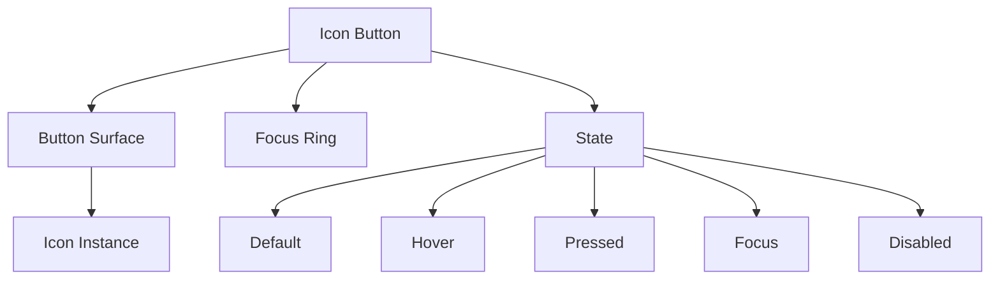
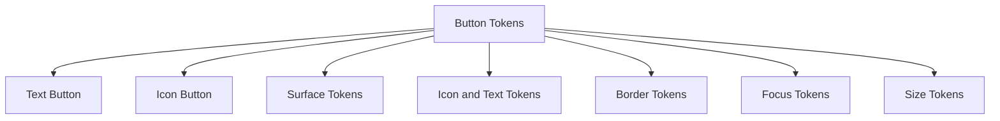
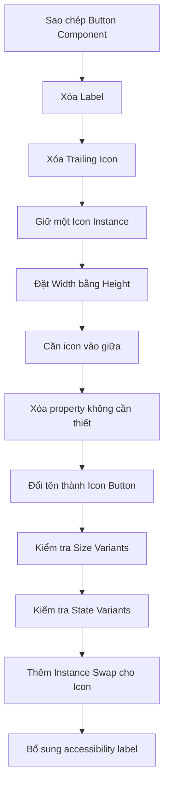

# 048 – Xây dựng Button Icon

## 1. Thông tin bài học

| Mục                       | Nội dung                                                                |
| ------------------------- | ----------------------------------------------------------------------- |
| **Module**                | Display & Feedback Components                                           |
| **Tên tiếng Việt**        | Thành phần hiển thị và phản hồi                                         |
| **Thời điểm trong video** | 3:13:47                                                                 |
| **Tên component**         | Button Icon / Icon Button                                               |
| **Chủ đề chính**          | Xây dựng nút chỉ chứa biểu tượng bằng cách tái sử dụng Button Component |
| **Thành phần liên quan**  | Button, Icon, Tooltip, Focus Ring                                       |

---

## 2. Mục tiêu bài học

Bài học hướng dẫn xây dựng một **Icon Button** — nút chỉ chứa biểu tượng, không có nhãn văn bản hiển thị trực tiếp.

Sau bài học, chúng ta có thể:

* Tái sử dụng Button Component đã xây dựng.
* Loại bỏ nhãn và các icon không cần thiết.
* Chuẩn hóa Icon Button thành hình vuông.
* Đồng bộ kích thước với Button thông thường.
* Tái sử dụng các trạng thái của Button.
* Làm sạch Component Properties.
* Cho phép hoán đổi biểu tượng.
* Xử lý nhãn truy cập cho nút chỉ có icon.

---

## 3. Icon Button là gì?

**Icon Button** là một nút tương tác chỉ hiển thị biểu tượng.

Ví dụ:

```text
┌──────┐
│  ×   │
└──────┘
```

Hoặc:

```text
┌──────┐
│  🔍  │
└──────┘
```

Icon Button thường được sử dụng cho những hành động quen thuộc như:

* Đóng cửa sổ.
* Tìm kiếm.
* Chỉnh sửa.
* Xóa.
* Tải xuống.
* Chia sẻ.
* Mở menu.
* Thêm vào mục yêu thích.
* Chuyển đến nội dung trước hoặc sau.
* Phát hoặc tạm dừng nội dung.

---

## 4. Icon Button khác Icon thông thường như thế nào?

Một biểu tượng chỉ là thành phần hình ảnh.

```text
Icon
└── Hình biểu tượng
```

Icon Button là một thành phần tương tác hoàn chỉnh.

```text
Icon Button
├── Interactive Surface
├── Icon
├── Hover State
├── Focus State
├── Pressed State
└── Disabled State
```

| Icon                                        | Icon Button                        |
| ------------------------------------------- | ---------------------------------- |
| Chỉ truyền đạt hình ảnh hoặc ý nghĩa        | Thực hiện một hành động            |
| Không nhất thiết có vùng tương tác          | Có vùng nhấn rõ ràng               |
| Không cần trạng thái tương tác              | Có Hover, Focus, Pressed, Disabled |
| Có thể dùng để trang trí                    | Phải có tên truy cập               |
| Không nhất thiết dùng semantic action token | Sử dụng action token               |

### Nguyên tắc quan trọng

Nếu một icon có thể được nhấn để thực hiện hành động, nên đặt icon đó bên trong **Icon Button**, thay vì sử dụng icon đơn lẻ.

---

## 5. Các trường hợp sử dụng phổ biến

### Nút đóng

```text
┌──────┐
│  ×   │
└──────┘
```

Dùng trong:

* Dialog.
* Snackbar.
* Modal.
* Drawer.
* Banner.
* Popover.

### Nút chỉnh sửa

```text
┌──────┐
│  ✎   │
└──────┘
```

### Nút xóa

```text
┌──────┐
│  🗑  │
└──────┘
```

### Nút yêu thích

```text
┌──────┐
│  ♡   │
└──────┘
```

### Nút mở menu

```text
┌──────┐
│  ⋮   │
└──────┘
```

---

# 6. Cấu trúc của Icon Button

Cấu trúc cơ bản:

```text
Icon Button
└── Icon
```

Cấu trúc đầy đủ trong Design System:

```text
Icon Button
├── Focus Ring
├── Button Surface
│   └── Icon Instance
└── Interaction States
```

### Sơ đồ component



---

# 7. Phương pháp xây dựng trong bài học

Thay vì tạo Icon Button hoàn toàn từ đầu, bài học tái sử dụng Button Component đã có.

Quy trình chính:

```text
Button hiện có
→ Sao chép component
→ Xóa nhãn
→ Xóa icon bên phải
→ Giữ icon bên trái
→ Đặt kích thước vuông
→ Xóa các property không còn dùng
→ Đổi tên thành Icon Button
```

### Lợi ích của phương pháp này

* Không cần xây dựng lại toàn bộ trạng thái.
* Giữ màu sắc nhất quán với Button.
* Giữ cùng border, radius và elevation.
* Tái sử dụng Focus Ring.
* Giảm thời gian tạo component.
* Hạn chế sự khác biệt giữa Button và Icon Button.

---

# 8. Các bước xây dựng Icon Button trong Figma

## Bước 1: Sao chép Button Component

Bắt đầu từ Button Component đã có đầy đủ:

* Style.
* Size.
* State.
* Icon.
* Focus Ring.
* Component Properties.

Ví dụ cấu trúc ban đầu:

```text
Button
├── Leading Icon
├── Label
└── Trailing Icon
```

Sao chép component hoặc component set để tạo phiên bản mới.

Đặt tên tạm thời:

```text
Button Icon
```

Hoặc:

```text
Icon Button
```

---

## Bước 2: Xóa nhãn

Xóa Text Layer đang hiển thị nội dung của Button.

Trước:

```text
┌───────────────────┐
│  ↓  Tải xuống     │
└───────────────────┘
```

Sau:

```text
┌──────┐
│  ↓   │
└──────┘
```

Khi xóa nhãn, cần kiểm tra lại:

* Auto Layout.
* Gap.
* Padding.
* Width.
* Height.
* Component Properties liên quan đến text.

---

## Bước 3: Xóa icon bên phải

Nếu Button ban đầu có cả Leading Icon và Trailing Icon, chỉ giữ lại một icon.

Cấu trúc sau khi đơn giản hóa:

```text
Icon Button
└── Leading Icon
```

Tên `Leading Icon` có thể đổi thành:

```text
Icon
```

Điều này giúp cấu trúc component rõ ràng hơn vì Icon Button không còn khái niệm icon trái hay phải.

---

## Bước 4: Đặt kích thước thành hình vuông

Icon Button cần có chiều rộng và chiều cao bằng nhau.

Trong bài học, kích thước ban đầu được cân nhắc là:

```text
44 × 44 px
```

Sau đó được điều chỉnh về:

```text
36 × 36 px
```

để đồng bộ với chiều cao Button hiện có.

### Quy tắc

```text
Icon Button width = Button height
Icon Button height = Button height
```

Ví dụ:

| Button size | Button height | Icon Button |
| ----------- | ------------: | ----------: |
| Small       |         32 px |  32 × 32 px |
| Medium      |         36 px |  36 × 36 px |
| Large       |         44 px |  44 × 44 px |

Điều này giúp Button và Icon Button có thể đứng cạnh nhau mà không bị lệch.

```text
┌───────────────┐ ┌──────┐
│ Lưu thay đổi  │ │  ×   │
└───────────────┘ └──────┘
```

---

## Bước 5: Căn icon vào giữa

Icon phải được căn chính giữa theo cả hai chiều.

Thiết lập:

```text
Horizontal alignment: Center
Vertical alignment: Center
```

Cấu trúc Auto Layout:

```text
Direction: Horizontal
Width: Fixed
Height: Fixed
Alignment: Center
```

Kết quả:

```text
┌────────┐
│        │
│   ×    │
│        │
└────────┘
```

Không nên để icon bị lệch sang một phía do padding cũ của Button.

---

## Bước 6: Kiểm tra kích thước icon

Kích thước icon cần phù hợp với kích thước Button.

| Button size | Icon size đề xuất |
| ----------- | ----------------: |
| 32 × 32 px  |        16 × 16 px |
| 36 × 36 px  |          18–20 px |
| 44 × 44 px  |          20–24 px |
| 48 × 48 px  |             24 px |

Ví dụ với Button `36 × 36 px`:

```text
Icon size: 20 × 20 px
```

Không nên để icon gần bằng toàn bộ Button:

```text
Button: 36 × 36 px
Icon: 32 × 32 px
```

Điều này khiến component chật và thiếu khoảng thở.

---

## Bước 7: Xóa các Component Properties không cần thiết

Sau khi xóa nhãn và Trailing Icon, các property liên quan cũng cần được xóa.

Ví dụ property không còn cần thiết:

```text
Label
Show label
Trailing icon
Show trailing icon
Trailing icon swap
```

Các property nên giữ lại:

```text
Icon
State
Size
Style
```

### Trước khi làm sạch

```text
Button Icon
├── Label = Button
├── Show label = True
├── Leading icon = Add
├── Show leading icon = True
├── Trailing icon = Chevron
└── Show trailing icon = False
```

### Sau khi làm sạch

```text
Icon Button
├── Icon = Add
├── State = Default
├── Size = Medium
└── Style = Primary
```

Việc làm sạch property giúp:

* Component dễ sử dụng.
* Panel Properties không bị rối.
* Tránh tùy chọn không còn tác dụng.
* Giảm lỗi khi chỉnh sửa instance.

---

# 9. Instance Swap cho biểu tượng

Icon Button nên có một **Instance Swap Property** để thay đổi icon.

```text
Icon = Close
Icon = Search
Icon = Edit
Icon = Delete
Icon = Download
```

Cấu trúc:

```text
Icon Button
└── Icon Instance
```

Property:

```text
Icon
```

### Ví dụ sử dụng

```text
Icon = Close
```

```text
Icon = More vertical
```

```text
Icon = Download
```

Người thiết kế không cần detach component để đổi hành động.

---

# 10. Các biến thể kích thước

Icon Button nên chia sẻ hệ thống kích thước với Button.

```text
Size = Small
Size = Medium
Size = Large
```

### Bộ kích thước đề xuất

| Size   |  Component |  Icon |
| ------ | ---------: | ----: |
| Small  | 32 × 32 px | 16 px |
| Medium | 36 × 36 px | 20 px |
| Large  | 44 × 44 px | 24 px |

### Sơ đồ

```text
Small          Medium           Large

┌────┐         ┌──────┐        ┌────────┐
│ ×  │         │  ×   │        │   ×    │
└────┘         └──────┘        └────────┘
32 px           36 px            44 px
```

Không nên tạo kích thước tùy ý không liên quan đến Button.

Ví dụ chưa nhất quán:

```text
Text Button height: 36 px
Icon Button: 41 × 41 px
```

---

# 11. Các biến thể kiểu dáng

Icon Button có thể dùng chung style với Button.

```text
Style = Primary
Style = Secondary
Style = Tertiary
Style = Ghost
Style = Destructive
```

## Primary

Dùng cho hành động quan trọng.

```text
┌──────┐
│  +   │
└──────┘
```

Có nền nổi bật.

---

## Secondary

Dùng cho hành động phụ.

```text
╭──────╮
│  ↓   │
╰──────╯
```

Có border hoặc nền nhẹ.

---

## Ghost

Không có nền hoặc border ở trạng thái mặc định.

```text
   ⋮
```

Khi Hover, nền tương tác mới xuất hiện.

Phù hợp với:

* Toolbar.
* Table action.
* Card action.
* Navigation bar.

---

## Destructive

Dùng cho thao tác có tính phá hủy.

```text
┌──────┐
│  🗑  │
└──────┘
```

Semantic token:

```text
action/destructive
```

---

# 12. Các trạng thái tương tác

Icon Button nên chia sẻ state với Button.

```text
State = Default
State = Hover
State = Pressed
State = Focus
State = Disabled
State = Loading
```

### Cấu trúc variant

```text
Icon Button
├── Default
├── Hover
├── Pressed
├── Focus
├── Disabled
└── Loading
```

---

## 12.1. Default

Trạng thái ban đầu.

```text
surface/action/default
icon/action/default
border/action/default
```

---

## 12.2. Hover

Khi người dùng di chuột lên nút:

```text
surface/action/hover
icon/action/hover
border/action/hover
```

Phản hồi có thể bao gồm:

* Đổi màu nền.
* Đổi màu icon.
* Đổi màu border.
* Thêm shadow nhẹ.

---

## 12.3. Pressed

Khi người dùng đang nhấn nút:

```text
surface/action/pressed
icon/action/pressed
border/action/pressed
```

Trạng thái Pressed nên khác Hover đủ rõ để người dùng nhận được phản hồi.

---

## 12.4. Focus

Focus state dành cho người dùng bàn phím.

Cấu trúc:

```text
Icon Button
├── Focus Ring
└── Button Surface
    └── Icon
```

Focus Ring nên:

* Bao quanh toàn bộ nút.
* Không bị Clip Content cắt.
* Có độ tương phản cao.
* Dùng token chung với các component khác.

```text
focus/ring/default
```

### Minh họa

```text
╭──────────╮
│ ┌──────┐ │
│ │  ×   │ │
│ └──────┘ │
╰──────────╯
```

---

## 12.5. Disabled

Disabled state dùng khi hành động tạm thời không khả dụng.

```text
surface/disabled
icon/disabled
border/disabled
```

Nút Disabled:

* Không có Hover.
* Không có Pressed.
* Không thực hiện hành động.
* Vẫn cần nhìn thấy được.

---

## 12.6. Loading

Với hành động không hoàn thành tức thì, icon có thể được thay bằng Loader.

```text
Icon Button
└── Loader
```

Ví dụ:

```text
┌──────┐
│  ◌   │
└──────┘
```

Khi Loading:

* Không nên cho phép nhấn lại.
* Không hiển thị icon hành động đồng thời với Loader.
* Cần có nhãn trạng thái cho công nghệ hỗ trợ.

---

# 13. Component Properties đề xuất

## 13.1. Icon Instance Swap

```text
Icon = Close
```

Cho phép thay đổi biểu tượng.

---

## 13.2. Size Variant

```text
Size = Small
Size = Medium
Size = Large
```

---

## 13.3. Style Variant

```text
Style = Primary
Style = Secondary
Style = Ghost
Style = Destructive
```

---

## 13.4. State Variant

```text
State = Default
State = Hover
State = Pressed
State = Focus
State = Disabled
State = Loading
```

---

## 13.5. Tooltip Boolean Property

Nếu Design System chứa Tooltip lồng bên trong:

```text
Show tooltip = True
Show tooltip = False
```

Tuy nhiên, Tooltip cũng có thể được quản lý ở cấp composition thay vì nằm trực tiếp trong Icon Button.

---

# 14. Bộ thuộc tính đề xuất

```text
Icon Button
├── Style
│   ├── Primary
│   ├── Secondary
│   ├── Ghost
│   └── Destructive
├── Size
│   ├── Small
│   ├── Medium
│   └── Large
├── State
│   ├── Default
│   ├── Hover
│   ├── Pressed
│   ├── Focus
│   ├── Disabled
│   └── Loading
└── Icon
    └── Instance Swap
```

### Số variant

Nếu tạo trực tiếp:

```text
4 Styles × 3 Sizes × 6 States
= 72 variants
```

Đây vẫn là số lượng có thể quản lý, nhưng cần cân nhắc liệu sản phẩm có thật sự cần tất cả tổ hợp hay không.

---

# 15. Dùng chung token với Button

Icon Button và Button nên dùng chung semantic token.



### Token màu

```text
button/surface/default
button/surface/hover
button/surface/pressed
button/surface/disabled
```

### Token nội dung

```text
button/content/default
button/content/hover
button/content/pressed
button/content/disabled
```

Text Button sử dụng token này cho text.

Icon Button sử dụng token này cho icon.

### Token border

```text
button/border/default
button/border/hover
button/border/pressed
button/border/disabled
```

### Token radius

```text
button/radius
```

### Token kích thước

```text
button/height/small
button/height/medium
button/height/large

button/icon-size/small
button/icon-size/medium
button/icon-size/large
```

---

# 16. Hình dạng của Icon Button

Icon Button có thể có nhiều hình dạng:

```text
Shape = Square
Shape = Rounded
Shape = Circle
```

## Square

```text
┌──────┐
│  ×   │
└──────┘
```

Phù hợp với:

* Toolbar.
* Table.
* Editor.

## Rounded

```text
╭──────╮
│  ×   │
╰──────╯
```

Phù hợp với đa số hệ thống giao diện.

## Circle

```text
  ╭────╮
  │ ×  │
  ╰────╯
```

Phù hợp với:

* Carousel control.
* Media control.
* Floating action.
* Image overlay.

Trong bài học, component được chuẩn hóa thành hình vuông; radius có thể tiếp tục kế thừa từ Button Component.

---

# 17. Accessibility: nhãn truy cập

Đây là vấn đề quan trọng nhất của Icon Button.

Người nhìn thấy giao diện có thể hiểu biểu tượng `×` là nút đóng, nhưng trình đọc màn hình không thể tự xác định ý nghĩa chính xác nếu không có nhãn.

Mỗi Icon Button cần có một tên truy cập.

### Ví dụ

| Icon         | Nhãn truy cập          |
| ------------ | ---------------------- |
| `×`          | Đóng                   |
| Kính lúp     | Tìm kiếm               |
| Thùng rác    | Xóa mục                |
| Bút chì      | Chỉnh sửa              |
| Ba chấm      | Mở thêm tùy chọn       |
| Mũi tên trái | Chuyển đến mục trước   |
| Trái tim     | Thêm vào mục yêu thích |

Không nên dùng tên file icon làm nhãn:

```text
close-24
icon-search
mdi-delete-outline
```

Nên dùng tên hành động:

```text
Đóng thông báo
Tìm kiếm bài học
Xóa người dùng
Chỉnh sửa hồ sơ
```

---

# 18. Tooltip cho Icon Button

Không phải biểu tượng nào cũng có ý nghĩa rõ ràng với mọi người dùng.

Nên thêm Tooltip khi:

* Icon có ý nghĩa không phổ biến.
* Có nhiều icon gần nhau.
* Hành động có thể gây nhầm lẫn.
* Nút không có nhãn hiển thị.

Ví dụ:

```text
┌─────────────┐
│ Tải xuống   │
└──────┬──────┘
       │
    ┌──────┐
    │  ↓   │
    └──────┘
```

Tooltip không thay thế nhãn truy cập.

Component vẫn cần:

```text
Accessible name = Tải xuống
```

---

# 19. Vùng tương tác

Kích thước trực quan và vùng tương tác có thể khác nhau.

Ví dụ:

```text
Icon: 20 × 20 px
Button: 36 × 36 px
```

Trong một số trường hợp mobile, vùng tương tác nên lớn hơn:

```text
Visual button: 36 × 36 px
Touch target: khoảng 44 × 44 px
```

Có thể xử lý bằng:

* Padding trong component.
* Wrapper tương tác.
* Khoảng cách giữa các nút.
* Kích thước variant riêng cho mobile.

Không nên sử dụng icon `20 × 20 px` trực tiếp làm toàn bộ vùng nhấn.

---

# 20. Khoảng cách giữa nhiều Icon Button

Khi đặt nhiều Icon Button cạnh nhau:

```text
[Edit] [Delete] [More]
```

nên sử dụng Auto Layout:

```text
Direction: Horizontal
Gap: 4–8 px
```

Ví dụ:

```text
┌──────┐  ┌──────┐  ┌──────┐
│  ✎   │  │  🗑  │  │  ⋮   │
└──────┘  └──────┘  └──────┘
```

Không nên đặt quá sát khiến người dùng bấm nhầm.

---

# 21. Ứng dụng trong Design System thực tế

## 21.1. Snackbar

```text
┌─────────────────────────────────────┐
│ Đã lưu thay đổi                [×] │
└─────────────────────────────────────┘
```

Nút đóng nên dùng Icon Button.

---

## 21.2. Table Action

```text
| Tên người dùng | Trạng thái | Hành động       |
|----------------|------------|-----------------|
| Nguyễn Văn A   | Hoạt động  | [✎] [🗑] [⋮]    |
```

Các hành động nên sử dụng Icon Button thay vì icon trần.

---

## 21.3. Toolbar

```text
[↶] [↷] [B] [I] [🔗] [⋮]
```

---

## 21.4. Card

```text
┌──────────────────────────┐
│ Tiêu đề bài viết     [♡] │
│                          │
│ Nội dung mô tả...        │
└──────────────────────────┘
```

---

## 21.5. Carousel

```text
[←]  [       Carousel content       ]  [→]
```

Navigation arrows nên được xây dựng từ Icon Button.

---

## 21.6. Media Player

```text
[⏮] [▶] [⏭] [🔊] [⛶]
```

---

# 22. Quy trình xây dựng tổng quát



---

# 23. Chuyển giao sang lập trình

Icon Button cần có tên truy cập dù không hiển thị text.

### HTML

```html
<button type="button" aria-label="Đóng thông báo">
  <svg aria-hidden="true">
    <!-- Close icon -->
  </svg>
</button>
```

Icon được đặt:

```html
aria-hidden="true"
```

vì tên hành động đã nằm trên Button.

### React

```jsx
<IconButton
  icon="close"
  ariaLabel="Đóng thông báo"
  onClick={handleClose}
/>
```

### Thuộc tính đề xuất

```text
icon
size
variant
disabled
loading
ariaLabel
onClick
```

### Lưu ý

Không nên chỉ truyền:

```text
icon="close"
```

và giả định hệ thống luôn biết accessible label.

Một icon có thể có ý nghĩa khác nhau theo ngữ cảnh.

Ví dụ icon `×` có thể mang nghĩa:

* Đóng dialog.
* Xóa tag.
* Hủy tìm kiếm.
* Xóa giá trị input.
* Dừng tác vụ.

---

# 24. Rủi ro và hạn chế

## 24.1. Icon khó hiểu

Không phải biểu tượng nào cũng có ý nghĩa phổ quát.

Ví dụ:

```text
◇
⌁
⇱
```

Người dùng có thể không biết chúng thực hiện hành động gì.

Giải pháp:

* Dùng icon quen thuộc.
* Thêm Tooltip.
* Cung cấp accessible label.
* Dùng Text Button nếu hành động khó diễn đạt bằng icon.

---

## 24.2. Không có nhãn truy cập

Đây là lỗi nghiêm trọng nhất.

Nút có thể hiển thị đẹp nhưng không sử dụng được với trình đọc màn hình.

Mỗi Icon Button phải có tên hành động rõ ràng.

---

## 24.3. Vùng tương tác quá nhỏ

Icon nhỏ không đồng nghĩa với nút phải nhỏ.

Một icon `16 px` vẫn cần vùng tương tác đủ lớn.

---

## 24.4. Xóa layer nhưng không xóa property

Nếu xóa Label và Trailing Icon nhưng vẫn giữ property, panel instance sẽ chứa các tùy chọn không có tác dụng.

Ví dụ:

```text
Label = Button
Show trailing icon = True
```

nhưng component không còn hai layer này.

Cần làm sạch property sau khi tái sử dụng Button.

---

## 24.5. Kích thước không đồng bộ với Button

Icon Button `44 px` đặt cạnh Text Button `36 px` có thể gây lệch hàng.

Nên dùng chung size token.

---

## 24.6. Trạng thái Focus bị thiếu

Icon Button thường nhỏ và xuất hiện nhiều trong toolbar, vì vậy Focus Ring đặc biệt quan trọng.

Không nên chỉ thiết kế Default và Hover.

---

## 24.7. Lạm dụng Icon Button

Không nên thay tất cả Text Button bằng Icon Button chỉ để tiết kiệm không gian.

Nên dùng Text Button khi:

* Hành động không có icon quen thuộc.
* Hành động quan trọng cần rõ ràng.
* Người dùng mới có thể không hiểu icon.
* Không gian giao diện vẫn đủ.

---

## 24.8. Hành động phá hủy không rõ ràng

Nút xóa chỉ có icon thùng rác có thể bị nhấn nhầm.

Nên cân nhắc:

* Destructive color.
* Tooltip.
* Confirmation.
* Undo Snackbar.
* Khoảng cách với các hành động khác.

---

# 25. Kiểm tra component

## Kiểm tra kích thước

```text
Small
Medium
Large
```

## Kiểm tra kiểu dáng

```text
Primary
Secondary
Ghost
Destructive
```

## Kiểm tra trạng thái

```text
Default
Hover
Pressed
Focus
Disabled
Loading
```

## Kiểm tra icon

```text
Close
Search
Edit
Delete
Download
More
Chevron Left
Chevron Right
```

## Kiểm tra ngữ cảnh

```text
Toolbar
Snackbar
Dialog
Table
Card
Carousel
Mobile navigation
```

## Kiểm tra accessibility

* Có accessible label hay chưa?
* Focus Ring có nhìn thấy không?
* Có thể dùng bàn phím không?
* Tooltip có xuất hiện khi hover và focus không?
* Disabled state có được truyền đạt chính xác không?

---

# 26. Câu hỏi ôn tập

## Câu 1: Mục đích chính của Build a Button Icon là gì?

Mục đích chính là xây dựng một nút chỉ chứa biểu tượng, có kích thước và trạng thái nhất quán với Button Component đã có.

Icon Button được sử dụng cho các hành động ngắn, quen thuộc và cần giao diện nhỏ gọn như đóng, chỉnh sửa, xóa, tìm kiếm hoặc mở menu.

---

## Câu 2: Áp dụng vào Design System thực tế như thế nào?

Có thể áp dụng bằng cách:

1. Sao chép Button Component hiện có.
2. Xóa nhãn và icon không cần thiết.
3. Giữ một Icon Instance duy nhất.
4. Đặt chiều rộng bằng chiều cao Button.
5. Dùng chung size, style và state token với Button.
6. Thêm Instance Swap Property cho icon.
7. Xóa các property không còn sử dụng.
8. Bổ sung quy định về accessible label và Tooltip.
9. Tái sử dụng Icon Button trong Snackbar, Dialog, Table, Card và Carousel.

---

## Câu 3: Các bước và ý tưởng chính được trình bày là gì?

Các bước chính gồm:

1. Tái sử dụng Button Component thay vì tạo từ đầu.
2. Xóa Label.
3. Xóa Trailing Icon.
4. Giữ Leading Icon.
5. Đổi tên layer thành Icon.
6. Chuẩn hóa component thành hình vuông.
7. Đặt kích thước `36 × 36 px` để đồng bộ với Button.
8. Xóa property liên quan đến Label và Trailing Icon.
9. Giữ lại các property cần thiết cho icon, kích thước và trạng thái.
10. Tạo Icon Button có thể tái sử dụng.

---

## Câu 4: Rủi ro hoặc hạn chế cần lưu ý là gì?

Các rủi ro chính gồm:

* Biểu tượng không đủ rõ ràng.
* Thiếu nhãn truy cập.
* Vùng tương tác quá nhỏ.
* Thiếu Focus State.
* Kích thước không đồng bộ với Button.
* Component còn property thừa.
* Dùng Icon Button cho hành động khó hiểu.
* Nút phá hủy dễ bị nhấn nhầm.
* Tooltip bị xem như sự thay thế cho accessible label.

---

# 27. Checklist hoàn thiện Icon Button

* [ ] Component chỉ chứa một icon
* [ ] Width bằng Height
* [ ] Kích thước đồng bộ với Button
* [ ] Icon được căn chính giữa
* [ ] Có Instance Swap Property cho icon
* [ ] Không còn Label Property
* [ ] Không còn Trailing Icon Property
* [ ] Có Size Variant
* [ ] Có Style Variant
* [ ] Có Default State
* [ ] Có Hover State
* [ ] Có Pressed State
* [ ] Có Focus State
* [ ] Có Disabled State
* [ ] Có Loading State nếu cần
* [ ] Focus Ring dùng token chung
* [ ] Màu sử dụng semantic token
* [ ] Vùng tương tác đủ lớn
* [ ] Có accessible label
* [ ] Có Tooltip cho icon khó hiểu
* [ ] Kiểm tra Light Mode
* [ ] Kiểm tra Dark Mode
* [ ] Kiểm tra bằng bàn phím
* [ ] Kiểm tra trong Snackbar, Table và Carousel

---

# 28. Tóm tắt bài học

Bài học xây dựng **Icon Button** bằng cách tái sử dụng Button Component đã có, thay vì tạo một component hoàn toàn mới.

Quy trình:

```text
Button
├── Leading Icon
├── Label
└── Trailing Icon
```

được rút gọn thành:

```text
Icon Button
└── Icon
```

Các bước quan trọng gồm:

```text
Sao chép Button
→ Xóa Label
→ Xóa Trailing Icon
→ Giữ một icon
→ Đặt kích thước 36 × 36 px
→ Căn icon vào giữa
→ Xóa các property thừa
```

Icon Button nên dùng chung với Button về:

* Kích thước.
* Màu sắc.
* Border.
* Radius.
* Focus Ring.
* Hover.
* Pressed.
* Disabled.

Cấu trúc thuộc tính đề xuất:

```text
Icon Button
├── Style
├── Size
├── State
└── Icon Instance Swap
```

Điểm quan trọng nhất khi sử dụng Icon Button là khả năng tiếp cận. Mỗi nút phải có tên hành động rõ ràng, vùng tương tác đủ lớn và Focus State dễ nhận biết. Icon Button chỉ nên được sử dụng khi biểu tượng có ý nghĩa rõ ràng hoặc được hỗ trợ bằng Tooltip phù hợp.
