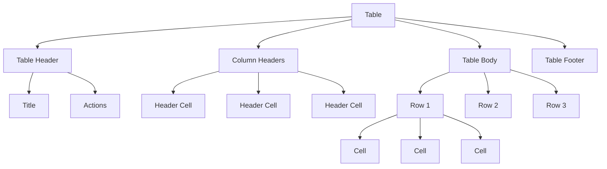
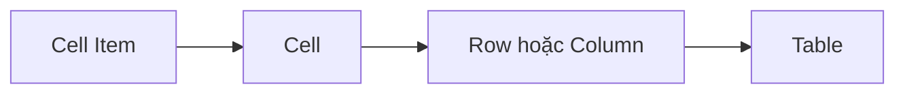
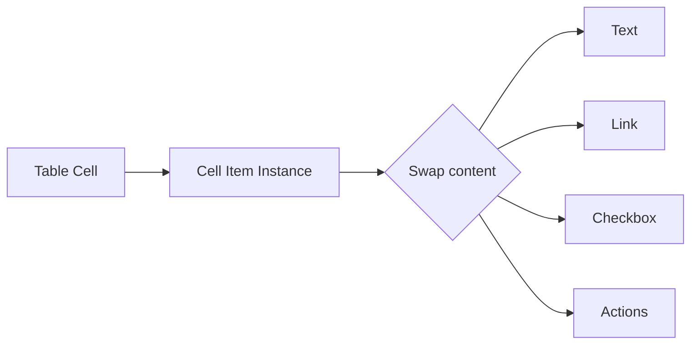
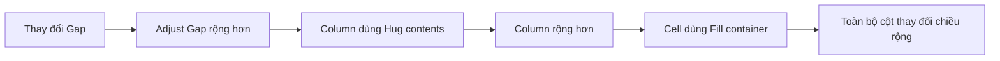
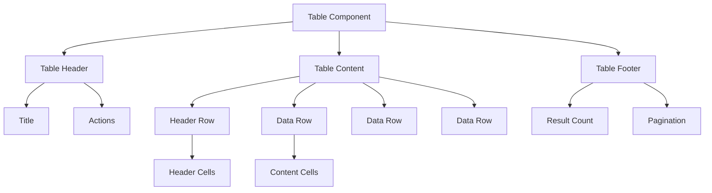
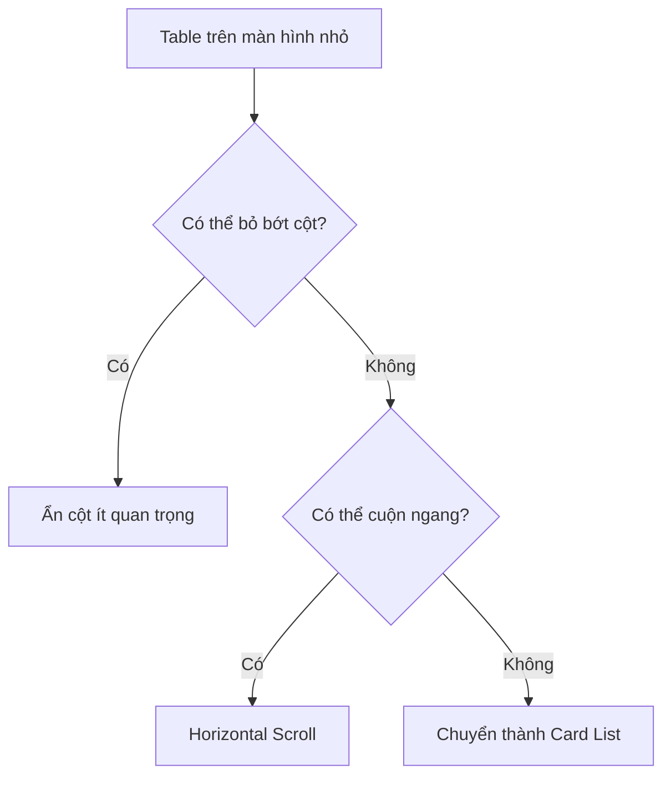
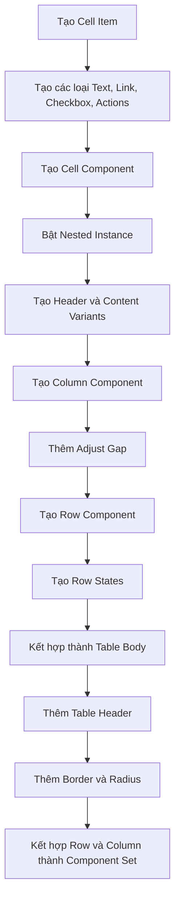

# 049 – Xây dựng Table Component

## 1. Thông tin bài học

| Mục                       | Nội dung                                               |
| ------------------------- | ------------------------------------------------------ |
| **Module**                | Display & Feedback Components                          |
| **Tên tiếng Việt**        | Thành phần hiển thị và phản hồi                        |
| **Thời điểm trong video** | 3:15:26                                                |
| **Chủ đề chính**          | Xây dựng bảng dữ liệu từ Cell, Row, Column và Header   |
| **Thành phần liên quan**  | Text, Checkbox, Link, Icon Button, Button, Auto Layout |

---

## 2. Mục tiêu bài học

Bài học hướng dẫn xây dựng một **Table Component** trong Figma bằng cách phân tách bảng thành các thành phần nhỏ có thể tái sử dụng.

Sau bài học, chúng ta có thể:

* Xây dựng nhiều loại Table Cell.
* Tạo Header Cell và Content Cell.
* Tạo hàng hoặc cột từ các Cell Instance.
* Kết hợp Row, Column và Header thành bảng hoàn chỉnh.
* Hoán đổi nội dung trong Cell bằng Nested Instance.
* Điều chỉnh chiều rộng cột mà không phải detach component.
* Áp dụng token cho khoảng cách, màu nền, đường viền và typography.
* Tạo các trạng thái Hover, Selected và Striped.
* Thêm tiêu đề và hành động cho bảng.

---

## 3. Table Component là gì?

**Table** là thành phần dùng để trình bày dữ liệu có cấu trúc theo hàng và cột.

Ví dụ:

| Tên          | Vai trò       | Trạng thái | Hành động |
| ------------ | ------------- | ---------- | --------- |
| Nguyễn Văn A | Designer      | Hoạt động  | Sửa       |
| Trần Văn B   | Developer     | Tạm khóa   | Xem       |
| Lê Thị C     | Product Owner | Hoạt động  | Sửa       |

Table phù hợp khi người dùng cần:

* Đọc nhiều bản ghi.
* So sánh dữ liệu.
* Sắp xếp hoặc lọc dữ liệu.
* Chọn nhiều dòng.
* Thực hiện hành động trên từng bản ghi.
* Xem trạng thái của nhiều đối tượng cùng lúc.

---

## 4. Cấu trúc tổng quát của Table

Một Table hoàn chỉnh có thể được phân tách như sau:

```text
Table
├── Table Header
│   ├── Title
│   └── Actions
├── Column Headers
│   ├── Header Cell
│   ├── Header Cell
│   └── Header Cell
├── Table Body
│   ├── Row
│   │   ├── Cell
│   │   ├── Cell
│   │   └── Cell
│   ├── Row
│   └── Row
└── Table Footer
    └── Pagination
```

### Sơ đồ phân cấp



---

# 5. Tư duy xây dựng Table trong Figma

Figma không phải công cụ được thiết kế chuyên biệt để xử lý bảng dữ liệu như spreadsheet. Vì vậy, Table Component thường phức tạp hơn các component khác.

Cách tiếp cận phù hợp là:

```text
Cell
→ Row hoặc Column
→ Table Body
→ Table Container
```

Không nên bắt đầu bằng cách vẽ toàn bộ bảng rồi mới biến nó thành component.

Thay vào đó, nên xây dựng từ thành phần nhỏ nhất:



---

# 6. Xây dựng Cell Item

## 6.1. Cell Item là gì?

`Cell Item` là nội dung được đặt bên trong một Table Cell.

Một ô có thể chứa:

* Văn bản.
* Checkbox.
* Link.
* Icon.
* Badge.
* Tag.
* Avatar.
* Nhiều nút hành động.

Trong bài học, các loại nội dung như Link, Icon và nhóm hành động được đưa vào Cell để tạo ra nhiều trường hợp sử dụng khác nhau.

### Cấu trúc

```text
Cell
└── Cell Item
```

`Cell Item` có thể trở thành một nested component được hoán đổi trên từng instance.

---

## 6.2. Các biến thể Cell Item

```text
Cell Item
├── Type = Text
├── Type = Checkbox
├── Type = Link
├── Type = Icon
├── Type = Status
└── Type = Actions
```

### Cell dạng văn bản

```text
Nguyễn Văn A
```

### Cell dạng Checkbox

```text
☐
```

### Cell dạng Link

```text
Xem chi tiết
```

### Cell dạng trạng thái

```text
● Hoạt động
```

### Cell dạng hành động

```text
[View] [Edit] [More]
```

Bài học đề xuất có thể đặt nhiều icon kích thước khoảng `20 × 20 px` trong một Action Cell để thực hiện các thao tác như xem, chỉnh sửa hoặc mở thêm tùy chọn.

---

## 6.3. Cấu trúc Cell Item đề xuất

```text
Cell Item
├── Checkbox
├── Icon
├── Text
├── Link
└── Actions
    ├── View Icon Button
    ├── Edit Icon Button
    └── More Icon Button
```

Không phải tất cả layer đều xuất hiện cùng lúc. Chúng có thể được quản lý bằng:

* Variant Property.
* Boolean Property.
* Instance Swap.
* Nested Instance.

---

# 7. Tạo Cell Component

Sau khi có Cell Item, đặt nó vào một Auto Layout Frame.

```text
Cell
└── Cell Item Instance
```

Thiết lập đề xuất:

```text
Direction: Horizontal
Width: Fixed hoặc Fill container
Height: Fixed hoặc Hug contents
Alignment: Center left
Padding horizontal: 12–16 px
Padding vertical: 10–12 px
```

Tên component:

```text
Table/Cell
```

Hoặc:

```text
.Table Cell
```

nếu đây là component nội bộ chưa muốn xuất bản.

---

## 7.1. Nested Instance trong Cell

Cell nên chứa một Nested Instance để người thiết kế có thể hoán đổi nội dung.

Ví dụ:

```text
Cell content = Text
Cell content = Link
Cell content = Checkbox
Cell content = Actions
```

Transcript mô tả việc bật Nested Instance để người dùng có thể hoán đổi Cell Item từ nội dung văn bản sang Link hoặc Action trực tiếp trên instance.

### Sơ đồ hoạt động



---

# 8. Header Cell và Content Cell

Một Cell có thể có ít nhất hai loại:

```text
Type = Header
Type = Content
```

---

## 8.1. Content Cell

Dùng trong phần thân bảng.

Thiết lập typography:

```text
Typography: Body Medium
Text color: Text Primary hoặc Text Secondary
```

Ví dụ:

```text
Nguyễn Văn A
```

---

## 8.2. Header Cell

Dùng để mô tả ý nghĩa của cột.

Thiết lập:

```text
Typography: Body Medium Semibold
Text color: Text Strong
Background: Surface Subtle
```

Ví dụ:

```text
Họ và tên
```

Header có thể sử dụng:

* Nền mạnh hơn Content Cell.
* Typography đậm hơn.
* Biểu tượng sắp xếp.
* Tooltip giải thích nội dung.

Trong bài học, Header Cell được phân biệt bằng typography semibold và có thể sử dụng một surface khác để làm nổi bật hàng tiêu đề.

---

## 8.3. Header có khả năng sắp xếp

Header Cell có thể chứa:

```text
Tên người dùng  ↑
```

Property đề xuất:

```text
Sortable = True / False
Sort direction = None / Ascending / Descending
```

Cấu trúc:

```text
Header Cell
├── Label
└── Sort Icon
```

---

# 9. Hai cách xây dựng Table

Một Table có thể được xây dựng theo hai hướng:

## Cách 1: Row-based Table

```text
Table
├── Header Row
├── Data Row
├── Data Row
└── Data Row
```

## Cách 2: Column-based Table

```text
Table
├── Column
├── Column
├── Column
└── Column
```

Bài học xây dựng cả hai kiểu để có thể hoán đổi tùy trường hợp sử dụng.

---

# 10. Xây dựng Column Component

## 10.1. Cấu trúc cột

Một cột gồm:

```text
Column
├── Header Cell
├── Content Cell
├── Content Cell
├── Content Cell
└── Content Cell
```

Thiết lập Auto Layout:

```text
Direction: Vertical
Gap: 0
Width: Fixed hoặc Hug contents
Height: Hug contents
```

Các Cell trong cột phải:

* Căn trái nhất quán.
* Có cùng chiều rộng.
* Có đường phân cách.
* Có chiều cao hàng tương ứng với các cột khác.

Transcript nhấn mạnh việc giữ các Cell căn trái và ghép nhiều Column Component để tạo thành bảng.

---

## 10.2. Đường phân cách

Có thể thêm stroke phía dưới mỗi Cell:

```text
Border bottom: 1 px
```

Token:

```text
border/table/default
```

Hoặc dùng đường viền ngoài:

```text
Border: 1 px
```

Điều quan trọng là tránh các đường viền chồng lên nhau khiến một số đường trở thành `2 px`.

---

# 11. Điều chỉnh chiều rộng cột

## 11.1. Vấn đề

Không phải tất cả cột đều cần cùng chiều rộng.

Ví dụ:

| Cột        | Chiều rộng |
| ---------- | ---------: |
| Checkbox   |      48 px |
| Tên        |     180 px |
| Mô tả      |     320 px |
| Trạng thái |     140 px |
| Hành động  |     120 px |

Nếu mỗi Column là một component instance, việc thay đổi chiều rộng có thể bị hạn chế và khiến người thiết kế phải detach component.

---

## 11.2. Kỹ thuật Adjust Gap

Bài học tái sử dụng kỹ thuật `Adjust Gap` từng áp dụng cho Progress Bar.

Cấu trúc:

```text
Adjust Gap
├── Ellipse 1: 0 × 0
└── Ellipse 2: 0 × 0
```

Hai ellipse nằm trong một Auto Layout Frame:

```text
Width: Hug contents
Height: Hug contents
Gap: Giá trị tùy chỉnh
```

Sau đó đặt `Adjust Gap` vào Column Component.

```text
Column
├── Adjust Gap
├── Header Cell
├── Content Cell
└── Content Cell
```

Khoảng cách giữa hai ellipse sẽ quyết định chiều rộng của cột.

Transcript mô tả việc đặt hai phần tử về `0 × 0`, dùng Auto Layout `Hug contents`, sau đó thay đổi giá trị khoảng cách để mở rộng cột mà không phải phá vỡ component.

---

## 11.3. Luồng hoạt động



### Ví dụ

```text
Gap = 120 px → Column width khoảng 120 px
Gap = 200 px → Column width khoảng 200 px
Gap = 320 px → Column width khoảng 320 px
```

---

## 11.4. Thiết lập cần thiết

Để kỹ thuật hoạt động:

```text
Adjust Gap: Hug contents
Column: Hug contents
Cells: Fill container
```

Nếu Cell không đặt thành `Fill container`, Cell có thể không mở rộng theo Column.

---

# 12. Xây dựng Row Component

## 12.1. Cấu trúc hàng

Một Row gồm nhiều Cell đặt cạnh nhau:

```text
Row
├── Cell
├── Cell
├── Cell
├── Cell
└── Cell
```

Thiết lập:

```text
Direction: Horizontal
Gap: 0
Width: Hug contents hoặc Fill container
Height: Fixed hoặc Hug contents
```

Trong bài học, nhiều Cell được đặt cạnh nhau với Gap bằng `0` để tạo một hàng bảng. Các Cell thử nghiệm có chiều rộng đồng nhất khoảng `130 px`.

---

## 12.2. Header Row

Header Row sử dụng Header Cell:

```text
Header Row
├── Header Cell
├── Header Cell
├── Header Cell
└── Header Cell
```

Content Row sử dụng Content Cell:

```text
Content Row
├── Content Cell
├── Content Cell
├── Content Cell
└── Content Cell
```

---

# 13. Row States

Một Row Component trong Design System nên hỗ trợ các trạng thái:

```text
State = Default
State = Hover
State = Selected
State = Disabled
```

Có thể thêm:

```text
Stripe = Even
Stripe = Odd
```

---

## 13.1. Default

```text
Background: Surface Default
Text: Text Primary
```

---

## 13.2. Hover

Dùng khi người dùng di chuột lên một hàng.

```text
Background: Surface Action Hover Light
```

Ví dụ:

```text
Default row
────────────────────────────────

Hover row
████████████████████████████████
```

Hover giúp người dùng dễ theo dõi dữ liệu theo chiều ngang.

---

## 13.3. Selected

Dùng khi người dùng chọn một hoặc nhiều hàng.

```text
Background: Surface Selected
Border: Border Selected
```

Selected có thể đi kèm Checkbox:

```text
☑ Nguyễn Văn A | Designer | Hoạt động
```

Không nên chỉ dùng màu nền để thể hiện trạng thái Selected. Checkbox hoặc icon nên thay đổi đồng thời.

---

## 13.4. Striped Rows

Striped Table sử dụng nền xen kẽ giữa các hàng.

```text
Row 1: Surface Default
Row 2: Surface Subtle
Row 3: Surface Default
Row 4: Surface Subtle
```

Ví dụ:

```text
────────────────────────────────
Row 1
░░░░░░░░░░░░░░░░░░░░░░░░░░░░░░░░
Row 2
────────────────────────────────
Row 3
░░░░░░░░░░░░░░░░░░░░░░░░░░░░░░░░
Row 4
```

Striped Rows hữu ích khi:

* Bảng có nhiều cột.
* Người dùng cần theo dõi dữ liệu ngang.
* Không có Hover trên thiết bị cảm ứng.

---

## 13.5. Variant đề xuất

```text
Table Row
├── State
│   ├── Default
│   ├── Hover
│   ├── Selected
│   └── Disabled
└── Stripe
    ├── None
    ├── Even
    └── Odd
```

Không nhất thiết phải tạo variant cho mọi tổ hợp nếu token hoặc property có thể xử lý đơn giản hơn.

---

# 14. Kết hợp Row thành Table

Cấu trúc:

```text
Table Body
├── Header Row
├── Data Row
├── Data Row
├── Data Row
└── Data Row
```

Thiết lập Auto Layout:

```text
Direction: Vertical
Gap: 0
Width: Hug contents hoặc Fill container
Height: Hug contents
```

Mỗi Row cần có:

* Cùng số lượng Cell.
* Cùng chiều rộng từng cột.
* Cùng chiều cao hoặc quy tắc chiều cao.
* Cùng thứ tự dữ liệu.

---

# 15. Hoán đổi Row Table và Column Table

Bài học kết hợp Row Table và Column Table thành một Component Set.

```text
Table
├── Type = Row
└── Type = Column
```

Điều này cho phép người thiết kế thay đổi cách xây dựng bảng tùy vào loại dữ liệu.

Transcript mô tả việc kết hợp hai cấu trúc thành một bộ component với thuộc tính `Type`, cho phép hoán đổi giữa bảng xây dựng theo hàng và bảng xây dựng theo cột.

### Khi dùng Row-based

* Các dòng thay đổi thường xuyên.
* Dữ liệu được quản lý theo từng bản ghi.
* Cần thay đổi trạng thái Hover hoặc Selected theo hàng.

### Khi dùng Column-based

* Cần điều chỉnh chiều rộng từng cột linh hoạt.
* Cột có nhiều loại chiều rộng khác nhau.
* Muốn chỉnh sửa nội dung theo từng trường dữ liệu.

---

# 16. Thêm Table Header

Table Header nằm phía trên bảng và khác với Column Header.

```text
Table Header
├── Title
├── Description
└── Actions
```

Ví dụ:

```text
Người dùng                              [Xuất Excel] [Thêm mới]
Danh sách tài khoản đang hoạt động
```

Trong bài học, một tiêu đề như “My Advisors” được đặt phía trên bảng, sử dụng typography heading và Auto Layout để tạo khoảng cách với dữ liệu.

---

## 16.1. Cấu trúc Table Header

```text
Table Header
├── Title Group
│   ├── Title
│   └── Description
└── Action Group
    ├── Secondary Button
    └── Primary Button
```

Thiết lập:

```text
Direction: Horizontal
Width: Fill container
Alignment: Center
Spacing mode: Space between
```

---

## 16.2. Component Properties

```text
Show title = True / False
Show description = True / False
Show actions = True / False
```

Text Properties:

```text
Table title
Table description
```

Nested Instances:

```text
Primary action
Secondary action
```

---

# 17. Table Container

Sau khi có Header và Body, đặt chúng trong Table Container.

```text
Table
├── Table Header
└── Table Body
```

Thiết lập đề xuất:

```text
Direction: Vertical
Gap: 0 hoặc 12–24 px
Width: Hug contents hoặc Fill container
Height: Hug contents
```

Có thể thêm:

```text
Border: 1 px
Radius: 8 px
Clip content: On
```

Trong bài học, bảng được hoàn thiện với border ngoài `1 px` và radius khoảng `8 px`.

---

# 18. Cấu trúc Table hoàn chỉnh

```text
Table
├── Table Header
│   ├── Title Group
│   │   ├── Title
│   │   └── Description
│   └── Actions
├── Table Content
│   ├── Header Row
│   ├── Data Row
│   ├── Data Row
│   └── Data Row
└── Table Footer
    ├── Result Count
    └── Pagination
```

### Sơ đồ hoàn chỉnh



---

# 19. Design Token đề xuất

## 19.1. Spacing token

```text
table/cell/padding-x
table/cell/padding-y
table/header/gap
table/action/gap
table/row/gap
```

Ánh xạ với token hệ thống:

```text
table/cell/padding-x → spacing/16
table/cell/padding-y → spacing/12
table/header/gap → spacing/24
```

---

## 19.2. Border token

```text
table/border/default
table/border/strong
table/row/divider
table/row/selected
```

Thông thường:

```text
Border width: 1 px
```

---

## 19.3. Surface token

```text
table/surface/default
table/surface/header
table/surface/hover
table/surface/selected
table/surface/stripe
table/surface/disabled
```

---

## 19.4. Text token

```text
table/text/header
table/text/content
table/text/secondary
table/text/disabled
```

---

## 19.5. Radius token

```text
table/radius
```

Có thể ánh xạ tới:

```text
radius/component/medium
```

---

# 20. Component Properties đề xuất

## Table Cell

```text
Cell
├── Type
│   ├── Header
│   └── Content
├── Content
│   └── Instance Swap
├── Alignment
│   ├── Left
│   ├── Center
│   └── Right
└── Density
    ├── Compact
    ├── Default
    └── Comfortable
```

---

## Table Row

```text
Row
├── Type
│   ├── Header
│   └── Content
├── State
│   ├── Default
│   ├── Hover
│   ├── Selected
│   └── Disabled
└── Stripe
    ├── None
    ├── Even
    └── Odd
```

---

## Table

```text
Table
├── Structure
│   ├── Row
│   └── Column
├── Show title
│   ├── True
│   └── False
├── Show actions
│   ├── True
│   └── False
├── Show footer
│   ├── True
│   └── False
└── Density
    ├── Compact
    ├── Default
    └── Comfortable
```

---

# 21. Căn chỉnh dữ liệu

Không phải tất cả nội dung đều căn trái.

| Loại dữ liệu | Căn chỉnh đề xuất |
| ------------ | ----------------- |
| Văn bản      | Trái              |
| Tên          | Trái              |
| Email        | Trái              |
| Số lượng     | Phải              |
| Tiền tệ      | Phải              |
| Phần trăm    | Phải              |
| Trạng thái   | Trái hoặc giữa    |
| Checkbox     | Giữa              |
| Hành động    | Phải hoặc giữa    |

### Property

```text
Alignment = Left
Alignment = Center
Alignment = Right
```

---

# 22. Table Density

Table có thể hỗ trợ nhiều mức mật độ.

| Density     | Padding dọc | Mục đích              |
| ----------- | ----------: | --------------------- |
| Compact     |      6–8 px | Bảng dữ liệu lớn      |
| Default     |    10–12 px | Sử dụng phổ biến      |
| Comfortable |       16 px | Bảng đơn giản, dễ đọc |

Property:

```text
Density = Compact
Density = Default
Density = Comfortable
```

Không nên thay đổi riêng lẻ chiều cao từng hàng mà không có quy tắc.

---

# 23. Responsive Table

Table thường khó thích nghi với màn hình nhỏ.

## Desktop

```text
| Name | Email | Role | Status | Actions |
```

## Tablet

Có thể:

* Giảm padding.
* Ẩn cột phụ.
* Cho phép cuộn ngang.

## Mobile

Có thể chuyển từ Table sang Card List:

```text
┌────────────────────────┐
│ Nguyễn Văn A           │
│ Designer               │
│ user@example.com       │
│ Hoạt động        [⋮]   │
└────────────────────────┘
```

### Sơ đồ quyết định



---

# 24. Empty, Loading và Error States

Table không chỉ có trạng thái chứa dữ liệu.

## Loading

```text
Đang tải dữ liệu…
```

Có thể dùng:

* Skeleton Row.
* Loader.
* Progress Bar.

## Empty

```text
Chưa có dữ liệu
Thêm bản ghi đầu tiên để bắt đầu.
```

## Error

```text
Không thể tải dữ liệu
[Thử lại]
```

Các trạng thái này nên nằm trong vùng Table Body và giữ cấu trúc Header nếu cần.

---

# 25. Selection

Table có thể hỗ trợ chọn một hoặc nhiều hàng.

## Chọn một hàng

```text
○ Row 1
● Row 2
○ Row 3
```

## Chọn nhiều hàng

```text
☐ Header
☑ Row 1
☑ Row 2
☐ Row 3
```

Header Checkbox có thể có trạng thái:

```text
Unchecked
Checked
Indeterminate
```

Khi có hàng được chọn, Table Header có thể chuyển thành Selection Toolbar:

```text
Đã chọn 2 mục                      [Xóa] [Xuất]
```

---

# 26. Sorting

Header Cell có thể hỗ trợ sắp xếp.

```text
Tên ↑
```

```text
Tên ↓
```

```text
Tên ↕
```

Property:

```text
Sort = None
Sort = Ascending
Sort = Descending
```

Cần giữ:

* Icon và nhãn căn chỉnh nhất quán.
* Vùng tương tác đủ lớn.
* Trạng thái Focus rõ ràng.
* Thông báo hướng sắp xếp cho công nghệ hỗ trợ.

---

# 27. Khả năng tiếp cận

Table trong sản phẩm thật cần truyền đạt đúng quan hệ giữa Header và Cell.

Cần bảo đảm:

* Header mô tả chính xác cột.
* Thứ tự đọc hợp lý.
* Không dùng màu làm tín hiệu duy nhất.
* Row Selected có trạng thái rõ ràng.
* Checkbox có nhãn truy cập.
* Icon Button có accessible label.
* Header Sort mô tả hướng sắp xếp.
* Focus không bị mất khi tương tác.

Ví dụ nhãn:

```text
Chọn Nguyễn Văn A
Chỉnh sửa Nguyễn Văn A
Xóa Nguyễn Văn A
Sắp xếp theo tên tăng dần
```

---

# 28. Rủi ro và hạn chế

## 28.1. Figma không xử lý bảng như spreadsheet

Figma không có hệ thống cột và hàng liên kết như Excel hoặc Google Sheets.

Khi thay đổi chiều rộng một cột, các hàng hoặc cột khác có thể không tự đồng bộ.

Giải pháp:

* Xây dựng cấu trúc component rõ ràng.
* Dùng Adjust Gap.
* Dùng cùng size token.
* Hạn chế detach component.

---

## 28.2. Row-based và Column-based không tự đồng bộ

Nếu vừa xây dựng theo hàng vừa xây dựng theo cột, việc cập nhật dữ liệu có thể phức tạp.

Nên chọn một cấu trúc chính cho từng loại bảng.

---

## 28.3. Quá nhiều variant

Nếu kết hợp:

```text
6 Cell Types
× 3 Alignments
× 3 Densities
× 4 States
```

sẽ tạo:

```text
216 variants
```

Nên kết hợp:

* Variant Property.
* Nested Instance.
* Boolean Property.
* Instance Swap.
* Variables.

---

## 28.4. Nội dung dài làm vỡ bố cục

Một mô tả dài có thể làm cột quá rộng hoặc tăng chiều cao hàng.

Cần xác định:

```text
Text wrapping
Truncation
Maximum lines
Tooltip
Column minimum width
Column maximum width
```

---

## 28.5. Các hàng không đồng bộ chiều cao

Nếu một Cell có hai dòng nhưng các Cell khác có một dòng, Row cần tự tăng chiều cao đồng bộ.

Nên sử dụng:

```text
Row height: Hug contents
Cells: Fill container theo chiều cao
```

---

## 28.6. Đường viền bị chồng

Nếu tất cả Cell đều có border đầy đủ, đường giữa hai Cell có thể thành `2 px`.

Giải pháp:

* Chỉ dùng Border Bottom.
* Chỉ dùng Border Right cho một phía.
* Dùng divider ở cấp Row.
* Dùng Grid container trong sản phẩm thật.

---

## 28.7. Table không phù hợp với mobile

Không nên cố ép bảng nhiều cột vào màn hình nhỏ.

Có thể:

* Ẩn cột.
* Cuộn ngang.
* Chuyển sang Card List.
* Hiển thị màn hình chi tiết riêng.

---

## 28.8. Quá nhiều hành động trong một Cell

Action Cell chứa quá nhiều icon có thể:

* Gây khó hiểu.
* Tăng nguy cơ bấm nhầm.
* Làm cột quá rộng.

Nên giữ:

```text
1–2 hành động phổ biến
+ More Menu
```

---

# 29. Quy trình xây dựng tổng quát



---

# 30. Câu hỏi ôn tập

## Câu 1: Mục đích chính của Build a Table là gì?

Mục đích chính là xây dựng một hệ thống Table Component có thể tái sử dụng, gồm:

* Cell.
* Header Cell.
* Row.
* Column.
* Table Header.
* Table Body.

Table được xây dựng dựa trên Auto Layout và design token để trình bày dữ liệu một cách nhất quán.

---

## Câu 2: Áp dụng vào Design System thực tế như thế nào?

Có thể áp dụng bằng cách:

1. Tạo Cell Item cho văn bản, Checkbox, Link và Action.
2. Đặt Cell Item vào Cell Component.
3. Sử dụng Nested Instance để hoán đổi nội dung.
4. Tạo Header Cell và Content Cell.
5. Xây dựng Row hoặc Column từ Cell Instance.
6. Dùng Adjust Gap để điều chỉnh chiều rộng cột.
7. Tạo các trạng thái Hover, Selected và Striped.
8. Áp dụng spacing, border, surface và typography token.
9. Thêm Table Header, Footer và Pagination.
10. Viết tài liệu về alignment, density và responsive behavior.

---

## Câu 3: Các bước và ý tưởng chính được trình bày là gì?

Các ý tưởng chính gồm:

1. Xây dựng Cell Item với nhiều kiểu nội dung.
2. Thêm Checkbox, Link, Icon và nhóm hành động.
3. Tạo Cell Component.
4. Bật Nested Instance để hoán đổi Cell Item.
5. Tạo Header Cell và Content Cell.
6. Ghép Cell theo chiều dọc để tạo Column.
7. Ghép Cell theo chiều ngang để tạo Row.
8. Dùng hai phần tử `0 × 0` và Auto Layout Gap để chỉnh chiều rộng cột.
9. Thêm border và radius cho bảng.
10. Kết hợp Row Table và Column Table thành Component Set.
11. Thêm Table Title và các nút hành động.

---

## Câu 4: Rủi ro hoặc hạn chế cần lưu ý là gì?

Các rủi ro chính gồm:

* Figma không quản lý bảng giống spreadsheet.
* Thay đổi cột có thể không đồng bộ với toàn bảng.
* Row-based và Column-based có thể gây phức tạp.
* Quá nhiều variant khó bảo trì.
* Nội dung dài làm vỡ bố cục.
* Border có thể bị chồng.
* Table khó sử dụng trên mobile.
* Action Cell có thể chứa quá nhiều nút.
* Row State có thể không được truyền đạt rõ nếu chỉ dùng màu sắc.

---

# 31. Checklist hoàn thiện Table

* [ ] Có Cell Item Component
* [ ] Có Text Cell
* [ ] Có Link Cell
* [ ] Có Checkbox Cell
* [ ] Có Action Cell
* [ ] Có Header Cell
* [ ] Có Content Cell
* [ ] Cell sử dụng Auto Layout
* [ ] Có Nested Instance để hoán đổi nội dung
* [ ] Có Row Component
* [ ] Có Column Component
* [ ] Có Adjust Gap cho chiều rộng cột
* [ ] Có Header Row
* [ ] Có Default Row
* [ ] Có Hover Row
* [ ] Có Selected Row
* [ ] Có Striped Row nếu cần
* [ ] Có Border token
* [ ] Có Spacing token
* [ ] Có Surface token
* [ ] Có Typography token
* [ ] Có Table Header
* [ ] Có Table Title Property
* [ ] Có Action Slot
* [ ] Có Border ngoài
* [ ] Có Radius
* [ ] Có Loading State
* [ ] Có Empty State
* [ ] Có Error State
* [ ] Có responsive guideline
* [ ] Kiểm tra nội dung dài
* [ ] Kiểm tra dữ liệu nhiều dòng
* [ ] Kiểm tra Light Mode và Dark Mode
* [ ] Kiểm tra bằng bàn phím
* [ ] Có accessible labels cho các hành động

---

# 32. Tóm tắt bài học

Table Component được xây dựng từ các đơn vị nhỏ nhất:

```text
Cell Item
→ Cell
→ Row hoặc Column
→ Table
```

Cell Item có thể chứa:

```text
Text
Checkbox
Link
Icon
Status
Actions
```

Cấu trúc bảng có thể theo hàng:

```text
Table
├── Header Row
├── Data Row
├── Data Row
└── Data Row
```

hoặc theo cột:

```text
Table
├── Column
├── Column
├── Column
└── Column
```

Điểm kỹ thuật đáng chú ý nhất là sử dụng `Adjust Gap`:

```text
Auto Layout
+ hai phần tử 0 × 0
+ Gap có thể điều chỉnh
+ Column dùng Hug contents
+ Cell dùng Fill container
```

Kỹ thuật này giúp thay đổi chiều rộng cột mà không cần detach component.

Table hoàn chỉnh có thể gồm:

```text
Table
├── Table Header
│   ├── Title
│   └── Actions
├── Table Body
│   ├── Header Row
│   └── Data Rows
└── Table Footer
    └── Pagination
```

Table là một trong những component phức tạp nhất trong Design System. Vì vậy, cần ưu tiên cấu trúc rõ ràng, nested component hợp lý, token nhất quán và hạn chế tạo quá nhiều variant.

---

# Bài luyện tập

## Mục tiêu


## Đề bài


## Yêu cầu hoàn thành

- [ ] 
- [ ] 
- [ ] 

## Kết quả / lời giải


## Ghi chú
