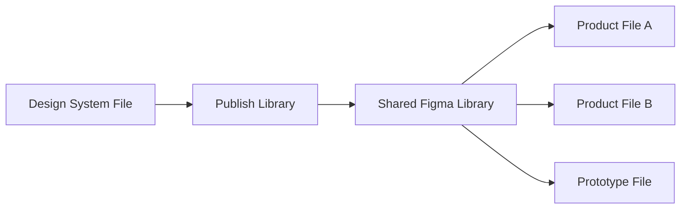
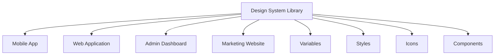
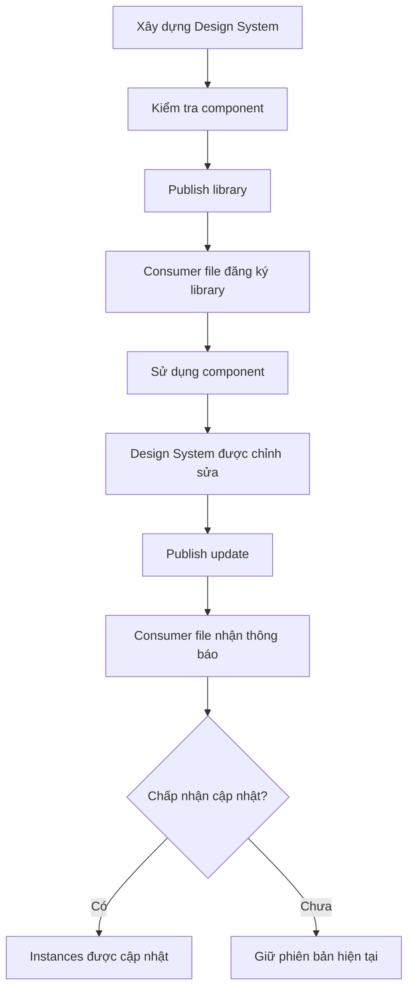
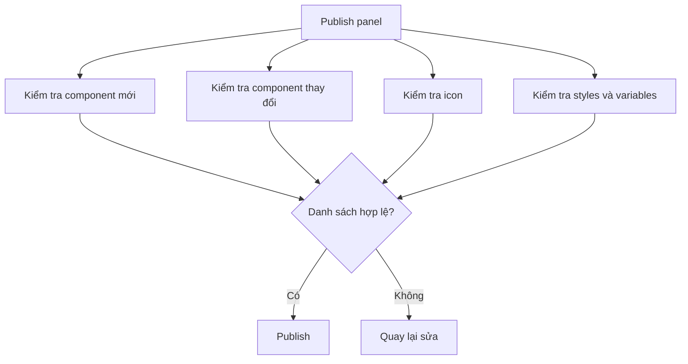
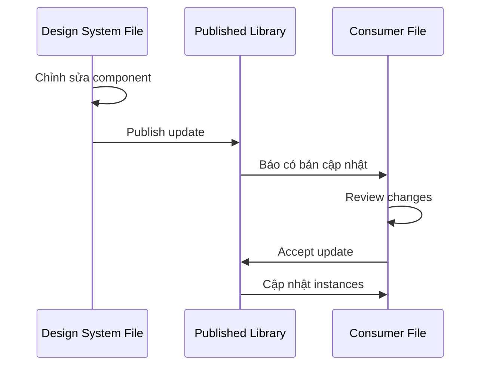
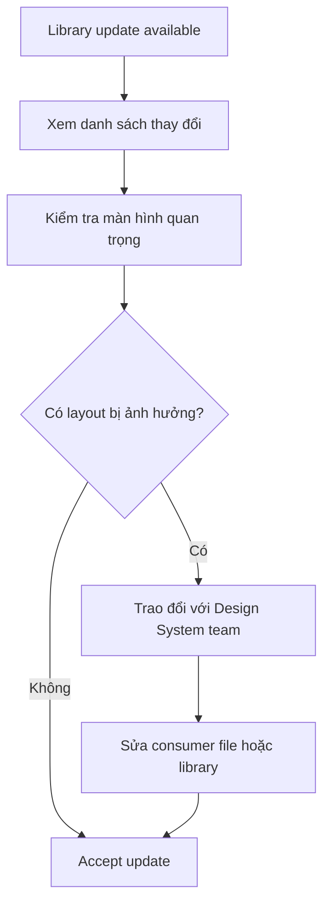
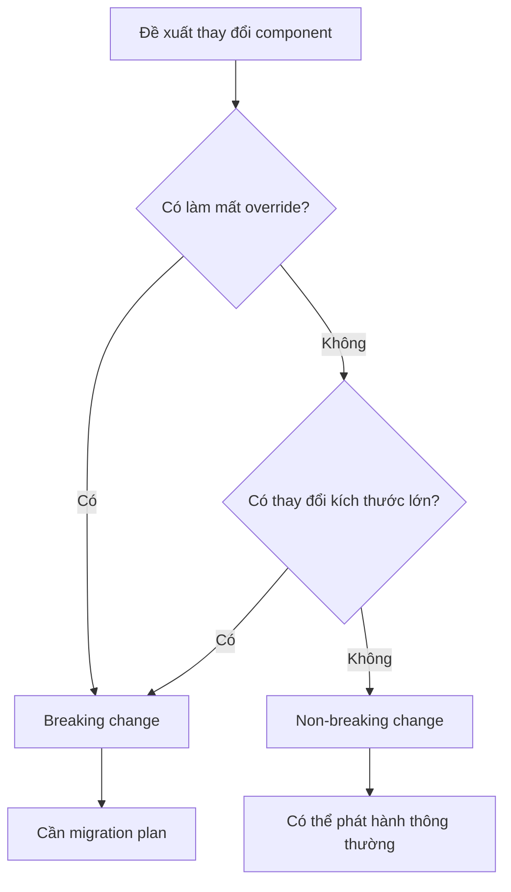
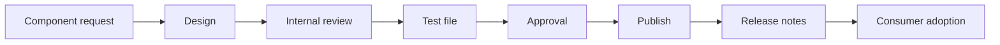
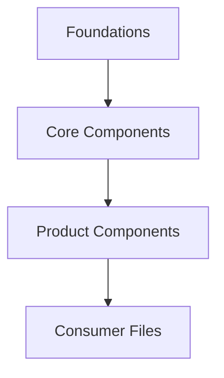
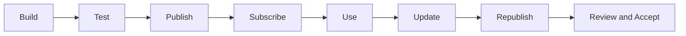

# 050 – Xuất bản và đăng ký sử dụng Design System

## 1. Thông tin bài học

| Mục                       | Nội dung                                                                                                |
| ------------------------- | ------------------------------------------------------------------------------------------------------- |
| **Module**                | Publishing & Scaling                                                                                    |
| **Tên tiếng Việt**        | Xuất bản và mở rộng Design System                                                                       |
| **Thời điểm trong video** | 3:30:19                                                                                                 |
| **Chủ đề chính**          | Xuất bản thư viện Figma, đăng ký thư viện trong các file sản phẩm và quản lý những bản cập nhật sau này |
| **Đối tượng liên quan**   | Design System team, Product Designer, UI Designer, Consumer team                                        |

---

## 2. Mục tiêu bài học

Bài học hướng dẫn cách đưa Design System từ một file thiết kế nội bộ trở thành một **thư viện có thể được nhiều file và nhiều thành viên trong nhóm sử dụng**.

Sau bài học, chúng ta có thể:

* Xuất bản component, style và variable từ file thư viện.
* Kiểm tra những tài nguyên nào sẽ được phát hành.
* Đăng ký thư viện trong một file sản phẩm.
* Sử dụng component được chia sẻ từ Design System.
* Thực hiện thay đổi trong file thư viện.
* Xuất bản lại những component đã thay đổi.
* Chấp nhận hoặc từ chối bản cập nhật trong file sử dụng.
* Quản lý những component không nên được công khai.
* Thiết lập quy trình phát hành Design System cho nhóm.

---

# 3. Publishing là gì?

**Publishing** là quá trình phát hành các tài nguyên trong file Design System để những file Figma khác có thể sử dụng.

Các tài nguyên có thể được phát hành gồm:

* Components.
* Component Sets.
* Component Variants.
* Text Styles.
* Color Styles.
* Effect Styles.
* Grid Styles.
* Variables.
* Design tokens được biểu diễn bằng Variables.

Trước khi xuất bản, component chỉ có thể được sử dụng thuận tiện trong chính file chứa nó.

Sau khi xuất bản, component có thể được sử dụng trong các file sản phẩm đã đăng ký thư viện.



Trong bài học, xuất bản được mô tả là bước đánh dấu Design System đã sẵn sàng để những người khác trong nhóm sử dụng.

---

# 4. Subscribing là gì?

**Subscribing** là quá trình bật hoặc đăng ký một thư viện trong file sử dụng.

File sử dụng còn được gọi là:

```text
Consumer file
```

Ví dụ consumer file:

* File thiết kế ứng dụng mobile.
* File thiết kế website.
* File thiết kế dashboard.
* File prototype.
* File marketing.
* File dành cho một sản phẩm hoặc squad cụ thể.

Sau khi đăng ký, người thiết kế có thể tìm và kéo các component từ thư viện vào file hiện tại.

```text
Design System Library
        ↓
Consumer File
        ↓
Button, Input, Table, Snackbar, Avatar...
```

---

# 5. Mô hình Design System Library

Một hệ thống cơ bản thường có hai loại file.

## 5.1. Library file

Đây là file nguồn chứa:

* Foundations.
* Variables.
* Tokens.
* Icons.
* Components.
* Component documentation.
* Component test cases.

Ví dụ:

```text
Acme Design System
```

---

## 5.2. Consumer file

Đây là file sử dụng các component đã xuất bản.

Ví dụ:

```text
Acme Mobile App
Acme Admin Dashboard
Acme Marketing Website
```

Consumer file không nên chỉnh sửa cấu trúc bên trong component bằng cách detach nếu không thật sự cần thiết.

---

## 5.3. Sơ đồ quan hệ



---

# 6. Tại sao phải xuất bản Design System?

Nếu không xuất bản, Design System chỉ hoạt động như một tập hợp component cục bộ trong một file.

Điều này gây ra các vấn đề:

* Các nhóm phải sao chép component thủ công.
* Component dễ bị chỉnh sửa khác nhau giữa các file.
* Không thể cập nhật đồng loạt.
* Khó biết phiên bản nào là phiên bản chính thức.
* Màu sắc và spacing có thể mất tính nhất quán.
* Designer dễ sử dụng component cũ.

Khi xuất bản thư viện:

* Có một nguồn dữ liệu chính thức.
* Nhiều file có thể dùng chung component.
* Thay đổi có thể được phân phối đến các file sản phẩm.
* Nhóm Design System kiểm soát chất lượng tốt hơn.
* Product Designer không cần xây lại component.

---

# 7. Luồng hoạt động tổng quát



---

# 8. Chuẩn bị trước khi xuất bản

Không nên xuất bản ngay sau khi vừa tạo component cuối cùng.

Cần kiểm tra toàn bộ thư viện trước.

## 8.1. Kiểm tra tên component

Tên nên có cấu trúc rõ ràng.

Ví dụ:

```text
Actions/Button
Actions/Icon Button
Feedback/Snackbar
Feedback/Progress Bar
Feedback/Progress Circle
Data Display/Table
Navigation/Breadcrumb
```

Tên không nên:

```text
Component 34
Button Copy 2
Final Button New
Test Table
```

---

## 8.2. Kiểm tra tên variant

Ví dụ tốt:

```text
Style = Primary
Size = Medium
State = Default
```

Ví dụ chưa tốt:

```text
Property 1 = Variant 2
Property 2 = Variant 4
```

---

## 8.3. Kiểm tra Component Properties

* Boolean Property có tên rõ ràng.
* Text Property liên kết đúng layer.
* Instance Swap hoạt động.
* Nested Instance được hiển thị đúng.
* Không còn property thừa.
* Không có property bị hỏng sau khi xóa layer.

---

## 8.4. Kiểm tra token

Component không nên chứa quá nhiều giá trị thủ công.

Kiểm tra:

* Fill.
* Stroke.
* Text color.
* Radius.
* Spacing.
* Typography.
* Effects.
* Focus Ring.

```text
Raw value → Primitive token → Semantic token → Component
```

---

## 8.5. Kiểm tra component nội bộ

Không phải component nào cũng nên được phát hành.

Ví dụ component nội bộ:

```text
.Cell Item
.Table Column
.Adjust Gap
.Snackbar Content
```

Có thể dùng quy ước dấu chấm ở đầu tên để biểu thị component riêng tư hoặc không nên xuất bản:

```text
.Internal Component
```

Quy ước chính xác phụ thuộc vào tiêu chuẩn của nhóm.

---

## 8.6. Kiểm tra icon

Nếu thư viện có hàng nghìn icon và nhiều variant cho mỗi icon, lần xuất bản đầu tiên có thể bao gồm một số lượng tài nguyên rất lớn. Bài học lưu ý Figma sẽ xử lý cả component lẫn các variant liên quan khi phát hành.

Cần kiểm tra:

* Icon trùng lặp.
* Icon test.
* Icon chưa hoàn thiện.
* Icon không còn sử dụng.
* Variant không cần thiết.
* Tên icon không nhất quán.

---

# 9. Các bước xuất bản Figma Library

## Bước 1: Mở file Design System

Đảm bảo đang mở đúng file chứa:

* Variables.
* Styles.
* Components.
* Icons.
* Component Sets.

Không nên xuất bản từ file thử nghiệm hoặc bản sao không chính thức.

---

## Bước 2: Mở khu vực quản lý thư viện

Từ giao diện Figma, mở khu vực liên quan đến:

```text
Libraries
Publish library
Library management
```

Tên và vị trí chính xác của nút có thể thay đổi theo phiên bản giao diện Figma.

---

## Bước 3: Chọn Publish Library

Figma sẽ phân tích những tài nguyên có thể được phát hành.

Danh sách có thể bao gồm:

* Component mới.
* Component đã thay đổi.
* Style mới.
* Variable mới.
* Component bị xóa hoặc đổi tên.
* Asset chưa được phát hành.

---

## Bước 4: Kiểm tra danh sách tài nguyên

Không nên nhấn Publish ngay mà không xem danh sách.

Cần xác nhận:

* Component nào sẽ được công khai.
* Component nào chỉ dùng nội bộ.
* Có icon test hay không.
* Có component chưa đặt tên đúng hay không.
* Có thay đổi ngoài ý muốn hay không.



---

## Bước 5: Bỏ chọn tài nguyên không nên phát hành

Nếu một component chưa sẵn sàng:

* Bỏ chọn nó khỏi lần phát hành.
* Đổi tên thành component nội bộ.
* Sửa lỗi trước khi xuất bản.
* Xóa nếu không còn cần thiết.

Không nên xuất bản một component chỉ vì nó đang nằm trong file Design System.

---

## Bước 6: Viết mô tả thay đổi

Khi có thể, nên ghi chú rõ nội dung bản phát hành.

Ví dụ:

```text
Initial release

- Added foundations and semantic tokens
- Added Button, Input and Navigation components
- Added feedback and data-display components
- Added icon library
```

Đối với bản cập nhật:

```text
Updated Button radius from 8 px to 4 px.
Added disabled state for Carousel Navigation.
Fixed Table Cell padding.
```

---

## Bước 7: Nhấn Publish

Sau khi xác nhận danh sách:

```text
Publish
```

Thư viện sẽ bắt đầu được xử lý.

Thời gian xử lý phụ thuộc vào:

* Số component.
* Số variant.
* Số icon.
* Số style.
* Số variable.
* Quy mô file.

---

# 10. Lần xuất bản đầu tiên

Lần xuất bản đầu tiên thường lớn nhất vì toàn bộ thư viện chưa từng được phát hành.

Có thể bao gồm:

```text
Foundations
Variables
Text styles
Color styles
Icons
Components
Variants
Nested components
```

### Rủi ro

Nếu thư viện có nhiều icon:

```text
1.000 icon
× 4 variants
= 4.000 component variants
```

Figma phải xử lý toàn bộ số tài nguyên đó.

Do đó cần:

* Chỉ giữ icon thật sự cần.
* Tránh duplicate icon.
* Kiểm tra component nội bộ.
* Chia thư viện nếu quy mô quá lớn.

---

# 11. Đăng ký Design System trong consumer file

Sau khi thư viện được xuất bản, các file khác có thể đăng ký sử dụng.

## Bước 1: Mở consumer file

Ví dụ:

```text
Mobile App – Authentication
```

---

## Bước 2: Mở Libraries

Từ menu Figma hoặc bảng Assets, mở phần quản lý thư viện.

---

## Bước 3: Tìm thư viện

Tìm theo:

* Tên Design System.
* Tên workspace.
* Tên team.
* Tên project.

Ví dụ:

```text
Acme Design System
```

---

## Bước 4: Bật hoặc đăng ký thư viện

Chọn thư viện và bật quyền sử dụng.

Sau đó file hiện tại có thể truy cập:

* Components.
* Variables.
* Styles.
* Icons.

Trong bài học, consumer file tìm thư viện trong khu vực Libraries rồi đăng ký để sử dụng toàn bộ tài nguyên đã được phát hành.

---

## Bước 5: Kiểm tra Assets Panel

Sau khi đăng ký, mở Assets Panel và tìm component.

Ví dụ:

```text
Button
Snackbar
Table
Avatar
Progress
```

Kéo component vào canvas để kiểm tra.

---

# 12. Sử dụng component từ thư viện

Khi kéo một component từ thư viện vào consumer file, nó trở thành một **instance** liên kết với main component.

```text
Library Main Component
        ↓
Consumer Instance
```

Designer có thể thay đổi những property được cho phép:

* Text.
* Icon.
* Boolean visibility.
* Variant.
* Nested instance.
* Instance Swap.

Không nên detach component chỉ để thay đổi các thuộc tính đã được hỗ trợ.

---

# 13. Luồng cập nhật Design System

Sau lần xuất bản đầu tiên, thư viện sẽ tiếp tục thay đổi.

Ví dụ:

* Đổi radius của Button.
* Thêm trạng thái mới.
* Sửa màu Disabled.
* Thay đổi spacing của Table.
* Thêm kích thước mới.
* Sửa lỗi icon.
* Đổi tên token.

Luồng cập nhật:



---

# 14. Xuất bản lại component đã thay đổi

Giả sử Button được thay đổi:

```text
Radius: 8 px → 4 px
```

Khi mở Publish Panel, Figma sẽ tập trung hiển thị những tài nguyên đã thay đổi thay vì bắt buộc xuất bản lại toàn bộ thư viện.

Bài học minh họa việc chỉnh radius, mở lại Publish Library và quan sát danh sách chỉ tập trung vào những component đã thay đổi hoặc sẵn sàng phát hành lại.

### Quy trình

```text
Chỉnh main component
→ Review thay đổi
→ Publish update
→ Consumer files nhận thông báo
```

---

# 15. Chấp nhận cập nhật trong consumer file

Khi Design System phát hành phiên bản mới, consumer file có thể hiển thị thông báo:

```text
Library updates available
```

Người thiết kế có thể:

* Xem những component nào đã thay đổi.
* So sánh trước và sau.
* Chấp nhận toàn bộ.
* Chấp nhận từng phần.
* Trì hoãn cập nhật.

---

## 15.1. Tại sao cần review?

Một thay đổi nhỏ trong main component có thể ảnh hưởng đến hàng trăm instance.

Ví dụ:

```text
Button padding: 16 px → 24 px
```

Điều này có thể làm:

* Nút rộng hơn.
* Toolbar bị tràn.
* Dialog thay đổi chiều rộng.
* Navigation bị xuống dòng.
* Layout responsive bị phá vỡ.

Do đó không nên chấp nhận mọi cập nhật mà không kiểm tra.

---

## 15.2. Quy trình review cập nhật



---

# 16. Override và cập nhật

Instance trong consumer file có thể có override:

* Nội dung text.
* Icon.
* Variant.
* Boolean Property.
* Nested instance.

Khi main component được cập nhật, Figma thường cố gắng giữ override hợp lệ.

Tuy nhiên, override có thể bị ảnh hưởng nếu:

* Layer bị xóa.
* Layer bị đổi cấu trúc.
* Property bị đổi tên hoặc xóa.
* Nested instance bị thay thế.
* Variant value bị xóa.
* Component bị chuyển sang cấu trúc hoàn toàn khác.

---

# 17. Breaking change và non-breaking change

## 17.1. Non-breaking change

Thay đổi ít có nguy cơ phá vỡ consumer file:

* Sửa màu token.
* Điều chỉnh nhỏ border.
* Sửa lỗi căn chỉnh.
* Cải thiện Focus Ring.
* Thêm variant mới.
* Thêm property mới có giá trị mặc định an toàn.

---

## 17.2. Breaking change

Thay đổi có thể làm mất override hoặc phá vỡ layout:

* Xóa variant.
* Đổi tên hàng loạt property.
* Xóa layer đang được override.
* Thay đổi cấu trúc nested component.
* Xóa component.
* Thay đổi kích thước lớn.
* Chuyển Button thành component hoàn toàn khác.

---

## 17.3. Sơ đồ quyết định



---

# 18. Versioning cho Design System

Figma Library không nên được quản lý chỉ bằng những mô tả mơ hồ như:

```text
Updated components
```

Nên áp dụng tư duy versioning.

Ví dụ:

```text
1.0.0 – Initial release
1.1.0 – Added Progress Circle
1.1.1 – Fixed Button focus ring
2.0.0 – Rebuilt Table architecture
```

### Semantic Versioning

```text
MAJOR.MINOR.PATCH
```

| Loại      | Ý nghĩa                              |
| --------- | ------------------------------------ |
| **Major** | Thay đổi phá vỡ tương thích          |
| **Minor** | Thêm tính năng nhưng vẫn tương thích |
| **Patch** | Sửa lỗi nhỏ                          |

---

# 19. Release notes

Mỗi lần xuất bản nên có ghi chú ngắn.

## Ví dụ bản cập nhật nhỏ

```text
Version 1.2.1

Fixed:
- Corrected Icon Button disabled color.
- Fixed Table Cell vertical alignment.
- Updated Snackbar border token.
```

## Ví dụ bản cập nhật lớn

```text
Version 2.0.0

Changed:
- Rebuilt Button component properties.
- Renamed Style property to Hierarchy.
- Removed legacy Medium-Alt size.
- Migrated all components to semantic variables.

Migration:
- Replace legacy Button instances before accepting updates.
```

---

# 20. Quy trình làm việc theo nhóm

Một quy trình Design System có thể gồm:

```text
Request
→ Design
→ Review
→ Test
→ Approve
→ Publish
→ Communicate
→ Adopt
```

### Sơ đồ



---

# 21. Vai trò trong quy trình

## Design System Designer

* Xây dựng component.
* Quản lý token.
* Kiểm tra variants.
* Phát hành library.
* Viết tài liệu.
* Hỗ trợ migration.

## Product Designer

* Đăng ký thư viện.
* Sử dụng component.
* Kiểm tra bản cập nhật.
* Báo lỗi hoặc đề xuất.
* Hạn chế detach component.

## Design System Lead

* Duyệt thay đổi lớn.
* Quản lý version.
* Quyết định breaking change.
* Điều phối phát hành.
* Theo dõi mức độ áp dụng.

---

# 22. Tách thư viện khi mở rộng

Một thư viện lớn có thể được tách thành nhiều library.

Ví dụ:

```text
Acme Foundations
Acme Icons
Acme Core Components
Acme Data Visualization
Acme Mobile Components
Acme Marketing Components
```

### Ưu điểm

* Giảm số asset không liên quan.
* Dễ quản lý quyền.
* Giảm độ phức tạp.
* File tải nhanh hơn.
* Nhóm chỉ đăng ký thư viện cần thiết.

### Hạn chế

* Tăng số lượng library cần quản lý.
* Có thể tạo dependency giữa các thư viện.
* Khó đồng bộ version.
* Designer phải biết thư viện nào chứa component nào.

---

# 23. Library dependency

Ví dụ:

```text
Foundations Library
        ↓
Core Components Library
        ↓
Product Components Library
```

Core Components sử dụng token từ Foundations.

Product Components sử dụng component từ Core.



Cần tránh dependency vòng:

```text
Library A → Library B → Library A
```

---

# 24. Quyền xuất bản

Không phải mọi thành viên đều nên có quyền phát hành thư viện.

Có thể áp dụng:

* Chỉ Design System team được chỉnh file nguồn.
* Product Designer có quyền xem và sử dụng.
* Một nhóm reviewer duyệt trước khi publish.
* Breaking change cần có phê duyệt riêng.

Trong transcript, giảng viên lưu ý quyền xuất bản phụ thuộc vào workspace hoặc gói Figma đang sử dụng. Chính sách sản phẩm có thể thay đổi, vì vậy nhóm nên kiểm tra quyền và điều kiện hiện tại trong workspace của mình.

---

# 25. Rủi ro khi xuất bản toàn bộ thư viện

## 25.1. Xuất bản component thử nghiệm

Nếu component test được công khai, designer có thể dùng nhầm trong sản phẩm thật.

Giải pháp:

* Dùng quy ước private component.
* Tách khu vực thử nghiệm.
* Kiểm tra Publish Panel.
* Có checklist trước khi phát hành.

---

## 25.2. Xuất bản quá nhiều icon

Hàng nghìn icon và variant có thể:

* Làm lần publish đầu tiên nặng.
* Làm Asset Panel khó tìm kiếm.
* Tăng nguy cơ duplicate.
* Làm việc quản lý library phức tạp hơn.

---

## 25.3. Thay đổi lớn không có cảnh báo

Ví dụ đổi:

```text
Button height: 36 px → 48 px
```

mà không thông báo có thể phá vỡ nhiều màn hình.

Cần:

* Release notes.
* Migration guide.
* Thông báo trước.
* File kiểm thử.

---

## 25.4. Chấp nhận cập nhật hàng loạt

Accept All có thể làm nhiều màn hình thay đổi cùng lúc.

Nên kiểm tra:

* Authentication.
* Navigation.
* Dialog.
* Forms.
* Tables.
* Responsive layouts.

---

## 25.5. Detach component quá nhiều

Nếu consumer file detach component:

* Không nhận được update.
* Mất liên kết với thư viện.
* Tạo phiên bản riêng không được kiểm soát.
* Khó migration.

---

## 25.6. Đổi tên tùy tiện

Đổi tên component hoặc property có thể:

* Làm designer khó tìm asset.
* Phá vỡ quy ước.
* Gây nhầm lẫn giữa component cũ và mới.
* Làm tài liệu không còn chính xác.

---

# 26. Testing trước khi publish

Nên có một file thử nghiệm riêng:

```text
Design System QA
```

Trong đó kiểm tra:

* Tất cả sizes.
* Tất cả states.
* Nội dung ngắn và dài.
* Light Mode.
* Dark Mode.
* Nested instances.
* Responsive behavior.
* Component overrides.
* Update từ phiên bản cũ.

---

## Ma trận kiểm thử

| Hạng mục | Kiểm tra                        |
| -------- | ------------------------------- |
| Button   | Default, Hover, Focus, Disabled |
| Input    | Empty, Filled, Error            |
| Snackbar | Success, Warning, Error         |
| Table    | Header, Hover, Selected         |
| Theme    | Light, Dark                     |
| Content  | Ngắn, dài, đa ngôn ngữ          |
| Update   | Override có được giữ không      |

---

# 27. Quy trình phát hành đề xuất

## Giai đoạn 1: Chuẩn bị

* Hoàn thiện component.
* Kiểm tra token.
* Kiểm tra naming.
* Xóa tài nguyên thử nghiệm.
* Chạy QA.

## Giai đoạn 2: Review

* Design review.
* Accessibility review.
* Technical review nếu có code tương ứng.
* Xác định breaking change.

## Giai đoạn 3: Publish

* Mở Publish Panel.
* Kiểm tra danh sách.
* Viết release notes.
* Phát hành.

## Giai đoạn 4: Truyền thông

* Thông báo cho các nhóm.
* Chia sẻ thay đổi.
* Nêu rõ migration nếu cần.
* Cập nhật tài liệu.

## Giai đoạn 5: Adoption

* Consumer files nhận update.
* Designer kiểm tra tác động.
* Chấp nhận update.
* Báo lỗi nếu phát hiện vấn đề.

---

# 28. Câu hỏi ôn tập

## Câu 1: Mục đích chính của bài học là gì?

Mục đích chính là đưa Design System từ một file component nội bộ thành thư viện có thể được sử dụng trong nhiều file và nhiều dự án.

Bài học bao gồm:

* Xuất bản library.
* Đăng ký library trong consumer file.
* Phát hành những thay đổi mới.
* Chấp nhận library updates.

---

## Câu 2: Áp dụng vào Design System thực tế như thế nào?

Có thể áp dụng bằng cách:

1. Tạo một file Design System chính thức.
2. Chuẩn hóa tên component, variant và property.
3. Kiểm tra component trước khi xuất bản.
4. Chỉ phát hành tài nguyên đã sẵn sàng.
5. Đăng ký thư viện trong các file sản phẩm.
6. Sử dụng instances thay vì sao chép hoặc detach.
7. Xuất bản lại khi component thay đổi.
8. Viết release notes.
9. Kiểm tra update trước khi chấp nhận.
10. Thiết lập versioning và migration plan.

---

## Câu 3: Các bước và ý tưởng chính được trình bày là gì?

Các bước chính gồm:

1. Hoàn thiện Design System.
2. Mở chức năng Publish Library.
3. Kiểm tra toàn bộ component và icon sẽ được xuất bản.
4. Bỏ chọn tài nguyên không cần thiết.
5. Xuất bản thư viện.
6. Mở consumer file.
7. Truy cập Libraries.
8. Tìm và đăng ký Design System.
9. Sử dụng component từ Assets Panel.
10. Chỉnh sửa main component khi cần.
11. Mở Publish Library lần nữa.
12. Xuất bản những component đã thay đổi.
13. Xem và chấp nhận update trong consumer file.

---

## Câu 4: Rủi ro hoặc hạn chế cần lưu ý là gì?

Các rủi ro chính gồm:

* Xuất bản nhầm component thử nghiệm.
* Thư viện quá lớn do icon và variant.
* Breaking change làm mất override.
* Consumer file chấp nhận update mà không kiểm tra.
* Component bị detach và không còn nhận update.
* Naming không nhất quán.
* Thiếu release notes.
* Không có migration plan.
* Quyền publish được cấp quá rộng.
* Dependency giữa nhiều thư viện trở nên phức tạp.

---

# 29. Checklist trước khi xuất bản

## Component

* [ ] Tên component đúng quy ước
* [ ] Variant Property được đặt tên rõ ràng
* [ ] Không còn `Property 1`
* [ ] Không có layer test
* [ ] Không có component duplicate
* [ ] Boolean Property hoạt động
* [ ] Text Property hoạt động
* [ ] Instance Swap hoạt động
* [ ] Nested Instance hoạt động
* [ ] Không có property thừa

## Token và style

* [ ] Màu sử dụng semantic token
* [ ] Typography sử dụng style hoặc variable
* [ ] Spacing nhất quán
* [ ] Radius nhất quán
* [ ] Border nhất quán
* [ ] Focus Ring đúng chuẩn
* [ ] Light Mode hoạt động
* [ ] Dark Mode hoạt động

## Publishing

* [ ] Kiểm tra danh sách asset
* [ ] Loại bỏ component nội bộ
* [ ] Kiểm tra icon
* [ ] Viết release notes
* [ ] Xác định breaking change
* [ ] Có người review
* [ ] Có QA file

## Consumer files

* [ ] Library đã được đăng ký
* [ ] Component xuất hiện trong Assets
* [ ] Update được kiểm tra trước khi chấp nhận
* [ ] Overrides vẫn hoạt động
* [ ] Layout quan trọng không bị phá vỡ
* [ ] Không detach component không cần thiết

---

# 30. Tóm tắt bài học

Design System chỉ thật sự có thể mở rộng khi nó được xuất bản thành một thư viện dùng chung.

Luồng cơ bản:

```text
Design System File
→ Publish Library
→ Consumer File đăng ký
→ Sử dụng component
→ Design System thay đổi
→ Publish Update
→ Consumer File chấp nhận Update
```

Sơ đồ tổng quát:



Những điểm quan trọng nhất:

* Kiểm tra tài nguyên trước khi xuất bản.
* Không công khai component nội bộ hoặc chưa hoàn thiện.
* Đăng ký library trong từng consumer file.
* Sử dụng instance thay vì sao chép component.
* Chỉ xuất bản lại những phần đã thay đổi.
* Xem xét tác động trước khi chấp nhận update.
* Phân biệt breaking change và non-breaking change.
* Viết release notes và migration guide.
* Quản lý quyền xuất bản rõ ràng.
* Duy trì một nguồn dữ liệu chính thức cho toàn bộ Design System.

Publishing không phải là bước kết thúc của Design System. Đây là điểm bắt đầu của quá trình vận hành, cập nhật và mở rộng Design System trên nhiều nhóm và nhiều sản phẩm.
