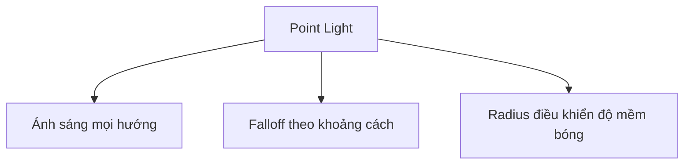
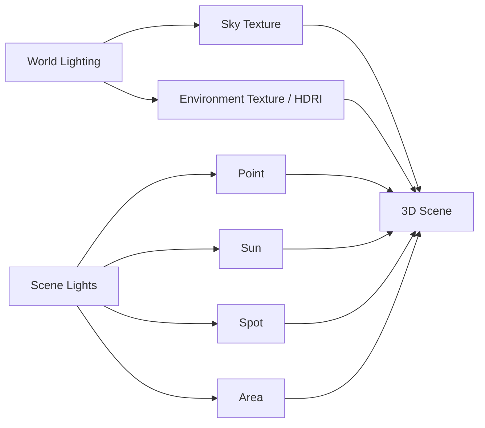

# 033 — Understanding Light Settings

**Phần:** 04 — Lights
**Thời lượng:** 16:50
**Chủ đề:** Point, Sun, Spot, Area, power, size và HDRI
**Loại bài:** lesson

---

## 1. Tóm tắt

Ánh sáng là một trong những yếu tố quyết định chất lượng hình ảnh trong Blender. Một mô hình có hình học và vật liệu tốt vẫn có thể trông phẳng, thiếu chiều sâu hoặc thiếu tự nhiên nếu ánh sáng được thiết lập không phù hợp.

Blender cung cấp bốn loại đèn chính:

* `Point`
* `Sun`
* `Spot`
* `Area`

Mỗi loại có cách phát sáng, phạm vi ảnh hưởng và thông số điều khiển khác nhau. Bên cạnh các đèn cục bộ, Blender còn có thể chiếu sáng toàn cảnh bằng `World`, `Sky Texture`, `HDRI` hoặc các vật liệu `Emission`.

Bài học tập trung vào mối quan hệ giữa:

```text
Loại nguồn sáng
      ↓
Hướng và vùng chiếu sáng
      ↓
Công suất / Exposure
      ↓
Kích thước nguồn sáng
      ↓
Độ mềm của bóng
      ↓
Falloff theo khoảng cách
      ↓
Cảm giác không gian và độ chân thực
```

---

## 2. Mục tiêu học tập

Sau khi hoàn thành bài này, người học có thể:

* Phân biệt được `Point`, `Sun`, `Spot` và `Area Light`.
* Chọn loại đèn phù hợp với mục đích chiếu sáng.
* Điều chỉnh `Power`, `Exposure`, màu và nhiệt độ màu.
* Giải thích được quan hệ giữa kích thước nguồn sáng và độ mềm của bóng.
* Phân biệt được đèn có falloff theo khoảng cách với `Sun Light`.
* Điều chỉnh vùng chiếu sáng của `Spot Light`.
* Sử dụng `Area Light` cho các thiết lập ánh sáng mềm kiểu studio.
* Sử dụng `Sky Texture` hoặc `HDRI` để tạo ánh sáng môi trường.
* Phân biệt ánh sáng từ `World` với ánh sáng từ các đèn trong scene.
* Sử dụng `Emission` đúng vai trò trong hệ thống chiếu sáng.

---

## 3. Ánh sáng ảnh hưởng đến hình ảnh như thế nào?

Ánh sáng trong đồ họa 3D không chỉ làm cho vật thể nhìn thấy được. Nó đồng thời quyết định:

* hình dạng cảm nhận của vật thể;
* độ sâu;
* độ tương phản;
* độ nổi của bề mặt;
* bóng đổ;
* highlight;
* reflection;
* màu sắc tổng thể;
* cảm xúc của khung hình.

Một setup ánh sáng tốt thường phải giải quyết ít nhất ba câu hỏi:

1. Ánh sáng đến từ đâu?
2. Nguồn sáng lớn hay nhỏ?
3. Ánh sáng mạnh đến mức nào?

Kích thước nguồn sáng đặc biệt quan trọng đối với bóng đổ.

```text
Nguồn sáng nhỏ
      ↓
Bóng có biên rõ
      ↓
Cảm giác ánh sáng cứng

Nguồn sáng lớn
      ↓
Vùng chuyển tiếp rộng hơn
      ↓
Bóng mềm hơn
```

Trong thực tế, hầu hết nguồn sáng đều có kích thước hữu hạn, vì vậy ngay cả bóng khá cứng vẫn thường tồn tại một vùng chuyển tiếp nhỏ thay vì một đường biên toán học hoàn toàn sắc nét.

---

## 4. Bốn loại Light chính trong Blender

Có thể thêm đèn bằng:

```text
Shift + A
→ Light
→ Point / Sun / Spot / Area
```

Loại đèn hiện tại cũng có thể được thay đổi trong phần `Light Properties`.

### 4.1. Point Light

`Point Light` mô phỏng một nguồn sáng nhỏ phát ánh sáng ra mọi hướng, tương tự một bóng đèn.



Đặc điểm chính:

* phát sáng gần như đồng đều theo mọi hướng;
* cường độ giảm khi khoảng cách tới nguồn sáng tăng;
* phù hợp với bóng đèn, đèn nhỏ hoặc nguồn sáng cục bộ;
* `Radius` ảnh hưởng đến kích thước nguồn sáng biểu kiến.

Khi `Radius` nhỏ:

* highlight thường nhỏ hơn;
* bóng sắc hơn;
* nguồn sáng có cảm giác cứng.

Khi `Radius` lớn:

* bóng mềm hơn;
* highlight lan rộng hơn;
* cảm giác giống nguồn sáng có diện tích lớn hơn.

Di chuyển `Point Light` sẽ làm thay đổi cả hướng ánh sáng và khoảng cách tới vật thể, vì vậy độ sáng trên vật thể cũng có thể thay đổi.

---

### 4.2. Sun Light

`Sun Light` mô phỏng một nguồn sáng định hướng nằm ở khoảng cách rất xa.

Các tia sáng gần như song song:

```text
→ → → → →
→ → → → →
→ → → → →
```

Vì vậy, `Sun Light` có một đặc điểm rất quan trọng:

> Vị trí của `Sun Light` trong scene không quyết định độ sáng hoặc hướng chiếu. Hướng xoay của đèn mới là yếu tố quan trọng.

Có thể di chuyển `Sun Light` sang một vị trí khác mà kết quả chiếu sáng vẫn giữ nguyên nếu rotation không đổi.

Các thông số quan trọng gồm:

* `Strength`: cường độ ánh sáng;
* `Angle`: kích thước góc biểu kiến của nguồn sáng;
* `Rotation`: hướng chiếu.

`Angle` càng nhỏ:

```text
Angle nhỏ → bóng cứng hơn
```

`Angle` càng lớn:

```text
Angle lớn → bóng mềm hơn
```

`Sun Light` phù hợp với:

* ánh sáng mặt trời;
* ánh trăng;
* ánh sáng định hướng cho cảnh ngoài trời;
* nguồn sáng cần phủ toàn bộ scene mà không phụ thuộc khoảng cách.

---

### 4.3. Spot Light

`Spot Light` chiếu ánh sáng theo một vùng hình nón.

```text
       Spot
        ▼
       / \
      /   \
     /     \
    /       \
   Object / Floor
```

Loại đèn này phù hợp với:

* đèn sân khấu;
* đèn trần có hướng;
* đèn pin;
* ánh sáng nhấn;
* ánh sáng tập trung lên một đối tượng.

Các thông số quan trọng:

| Thông số    | Chức năng                                  |
| ----------- | ------------------------------------------ |
| `Power`     | Điều chỉnh cường độ                        |
| `Radius`    | Điều chỉnh kích thước nguồn và độ mềm bóng |
| `Spot Size` | Điều chỉnh góc mở của hình nón             |
| `Blend`     | Làm mềm vùng biên của hình nón             |

`Spot Size` nhỏ tạo vùng sáng hẹp.

`Spot Size` lớn làm vùng chiếu sáng rộng hơn.

`Blend` thấp tạo ranh giới rõ giữa vùng sáng và tối.

`Blend` cao tạo chuyển tiếp mềm hơn.

Vì vậy:

```text
Spot Size → độ rộng vùng chiếu

Blend → độ mềm của mép vùng chiếu

Radius → độ mềm của bóng vật thể
```

Ba thông số này không nên bị nhầm lẫn với nhau.

---

### 4.4. Area Light

`Area Light` phát sáng từ một bề mặt thay vì một điểm.

Đây là loại đèn rất hữu ích cho:

* studio lighting;
* portrait;
* product visualization;
* kiến trúc;
* softbox;
* ánh sáng cửa sổ.

Một ưu điểm quan trọng là kích thước của `Area Light` có thể được điều chỉnh trực quan bằng transform hoặc qua các thông số kích thước của đèn.

Nguồn càng lớn so với đối tượng:

```text
Area lớn
   ↓
Nhiều hướng ánh sáng tới vật thể hơn
   ↓
Penumbra rộng
   ↓
Bóng mềm
```

`Area Light` hỗ trợ nhiều hình dạng tùy phiên bản Blender, chẳng hạn:

* Square;
* Rectangle;
* Disk;
* Ellipse.

Hình dạng của nguồn sáng không chỉ ảnh hưởng đến chiếu sáng mà còn có thể xuất hiện trong reflection.

Ví dụ, đối với portrait, reflection của đèn trong mắt nhân vật có thể thấy rõ. Một nguồn sáng tròn hoặc dạng softbox có thể tạo catchlight tự nhiên hơn tùy phong cách mong muốn.

`Spread` điều khiển mức độ phân tán theo hướng của ánh sáng Area.

Spread rộng:

* ánh sáng lan rộng hơn.

Spread hẹp:

* năng lượng tập trung vào vùng nhỏ hơn;
* vùng chiếu có tính định hướng mạnh hơn;
* có thể làm vùng được chiếu sáng trở nên sáng hơn.

Sau khi thay đổi `Spread`, cần kiểm tra lại exposure để tránh cháy sáng.

---

## 5. Các thông số quan trọng của Light

### 5.1. Color và Temperature

Nguồn sáng có thể được điều chỉnh thông qua màu hoặc nhiệt độ màu.

Nhiệt độ màu thường được biểu diễn bằng Kelvin.

Ví dụ về cảm giác thị giác:

| Nhiệt độ tương đối | Cảm giác          |
| ------------------ | ----------------- |
| Thấp               | Ấm, vàng hoặc cam |
| Trung tính         | Gần trắng         |
| Cao                | Lạnh, thiên xanh  |

Ví dụ:

```text
Ánh sáng ấm
→ hoàng hôn
→ đèn tungsten
→ không gian ấm cúng

Ánh sáng lạnh
→ trời xanh
→ một số nguồn LED
→ cảm giác lạnh hoặc hiện đại
```

Không nên tùy ý thay đổi đồng thời cả màu RGB và nhiệt độ màu nếu không có chủ đích, vì hai yếu tố sẽ kết hợp với nhau và có thể khiến việc kiểm soát màu trở nên khó đoán.

---

### 5.2. Power và Exposure

`Power` hoặc `Strength`, tùy loại đèn, là thông số chính dùng để điều khiển cường độ nguồn sáng.

`Exposure` cung cấp một cách điều chỉnh theo stop.

Về nguyên tắc:

```text
Exposure +1
≈ gấp đôi cường độ

Exposure -1
≈ giảm còn một nửa
```

Ví dụ, thay vì liên tục thay đổi một giá trị công suất lớn, có thể giữ `Power` ở giá trị cơ sở và dùng `Exposure` để tăng hoặc giảm nhanh theo stop.

Điều này đặc biệt hữu ích khi thử nhiều lighting setup khác nhau.

---

### 5.3. Size, Radius và độ mềm của bóng

Một trong những quy tắc quan trọng nhất của lighting là:

> Độ mềm của bóng phụ thuộc mạnh vào kích thước biểu kiến của nguồn sáng so với đối tượng.

Với `Point` và `Spot`, tham số thường liên quan là `Radius`.

Với `Area`, sử dụng `Size` hoặc kích thước của bề mặt đèn.

Với `Sun`, sử dụng `Angle`.

Có thể ghi nhớ như sau:

| Light   | Thông số ảnh hưởng mạnh tới độ mềm bóng |
| ------- | --------------------------------------- |
| `Point` | `Radius`                                |
| `Spot`  | `Radius`                                |
| `Sun`   | `Angle`                                 |
| `Area`  | `Size`                                  |

Đây là các cơ chế khác nhau nhưng cùng phục vụ một mục tiêu: mô phỏng kích thước biểu kiến của nguồn sáng.

---

### 5.4. Normalize và Nodes

`Normalize` liên quan đến cách năng lượng của nguồn sáng được xử lý khi kích thước nguồn thay đổi.

Trong các workflow cần kiểm soát vật lý hoặc so sánh nhiều kích thước nguồn sáng, tùy chọn này có thể giúp việc điều chỉnh cường độ nhất quán hơn.

Không nên bật hoặc tắt `Normalize` một cách ngẫu nhiên giữa các đèn khi đang thực hiện một bài kiểm tra lighting, vì việc đó có thể làm thay đổi mối quan hệ giữa kích thước và cường độ.

Light cũng có thể sử dụng node trong những trường hợp cần kiểm soát nâng cao, chẳng hạn:

* điều khiển màu bằng texture;
* tạo variation;
* kết nối giá trị procedural;
* xây dựng light shader phức tạp.

Đây là kỹ thuật nâng cao và không cần thiết đối với hầu hết setup ánh sáng cơ bản.

---

## 6. Ánh sáng môi trường với World

Ngoài các đèn nằm trong scene, Blender còn có hệ thống ánh sáng môi trường thông qua `World`.



Hai nhóm ánh sáng có thể hoạt động đồng thời:

* ánh sáng từ `World`;
* ánh sáng từ các Light Object.

Điều này có nghĩa là một vật thể có thể nhận ánh sáng từ HDRI trong khi vẫn được bổ sung thêm `Area Light`, `Spot Light` hoặc các nguồn khác.

### 6.1. Physical Sky

Blender cung cấp `Sky Texture` để tạo môi trường bầu trời procedural.

Trong `Shader Editor`:

```text
Object
↓
World
↓
Add
↓
Texture
↓
Sky Texture
```

Sau đó nối:

```text
Sky Texture
      ↓
Background
      ↓
World Output
```

Với mô hình bầu trời như `Nishita Sky`, các thông số có thể điều chỉnh những yếu tố như:

* độ cao mặt trời;
* hướng mặt trời;
* kích thước biểu kiến của mặt trời;
* cường độ mặt trời;
* độ cao khí quyển;
* thành phần không khí;
* bụi;
* ozone.

`Sun Elevation` thay đổi độ cao của mặt trời trên đường chân trời.

```text
Elevation thấp
→ bình minh / hoàng hôn

Elevation cao
→ ánh sáng gần giữa ngày
```

`Sun Rotation` thay đổi hướng mặt trời quanh scene.

Kích thước biểu kiến của mặt trời ảnh hưởng tới độ mềm của bóng theo cùng nguyên tắc với kích thước nguồn sáng.

---

### 6.2. HDRI

`HDRI` là ảnh có dải tương phản động cao, thường được sử dụng làm environment map.

Không giống một ảnh thông thường chỉ dùng để làm background, HDRI có thể chứa thông tin độ sáng đủ lớn để đại diện cho:

* mặt trời;
* cửa sổ;
* đèn;
* vùng trời;
* các nguồn sáng mạnh khác.

Một HDRI có thể đồng thời cung cấp:

```text
HDRI
 ├── ánh sáng môi trường
 ├── màu môi trường
 └── reflection
```

Đây là lý do HDRI rất hiệu quả cho:

* product rendering;
* automotive rendering;
* look development;
* vật liệu phản xạ;
* setup ánh sáng nhanh;
* ghép vật thể 3D vào môi trường thực.

Trong `World Shader`, HDRI thường được thiết lập bằng:

```text
Environment Texture
        ↓
Background
        ↓
World Output
```

Thay đổi `Strength` của `Background` sẽ điều chỉnh mức đóng góp ánh sáng của environment.

Tuy nhiên, giảm strength quá nhiều cũng làm thay đổi lượng ánh sáng và reflection từ environment. Vì vậy cần đánh giá toàn bộ hình ảnh thay vì chỉ nhìn brightness của background.

---

## 7. Emission có phải là nguồn sáng không?

Vật liệu `Emission` có thể phát ra ánh sáng.

Ví dụ:

* màn hình;
* neon;
* bóng đèn đang phát sáng;
* bảng hiệu;
* chi tiết phát quang;
* vật thể năng lượng.

Trong Cycles, mesh có `Emission` có thể thực sự chiếu sáng các bề mặt khác.

Tuy nhiên, sử dụng một mesh emission khổng lồ để thay thế toàn bộ hệ thống đèn thường không phải lựa chọn tối ưu.

Các vấn đề có thể gặp:

* khó kiểm soát;
* sampling phức tạp hơn;
* dễ xuất hiện noise;
* render có thể kém hiệu quả hơn;
* khó điều chỉnh hướng và falloff như Light Object.

Một workflow thực tế thường là:

```text
Emission
→ làm bề mặt trông đang phát sáng

Light Object
→ cung cấp ánh sáng chính có thể kiểm soát

HDRI / World
→ cung cấp ánh sáng môi trường
```

Ví dụ, một bóng đèn có thể dùng vật liệu `Emission` để phần bóng kính phát sáng, đồng thời đặt một `Point Light` hoặc `Area Light` gần đó để kiểm soát ánh sáng chiếu lên môi trường.

---

## 8. Chọn loại đèn theo mục đích

| Loại       | Đặc điểm                              | Trường hợp phù hợp                     |
| ---------- | ------------------------------------- | -------------------------------------- |
| `Point`    | Phát mọi hướng từ một vùng nhỏ        | Bóng đèn, nguồn sáng cục bộ            |
| `Sun`      | Tia song song, không phụ thuộc vị trí | Mặt trời, mặt trăng, cảnh ngoài trời   |
| `Spot`     | Chiếu theo hình nón                   | Spotlight, đèn sân khấu, ánh sáng nhấn |
| `Area`     | Phát từ bề mặt                        | Studio, softbox, portrait, product     |
| `HDRI`     | Ánh sáng môi trường 360°              | Look development, realism, reflection  |
| `Emission` | Bề mặt tự phát sáng                   | Neon, màn hình, vật thể phát quang     |

Một cách lựa chọn nhanh:

```text
Cần phủ ánh sáng toàn cảnh ngoài trời?
→ Sun

Cần ánh sáng môi trường và reflection tự nhiên?
→ HDRI

Cần softbox hoặc ánh sáng studio?
→ Area

Cần nguồn nhỏ phát mọi hướng?
→ Point

Cần vùng sáng tập trung?
→ Spot

Cần chính bề mặt vật thể phát sáng?
→ Emission
```

---

## 9. Thực hành so sánh bốn loại đèn

Tạo một scene gồm:

* một object chính;
* một plane làm sàn;
* camera;
* World tối hoặc trung tính.

Đặt camera sao cho thấy rõ cả object và bóng đổ.

Thực hiện bốn lần thử với:

1. `Point Light`
2. `Area Light`
3. `Spot Light`
4. `Sun Light`

Mỗi lần chỉ sử dụng một loại đèn chính để dễ so sánh.

Ghi lại:

| Light | Độ mềm bóng | Falloff | Phạm vi chiếu | Nhận xét |
| ----- | ----------- | ------- | ------------- | -------- |
| Point |             |         |               |          |
| Area  |             |         |               |          |
| Spot  |             |         |               |          |
| Sun   |             |         |               |          |

Với `Point`, thử thay đổi `Radius`.

Với `Area`, thử tăng kích thước nguồn sáng.

Với `Spot`, thử thay đổi:

* `Radius`;
* `Spot Size`;
* `Blend`.

Với `Sun`, thử thay đổi:

* vị trí;
* rotation;
* `Angle`.

**Kết quả cần quan sát:**

* Di chuyển `Sun` mà không xoay đèn gần như không làm thay đổi lighting.
* Xoay `Sun` làm thay đổi hướng bóng.
* Tăng `Angle` của `Sun` làm bóng mềm hơn.
* Tăng kích thước `Area` làm bóng mềm hơn.
* Tăng `Radius` của `Point` hoặc `Spot` làm bóng mềm hơn.
* `Point`, `Spot` và `Area` chịu ảnh hưởng rõ bởi vị trí và khoảng cách.
* `Spot Size` thay đổi vùng chiếu chứ không phải kích thước bóng theo cách giống `Radius`.

---

## 10. Các lỗi thường gặp

**Hiện tượng:** Render trông phẳng mặc dù model và material khá tốt.
**Nguyên nhân:** Ánh sáng quá đồng đều, thiếu sự khác biệt giữa vùng sáng và vùng tối.
**Cách xử lý:** Điều chỉnh hướng, kích thước và tỷ lệ cường độ giữa các nguồn sáng.

**Hiện tượng:** Bóng quá sắc và tạo cảm giác nhân tạo.
**Nguyên nhân:** Nguồn sáng biểu kiến quá nhỏ.
**Cách xử lý:** Tăng `Radius`, `Size` hoặc `Angle` tùy loại đèn.

**Hiện tượng:** Thay đổi vị trí `Sun Light` nhưng hình ảnh không đổi.
**Nguyên nhân:** `Sun Light` là nguồn sáng định hướng ở vô cực.
**Cách xử lý:** Thay đổi rotation của `Sun`.

**Hiện tượng:** `Spot Light` tạo viền vùng sáng quá rõ.
**Nguyên nhân:** `Blend` quá thấp.
**Cách xử lý:** Tăng `Blend` để feather mép vùng chiếu.

**Hiện tượng:** Area Light quá sáng sau khi giảm `Spread`.
**Nguyên nhân:** Ánh sáng được tập trung vào phạm vi hẹp hơn.
**Cách xử lý:** Kiểm tra lại `Power` hoặc `Exposure`.

**Hiện tượng:** Scene vẫn sáng dù đã tắt hoặc xóa các Light Object.
**Nguyên nhân:** `World`, `Sky Texture` hoặc HDRI vẫn đang cung cấp ánh sáng.
**Cách xử lý:** Kiểm tra `World Shader` và `Background Strength`.

**Hiện tượng:** Vật liệu phản chiếu trông không giống khi chỉ dùng một đèn đơn giản.
**Nguyên nhân:** Reflection phụ thuộc mạnh vào toàn bộ môi trường ánh sáng.
**Cách xử lý:** Thử HDRI hoặc bố trí các Area Light có hình dạng phù hợp để tạo reflection có chủ đích.

---

## 11. Best practices

* Chọn loại nguồn sáng dựa trên đặc tính vật lý cần mô phỏng, không chỉ dựa trên độ sáng.
* Dùng `Power` hoặc `Strength` để kiểm soát năng lượng thay vì làm màu đèn tối đi để giảm sáng.
* Sử dụng kích thước nguồn sáng để kiểm soát độ mềm của bóng.
* Với `Sun`, điều chỉnh rotation thay vì position.
* Với `Spot`, phân biệt rõ `Spot Size`, `Blend` và `Radius`.
* Với `Area`, chú ý cả kích thước lẫn hình dạng vì chúng có thể xuất hiện trong reflection.
* Kiểm tra HDRI và các Light Object riêng biệt trước khi kết hợp.
* Không tăng brightness vô hạn để sửa một setup ánh sáng có hướng hoặc vị trí không phù hợp.
* Quan sát cả bóng đổ, highlight và reflection khi đánh giá lighting.
* Dùng `Emission` cho bề mặt phát sáng, nhưng ưu tiên Light Object hoặc HDRI khi cần nguồn sáng chính dễ kiểm soát.

---

## 12. Checklist hoàn thành

* [ ] Phân biệt được `Point`, `Sun`, `Spot` và `Area Light`.
* [ ] Chọn được loại đèn phù hợp với mục đích chiếu sáng.
* [ ] Biết `Power` hoặc `Strength` điều khiển cường độ nguồn sáng.
* [ ] Giải thích được tác dụng của `Exposure`.
* [ ] Biết kích thước nguồn sáng ảnh hưởng đến độ mềm của bóng.
* [ ] Biết `Radius` ảnh hưởng đến bóng của `Point` và `Spot`.
* [ ] Biết `Angle` ảnh hưởng đến bóng của `Sun`.
* [ ] Biết `Size` của `Area Light` ảnh hưởng đến độ mềm bóng.
* [ ] Phân biệt được `Spot Size` với `Blend`.
* [ ] Hiểu vì sao position của `Sun Light` không điều khiển hướng chiếu.
* [ ] Sử dụng được `Sky Texture` làm ánh sáng môi trường.
* [ ] Hiểu vai trò của HDRI đối với lighting và reflection.
* [ ] Kiểm tra được HDRI và scene lights riêng biệt.
* [ ] Biết khi nào nên sử dụng vật liệu `Emission`.

---

## 13. Tổng kết

Bốn loại đèn của Blender phục vụ những mục đích khác nhau:

* `Point` phù hợp với nguồn sáng nhỏ phát mọi hướng.
* `Sun` tạo ánh sáng định hướng toàn cảnh.
* `Spot` tạo vùng chiếu tập trung.
* `Area` đặc biệt hiệu quả cho ánh sáng mềm và studio.

Cường độ ánh sáng chỉ là một phần của lighting. Khoảng cách, hướng và đặc biệt là kích thước nguồn sáng đều ảnh hưởng mạnh đến kết quả.

Nguyên tắc quan trọng cần ghi nhớ là:

```text
Loại đèn
+ vị trí / hướng
+ kích thước nguồn
+ công suất
+ ánh sáng môi trường
=
lighting cuối cùng
```

HDRI và `Sky Texture` bổ sung ánh sáng môi trường toàn cảnh, trong khi `Emission` phù hợp với các bề mặt cần thể hiện khả năng tự phát sáng.

Khi thiết lập lighting, không nên chỉ hỏi "đèn có đủ sáng hay chưa", mà cần đánh giá đồng thời hướng sáng, bóng đổ, highlight, reflection và cảm giác không gian mà nguồn sáng tạo ra.
