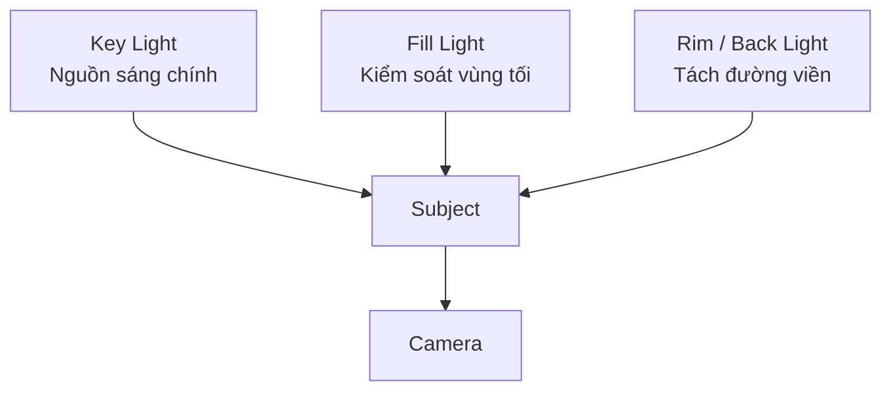
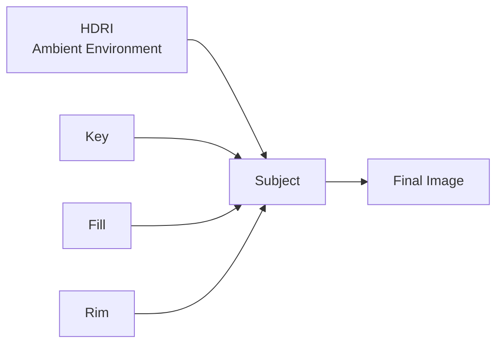

# 034 — Lighting Composition Techniques

**Phần:** 04 — Lights
**Thời lượng:** 8:01
**Chủ đề:** Three-Point, Rembrandt, rim light và silhouette
**Loại bài:** lesson

---

## 1. Tóm tắt

Lighting không chỉ có nhiệm vụ làm cho vật thể đủ sáng. Trong một bố cục hình ảnh, ánh sáng còn được dùng để:

* tách subject khỏi background;
* hướng mắt người xem;
* nhấn mạnh hình khối;
* tạo hierarchy trong frame;
* kiểm soát mức độ căng thẳng hoặc bí ẩn;
* quyết định phần nào cần được nhìn thấy và phần nào nên chìm vào bóng tối.

Các kỹ thuật lighting trong Blender có nhiều điểm tương đồng với nhiếp ảnh và điện ảnh. Một số setup phổ biến gồm:

* Butterfly Lighting;
* Overhead Lighting;
* Rembrandt Lighting;
* Silhouette Lighting;
* Split Lighting;
* Underside Lighting;
* Three-Point Lighting.

Trong đó, `Three-Point Lighting` là một hệ thống đặc biệt quan trọng vì nó phân chia rõ trách nhiệm của từng nguồn sáng:

```text
Key Light
    ↓
Tạo hướng sáng chính và form

Fill Light
    ↓
Kiểm soát độ sâu của shadow

Rim / Back Light
    ↓
Tách subject khỏi background
```

Mục tiêu cuối cùng không phải làm mọi khu vực sáng đều, mà là kiểm soát sự khác biệt giữa sáng và tối để tạo bố cục rõ ràng.

---

## 2. Mục tiêu học tập

Sau khi hoàn thành bài này, người học có thể:

* Giải thích được vai trò của ánh sáng đối với composition.
* Phân biệt được các setup Butterfly, Overhead, Rembrandt, Silhouette, Split và Underside.
* Tạo được `Three-Point Lighting` gồm key, fill và rim light.
* Thiết lập `Key Light` làm nguồn sáng chủ đạo.
* Điều chỉnh `Fill Light` mà không làm mất toàn bộ shadow.
* Sử dụng `Rim Light` để tách subject khỏi background.
* Nhận biết và tạo được Rembrandt triangle trên khuôn mặt.
* Tạo silhouette bằng cách đặt nguồn sáng phía sau subject hoặc chiếu sáng background.
* Kết hợp HDRI với các scene lights mà không phá hierarchy ánh sáng.
* Đánh giá một lighting setup dựa trên form, contrast và visual hierarchy thay vì chỉ dựa trên độ sáng.

---

## 3. Lighting là một phần của composition

Một lighting setup tốt cần dẫn mắt người xem đến vùng quan trọng nhất của frame.

Ví dụ, trong một portrait:

```text
Khuôn mặt
    ↓
Vùng quan trọng nhất
    ↓
Key Light mạnh nhất
    ↓
Các vùng phụ nhận ít ánh sáng hơn
    ↓
Background không cạnh tranh với subject
```

Nếu mọi vùng đều có độ sáng gần bằng nhau, visual hierarchy sẽ yếu.

Ngược lại, khi có sự phân cấp rõ ràng:

```text
Subject chính
    ↓
được nhấn mạnh

Shadow
    ↓
giữ hình khối

Background
    ↓
hỗ trợ subject

Rim
    ↓
tách đường viền
```

người xem sẽ dễ nhận biết đâu là chủ thể quan trọng.

Một nguyên tắc cần ghi nhớ là:

> Ánh sáng phụ phải hỗ trợ ánh sáng chính, không cạnh tranh với nó.

---

## 4. Chuẩn bị workspace để chỉnh lighting

Khi xây dựng lighting, nên quan sát đồng thời:

* vị trí nguồn sáng trong scene;
* kết quả từ camera.

Một workflow thuận tiện là chia viewport thành hai vùng:

```text
Viewport 1
→ điều chỉnh Light Object

Viewport 2
→ Camera View + Rendered View
```

Có thể chia cửa sổ bằng cách kéo từ góc của editor để tạo thêm một vùng làm việc.

Trong viewport theo camera:

```text
Numpad 0
```

được dùng để chuyển vào hoặc thoát khỏi `Camera View`.

Workflow này đặc biệt hữu ích vì một nguồn sáng có thể trông hợp lý khi quan sát trong không gian 3D nhưng tạo kết quả rất khác khi nhìn từ camera cuối cùng.

Lighting phải được đánh giá dựa trên frame thực tế sẽ render.

---

## 5. Các setup một nguồn sáng cơ bản

Trước khi sử dụng hệ thống nhiều đèn, cần hiểu một nguồn sáng duy nhất có thể thay đổi hình dạng và cảm xúc của subject như thế nào.

### 5.1. Butterfly và Overhead Lighting

#### Butterfly Lighting

Trong Butterfly Lighting, nguồn sáng thường được đặt:

* phía trước subject;
* cao hơn khuôn mặt;
* hướng xuống khuôn mặt.

```text
      Light
        ↓
        ↓
      Face
```

Ánh sáng tạo một shadow nhỏ dưới mũi, có hình dạng gợi liên tưởng đến cánh bướm.

Kỹ thuật này thường phù hợp với:

* beauty portrait;
* fashion;
* studio photography;
* khuôn mặt cần ánh sáng khá cân đối.

Butterfly Lighting thường tạo cảm giác sạch và tập trung mạnh vào khuôn mặt.

#### Overhead Lighting

Với Overhead Lighting, nguồn sáng được đưa cao hơn và gần vị trí ngay phía trên subject.

```text
       Light
         ↓
         ↓
        Head
         ↓
      Deep Shadow
```

Khi ánh sáng đến từ phía trên quá mạnh:

* hốc mắt tối;
* bóng dưới mũi dài hơn;
* vùng dưới cằm tối;
* khuôn mặt có cảm giác căng thẳng hơn.

Setup này có thể được sử dụng để tạo:

* cảm giác nghiêm trọng;
* căng thẳng;
* áp lực;
* không khí điện ảnh.

Butterfly và Overhead đều đặt light ở vùng phía trên subject, nhưng khác nhau ở góc chiếu và mức độ tạo shadow.

---

### 5.2. Rembrandt và Split Lighting

#### Rembrandt Lighting

Rembrandt Lighting sử dụng nguồn sáng lệch sang một bên của khuôn mặt và thường đặt hơi cao.

Kết quả đặc trưng là một vùng sáng nhỏ hình tam giác xuất hiện trên má phía nằm trong shadow.

```text
             Key Light
                 \
                  \
                   Face
                  /   \
        Bright Side   Shadow Side
                         △
                  Rembrandt Triangle
```

Rembrandt triangle hình thành do shadow từ:

* mũi;
* vùng gò má;
* cấu trúc khuôn mặt.

Một setup Rembrandt tốt không yêu cầu một bên mặt hoàn toàn tối. Điều quan trọng là ánh sáng tạo được form và vùng tam giác đặc trưng.

Nguồn sáng có thể nằm bên trái hoặc bên phải subject tùy composition.

Rembrandt Lighting thường phù hợp với:

* portrait;
* cinematic character;
* artwork cần chiều sâu;
* mood nghiêm túc hoặc giàu cảm xúc.

#### Split Lighting

Split Lighting đặt key light gần bên hông subject.

Mục tiêu là tạo sự phân chia rõ rệt:

```text
Face
├── một phía sáng
└── một phía tối
```

Với khuôn mặt nhìn tương đối thẳng vào camera, đường phân chia thường chạy gần giữa khuôn mặt.

Split Lighting tạo contrast mạnh và thường được sử dụng khi cần:

* mystery;
* tension;
* duality;
* xung đột;
* hình tượng sáng và tối.

Không cần hai nguồn sáng để tạo Split Lighting. Một key light đặt đúng vị trí bên hông đã có thể tạo hiệu ứng chính.

---

## 6. Silhouette và Underside Lighting

### 6.1. Silhouette Lighting

Silhouette được tạo khi subject tối hơn đáng kể so với background hoặc ánh sáng phía sau.

Một cách phổ biến:

```text
Camera
   ↓
Subject
   ↓
Back Light / Bright Background
```

Khi exposure được kiểm soát để background sáng nhưng subject thiếu ánh sáng phía trước, subject trở thành silhouette.

Có thể tạo silhouette bằng:

* đặt nguồn sáng phía sau subject;
* chiếu một light mạnh lên background;
* sử dụng HDRI hoặc môi trường sáng phía sau;
* giảm hoặc loại bỏ front light.

Silhouette đặc biệt hiệu quả khi muốn nhấn mạnh:

* đường viền;
* pose;
* hình dạng;
* sự bí ẩn;
* việc che giấu danh tính.

Silhouette không nhất thiết phải hoàn toàn đen. Có thể giữ một lượng chi tiết rất nhỏ trên subject nếu composition yêu cầu.

---

### 6.2. Underside Lighting

Underside Lighting đặt nguồn sáng phía dưới khuôn mặt hoặc object.

```text
      Face
       ↑
       ↑
     Light
```

Hướng sáng này trái với các điều kiện ánh sáng thông thường mà con người quen nhìn thấy.

Vì vậy nó có thể tạo cảm giác:

* bất thường;
* đáng sợ;
* căng thẳng;
* siêu nhiên.

Ứng dụng quen thuộc là ánh sáng từ:

* điện thoại;
* màn hình;
* đèn cầm tay;
* nguồn sáng thấp dưới khuôn mặt.

Kỹ thuật này thường xuất hiện trong horror hoặc các cảnh cần cố ý phá vỡ cảm giác tự nhiên.

---

## 7. Three-Point Lighting

`Three-Point Lighting` là một trong những hệ thống lighting cơ bản và linh hoạt nhất.

Nó sử dụng ba vai trò chính:



Ba đèn không nên có cùng nhiệm vụ hoặc cùng cường độ.

Hierarchy cơ bản là:

```text
Key Light
    ↓
quyết định hướng sáng

Fill Light
    ↓
hỗ trợ shadow

Rim Light
    ↓
tách silhouette
```

### 7.1. Key Light

`Key Light` là nguồn sáng chính của setup.

Nó quyết định:

* hướng ánh sáng;
* shadow chính;
* form của subject;
* mood tổng thể.

Trong portrait, key có thể được đặt theo kiểu Rembrandt để vừa tạo hình khối vừa mang phong cách điện ảnh.

Ví dụ:

```text
              Key
               \
                \
Camera ---------- Subject
```

Key Light thường là nguồn sáng có ảnh hưởng thị giác mạnh nhất.

Không nhất thiết nó luôn có `Power` lớn nhất về mặt số học, vì kết quả còn phụ thuộc vào:

* khoảng cách;
* kích thước;
* góc chiếu;
* spread;
* màu;
* exposure.

Điều quan trọng là trong hình ảnh cuối cùng, key phải được cảm nhận như nguồn sáng chủ đạo.

---

### 7.2. Fill Light

`Fill Light` được đặt để nâng vùng shadow do key tạo ra.

Nó không có nhiệm vụ loại bỏ shadow.

So sánh:

```text
Không có Fill
→ shadow quá sâu
→ mất chi tiết

Fill phù hợp
→ shadow vẫn tồn tại
→ giữ form
→ thấy thêm chi tiết

Fill quá mạnh
→ hai phía gần sáng bằng nhau
→ khuôn mặt phẳng
```

Đây là một trong những lỗi phổ biến nhất khi xây dựng Three-Point Lighting.

Nếu fill sáng gần bằng key:

```text
Key ≈ Fill
     ↓
Contrast giảm
     ↓
Shadow biến mất
     ↓
Form bị phẳng
```

Vì vậy fill thường:

* yếu hơn key;
* lớn hơn để tạo ánh sáng mềm;
* được đặt ở phía đối diện hoặc gần hướng camera.

Một cách đánh giá fill tốt là:

> Fill phải giúp đọc được shadow, nhưng người xem vẫn nhận ra đâu là phía tối của subject.

---

### 7.3. Rim Light

`Rim Light`, `Back Light` hoặc `Hair Light` thường được đặt phía sau hoặc chếch phía sau subject.

Nó tạo một vùng sáng dọc theo silhouette.

```text
        Rim
         \
          \
        Subject
           \
            Camera
```

Rim giúp:

* tách tóc khỏi background;
* tách vai khỏi background;
* làm rõ silhouette;
* tăng chiều sâu;
* làm subject nổi bật hơn.

Tuy nhiên rim không nên trở thành vùng sáng mạnh nhất một cách vô tình.

Nếu rim quá mạnh:

```text
Rim quá sáng
    ↓
Mắt bị hút ra mép subject
    ↓
Key mất vai trò
    ↓
Visual hierarchy bị phá
```

Có thể đặt rim hơi lệch sang một bên thay vì chính xác phía sau để kiểm soát vùng highlight tốt hơn.

---

## 8. Kiểm soát hierarchy giữa ba nguồn sáng

Three-Point Lighting không đơn giản là bật ba đèn cùng lúc.

Nó là một hệ thống hierarchy.

```text
Key
→ kể câu chuyện chính

Fill
→ giữ thông tin trong shadow

Rim
→ hỗ trợ separation
```

Một workflow hiệu quả là bật từng nguồn sáng theo thứ tự.

**Bước 1 — Chỉ bật Key Light**

Kiểm tra:

* hướng ánh sáng;
* shadow;
* form;
* mood.

Nếu key chưa tốt, không nên cố sửa bằng fill.

**Bước 2 — Thêm Fill Light**

Tăng fill từ mức rất thấp cho tới khi shadow có đủ thông tin.

Dừng trước khi khuôn mặt trở nên phẳng.

**Bước 3 — Thêm Rim Light**

Chỉ tăng tới mức silhouette được tách rõ khỏi background.

**Bước 4 — Kiểm tra tổng thể**

Tắt và bật từng đèn để xác định chính xác đóng góp của chúng.

Workflow này giúp tránh tình trạng có quá nhiều đèn cùng ảnh hưởng đến một khu vực mà không biết nguồn nào đang tạo vấn đề.

---

## 9. Kết hợp Three-Point Lighting với HDRI

HDRI có thể được sử dụng cùng key, fill và rim để cung cấp ánh sáng môi trường.



HDRI có thể bổ sung:

* ambient light;
* reflection;
* màu môi trường;
* detail trong vùng shadow.

Nhưng HDRI không nên vô tình trở thành một key light thứ hai nếu mục tiêu là giữ setup Three-Point rõ ràng.

Ví dụ, nếu mặt trời trong HDRI chiếu trực tiếp vào khuôn mặt trong khi đã có một `Area Light` làm key:

```text
Key Light riêng
       +
Sun mạnh từ HDRI
       ↓
Hai hướng sáng chính cạnh tranh
       ↓
Shadow khó kiểm soát
```

Một giải pháp là xoay HDRI.

Khi sử dụng `Environment Texture`, có thể điều khiển orientation bằng chuỗi node:

```text
Texture Coordinate
        ↓
Mapping
        ↓
Environment Texture
        ↓
Background
        ↓
World Output
```

Nếu `Node Wrangler` được bật, `Ctrl + T` trên `Environment Texture` có thể hỗ trợ tạo các node mapping cần thiết.

Sau đó chỉnh rotation để vùng sáng mạnh của HDRI nằm ở vị trí phù hợp.

---

## 10. Kết hợp các lighting pattern

Các setup lighting không phải những công thức bắt buộc phải sử dụng riêng biệt.

Có thể kết hợp chúng.

Ví dụ:

```text
Rembrandt
+
Three-Point Lighting
```

Trong trường hợp này:

* key tạo Rembrandt triangle;
* fill kiểm soát shadow;
* rim tách subject khỏi background.

Hoặc:

```text
Split Key
+
Rim Light
```

để tạo một portrait có contrast mạnh nhưng vẫn giữ silhouette rõ.

Một setup khác:

```text
Silhouette
+
Top Light
```

có thể giữ phần lớn subject tối trong khi một vài vùng phía trên vẫn nhận highlight.

Có thể xem các lighting pattern như một bộ từ vựng thị giác.

Không cần hỏi:

> Setup nào là đúng?

Thay vào đó nên hỏi:

> Setup nào truyền đạt tốt nhất mood, subject và câu chuyện của frame?

---

## 11. Thực hành

Tạo một scene gồm:

* một bust hoặc character;
* background đơn giản;
* camera;
* ba `Area Light`.

### Giai đoạn 1 — Key Light

Tắt toàn bộ light ngoại trừ key.

Đặt key lệch sang một bên và hơi cao hơn khuôn mặt.

Điều chỉnh đến khi xuất hiện Rembrandt triangle.

Kiểm tra:

* khuôn mặt có form rõ;
* một phía sáng hơn;
* shadow không hoàn toàn mất chi tiết;
* key có hướng rõ ràng.

### Giai đoạn 2 — Fill Light

Tạo fill ở phía đối diện key.

Bắt đầu với cường độ thấp.

Tăng dần cho tới khi vùng shadow có thể đọc được nhưng vẫn tối hơn vùng key.

So sánh:

```text
Key only
vs
Key + Fill
```

Nếu khuôn mặt trở nên phẳng, giảm fill.

### Giai đoạn 3 — Rim Light

Đặt một Area Light phía sau subject và lệch nhẹ sang một phía.

Hướng đèn vào:

* đầu;
* tóc;
* vai;
* mép silhouette.

Điều chỉnh power để rim chỉ nhấn vùng cần thiết.

### Giai đoạn 4 — Rembrandt Variation

Giữ key và thay đổi vị trí của nó để quan sát Rembrandt triangle.

Thử:

* key từ bên trái;
* key từ bên phải;
* key cao hơn;
* key gần camera hơn.

Ghi lại sự thay đổi của shadow trên khuôn mặt.

### Giai đoạn 5 — Silhouette Variation

Tắt key và fill.

Giữ hoặc điều chỉnh back light.

Có thể chiếu thêm một nguồn sáng lên background.

Mục tiêu:

```text
Background sáng
+
Subject tối
=
Silhouette rõ
```

Thử thay đổi vị trí back light để chuyển từ silhouette hoàn toàn sang rim silhouette.

---

## 12. Lỗi thường gặp

**Hiện tượng:** Khuôn mặt sáng đều và thiếu chiều sâu.
**Nguyên nhân:** Fill quá mạnh hoặc nằm quá gần hướng của key.
**Cách xử lý:** Giảm fill và kiểm tra lại tỷ lệ sáng tối.

**Hiện tượng:** Shadow gần như biến mất sau khi thêm fill.
**Nguyên nhân:** Fill đang thay thế key thay vì hỗ trợ key.
**Cách xử lý:** Giảm `Power` hoặc tăng kích thước fill để giữ ánh sáng mềm nhưng yếu hơn.

**Hiện tượng:** Rim sáng hơn toàn bộ khuôn mặt.
**Nguyên nhân:** Rim quá mạnh.
**Cách xử lý:** Giảm cường độ hoặc thay đổi góc để rim chỉ xuất hiện ở vùng cần thiết.

**Hiện tượng:** Subject vẫn hòa vào background dù đã thêm nhiều ánh sáng.
**Nguyên nhân:** Subject và background có độ sáng hoặc màu quá giống nhau.
**Cách xử lý:** Tạo separation bằng rim, background lighting hoặc contrast màu.

**Hiện tượng:** Rembrandt triangle không xuất hiện.
**Nguyên nhân:** Key quá gần camera, quá thấp hoặc góc chiếu chưa đủ lệch.
**Cách xử lý:** Đưa key sang bên và hơi lên cao, sau đó xoay nguồn sáng về khuôn mặt.

**Hiện tượng:** Rembrandt triangle biến thành vùng sáng lớn trên toàn bộ má.
**Nguyên nhân:** Key chưa đủ lệch hoặc fill quá mạnh.
**Cách xử lý:** Điều chỉnh key trước, sau đó kiểm tra fill.

**Hiện tượng:** HDRI phá hỏng shadow từ key.
**Nguyên nhân:** HDRI quá mạnh hoặc vùng sáng chính của HDRI nằm cùng phía không mong muốn.
**Cách xử lý:** Giảm `Background Strength` hoặc xoay HDRI.

---

## 13. Best practices

* Thiết lập key trước rồi mới thêm các đèn hỗ trợ.
* Đánh giá từng light riêng biệt bằng cách bật/tắt chúng.
* Không dùng fill để xóa shadow hoàn toàn.
* Luôn giữ một hướng sáng chính rõ ràng nếu composition yêu cầu hierarchy.
* Dùng rim có chọn lọc thay vì tạo một đường sáng dày quanh toàn bộ subject.
* Quan sát lighting từ camera cuối cùng, không chỉ từ viewport tự do.
* Điều chỉnh kích thước light song song với `Power` để kiểm soát cả độ mềm lẫn cường độ.
* Sử dụng HDRI như một thành phần của lighting system thay vì mặc định để nó quyết định toàn bộ scene.
* Khi lighting một object, hãy suy nghĩ về câu chuyện của object thay vì chỉ cố làm nó sáng.
* Thử nhiều góc light trên cùng một subject để phát triển khả năng cảm nhận lighting.

Ví dụ, với một chiếc bình đơn giản, có thể đặt câu hỏi:

> Nếu đây là một hiện vật quý trong bảo tàng, lighting nên được thiết kế như thế nào để người xem cảm nhận được giá trị của nó?

Câu hỏi như vậy giúp chuyển lighting từ thao tác kỹ thuật sang art direction.

---

## 14. Checklist hoàn thành

* [ ] Giải thích được vai trò của lighting đối với visual hierarchy.
* [ ] Phân biệt được Butterfly và Overhead Lighting.
* [ ] Tạo được Rembrandt Lighting.
* [ ] Nhận biết được Rembrandt triangle.
* [ ] Tạo được Split Lighting bằng một key light.
* [ ] Tạo được silhouette bằng back light hoặc background lighting.
* [ ] Hiểu được tác dụng đặc biệt của Underside Lighting.
* [ ] Thiết lập được `Key Light`.
* [ ] Thiết lập được `Fill Light` mà không xóa toàn bộ form.
* [ ] Thiết lập được `Rim Light` để tách subject khỏi background.
* [ ] Đảm bảo key vẫn là nguồn sáng chủ đạo.
* [ ] Kiểm soát được HDRI để không cạnh tranh với key.
* [ ] Subject tách rõ khỏi background.
* [ ] Rim chỉ nhấn những vùng cần thiết.

---

## 15. Tổng kết

Lighting composition là quá trình sử dụng ánh sáng để kiểm soát cách người xem đọc một frame.

Các pattern như:

* Butterfly;
* Overhead;
* Rembrandt;
* Split;
* Silhouette;
* Underside;

cung cấp những điểm xuất phát khác nhau cho mood và hình khối.

Trong `Three-Point Lighting`, mỗi nguồn sáng có một trách nhiệm riêng:

```text
Key
→ tạo form và hướng sáng chính

Fill
→ kiểm soát độ sâu của shadow

Rim
→ tách subject khỏi background
```

Một setup hiệu quả không yêu cầu mọi khu vực đều sáng. Shadow là một phần cần thiết để biểu diễn form.

Nguyên tắc quan trọng nhất là:

```text
Lighting tốt
≠
nhiều ánh sáng

Lighting tốt
=
kiểm soát ánh sáng và bóng tối
+
hierarchy rõ ràng
+
subject được nhấn đúng chỗ
```

Khi các nguồn sáng hỗ trợ lẫn nhau thay vì cạnh tranh, ngay cả một subject đơn giản cũng có thể trở nên có chiều sâu, giàu cảm xúc và chuyên nghiệp hơn.
