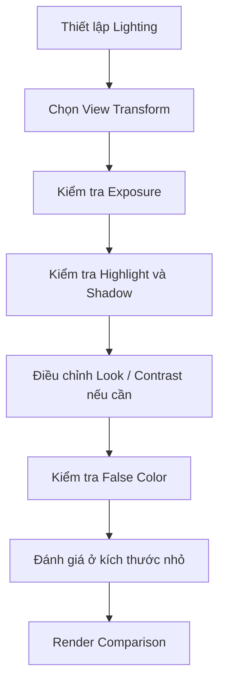

# 036 — Color Space in Blender

**Phần:** 04 — Lights
**Thời lượng:** 3:46
**Chủ đề:** Color Management, View Transform, exposure và contrast
**Loại bài:** lesson

---

## 1. Tóm tắt

Một render không được hiển thị trực tiếp từ các giá trị ánh sáng tuyến tính của scene lên màn hình. Trước khi người xem nhìn thấy hình ảnh, Blender phải chuyển dữ liệu màu và độ sáng của render sang cách hiển thị phù hợp với màn hình.

Quá trình này được quản lý thông qua `Color Management`.

```text
Scene và Light
      ↓
Render Engine
      ↓
Dữ liệu màu tuyến tính
      ↓
View Transform
      ↓
Look / Contrast
      ↓
Exposure
      ↓
Display
```

Vì vậy, cùng một scene, cùng vật liệu và cùng hệ thống đèn vẫn có thể trông rất khác khi thay đổi `View Transform`, `Exposure` hoặc các thiết lập contrast.

Điểm quan trọng là phải phân biệt:

```text
Lighting
≠
Color Management
```

Lighting quyết định ánh sáng thực sự được tính trong scene.

Color Management quyết định cách kết quả đó được biến đổi để hiển thị.

---

## 2. Mục tiêu học tập

Sau khi hoàn thành bài này, người học có thể:

* Giải thích được vai trò của `Color Management` trong pipeline render.
* Phân biệt được dữ liệu ánh sáng của scene với hình ảnh cuối cùng trên màn hình.
* Giải thích được chức năng của `View Transform`.
* Phân biệt được `AgX`, `Filmic` và `Standard` ở mức sử dụng thực tế.
* Nhận biết được hiện tượng highlight bị clipping hoặc chuyển màu không tự nhiên.
* Sử dụng `Look` để điều chỉnh contrast có chủ đích.
* Sử dụng `Exposure` để thay đổi độ sáng quan sát của render.
* Hiểu vì sao không nên dùng `Exposure` để che giấu lỗi lighting.
* Sử dụng `False Color` như một công cụ hỗ trợ đánh giá exposure.
* Giữ Color Management nhất quán khi so sánh nhiều render.

---

## 3. Color Management giải quyết vấn đề gì?

Render engine có thể tính toán một phạm vi độ sáng lớn hơn rất nhiều so với những gì màn hình thông thường có thể hiển thị trực tiếp.

Ví dụ trong cùng một scene có thể tồn tại:

* vùng shadow rất tối;
* da hoặc vật liệu ở mức trung bình;
* reflection mạnh;
* nguồn sáng trực tiếp;
* mặt trời hoặc emission có cường độ rất cao.

Nếu tất cả giá trị này được ánh xạ trực tiếp lên phạm vi hiển thị hẹp của màn hình, những vùng sáng mạnh rất dễ bị đẩy thành màu trắng và mất khả năng phân biệt.

Có thể hình dung:

```text
Dải sáng của scene

Shadow ---------------- Midtone ---------------- Highlight cực mạnh
   |                                                   |
   └──────────────── phạm vi rất rộng ────────────────┘

                         ↓

                  View Transform

                         ↓

Dải hiển thị của màn hình

Black ---------------- Midtone ---------------- White
```

`View Transform` đảm nhiệm việc biến đổi dải giá trị rộng đó thành một hình ảnh có thể quan sát trên display.

---

## 4. Scene-Referred và Display-Referred

Để hiểu Color Management, cần phân biệt hai tầng.

### 4.1. Scene-Referred Data

Đây là dữ liệu biểu diễn quan hệ ánh sáng bên trong scene.

Render engine tính toán dựa trên:

* cường độ nguồn sáng;
* vật liệu;
* reflection;
* indirect lighting;
* emission;
* camera;
* geometry.

Các giá trị này có thể vượt xa phạm vi `0–1`.

Ví dụ một highlight rất mạnh có thể mang giá trị lớn hơn `1.0`.

Điều đó không có nghĩa render đã sai.

---

### 4.2. Display-Referred Image

Màn hình không thể hiển thị trực tiếp toàn bộ phạm vi giá trị của scene.

Do đó cần một phép biến đổi:

```text
Scene-Referred
      ↓
View Transform
      ↓
Display-Referred
      ↓
Màn hình
```

Đây là một trong những lý do cùng một dữ liệu render có thể mang nhiều appearance khác nhau tùy cách xem.

---

## 5. View Transform

`View Transform` là một trong những thiết lập quan trọng nhất của Color Management.

Nó ảnh hưởng mạnh tới:

* highlight roll-off;
* contrast;
* saturation;
* cách màu chuyển dần khi tiến gần vùng rất sáng;
* khả năng giữ cảm giác tự nhiên ở vùng cường độ cao.

Trong Blender, các lựa chọn có thể bao gồm những transform như:

* `AgX`;
* `Filmic`;
* `Standard`;

tùy phiên bản và cấu hình Color Management đang sử dụng.

### 5.1. AgX

`AgX` là View Transform được thiết kế để xử lý scene-referred rendering với dải sáng rộng và tạo chuyển tiếp highlight dễ kiểm soát hơn so với cách hiển thị trực tiếp bằng `Standard`.

Có thể hình dung:

```text
Highlight mạnh
      ↓
AgX
      ↓
Chuyển dần về vùng sáng
      ↓
Giữ cấu trúc hình ảnh tốt hơn
```

Điều này đặc biệt hữu ích khi scene có:

* nguồn sáng mạnh;
* reflection sáng;
* vật liệu có màu bão hòa;
* chênh lệch lớn giữa shadow và highlight.

Một lợi ích quan trọng là những màu rất sáng có thể chuyển dần về vùng highlight một cách có kiểm soát hơn thay vì đột ngột trở thành vùng màu bị clipping.

---

### 5.2. Standard

`Standard` cho kết quả gần với việc ánh xạ dữ liệu hiển thị theo cách trực tiếp hơn.

Với scene có dynamic range lớn, điều này dễ dẫn đến:

```text
Giá trị sáng tăng
      ↓
Một hoặc nhiều kênh màu đạt giới hạn hiển thị
      ↓
Clipping
      ↓
Mất chi tiết hoặc thay đổi hue
```

Ví dụ một bề mặt đỏ rất mạnh có thể nhanh chóng trở thành vùng đỏ cực gắt rồi tiến tới clipping khi illumination tăng.

`Standard` không phải lúc nào cũng "sai". Nó có thể hữu ích cho một số workflow hoặc mục đích hiển thị cụ thể.

Tuy nhiên, với rendering có ánh sáng vật lý và dynamic range lớn, cần hiểu rõ hậu quả của việc sử dụng nó.

---

### 5.3. Filmic

`Filmic` là View Transform được sử dụng rộng rãi trong nhiều phiên bản Blender trước khi `AgX` trở thành lựa chọn hiện đại hơn trong workflow mặc định.

Nó cũng được thiết kế để xử lý scene có dynamic range lớn tốt hơn `Standard`.

Trong các project cũ, vẫn có thể gặp:

```text
View Transform: Filmic
```

Không nên đổi một project từ `Filmic` sang `AgX` giữa quá trình sản xuất mà không kiểm tra lại toàn bộ hình ảnh, bởi appearance có thể thay đổi.

---

## 6. Vì sao View Transform thay đổi saturation?

Một nhầm lẫn phổ biến là cho rằng View Transform chỉ thay đổi brightness.

Thực tế nó có thể ảnh hưởng tới cả cách màu được cảm nhận.

Giả sử một object có màu xanh rất bão hòa và nhận ánh sáng cực mạnh.

Ba kênh màu không nhất thiết tăng đến giới hạn hiển thị cùng lúc.

Nếu phép biến đổi không xử lý tốt vùng này:

```text
Màu bão hòa
      +
Ánh sáng rất mạnh
      ↓
Một số channel clip trước
      ↓
Hue thay đổi
      ↓
Highlight thiếu tự nhiên
```

Một View Transform phù hợp giúp kiểm soát quá trình các màu tiến về vùng highlight.

Do đó, khi đổi `AgX` sang `Standard`, sự khác biệt dễ nhận thấy nhất thường không chỉ nằm ở brightness mà còn ở:

* saturation;
* highlight;
* hue;
* contrast tổng thể.

---

## 7. Contrast và Look

Một View Transform ưu tiên bảo toàn dynamic range có thể khiến hình ảnh ban đầu trông ít contrast hơn mong muốn.

Điều này không nhất thiết là lỗi.

Thay vì phá lighting để tăng contrast, có thể sử dụng `Look` hoặc các công cụ grading phù hợp.

Tùy phiên bản Blender, Color Management có thể cung cấp những lựa chọn appearance hoặc contrast khác nhau.

Ý tưởng chung là:

```text
View Transform
→ xử lý ánh xạ chính

Look
→ điều chỉnh appearance / contrast
```

Ví dụ:

```text
Low Contrast
→ chuyển tiếp mềm hơn

Medium Contrast
→ cân bằng

High Contrast
→ tăng separation sáng tối
```

Khi tăng contrast:

* highlight có thể nổi bật hơn;
* shadow sâu hơn;
* màu có thể trông mạnh hơn;
* hình ảnh có cảm giác "punchy" hơn.

Tuy nhiên, tăng contrast không nên trở thành cách sửa mọi vấn đề.

Nếu lighting đã sai:

```text
Key đặt sai
+
Fill quá mạnh
+
Background quá sáng
```

thì một contrast preset không giải quyết được nguyên nhân.

---

## 8. Exposure

`Exposure` trong Color Management thay đổi mức exposure của hình ảnh quan sát.

Về nguyên tắc, một stop tương ứng với hệ số hai về lượng sáng:

```text
Exposure +1
→ sáng hơn khoảng 2×

Exposure +2
→ sáng hơn khoảng 4×

Exposure -1
→ còn khoảng 1/2

Exposure -2
→ còn khoảng 1/4
```

Điều này làm exposure rất hữu ích khi cần điều chỉnh toàn bộ hình ảnh theo stop.

Tuy nhiên cần phân biệt:

```text
Exposure
→ thay đổi mức sáng tổng thể khi xem kết quả

Light Power
→ thay đổi đóng góp của một nguồn sáng cụ thể
```

Nếu khuôn mặt tối vì key light đặt sai vị trí, tăng global exposure sẽ đồng thời làm:

* background sáng hơn;
* rim sáng hơn;
* highlight mạnh hơn;
* toàn bộ scene thay đổi.

Do đó:

> Không nên dùng Exposure để sửa lỗi light placement.

---

## 9. Exposure không thay thế Lighting

Xét một trường hợp:

```text
Subject tối
Background đúng
```

Có hai cách xử lý.

**Cách A:**

```text
Tăng global Exposure
```

Kết quả:

```text
Subject sáng hơn
+
Background cũng sáng hơn
+
Highlight cũng tăng
```

**Cách B:**

```text
Điều chỉnh Key Light
```

Kết quả:

```text
Subject sáng hơn
+
Background gần như giữ nguyên
+
Hierarchy được kiểm soát tốt hơn
```

Nếu vấn đề mang tính cục bộ, nên sửa chính nguồn sáng gây ra vấn đề.

Color Management nên là tầng kiểm soát appearance tổng thể, không phải công cụ che giấu lighting setup chưa tốt.

---

## 10. Gamma và điều chỉnh bổ sung

Một số cấu hình Color Management có thể cung cấp thêm các điều khiển như `Gamma` hoặc các thiết lập appearance khác.

Những công cụ này có thể làm thay đổi distribution của tone trong hình ảnh.

Tuy nhiên, đối với workflow cơ bản:

```text
Lighting
      ↓
View Transform
      ↓
Look
      ↓
Exposure
```

thường đã đủ để đánh giá phần lớn vấn đề liên quan đến ánh sáng.

Các chỉnh sửa mang tính grading phức tạp hơn có thể được thực hiện ở giai đoạn compositing hoặc post-production.

Ví dụ:

* Blender Compositor;
* DaVinci Resolve;
* After Effects;
* Photoshop;

tùy loại sản phẩm cuối.

Nguyên tắc quan trọng là tránh thực hiện quá nhiều correction trong Color Management khi lighting hoặc material vẫn chưa ổn định.

---

## 11. False Color

`False Color` là một chế độ visualization giúp đánh giá các mức exposure trong hình ảnh thông qua màu giả.

Thay vì hiển thị màu vật liệu thông thường:

```text
Render màu thực
```

False Color chuyển các vùng theo mức độ sáng thành những màu đại diện:

```text
Mức exposure
      ↓
Màu visualization
```

Nhờ đó người làm lighting có thể dễ dàng phát hiện:

* vùng rất tối;
* vùng shadow;
* midtone;
* vùng sáng;
* highlight rất mạnh;
* phạm vi exposure đang phân bố như thế nào.

False Color đặc biệt hữu ích khi màu sắc của material khiến mắt khó đánh giá brightness khách quan.

Ví dụ một màu đỏ saturated có thể tạo cảm giác rất sáng mặc dù luminance thực tế không cao như cảm giác thị giác.

False Color loại bỏ phần lớn sự đánh lừa đó bằng cách tập trung vào mức exposure.

---

## 12. Không hiểu False Color như cảnh báo trắng và đen đơn giản

False Color không nên được hiểu theo quy tắc:

```text
Trắng = sai
Đen = sai
```

Một scene hoàn toàn có thể cần:

* vùng cực tối;
* highlight rất mạnh;
* silhouette;
* nguồn sáng trong frame.

Điều quan trọng là context.

Ví dụ:

```text
Mặt trời
→ có thể cực sáng

Silhouette
→ có thể rất tối

Khuôn mặt chính
→ thường cần exposure dễ đọc hơn
```

False Color là công cụ đo và quan sát, không phải một bộ quy tắc tự động quyết định hình ảnh đẹp hay xấu.

---

## 13. Đánh giá render ở kích thước nhỏ

Một kỹ thuật đơn giản nhưng hiệu quả là thu nhỏ render và quan sát toàn bộ composition.

Khi hình ảnh nhỏ lại, mắt ít tập trung vào:

* texture chi tiết;
* pore;
* noise nhỏ;
* chi tiết model.

Thay vào đó, dễ thấy hơn:

* silhouette;
* vùng sáng lớn;
* vùng tối lớn;
* focal point;
* separation giữa subject và background.

Có thể hình dung:

```text
Zoom gần
→ thấy detail

Zoom xa
→ thấy composition
→ thấy lighting hierarchy
```

Một render có thể rất đẹp khi zoom vào khuôn mặt nhưng thất bại ở thumbnail nếu subject hòa vào background.

Vì vậy nên kiểm tra cả hai.

---

## 14. Workflow Color Management hợp lý

Một workflow hiệu quả có thể đi theo thứ tự:



Điểm quan trọng là giữ thứ tự tương đối ổn định.

Nếu liên tục thay đổi:

* light power;
* exposure;
* View Transform;
* contrast;
* material;

cùng lúc, rất khó biết yếu tố nào thực sự cải thiện hoặc phá hỏng hình ảnh.

---

## 15. Giữ Color Management nhất quán khi so sánh

Khi so sánh hai lighting setup, các thiết lập Color Management phải giống nhau.

Ví dụ không nên:

```text
Render A
AgX
Exposure 0
Look trung tính

so với

Render B
Standard
Exposure +1
High Contrast
```

Sau đó kết luận rằng lighting B đẹp hơn.

Đó không còn là một phép so sánh lighting hợp lệ.

Một comparison có kiểm soát nên giữ:

```text
Camera             = giống nhau
Resolution         = giống nhau
View Transform     = giống nhau
Look               = giống nhau
Exposure           = giống nhau
World              = giống nhau
```

và chỉ thay đổi yếu tố đang được thử nghiệm.

---

## 16. Thực hành

Sử dụng một scene có:

* subject;
* background;
* ít nhất một key light;
* vùng shadow rõ;
* một số highlight mạnh.

Không thay đổi light trong quá trình thử nghiệm đầu tiên.

### 16.1. So sánh View Transform

Render hoặc quan sát scene với các View Transform khả dụng, chẳng hạn:

```text
AgX
Standard
Filmic
```

nếu chúng tồn tại trong phiên bản Blender đang sử dụng.

Ghi lại:

| View Transform | Highlight | Shadow | Saturation | Contrast | Nhận xét |
| -------------- | --------- | ------ | ---------- | -------- | -------- |
| `AgX`          |           |        |            |          |          |
| `Standard`     |           |        |            |          |          |
| `Filmic`       |           |        |            |          |          |

Đặc biệt quan sát:

* highlight trên bề mặt bóng;
* màu saturated;
* transition từ midtone sang highlight;
* vùng gần clipping.

---

### 16.2. So sánh Exposure

Giữ nguyên View Transform.

Thử:

```text
Exposure -2

Exposure -1

Exposure 0

Exposure +1

Exposure +2
```

Ghi lại:

* shadow còn đọc được hay không;
* skin hoặc material ở mức nào;
* highlight bắt đầu mất cấu trúc khi nào;
* background thay đổi như thế nào.

Không điều chỉnh light power trong quá trình thử.

---

### 16.3. So sánh Contrast

Giữ:

```text
View Transform = cố định
Exposure = cố định
Lighting = cố định
```

Sau đó thử các Look hoặc contrast setting khả dụng.

Quan sát:

```text
Shadow separation
Midtone
Highlight
Saturation cảm nhận
```

Mục tiêu là nhận ra rằng contrast có thể thay đổi cảm giác màu ngay cả khi material và light color không đổi.

---

### 16.4. Kiểm tra bằng False Color

Bật `False Color`.

Xác định:

* vùng tối nhất;
* vùng midtone;
* subject chính;
* vùng highlight mạnh nhất.

Sau đó quay lại View Transform bình thường và đối chiếu những gì mắt cảm nhận với phân bố exposure vừa quan sát.

---

## 17. Lỗi thường gặp

**Hiện tượng:** Highlight chuyển nhanh thành trắng và mất màu.
**Nguyên nhân:** View Transform hoặc exposure không phù hợp với dynamic range của scene.
**Cách xử lý:** Kiểm tra View Transform trước, sau đó đánh giá lại lighting và exposure.

**Hiện tượng:** Scene dùng `AgX` trông ít saturated hơn mong muốn.
**Nguyên nhân:** Appearance của transform ưu tiên xử lý dynamic range và highlight thay vì tạo màu cực gắt.
**Cách xử lý:** Điều chỉnh `Look`, grading hoặc màu nguồn một cách có chủ đích thay vì đổi ngay sang `Standard`.

**Hiện tượng:** Tăng Exposure làm subject đúng sáng nhưng background bị cháy.
**Nguyên nhân:** Vấn đề ban đầu nằm ở lighting cục bộ chứ không phải exposure tổng thể.
**Cách xử lý:** Điều chỉnh key light hoặc tỷ lệ giữa subject và background.

**Hiện tượng:** Hai render của cùng scene có màu rất khác nhau.
**Nguyên nhân:** Color Management không giống nhau.
**Cách xử lý:** Kiểm tra `View Transform`, `Look`, `Exposure` và các setting liên quan trước khi so sánh.

**Hiện tượng:** Render trông tốt khi zoom gần nhưng composition yếu.
**Nguyên nhân:** Quá tập trung vào detail mà không kiểm tra hierarchy tổng thể.
**Cách xử lý:** Thu nhỏ hình ảnh và đánh giá silhouette, value grouping và focal point.

**Hiện tượng:** False Color cho thấy vùng rất sáng nên lập tức giảm toàn bộ light.
**Nguyên nhân:** Đang sử dụng False Color như một quy tắc pass/fail.
**Cách xử lý:** Đánh giá mức sáng theo chức năng của vùng đó trong scene.

---

## 18. Best practices

* Chọn `View Transform` có chủ ý ngay từ đầu project.
* Không thay đổi Color Management tùy tiện giữa các shot cần continuity.
* Giữ Color Management giống nhau khi thực hiện A/B comparison.
* Dùng `Exposure` cho điều chỉnh tổng thể, không để sửa một light đặt sai.
* Sửa lighting ở nguồn khi vấn đề chỉ xuất hiện tại một vùng.
* Đánh giá highlight bằng cả mắt và các visualization tool.
* Không mặc định saturation cao hơn đồng nghĩa với hình ảnh tốt hơn.
* Kiểm tra cả highlight, midtone và shadow khi thay đổi contrast.
* Dùng `False Color` như công cụ phân tích, không phải tiêu chuẩn thẩm mỹ tuyệt đối.
* Kiểm tra render ở kích thước nhỏ để đánh giá hierarchy.
* Thực hiện grading phức tạp ở compositing hoặc post-production khi phù hợp.
* Ghi lại hoặc lưu preset Color Management cho các shot cần appearance nhất quán.

---

## 19. Checklist hoàn thành

* [ ] Giải thích được mục đích của `Color Management`.
* [ ] Phân biệt được scene-referred data với hình ảnh hiển thị.
* [ ] Hiểu vai trò của `View Transform`.
* [ ] Phân biệt được đặc điểm sử dụng của `AgX`, `Filmic` và `Standard`.
* [ ] Chọn View Transform có chủ ý.
* [ ] Quan sát được ảnh hưởng của View Transform lên highlight.
* [ ] Quan sát được ảnh hưởng của View Transform lên saturation.
* [ ] Hiểu chức năng của `Look` hoặc contrast setting.
* [ ] Sử dụng được `Exposure` theo stop.
* [ ] Không dùng Exposure để sửa lỗi light placement.
* [ ] Sử dụng được `False Color` để đánh giá phân bố exposure.
* [ ] Kiểm tra được render ở kích thước nhỏ.
* [ ] Giữ Color Management nhất quán khi so sánh render.
* [ ] Lưu lại các thiết lập phù hợp cho shot khi cần continuity.

---

## 20. Tổng kết

Color Management nằm giữa kết quả tính toán ánh sáng của scene và hình ảnh cuối cùng mà người xem nhìn thấy.

Pipeline cơ bản có thể ghi nhớ như sau:

```text
Lighting + Material
        ↓
Scene-Referred Render
        ↓
View Transform
        ↓
Look / Contrast
        ↓
Exposure
        ↓
Display
```

`AgX`, `Filmic` và `Standard` có thể tạo appearance khác nhau dù dữ liệu render gốc không đổi.

Trong đó, View Transform ảnh hưởng đặc biệt mạnh tới:

* highlight;
* dynamic range;
* saturation;
* chuyển tiếp màu;
* contrast cảm nhận.

`Exposure` thay đổi độ sáng tổng thể nhưng không thay thế việc bố trí light đúng.

`False Color` hỗ trợ đánh giá mức exposure, trong khi việc thu nhỏ render giúp kiểm tra visual hierarchy của toàn frame.

Nguyên tắc quan trọng nhất là:

```text
Lighting
→ tạo ra ánh sáng

Color Management
→ quyết định cách ánh sáng đó được hiển thị
```

Một workflow chuyên nghiệp cần kiểm soát cả hai nhưng không dùng cái này để che giấu lỗi của cái kia.
