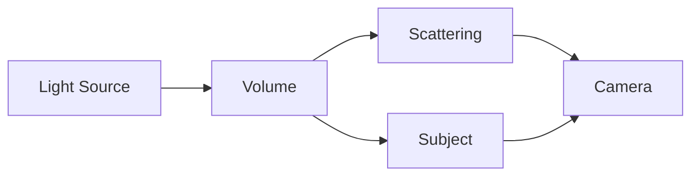
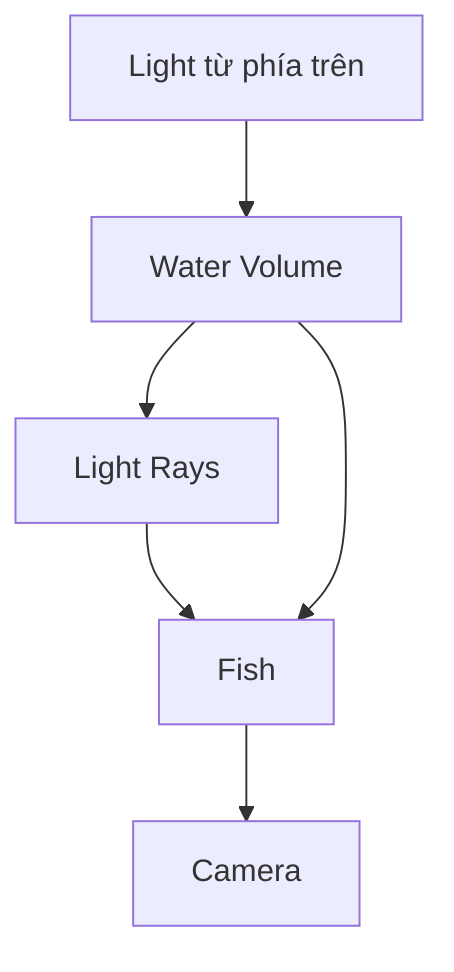

# 038 — Volume Light

**Phần:** 04 — Lights
**Thời lượng:** 5:33
**Chủ đề:** Volumetric fog và light rays
**Loại bài:** lesson

---

## 1. Tóm tắt

`Volumetric Lighting` là kỹ thuật làm cho ánh sáng trở nên nhìn thấy được khi truyền qua một môi trường có các hạt như:

* sương;
* khói;
* bụi;
* hơi nước;
* không khí dưới nước có hạt lơ lửng.

Trong môi trường hoàn toàn trong suốt, chúng ta thường chỉ nhìn thấy nơi ánh sáng chạm vào bề mặt. Khi có volume, một phần ánh sáng bị tán xạ về phía camera nên đường đi của ánh sáng có thể xuất hiện thành những tia rõ ràng.

```text
Light
   ↓
Volume / Fog
   ↓
Ánh sáng bị tán xạ
   ↓
Camera nhìn thấy light ray
```

Trong Blender, volume có thể được tạo bằng `Principled Volume` hoặc `Volume Scatter` và đặt:

* trong một geometry volume như cube;
* hoặc ở cấp `World`.

Đối với hầu hết shot cần kiểm soát tốt, đặc biệt là shot cá có light ray, volume cube thường thực tế hơn vì chỉ tính volumetric trong vùng cần thiết.

Mục tiêu quan trọng nhất không phải tạo fog thật dày mà là tạo lượng volume vừa đủ để tia sáng đọc được trong khi subject vẫn giữ contrast.

---

## 2. Mục tiêu học tập

Sau khi hoàn thành bài này, người học có thể:

* Giải thích được vì sao volume làm tia sáng trở nên nhìn thấy được.
* Tạo được một local volume bằng cube.
* Kết nối `Principled Volume` vào `Material Output`.
* Phân biệt được local volume và World Volume.
* Điều chỉnh `Density` mà không làm subject biến mất trong fog.
* Kiểm soát màu sắc và tính chất tán xạ của volume.
* Dùng `Spot Light` hoặc nguồn sáng có hướng để tạo light ray rõ ràng.
* Tạo gradient density để fog tập trung ở một vùng.
* Kết hợp `Noise Texture`, `ColorRamp` và `Math` để tạo fog không đồng đều.
* Tối ưu volumetric lighting nhằm giảm noise và render time.
* Thiết lập volumetric light phù hợp cho shot dưới nước có cá.
* Thực hiện render test ở samples thấp trước khi render final.

---

## 3. Vì sao chúng ta nhìn thấy tia sáng?

Một tia sáng truyền qua chân không hoặc không khí hoàn toàn sạch không tự nhiên xuất hiện thành một đường sáng nhìn thấy từ bên cạnh.

Chúng ta nhìn thấy light ray khi ánh sáng tương tác với các hạt trong môi trường.

Ví dụ ngoài đời:

```text
Ánh nắng
+
bụi trong phòng
=
tia sáng qua cửa sổ

Đèn sân khấu
+
khói
=
beam nhìn thấy được

Ánh sáng dưới nước
+
hạt lơ lửng
=
god rays
```

Trong Blender, volume mô phỏng môi trường chứa các hạt có khả năng tương tác với ánh sáng.



Camera nhận đồng thời:

* ánh sáng từ subject;
* ánh sáng được tán xạ bên trong volume.

Đây chính là cơ sở của volumetric lighting.

---

## 4. Volume Light gồm hai thành phần

Một hiệu ứng volumetric cần ít nhất:

```text
Volume Medium
+
Light Source
=
Visible Light Ray
```

`Volume` không tự tạo tia sáng nếu không có ánh sáng chiếu qua nó.

Ngược lại, một `Spot Light` mạnh nhưng không có môi trường tán xạ cũng sẽ không tạo beam rõ trong không gian.

Do đó cần kiểm soát cả hai:

| Thành phần      | Vai trò                             |
| --------------- | ----------------------------------- |
| Volume          | Cung cấp môi trường tán xạ          |
| Light           | Cung cấp năng lượng và hướng tia    |
| Density         | Quyết định lượng môi trường         |
| Light direction | Quyết định hình dạng và hướng ray   |
| Camera          | Quyết định mức độ nhìn thấy của ray |

---

## 5. Tạo local volume bằng cube

Cách kiểm soát volume thuận tiện là tạo một cube bao quanh vùng cần hiệu ứng.

Quy trình:

```text
Shift + A
→ Mesh
→ Cube
→ Scale cube bao quanh vùng cần fog
```

Cube không cần bao phủ toàn bộ scene.

Ví dụ với một character hoặc cá:

```text
+--------------------------+
|      Volume Cube         |
|                          |
|       Light Ray          |
|          ↓               |
|        Subject           |
|                          |
+--------------------------+
```

Chỉ những vùng bên trong cube mới có volumetric medium.

Điều này mang lại ba lợi ích:

* kiểm soát vị trí fog tốt hơn;
* dễ debug;
* tránh tính volume ở những vùng không cần thiết.

---

## 6. Hiển thị volume cube thuận tiện trong viewport

Một cube lớn bao quanh subject có thể cản trở việc thao tác trong viewport.

Có thể chuyển cách hiển thị object sang dạng wire:

```text
Object Properties
→ Viewport Display
→ Display As
→ Wire
```

Khi đó:

* cube vẫn tồn tại;
* volume vẫn có thể được render;
* viewport dễ quan sát hơn.

Việc đặt `Display As: Wire` chỉ thay đổi cách object xuất hiện khi làm việc trong viewport, không phải là cách tạo volume shader.

---

## 7. Tạo material volume

Tạo material mới cho cube.

Trong `Shader Editor`, mục tiêu là không sử dụng shader bề mặt thông thường mà đưa volume shader vào đầu vào `Volume` của `Material Output`.

Cấu trúc cơ bản:

```text
Principled Volume
       ↓
Material Output
    [Volume]
```

Không nối volume vào `Surface`.

Nếu cube chỉ được dùng làm container cho fog, có thể không cần shader bề mặt.

Hai node phổ biến để xây dựng volume là:

* `Volume Scatter`;
* `Principled Volume`.

`Volume Scatter` phù hợp với setup đơn giản.

`Principled Volume` cung cấp nhiều tham số hơn và thuận tiện cho các volume phức tạp.

---

## 8. Density — thông số quan trọng nhất

`Density` kiểm soát lượng môi trường volumetric.

Có thể hiểu:

```text
Density thấp
→ fog nhẹ
→ subject rõ
→ light ray tinh tế

Density cao
→ fog dày
→ ray mạnh
→ contrast giảm
→ subject khó nhìn
```

Không có một giá trị density cố định phù hợp với mọi scene.

Kết quả còn phụ thuộc vào:

* kích thước scene;
* kích thước volume;
* cường độ light;
* camera exposure;
* màu volume;
* khoảng cách camera;
* render engine.

Vì vậy nên bắt đầu từ density thấp và tăng dần.

Một workflow an toàn:

```text
Density rất thấp
      ↓
Render test
      ↓
Tăng từng bước nhỏ
      ↓
Dừng khi ray đọc được
      ↓
Không tiếp tục tăng nếu subject bắt đầu mất contrast
```

Đối với light ray, thường chỉ cần đủ fog để ánh sáng được nhìn thấy.

---

## 9. Density cao ảnh hưởng đến render như thế nào?

Volume là một hiệu ứng tương đối tốn tài nguyên.

Density quá lớn thường gây đồng thời:

```text
Density tăng quá cao
        ↓
Nhiều scattering hơn
        ↓
Noise tăng
        ↓
Contrast giảm
        ↓
Render time tăng
```

Ngoài ra:

* background dễ bị wash out;
* shadow bị nâng;
* silhouette yếu;
* vật liệu của subject khó đọc;
* light ray có thể biến thành một vùng sáng mờ lớn.

Do đó:

> Tia sáng rõ không đồng nghĩa với fog phải dày.

Một ray tốt thường đến từ sự kết hợp giữa hướng ánh sáng rõ và density vừa phải.

---

## 10. Màu của volume

`Principled Volume` cho phép thay đổi màu của môi trường tán xạ.

Ví dụ:

```text
Fog trung tính
→ xám rất nhẹ

Atmosphere lạnh
→ xanh nhẹ

Underwater
→ xanh lam / cyan rất nhẹ

Fantasy
→ màu có chủ đích theo mood
```

Cần cẩn thận với saturation.

Nếu volume quá xanh:

```text
Volume saturated
      ↓
Mọi vùng xa bị nhuộm màu mạnh
      ↓
Material mất màu gốc
      ↓
Scene trở nên phẳng
```

Đối với shot dưới nước, thường hiệu quả hơn khi bắt đầu với màu rất nhẹ rồi để:

* World;
* light color;
* material;
* compositing;

cùng tạo màu tổng thể.

---

## 11. Anisotropy và hướng tán xạ

Một thông số hữu ích của volumetric scattering là `Anisotropy`.

Nó kiểm soát xu hướng ánh sáng bị tán xạ theo hướng nào.

Ở mức khái niệm:

```text
Anisotropy ≈ 0
→ scattering tương đối đồng đều

Giá trị dương
→ thiên về forward scattering

Giá trị âm
→ thiên về backward scattering
```

Điều này có thể ảnh hưởng mạnh đến việc camera nhìn thấy light ray như thế nào.

Ví dụ, với ánh sáng chiếu từ phía sau subject về gần hướng camera, forward scattering có thể làm beam trở nên nổi bật hơn.

Không nên tăng anisotropy cực đoan ngay từ đầu. Hãy sử dụng nó như một công cụ tinh chỉnh sau khi:

* density đã hợp lý;
* light direction đã đúng;
* camera đã được cố định.

---

## 12. Chọn nguồn sáng để tạo light ray

Một volume không quyết định hình dạng chính của tia. Light source mới quyết định vùng ánh sáng truyền qua volume.

### Spot Light

`Spot Light` thường là lựa chọn rất thuận tiện khi cần beam rõ.

```text
       Spot
        ↓
       / \
      /   \
     / Fog \
    /       \
```

Có thể kiểm soát:

* hướng;
* `Spot Size`;
* `Blend`;
* `Power`;
* màu;
* kích thước nguồn.

Phù hợp với:

* spotlight;
* tia sáng xuyên cửa;
* đèn sân khấu;
* underwater shaft;
* ray tập trung.

### Area Light

`Area Light` phù hợp khi muốn một nguồn lớn và mềm hơn.

Nó có thể hỗ trợ tạo những vùng sáng rộng qua volume, nhưng nếu cần cone ray rõ ràng, `Spot Light` thường dễ kiểm soát hơn.

### Sun Light

`Sun Light` đặc biệt hữu ích cho các tia song song như:

* ánh nắng xuyên cửa sổ;
* ánh sáng xuyên tán cây;
* god rays;
* ánh sáng từ mặt nước xuống dưới.

Với shot cá dưới nước, `Sun Light` hoặc nguồn sáng định hướng từ phía trên có thể mô phỏng các tia mặt trời xuyên qua mặt nước rất hiệu quả.

---

## 13. Local Volume và World Volume

Volume cũng có thể được đặt trong `World Shader`.

Cấu trúc:

```text
Principled Volume
       ↓
World Output
    [Volume]
```

Khi đó toàn bộ không gian World có thể nhận volumetric medium.

### Local Volume

Ưu điểm:

* giới hạn vùng tính toán;
* dễ đặt vị trí;
* dễ tạo nhiều vùng fog khác nhau;
* dễ debug;
* phù hợp với shot có kiểm soát.

### World Volume

Ưu điểm:

* nhanh thiết lập;
* phù hợp khi toàn scene thực sự cần atmosphere đồng nhất.

Nhược điểm:

* ảnh hưởng toàn bộ scene;
* khó cô lập hiệu ứng;
* có thể làm render nặng hơn;
* khó kiểm soát những vùng không cần fog.

Đối với phần lớn shot cinematic cục bộ:

> Ưu tiên geometry volume khi không cần atmosphere phủ toàn bộ thế giới.

---

## 14. Tạo gradient density

Volume không nhất thiết phải có mật độ giống nhau ở mọi nơi.

Ví dụ:

```text
Fog dày ở đáy
       ↓
Fog giảm dần khi lên cao
```

Có thể tạo bằng gradient.

Cấu trúc khái niệm:

```text
Texture Coordinate
        ↓
Mapping
        ↓
Gradient Texture
        ↓
ColorRamp
        ↓
Density
```

`Gradient Texture` tạo sự thay đổi theo không gian.

`ColorRamp` cho phép kiểm soát:

* vùng nào không có fog;
* vùng nào có fog;
* độ mềm của transition.

Quy ước cơ bản khi dùng mask density:

```text
Black
→ density = 0

White
→ density cao hơn
```

Nếu gradient ngược hướng mong muốn, có thể đảo ramp.

---

## 15. Tạo fog không đồng đều bằng Noise

Fog hoàn toàn đồng nhất thường cho cảm giác khá nhân tạo.

Trong môi trường tự nhiên, mật độ có thể thay đổi do:

* dòng khí;
* khói;
* bụi;
* dòng nước;
* turbulence.

Có thể thêm `Noise Texture`.

```text
Noise Texture
      ↓
ColorRamp
      ↓
Density
```

`ColorRamp` giúp kiểm soát contrast của noise.

Nếu muốn kết hợp gradient với noise:

```text
Gradient Mask ──┐
                ├→ Multiply → Density
Noise Mask ─────┘
```

Trong node:

```text
Gradient
    ↓
ColorRamp
    ↓
       \
        Math: Multiply
       /
Noise Texture
    ↓
ColorRamp
```

Sau đó:

```text
Math
 ↓
Principled Volume
[Density]
```

Kết quả là density vừa:

* được giới hạn theo vùng;
* vừa có variation không đều.

---

## 16. Tại sao dùng Multiply?

Giả sử:

```text
Gradient = vùng fog được phép tồn tại
Noise    = pattern biến thiên bên trong vùng đó
```

Nếu nhân hai giá trị:

```text
Final Density
=
Gradient × Noise
```

thì một vùng có gradient bằng `0` vẫn không có fog dù noise ở đó bằng `1`.

Ví dụ:

```text
0 × 1 = 0
```

Trong vùng gradient cho phép:

```text
1 × 0.7 = 0.7
```

Noise bắt đầu điều khiển density.

Vì vậy `Multiply` là một cách trực quan để kết hợp nhiều mask density.

---

## 17. Volume cho shot cá có light ray

Đối với shot cá dưới nước, volumetric lighting có thể đóng vai trò quan trọng vì nó giúp tạo cảm giác nước có chiều sâu.

Một setup cơ bản:



Nên xây dựng theo thứ tự:

```text
Cá + camera
      ↓
Base lighting
      ↓
Volume cube
      ↓
Density thấp
      ↓
Light ray từ phía trên
      ↓
Tinh chỉnh direction
      ↓
Thêm noise rất nhẹ nếu cần
```

Tia sáng nên giúp:

* dẫn mắt về cá;
* làm rõ chiều sâu;
* cho cảm giác ánh sáng đi từ mặt nước xuống;
* tách cá khỏi background.

Không nên để volume biến toàn bộ bể thành một lớp sương đặc.

---

## 18. Tạo ray cho bể cá cao

Với bố cục bể có chiều cao lớn, hướng tia từ trên xuống thường đặc biệt hiệu quả.

Có thể bố trí:

```text
      Light
     ↓  ↓  ↓
    \   |   /
     \  |  /
      \ | /
       Fish
        ↓
      Depth
```

Tia không nhất thiết phải thẳng đứng tuyệt đối.

Một góc hơi chéo thường:

* dễ đọc hơn từ camera;
* tạo chiều sâu;
* cho thấy rõ beam trong volume.

Để ray nổi bật, tránh đặt camera hoàn toàn cùng trục với tia.

Camera nhìn hơi ngang qua beam giúp nhìn thấy lượng scattering tốt hơn.

---

## 19. Gobo kết hợp với Volume

Gobo và volume có thể kết hợp để tạo light ray phức tạp.

Ví dụ:

```text
Light
  ↓
Gobo
  ↓
Nhiều vùng sáng nhỏ
  ↓
Volume
  ↓
Các ray riêng biệt
```

Điều này phù hợp để tạo:

* ánh nắng xuyên lá;
* cửa sổ;
* underwater caustic-like shafts;
* khe kiến trúc;
* fantasy lighting.

Với shot cá, có thể dùng một pattern rất nhẹ để chia một nguồn sáng lớn thành vài tia không đồng đều.

Tuy nhiên cần giữ pattern đơn giản.

Quá nhiều tia nhỏ sẽ:

* tăng visual noise;
* cạnh tranh với cá;
* khiến scene trông giống effect demo hơn là môi trường tự nhiên.

---

## 20. Kiểm soát composition của light ray

Một light ray tốt cần có điểm bắt đầu, hướng và vùng kết thúc hợp lý.

Có thể đánh giá bằng ba câu hỏi:

```text
Ray đến từ đâu?
      ↓
Ray hướng mắt về đâu?
      ↓
Ray có che subject không?
```

Một setup tốt:

```text
Bright Area
     ↓
   Ray
     ↓
   Fish
```

Một setup kém hiệu quả:

```text
Ray  Ray  Ray  Ray
 \    |   /   /
  \   |  /   /
   che toàn bộ cá
```

Volume không nên làm mất silhouette của subject.

Nếu cá bắt đầu hòa vào fog:

* giảm density;
* tăng separation bằng rim;
* giảm ambient light;
* điều chỉnh vị trí ray.

---

## 21. Noise trong volumetric render

Volume thường là một trong những vùng dễ xuất hiện noise nhất.

Nguyên nhân là render engine phải ước lượng rất nhiều tương tác giữa:

* camera rays;
* volume;
* light;
* scattering.

Các vùng đặc biệt dễ noise:

* volume tối;
* light nhỏ nhưng mạnh;
* nhiều indirect light;
* density cao;
* ray hẹp;
* scene có nhiều volume layer.

Không nên lập tức tăng samples rất cao.

Workflow hiệu quả hơn:

```text
Samples thấp
      ↓
Kiểm tra composition
      ↓
Sửa density / light
      ↓
Kiểm tra noise
      ↓
Tăng quality khi setup đã ổn
```

---

## 22. Tối ưu render time

Volumetric lighting nên được tối ưu từ cấu trúc scene trước khi tăng chất lượng render.

Các chiến lược hữu ích:

* chỉ tạo volume tại vùng cần thiết;
* giữ density thấp nhất có thể;
* tránh volume cube lớn hơn scene rất nhiều;
* giảm số light không cần thiết đi qua volume;
* render test ở resolution thấp;
* sử dụng samples thấp khi bố trí;
* chỉ tăng final samples sau khi lighting đã ổn định;
* sử dụng denoising khi phù hợp;
* tránh noise procedural quá chi tiết nếu không nhìn thấy ở camera.

Nguyên tắc:

```text
Tối ưu effect
trước
Tăng samples
```

không phải:

```text
Effect chưa ổn
→ tăng samples cực cao
→ hy vọng render đẹp hơn
```

Samples không sửa được một density quá cao hoặc light placement không phù hợp.

---

## 23. Quy trình thực hành

Tạo một scene có:

* subject;
* camera;
* ít nhất một nguồn sáng;
* background hoặc environment.

### Bước 1 — Tạo volume cube

Thêm cube và scale để chỉ bao phủ vùng cần fog.

Đặt:

```text
Viewport Display
→ Display As
→ Wire
```

### Bước 2 — Tạo volume material

Tạo material mới.

Xóa hoặc bỏ qua shader surface nếu không cần.

Thêm:

```text
Principled Volume
```

và nối:

```text
Principled Volume
→ Material Output: Volume
```

### Bước 3 — Giảm Density

Bắt đầu từ density thấp.

Render test.

Tăng dần cho đến khi fog bắt đầu nhìn thấy nhưng subject vẫn rõ.

**Checkpoint 1:** Có atmosphere nhưng silhouette vẫn đọc tốt.

### Bước 4 — Thêm light ray

Sử dụng `Spot Light` hoặc nguồn sáng có hướng.

Đặt light phía trên hoặc chếch phía sau subject.

Điều chỉnh:

* direction;
* cone;
* power;
* màu.

**Checkpoint 2:** Beam có thể nhìn thấy rõ trong volume.

### Bước 5 — Kiểm tra composition

Di chuyển light để ray:

* không che focal point;
* dẫn mắt về subject;
* tạo separation.

**Checkpoint 3:** Ray hỗ trợ subject thay vì cạnh tranh với subject.

### Bước 6 — Thêm variation nếu cần

Tạo:

```text
Gradient
+
Noise
+
Multiply
```

để density không hoàn toàn đồng nhất.

**Checkpoint 4:** Fog có variation nhưng không trở thành pattern gây mất tập trung.

### Bước 7 — Render test

Render ở:

* resolution thấp hơn final;
* samples thấp;
* denoising nếu workflow sử dụng.

Chỉ tăng quality khi toàn bộ setup đã ổn.

---

## 24. Bài thực hành cho shot cá

Tạo một shot cá có tia sáng từ mặt nước chiếu xuống.

Yêu cầu:

* cá vẫn là focal point;
* volume chỉ đủ để ray nhìn thấy;
* ánh sáng chính đến từ phía trên;
* có ít nhất một ray đi gần hoặc phía sau cá;
* ray không che toàn bộ silhouette;
* màu volume chỉ hơi thiên xanh;
* background tối hơn vùng focal point;
* render test được thực hiện trước final render.

So sánh ba phiên bản:

| Phiên bản | Density    | Ray    | Mục đích          |
| --------- | ---------- | ------ | ----------------- |
| A         | Rất thấp   | Nhẹ    | Tự nhiên          |
| B         | Trung bình | Rõ     | Cinematic         |
| C         | Cao        | Rất rõ | Kiểm tra giới hạn |

Sau đó chọn phiên bản giữ được cân bằng tốt nhất giữa:

```text
Atmosphere
+
Subject readability
+
Render cost
```

---

## 25. Lỗi thường gặp

**Hiện tượng:** Toàn bộ scene trở thành một màn sương trắng.
**Nguyên nhân:** `Density` quá cao.
**Cách xử lý:** Giảm density đáng kể trước khi thay đổi các thông số khác.

**Hiện tượng:** Có fog nhưng không nhìn thấy light ray.
**Nguyên nhân:** Nguồn sáng không đủ định hướng, camera không có góc phù hợp hoặc contrast giữa beam với môi trường quá thấp.
**Cách xử lý:** Điều chỉnh hướng light, camera và tỷ lệ giữa direct light với ambient light.

**Hiện tượng:** Subject mất silhouette.
**Nguyên nhân:** Volume quá dày hoặc ambient scattering quá mạnh.
**Cách xử lý:** Giảm density, thêm separation light hoặc thay đổi vị trí ray.

**Hiện tượng:** Render volume rất noise.
**Nguyên nhân:** Density cao, lighting khó sample hoặc samples test quá thấp.
**Cách xử lý:** Tối ưu volume và lighting trước, sau đó mới tăng samples khi cần.

**Hiện tượng:** Render rất lâu dù fog chỉ xuất hiện trong một góc nhỏ.
**Nguyên nhân:** World Volume hoặc volume geometry bao phủ vùng quá lớn.
**Cách xử lý:** Giới hạn volume bằng geometry nhỏ hơn.

**Hiện tượng:** Noise texture làm fog giống các đám mây cứng.
**Nguyên nhân:** Contrast của noise quá cao hoặc scale quá nhỏ.
**Cách xử lý:** Làm mềm `ColorRamp`, tăng scale pattern và giảm ảnh hưởng noise.

**Hiện tượng:** Light ray trông rất đẹp nhưng người xem không còn nhìn vào cá.
**Nguyên nhân:** Ray có brightness hoặc contrast cao hơn focal point.
**Cách xử lý:** Giảm power, đổi hướng hoặc đặt ray phía sau subject.

---

## 26. Best practices

* Bắt đầu với density thấp.
* Chỉ tăng density đến mức ray vừa đủ đọc.
* Ưu tiên local volume khi chỉ một khu vực cần fog.
* Dùng `Spot Light` khi cần beam có hình dạng rõ.
* Dùng `Sun Light` cho ray gần song song từ khoảng cách xa.
* Kiểm tra light ray từ camera cuối cùng.
* Dùng anisotropy như công cụ tinh chỉnh, không phải cách sửa placement.
* Chỉ thêm noise khi uniform fog thực sự thiếu tự nhiên.
* Giữ procedural noise ở quy mô đủ lớn để đọc được trong shot.
* Đảm bảo subject vẫn có silhouette rõ.
* Tránh để ray trở thành focal point ngoài ý muốn.
* Render test ở samples và resolution thấp.
* Chỉ tăng samples cho final sau khi lighting đã được khóa.
* Với shot cá, ưu tiên ray từ phía trên để hỗ trợ cảm giác môi trường dưới nước.

---

## 27. Checklist hoàn thành

* [ ] Giải thích được nguyên lý volumetric scattering.
* [ ] Tạo được local volume bằng cube.
* [ ] Đặt volume cube ở chế độ `Wire` trong viewport.
* [ ] Kết nối được `Principled Volume` vào `Material Output: Volume`.
* [ ] Phân biệt được local volume với World Volume.
* [ ] Density đủ nhẹ để vẫn nhìn rõ subject.
* [ ] Tia sáng có vùng nhận diện rõ.
* [ ] Light ray có hướng phù hợp với composition.
* [ ] Phân biệt được vai trò của `Density` và light intensity.
* [ ] Biết ảnh hưởng cơ bản của `Anisotropy`.
* [ ] Tạo được gradient density khi cần.
* [ ] Kết hợp được gradient và noise bằng `Multiply`.
* [ ] Noise không làm fog trở nên quá rối.
* [ ] Subject vẫn tách được khỏi background.
* [ ] Volume không làm mất toàn bộ contrast.
* [ ] Render test với samples thấp trước final.
* [ ] Kiểm tra render time trước khi tăng chất lượng.
* [ ] Với shot cá, light ray hỗ trợ focal point thay vì che hoặc cạnh tranh với cá.

---

## 28. Tổng kết

Volumetric lighting xuất hiện khi ánh sáng tương tác với một môi trường có khả năng tán xạ.

```text
Light
+
Volume
=
Visible Light Ray
```

Trong Blender, một workflow linh hoạt là:

```text
Volume Cube
      ↓
Principled Volume
      ↓
Density thấp
      ↓
Directional Light
      ↓
Light Ray
      ↓
Gradient / Noise nếu cần
      ↓
Render Test
```

`Density` là thông số cần được kiểm soát đặc biệt cẩn thận:

```text
Density vừa đủ
→ atmosphere
→ ray rõ
→ subject vẫn đọc được

Density quá cao
→ mất contrast
→ noise
→ render lâu
→ subject chìm trong fog
```

Đối với shot cá, volume đặc biệt hữu ích để mô phỏng ánh sáng xuyên qua nước. Tuy nhiên, tia sáng chỉ thực sự hiệu quả khi nó hỗ trợ bố cục:

```text
Light Ray
      ↓
dẫn mắt
      ↓
nhấn cá
      ↓
tăng chiều sâu
      ↓
tạo cảm giác dưới nước
```

Nguyên tắc quan trọng nhất là:

```text
Volume tốt
≠
fog càng dày càng đẹp

Volume tốt
=
density vừa đủ
+
light direction rõ
+
subject vẫn đọc được
+
render cost có kiểm soát
```

Volumetric lighting nên được xem như một lớp atmosphere hỗ trợ hình ảnh, không phải hiệu ứng cần lấn át subject.
