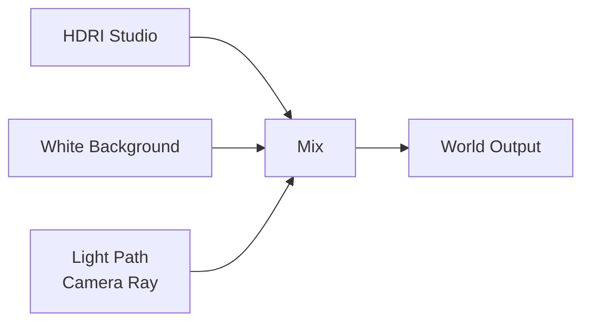

# 039 — Material and Lighting Setup – Part 1

**Phần:** 04 — Lights  
**Thời lượng:** 10:47  
**Chủ đề:** Cân bằng material và nguồn sáng  
**Loại bài:** lab  

---

## 1. Tổng quan

Trong product rendering, material và lighting phải được đánh giá cùng nhau. Một vật liệu kim loại hoặc kính có thể được thiết lập đúng về mặt shader nhưng vẫn trông phẳng nếu môi trường không tạo được highlight phù hợp. Ngược lại, thêm quá nhiều đèn để cố làm rõ hình khối có thể che giấu vấn đề thực sự của model hoặc material.

Bài thực hành này xây dựng nền tảng cho một shot Apple Watch theo reference, bắt đầu từ:

```text
Chuẩn hóa kích thước model
        ↓
Thiết lập camera
        ↓
Khớp composition với reference
        ↓
Thiết lập HDRI
        ↓
Tạo material cơ bản
        ↓
Thiết lập mặt đồng hồ
        ↓
Kiểm soát reflection
        ↓
Tách background khỏi environment lighting
        ↓
Chuẩn bị cho lighting chi tiết
```

Mục tiêu ở giai đoạn này chưa phải tạo lighting cuối cùng, mà là chuẩn bị một scene đủ sạch và có kiểm soát để highlight trên material có thể được đọc chính xác.

---

## 2. Mục tiêu thực hành

Sau khi hoàn thành bài này, người học có thể:

- Chuẩn hóa kích thước một product model trước khi lighting.
- Gom nhiều thành phần của model bằng parent để transform thuận tiện.
- Tạm tắt các thành phần nặng trong viewport để giảm lag.
- Thiết lập camera dựa trên reference.
- Sử dụng tiêu cự `90 mm` cho composition của shot.
- Thiết lập output hình vuông `1920 × 1920`.
- Sử dụng HDRI làm global lighting trong `Cycles`.
- Tạo material kim loại cơ bản cho case.
- Link material giữa các object bằng `Ctrl + L`.
- Áp texture lên mặt đồng hồ và chỉnh UV.
- Kết hợp texture với emission để mô phỏng màn hình phát sáng.
- Xoay HDRI để kiểm soát highlight.
- Tách màu background hiển thị khỏi HDRI dùng cho reflection bằng `Light Path`.
- Đánh giá material thông qua highlight trước khi thêm nhiều light.

---

## 3. Kết quả cần đạt

Cuối bài, scene phải có:

- Apple Watch nằm ở kích thước hợp lý;
- camera gần khớp reference;
- khung hình vuông;
- render engine là `Cycles`;
- HDRI studio làm environment lighting;
- case có material kim loại;
- dây đeo có material riêng;
- mặt đồng hồ hiển thị texture đúng hướng;
- màn hình có emission;
- reflection HDRI đã được điều chỉnh;
- background nhìn từ camera là màu trắng;
- background trắng không thay thế HDRI đang tạo reflection.

Đây là nền tảng để tiếp tục thêm các nguồn sáng chính ở phần sau.

---

## 4. Chuẩn hóa scene trước khi lighting

Một lighting setup tốt nên bắt đầu từ scene có scale và tổ chức rõ ràng.

Model Apple Watch gồm nhiều object:

- polygon mesh;
- curve;
- object sử dụng modifier;
- object phụ phục vụ Boolean;
- các chi tiết của case, button, strap và display.

Nếu transform từng object riêng lẻ, việc thay đổi kích thước và vị trí của toàn bộ watch sẽ rất khó kiểm soát.

Giải pháp là tạo một object điều khiển chung.

### 4.1. Tạo parent cho toàn bộ watch

Tạo một object trung gian, sau đó:

1. Chọn toàn bộ các thành phần của watch.
2. Chọn object dùng làm parent sau cùng để nó trở thành active object.
3. Nhấn:

```text
Ctrl + P
```

4. Chọn:

```text
Object Keep Transform
```

Cấu trúc sau khi parent:

```text
Watch Parent
├── Case
├── Button
├── Display
├── Strap
├── Curves
├── Boolean Objects
└── Other Details
```

`Keep Transform` giúp các object giữ nguyên vị trí hiện tại trong khi được đưa vào hierarchy mới.

---

### 4.2. Sử dụng Outliner khi model phức tạp

Một số object có thể:

- bị ẩn;
- chỉ phục vụ Boolean;
- khó chọn trực tiếp trong viewport.

Trong trường hợp đó, nên lựa chọn chúng từ `Outliner`.

Outliner giúp nhận biết:

- mesh object;
- curve;
- object có modifier;
- hierarchy parent-child.

Khi model phức tạp, đây thường là cách an toàn hơn việc cố box-select mọi thứ trong viewport.

---

## 5. Giảm tải viewport khi transform model

Model có nhiều modifier hoặc geometry phức tạp có thể khiến Blender lag khi di chuyển hoặc scale toàn bộ hierarchy.

Trong giai đoạn chuẩn hóa kích thước, có thể tạm tắt những thành phần không cần thiết khỏi viewport.

Workflow:

```text
Chi tiết nặng
      ↓
Tạm tắt viewport
      ↓
Scale / Move model
      ↓
Hoàn tất camera
      ↓
Bật lại trước khi đánh giá highlight
```

Điều quan trọng là chỉ tắt chúng tạm thời.

Khi chuẩn bị render hoặc kiểm tra reflection, cần bật lại các chi tiết vì hình học nhỏ có thể tạo:

- bevel highlight;
- edge reflection;
- các chuyển tiếp specular quan trọng.

---

## 6. Chuẩn hóa kích thước Apple Watch

Trong scene ban đầu, watch có kích thước quá lớn so với kích thước sản phẩm thực tế.

Reference sử dụng kích thước khoảng:

```text
4.5 cm
```

Có thể dùng công cụ đo trong front view để đưa model về kích thước gần với giá trị này.

Quy trình:

1. Đặt parent của watch về gần tâm tọa độ.
2. Chuyển sang front view.
3. Dùng ruler để kiểm tra kích thước.
4. Scale parent thay vì từng object riêng.
5. Khi đạt kích thước mong muốn, xóa ruler.

Việc chuẩn hóa scale giúp scene dễ kiểm soát hơn khi tiếp tục thiết lập:

- camera;
- lighting;
- environment;
- material.

---

## 7. Thiết lập camera theo reference

Thay vì đặt camera hoàn toàn bằng cảm giác, nên sử dụng reference để khớp:

- góc nhìn;
- khoảng cách;
- perspective;
- framing.

Tạo camera:

```text
Shift + A
→ Camera
```

Sau đó chuyển vào camera view.

```text
Numpad 0
```

---

## 8. Di chuyển camera bằng Walk Navigation

Để điều chỉnh camera theo cách giống điều khiển trong game, sử dụng:

```text
Shift + ~
```

Các phím điều khiển:

| Phím | Chức năng |
|---|---|
| `W` | Tiến |
| `S` | Lùi |
| `A` | Sang trái |
| `D` | Sang phải |
| `Q` | Hạ xuống |
| `E` | Nâng lên |
| Mouse Wheel | Điều chỉnh tốc độ di chuyển |

Cách này đặc biệt hữu ích khi cần tìm nhanh một góc camera gần với reference.

---

## 9. Đặt reference cạnh camera view

Để so sánh trực tiếp, chia workspace thành hai khu vực.

Một bên hiển thị:

```text
Camera View
```

Bên còn lại sử dụng:

```text
Image Editor
```

Sau đó mở ảnh Apple Watch reference.

Bố cục làm việc:

```text
+----------------------+----------------------+
|                      |                      |
|     Camera View      |      Reference       |
|                      |      Image Editor    |
|                      |                      |
+----------------------+----------------------+
```

Workflow này giúp liên tục so sánh:

- rotation;
- perspective;
- tỷ lệ object trong frame;
- khoảng trống xung quanh watch.

---

## 10. Thiết lập lens và resolution

Camera trong shot được đặt khoảng:

```text
90 mm
```

Vào `Camera Properties` và đặt:

```text
Focal Length = 90 mm
```

Tiêu cự dài giúp tạo góc nhìn product tương đối nén và phù hợp với reference đang tái tạo.

Output cần chuyển sang hình vuông:

```text
Resolution X = 1920
Resolution Y = 1920
```

Tỷ lệ:

```text
1 : 1
```

Sau khi thiết lập lens và resolution, tiếp tục di chuyển camera cho tới khi watch gần khớp với reference.

---

## 11. Bật lại chi tiết trước khi đánh giá material

Sau khi camera và scale đã ổn định, bật lại các modifier hoặc chi tiết từng được vô hiệu hóa.

Lý do là các chi tiết nhỏ ảnh hưởng trực tiếp tới cách ánh sáng chạy trên bề mặt.

Đặc biệt với product render:

```text
Bevel nhỏ
      ↓
Highlight
      ↓
Edge dễ đọc
      ↓
Form rõ hơn
```

Nếu geometry bị đơn giản hóa quá nhiều trong lúc đánh giá lighting, người học có thể hiểu sai vấn đề và cố sửa light trong khi nguyên nhân nằm ở hình học.

---

## 12. Thiết lập HDRI làm global lighting

Scene cần có một nguồn ánh sáng môi trường ban đầu trước khi thêm key/fill/rim.

Chuyển sang:

```text
Shader Editor
→ World
```

Thêm `Environment Texture` và load HDRI studio.

Cấu trúc cơ bản:

```text
Environment Texture
        ↓
Background
        ↓
World Output
```

HDRI cung cấp:

- ánh sáng tổng thể;
- reflection;
- highlight lớn trên vật liệu glossy hoặc metallic.

Đây là nền ánh sáng rất quan trọng để đánh giá product material.

---

## 13. Chuyển render engine sang Cycles

Scene được chuyển từ Eevee sang:

```text
Cycles
```

Mục tiêu là đánh giá lighting và reflection với render engine đang được sử dụng cho shot.

Sau khi chuyển engine, nên kiểm tra lại scene vì appearance có thể khác so với viewport trước đó.

---

## 14. Phân biệt ẩn trong viewport và loại khỏi render

Một object không cần xuất hiện trong final render có thể được vô hiệu hóa bằng camera icon trong Outliner.

Hai trạng thái cần phân biệt:

```text
Eye Icon
→ hiển thị trong viewport

Camera Icon
→ tham gia render
```

Có thể tồn tại trường hợp:

```text
Viewport: ON
Render: OFF
```

Object vẫn thấy khi làm việc nhưng không xuất hiện khi render.

Hoặc:

```text
Viewport: OFF
Render: OFF
```

Object được loại khỏi cả hai.

Trước khi lighting, nên dọn sạch các object không cần thiết để tránh:

- shadow ngoài ý muốn;
- reflection lạ;
- geometry xuất hiện trong render.

---

## 15. Thiết lập material kim loại cho case

Case của watch cần phản xạ môi trường để form được đọc rõ.

Tạo material mới và chọn màu gần reference.

Các đặc tính chính:

```text
Base Color
→ màu case

Metallic
→ cao

Roughness
→ thấp để giữ reflection rõ
```

Không nhất thiết phải đặt metallic cực đại nếu kết quả làm case tối hoặc mất detail.

Mục tiêu ở giai đoạn này là tạo material đủ gần reference để bắt đầu đánh giá lighting.

Chưa cần tinh chỉnh shader quá sâu.

---

## 16. Copy material giữa các chi tiết

Case và button cần dùng cùng material.

Thay vì tạo lại shader:

1. Chọn object cần nhận material.
2. `Shift` chọn object đang có material đúng.
3. Đảm bảo object nguồn là active.
4. Nhấn:

```text
Ctrl + L
```

5. Chọn:

```text
Link Materials
```

Cách này giúp nhiều object chia sẻ cùng material và tránh sai lệch thông số.

---

## 17. Thiết lập material cho mặt đồng hồ

Phần display sử dụng một texture của mặt đồng hồ.

Tạo material mới và thêm:

```text
Image Texture
```

Kết nối ban đầu:

```text
Image Texture
      ↓
Base Color
```

Sau đó mở texture mặt đồng hồ.

Texture sẽ chưa tự động khớp chính xác với hình dạng display nếu UV chưa được chuẩn bị.

---

## 18. UV Mapping cho display

Chọn geometry của mặt đồng hồ trong Edit Mode và unwrap:

```text
U
→ Angle Based
```

Sau đó chuyển sang UV workspace hoặc UV Editor để điều chỉnh UV island.

Mục tiêu là:

- texture đúng orientation;
- các cạnh khớp display;
- nội dung mặt đồng hồ không bị méo.

Nếu một số góc UV chưa phủ hết texture mong muốn:

1. Chọn các UV vertex ở vùng góc.
2. Bật `Proportional Editing`.
3. Scale vùng được chọn.

Cách này cho phép mở rộng một phần UV mà không phải biến đổi toàn bộ layout quá mạnh.

---

## 19. Làm màn hình phát sáng bằng Emission

Nếu texture chỉ được nối vào `Base Color`, mặt đồng hồ có thể trông giống một ảnh được dán lên bề mặt.

Màn hình thật cần có cảm giác tự phát sáng.

Do đó texture được đưa vào phần emission của material.

Thiết lập được sử dụng:

```text
Emission Color
→ texture mặt đồng hồ

Emission Strength
→ 3
```

Kết quả:

```text
Texture thông thường
      ↓
trông như ảnh in

Texture + Emission
      ↓
trông giống display phát sáng
```

Base Color có thể được điều chỉnh về tối hoặc đen để tránh mặt đồng hồ trở nên quá sáng theo cách không mong muốn.

---

## 20. Kiểm soát reflection của mặt đồng hồ

Display cũng cần độ glossy.

Thiết lập roughness gần mức thấp giúp bề mặt có reflection rõ hơn.

Tuy nhiên, nếu xuất hiện glare không mong muốn, cần đánh giá xem vấn đề đến từ:

- material;
- environment;
- vị trí highlight.

Không nên ngay lập tức thêm nhiều đèn để xử lý.

Trong setup này, reflection được tiếp tục kiểm soát thông qua environment và thành phần specular của material.

---

## 21. Thiết lập material cho dây đeo

Strap sử dụng một material riêng với màu gần tông:

```text
Milky / off-white
```

Màu được điều chỉnh hơi tối hơn thay vì trắng tuyệt đối.

Sau khi một phần strap có material đúng, dùng:

```text
Ctrl + L
→ Link Materials
```

để áp cùng material cho phần dây còn lại.

Điều này đảm bảo hai phần strap có appearance nhất quán.

---

## 22. Đọc highlight trước khi thêm light mới

Sau khi material cơ bản đã có, cần quan sát highlight trên watch.

Một product glossy được đọc chủ yếu thông qua:

```text
Reflection
+
Highlight
+
Edge transition
```

Nếu highlight không giống reference, chưa chắc shader sai.

Trước tiên hãy kiểm tra:

- HDRI orientation;
- môi trường phản xạ;
- camera;
- geometry;
- roughness.

Nguyên tắc quan trọng:

> Khi material trông chưa đúng, hãy kiểm tra light và reflection environment trước khi liên tục sửa shader.

---

## 23. Xoay HDRI để điều khiển highlight

HDRI không chỉ tạo ánh sáng. Nó còn tạo những vùng phản xạ rõ trên case và display.

Nếu highlight nằm sai vị trí, có thể xoay environment.

Với `Environment Texture`, thêm hệ thống mapping, sau đó thay đổi rotation.

Concept:

```text
Texture Coordinate
        ↓
Mapping
        ↓
Environment Texture
        ↓
Background
        ↓
World Output
```

Xoay HDRI cho tới khi các highlight không mong muốn biến mất hoặc chuyển đến vùng phù hợp.

Trong shot này, mục tiêu là khớp reflection với Apple Watch reference.

---

## 24. Giảm cường độ HDRI

Sau khi orientation gần đạt yêu cầu, HDRI được giảm xuống:

```text
Strength = 0.5
```

Vai trò của HDRI lúc này là:

- tạo environment;
- cung cấp reflection;
- cung cấp lượng global light cơ bản.

Nó chưa phải toàn bộ lighting cuối cùng.

Các nguồn sáng bổ sung sẽ được thêm sau để tạo:

- form;
- edge highlight;
- separation;
- hierarchy.

---

## 25. Vấn đề background và environment

Reference có background trắng.

Tuy nhiên HDRI studio đang được sử dụng lại có background riêng.

Nếu thay HDRI bằng màu trắng hoàn toàn:

```text
Background trắng
      ↓
mất environment studio
      ↓
reflection thay đổi
```

Nếu giữ HDRI:

```text
Reflection đúng
      ↓
nhưng background không giống reference
```

Cần tách hai yêu cầu:

```text
Camera nhìn thấy
→ background trắng

Reflection / lighting
→ vẫn dùng HDRI studio
```

Đây là trường hợp `Light Path` rất hữu ích.

---

## 26. Tách background camera khỏi HDRI bằng Light Path

Trong World Shader, tạo hai nhánh:

```text
Nhánh A
→ HDRI studio

Nhánh B
→ Background trắng
```

Sau đó sử dụng:

```text
Light Path
```

và đầu ra liên quan tới camera ray làm mask để điều khiển việc trộn hai background.

Conceptual flow:



Kết quả mong muốn:

```text
Camera
→ thấy background trắng

Reflection
→ vẫn đọc HDRI studio
```

Đây là một kỹ thuật rất hữu ích trong product rendering vì background hiển thị và environment dùng cho lighting không nhất thiết phải giống nhau.

---

## 27. Vì sao kỹ thuật này quan trọng?

Nếu chỉ thay World bằng màu trắng, case sẽ mất phần lớn reflection từ HDRI.

Nhưng nếu giữ nguyên HDRI, shot không khớp reference.

`Light Path` cho phép kiểm soát hai nhiệm vụ độc lập:

| Thành phần | Nguồn |
|---|---|
| Background thấy từ camera | White Background |
| Lighting | HDRI |
| Reflection | HDRI |
| Product highlight | HDRI + light bổ sung |

Nhờ đó người làm lighting không phải hy sinh reflection chỉ để có background đúng màu.

---

## 28. Checkpoint thực hành

Sau khi hoàn tất giai đoạn này, dừng lại và kiểm tra scene trước khi thêm đèn.

### Checkpoint 1 — Scale

- Watch có kích thước khoảng `4.5 cm`.
- Toàn bộ model có thể transform thông qua parent.

### Checkpoint 2 — Camera

- Lens khoảng `90 mm`.
- Output là `1920 × 1920`.
- Góc camera gần khớp reference.

### Checkpoint 3 — Geometry

- Modifier quan trọng đã được bật lại.
- Object không cần thiết đã bị loại khỏi render.

### Checkpoint 4 — Materials

- Case có material kim loại.
- Button chia sẻ material với case.
- Strap có material phù hợp.
- Display có texture đúng hướng.
- Màn hình có emission strength `3`.

### Checkpoint 5 — Environment

- Render engine là `Cycles`.
- HDRI studio đang hoạt động.
- HDRI được xoay để highlight hợp lý.
- HDRI strength khoảng `0.5`.
- Camera nhìn thấy background trắng.
- Reflection vẫn đến từ HDRI.

---

## 29. Lỗi thường gặp

**Hiện tượng:** Di chuyển hoặc scale watch rất lag.  
**Nguyên nhân:** Quá nhiều object hoặc modifier đang được tính trong viewport.  
**Cách xử lý:** Tạm tắt những thành phần nặng, transform model rồi bật lại.

**Hiện tượng:** Các phần của watch không di chuyển cùng nhau.  
**Nguyên nhân:** Model chưa được gom bằng parent.  
**Cách xử lý:** Parent các thành phần vào một object điều khiển bằng `Ctrl + P → Object Keep Transform`.

**Hiện tượng:** Product khác reference dù camera có vẻ ở đúng vị trí.  
**Nguyên nhân:** Focal length và framing chưa khớp.  
**Cách xử lý:** Kiểm tra lại lens `90 mm`, aspect ratio và khoảng cách camera.

**Hiện tượng:** Mặt đồng hồ trông giống ảnh dán.  
**Nguyên nhân:** Texture chỉ ảnh hưởng `Base Color`.  
**Cách xử lý:** Sử dụng texture cho emission và kiểm soát emission strength.

**Hiện tượng:** Texture mặt đồng hồ bị méo hoặc thiếu ở các góc.  
**Nguyên nhân:** UV layout chưa phủ đúng bề mặt.  
**Cách xử lý:** Chỉnh UV và sử dụng proportional editing khi cần.

**Hiện tượng:** Case có highlight không giống reference.  
**Nguyên nhân:** Reflection environment đang nằm sai hướng.  
**Cách xử lý:** Xoay HDRI trước khi sửa material hoặc thêm light mới.

**Hiện tượng:** Đổi World sang trắng làm product mất reflection đẹp.  
**Nguyên nhân:** Background và environment lighting đang dùng chung một nguồn.  
**Cách xử lý:** Tách camera background khỏi HDRI bằng `Light Path`.

**Hiện tượng:** Material trông sai nên liên tục tăng hoặc giảm shader parameter.  
**Nguyên nhân:** Chưa xác định vấn đề nằm ở material hay lighting.  
**Cách xử lý:** Đọc highlight và environment trước khi sửa shader.

---

## 30. Best practices

- Chuẩn hóa scene scale trước khi tinh chỉnh lighting.
- Parent product phức tạp vào một object điều khiển chung.
- Tạm giảm độ phức tạp viewport khi cần transform object nặng.
- Bật lại geometry chi tiết trước khi đánh giá reflection.
- Dùng reference cạnh camera view thay vì dựa hoàn toàn vào trí nhớ.
- Khớp camera trước khi tinh chỉnh highlight.
- Dùng HDRI làm nền kiểm tra material trước khi thêm nhiều đèn.
- Xoay HDRI để sửa vị trí reflection trước khi thay đổi shader.
- Link material khi nhiều chi tiết cần cùng appearance.
- Sử dụng emission cho display thực sự cần cảm giác phát sáng.
- Phân biệt background thấy từ camera với environment dùng để lighting.
- Không thêm nhiều light chỉ để che vấn đề modeling hoặc reflection.

---

## 31. Bài thực hành

Chuẩn bị một product model có ít nhất:

- body glossy hoặc metallic;
- một chi tiết phát sáng;
- nhiều object sử dụng chung material.

Thực hiện workflow:

```text
1. Gom model bằng parent.
2. Chuẩn hóa scale.
3. Thiết lập camera theo reference.
4. Thiết lập HDRI studio.
5. Tạo material cơ bản.
6. Kiểm tra highlight.
7. Xoay HDRI.
8. Tạo background trắng độc lập bằng Light Path.
```

Sau đó tạo hai ảnh kiểm tra.

**Phiên bản A**

```text
HDRI mặc định
```

**Phiên bản B**

```text
HDRI đã xoay để tối ưu highlight
```

So sánh:

- edge readability;
- form;
- reflection;
- highlight;
- mức độ gần reference.

---

## 32. Checklist hoàn thành

- [ ] Product đã được gom vào hierarchy dễ transform.
- [ ] Scale được chuẩn hóa trước khi lighting.
- [ ] Camera gần khớp reference.
- [ ] Camera sử dụng lens khoảng `90 mm`.
- [ ] Output được đặt `1920 × 1920`.
- [ ] Render engine đã chuyển sang `Cycles`.
- [ ] Các object thừa không xuất hiện trong render.
- [ ] Modifier cần thiết đã được bật khi kiểm tra highlight.
- [ ] Case có material kim loại phù hợp.
- [ ] Các chi tiết dùng chung material đã được link đúng.
- [ ] Texture mặt đồng hồ đã được UV đúng hướng.
- [ ] Display sử dụng emission với strength phù hợp.
- [ ] Strap có material riêng và nhất quán.
- [ ] HDRI studio đang tạo lighting và reflection.
- [ ] HDRI đã được xoay để kiểm soát highlight.
- [ ] HDRI strength được giảm phù hợp với setup.
- [ ] Background nhìn từ camera là trắng.
- [ ] Reflection vẫn đến từ HDRI studio.
- [ ] Highlight giúp đọc form của sản phẩm.
- [ ] Không thêm quá nhiều đèn để che lỗi modeling hoặc material.

---

## 33. Kết quả cuối

Sau bài thực hành, Apple Watch đã được chuẩn bị ở trạng thái sẵn sàng cho lighting chi tiết.

Pipeline hiện tại:

```text
Model
      ↓
Scale chuẩn
      ↓
Camera + Reference
      ↓
Material cơ bản
      ↓
HDRI
      ↓
Reflection được kiểm soát
      ↓
Background trắng độc lập
      ↓
Sẵn sàng thêm Key / Fill / Rim
```

Điểm quan trọng nhất của giai đoạn này là không vội thêm nhiều nguồn sáng.

Với product rendering, reflection chính là một phần quan trọng của việc mô tả hình khối:

```text
Geometry tốt
+
Material đúng
+
Highlight được kiểm soát
=
Form dễ đọc
```

Vì vậy, khi sản phẩm chưa trông đúng, thứ tự kiểm tra nên là:

```text
Geometry
      ↓
Camera
      ↓
Environment
      ↓
Highlight
      ↓
Material
      ↓
Light bổ sung
```

Không nên sử dụng một hệ thống đèn phức tạp để che đi vấn đề nằm ở model, UV hoặc reflection environment.

Ở trạng thái hoàn thành của bài này, scene đã có material, camera, HDRI và background được tách biệt đủ tốt để bước tiếp theo tập trung hoàn toàn vào việc xây dựng ánh sáng chính cho sản phẩm.