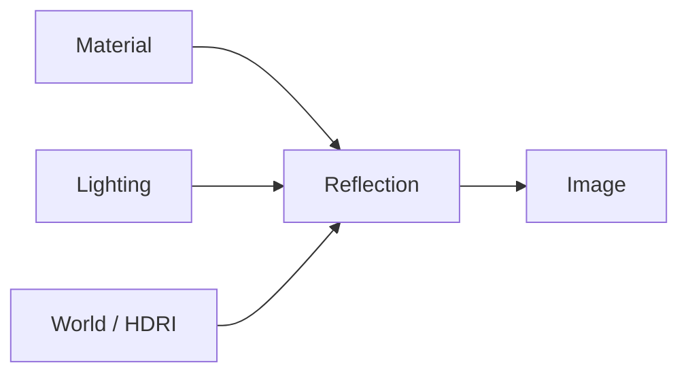

# 040 — Material and Lighting Setup – Part 2

**Phần:** 04 — Lights
**Thời lượng:** 7:52
**Chủ đề:** Tinh chỉnh look-dev và contrast
**Loại bài:** lab

---

## 1. Tổng quan

Giai đoạn look-development cuối của một product render không chỉ là tăng thêm ánh sáng cho đến khi sản phẩm đủ sáng. Mục tiêu thực sự là xây dựng quan hệ có kiểm soát giữa:

* material;
* highlight;
* shadow;
* background;
* màu của sản phẩm;
* độ tương phản giữa các bộ phận.

Trong bài thực hành này, lighting của Apple Watch được tiếp tục hoàn thiện bằng nhiều `Area Light` có vai trò cụ thể. Mỗi nguồn sáng được thêm để giải quyết một vấn đề thị giác rõ ràng, chẳng hạn:

* tạo highlight chính trên case;
* làm rõ cạnh bên;
* tách strap khỏi vùng tối;
* nhấn button;
* giữ lại màu copper của material;
* kiểm soát vùng bị overexposed.

Workflow tổng thể:

```text
Reference
    ↓
Key highlight
    ↓
Side light
    ↓
Bottom highlight
    ↓
Strap separation
    ↓
Button highlight
    ↓
Material refinement
    ↓
World balance
    ↓
A/B test từng biến
```

Nguyên tắc quan trọng nhất của bài là:

> Mỗi lần thay đổi chỉ nên có một mục đích rõ ràng, để biết chính xác biến nào đang cải thiện hoặc làm xấu render.

---

## 2. Mục tiêu thực hành

Sau khi hoàn thành bài này, người học có thể:

* Tổ chức toàn bộ nguồn sáng trong một collection riêng.
* Bố trí viewport để vừa điều chỉnh light vừa theo dõi camera render.
* Tạo highlight chính bằng `Area Light`.
* Điều chỉnh `Power`, kích thước và hình dạng light để kiểm soát highlight.
* Sử dụng nhiều light nhỏ với vai trò riêng thay vì tăng sáng toàn scene.
* Tinh chỉnh `Metallic`, `Roughness`, `Specular` và màu material theo phản xạ thực tế.
* Tạo rim light để tách strap khỏi shadow.
* Tạo highlight cục bộ trên button để tăng cảm giác thể tích.
* Gán material riêng cho một nhóm polygon mà không cần tạo UV mới.
* Điều chỉnh World Strength để khôi phục màu material trong shadow.
* Thực hiện A/B test bằng cách chỉ thay đổi một biến tại một thời điểm.
* Giữ exposure ổn định khi đánh giá các thay đổi lighting.
* Lưu một scene preset trước khi thực hiện các thử nghiệm lớn.

---

## 3. Kết quả cần đạt

Cuối bài, render phải thể hiện được:

* highlight chính gần với reference;
* case có màu copper đọc được rõ;
* strap không chìm hoàn toàn trong shadow;
* button có highlight giúp đọc được thể tích;
* các cạnh sáng không bị cháy trắng quá mức;
* material kim loại vẫn giữ được phản xạ;
* background và World không làm mất contrast;
* mỗi nguồn sáng có vai trò xác định;
* các thay đổi roughness, key size, fill và World Strength được kiểm tra độc lập.

---

## 4. Chuẩn bị workspace và hệ thống light

### 4.1. Tạo collection cho lighting

Tạo một collection riêng và đặt tên:

```text
Light
```

Đưa tất cả các nguồn sáng vào collection này.

Cấu trúc scene nên rõ ràng:

```text
Scene
├── Watch
├── Camera
├── Light
│   ├── Key
│   ├── Side
│   ├── Bottom
│   ├── Strap Rim Back
│   ├── Strap Rim Front
│   └── Button Light
└── World
```

Lợi ích của việc tách collection:

* dễ bật/tắt toàn bộ lighting;
* dễ A/B test;
* dễ quản lý scene;
* tránh lẫn light với geometry của sản phẩm.

### 4.2. Chia viewport để theo dõi kết quả

Nên chia workspace thành hai vùng:

```text
Viewport điều khiển
        +
Camera Render View
```

Một vùng dùng để:

* chọn light;
* di chuyển;
* rotate;
* scale.

Vùng còn lại luôn hiển thị frame từ camera.

Khi tinh chỉnh product lighting, đánh giá cuối cùng phải dựa trên camera chứ không phải chỉ dựa vào góc nhìn tự do trong viewport.

---

## 5. Thiết lập highlight chính

Nguồn sáng đầu tiên được đặt:

* phía trên;
* hơi lệch sang bên phải;
* hướng vào phần case.

Sử dụng:

```text
Shift + A
→ Light
→ Area
```

Vì model đồng hồ có kích thước nhỏ, light mặc định sẽ quá lớn so với sản phẩm. Cần giảm scale và đặt lại vị trí.

Mục tiêu của light đầu tiên là tạo một dải highlight tương tự reference.

Workflow:

```text
Đặt Area Light
      ↓
Giảm kích thước
      ↓
Căn hướng vào case
      ↓
Giảm Power
      ↓
So sánh với reference
```

Nếu highlight quá trắng:

* giảm `Power`;
* tăng kích thước light nếu cần làm highlight mềm hơn;
* kiểm tra màu của light;
* kiểm tra material trước khi thêm light mới.

---

## 6. Điều khiển hình dạng highlight

Hình dạng nguồn sáng ảnh hưởng trực tiếp đến reflection trên product glossy.

Trong setup này, `Area Light` có thể đổi sang dạng tròn như:

```text
Disk
```

Điều này giúp reflection trên sản phẩm có cạnh và hình dạng phù hợp hơn với mục tiêu thị giác.

Có thể hình dung:

```text
Light Shape
      ↓
Reflection Shape
      ↓
Highlight trên product
```

Một product render thường không chỉ sử dụng light để "chiếu sáng".

Light còn hoạt động như một vật thể được phản xạ bởi material.

Do đó cần quan sát:

* chiều dài highlight;
* độ rộng;
* cạnh mềm hay cứng;
* hình dạng phản xạ.

---

## 7. Thêm side light để tạo form

Duplicate light hiện tại:

```text
Shift + D
```

Đặt light mới sang bên phải của watch.

Light này hoạt động gần với tư duy `Split Lighting`:

```text
Side Light
     →
   Watch
```

Mục tiêu:

* tạo highlight ở cạnh bên;
* tách mặt phẳng của case;
* giúp hình khối dễ đọc hơn.

Nếu side light quá mạnh:

```text
Giảm Power
```

Nếu case vẫn quá tối hoặc mất màu, không nên lập tức tăng thêm light.

Cần kiểm tra material.

---

## 8. Khôi phục màu copper của material

Một metallic material phụ thuộc mạnh vào environment và reflection.

Nếu material gần như chỉ xuất hiện đen hoặc trắng:

```text
Material
+
Reflection
→ màu gốc khó đọc
```

Có thể tinh chỉnh:

* `Base Color`;
* saturation;
* `Metallic`.

Trong trường hợp này, màu được đẩy gần hơn về tông copper.

Đồng thời có thể giảm `Metallic` một chút để màu bề mặt đọc rõ hơn.

Mục tiêu không phải loại bỏ tính metallic mà là tìm điểm cân bằng:

```text
Metallic quá cao
→ phản xạ chi phối mạnh
→ màu có thể khó đọc

Metallic giảm vừa phải
→ vẫn có reflection
→ màu copper dễ nhận biết hơn
```

Không nên điều chỉnh nhiều thông số cùng lúc khi đang đánh giá.

---

## 9. Kiểm soát Color Management

Scene sử dụng `Filmic` trong workflow này.

Khi đánh giá lighting, Color Management cần được giữ ổn định.

Ví dụ:

```text
View Transform = Filmic
Exposure = cố định trong A/B test
```

Có thể thay đổi exposure để tìm mức hiển thị tổng thể phù hợp, nhưng sau khi chọn được mức cơ sở thì cần giữ nguyên trong quá trình so sánh các biến lighting.

Nếu vừa đổi:

* light power;
* exposure;
* roughness;

cùng lúc, sẽ không thể xác định yếu tố nào thực sự tạo ra thay đổi.

---

## 10. Tạo highlight từ phía dưới

Reference có thêm một vùng sáng từ phía dưới.

Tạo hoặc duplicate một `Area Light`, sau đó đặt dưới watch.

Mục tiêu là tạo một halo mềm ở cạnh dưới.

Một nguyên tắc quan trọng:

```text
Light nhỏ
→ highlight hẹp
→ cạnh sắc hơn

Light lớn
→ highlight rộng
→ chuyển tiếp mềm hơn
```

Nếu vùng sáng bị cháy trắng:

* tăng kích thước light;
* giảm `Power`;
* điều chỉnh khoảng cách.

Không nên chỉ giảm saturation của material để sửa lỗi highlight bị cháy.

---

## 11. Tách strap khỏi shadow

Strap có thể chìm vào background hoặc vùng tối của scene.

Để tạo separation, thêm rim light phía sau.

```text
        Rim
         ↓
     Strap Edge
         ↓
      Background
```

Power của rim cần thấp hơn mức làm strap trở thành focal point.

Trong setup này, một giá trị thấp khoảng:

```text
Power = 1
```

được sử dụng làm điểm khởi đầu.

Sau đó duplicate light để hỗ trợ phần strap phía trước.

Kết quả mong muốn:

```text
Strap trước
→ có edge highlight

Strap sau
→ không chìm vào black

Case
→ vẫn là focal point chính
```

Rim không nên làm toàn bộ dây sáng đều.

---

## 12. Tạo highlight cho button

Một chi tiết nhỏ như button có thể mất cảm giác thể tích nếu không có highlight.

Hiện tượng:

```text
Button tối đều
→ khó đọc curvature
→ trông phẳng
```

Giải pháp:

1. Duplicate một side light hiện có.
2. Đưa light đến vị trí phù hợp.
3. Căn để chỉ một phần button nhận reflection.

Mục tiêu:

```text
Highlight nhỏ
      ↓
đọc curvature
      ↓
button có volume
```

Nếu vùng highlight lan ra quá nhiều, tiếp tục chỉnh:

* vị trí;
* size;
* power;
* orientation.

---

## 13. Roughness và độ sắc của highlight

`Roughness` ảnh hưởng mạnh đến hình dạng reflection.

Có thể ghi nhớ:

```text
Roughness thấp
→ reflection rõ
→ highlight sắc hơn

Roughness cao
→ reflection blur
→ highlight rộng và mềm
```

Nếu reference có một cạnh highlight sắc hơn nhưng material hiện tại tạo vùng sáng mờ:

```text
Giảm Roughness
```

Tuy nhiên không nên giảm về cực thấp chỉ để tạo highlight.

Roughness vẫn phải phù hợp với bản chất vật liệu.

Do đó luôn A/B test.

---

## 14. A/B test roughness

Giữ nguyên:

```text
Light position
Light size
Light power
Exposure
Camera
World
```

Chỉ thay đổi:

```text
Roughness
```

Ví dụ:

| Phiên bản |  Roughness | Quan sát       |
| --------- | ---------: | -------------- |
| A         |    Cao hơn | Reflection mềm |
| B         | Trung bình | Cân bằng       |
| C         |   Thấp hơn | Highlight sắc  |

Sau đó chọn mức gần với reference nhất.

Không thay đổi metallic trong cùng phép thử.

---

## 15. Tạo dải màu riêng bằng polygon material

Một số phần của watch có một dải màu sáng riêng.

Không cần tạo texture hay UV mới nếu màu chỉ áp dụng cho một vùng polygon đơn giản.

Quy trình:

1. Chọn object.
2. Vào `Edit Mode`.
3. Chọn các polygon cần đổi màu.
4. Tạo material slot mới.
5. Tạo material mới.
6. Chọn màu.
7. Nhấn:

```text
Assign
```

Cấu trúc:

```text
Object
├── Material Slot 1 → material chính
└── Material Slot 2 → dải sáng
```

Đây là cách hiệu quả khi vùng màu đi đúng theo topology.

---

## 16. Điều chỉnh topology của dải màu

Nếu dải màu quá dày, có thể cần điều chỉnh geometry.

Một workflow:

```text
Chọn edge loop
      ↓
Right Click
      ↓
Subdivide
```

Sau đó chọn loop mới và sử dụng:

```text
G G
```

tức `Edge Slide`, để đưa cạnh đến gần vị trí mong muốn.

Nhờ đó có thể kiểm soát bề rộng vùng material mà không cần tạo thêm texture map.

---

## 17. Tinh chỉnh material của dải sáng

Màu trắng tuyệt đối dễ trông quá gắt.

Thay vào đó có thể sử dụng:

* cream;
* off-white;
* vàng nhạt.

Material cũng có thể có roughness cao hơn một chút so với phần kim loại xung quanh.

Mục tiêu:

```text
Dải sáng
→ vẫn đọc được

nhưng

Dải sáng
→ không trở thành vùng trắng cháy
```

Nếu specular highlight không phù hợp, có thể giảm `Specular` của material này.

---

## 18. Điều chỉnh World Strength để khôi phục màu

Nếu vùng shadow rơi quá sâu vào black, có thể tăng nhẹ `World Strength`.

Điều này giúp:

* nâng shadow;
* khôi phục một phần màu copper;
* giữ thêm thông tin trong vùng tối.

Nhưng cần hiểu phạm vi ảnh hưởng:

```text
World Strength tăng
      ↓
toàn scene nhận thêm ambient light
      ↓
shadow nông hơn
      ↓
contrast giảm
```

Vì vậy chỉ tăng vừa đủ.

Không nên dùng World Strength để thay thế toàn bộ fill lighting.

---

## 19. A/B test World Strength

Giữ nguyên tất cả light.

Thử:

```text
A → World Strength thấp

B → World Strength trung bình

C → World Strength cao hơn
```

Quan sát:

* copper color;
* shadow;
* strap;
* contrast;
* background.

Chọn mức thấp nhất vẫn giữ đủ thông tin cần thiết.

---

## 20. Kiểm soát vùng strap bị overexposed

Sau khi thêm nhiều nguồn sáng, strap có thể nhận quá nhiều ánh sáng.

Hiện tượng:

```text
Strap
→ mất texture
→ chuyển gần trắng
→ cạnh bị cháy
```

Không nên giảm global exposure vì các vùng khác đang đúng.

Thay vào đó:

```text
Xác định light gây vấn đề
      ↓
Giảm riêng light đó
```

Ví dụ có thể giảm power xuống khoảng:

```text
0.3
```

nếu đó là mức phù hợp với scene.

Nguyên tắc:

> Vấn đề cục bộ nên được sửa bằng điều khiển cục bộ.

---

## 21. Material anisotropic cho chi tiết kim loại

Một số chi tiết kim loại nhỏ như:

* button;
* rivet;
* chi tiết xoay;

có thể cần phản xạ theo hướng.

Material anisotropic tạo reflection kéo theo một hướng thay vì đồng đều.

```text
Isotropic
→ reflection tương đối đồng đều

Anisotropic
→ reflection kéo theo hướng
```

Có thể điều chỉnh:

* anisotropy;
* rotation;
* specular intensity;
* brightness của material.

Điều này giúp mô phỏng bề mặt kim loại có cấu trúc giống:

* brushed metal;
* machined metal;
* circular machining.

Với các chi tiết nhỏ, anisotropic highlight có thể làm tăng đáng kể cảm giác vật liệu.

---

## 22. Quan hệ giữa material và lighting

Không nên tách material và lighting thành hai quá trình hoàn toàn độc lập.

Một product material chỉ có thể được đánh giá đúng dưới một environment hợp lý.



Ví dụ:

```text
Roughness
→ quyết định độ blur của reflection

Light size
→ quyết định kích thước reflection

Light power
→ quyết định brightness

World
→ quyết định ambient reflection
```

Do đó một highlight không phù hợp có thể đến từ nhiều nguồn.

Cần thay đổi từng yếu tố một.

---

## 23. Quy trình look-dev có kiểm soát

Một workflow tốt:

```text
Reference
    ↓
Xác định highlight quan trọng
    ↓
Tạo light cho highlight đó
    ↓
Khóa light
    ↓
Tinh chỉnh material
    ↓
A/B test
    ↓
Chuyển sang vùng tiếp theo
```

Không nên:

```text
Thêm 6 light
+
đổi material
+
đổi exposure
+
đổi World
+
đổi camera
      ↓
không biết yếu tố nào có tác dụng
```

Look-dev càng gần final càng cần thay đổi có kiểm soát.

---

## 24. Quy tắc một biến mỗi lần

Khi A/B test, chỉ thay đổi một biến.

### Test Roughness

Giữ nguyên:

* light;
* exposure;
* World;
* material color.

Chỉ đổi:

```text
Roughness
```

### Test Key Size

Giữ nguyên:

* power;
* material;
* exposure.

Chỉ đổi:

```text
Area Light Size
```

### Test Fill Level

Giữ nguyên:

* key;
* material;
* camera.

Chỉ đổi:

```text
Fill Power
```

### Test Background hoặc World Value

Giữ nguyên các light.

Chỉ đổi:

```text
World Strength
```

Nhờ đó có thể kết luận:

> Thay đổi này xảy ra vì biến nào?

---

## 25. Thực hành A/B test

Tạo một scene preset trước khi bắt đầu.

Ví dụ:

```text
Watch_LookDev_Base
```

Sau đó tạo các thử nghiệm.

### A/B Test 1 — Roughness

```text
A
→ Roughness hiện tại

B
→ Roughness thấp hơn
```

So sánh:

* độ sắc highlight;
* độ rõ reflection;
* cảm giác kim loại.

### A/B Test 2 — Key Size

```text
A
→ Key nhỏ

B
→ Key lớn
```

Giữ `Power` và exposure ổn định.

Quan sát:

* highlight width;
* shadow softness;
* edge transition.

### A/B Test 3 — Fill Level

```text
A
→ Fill thấp

B
→ Fill cao hơn
```

Quan sát:

* màu copper;
* depth;
* shadow;
* contrast.

### A/B Test 4 — World Strength

```text
A
→ World thấp

B
→ World cao hơn
```

Quan sát:

* vùng black;
* màu vật liệu;
* background;
* separation.

---

## 26. Checkpoint thực hành

### Checkpoint 1 — Key Highlight

* Highlight chính gần reference.
* Không bị cháy trắng.
* Shape của highlight phù hợp.

### Checkpoint 2 — Material

* Copper color vẫn đọc được.
* `Metallic` không làm case đen hoàn toàn.
* `Roughness` tạo reflection phù hợp.

### Checkpoint 3 — Strap

* Strap không chìm trong shadow.
* Rim không sáng hơn case chính.
* Không có vùng strap bị overexposed rõ rệt.

### Checkpoint 4 — Button

* Button có highlight riêng.
* Curvature đọc được.
* Highlight không tràn sang vùng không cần thiết.

### Checkpoint 5 — World

* Shadow vẫn tồn tại.
* World không làm image phẳng.
* Màu copper không bị mất trong black.

---

## 27. Lỗi thường gặp

**Hiện tượng:** Product càng thêm light càng phẳng.
**Nguyên nhân:** Quá nhiều nguồn sáng đang lấp hết shadow.
**Cách xử lý:** Tắt từng light và chỉ giữ những nguồn có vai trò rõ ràng.

**Hiện tượng:** Highlight bị trắng hoàn toàn.
**Nguyên nhân:** Light quá mạnh, quá nhỏ hoặc material có reflection quá sắc.
**Cách xử lý:** Kiểm tra `Power`, light size và `Roughness` lần lượt.

**Hiện tượng:** Case mất màu copper.
**Nguyên nhân:** Metallic/reflection quá mạnh hoặc World quá tối.
**Cách xử lý:** Kiểm tra Base Color, Metallic và World Strength từng bước.

**Hiện tượng:** Strap biến mất trong shadow.
**Nguyên nhân:** Không có separation light phù hợp.
**Cách xử lý:** Thêm rim nhẹ phía sau hoặc phía trước.

**Hiện tượng:** Strap bị cháy sau khi thêm rim.
**Nguyên nhân:** Rim quá mạnh.
**Cách xử lý:** Giảm riêng light gây overexposure thay vì giảm global exposure.

**Hiện tượng:** Button nhìn phẳng.
**Nguyên nhân:** Không có reflection đủ rõ để mô tả curvature.
**Cách xử lý:** Thêm light cục bộ và điều chỉnh roughness.

**Hiện tượng:** Không biết vì sao render tốt hơn sau một loạt thay đổi.
**Nguyên nhân:** Thay đổi quá nhiều biến cùng lúc.
**Cách xử lý:** Quay lại scene preset và thực hiện A/B test một biến mỗi lần.

---

## 28. Best practices

* Tổ chức light trong collection riêng.
* Luôn theo dõi render từ camera khi chỉnh light.
* Dùng light để tạo highlight có mục đích thay vì chỉ tăng brightness.
* Giảm `Power` trước khi cho rằng material đang sai.
* Điều chỉnh light size để kiểm soát softness và reflection width.
* Chỉ dùng rim để tạo separation cần thiết.
* Không làm mọi cạnh của product đều sáng.
* Giữ exposure cố định trong A/B test.
* Tạo scene preset trước những thử nghiệm mạnh.
* Chỉ thay đổi một biến mỗi lần.
* So sánh trực tiếp với reference.
* Kiểm tra World Strength trước khi thêm quá nhiều fill.
* Sử dụng anisotropy khi vật liệu thực sự cần reflection có hướng.
* Không dùng lighting để che lỗi topology hoặc modeling.

---

## 29. Checklist hoàn thành

* [ ] Toàn bộ light nằm trong collection riêng.
* [ ] Workspace cho phép quan sát đồng thời light và camera render.
* [ ] Highlight chính gần với reference.
* [ ] Light size được chọn có chủ đích.
* [ ] Case giữ được màu copper.
* [ ] Metallic không làm mất toàn bộ màu material.
* [ ] Roughness tạo highlight phù hợp.
* [ ] Strap được tách khỏi shadow.
* [ ] Rim không cạnh tranh với focal point.
* [ ] Button có highlight giúp đọc form.
* [ ] Dải material sáng được gán đúng polygon.
* [ ] World Strength không làm mất contrast.
* [ ] Strap không còn vùng overexposed rõ rệt.
* [ ] Material anisotropic được dùng đúng cho chi tiết phù hợp.
* [ ] Biết chính xác biến nào gây thay đổi trong mỗi A/B test.
* [ ] Exposure được giữ ổn định trong khi so sánh.
* [ ] Đã thử thay đổi roughness riêng biệt.
* [ ] Đã thử thay đổi key size riêng biệt.
* [ ] Đã thử thay đổi fill level riêng biệt.
* [ ] Đã thử thay đổi World/background value riêng biệt.
* [ ] Scene preset đã được lưu trước khi thử nghiệm lớn.

---

## 30. Kết quả cuối

Sau khi hoàn tất bài thực hành, product render phải đạt được một hệ thống lighting có hierarchy rõ ràng:

```text
HDRI / World
→ ambient và reflection nền

Key
→ highlight chính

Side Light
→ định hình cạnh bên

Bottom Light
→ tạo halo phía dưới

Rim
→ tách strap

Button Light
→ mô tả chi tiết nhỏ
```

Material và lighting phải hỗ trợ lẫn nhau:

```text
Geometry
+
Material
+
Reflection
+
Light placement
+
Background
=
Product form dễ đọc
```

Look-development hiệu quả không phải quá trình liên tục thêm đèn hoặc chỉnh shader theo cảm giác. Nó là một chuỗi thử nghiệm có kiểm soát:

```text
Một vấn đề
      ↓
Một giả thuyết
      ↓
Một biến được thay đổi
      ↓
A/B comparison
      ↓
Đánh giá kết quả
      ↓
Giữ hoặc hoàn tác
```

Nguyên tắc quan trọng nhất của bài là:

```text
Look-dev tốt
≠
thay đổi thật nhiều thông số

Look-dev tốt
=
biết mình đang thay đổi gì
+
biết vì sao thay đổi
+
đánh giá được tác động
+
có thể quay lại trạng thái trước
```

Khi roughness, light size, fill level, World Strength và exposure được kiểm soát độc lập, việc tái tạo lighting từ reference trở nên chính xác, có hệ thống và dễ lặp lại hơn.
