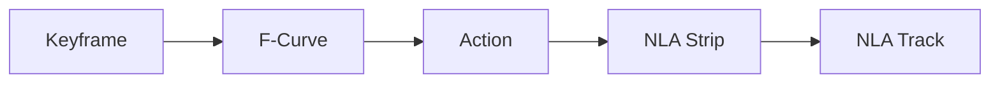
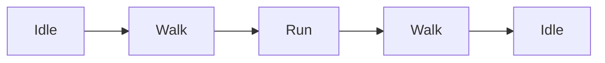

# 049 - Animation Introduction

**Phần:** 07 — Animation
**Chủ đề:** Timeline, keyframe, Dope Sheet, Graph Editor và NLA
**Loại bài:** lesson
**Thời lượng:** 5:31

---

## 1. Tóm tắt

Animation trong Blender được xây dựng từ các **keyframe** đặt tại những thời điểm khác nhau. Blender nội suy giá trị giữa các keyframe để tạo ra chuyển động liên tục.

Một animation đơn giản có thể bắt đầu bằng việc thay đổi `Location`, `Rotation` hoặc `Scale` của một object. Khi animation trở nên phức tạp hơn, Blender cung cấp nhiều editor chuyên biệt:

* `Timeline` để điều hướng và phát animation.
* `Dope Sheet` để quản lý keyframe.
* `Graph Editor` để kiểm soát đường cong chuyển động.
* `Drivers` để liên kết thuộc tính bằng biểu thức hoặc quan hệ phụ thuộc.
* `Nonlinear Animation (NLA)` để tổ chức, tái sử dụng và phối trộn các `Action`.

Bài học này tập trung vào nền tảng cần thiết để tạo animation đầu tiên và hiểu cách dữ liệu chuyển động được tổ chức trong Blender.

---

## 2. Mục tiêu học tập

Sau khi hoàn thành bài này, người học có thể:

* Giải thích được vai trò của frame và keyframe trong animation.
* Tạo animation bằng cách thay đổi `Location`, `Rotation` và `Scale`.
* Điều chỉnh khoảng frame dùng để phát animation.
* Sử dụng `Timeline` để điều hướng theo thời gian.
* Sử dụng `Dope Sheet` để quan sát và chỉnh sửa keyframe.
* Giải thích được vai trò của `Graph Editor`.
* Mô tả được mối quan hệ giữa keyframe, `F-Curve`, `Action` và `NLA Strip`.
* Tạo một chuyển động camera đơn giản bằng keyframe.

---

## 3. Cấu trúc dữ liệu animation trong Blender

Animation trong Blender không chỉ đơn giản là "object chuyển từ điểm A đến điểm B". Phía sau chuyển động đó là một hệ thống dữ liệu có nhiều lớp.



Luồng này có thể hiểu như sau:

* **Keyframe** lưu giá trị của một thuộc tính tại một frame cụ thể.
* Các keyframe của cùng một thuộc tính tạo thành một **F-Curve**.
* Nhiều `F-Curve` liên quan đến cùng một animation được tổ chức trong một **Action**.
* Một `Action` có thể được đưa vào `NLA Editor` dưới dạng **NLA Strip**.
* Nhiều strip có thể nằm trên các `NLA Track` để tạo animation phức tạp hơn.

### 3.1. Keyframe và F-Curve

Giả sử vị trí theo trục `Y` của một cube có hai keyframe:

```text
Frame 1  → Y = -3
Frame 30 → Y = 0
```

Blender không cần người dùng thiết lập thủ công từng frame từ 2 đến 29.

Thay vào đó, Blender tạo một đường cong biểu diễn sự thay đổi của giá trị `Y` theo thời gian và nội suy các giá trị nằm giữa hai keyframe.

Đường cong đó chính là `F-Curve`.

### 3.2. Action và NLA

Một animation có thể chứa nhiều `F-Curve`, chẳng hạn:

```text
Location X
Location Y
Location Z

Rotation X
Rotation Y
Rotation Z

Scale X
Scale Y
Scale Z
```

Nhóm dữ liệu chuyển động này có thể được lưu trong một `Action`.

Ví dụ:

```text
Walk
Run
Jump
Idle
Camera_Move
```

Khi cần phối hợp hoặc tái sử dụng các animation đã hoàn thiện, `Action` có thể được đưa vào `NLA Editor`.

---

## 4. Các editor chính dành cho animation

Blender có nhiều khu vực làm việc với animation. Mỗi editor giải quyết một mức độ khác nhau của quá trình chỉnh chuyển động.

| Editor         | Công dụng chính                                |
| -------------- | ---------------------------------------------- |
| `Timeline`     | Điều hướng frame, phát và dừng animation       |
| `Dope Sheet`   | Quản lý và chỉnh sửa keyframe                  |
| `Graph Editor` | Chỉnh `F-Curve`, timing, easing và tốc độ      |
| `Drivers`      | Điều khiển thuộc tính dựa trên thuộc tính khác |
| `NLA Editor`   | Tổ chức và phối trộn các Action                |

### 4.1. Timeline và Dope Sheet

`Timeline` là nơi phù hợp nhất để bắt đầu học animation.

Nó cho phép:

* di chuyển đến một frame;
* chọn khoảng frame cần phát;
* phát hoặc dừng animation;
* quan sát vị trí các keyframe;
* chuyển nhanh đến đầu hoặc cuối animation.

`Dope Sheet` cung cấp cách quản lý keyframe chi tiết hơn.

Ngoài transform của object, `Dope Sheet` còn có thể hiển thị animation liên quan đến nhiều loại dữ liệu khác như:

* armature;
* bone;
* shape key;
* material;
* camera;
* một số dữ liệu phục vụ compositing và animation khác.

Khi số lượng keyframe tăng lên, `Dope Sheet` thuận tiện hơn `Timeline` để lựa chọn, di chuyển hoặc tổ chức keyframe.

### 4.2. Graph Editor và NLA Editor

`Graph Editor` hiển thị animation dưới dạng các đường cong.

Ví dụ, chuyển động của một object theo trục `Y` có thể được biểu diễn như sau:

```text
Giá trị Y
    ^
    |
  3 |                 ●
    |              /
    |           /
  0 |--------●
    |
 -3 | ●
    +----------------------> Frame
       1       30       60
```

Nhờ `Graph Editor`, có thể kiểm soát:

* tốc độ tăng hoặc giảm của thuộc tính;
* gia tốc và giảm tốc;
* easing;
* overshoot;
* chuyển động mượt hay tuyến tính;
* loop hoặc các dạng lặp phức tạp.

`NLA Editor` hoạt động ở cấp cao hơn. Thay vì chỉnh từng keyframe, nó cho phép làm việc với các đoạn animation hoàn chỉnh.

Ví dụ một nhân vật có thể có:

```text
Run Action
    ↓
Transition
    ↓
Walk Action
```

Các animation này có thể được đặt thành những strip riêng và phối trộn với nhau.

---

## 5. Tạo animation đầu tiên bằng keyframe

Animation cơ bản nhất có thể được tạo bằng hai keyframe: một keyframe đầu và một keyframe cuối.

Giả sử cần cho một cube di chuyển theo trục `Y` trong 30 frame.

Quy trình:

1. Chọn cube.
2. Chuyển đến frame `1`.
3. Đặt cube tại vị trí bắt đầu.
4. Chèn keyframe cho thuộc tính cần animate.
5. Chuyển đến frame `30`.
6. Di chuyển cube đến vị trí mới.
7. Chèn keyframe lần nữa.
8. Phát animation để kiểm tra.

Để chèn keyframe, có thể sử dụng phím:

```text
I
```

Tùy ngữ cảnh và cấu hình `Keying Set`, Blender có thể yêu cầu chọn nhóm thuộc tính cần tạo keyframe.

Nếu mục tiêu là animate toàn bộ transform, có thể keyframe các thuộc tính:

```text
Location
Rotation
Scale
```

hoặc sử dụng lựa chọn tương ứng với `Location, Rotation & Scale`.

> Không nên tạo keyframe cho tất cả thuộc tính nếu chỉ có một thuộc tính thực sự cần animation. Việc keyframe dư thừa làm dữ liệu khó quản lý hơn khi scene trở nên phức tạp.

---

## 6. Frame, thời gian và tốc độ khung hình

Animation trong Blender được tổ chức theo **frame**.

Mối quan hệ giữa thời gian và frame phụ thuộc vào `Frame Rate`.

Công thức:

```text
Thời gian = Số frame / FPS
```

Ví dụ với:

```text
30 FPS
```

thì:

```text
30 frame = 1 giây
60 frame = 2 giây
90 frame = 3 giây
```

Với `24 FPS`:

```text
24 frame = 1 giây
48 frame = 2 giây
```

Do đó, không nên mặc định frame `30` luôn tương đương một giây. Điều này chỉ đúng khi scene đang sử dụng `30 FPS`.

Khoảng animation được kiểm soát bằng:

```text
Start Frame
End Frame
```

Ví dụ:

```text
Start = 1
End   = 60
```

Blender sẽ phát animation trong khoảng frame từ `1` đến `60`.

---

## 7. Kết hợp Location, Rotation và Scale

Một object có thể đồng thời chứa nhiều loại animation.

Ví dụ:

```text
Location → cube di chuyển
Rotation → cube xoay
Scale    → cube thay đổi kích thước
```

Giả sử xây dựng animation:

```text
Frame 1
Cube ở vị trí ban đầu
Rotation ban đầu
Scale = 1

        ↓

Frame 30
Cube di chuyển
Cube xoay
Cube cao hơn theo Z

        ↓

Frame 60
Cube trở lại trạng thái ban đầu
```

Ta có thể tổ chức như sau:

| Frame | Location       | Rotation       | Scale          |
| ----: | -------------- | -------------- | -------------- |
|     1 | Trạng thái đầu | Trạng thái đầu | `(1, 1, 1)`    |
|    30 | Vị trí mới     | Xoay theo `Z`  | Tăng `Scale Z` |
|    60 | Trở về         | Trở về         | `(1, 1, 1)`    |

Kết quả là một animation có nhiều thuộc tính thay đổi đồng thời.

Trong `Dope Sheet` hoặc `Graph Editor`, mỗi thuộc tính sẽ được quản lý độc lập.

Ví dụ:

```text
Object Transforms
├── Location X
├── Location Y
├── Location Z
├── Rotation X
├── Rotation Y
├── Rotation Z
├── Scale X
├── Scale Y
└── Scale Z
```

Điều này đặc biệt quan trọng khi cần sửa một chuyển động mà không làm ảnh hưởng đến các chuyển động khác.

---

## 8. Sao chép keyframe và tạo chuyển động ping-pong

Nếu muốn object quay lại trạng thái ban đầu, không nhất thiết phải thiết lập lại mọi giá trị bằng tay.

Có thể sao chép keyframe.

Trong `Dope Sheet` hoặc `Timeline`:

1. Chọn keyframe cần sao chép.
2. Nhấn:

```text
Shift + D
```

3. Di chuyển bản sao đến frame mong muốn.

Ví dụ:

```text
Frame 1  → trạng thái A
Frame 30 → trạng thái B
Frame 60 → trạng thái A
```

Kết quả:

```text
A → B → A
```

Đây là dạng chuyển động thường được gọi đơn giản là **ping-pong animation**.

Nếu khoảng phát animation kết thúc tại frame `60` và playback được lặp, ta sẽ nhận được chu kỳ:

```text
A → B → A → B → A → ...
```

Phương pháp này phù hợp cho các chuyển động thử nghiệm đơn giản như:

* object lên xuống;
* cửa mở rồi đóng;
* vật thể phóng to rồi thu nhỏ;
* camera tiến rồi lùi;
* hiệu ứng idle đơn giản.

---

## 9. Tạo animation cho camera

Camera cũng là một object và có thể được keyframe giống các object khác.

Một camera shot đơn giản có thể dùng hai trạng thái:

```text
Frame 1
Camera ở xa subject

        ↓

Frame 50
Camera tiến gần subject
```

Quy trình:

1. Tạo hoặc chọn subject cần quay.
2. Chọn `Camera`.
3. Chuyển đến frame đầu.
4. Đặt camera tại vị trí bắt đầu.
5. Tạo keyframe cho transform.
6. Chuyển đến frame cuối.
7. Di chuyển camera đến vị trí mới.
8. Tạo keyframe lần nữa.
9. Phát animation trong `Camera View`.

Khi đang điều hướng trong camera, Blender hỗ trợ chế độ điều khiển giống viewport bằng:

```text
Shift + `
```

Trên nhiều bàn phím, phím này cũng được gọi là:

```text
Shift + ~
```

Sau khi camera được đặt đúng vị trí, cần tạo keyframe để lưu transform tại frame hiện tại.

Nếu chỉ di chuyển camera mà không chèn keyframe mới, vị trí đó sẽ không trở thành một mốc animation.

---

## 10. Action và khả năng tái sử dụng animation

Khi một object đã có dữ liệu animation, Blender có thể tổ chức các `F-Curve` đó trong một `Action`.

Có thể hình dung:

```text
Object
  ↓
Animation Data
  ↓
Action
  ↓
F-Curves
  ↓
Keyframes
```

Một `Action` có thể đại diện cho một chuyển động hoàn chỉnh.

Ví dụ với nhân vật:

```text
Idle
Walk
Run
Jump
Attack
```

Thay vì xây dựng toàn bộ animation thành một chuỗi keyframe duy nhất kéo dài hàng nghìn frame, mỗi chuyển động có thể được quản lý như một `Action` độc lập.

Sau đó `NLA Editor` có thể sử dụng những Action này để xây dựng một chuỗi chuyển động lớn hơn:



Cách tổ chức này đặc biệt hữu ích cho:

* character animation;
* game animation;
* animation lặp;
* chuyển đổi giữa nhiều trạng thái;
* tái sử dụng cùng một chuyển động ở nhiều thời điểm.

---

## 11. Vai trò của Drivers

`Drivers` cũng thuộc hệ thống animation của Blender nhưng hoạt động khác keyframe.

Keyframe nói:

```text
Tại frame 30, Rotation Z = 90°
```

Trong khi Driver có thể diễn đạt một quan hệ kiểu:

```text
Rotation Z của object B
=
Location X của object A × 2
```

Do đó Driver phù hợp cho các hệ thống mà một thuộc tính phải tự động phụ thuộc vào thuộc tính khác.

Ví dụ:

* bánh xe quay theo quãng đường xe di chuyển;
* kim đồng hồ phụ thuộc vào thời gian;
* cơ cấu máy móc;
* rig procedural;
* điều khiển nhiều bone bằng một custom property.

Drivers là chủ đề nâng cao và không cần thiết để tạo những animation keyframe cơ bản.

---

## 12. Lỗi thường gặp khi tạo animation

**Keyframe không xuất hiện sau khi thay đổi transform**

Nguyên nhân thường gặp là object đã được di chuyển nhưng chưa tạo keyframe tại frame mới.

Cách xử lý:

1. Di chuyển đến frame cần thiết.
2. Thay đổi transform.
3. Chèn keyframe cho đúng thuộc tính.
4. Kiểm tra keyframe trong `Timeline` hoặc `Dope Sheet`.

---

**Object thay đổi thuộc tính không mong muốn**

Ví dụ chỉ muốn animate `Location Y` nhưng lại tạo keyframe cho cả `Location`, `Rotation` và `Scale`.

Điều này khiến các thuộc tính không cần thiết bị khóa vào animation.

Cách xử lý là chỉ keyframe những channel thực sự cần.

---

**Animation quá nhanh hoặc quá chậm**

Hãy kiểm tra:

```text
Frame Rate
Start Frame
End Frame
Khoảng cách giữa các keyframe
```

Hai keyframe đặt cách nhau càng xa thì cùng một thay đổi thường diễn ra càng chậm.

---

**Chuyển động đúng vị trí nhưng cảm giác không tự nhiên**

Vấn đề thường nằm ở interpolation chứ không phải ở vị trí keyframe.

Khi đó cần sử dụng `Graph Editor` để kiểm tra và điều chỉnh `F-Curve`.

---

**Camera được di chuyển nhưng animation không thay đổi**

Camera có thể đã được điều hướng sang vị trí mới nhưng không có keyframe tại frame hiện tại.

Luôn kiểm tra transform của camera đã được keyframe trước khi chuyển sang frame khác.

---

## 13. Best practices

* Chỉ tạo keyframe cho những thuộc tính thực sự thay đổi.
* Luôn xác định `FPS` trước khi tính animation theo giây.
* Dùng `Timeline` để điều hướng nhanh, nhưng chuyển sang `Dope Sheet` khi số lượng keyframe tăng.
* Sử dụng `Graph Editor` khi cần kiểm soát chất lượng chuyển động thay vì chỉ vị trí của object.
* Đặt tên `Action` rõ ràng nếu scene có nhiều animation.
* Tách các chuyển động độc lập thành các `Action` riêng khi cần tái sử dụng.
* Kiểm tra animation bằng playback thường xuyên thay vì tạo toàn bộ keyframe rồi mới xem kết quả.
* Với camera animation, ưu tiên chuyển động đơn giản và mượt trước khi thêm các thay đổi phức tạp.

---

## 14. Bài thực hành

Tạo một animation dài **48 frame** cho một object bất kỳ.

Yêu cầu:

1. Đặt `Start Frame` tại `1`.
2. Đặt `End Frame` tại `48`.
3. Tại frame `1`, tạo trạng thái ban đầu.
4. Tại frame `24`, thay đổi ít nhất:

   * `Location`;
   * `Rotation`.
5. Tại frame `48`, đưa object về trạng thái gần hoặc giống ban đầu.
6. Phát animation bằng `Timeline`.
7. Mở `Dope Sheet` và xác định các keyframe đã tạo.
8. Mở `Graph Editor` và quan sát các `F-Curve`.
9. Kiểm tra `Action` chứa animation của object.
10. Quan sát cách Action có thể được sử dụng trong hệ thống `NLA`.

**Kết quả mong đợi:**

```text
Frame 1
   ↓
Trạng thái ban đầu
   ↓
Frame 24
   ↓
Object di chuyển + xoay
   ↓
Frame 48
   ↓
Object trở lại
```

Animation phải phát liên tục trong khoảng frame `1–48` và các channel thay đổi phải có thể quan sát được trong `Graph Editor`.

---

## 15. Checklist hoàn thành

* [ ] Giải thích được keyframe dùng để làm gì.
* [ ] Tạo và chỉnh sửa được keyframe.
* [ ] Biết cách điều hướng animation bằng `Timeline`.
* [ ] Biết mở và sử dụng `Dope Sheet` ở mức cơ bản.
* [ ] Biết mở `Graph Editor`.
* [ ] Nhận biết được `F-Curve` của các thuộc tính transform.
* [ ] Phân biệt được `Timeline`, `Dope Sheet` và `Graph Editor`.
* [ ] Hiểu `Action` là tập dữ liệu chuyển động có thể tái sử dụng.
* [ ] Hiểu vai trò cơ bản của `NLA Editor`.
* [ ] Tạo được animation `Location`, `Rotation` hoặc `Scale`.
* [ ] Tạo được chuyển động camera đơn giản.
* [ ] Hoàn thành animation thử nghiệm trong 48 frame.

---

## 16. Tổng kết

Animation trong Blender bắt đầu từ một nguyên tắc đơn giản: lưu giá trị của một thuộc tính tại những thời điểm cụ thể bằng **keyframe**.

Từ các keyframe, Blender xây dựng `F-Curve` để nội suy chuyển động. Các curve được tổ chức thành `Action`, và các Action có thể tiếp tục được sử dụng dưới dạng strip trong hệ thống `NLA`.

Có thể ghi nhớ cấu trúc cơ bản:

```text
Keyframe
   ↓
F-Curve
   ↓
Action
   ↓
NLA Strip
```

Ở giai đoạn đầu, `Timeline` và `Dope Sheet` đủ để tạo và tổ chức các chuyển động cơ bản. Khi cần kiểm soát tốc độ, easing và độ mượt của animation, `Graph Editor` trở thành công cụ quan trọng. Với những animation phức tạp hoặc cần tái sử dụng nhiều chuyển động hoàn chỉnh, `Action` và `NLA` cung cấp lớp tổ chức ở cấp cao hơn.
