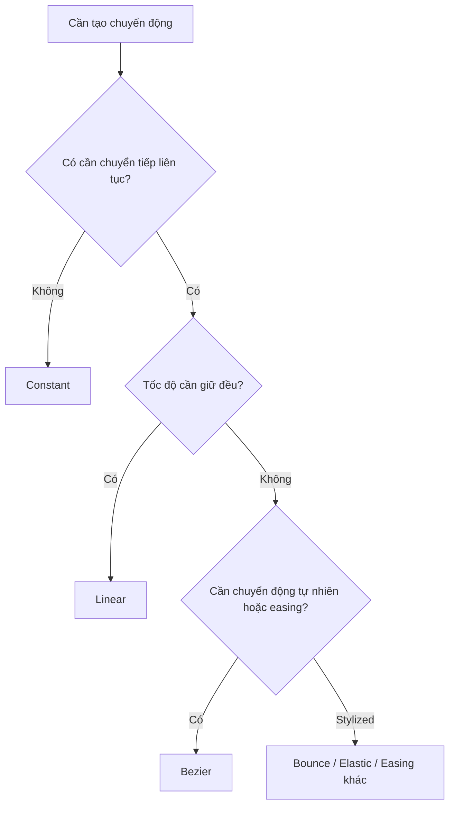

# 050 - Interpolation in Animation

**Phần:** 07 — Animation
**Chủ đề:** Linear, Bezier và timing
**Loại bài:** lesson
**Thời lượng:** 6:04

---

## 1. Tóm tắt

Đặt đúng keyframe mới chỉ xác định **vật thể ở đâu và vào thời điểm nào**. Cảm giác chuyển động nhanh, chậm, nặng, nhẹ, cơ học hay tự nhiên lại phụ thuộc rất nhiều vào cách Blender nội suy giá trị giữa các keyframe.

Trong `Graph Editor`, animation được biểu diễn bằng các `F-Curve`. Hình dạng của những đường cong này cho phép kiểm soát:

* tốc độ chuyển động;
* gia tốc và giảm tốc;
* `ease-in`;
* `ease-out`;
* chuyển động đều;
* chuyển trạng thái tức thời;
* bounce, elastic và các hiệu ứng stylized khác.

Ba kiểu interpolation nền tảng cần nắm chắc là:

* `Constant`;
* `Linear`;
* `Bezier`.

Đặc biệt, `Bezier` cung cấp khả năng chỉnh đường cong rất linh hoạt nhưng cũng có thể tạo overshoot hoặc chuyển động không mong muốn nếu không được kiểm soát.

---

## 2. Mục tiêu học tập

Sau khi hoàn thành bài này, người học có thể:

* Giải thích được interpolation ảnh hưởng như thế nào đến chuyển động giữa các keyframe.
* Đọc được mối quan hệ giữa hình dạng `F-Curve`, giá trị thuộc tính và thời gian.
* Phân biệt được `Constant`, `Linear` và `Bezier`.
* Sử dụng `Linear` cho chuyển động có tốc độ đều khi phù hợp.
* Sử dụng `Bezier` để tạo `ease-in` và `ease-out`.
* Điều chỉnh timing bằng cách thay đổi vị trí keyframe trên trục thời gian.
* Cô lập channel cần chỉnh trong `Graph Editor`.
* Nhận biết được overshoot do đường cong `Bezier`.
* Lựa chọn interpolation dựa trên bản chất vật lý và phong cách chuyển động.

---

## 3. Interpolation là gì?

Giả sử một quả bóng có hai keyframe:

```text
Frame 1  → Z = 5 m
Frame 20 → Z = 0 m
```

Hai keyframe chỉ xác định:

```text
Điểm bắt đầu
      ↓
?
      ↓
Điểm kết thúc
```

Dấu `?` chính là phần Blender phải tính toán.

**Interpolation** là quy tắc xác định các giá trị trung gian giữa hai keyframe.

Ví dụ cùng hai keyframe trên có thể tạo ra nhiều chuyển động khác nhau:

```text
Linear
Tốc độ không đổi
      ↓
      ↓
      ↓

Bezier
Chậm → nhanh → chậm

Constant
Giữ nguyên → nhảy tức thời
```

Do đó hai animation có keyframe hoàn toàn giống nhau vẫn có thể tạo cảm giác rất khác nếu sử dụng interpolation khác nhau.

---

## 4. Graph Editor và F-Curve

`Graph Editor` là công cụ chính để kiểm soát interpolation.

Trong một `F-Curve`:

```text
Trục Y → Giá trị thuộc tính
Trục X → Thời gian / frame
```

Ví dụ với `Location Z`:

```text
Location Z
    ^
  5 | ●
    |  \
  4 |   \
    |    \
  3 |     \
    |      \
  2 |       \
    |        \
  1 |         \
    |          ●
  0 +--------------------> Frame
      1                20
```

Độ dốc của đường cong phản ánh tốc độ thay đổi của thuộc tính.

Có thể hiểu đơn giản:

```text
Đường gần nằm ngang
→ giá trị thay đổi ít
→ chuyển động chậm

Đường dốc
→ giá trị thay đổi nhanh
→ chuyển động nhanh
```

Điều này khiến `Graph Editor` trở thành công cụ quan trọng để đánh giá **timing**, chứ không chỉ vị trí của keyframe.

---

## 5. Chuẩn bị animation thử nghiệm

Một ví dụ đơn giản để học interpolation là quả bóng rơi xuống sàn.

Quy trình:

1. Tạo một `UV Sphere`.
2. Tạo một `Plane` làm mặt sàn.
3. Đặt quả bóng phía trên plane.
4. Tại frame `1`, tạo keyframe cho `Location`.
5. Chuyển đến frame `20`.
6. Đưa quả bóng xuống sát mặt sàn.
7. Tạo keyframe thứ hai.
8. Mở `Graph Editor`.

Đối với bài này, chuyển động chủ yếu nằm ở:

```text
Location Z
```

Vì vậy không cần để các channel khác chiếm không gian làm việc.

---

## 6. Làm việc hiệu quả trong Graph Editor

Khi một object có nhiều thuộc tính animation, `Graph Editor` có thể xuất hiện rất nhiều `F-Curve`:

```text
Location X
Location Y
Location Z
Rotation X
Rotation Y
Rotation Z
Scale X
Scale Y
Scale Z
```

Nếu chỉ chỉnh chuyển động rơi theo trục `Z`, nên tập trung vào `Location Z`.

Một số thao tác hữu ích:

| Phím / công cụ | Chức năng                                    |
| -------------- | -------------------------------------------- |
| `A`            | Chọn tất cả keyframe                         |
| `H`            | Ẩn channel hoặc phần tử đã chọn tùy ngữ cảnh |
| `Shift + H`    | Cô lập phần được chọn                        |
| `Alt + H`      | Hiện lại phần đã ẩn                          |
| `T`            | Chọn interpolation mode                      |
| `V`            | Chọn loại Bezier handle                      |
| `G`            | Di chuyển keyframe                           |
| `S`            | Scale keyframe                               |
| `O`            | Bật/tắt Proportional Editing                 |

`Normalize` cũng có thể được bật khi các curve có phạm vi giá trị rất khác nhau.

Việc normalize chủ yếu thay đổi **cách Graph Editor hiển thị curve để dễ so sánh**, không làm thay đổi chuyển động thực tế.

---

## 7. Timing và khoảng cách giữa keyframe

Interpolation quyết định hình dạng chuyển động giữa hai keyframe, nhưng timing vẫn phụ thuộc trực tiếp vào khoảng cách giữa chúng.

Ví dụ:

```text
Frame 1  → Z = 5
Frame 10 → Z = 0
```

sẽ nhanh hơn:

```text
Frame 1  → Z = 5
Frame 30 → Z = 0
```

nếu các điều kiện khác giống nhau.

Có thể hình dung:

```text
Khoảng frame ngắn
      ↓
Ít thời gian hơn
      ↓
Chuyển động nhanh hơn

Khoảng frame dài
      ↓
Nhiều thời gian hơn
      ↓
Chuyển động chậm hơn
```

Vì vậy khi một animation có cảm giác quá nhanh hoặc quá chậm, cần kiểm tra **timing của keyframe trước**, không nên lập tức chỉnh hình dạng curve.

---

## 8. Ba kiểu interpolation nền tảng

Ba kiểu quan trọng nhất khi bắt đầu làm animation là `Constant`, `Linear` và `Bezier`.

| Interpolation | Đặc điểm                       | Phù hợp                                 |
| ------------- | ------------------------------ | --------------------------------------- |
| `Constant`    | Không có chuyển tiếp liên tục  | Hold, stop-motion, blocking             |
| `Linear`      | Tốc độ thay đổi đều            | Máy móc, conveyor, chuyển động đều      |
| `Bezier`      | Có khả năng tăng/giảm tốc mượt | Camera, character, chuyển động tự nhiên |

### 8.1. Constant

`Constant` không thực hiện chuyển tiếp mượt giữa hai keyframe.

Ví dụ:

```text
Frame 1–19 → Z = 5
Frame 20   → Z = 0
```

Biểu diễn đơn giản:

```text
Giá trị
  ^
5 | ●───────────────┐
  |                 │
0 |                 ●
  +--------------------> Time
```

Object giữ nguyên giá trị cũ cho đến khi gặp keyframe tiếp theo, sau đó chuyển tức thời sang giá trị mới.

`Constant` phù hợp với:

* blocking animation;
* stop-motion;
* trạng thái bật/tắt;
* animation kiểu stepped;
* kiểm tra pose trước khi làm chuyển động mượt.

---

### 8.2. Linear

`Linear` nối hai keyframe bằng một đường thẳng.

```text
Giá trị
  ^
5 | ●
  |   \
  |     \
  |       \
0 |         ●
  +--------------------> Time
```

Điều này tạo tốc độ thay đổi không đổi giữa hai keyframe.

Ví dụ quả bóng di chuyển từ `Z = 5` xuống `Z = 0`:

```text
Frame 1
↓
tốc độ đều
↓
tốc độ đều
↓
Frame 20
```

`Linear` phù hợp với những chuyển động như:

* băng chuyền;
* platform di chuyển đều;
* camera cần tốc độ cố định;
* máy móc;
* vòng quay đều;
* chuyển động kỹ thuật không cần easing.

Tuy nhiên, chuyển động tự nhiên hiếm khi duy trì tốc độ hoàn toàn không đổi.

Một quả bóng rơi dưới tác dụng của trọng lực chẳng hạn sẽ **tăng tốc**, vì vậy `Linear` không phải mô hình vật lý chính xác cho một cú rơi tự do.

---

### 8.3. Bezier

`Bezier` sử dụng đường cong thay vì nối thẳng hai keyframe.

Ví dụ:

```text
Giá trị
  ^
5 | ●────.
  |      `.
  |        \
  |         `.
0 |           ●
  +--------------------> Time
```

Nhờ hình dạng cong, có thể tạo:

```text
chậm
 ↓
nhanh dần
 ↓
nhanh
 ↓
chậm dần
```

Đây là cơ sở của:

* `ease-in`;
* `ease-out`;
* `ease-in-out`.

`Bezier` thường thích hợp cho:

* camera movement;
* character animation;
* object chuyển động tự nhiên;
* logo animation;
* motion graphics;
* các chuyển động cần cảm giác mềm và có trọng lượng.

---

## 9. Ease-in và ease-out

Hai khái niệm quan trọng khi làm việc với `Bezier` là `ease-in` và `ease-out`.

### 9.1. Ease-in

`Ease-in` nghĩa là chuyển động bắt đầu chậm rồi tăng tốc.

```text
Bắt đầu
   ↓
chậm
   ↓
nhanh dần
   ↓
nhanh
```

Trong `Graph Editor`, curve thường có độ dốc nhỏ ở đầu rồi tăng dần.

Ví dụ:

```text
Giá trị
 ^
 | ●────.
 |      `.
 |        `.
 |          \
 +----------------> Time
```

---

### 9.2. Ease-out

`Ease-out` nghĩa là chuyển động đang nhanh rồi giảm tốc khi đến đích.

```text
nhanh
  ↓
chậm dần
  ↓
chậm
  ↓
dừng
```

Ví dụ camera bay đến một object rồi nhẹ nhàng dừng lại thường cần `ease-out`.

Kết hợp cả hai ta có:

```text
Ease-in
   ↓
tăng tốc
   ↓
chuyển động chính
   ↓
giảm tốc
   ↓
Ease-out
```

Đây là dạng chuyển động rất phổ biến trong animation.

---

## 10. Chuyển động rơi và vấn đề vật lý

Một quả bóng rơi là ví dụ tốt để thấy rằng interpolation cần phù hợp với bản chất chuyển động.

Nếu dùng `Bezier` mặc định cho hai keyframe:

```text
Frame 1  → bóng ở trên
Frame 20 → bóng chạm đất
```

Blender có thể tạo dạng:

```text
chậm
 ↓
nhanh
 ↓
chậm
 ↓
chạm đất
```

Điều đó không hoàn toàn phù hợp với một vật đang rơi tự do.

Dưới tác dụng của trọng lực, vật thể nên:

```text
bắt đầu chậm
      ↓
tăng tốc liên tục
      ↓
chạm đất với tốc độ cao
```

Nó không tự giảm tốc ngay trước mặt đất.

Vì vậy đường cong phù hợp hơn sẽ có dạng:

```text
Z
^
| ●─────.
|       `.
|         `.
|            \
|              \
|                ●
+--------------------> Time
```

Điểm quan trọng ở đây không phải chỉ chọn một preset interpolation, mà là **định hình curve theo logic của chuyển động**.

---

## 11. Bezier handles

Các keyframe sử dụng `Bezier` có các handle cho phép kiểm soát hướng và độ cong của `F-Curve`.

Có thể hình dung:

```text
Handle        Keyframe        Handle
   ●-------------●-------------●
```

Thay đổi handle sẽ ảnh hưởng đến:

* tốc độ trước keyframe;
* tốc độ sau keyframe;
* mức độ ease;
* hướng curve;
* khả năng overshoot.

Trong `Graph Editor`, `V` được dùng để chọn loại handle cho các keyframe Bezier.

Các loại handle khác nhau thích hợp cho những mức độ kiểm soát khác nhau.

Khi mới học, điều quan trọng nhất là hiểu:

> Handle không thay đổi vị trí keyframe; nó thay đổi **cách animation đi vào và đi ra khỏi keyframe đó**.

---

## 12. Overshoot trong Bezier

Một trong những vấn đề phổ biến nhất của `Bezier` là **overshoot**.

Giả sử:

```text
Frame 20
Location Z = 0
```

Nhưng curve đi thấp hơn giá trị `0` trước khi quay lại keyframe:

```text
Z
^
|
|       .
|      /
0|-----●---------●
|          \___/
|            ↑
|        overshoot
+------------------> Time
```

Khi đó quả bóng có thể:

```text
đi xuyên mặt sàn
      ↓
quay ngược lên
      ↓
dừng ở vị trí đúng
```

Đây có thể là hiệu ứng mong muốn trong cartoon animation, nhưng thường là lỗi nếu object cần dừng chính xác tại mặt đất.

Khi gặp overshoot:

* kiểm tra `F-Curve`;
* kiểm tra Bezier handles;
* giảm độ cong quá mức;
* sử dụng loại handle phù hợp;
* đảm bảo curve không vượt quá giới hạn vật lý cần thiết.

> Không nên mặc định rằng `Bezier` luôn tốt hơn `Linear`. Interpolation chỉ tốt khi phù hợp với chuyển động cần tạo.

---

## 13. Các easing interpolation mở rộng

Ngoài ba kiểu cơ bản, Blender còn cung cấp nhiều dạng interpolation/easing có thể tạo hiệu ứng đặc biệt.

Một số dạng thường gặp gồm:

* `Sine`;
* `Quadratic`;
* `Cubic`;
* `Quartic`;
* `Quintic`;
* `Exponential`;
* `Circular`;
* `Back`;
* `Bounce`;
* `Elastic`.

Chúng có thể được dùng để tạo những cảm giác chuyển động khác nhau.

Ví dụ:

```text
Bounce
Object chạm đích
   ↓
nảy
   ↓
nảy nhỏ hơn
   ↓
ổn định
```

Trong khi `Elastic` có thể tạo cảm giác:

```text
kéo
 ↓
vượt đích
 ↓
dao động
 ↓
ổn định
```

Những kiểu này đặc biệt phù hợp với:

* cartoon animation;
* motion graphics;
* UI-style motion;
* logo animation;
* chuyển động stylized.

Không nên sử dụng chúng chỉ vì trông thú vị. Hiệu ứng phải phù hợp với ngôn ngữ chuyển động của scene.

---

## 14. Bounce và Elastic

`Bounce` có thể nhanh chóng tạo cảm giác vật thể nảy sau khi chạm đích.

Ví dụ:

```text
rơi
 ↓
chạm đất
 ↓
nảy lên
 ↓
rơi xuống
 ↓
nảy nhỏ
 ↓
dừng
```

`Elastic` tạo cảm giác giống vật liệu đàn hồi:

```text
di chuyển
 ↓
vượt quá đích
 ↓
kéo ngược lại
 ↓
dao động
 ↓
ổn định
```

Hai dạng này phù hợp với phong cách exaggerated hoặc cartoon hơn là các chuyển động vật lý chính xác.

Khi cần mô phỏng va chạm hoặc trọng lực chính xác, nên cân nhắc physics simulation thay vì cố gắng tái tạo toàn bộ hiện tượng chỉ bằng một interpolation preset.

---

## 15. Chỉnh timing trực tiếp trong Graph Editor

Keyframe trong `Graph Editor` không chỉ điều chỉnh được giá trị mà còn có thể di chuyển theo thời gian.

Ví dụ ban đầu:

```text
Frame 1       Frame 20
●----------------●
```

Di chuyển keyframe cuối sang frame `10`:

```text
Frame 1  Frame 10
●---------●
```

Chuyển động xảy ra nhanh hơn.

Di chuyển sang frame `40`:

```text
Frame 1                         Frame 40
●----------------------------------●
```

Chuyển động chậm hơn.

Đây là điểm cần phân biệt rõ:

```text
Di chuyển keyframe theo trục X
→ thay đổi timing

Di chuyển keyframe theo trục Y
→ thay đổi giá trị

Chỉnh handle
→ thay đổi tốc độ/interpolation giữa các keyframe
```

Ba thao tác này giải quyết ba vấn đề khác nhau.

---

## 16. Pivot Point khi chỉnh nhiều keyframe

Khi chọn nhiều keyframe và sử dụng `S` để scale, kết quả phụ thuộc vào `Pivot Point`.

Ví dụ, nếu scale trên trục thời gian:

```text
S
X
```

các keyframe có thể được kéo gần hoặc xa nhau.

Điều này rất hữu ích để:

* tăng tốc toàn bộ một đoạn animation;
* làm chậm một đoạn;
* nén timing;
* mở rộng timing.

Các pivot khác nhau có thể làm keyframe scale quanh:

* trung tâm vùng chọn;
* `2D Cursor`;
* từng tâm riêng biệt.

Ví dụ nếu cần giữ nguyên frame bắt đầu nhưng kéo dài phần còn lại, `2D Cursor` có thể được đặt tại frame bắt đầu và dùng làm tâm scale.

---

## 17. Proportional Editing với keyframe

`Graph Editor` cũng hỗ trợ `Proportional Editing`.

Thay vì chỉ thay đổi một keyframe, việc chỉnh một điểm có thể ảnh hưởng dần đến những keyframe xung quanh.

Có thể hình dung:

```text
●   ●   ●   ●   ●   ●   ●
        ↑
    điểm đang chỉnh

Ảnh hưởng mạnh
      ↓
●  ●  ●
      ↓
Ảnh hưởng giảm dần
      ↓
●  ●  ●
```

Công cụ này hữu ích khi:

* animation có nhiều keyframe;
* cần làm mượt một đoạn;
* thay đổi xu hướng chuyển động nhưng không muốn sửa từng điểm;
* cần tạo biến thiên dần.

Tuy nhiên, với animation đơn giản chỉ có vài keyframe, chỉnh trực tiếp thường dễ kiểm soát hơn.

---

## 18. Chọn interpolation theo bản chất chuyển động

Không có một interpolation phù hợp cho mọi animation.

Có thể sử dụng quy tắc tư duy sau:



Ví dụ:

| Tình huống                       | Lựa chọn khởi đầu |
| -------------------------------- | ----------------- |
| Băng chuyền chạy đều             | `Linear`          |
| Camera tiến đến subject rồi dừng | `Bezier`          |
| Blocking character animation     | `Constant`        |
| Logo bật nảy                     | `Bounce`          |
| Object co giãn như cao su        | `Elastic`         |
| Vật bắt đầu rơi do trọng lực     | Curve tăng tốc    |
| Object cơ khí quay đều           | `Linear`          |

Đây chỉ là điểm bắt đầu. `Graph Editor` vẫn cần được dùng để tinh chỉnh kết quả cuối.

---

## 19. Lỗi thường gặp

**Chuyển động bắt đầu và kết thúc đúng nhưng vẫn trông giật**

Nguyên nhân có thể không nằm ở vị trí keyframe mà ở timing hoặc độ dốc của `F-Curve`.

Cách xử lý:

* kiểm tra khoảng cách giữa keyframe;
* kiểm tra interpolation;
* kiểm tra sự thay đổi độ dốc giữa các curve.

---

**Object giảm tốc dù lẽ ra phải tăng tốc**

Nguyên nhân thường là `Bezier` mặc định tạo ease-out tại keyframe cuối.

Cách xử lý:

* mở `Graph Editor`;
* kiểm tra phần cuối curve;
* chỉnh handle để duy trì hoặc tăng độ dốc.

---

**Object đi vượt quá vị trí mong muốn**

Đây thường là overshoot.

Cách xử lý:

* kiểm tra Bezier handles;
* giảm độ cong;
* lựa chọn handle phù hợp;
* đảm bảo curve không vượt ra ngoài phạm vi cần thiết.

---

**Animation có tốc độ không đổi nhưng trông quá cơ học**

`Linear` có thể đang được sử dụng cho một chuyển động cần gia tốc hoặc giảm tốc.

Hãy thử `Bezier` và thiết kế easing phù hợp.

---

**Animation quá nhanh dù curve có hình dạng đúng**

Interpolation không giải quyết được timing sai.

Hãy kiểm tra vị trí keyframe trên trục frame và kéo chúng xa nhau hơn nếu cần.

---

## 20. Best practices

* Xác định timing trước khi dành nhiều thời gian chỉnh curve.
* Chỉ hiển thị các channel cần thiết trong `Graph Editor`.
* Sử dụng `Linear` khi tốc độ thực sự cần đều.
* Sử dụng `Bezier` có chủ ý thay vì chấp nhận curve mặc định.
* Quan sát độ dốc của curve để suy luận tốc độ.
* Luôn kiểm tra overshoot khi object phải dừng tại một giới hạn chính xác.
* Dùng playback liên tục trong quá trình chỉnh thay vì đánh giá curve chỉ bằng hình dạng.
* So sánh animation trong `3D Viewport` với `Graph Editor`; một curve đẹp về hình học chưa chắc tạo chuyển động đẹp.
* Với chuyển động có quy luật vật lý rõ ràng, hãy nghĩ về gia tốc, va chạm và quán tính trước khi chọn interpolation.
* Chỉ dùng `Bounce`, `Elastic` và các easing đặc biệt khi phong cách animation thực sự cần chúng.

---

## 21. Bài thực hành

Tạo một scene gồm:

* một `UV Sphere`;
* một `Plane`;
* animation quả bóng di chuyển từ trên xuống dưới.

Đặt:

```text
Frame 1  → bóng ở trên
Frame 20 → bóng chạm sàn
```

Sau đó thực hiện ba phiên bản.

**Phiên bản A — Linear**

* Chọn hai keyframe.
* Nhấn `T`.
* Chọn `Linear`.
* Phát animation.
* Quan sát tốc độ.

**Phiên bản B — Bezier**

* Chuyển interpolation sang `Bezier`.
* Quan sát sự tăng tốc và giảm tốc mặc định.
* Chỉnh curve để quả bóng bắt đầu chậm và tăng tốc khi đi xuống.
* Tránh để bóng giảm tốc vô lý ngay trước khi chạm sàn.

**Phiên bản C — Stylized**

Thử ít nhất một kiểu:

* `Bounce`;
* `Elastic`;
* một easing khác.

Quan sát sự khác biệt về cảm giác chuyển động.

Cuối cùng, tạo thêm một animation mới với:

```text
Frame 1  → trạng thái A
Frame 30 → trạng thái B
```

Sau đó di chuyển keyframe cuối lần lượt đến:

```text
Frame 15
Frame 45
```

So sánh ảnh hưởng của thay đổi timing mà không thay đổi giá trị đầu và cuối.

---

## 22. Checklist hoàn thành

* [ ] Giải thích được interpolation là gì.
* [ ] Đọc được trục thời gian và giá trị trong `Graph Editor`.
* [ ] Nhận ra chuyển động giật hoặc thiếu tự nhiên do timing sai.
* [ ] Phân biệt được `Constant`, `Linear` và `Bezier`.
* [ ] Dùng `Linear` cho chuyển động đều khi phù hợp.
* [ ] Dùng `Bezier` để tạo `ease-in` và `ease-out`.
* [ ] Biết cách thay đổi interpolation bằng `T`.
* [ ] Biết vai trò của Bezier handles.
* [ ] Phân biệt được thay đổi timing, thay đổi giá trị và chỉnh handle.
* [ ] Nhận biết được overshoot trên `F-Curve`.
* [ ] Kiểm soát được Bezier để tránh overshoot ngoài ý muốn.
* [ ] Biết cô lập channel cần chỉnh trong `Graph Editor`.
* [ ] So sánh được Linear và Bezier trên cùng một animation.
* [ ] Thử nghiệm được ít nhất một interpolation stylized như `Bounce` hoặc `Elastic`.

---

## 23. Tổng kết

Keyframe xác định các trạng thái quan trọng của animation, còn interpolation quyết định **chuyển động diễn ra như thế nào giữa những trạng thái đó**.

Ba dạng nền tảng cần ghi nhớ:

```text
Constant
→ giữ nguyên rồi chuyển tức thời

Linear
→ thay đổi với tốc độ đều

Bezier
→ kiểm soát tăng tốc, giảm tốc và easing
```

Trong `Graph Editor`, hình dạng `F-Curve` phản ánh trực tiếp cách giá trị thay đổi theo thời gian. Độ dốc của curve liên quan đến tốc độ thay đổi, khoảng cách giữa keyframe quyết định timing, còn Bezier handles cho phép kiểm soát cách chuyển động đi vào và đi ra khỏi từng keyframe.

Một animation tốt vì vậy không chỉ cần đúng điểm đầu và điểm cuối:

```text
Keyframe đúng
     +
Timing đúng
     +
Interpolation phù hợp
     +
Curve được kiểm soát
     ↓
Chuyển động thuyết phục
```

`Linear` không phải lúc nào cũng cứng và `Bezier` không phải lúc nào cũng tự nhiên. Interpolation cần được lựa chọn dựa trên vật thể, lực tác động, nhịp điệu và phong cách chuyển động mà scene cần truyền tải.
