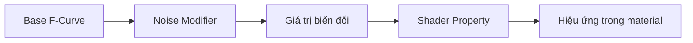
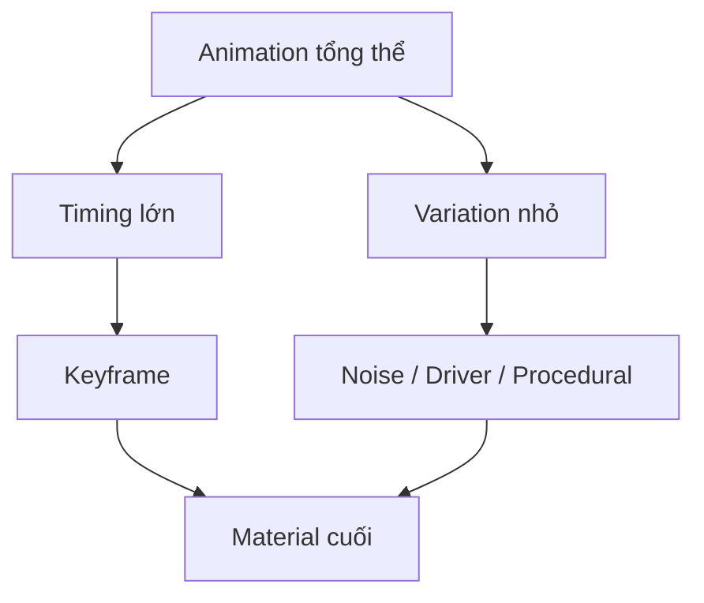

# 051 - Procedural Material Animation

**Phần:** 07 — Animation  
**Chủ đề:** Animate node value và procedural material  
**Loại bài:** lesson  
**Thời lượng:** 4:50

---

## 1. Tóm tắt

Animation trong Blender không chỉ áp dụng cho `Location`, `Rotation` hoặc `Scale` của object. Gần như mọi thuộc tính có thể animate trong `Shader Editor` cũng có thể trở thành nguồn chuyển động cho material.

Có thể keyframe những tham số như:

- `Emission Strength`;
- `Noise Texture > Scale`;
- `Noise Texture > Detail`;
- `ColorRamp` position;
- `Mapping` location hoặc rotation;
- `Wave Texture` phase;
- màu sắc;
- `Mix` factor;
- các giá trị điều khiển shader khác.

Ngoài việc đặt keyframe thủ công, Blender còn có thể tạo chuyển động mang tính procedural bằng:

- `F-Curve Modifier`;
- biểu thức dựa trên `frame`;
- `Driver`;
- các node và tham số được điều khiển theo thời gian.

Nhờ đó, những hiệu ứng như đèn nhấp nháy, năng lượng chuyển động, sóng chạy, texture trôi hay material biến đổi liên tục có thể được tạo mà không cần đặt hàng chục hoặc hàng trăm keyframe.

---

## 2. Mục tiêu học tập

Sau khi hoàn thành bài này, người học có thể:

- Tạo keyframe cho một thuộc tính trong `Shader Editor`.
- Xác định đúng node socket hoặc property cần animate.
- Animate `Emission Strength` để tạo hiệu ứng phát sáng.
- Kiểm tra animation của material trong `Graph Editor`.
- Sử dụng `Noise` F-Curve Modifier để tạo chuyển động ngẫu nhiên theo thời gian.
- Giải thích được sự khác nhau giữa keyframe animation và procedural animation.
- Sử dụng biểu thức dựa trên `frame` để tạo chuyển động liên tục.
- Điều chỉnh tốc độ procedural animation theo thời gian.
- Kiểm tra interpolation của thuộc tính material.
- Thiết kế range giá trị phù hợp để animation không vượt ngoài phạm vi mong muốn.

---

## 3. Material cũng có thể chứa animation

Một shader có thể được xem như một hệ thống tham số:

```text
Material
   ↓
Shader Nodes
   ↓
Node Properties
   ↓
Value thay đổi theo thời gian
   ↓
Material thay đổi theo thời gian
```

Ví dụ một material phát sáng có:

```text
Emission Strength = 0
```

ở một frame và:

```text
Emission Strength = 5
```

ở frame khác.

Blender có thể nội suy giữa hai giá trị và tạo ra hiệu ứng:

```text
Tắt
 ↓
Sáng dần
 ↓
Sáng mạnh
```

Cơ chế này về bản chất giống animation transform của object. Điểm khác biệt chỉ là dữ liệu được animate nằm trong material thay vì transform.

---

## 4. Hai cách tạo chuyển động cho material

Có hai hướng cơ bản để tạo material animation.

### 4.1. Keyframe animation

Developer hoặc artist trực tiếp xác định giá trị tại những frame quan trọng.

Ví dụ:

```text
Frame 1
Emission Strength = 0

Frame 15
Emission Strength = 8

Frame 30
Emission Strength = 0
```

Blender nội suy các giá trị ở giữa.

Phương pháp này phù hợp khi cần:

- điều khiển timing chính xác;
- đồng bộ với camera;
- đồng bộ với hành động nhân vật;
- bật hoặc tắt effect tại một thời điểm xác định;
- art direction chặt chẽ.

### 4.2. Procedural animation

Giá trị được sinh tự động từ một quy luật thay vì phải đặt keyframe cho từng thay đổi.

Ví dụ:

```text
Giá trị
   ↓
Noise theo thời gian
   ↓
Emission Strength
   ↓
Ánh sáng nhấp nháy
```

hoặc:

```text
Frame hiện tại
   ↓
Biểu thức
   ↓
Wave phase
   ↓
Sóng chạy liên tục
```

Procedural animation đặc biệt phù hợp cho:

- flicker;
- noise;
- dòng năng lượng;
- sóng;
- texture scrolling;
- nhiễu điện;
- hiệu ứng ma thuật;
- chuyển động môi trường lặp liên tục.

---

## 5. Keyframe một thuộc tính trong Shader Editor

Quy trình cơ bản gần giống animation object.

Giả sử cần animate `Emission Strength`.

1. Tạo hoặc chọn material.
2. Mở `Shader Editor`.
3. Xác định thuộc tính `Strength`.
4. Chuyển đến frame bắt đầu.
5. Đặt giá trị mong muốn.
6. Đưa con trỏ lên property.
7. Nhấn:

```text
I
```

8. Chuyển đến frame tiếp theo.
9. Thay đổi giá trị.
10. Nhấn `I` lần nữa.

Ví dụ:

```text
Frame 1
Strength = 5

        ↓

Frame 30
Strength = 0
```

Kết quả:

```text
Sáng
 ↓
mờ dần
 ↓
tắt
```

> Phải đưa con trỏ vào đúng property cần animate trước khi chèn keyframe. Nếu keyframe sai thuộc tính, animation sẽ không điều khiển tham số mong muốn.

---

## 6. Nhận biết trạng thái của property

Blender sử dụng màu sắc để báo trạng thái animation của property.

Một property đang có keyframe tại frame hiện tại thường được hiển thị khác với property đã animate nhưng frame hiện tại không chứa keyframe.

Khi làm việc, không nên chỉ dựa vào màu sắc. Hãy kiểm tra thêm:

- `Timeline`;
- `Dope Sheet`;
- `Graph Editor`.

Luồng kiểm tra an toàn:

```text
Thay đổi value
      ↓
Insert Keyframe
      ↓
Kiểm tra dấu keyframe
      ↓
Mở Graph Editor
      ↓
Xác nhận đúng F-Curve
```

Điều này đặc biệt quan trọng trong material phức tạp vì một shader có thể chứa rất nhiều thuộc tính có thể animate.

---

## 7. Ví dụ: tạo đôi mắt phát sáng

Một ví dụ trực quan là tạo hiệu ứng phát sáng cho mắt của một mesh.

Có thể sử dụng `Suzanne` làm object thử nghiệm.

Quy trình tổng quát:

1. Tạo `Suzanne`.
2. Làm mượt bề mặt nếu cần.
3. Tạo material chính cho đầu.
4. Tạo material riêng cho vùng mắt.
5. Gán material mắt vào đúng faces.
6. Thiết lập shader có emission.
7. Animate `Emission Strength`.

Có thể dùng cấu trúc:

```text
Material mắt
   ↓
Emission
   ↓
Strength
   ↓
Keyframe / Procedural Control
```

Ví dụ:

```text
Frame 1  → Strength = 0
Frame 15 → Strength = 8
Frame 30 → Strength = 0
```

Khi playback:

```text
Tắt
 ↓
Sáng dần
 ↓
Sáng mạnh
 ↓
Mờ dần
 ↓
Tắt
```

Hiệu ứng có thể được quan sát trong chế độ viewport có hỗ trợ hiển thị material phù hợp hoặc qua render preview.

---

## 8. Kiểm tra material animation trong Graph Editor

Thuộc tính shader đã được animate cũng tạo `F-Curve`.

Điều này có nghĩa `Graph Editor` không chỉ dành cho:

```text
Location
Rotation
Scale
```

mà còn có thể chứa animation của:

```text
Material
Node
Shader property
Custom property
```

Ví dụ:

```text
Material
└── Nodes
    └── Emission Strength
        └── F-Curve
```

Trong `Graph Editor`, có thể:

- chỉnh timing;
- đổi interpolation;
- thay đổi keyframe;
- thêm F-Curve Modifier;
- tạo loop;
- tạo noise;
- điều chỉnh range.

Đây là cầu nối quan trọng giữa animation truyền thống và procedural animation.

---

## 9. Interpolation của material property

Material property vẫn tuân theo các interpolation đã học trong animation thông thường.

Ví dụ với `Emission Strength`:

```text
Frame 1  → 0
Frame 30 → 10
```

Nếu dùng `Linear`:

```text
0 → 1 → 2 → 3 → ... → 10
```

theo nhịp thay đổi đều.

Nếu dùng `Bezier`:

```text
0
↓
tăng chậm
↓
tăng nhanh
↓
chậm dần
↓
10
```

Nếu dùng `Constant`:

```text
0 → giữ nguyên → chuyển ngay sang 10
```

Do đó cần chọn interpolation dựa trên hiệu ứng.

| Hiệu ứng | Interpolation khởi đầu phù hợp |
|---|---|
| Đèn bật tức thời | `Constant` |
| Energy tăng đều | `Linear` |
| Glow sáng dần tự nhiên | `Bezier` |
| Flash nhanh | `Constant` hoặc curve ngắn |
| Pulsing mềm | `Bezier` hoặc procedural curve |

---

## 10. Từ keyframe sang procedural animation

Keyframe animation yêu cầu artist quyết định:

```text
Khi nào thay đổi?
Giá trị bao nhiêu?
Chuyển sang đâu?
```

Procedural animation thay thế một phần công việc này bằng quy luật.

Ví dụ thay vì tạo:

```text
Frame 1  → 4.2
Frame 3  → 6.1
Frame 6  → 2.8
Frame 8  → 7.4
Frame 11 → 3.1
...
```

để tạo ánh sáng nhấp nháy, có thể dùng:

```text
F-Curve
   +
Noise Modifier
   ↓
Giá trị biến đổi tự động
```

Kết quả dễ chỉnh hơn và có thể chạy trên một khoảng animation dài.

---

## 11. Noise F-Curve Modifier

Một trong những công cụ procedural hữu ích nhất trong `Graph Editor` là `Noise` modifier.

Luồng hoạt động:



Ví dụ với `Emission Strength`:

```text
Base value
    ↓
Noise
    ↓
Strength thay đổi liên tục
    ↓
Ánh sáng flicker
```

Thay vì phải vẽ từng thay đổi, `Noise Modifier` tạo dao động tự động trên F-Curve.

---

## 12. Các tham số quan trọng của Noise

Tùy phiên bản Blender và loại F-Curve modifier, các tham số có thể được trình bày hơi khác nhau, nhưng những ý quan trọng cần kiểm soát gồm:

- mức độ biến thiên;
- tần suất biến thiên;
- phase hoặc offset;
- phạm vi ảnh hưởng.

Có thể tư duy theo ba câu hỏi:

```text
Noise thay đổi nhanh đến mức nào?
→ Frequency / Scale liên quan đến nhịp

Noise thay đổi mạnh đến mức nào?
→ Strength liên quan đến biên độ

Noise bắt đầu tại pattern nào?
→ Phase / Offset
```

Ví dụ:

```text
Strength thấp
→ flicker nhẹ

Strength cao
→ flicker mạnh
```

Và:

```text
Noise dày
→ thay đổi nhanh

Noise thưa
→ thay đổi chậm
```

Kết quả phải luôn được đánh giá bằng playback thực tế.

---

## 13. Giữ một F-Curve cơ sở cho procedural animation

Một `F-Curve Modifier` cần một F-Curve để tác động lên.

Do đó cách làm an toàn là:

1. Tạo ít nhất một keyframe cho property.
2. Mở `Graph Editor`.
3. Chọn đúng F-Curve.
4. Thêm modifier.

Có thể chỉ cần một keyframe làm giá trị nền.

Ví dụ:

```text
Emission Strength
Base = 4

      +
Noise Modifier

      ↓

2.8
5.2
3.9
6.1
4.4
...
```

Modifier làm biến thiên giá trị quanh mức cơ sở.

Không nên xóa dữ liệu animation cơ sở một cách tùy tiện nếu điều đó khiến F-Curve cần thiết cho modifier biến mất.

---

## 14. Thiết kế flicker bằng Noise

Một hiệu ứng flicker cơ bản có thể được tổ chức như sau:

```text
Emission Strength = giá trị nền
          ↓
Noise Modifier
          ↓
Biến thiên quanh giá trị nền
          ↓
Ánh sáng nhấp nháy
```

Ví dụ ứng dụng:

- đèn neon;
- đuốc;
- màn hình hỏng;
- mắt robot;
- nguồn năng lượng;
- cổng dịch chuyển;
- điện;
- hologram.

Khi thiết kế flicker cần tránh hai lỗi:

```text
Noise quá mạnh
→ material sáng/tối cực đoan

Noise quá nhanh
→ hình ảnh rung khó chịu hoặc tạo cảm giác lỗi
```

Procedural không có nghĩa là hoàn toàn ngẫu nhiên. Hiệu ứng vẫn cần art direction.

---

## 15. Animate procedural texture

Không chỉ output shader mới có thể animate. Các node texture cũng chứa nhiều property phù hợp cho animation.

Ví dụ:

```text
Noise Texture
├── Scale
├── Detail
├── Roughness
└── Distortion
```

hoặc:

```text
Wave Texture
├── Scale
├── Distortion
├── Detail
└── Phase Offset
```

Nếu animate các tham số này, pattern trên bề mặt sẽ thay đổi theo thời gian.

Ví dụ:

```text
Wave Texture
      ↓
Phase Offset thay đổi
      ↓
Các vòng sóng di chuyển
```

Điều này có thể tạo:

- sóng năng lượng;
- radar;
- ripple;
- sci-fi scan;
- hiệu ứng phép thuật;
- vòng tròn lan truyền.

---

## 16. Animate Mapping

Một kỹ thuật rất phổ biến khác là animate tọa độ texture.

Luồng:

```text
Texture Coordinates
        ↓
Mapping
        ↓
Procedural Texture
        ↓
Shader
```

Nếu animate `Mapping > Location`:

```text
Texture trượt trên bề mặt
```

Nếu animate `Rotation`:

```text
Texture xoay
```

Nếu animate `Scale`:

```text
Pattern co hoặc giãn
```

Đây là kỹ thuật phù hợp cho:

- cloud movement;
- dòng nước;
- energy flow;
- scrolling texture;
- scan line;
- smoke stylized;
- holographic material.

---

## 17. Animate ColorRamp

`ColorRamp` cũng là một nguồn animation mạnh.

Có thể animate:

- vị trí stop;
- màu;
- một số tham số liên quan đến cách gradient phân bố.

Ví dụ:

```text
Noise Texture
      ↓
ColorRamp
      ↓
Emission
```

Nếu một stop của `ColorRamp` di chuyển:

```text
Ngưỡng vùng sáng thay đổi
      ↓
Pattern sáng lan ra hoặc co lại
```

Ứng dụng:

- dissolve;
- burning edge;
- energy activation;
- mask animation;
- chuyển đổi trạng thái material.

Khi animate `ColorRamp`, cần đảm bảo các stop không tạo chuyển đổi ngoài dự kiến hoặc đảo thứ tự logic của gradient.

---

## 18. Biểu thức dựa trên frame

Ngoài keyframe và F-Curve modifier, Blender còn hỗ trợ điều khiển thuộc tính bằng driver expression.

Một phương pháp nhanh trong nhiều numerical property là sử dụng cú pháp bắt đầu bằng `#` để tạo driver từ biểu thức.

Ví dụ:

```text
#frame
```

Ý tưởng của biểu thức này là lấy frame hiện tại làm đầu vào.

Nếu muốn chuyển động chậm hơn:

```text
#frame * 0.2
```

Khi frame tăng:

```text
Frame 1   → 0.2
Frame 10  → 2
Frame 50  → 10
Frame 100 → 20
```

Nhờ đó một property có thể thay đổi liên tục mà không cần tạo hàng loạt keyframe.

---

## 19. Điều chỉnh tốc độ bằng biểu thức

Xét biểu thức:

```text
#frame * 0.2
```

Hệ số `0.2` quyết định tốc độ thay đổi.

Có thể hình dung:

```text
#frame * 0.05
→ chậm

#frame * 0.2
→ nhanh hơn

#frame * 1.0
→ rất nhanh nếu property nhạy với giá trị
```

Nếu cần đảo chiều:

```text
#frame * -0.2
```

Khi đó giá trị giảm khi timeline tiến về phía trước.

Do đó một công thức đơn giản có thể kiểm soát:

```text
Dấu
→ hướng

Hệ số
→ tốc độ

Frame
→ thời gian
```

---

## 20. Frame rate và tốc độ procedural animation

Một điểm quan trọng là `frame` tăng theo **frame**, không trực tiếp theo giây.

Giả sử:

```text
expression = frame * 0.2
```

Ở `24 FPS`, sau một giây:

```text
24 × 0.2 = 4.8
```

Ở `30 FPS`, sau một giây:

```text
30 × 0.2 = 6
```

Do đó nếu cùng một expression được sử dụng trong hai scene có frame rate khác nhau, tốc độ theo **thời gian thực** có thể khác nhau.

Có thể biểu diễn:

```text
Frame Rate
    ↓
Số frame mỗi giây
    ↓
Tốc độ frame tăng theo giây
    ↓
Tốc độ expression dựa trên frame
```

Vì vậy trước khi final animation cần kiểm tra:

- FPS;
- khoảng frame;
- tốc độ thực tế khi playback hoặc render.

---

## 21. Keyframe và expression khác nhau như thế nào?

| Đặc điểm | Keyframe | Expression / Procedural |
|---|---|---|
| Điều khiển từng thời điểm | Rất tốt | Gián tiếp |
| Chuyển động lặp dài | Cần nhiều thiết lập hơn | Rất phù hợp |
| Timing chính xác | Rất tốt | Phụ thuộc công thức |
| Random flicker | Khó làm thủ công | Rất phù hợp |
| Art direction | Cao | Cần thiết kế quy luật |
| Tự động theo timeline | Có | Có |
| Dễ tạo variation | Trung bình | Cao |

Hai phương pháp không loại trừ nhau.

Một hệ thống tốt có thể là:

```text
Keyframe
   ↓
Xác định nhịp lớn

+

Procedural Modifier
   ↓
Tạo variation nhỏ
```

Ví dụ:

```text
Emission Strength tăng từ 0 → 8 bằng keyframe

                 +

Noise tạo flicker nhỏ quanh giá trị hiện tại
```

Đây thường hiệu quả hơn việc lựa chọn tuyệt đối một trong hai phương pháp.

---

## 22. Kết hợp procedural texture với object điều khiển

Texture coordinates cũng có thể lấy từ một object khác.

Ví dụ:

```text
Empty / Object
      ↓
Object Coordinates
      ↓
Mapping / Texture
      ↓
Material
```

Khi object điều khiển:

- di chuyển;
- xoay;
- scale;

tọa độ procedural texture cũng thay đổi.

Điều này mở ra một cách animation khác:

```text
Animate controller
       ↓
Texture coordinates thay đổi
       ↓
Pattern material di chuyển
```

Ưu điểm là có thể điều khiển shader bằng một object trực quan trong `3D Viewport`.

---

## 23. Range của giá trị phải được kiểm soát

Procedural animation có thể dễ dàng tạo giá trị ngoài phạm vi mong muốn.

Ví dụ nếu một property cần:

```text
0 ≤ Value ≤ 1
```

nhưng Noise làm nó dao động:

```text
-0.4 → 1.6
```

kết quả có thể không phù hợp.

Tương tự với `Emission Strength`, noise quá lớn có thể tạo:

```text
rất tối
→ cực sáng
→ rất tối
```

mà không phù hợp với cảnh.

Vì vậy khi thiết kế procedural animation luôn cần xác định:

```text
Giá trị nền
      ↓
Biên độ variation
      ↓
Giá trị tối thiểu
      ↓
Giá trị tối đa
```

Không nên chỉ thêm Noise rồi chấp nhận kết quả mặc định.

---

## 24. Timing lớn và variation nhỏ

Một nguyên tắc hữu ích là tách animation thành hai cấp độ.



Ví dụ một nguồn năng lượng:

**Timing lớn:**

```text
Frame 1   → tắt
Frame 30  → khởi động
Frame 60  → sáng mạnh
Frame 120 → tắt
```

được điều khiển bằng keyframe.

**Variation nhỏ:**

```text
flicker
pulse
noise
```

được thêm bằng procedural control.

Kết hợp hai lớp cho phép vừa giữ được art direction vừa tránh animation quá đều và nhân tạo.

---

## 25. Lỗi thường gặp

**Property thay đổi nhưng không có animation**

Nguyên nhân:

- chưa chèn keyframe;
- chèn keyframe sai property.

Cách xử lý:

- đặt con trỏ đúng value;
- nhấn `I`;
- kiểm tra F-Curve trong `Graph Editor`.

---

**Material có keyframe nhưng không thấy thay đổi**

Kiểm tra:

- đúng material đang được gán chưa;
- đúng faces đang sử dụng material chưa;
- property đang animate có thực sự ảnh hưởng shader output không;
- viewport mode có hiển thị material phù hợp không;
- range giá trị có đủ lớn để nhận thấy không.

---

**Noise không xuất hiện**

Kiểm tra:

- đúng F-Curve đã được chọn chưa;
- F-Curve còn tồn tại không;
- modifier đã được thêm cho đúng channel chưa;
- `Strength` có quá thấp không;
- scale/tần suất có phù hợp không.

---

**Flicker quá mạnh**

Nguyên nhân thường là biên độ Noise quá lớn.

Cách xử lý:

- giảm `Strength`;
- điều chỉnh giá trị nền;
- kiểm tra range output.

---

**Hiệu ứng chạy quá nhanh**

Kiểm tra:

- hệ số trong expression;
- Noise scale/tần suất;
- frame rate;
- timeline range.

---

**Chuyển động khác sau khi đổi FPS**

Expression dựa trực tiếp trên `frame` có thể thay đổi tốc độ theo giây khi FPS thay đổi.

Do đó cần kiểm tra lại animation sau khi thay đổi frame rate.

---

## 26. Best practices

- Animate đúng property thay vì keyframe toàn bộ node không cần thiết.
- Đặt tên material rõ ràng nếu scene có nhiều shader animation.
- Dùng `Graph Editor` để xác nhận F-Curve thực sự thuộc đúng node.
- Xác định range giá trị trước khi thêm Noise.
- Dùng keyframe cho timing quan trọng.
- Dùng procedural control cho variation lặp hoặc liên tục.
- Không lạm dụng Noise cho mọi hiệu ứng.
- Preview animation trong viewport trong khi chỉnh shader.
- Kiểm tra kết quả ở đúng FPS dự kiến cho final render.
- Sử dụng expression đơn giản và dễ hiểu trước khi xây dựng driver phức tạp.
- Kiểm tra interpolation nếu property cần đạt đúng giá trị tại một thời điểm cụ thể.
- Giữ các procedural controller có mục đích rõ ràng để shader dễ bảo trì.

---

## 27. Bài thực hành

Tạo một material animation hoàn chỉnh gồm hai phần.

**Phần A — Keyframe animation**

1. Tạo một object.
2. Tạo material có thành phần emission.
3. Chọn một numerical property như `Emission Strength`.
4. Tại frame `1`, đặt:

```text
Strength = 0
```

5. Tại frame `30`, đặt:

```text
Strength = 8
```

6. Chèn keyframe cho cả hai giá trị.
7. Mở `Graph Editor`.
8. So sánh `Linear` và `Bezier`.
9. Chọn interpolation phù hợp với hiệu ứng sáng dần.

Kết quả mong đợi:

```text
Frame 1
Tắt
 ↓
Sáng dần
 ↓
Frame 30
Sáng mạnh
```

**Phần B — Procedural variation**

Từ animation trên:

1. Chọn F-Curve của `Emission Strength`.
2. Thêm `Noise` modifier.
3. Giảm biên độ để chỉ tạo flicker nhẹ.
4. Thay đổi tần suất.
5. Preview toàn bộ animation.
6. Điều chỉnh để hiệu ứng vẫn giữ được nhịp sáng chính.

Kết quả:

```text
Keyframe
→ điều khiển quá trình bật sáng

Noise
→ thêm flicker

Kết hợp
→ ánh sáng sống động hơn
```

Sau đó thử thêm một procedural texture như `Wave Texture` hoặc `Noise Texture` và animate một tham số của node.

---

## 28. Thử nghiệm mở rộng

Chọn ít nhất một trong các hiệu ứng sau:

- `Noise Texture > Scale` thay đổi theo thời gian.
- `ColorRamp` position di chuyển.
- `Mapping > Location` tạo scrolling texture.
- `Mapping > Rotation` làm pattern xoay.
- `Wave Texture` tạo sóng chạy.
- `Emission Strength` flicker bằng Noise.
- một numerical property sử dụng expression dựa trên `frame`.

Với mỗi hiệu ứng, xác định rõ:

```text
Property nào đang thay đổi?
Range bao nhiêu?
Animation kéo dài bao nhiêu frame?
Interpolation là gì?
Tốc độ có phù hợp với FPS không?
```

---

## 29. Checklist hoàn thành

- [ ] Tạo được animation cho một property trong `Shader Editor`.
- [ ] Keyframe đúng node socket hoặc property cần thiết.
- [ ] Biết kiểm tra material animation trong `Graph Editor`.
- [ ] Phân biệt được keyframe animation và procedural animation.
- [ ] Biết chỉnh interpolation của material property.
- [ ] Tạo được animation `Emission Strength`.
- [ ] Biết sử dụng `Noise` F-Curve Modifier.
- [ ] Hiểu `Strength` ảnh hưởng đến biên độ variation.
- [ ] Hiểu tham số tần suất/scale ảnh hưởng đến nhịp Noise.
- [ ] Biết sử dụng biểu thức dựa trên `frame`.
- [ ] Biết thay đổi tốc độ bằng hệ số nhân.
- [ ] Biết đảo hướng bằng hệ số âm.
- [ ] Kiểm tra được ảnh hưởng của frame rate đến tốc độ procedural animation.
- [ ] Animation có timing và range rõ ràng.
- [ ] Không để procedural value vượt ngoài phạm vi ngoài ý muốn.
- [ ] Preview được material animation trong viewport.

---

## 30. Tổng kết

Material trong Blender có thể được animate theo cùng nguyên lý với transform của object: một property có thể chứa keyframe, tạo `F-Curve` và được chỉnh trong `Graph Editor`.

Luồng cơ bản của animation thủ công là:

```text
Shader Property
      ↓
Keyframes
      ↓
F-Curve
      ↓
Interpolation
      ↓
Material Animation
```

Khi cần chuyển động được sinh tự động, có thể mở rộng thành:

```text
F-Curve
   ↓
Noise Modifier
   ↓
Procedural Variation
```

hoặc:

```text
Frame
   ↓
Expression / Driver
   ↓
Node Value
   ↓
Procedural Animation
```

Keyframe phù hợp để kiểm soát **nhịp lớn và các thời điểm quan trọng**, trong khi procedural control phù hợp để tạo **variation, loop và chuyển động liên tục**.

Một material animation hiệu quả thường kết hợp cả hai:

```text
Timing có chủ ý
        +
Range được kiểm soát
        +
Interpolation phù hợp
        +
Procedural variation
        ↓
Material sống động nhưng vẫn kiểm soát được
```