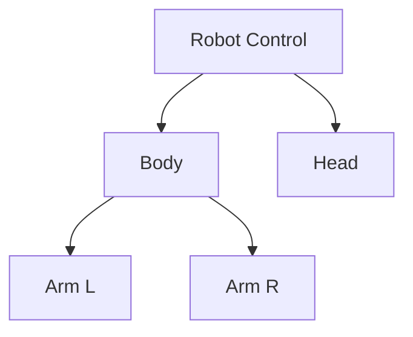
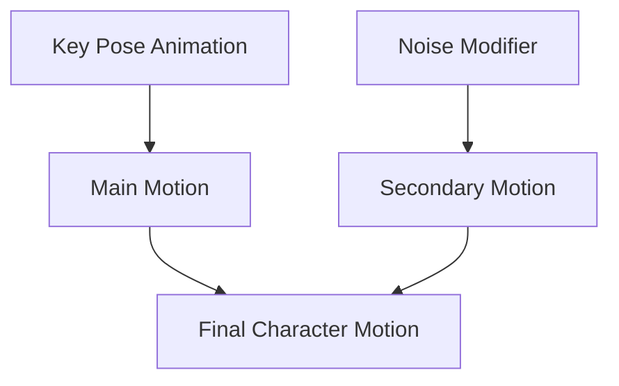
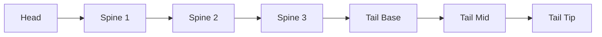
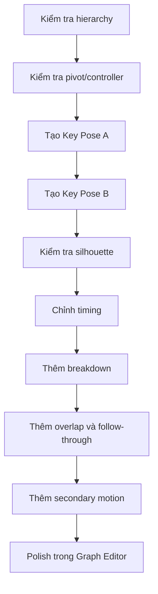

# 052 - Animating a Character

**Phần:** 07 — Animation
**Chủ đề:** Hierarchy, pose và keyframe nhân vật
**Loại bài:** lesson
**Thời lượng:** 4:19

---

## 1. Tóm tắt

Character animation khác với việc chỉ di chuyển một object đơn lẻ. Một nhân vật thường gồm nhiều bộ phận có quan hệ phụ thuộc: thân điều khiển chuyển động tổng thể, đầu đi theo thân, tay hoặc chân chuyển động tương đối so với cơ thể, trong khi các controller cấp cao giúp di chuyển toàn bộ nhân vật mà không phá vỡ pose.

Quy trình cơ bản có thể được hình dung như sau:

```text
Thiết lập hierarchy
        ↓
Đặt pivot/controller hợp lý
        ↓
Tạo key pose
        ↓
Tạo pose đối lập
        ↓
Thêm breakdown
        ↓
Kiểm tra timing và silhouette
        ↓
Thêm secondary motion
        ↓
Tinh chỉnh bằng Graph Editor
```

Bài học này sử dụng một robot đơn giản để minh họa nguyên tắc hierarchy, pose-to-pose animation và procedural secondary motion. Những nguyên tắc tương tự cũng áp dụng cho nhân vật rig bằng armature và các sinh vật như cá.

---

## 2. Mục tiêu học tập

Sau khi hoàn thành bài này, người học có thể:

* Giải thích được vai trò của hierarchy trong character animation.
* Thiết lập quan hệ parent-child mà không làm thay đổi pose hiện tại.
* Sử dụng controller cấp cao để di chuyển toàn bộ nhân vật.
* Đặt origin phù hợp cho bộ phận cần xoay.
* Xây dựng animation theo phương pháp `pose-to-pose`.
* Phân biệt `key pose`, `breakdown` và secondary motion.
* Tạo chuyển động tổng thể từ điểm A đến điểm B.
* Thêm chuyển động phụ mà không phá chuyển động chính.
* Kiểm tra silhouette của pose từ camera.
* Với nhân vật dạng cá, tách được chuyển động của thân, đuôi và vây thay vì xoay toàn bộ mesh như một khối.

---

## 3. Vì sao character animation cần hierarchy?

Giả sử một robot được tạo từ các object độc lập:

```text
Head
Body
Arm.L
Arm.R
```

Nếu các object hoàn toàn tách rời, di chuyển `Body` sẽ không tự động mang đầu và tay theo.

Điều này gây khó khăn khi animate:

```text
Di chuyển thân
→ phải sửa đầu
→ phải sửa tay trái
→ phải sửa tay phải
→ rất nhiều keyframe dư thừa
```

Hierarchy giải quyết vấn đề bằng cách tạo quan hệ cha-con.

Ví dụ:



Trong cấu trúc này:

* `Robot Control` điều khiển chuyển động tổng thể.
* `Body` đi theo controller.
* hai tay đi theo thân nhưng vẫn có thể xoay độc lập.
* `Head` đi theo controller hoặc thân tùy thiết kế.

Khi controller di chuyển, toàn bộ nhân vật đi theo. Khi một cánh tay xoay, những phần không liên quan vẫn giữ nguyên.

---

## 4. Parent và Keep Transform

Để tạo hierarchy bằng object trong Blender, có thể sử dụng:

```text
Ctrl + P
```

Sau đó chọn:

```text
Object (Keep Transform)
```

`Keep Transform` có ý nghĩa quan trọng: object trở thành child nhưng vẫn giữ nguyên transform thế giới hiện tại tại thời điểm thiết lập parent.

Ví dụ:

```text
Trước khi parent

Head
  ở đúng vị trí trên cơ thể

        ↓

Object (Keep Transform)

        ↓

Sau khi parent

Head
  vẫn ở đúng vị trí
  nhưng đi theo parent
```

Nếu không kiểm soát transform khi thiết lập hierarchy, các bộ phận có thể nhảy khỏi vị trí hoặc xuất hiện offset không mong muốn.

---

## 5. Controller cấp cao

Một character rig đơn giản nên có một controller dùng để di chuyển toàn bộ nhân vật.

Controller có thể là:

* `Empty`;
* curve object;
* circle;
* custom shape;
* bone controller trong armature.

Ví dụ đặt tên:

```text
CTRL_Robot
```

Controller này không cần render. Nó chỉ tồn tại để thao tác animation.

Cấu trúc:

```text
CTRL_Robot
├── Body
├── Head
└── các thành phần liên quan
```

Ưu điểm là animator không phải chọn tất cả bộ phận mỗi khi muốn:

* di chuyển nhân vật;
* thay đổi độ cao;
* xoay toàn bộ nhân vật;
* đặt keyframe cho chuyển động tổng thể.

> Chuyển động toàn thân và chuyển động từng bộ phận nên được tách thành các cấp điều khiển khác nhau.

---

## 6. Pivot và origin của bộ phận chuyển động

Một cánh tay chỉ xoay tự nhiên nếu tâm xoay nằm gần khớp vai.

Nếu origin nằm ở giữa cánh tay:

```text
         Origin
           ↓
   ─────── ● ───────

Xoay
→ cánh tay quay quanh giữa object
```

Trong khi chuyển động mong muốn là:

```text
Shoulder
   ↓
   ●──────────── Arm

Xoay
→ quay quanh vai
```

Vì vậy trước khi animate cần kiểm tra:

```text
Bộ phận xoay quanh đâu?
```

Một cách đặt origin chính xác:

1. Chọn vị trí khớp mong muốn.
2. Đưa `3D Cursor` đến vị trí đó.
3. Chọn object cần chỉnh.
4. Dùng `Set Origin`.
5. Chọn:

```text
Origin to 3D Cursor
```

Sau đó thử xoay object để kiểm tra pivot.

---

## 7. Pose-to-pose animation

Một cách xây dựng character animation rõ ràng là bắt đầu từ những pose quan trọng thay vì đặt keyframe liên tục theo từng frame.

Cấu trúc cơ bản:

```text
Key Pose A
    ↓
Breakdown
    ↓
Key Pose B
```

Ví dụ robot di chuyển từ trái sang phải:

```text
Frame 1
Pose A

      ↓

Frame 36
Breakdown

      ↓

Frame 72
Pose B
```

`Key Pose` xác định trạng thái quan trọng của hành động.

`Breakdown` xác định **cách nhân vật đi từ pose này sang pose kia**.

Đây là điểm quan trọng: breakdown không đơn thuần là giá trị trung bình giữa hai pose.

---

## 8. Key pose phải truyền tải hành động

Một pose tốt cần cho người xem hiểu nhân vật đang làm gì ngay cả khi animation bị dừng ở một frame.

Ví dụ robot đang bay về phía trước có thể sử dụng:

```text
Thân hơi nghiêng
Tay có hướng chuyển động
Đầu hướng về mục tiêu
Trọng tâm dịch theo hướng bay
```

Nếu tất cả bộ phận đều thẳng đứng:

```text
Head
Body
Arms
   |
   |
   |
```

pose có thể trông cứng và thiếu định hướng.

Một pose có chủ ý hơn:

```text
       Head →
         \
          Body →
         /   \
      Arm     Arm
```

Không cần exaggeration quá mức, nhưng pose phải có:

* hướng;
* trọng tâm;
* silhouette rõ;
* ý định chuyển động.

---

## 9. Tạo hai pose tương phản

Hai key pose nên khác nhau đủ rõ để tạo cảm giác hành động.

Ví dụ:

**Pose A**

```text
Nhân vật ở bên trái
Thân hơi nghiêng về sau
Tay thấp
Đầu hướng tới đích
```

**Pose B**

```text
Nhân vật ở bên phải
Thân hơi nghiêng về trước
Tay nâng cao hơn
Đầu giữ hướng chuyển động
```

Nếu hai pose gần như giống nhau ngoại trừ vị trí:

```text
Pose A            Pose B
  |                  |
 [ ]      →         [ ]
 / \                / \
```

thì animation dễ trở thành một object trượt từ A đến B.

Character animation cần thay đổi **pose**, không chỉ thay đổi `Location`.

---

## 10. Chuyển động tổng thể từ A đến B

Controller cấp cao có thể đảm nhiệm translation chính.

Ví dụ:

```text
Frame 1
CTRL_Robot ở điểm A
```

Tạo keyframe cho transform.

Sau đó:

```text
Frame 72
CTRL_Robot ở điểm B
```

tạo keyframe thứ hai.

Luồng:

```text
A
│
│  movement
│
└──────────────────→ B
```

Nếu playback ở `24 FPS`, 72 frame tương ứng khoảng 3 giây.

Tuy nhiên, timing phải được đánh giá theo cảm giác chuyển động chứ không chỉ theo con số.

Một quãng đường dài trong 3 giây có thể nhanh, còn quãng đường rất ngắn trong 3 giây có thể quá chậm.

---

## 11. Breakdown tạo chất lượng cho chuyển động

Giả sử pose đầu và cuối đã tốt nhưng animation vẫn trông máy móc.

Khi đó cần kiểm tra breakdown.

Ví dụ:

```text
Pose A
Thân nghiêng trái
Tay thấp

        ↓

Breakdown
Thân gần thẳng
Tay bắt đầu nâng
Đầu đi trước một chút

        ↓

Pose B
Thân nghiêng phải
Tay cao
```

Breakdown kiểm soát:

* arc;
* hướng chuyển động;
* phần nào đi trước;
* phần nào đi sau;
* mức độ overlap;
* trọng tâm;
* spacing.

Nó quyết định rất lớn việc animation có cảm giác sống hay chỉ là interpolation tự động giữa hai pose.

---

## 12. Trọng tâm của nhân vật

Chuyển động thuyết phục cần có cảm giác về trọng tâm.

Ngay cả robot bay lơ lửng cũng nên có một logic trọng lượng.

Ví dụ khi tăng tốc về bên phải:

```text
Hướng chuyển động →

     ● Head
      \
       █ Body
      / \
```

thân có thể hơi nghiêng theo hoặc chống lại lực tùy thiết kế.

Khi giảm tốc:

```text
→ chuyển động

        Head ●
             /
        Body █
```

pose có thể thay đổi để tạo cảm giác quán tính.

Không nhất thiết phải mô phỏng vật lý chính xác, nhưng toàn bộ character không nên thay đổi mọi bộ phận hoàn toàn đồng thời và cùng một mức độ.

---

## 13. Silhouette trong character animation

Silhouette là hình dạng tổng thể của nhân vật khi chỉ nhìn đường bao ngoài.

Một pose tốt nên đọc được ngay cả khi:

```text
Không thấy texture
Không thấy material
Không thấy chi tiết nhỏ
```

Có thể kiểm tra bằng cách quan sát nhân vật từ camera.

Ví dụ silhouette kém:

```text
Hai tay chồng lên thân
Đầu trùng với vai
Các bộ phận nằm trên cùng một đường
```

Người xem khó xác định pose.

Silhouette tốt:

```text
Tay tách khỏi thân
Đầu có hướng rõ
Trục thân đọc được
Các chi tiết chính không chồng hoàn toàn lên nhau
```

Đây là lý do một pose có thể nhìn tốt trong góc perspective của animator nhưng không hoạt động trong camera cuối.

> Pose phải được đánh giá từ góc camera mà người xem thực sự nhìn thấy.

---

## 14. Animate tay và các bộ phận phụ

Sau khi chuyển động tổng thể hoạt động, mới nên bổ sung chuyển động cho các bộ phận.

Ví dụ:

```text
Main movement
CTRL_Robot: A → B

Secondary pose
Body: nghiêng

Arm motion
Arms: nâng → giữ → hạ
```

Một chuyển động tay đơn giản có thể dùng:

```text
Frame 1
Arms = thấp

Frame 24
Arms = nâng

Frame 48
Arms = giữ

Frame 72
Arms = trở lại
```

Không phải bộ phận nào cũng cần keyframe tại cùng một frame.

Việc offset timing có thể tạo chuyển động tự nhiên hơn.

---

## 15. Hold pose

Một pose không nhất thiết phải bắt đầu chuyển sang pose tiếp theo ngay lập tức.

Ví dụ:

```text
Frame 20
Body Rotation = 15°

Frame 35
Body Rotation = 15°

Frame 50
Body Rotation = 0°
```

Từ frame `20` đến `35`, nhân vật giữ pose.

Luồng:

```text
xoay
 ↓
giữ
 ↓
trở lại
```

Hold giúp:

* action dễ đọc;
* tạo nhịp;
* nhấn mạnh pose;
* tránh animation liên tục chuyển động mà không có điểm nghỉ.

---

## 16. Secondary motion bằng procedural animation

Chuyển động chính nên được kiểm soát bằng key pose và breakdown.

Sau đó có thể thêm procedural animation để tạo những chuyển động nhỏ.

Ví dụ robot bay lơ lửng:

```text
Location Z
    ↓
F-Curve
    ↓
Noise Modifier
    ↓
Dao động nhẹ
```

Kết quả:

```text
   ↑
Robot
   ↓
   ↑
   ↓
```

thay vì đứng hoàn toàn cứng trên một độ cao.

Cấu trúc tổng thể:



Keyframe quyết định hành động.

Noise chỉ thêm variation nhỏ.

---

## 17. Thêm Noise vào chuyển động hover

Để tạo hover:

1. Tạo ít nhất một animation channel cho `Location Z`.
2. Mở `Graph Editor`.
3. Chọn `Location Z`.
4. Mở phần `Modifiers`.
5. Thêm `Noise`.
6. Giảm biên độ xuống mức nhỏ.
7. Điều chỉnh tần suất đến khi chuyển động hợp lý.

Mục tiêu không phải:

```text
Robot nhảy lên xuống mạnh
```

mà thường là:

```text
Robot
 ↓
dao động rất nhẹ
 ↓
có cảm giác đang lơ lửng
```

Nếu `Strength` quá lớn, procedural motion sẽ lấn át animation chính.

---

## 18. Không áp dụng cùng một Noise cho mọi trục

Một lỗi phổ biến là thêm procedural animation vào:

```text
Location X
Location Y
Location Z
```

trong khi chỉ muốn nhân vật hover lên xuống.

Kết quả có thể là:

```text
trái ↔ phải
trước ↔ sau
lên ↕ xuống
```

và nhân vật trông mất kiểm soát.

Nếu mục tiêu là hover theo chiều cao, chỉ cần:

```text
Location Z
```

Tương tự, một chuyển động rocking nhẹ có thể dùng một rotation axis cụ thể thay vì noise toàn bộ ba trục.

---

## 19. Không để procedural motion thay thế pose

Procedural animation rất hữu ích cho secondary motion nhưng không nên dùng để thay thế quyết định animation chính.

Không nên xây dựng nhân vật theo kiểu:

```text
Noise
 ↓
Noise
 ↓
Noise
 ↓
Character tự rung
```

Mà nên:

```text
Pose
 ↓
Timing
 ↓
Breakdown
 ↓
Polish
 ↓
Procedural secondary motion
```

Key pose vẫn phải kiểm soát:

* hành động;
* biểu cảm hình thể;
* trọng tâm;
* hướng;
* storytelling.

Noise chỉ giúp chuyển động bớt cứng khi phù hợp.

---

## 20. Offset giữa các bộ phận

Trong tự nhiên, tất cả bộ phận hiếm khi đổi hướng chính xác cùng một frame.

Ví dụ:

```text
Frame 20
Body bắt đầu đổi hướng

Frame 22
Head bắt đầu theo

Frame 24
Arm bắt đầu theo
```

Sự trễ nhỏ này tạo:

```text
Main motion
    ↓
Follow-through
    ↓
Overlap
```

Đây là nguyên tắc đặc biệt quan trọng với:

* tóc;
* áo;
* đuôi;
* tai;
* vây;
* các appendage mềm.

Nếu tất cả keyframe nằm cùng frame với cùng curve, nhân vật rất dễ trông cơ học.

---

## 21. Từ robot đến nhân vật rig bằng armature

Ví dụ robot sử dụng object parenting vì cấu tạo đơn giản.

Với nhân vật phức tạp, cùng tư duy được áp dụng bằng armature:

```text
Object hierarchy đơn giản
        ↓
Armature hierarchy
        ↓
Bone controllers
        ↓
Pose
```

Ví dụ:

```text
Root
└── Spine
    ├── Head
    ├── Arm.L
    └── Arm.R
```

Animator thường không keyframe trực tiếp toàn bộ mesh.

Thay vào đó:

```text
Controller / Bone
      ↓
Armature
      ↓
Mesh deformation
```

Điều này cho phép pose rõ ràng và dễ chỉnh sửa hơn.

---

## 22. Áp dụng cho animation cá

Cá là ví dụ đặc biệt rõ về việc character animation không thể chỉ là transform của toàn bộ mesh.

Một cách làm không hiệu quả:

```text
Fish Mesh
    ↓
Rotate Left
    ↓
Rotate Right
```

Kết quả giống một mô hình cứng đang lắc qua lại.

Chuyển động cá nên được hình thành qua một chuỗi offset trên cơ thể:

```text
Head
 ↓
Body
 ↓
Tail Base
 ↓
Tail Mid
 ↓
Tail Tip
```

Có thể hình dung:

```text
Thời điểm A

Head ─ Body ╲ Tail

Thời điểm B

Head ─ Body ╱ Tail
```

Quan trọng hơn, từng phần không nên đổi hướng cùng lúc.

---

## 23. Arc của thân cá

Khi cá bơi, đường cong cơ thể cần đọc được như một arc liên tục.

Không nên tạo:

```text
Head ─ Body ─ Tail
             \
              \
```

với một góc gãy cứng tại một bone.

Nên hướng tới:

```text
Head ───╮
        ╰── Body ──╮
                  ╰── Tail
```

hoặc arc theo hướng ngược lại.

Các bone tạo thành một chuỗi uốn liên tục.

Điều cần quan sát không chỉ là từng bone mà là:

> silhouette của toàn bộ đường sống lưng.

---

## 24. Offset giữa các bone của cá

Giả sử có chuỗi:

```text
Spine 1
Spine 2
Spine 3
Tail Base
Tail Mid
Tail Tip
```

Không nên đặt tất cả rotation peak tại cùng frame.

Thay vào đó:

```text
Frame 10 → Spine 1 đạt góc lớn nhất
Frame 12 → Spine 2
Frame 14 → Spine 3
Frame 16 → Tail Base
Frame 18 → Tail Mid
Frame 20 → Tail Tip
```

Kết quả tạo sóng truyền:



Sóng chuyển động đi từ thân về phía đuôi thay vì cả cá đổi hướng như một khối.

---

## 25. Thân, đuôi và vây cần vai trò khác nhau

Có thể chia chuyển động cá thành ba lớp.

| Phần | Vai trò                                    |
| ---- | ------------------------------------------ |
| Thân | Tạo arc và hướng chuyển động chính         |
| Đuôi | Tạo biên độ lớn hơn và follow-through      |
| Vây  | Giữ cân bằng, steering và secondary motion |

Thân thường có chuyển động ổn định hơn.

Đuôi thường:

* trễ hơn;
* có biên độ lớn hơn;
* thể hiện rõ wave motion.

Vây không nên chỉ copy chuyển động đuôi.

Vây có thể:

* mở;
* khép;
* nghiêng;
* flutter;
* steering độc lập.

Điều này tạo cảm giác nhân vật có cấu trúc sinh học thay vì một object mềm đơn giản.

---

## 26. Key pose cho cá

Ngay cả animation bơi tuần hoàn cũng nên được xây từ key pose rõ ràng.

Ví dụ:

**Pose A**

```text
Thân cong trái
Đuôi sang trái
Một số vây mở để cân bằng
```

**Breakdown**

```text
Thân gần trung tâm
Sóng đang truyền về sau
Đuôi chưa hoàn toàn qua phía đối diện
```

**Pose B**

```text
Thân cong phải
Đuôi sang phải
Vây điều chỉnh theo hướng mới
```

Luồng:

```text
Pose A
   ↓
Breakdown
   ↓
Pose B
   ↓
Breakdown
   ↓
Pose A
```

Đây là nền tảng của một swim cycle.

---

## 27. Follow-through của đuôi và vây

Khi thân đổi hướng, đuôi không nhất thiết đổi hướng ngay.

Ví dụ:

```text
Body → đổi sang phải

Tail → vẫn còn chuyển trái

        ↓

Tail đi qua trung tâm

        ↓

Tail → mới theo sang phải
```

Độ trễ này tạo cảm giác:

* mềm;
* có quán tính;
* có lực cản nước;
* có dòng chuyển động truyền qua cơ thể.

Vây cũng có thể có offset nhỏ hơn hoặc độc lập tùy chức năng.

---

## 28. Silhouette của cá

Silhouette đặc biệt quan trọng với cá vì chuyển động thường được đọc qua:

* đường cong thân;
* hình dạng đuôi;
* độ mở của vây.

Khi xem từ camera, kiểm tra:

```text
Thân có tạo arc rõ không?
Đuôi có bị chồng hoàn toàn vào thân không?
Vây có đọc được không?
Đầu có giữ hướng hợp lý không?
```

Một animation kỹ thuật đúng nhưng silhouette kém vẫn có thể trông yếu.

---

## 29. Timing chính và secondary motion

Một character animation hiệu quả thường có nhiều tầng thời gian:

```text
Main translation
     ↓
Body pose
     ↓
Limbs / Tail
     ↓
Fins / Accessories
     ↓
Procedural micro-motion
```

Không phải tất cả đều cần cùng tần suất.

Ví dụ với robot:

```text
Di chuyển A → B
→ chậm

Arms
→ thay đổi theo action

Hover noise
→ nhỏ và thường xuyên
```

Với cá:

```text
Đường bơi
→ chuyển động cấp scene

Body wave
→ nhịp bơi chính

Tail
→ follow-through

Fins
→ secondary control

Micro flutter
→ variation nhỏ
```

Tách các tầng giúp animation dễ chỉnh và tự nhiên hơn.

---

## 30. Quy trình character animation đề xuất

Một quy trình thực tế có thể dùng:



Không nên bắt đầu bằng Noise, curve chi tiết hoặc hàng chục keyframe.

Trước tiên phải đảm bảo:

```text
Pose đúng
+
Timing đúng
+
Silhouette rõ
```

Sau đó mới polish.

---

## 31. Lỗi thường gặp

**Nhân vật di chuyển nhưng trông như một object cứng**

Nguyên nhân:

* chỉ animate controller tổng;
* không thay đổi pose bên trong.

Cách xử lý:

* thêm body rotation;
* thêm chuyển động đầu/tay/đuôi;
* tạo breakdown;
* offset timing giữa các bộ phận.

---

**Bộ phận xoay sai vị trí**

Nguyên nhân:

* origin hoặc pivot không nằm tại khớp.

Cách xử lý:

* xác định vị trí khớp;
* đặt `3D Cursor`;
* chỉnh origin hoặc sử dụng controller/bone phù hợp.

---

**Di chuyển parent làm child nhảy vị trí**

Nguyên nhân có thể do hierarchy hoặc transform chưa được thiết lập đúng.

Cách xử lý:

* kiểm tra parent;
* kiểm tra local/world transform;
* dùng `Keep Transform` khi tạo parent nếu cần giữ pose hiện tại.

---

**Animation có nhiều chuyển động nhưng vẫn khó đọc**

Nguyên nhân:

* silhouette yếu;
* quá nhiều bộ phận chồng nhau;
* thiếu key pose rõ ràng.

Cách xử lý:

* dừng playback tại key pose;
* kiểm tra trực tiếp từ camera;
* cải thiện pose trước khi thêm animation mới.

---

**Noise làm nhân vật rung mạnh**

Nguyên nhân:

* `Strength` quá cao;
* Noise được áp dụng cho quá nhiều channel.

Cách xử lý:

* giảm biên độ;
* cô lập đúng axis;
* chỉ dùng procedural motion như variation nhỏ.

---

**Cá trông như đang lắc toàn thân**

Nguyên nhân:

* xoay toàn bộ mesh;
* các bone cùng timing;
* không có wave propagation.

Cách xử lý:

* tạo arc trên spine;
* offset các bone;
* tăng biên độ dần về đuôi;
* animate vây độc lập.

---

## 32. Best practices

* Thiết lập hierarchy trước khi tạo nhiều keyframe.
* Sử dụng controller cấp cao cho chuyển động toàn nhân vật.
* Đặt pivot tại vị trí khớp hợp lý.
* Bắt đầu bằng key pose thay vì đặt key ở mọi frame.
* Đảm bảo hai pose chính khác nhau đủ rõ.
* Kiểm tra silhouette từ camera thường xuyên.
* Dùng breakdown để thiết kế đường đi giữa hai pose.
* Offset chuyển động giữa các bộ phận để tạo overlap.
* Dùng hold khi cần giúp pose dễ đọc.
* Thêm procedural motion sau khi main animation đã hoạt động.
* Chỉ thêm Noise vào những channel thực sự cần variation.
* Không để secondary motion mạnh hơn hành động chính.
* Với sinh vật mềm, ưu tiên arc liên tục thay vì các góc gãy.
* Với cá, tăng độ trễ và thường tăng biên độ chuyển động về phía đuôi.
* Animate vây như bộ phận điều khiển độc lập, không chỉ để chúng đi theo mesh một cách thụ động.

---

## 33. Bài thực hành

Tạo một animation character ngắn bằng robot, sinh vật rig đơn giản hoặc nhân vật tương đương.

### 33.1. Thiết lập và key pose

1. Tạo hoặc kiểm tra hierarchy.
2. Tạo controller cho toàn nhân vật nếu cần.
3. Kiểm tra origin của các bộ phận có chuyển động.
4. Tạo `Key Pose A`.
5. Chuyển đến frame cuối.
6. Tạo `Key Pose B` tương phản rõ với pose đầu.
7. Animate controller để nhân vật di chuyển từ điểm A đến điểm B.
8. Kiểm tra hai pose từ camera.

**Kết quả mong đợi:**

```text
Pose A
  ↓
Chuyển động tổng thể
  ↓
Pose B
```

Hai pose phải khác nhau về hình thể chứ không chỉ khác `Location`.

### 33.2. Breakdown và secondary motion

1. Chèn ít nhất một breakdown giữa hai key pose.
2. Thay đổi body rotation hoặc hướng bộ phận chính.
3. Offset timing của ít nhất một bộ phận.
4. Thêm một đoạn hold nếu phù hợp.
5. Mở `Graph Editor`.
6. Thêm procedural motion nhẹ vào một channel nếu cần.
7. Playback từ camera và kiểm tra silhouette.

**Kết quả mong đợi:**

```text
Key Pose
   ↓
Breakdown
   ↓
Key Pose

+

Secondary motion nhỏ
```

Animation phải có chuyển động chính rõ ràng trước khi secondary motion được thêm vào.

---

## 34. Bài thực hành áp dụng cho cá

Nếu character là cá, thực hiện:

1. Xác định chuỗi điều khiển:

   * thân;
   * đuôi;
   * vây.
2. Tạo pose cong sang một phía.
3. Tạo pose cong sang phía đối diện.
4. Thêm breakdown khi cơ thể đi qua trung tâm.
5. Offset rotation giữa các bone từ thân về đuôi.
6. Cho đuôi có follow-through rõ hơn thân.
7. Animate ít nhất một nhóm vây độc lập.
8. Kiểm tra arc của đường sống lưng.
9. Xem animation từ camera.
10. Chỉnh những frame có silhouette không rõ.

Một chu kỳ tối thiểu nên đọc được:

```text
Cong trái
    ↓
Sóng truyền về đuôi
    ↓
Trung tâm
    ↓
Sóng tiếp tục
    ↓
Cong phải
```

Không dùng rotation của toàn bộ fish mesh để thay thế body deformation.

---

## 35. Checklist hoàn thành

* [ ] Hierarchy của nhân vật hoạt động đúng.
* [ ] Có controller cho chuyển động tổng thể khi cần.
* [ ] Pivot hoặc origin của bộ phận xoay được đặt hợp lý.
* [ ] Có ít nhất hai key pose tương phản.
* [ ] Có ít nhất một breakdown.
* [ ] Key pose thể hiện rõ hướng và hành động.
* [ ] Silhouette đọc được từ camera.
* [ ] Chuyển động không chỉ là translation của toàn nhân vật.
* [ ] Có thể chỉnh body và các bộ phận độc lập.
* [ ] Timing giữa các bộ phận không bị đồng bộ cứng một cách không cần thiết.
* [ ] Secondary motion không lấn át chuyển động chính.
* [ ] Noise chỉ được áp dụng cho đúng channel nếu sử dụng.
* [ ] Có thể tạo hold pose khi cần.
* [ ] Hiểu vai trò của overlap và follow-through.
* [ ] Với cá, thân tạo được arc rõ.
* [ ] Với cá, các bone có offset theo hướng truyền sóng.
* [ ] Với cá, đuôi có thể chỉnh độc lập với thân.
* [ ] Với cá, vây có thể chỉnh độc lập với thân và đuôi.
* [ ] Không animate cá chỉ bằng cách xoay toàn bộ mesh như một object.

---

## 36. Tổng kết

Character animation là quá trình tổ chức nhiều lớp chuyển động chứ không chỉ thay đổi vị trí của một object.

Nền tảng của quy trình là:

```text
Hierarchy
   ↓
Controller
   ↓
Key Pose
   ↓
Breakdown
   ↓
Timing
   ↓
Overlap / Follow-through
   ↓
Secondary Motion
```

Hierarchy giúp chuyển động toàn nhân vật mà vẫn giữ khả năng điều khiển từng bộ phận. Key pose xác định những trạng thái quan trọng, breakdown quyết định cách nhân vật chuyển giữa các trạng thái đó, còn secondary motion bổ sung độ sống động sau khi chuyển động chính đã ổn định.

Với nhân vật dạng cá, tư duy này càng quan trọng:

```text
Root / hướng bơi
        ↓
Thân tạo arc
        ↓
Sóng truyền dọc spine
        ↓
Đuôi follow-through
        ↓
Vây hỗ trợ và tạo secondary motion
```

Mục tiêu cuối cùng không phải tạo nhiều keyframe nhất, mà là tạo một hệ chuyển động trong đó từng phần có vai trò, timing và mức độ ảnh hưởng rõ ràng, đồng thời toàn bộ silhouette vẫn truyền tải được hành động khi nhìn từ camera.
