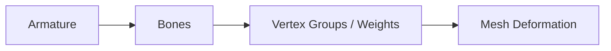
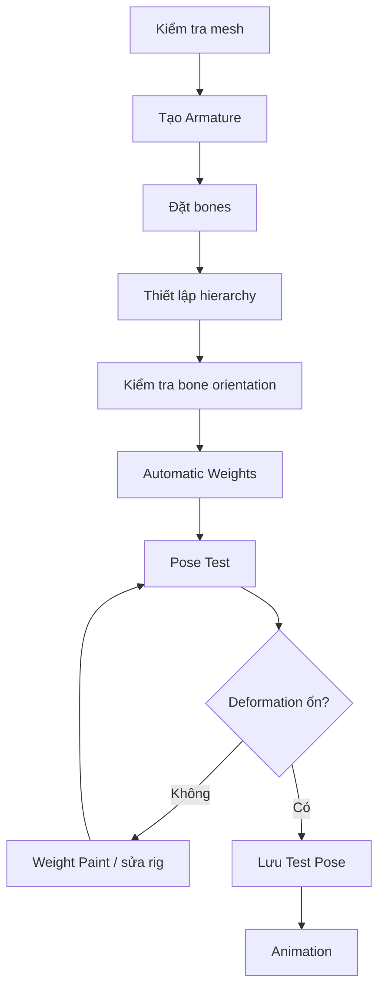

# 053 - Bones and Rigging

**Phần:** 07 — Animation
**Chủ đề:** Armature, Bones, Automatic Weights, Weight Paint và Pose Mode
**Loại bài:** lesson
**Thời lượng:** 8:35

---

## 1. Tóm tắt

Rigging là quá trình xây dựng một hệ xương điều khiển để mesh có thể được tạo pose và animate mà vẫn giữ deformation hợp lý.

Pipeline cơ bản trong Blender:

```text
Mesh
  ↓
Tạo Armature
  ↓
Đặt Bones theo cấu trúc cơ thể
  ↓
Thiết lập hierarchy và bone orientation
  ↓
Parent mesh với Armature
  ↓
Automatic Weights
  ↓
Pose test
  ↓
Weight Paint
  ↓
Sửa deformation
  ↓
Animation
```

Một rig tốt không chỉ cần có đủ bone. Vị trí khớp, hướng bone, hierarchy, `Bone Roll` và weight đều ảnh hưởng trực tiếp đến cách mesh biến dạng khi tạo pose.

`Automatic Weights` giúp tạo weight ban đầu nhanh chóng, nhưng thường chỉ nên xem là **điểm khởi đầu**. Những vùng phức tạp như vai, bàn tay, ngón tay, đuôi, vây hoặc các vùng mesh giao nhau thường cần được kiểm tra và chỉnh thủ công bằng `Weight Paint`.

---

## 2. Mục tiêu học tập

Sau khi hoàn thành bài này, người học có thể:

* Giải thích được vai trò của `Armature` và `Bone`.
* Phân biệt `Edit Mode`, `Pose Mode` và `Weight Paint`.
* Tạo và extrude một chuỗi bone.
* Thiết lập hierarchy giữa các bone.
* Căn bone theo cấu trúc và hướng uốn của mesh.
* Kiểm tra và chỉnh `Bone Roll`.
* Bind mesh vào armature bằng `Automatic Weights`.
* Kiểm tra deformation bằng pose test.
* Đọc được vùng ảnh hưởng trong `Weight Paint`.
* Tăng, giảm hoặc làm mượt weight ở vùng deformation sai.
* Reset rotation của bone khi pose test.
* Chuẩn bị một rig cơ bản đủ sạch trước khi bắt đầu animation.
* Áp dụng nguyên tắc tương tự cho rig cá với spine, tail và fin bones.

---

## 3. Armature và Bone là gì?

`Armature` là object chứa hệ xương của rig.

Bên trong armature có các `Bone`.

Có thể hình dung:

```text
Armature
├── Root
├── Spine
├── Head
├── Arm.L
├── Arm.R
└── ...
```

Mesh không tự biến dạng chỉ vì có armature nằm bên trong.

Để hệ thống hoạt động cần ba thành phần:



Bone cung cấp transform.

Weight xác định phần nào của mesh chịu ảnh hưởng.

Khi bone xoay hoặc di chuyển trong `Pose Mode`, Blender sử dụng weight để tính vị trí mới cho các vertex.

---

## 4. Ba mode quan trọng trong rigging

Một armature thường được thao tác qua ba ngữ cảnh chính.

| Mode           | Công dụng                                  |
| -------------- | ------------------------------------------ |
| `Edit Mode`    | Xây và chỉnh cấu trúc xương                |
| `Pose Mode`    | Tạo pose và animation                      |
| `Weight Paint` | Điều chỉnh mức ảnh hưởng của bone lên mesh |

Có thể ghi nhớ:

```text
Edit Mode
→ xương nằm ở đâu?

Pose Mode
→ xương đang tạo pose thế nào?

Weight Paint
→ xương ảnh hưởng mesh bao nhiêu?
```

Không nên chỉnh cấu trúc rig trong `Pose Mode` rồi kỳ vọng rest pose thay đổi theo.

Cấu trúc cơ sở của bone được thiết lập trong `Edit Mode`.

---

## 5. Tạo Armature đầu tiên

Để tạo armature:

```text
Shift + A
→ Armature
```

Blender tạo một armature với bone đầu tiên.

Bone thường có:

```text
Head
  ↓
[ Bone ]
  ↓
Tail
```

Trong `Edit Mode`, có thể chỉnh:

* `Head`;
* `Tail`;
* chiều dài;
* vị trí;
* hướng;
* parent;
* connectivity;
* `Bone Roll`.

Bone đầu tiên nên được đặt theo một phần cấu trúc lớn và ổn định của model.

Ví dụ với bàn tay:

```text
Wrist / Palm
```

có thể được dùng làm vùng bắt đầu trước khi xây các chuỗi ngón.

---

## 6. Hiển thị bone xuyên qua mesh

Khi bone nằm bên trong mesh, rất khó quan sát trong `Solid View`.

Armature có tùy chọn:

```text
In Front
```

Khi bật, bone được hiển thị phía trước mesh.

Điều này không thay đổi rig hoặc render.

Nó chỉ giúp:

* đặt bone;
* chọn bone;
* kiểm tra hierarchy;
* pose test.

Đây là một tùy chọn rất hữu ích trong quá trình rigging.

---

## 7. Bone phải đi theo cấu trúc chuyển động

Bone không nên được đặt chỉ dựa vào hình dạng bề mặt.

Điều quan trọng hơn là:

```text
Khớp nằm ở đâu?
Bộ phận sẽ uốn theo hướng nào?
Vùng nào cần deform?
```

Ví dụ với một ngón tay:

```text
Knuckle
   ↓
Phalanx 1
   ↓
Phalanx 2
   ↓
Phalanx 3
```

Bone nên gần tương ứng với các khớp và segment thực tế.

Nếu bone nằm lệch khỏi trục ngón:

```text
Mesh finger
──────────────

Bone
   ╲────────
```

khi xoay, ngón rất dễ:

* cong lệch;
* bị xoắn;
* mất volume;
* kéo vertex sang vùng không mong muốn.

---

## 8. Extrude chuỗi bone

Trong `Edit Mode`, một bone có thể được kéo dài thành chuỗi bằng:

```text
E
```

Ví dụ:

```text
Bone 1
  ↓
E
  ↓
Bone 2
  ↓
E
  ↓
Bone 3
```

Kết quả:

```text
Bone 1 → Bone 2 → Bone 3
```

Các bone được extrude liên tục thường tạo parent-child connection tự nhiên.

Cách này phù hợp cho:

* spine;
* tail;
* finger;
* tentacle;
* antenna;
* limb chain.

---

## 9. Subdivide Bone

Nếu đã có một bone dài nhưng cần chia thành nhiều đoạn, có thể dùng:

```text
Subdivide
```

Ví dụ:

```text
1 bone dài
     ↓
Subdivide
     ↓
3 bone ngắn
```

Đây là cách nhanh để tạo các phalanx của ngón hoặc chia một segment dài thành nhiều bone điều khiển.

Sau khi subdivide vẫn cần căn lại từng joint theo anatomy hoặc logic deformation của model.

---

## 10. Đặt bone theo khớp

Với ngón tay, mỗi joint của bone nên gần với điểm ngón thực sự cần xoay.

Ví dụ:

```text
      Joint 1       Joint 2
         ↓             ↓
Finger ──●─────────────●──────────
         │             │
       Bone 1        Bone 2
```

Nếu joint nằm quá xa vị trí khớp:

```text
Bone xoay
   ↓
Vertex bị kéo từ sai tâm
   ↓
Deformation méo
```

Vì vậy rigging cần quan sát model từ nhiều góc:

* front;
* side;
* top;
* perspective.

Một rig thẳng ở `Front View` chưa chắc đã nằm đúng bên trong mesh khi nhìn từ cạnh.

---

## 11. Hierarchy của Bone

Hierarchy xác định bone nào đi theo bone nào.

Ví dụ:

```text
Wrist
└── Finger Base
    └── Finger Mid
        └── Finger Tip
```

Nếu `Finger Mid` là child của `Finger Base`, khi base xoay:

```text
Finger Base
    ↓
Finger Mid đi theo
    ↓
Finger Tip đi theo
```

Nhưng bone con vẫn có thể nhận thêm transform riêng.

Hierarchy đúng giúp tạo chuyển động theo chuỗi.

---

## 12. Parent Bone

Khi cần thiết lập quan hệ giữa hai bone:

1. Chọn bone con.
2. Chọn bone cha.
3. Sử dụng:

```text
Ctrl + P
```

Có hai tư duy parent phổ biến:

```text
Connected
```

hoặc:

```text
Keep Offset
```

`Connected` phù hợp khi đầu bone con nối trực tiếp vào đuôi bone cha.

`Keep Offset` phù hợp khi hai bone cần quan hệ cha-con nhưng không nằm nối liền nhau.

Ví dụ một cụm ngón có thể được parent về bone bàn tay nhưng vẫn giữ vị trí vật lý riêng.

---

## 13. Bone orientation

Một bone không chỉ có hướng từ `Head` đến `Tail`.

Nó còn có orientation cục bộ.

Điều này quan trọng vì khi animate, rotation thường được áp dụng theo local axis.

Ví dụ:

```text
Local X
Local Y
Local Z
```

Nếu các bone tương tự có orientation khác nhau:

```text
Finger 1 → local X đúng
Finger 2 → local X xoay 70°
Finger 3 → local X đảo hướng
```

thì cùng một thao tác rotation có thể tạo ba kết quả rất khác nhau.

---

## 14. Bone Roll

`Bone Roll` kiểm soát cách các trục cục bộ xoay quanh chiều dài bone.

Có thể hình dung bone giống một cây bút:

```text
Head ───────── Tail
```

Chiều dài không đổi nhưng cây bút vẫn có thể xoay quanh trục của chính nó.

Đó là ý tưởng của `Roll`.

Bone roll không hợp lý dễ gây:

* local axis không đồng nhất;
* pose khó kiểm soát;
* bone xoay sai mặt phẳng;
* rig khó mirror;
* constraint hoạt động không trực quan.

Khi rig một chuỗi tương tự nhau, nên cố gắng duy trì orientation nhất quán.

---

## 15. Hiển thị trục Bone

Trong quá trình kiểm tra orientation, có thể bật hiển thị bone axes.

Khi đó mỗi bone thể hiện local axis để dễ xác định:

```text
X
Y
Z
```

Điều này đặc biệt hữu ích với:

* finger chains;
* spine;
* tail;
* fins;
* mechanical rig;
* các bone cần cùng hướng rotation.

Không nên chỉ nhìn hình dạng bone và đoán orientation.

---

## 16. Duplicate các chuỗi tương tự

Khi nhiều bộ phận có cấu trúc gần giống nhau, có thể tạo một chain chuẩn rồi duplicate:

```text
Shift + D
```

Ví dụ:

```text
Finger chain chuẩn
      ↓
Duplicate
      ↓
Index
Middle
Ring
Pinky
```

Sau đó điều chỉnh:

* chiều dài;
* vị trí;
* rotation;
* bone roll;
* orientation.

Cách này nhanh hơn tạo từng bone từ đầu.

Tuy nhiên không nên copy một chain rồi để nguyên nếu anatomy của từng ngón khác nhau.

---

## 17. Kiểm tra rig trong Pose Mode

Sau khi tạo hierarchy, cần test trước khi bind hoặc trước khi đi sâu vào weight.

Chuyển sang:

```text
Pose Mode
```

Sau đó thử:

* xoay bone;
* tạo pose cực đại;
* kiểm tra child đi theo parent;
* kiểm tra hướng bend;
* kiểm tra local axes.

Mục tiêu là phát hiện lỗi cấu trúc sớm.

Ví dụ:

```text
Rotate parent
    ↓
Child đi theo đúng?
    ↓
Có
→ tiếp tục

Không
→ sửa hierarchy trước
```

Không nên đợi đến sau khi Weight Paint xong mới phát hiện hierarchy sai.

---

## 18. Bind mesh vào Armature

Sau khi bone đã được đặt hợp lý, mesh cần được liên kết với armature.

Quy trình phổ biến:

1. Chọn mesh.
2. Chọn armature sau cùng.
3. Sử dụng:

```text
Ctrl + P
```

4. Chọn:

```text
With Automatic Weights
```

Blender sẽ:

```text
Armature
   ↓
Phân tích khoảng cách bone ↔ vertex
   ↓
Tạo Vertex Groups
   ↓
Gán weight ban đầu
   ↓
Mesh deform theo bones
```

Đây là bước bind nhanh và thuận tiện.

---

## 19. Automatic Weights thực sự làm gì?

Sau khi sử dụng `Automatic Weights`, Blender tạo các `Vertex Group` tương ứng với deform bones.

Ví dụ:

```text
hand
├── wrist
├── finger_01
├── finger_02
├── finger_03
└── ...
```

Mỗi vertex có thể chịu ảnh hưởng từ một hoặc nhiều bone.

Ví dụ:

```text
Vertex A

Bone Wrist  = 0.8
Bone Finger = 0.2
```

Nghĩa là deformation của vertex này chịu ảnh hưởng:

```text
80% từ Wrist
20% từ Finger
```

Automatic Weights cố gắng tính những giá trị đó tự động.

---

## 20. Automatic Weights không phải rig hoàn chỉnh

Automatic Weights rất hữu ích để bắt đầu nhanh, nhưng không biết chính xác ý định deformation của animator.

Nó có thể tạo lỗi tại:

* joint nhỏ;
* ngón tay gần nhau;
* nách;
* vai;
* háng;
* vùng mesh giao nhau;
* phụ kiện gần cơ thể;
* tail base;
* fins gần body;
* geometry bất thường.

Vì vậy pipeline đúng là:

```text
Automatic Weights
        ↓
Pose Test
        ↓
Tìm vùng lỗi
        ↓
Weight Paint
        ↓
Pose Test lại
```

Không phải:

```text
Automatic Weights
        ↓
Rig hoàn thành
```

---

## 21. Vertex Weight

Weight thường có giá trị từ:

```text
0.0 → không ảnh hưởng

1.0 → ảnh hưởng tối đa
```

Các giá trị giữa hai mức tạo sự pha trộn.

Ví dụ gần khớp:

```text
Bone A
Weight 1.0
    ↓
0.8
    ↓
0.5
    ↓
0.2
    ↓
Bone B
Weight 1.0
```

Gradient weight giúp bề mặt biến dạng mềm hơn.

Nếu chuyển từ `1.0` sang `0.0` quá đột ngột, joint có thể gãy hoặc tạo nếp cứng.

---

## 22. Weight Paint

`Weight Paint` giúp hiển thị và chỉnh weight trực quan trên bề mặt mesh.

Thông thường có thể hiểu màu như:

```text
Ảnh hưởng thấp
    ↓
xanh
    ↓
lục / vàng
    ↓
đỏ
    ↓
Ảnh hưởng cao
```

Mục tiêu không phải làm toàn bộ mesh màu đỏ.

Mục tiêu là tạo vùng ảnh hưởng phù hợp với từng bone.

Ví dụ một bone ngón tay chỉ nên tác động mạnh lên:

```text
segment tương ứng
+
vùng chuyển tiếp gần joint
```

chứ không phải kéo cả bàn tay.

---

## 23. Chọn Bone khi Weight Paint

Một workflow hữu ích là giữ armature và mesh trong trạng thái cho phép kiểm tra bone đang ảnh hưởng tới vùng nào.

Khi chọn một deform bone phù hợp, có thể quan sát vertex group tương ứng trên mesh.

Điều cần kiểm tra:

```text
Bone đang chọn
      ↓
Vertex Group tương ứng
      ↓
Weight distribution
      ↓
Deformation thực tế
```

Không nên sửa weight chỉ bằng màu.

Luôn kết hợp với pose test.

---

## 24. Các thao tác Weight Paint cơ bản

Ba loại thao tác quan trọng nhất là:

* tăng ảnh hưởng;
* giảm ảnh hưởng;
* làm mượt chuyển tiếp.

Ví dụ một joint bị lõm:

```text
Bone A
████████░░░░
```

có thể cần gradient mềm hơn:

```text
Bone A
██████▓▓▒▒░░
```

Nếu một bone kéo nhầm vùng mesh bên cạnh, cần giảm hoặc xóa influence khỏi vùng đó.

Weight Paint tốt là sự cân bằng giữa:

```text
Bone influence
+
Topology
+
Joint position
+
Pose
```

---

## 25. Pose Test

Sau khi bind, không nên lập tức animate.

Trước tiên cần tạo các pose thử.

Ví dụ với bàn tay:

* cong từng ngón;
* nắm tay;
* duỗi toàn bộ ngón;
* xoay cổ tay;
* thử pose mạnh hơn dự kiến trong animation.

Mục tiêu:

```text
Pose cực hạn
     ↓
Phát hiện deformation yếu
     ↓
Fix weight
     ↓
Pose lại
```

Nếu rig chỉ được test ở rest pose:

```text
Mesh đẹp
```

không có nghĩa là:

```text
Mesh deform đẹp
```

---

## 26. Các lỗi deformation cần tìm

Trong pose test, kiểm tra:

**Xuyên mesh**

```text
Vertex bị kéo vào bộ phận khác
```

**Nhăn quá mạnh**

```text
Joint tạo nếp gấp sắc hoặc lõm
```

**Mất volume**

```text
Khớp bị bóp nhỏ khi bend
```

**Kéo sai vùng**

```text
Finger bone làm vertex của ngón khác di chuyển
```

**Twist**

```text
Mesh xoắn bất thường quanh bone
```

**Pinching**

```text
Một cụm vertex bị kéo tập trung vào một điểm
```

Những lỗi này thường cần kiểm tra cả:

* bone placement;
* bone roll;
* topology;
* weight.

Không phải mọi lỗi đều sửa được chỉ bằng Weight Paint.

---

## 27. Reset Pose khi kiểm tra

Trong `Pose Mode`, sau nhiều lần test có thể cần đưa bone về trạng thái ban đầu.

Reset rotation:

```text
Alt + R
```

Tương tự, tùy transform cần reset có thể sử dụng các lệnh clear phù hợp cho:

* location;
* rotation;
* scale.

Việc reset thường xuyên giúp phân biệt:

```text
Rest configuration
```

và:

```text
Pose đang test
```

---

## 28. Lưu một Pose Test

Trước khi bắt đầu animation chính, nên giữ lại một pose dùng để kiểm tra deformation.

Ví dụ:

```text
TEST_POSE
```

Pose này nên cố tình đẩy rig đến những vị trí dễ lộ lỗi:

```text
Finger bend mạnh
Joint compression
Tail bend mạnh
Fin spread
Spine curve
```

Mỗi khi chỉnh:

* weight;
* bone;
* modifier;
* mesh;

có thể quay lại pose này để kiểm tra regression.

---

## 29. Từ Rig sang Animation

Khi hierarchy và weight hoạt động ổn định, bone có thể được keyframe trong `Pose Mode`.

Ví dụ:

```text
Frame 1
Pose A
```

chọn các bone cần thiết và chèn keyframe.

Sau đó:

```text
Frame 20
Pose B
```

tạo keyframe mới.

Khi animation có nhiều bone, không nhất thiết phải keyframe toàn bộ armature tại mọi pose.

Ưu tiên keyframe các controller hoặc bone thực sự cần thay đổi.

---

## 30. Rigging cho cá

Rig cá thường có cấu trúc khác rig người nhưng sử dụng cùng nguyên tắc.

Một cấu trúc cơ bản:

```text
Root
└── Body / Spine
    ├── Spine 1
    ├── Spine 2
    ├── Spine 3
    └── Tail Base
        ├── Tail Mid
        └── Tail Tip
```

Ngoài ra có thể cần:

```text
Dorsal Fin
Anal Fin
Pectoral L
Pectoral R
Pelvic L
Pelvic R
Jaw
Eyes
```

tùy mức độ chi tiết của model.

---

## 31. Spine chain của cá

Spine của cá nên đi dọc trục chuyển động chính của thân.

Ví dụ:

```text
Head
 |
 ▼

[Spine 1]─[Spine 2]─[Spine 3]─[Tail Base]─[Tail Mid]─[Tail Tip]
```

Khi rig, cần kiểm tra:

* bone nằm gần trục giữa cơ thể;
* joint tương ứng với vùng cần uốn;
* orientation tương đối đồng nhất;
* hierarchy truyền đúng từ trước ra sau.

Một chain hợp lý giúp sau này tạo wave motion bằng offset rotation giữa các bone.

---

## 32. Bone đuôi

Đuôi thường cần nhiều hơn một bone nếu cần deformation mềm.

Không nên chỉ dùng:

```text
1 bone toàn bộ đuôi
```

nếu mesh và animation yêu cầu uốn phức tạp.

Một chain tốt hơn:

```text
Tail Base
    ↓
Tail Mid
    ↓
Tail Tip
```

Tùy model có thể cần nhiều segment hơn.

Nguyên tắc:

```text
Ít bone
→ dễ điều khiển
→ deformation thô hơn

Nhiều bone
→ mềm hơn
→ rig và animation phức tạp hơn
```

Không nên thêm bone chỉ vì muốn rig trông phức tạp.

---

## 33. Bone cho vây

Vây cần được xem là bộ phận chuyển động riêng.

Ví dụ:

```text
Pectoral Fin L
Pectoral Fin R
Dorsal Fin
Anal Fin
Pelvic Fin
```

Với vây lớn hoặc mềm, có thể cần chain:

```text
Fin Base
   ↓
Fin Mid
   ↓
Fin Tip
```

Điều này cho phép:

* mở/khép;
* flap;
* curl;
* steering;
* secondary motion.

Nếu chỉ skin toàn bộ vây vào bone thân, vây sẽ đi theo cơ thể như một tấm cứng.

---

## 34. Automatic Weights với cá

Automatic Weights có thể tạo bind ban đầu cho fish rig, nhưng đặc biệt dễ gặp vấn đề tại:

* gốc vây;
* các vây nằm sát thân;
* vùng đuôi chuyển sang body;
* râu;
* jaw;
* mắt;
* các fin rays hoặc geometry mỏng.

Ví dụ:

```text
Pectoral Fin Bone
       ↓
Automatic Weights
       ↓
ảnh hưởng nhầm Body
```

Khi xoay vây:

```text
Fin xoay
+
thân bị lõm
```

Cần dùng Weight Paint hoặc chỉnh vertex group để tách vùng ảnh hưởng.

---

## 35. Weight thân và đuôi cá

Giữa các spine bones, weight nên chuyển dần.

Ví dụ:

```text
Spine 2 influence
████████▓▓▒▒░░
```

và:

```text
Spine 3 influence
░░▒▒▓▓████████
```

Hai vùng overlap tạo deformation mềm.

Nếu toàn bộ vertex quanh joint chỉ thuộc tuyệt đối một bone:

```text
Spine 2 = 1
Spine 3 = 0
```

rồi đột ngột đảo lại:

```text
Spine 2 = 0
Spine 3 = 1
```

thân có thể xuất hiện điểm gãy rõ khi bend.

---

## 36. Weight ở gốc vây

Gốc vây là vùng chuyển tiếp quan trọng.

Nếu weight vây quá mạnh lan vào body:

```text
Xoay fin
→ kéo lõm thân
```

Nếu weight body quá mạnh lan vào toàn bộ fin:

```text
Uốn thân
→ fin bị kéo cứng theo
```

Mục tiêu thường là:

```text
Fin Base
→ pha trộn nhẹ với body

Fin Mid / Tip
→ chủ yếu chịu ảnh hưởng fin bones
```

Điều này cho phép vây vừa gắn tự nhiên vào thân vừa có chuyển động riêng.

---

## 37. Pose Test dành cho cá

Trước khi tạo swim cycle, nên tạo một pose test gồm:

* thân cong trái mạnh;
* thân cong phải mạnh;
* đuôi lệch cực đại;
* vây ngực mở;
* vây lưng uốn nếu rig hỗ trợ;
* jaw mở nếu có;
* head rotation nhẹ.

Sau đó kiểm tra:

```text
Silhouette
Topology
Volume
Fin attachment
Tail deformation
```

Một fish rig đạt yêu cầu khi các pose mạnh vẫn không tạo biến dạng phá mesh nghiêm trọng.

---

## 38. Bone hierarchy cho cá phải đi theo logic chuyển động

Một hierarchy không hợp lý:

```text
Tail Tip
└── Body
    └── Head
```

sẽ khiến việc animate trở nên khó hiểu.

Thông thường hierarchy nên truyền từ controller cấp cao xuống các segment:

```text
Root
  ↓
Body
  ↓
Spine
  ↓
Tail
```

Các vây có thể parent vào vùng cơ thể tương ứng:

```text
Spine / Body
├── Pectoral Fin
├── Dorsal Fin
└── Anal Fin
```

Nhờ đó khi thân di chuyển:

```text
vây đi theo vị trí cơ thể
```

nhưng vẫn:

```text
xoay độc lập
```

---

## 39. Bone orientation của fish rig

Orientation nhất quán đặc biệt hữu ích khi muốn:

* copy pose;
* tạo driver;
* tạo procedural wave;
* viết script animation;
* mirror rig;
* kiểm soát local rotation.

Ví dụ nếu toàn bộ spine chain dùng cùng logic local axis:

```text
Local Z
→ bend ngang
```

thì animation có thể áp dụng có hệ thống.

Nếu từng bone có trục khác nhau:

```text
Bone 1 → Z
Bone 2 → X
Bone 3 → -Y
```

việc tạo wave hoặc driver sẽ phức tạp hơn nhiều.

Vì vậy `Bone Roll` cần được kiểm tra từ giai đoạn rigging, không để đến khi animation mới xử lý.

---

## 40. Rigging pipeline khuyến nghị

Một quy trình thực tế:



Điểm quan trọng nhất là vòng lặp:

```text
Pose
 ↓
Kiểm tra
 ↓
Fix
 ↓
Pose lại
```

Rigging hiếm khi là quá trình một lần là hoàn thành.

---

## 41. Lỗi thường gặp

**Bone nằm đẹp ở một góc nhưng deformation sai**

Nguyên nhân:

* bone chỉ được căn trong một viewport;
* lệch theo chiều sâu.

Cách xử lý:

* kiểm tra front, side và perspective;
* căn bone theo volume thực của mesh.

---

**Xoay bone làm joint cong lệch**

Nguyên nhân có thể là:

* bone orientation sai;
* bone roll không đồng nhất;
* joint đặt sai vị trí.

Cách xử lý:

* kiểm tra local axes;
* chỉnh `Bone Roll`;
* đặt lại joint nếu cần.

---

**Một finger bone kéo cả ngón bên cạnh**

Nguyên nhân:

* Automatic Weights gán vertex sai.

Cách xử lý:

* kiểm tra vertex group;
* giảm hoặc xóa weight sai;
* repaint vùng tương ứng.

---

**Joint bị lõm khi bend**

Nguyên nhân có thể gồm:

* weight gradient quá gắt;
* joint placement sai;
* topology không đủ hỗ trợ deformation.

Cách xử lý:

* smooth weight;
* điều chỉnh bone;
* kiểm tra topology nếu Weight Paint không giải quyết được.

---

**Bone xoay đúng nhưng mesh không đi theo**

Kiểm tra:

* mesh đã parent với armature chưa;
* armature modifier có tồn tại không;
* bone có deform không;
* vertex group tương ứng có weight không.

---

**Automatic Weights báo lỗi hoặc cho kết quả rất kém**

Có thể do:

* mesh geometry bất thường;
* scale hoặc transform chưa phù hợp;
* topology phức tạp;
* bone nằm quá xa mesh;
* mesh chứa vùng khó tính toán.

Không nên cố sửa toàn bộ bằng việc parent lại nhiều lần. Hãy kiểm tra mesh và armature trước.

---

**Vây cá xoay làm thân bị kéo**

Nguyên nhân:

* weight của fin bone lan vào body.

Cách xử lý:

* giảm influence trên thân;
* kiểm tra vùng gốc vây;
* giữ transition nhỏ và có chủ ý.

---

**Thân cá gãy tại mỗi bone**

Nguyên nhân:

* weight giữa các spine bone không blend.

Cách xử lý:

* tạo gradient overlap;
* smooth vùng joint;
* test bằng pose cong mạnh.

---

## 42. Best practices

* Đặt bone dựa trên logic chuyển động, không chỉ dựa trên hình dạng.
* Kiểm tra bone trong nhiều viewport.
* Xây hierarchy trước khi Weight Paint chi tiết.
* Giữ orientation của các chain tương tự càng nhất quán càng tốt.
* Kiểm tra `Bone Roll` trước khi bắt đầu animation.
* Pose test ngay sau `Automatic Weights`.
* Không coi `Automatic Weights` là kết quả cuối.
* Sửa đúng vùng lỗi thay vì repaint toàn bộ mesh không cần thiết.
* Test các pose cực hạn hơn pose dự kiến sử dụng.
* Tách rõ structural bone và deform bone khi rig trở nên phức tạp.
* Đặt tên bone rõ ràng.
* Dùng `.L` và `.R` cho các bone đối xứng khi phù hợp.
* Giữ một pose test để kiểm tra rig sau mỗi thay đổi lớn.
* Với cá, ưu tiên một spine chain có orientation nhất quán.
* Tạo bone riêng cho những vây cần animate độc lập.
* Blend weight giữa thân và đuôi thay vì tạo ranh giới cứng.
* Kiểm tra gốc vây cẩn thận sau Automatic Weights.

---

## 43. Bài thực hành

Tạo một rig đơn giản cho một mesh có ít nhất một chuỗi khớp.

Có thể sử dụng:

* bàn tay;
* cánh tay;
* đuôi;
* xúc tu;
* nhân vật đơn giản.

Thực hiện:

1. Tạo `Armature`.
2. Bật `In Front`.
3. Đặt bone đầu tiên vào bên trong mesh.
4. Extrude hoặc subdivide để tạo ít nhất ba bone.
5. Kiểm tra hierarchy.
6. Bật hiển thị bone axis.
7. Kiểm tra orientation và `Bone Roll`.
8. Parent mesh bằng `Automatic Weights`.
9. Chuyển sang `Pose Mode`.
10. Tạo một pose cong mạnh.
11. Xác định ít nhất một vùng deformation chưa tốt.
12. Chuyển sang `Weight Paint`.
13. Sửa vùng ảnh hưởng.
14. Pose lại để kiểm tra.
15. Lưu một pose test trước khi bắt đầu animation.

**Kết quả mong đợi:**

```text
Armature
    ↓
Mesh được bind
    ↓
Pose hoạt động
    ↓
Joint deform tương đối sạch
    ↓
Không kéo nhầm vùng mesh rõ rệt
```

---

## 44. Bài thực hành áp dụng cho rig cá

Nếu sử dụng model cá, tạo cấu trúc tối thiểu:

```text
Root
  ↓
Spine 1
  ↓
Spine 2
  ↓
Spine 3
  ↓
Tail Base
  ↓
Tail Mid
  ↓
Tail Tip
```

Thêm ít nhất hai bone vây độc lập.

Sau đó:

1. Bind bằng `Automatic Weights`.
2. Tạo pose thân cong trái.
3. Tạo pose thân cong phải.
4. Xoay `Tail Tip` mạnh hơn spine phía trước.
5. Mở một vây.
6. Kiểm tra vùng gốc vây.
7. Kiểm tra vùng chuyển tiếp body → tail.
8. Sửa weight bị kéo sai.
9. Kiểm tra lại silhouette.
10. Lưu pose test.

**Kết quả mong đợi:**

```text
Body
→ uốn thành arc liên tục

Tail
→ có thể cong độc lập

Fin
→ có thể mở/khép

Mesh
→ không bị kéo xuyên hoặc gãy rõ rệt
```

---

## 45. Checklist hoàn thành

* [ ] Hiểu vai trò của `Armature`.
* [ ] Phân biệt được `Edit Mode`, `Pose Mode` và `Weight Paint`.
* [ ] Tạo được bone chain.
* [ ] Bone hierarchy đi đúng hướng chuyển động.
* [ ] Bone nằm đúng vùng khớp cần deformation.
* [ ] Biết sử dụng `In Front` để quan sát rig.
* [ ] Biết kiểm tra local axes.
* [ ] Hiểu vai trò của `Bone Roll`.
* [ ] Bind được mesh bằng `Automatic Weights`.
* [ ] Hiểu Automatic Weights chỉ là điểm bắt đầu.
* [ ] Mesh deform đúng ở pose test cơ bản.
* [ ] Biết xác định vertex group tương ứng với bone.
* [ ] Biết dùng `Weight Paint`.
* [ ] Biết tăng, giảm hoặc smooth influence.
* [ ] Sửa được ít nhất một vùng kéo sai.
* [ ] Biết reset rotation khi pose test.
* [ ] Lưu một pose test trước khi animate.
* [ ] Với cá, có chain bone dọc thân.
* [ ] Với cá, có bone đuôi riêng.
* [ ] Với cá, các vây quan trọng có bone riêng.
* [ ] Với cá, vùng body → tail deform liên tục.
* [ ] Với cá, vây không kéo nhầm một vùng lớn của thân.

---

## 46. Tổng kết

Rigging tạo ra cầu nối giữa mesh tĩnh và character animation.

Pipeline nền tảng:

```text
Armature
   ↓
Bones
   ↓
Hierarchy
   ↓
Bone Orientation
   ↓
Automatic Weights
   ↓
Pose Test
   ↓
Weight Paint
   ↓
Rig sẵn sàng animate
```

`Edit Mode` dùng để xây cấu trúc xương, `Pose Mode` dùng để điều khiển rig, còn `Weight Paint` quyết định cách mesh phản ứng với từng bone.

Điều quan trọng không phải chỉ là tạo được một skeleton nằm bên trong model. Một rig chỉ thực sự hữu ích khi:

```text
Hierarchy đúng
        +
Bone orientation nhất quán
        +
Joint đặt hợp lý
        +
Weight được kiểm soát
        +
Pose test sạch
        ↓
Deformation đáng tin cậy
```

Đối với cá, nguyên tắc này thể hiện rõ ở spine, tail và fins:

```text
Root
 ↓
Body chain
 ↓
Tail chain

+

Fin bones độc lập
 ↓
Weight được tinh chỉnh
 ↓
Pose cong thử nghiệm
 ↓
Rig sẵn sàng cho swim animation
```

`Automatic Weights` giúp bắt đầu nhanh, nhưng chất lượng cuối cùng phải được đánh giá bằng deformation thực tế trong những pose đủ mạnh. Một rig sạch trước khi animate sẽ tiết kiệm rất nhiều thời gian khi xây dựng key pose, breakdown, swim cycle và các chuyển động phức tạp hơn sau này.
