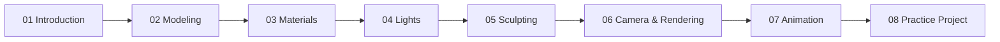

# Complete Blender 2026: From Beginner to Studio-Ready with AI

Khóa học Blender của **Artem Academy**, cập nhật **05/2026**, đi từ nền tảng Blender đến modeling, materials, lighting, sculpting, camera/rendering, animation và một pipeline dự án có AI + Mixamo.

## Thông tin khóa học

| Thuộc tính | Chi tiết |
|---|---|
| Nền tảng | Udemy |
| Giảng viên / đơn vị | Artem Academy |
| Cập nhật | 05/2026 |
| Quy mô | 8 phần • 62 bài • 9 giờ 11 phút |
| Phần mềm trọng tâm | Blender 2026 |
| Trình độ | Beginner → Studio-ready foundation |

## Kết quả đầu ra

Sau khóa học, học viên có thể:

- Điều hướng viewport, quản lý collection, transform và làm việc trong Edit Mode.
- Dựng low-poly, stylized và high-poly model bằng modifier, curve và quy trình topology có kiểm soát.
- Tạo material bằng Principled BSDF, PBR maps, UV, texture paint và procedural nodes.
- Thiết lập lighting theo mục đích kể chuyện, bao gồm gobo, volumetric fog và light rays.
- Sculpt, remesh, mask, dùng Multiresolution và khai thác depth map do AI tạo.
- Bố trí camera, kiểm soát DOF và cấu hình Cycles để render ổn định.
- Tạo keyframe, chỉnh interpolation, animate material và làm quen armature, bones, weights, pose.
- Hoàn thiện pipeline AI 3D model → retopology → UV → bake → rig/Mixamo → NLA → scene → lighting → Cycles.

## Ba dự án chính

1. **Realistic high-poly wristwatch** — luyện hard-surface, topology và modifier.
2. **Stylized house** — luyện modeling từ reference, PBR material và lighting.
3. **Animated character shot** — dùng AI, retopology, UV, bake maps, Mixamo, NLA, fog và Cycles.

## Lộ trình học

## Ưu tiên nếu mục tiêu là rig và animation cá

Học theo thứ tự: **53 Bones and Rigging → 49 Animation Introduction → 50 Interpolation → 52 Animating a Character → 58 Mixamo Rigging & Animation → 61 Mixing Animation in NLA Editor → 38 Volume Light → 48 Cycles Render Settings**.

Phần Animation của khóa học chỉ dài khoảng 29 phút, nên phù hợp để nắm pipeline nền tảng; rig/animation chuyên sâu cho cá vẫn cần một lộ trình riêng về deformation, weight painting, constraint, spline IK và chuyển động theo thân cá.

## Cấu trúc tài liệu

- `CURRICULUM.md` — danh sách đầy đủ 8 phần, 62 bài và thời lượng.
- Mỗi section có `README.md` với mục tiêu, dự án và checklist.
- Mỗi lecture có một file Markdown riêng, đánh số từ `001` đến `062`.
- Ghi chú được biên soạn từ metadata và chủ đề bạn cung cấp; không phải bản chép transcript.

## Giới hạn nguồn

URL `lecture/52231733` hiện chuyển tới trang đăng nhập Udemy. Vì vậy, file ghi chú không khẳng định bài đó tương ứng với lecture nào và không chứa nội dung trích xuất từ video/transcript trả phí. Khi có transcript hoặc file video hợp lệ, có thể bổ sung hướng dẫn thao tác, node, modifier và thông số chính xác.

## Checklist tổng thể

- [ ] Hoàn thành phần 01 và dựng được một model đơn giản trong Edit Mode.
- [ ] Hoàn thành phần 02 và có low-poly chair, stylized house hoặc wristwatch.
- [ ] Xây dựng một material library có PBR và procedural material.
- [ ] Tạo một setup lighting có key/fill/rim hoặc volumetric light.
- [ ] Thực hiện một sculpt nhỏ và thử depth map do AI tạo.
- [ ] Render thử bằng Cycles với GPU, samples và denoise phù hợp.
- [ ] Tạo một animation ngắn và quản lý Action/NLA.
- [ ] Hoàn thành final shot theo pipeline AI → retopology → UV → bake → rig → NLA → render.
