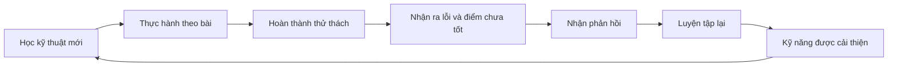
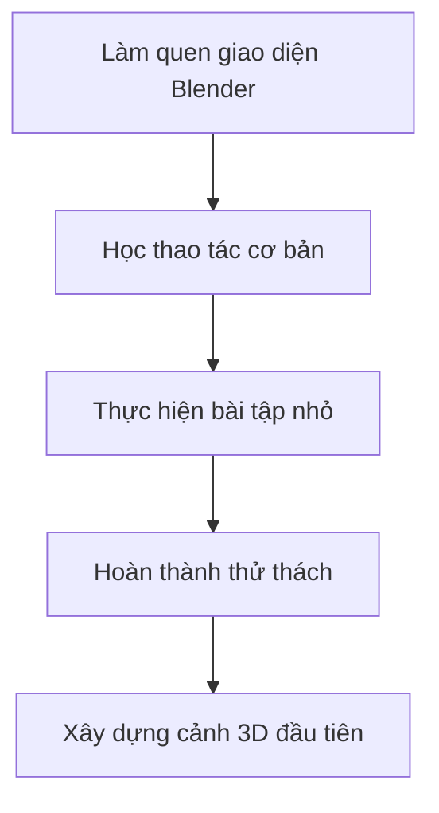
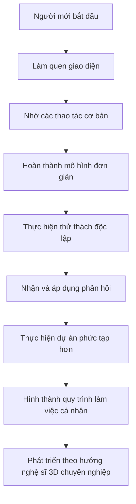

# 002 — Section Intro: Introduction to Blender

| Thuộc tính       | Nội dung                                                              |
| ---------------- | --------------------------------------------------------------------- |
| **Module**       | Module 01 — Introduction & Setup                                      |
| **Bài học**      | Section Intro — Introduction to Blender                               |
| **Giảng viên**   | Grant Abbitt                                                          |
| **Thời lượng**   | 1 phút 48 giây                                                        |
| **Chủ đề chính** | Giới thiệu khóa học, phương pháp học và nội dung của section đầu tiên |

---

## 1. Mục tiêu bài học

Sau bài học này, người học có thể:

* Hiểu đây là một khóa học nhập môn về Blender và nghệ thuật 3D.
* Có kỳ vọng thực tế về thời gian cần thiết để phát triển kỹ năng 3D.
* Hiểu rằng việc mắc lỗi và tạo ra sản phẩm chưa hoàn hảo là một phần bình thường của quá trình học.
* Nắm được cách học hiệu quả: hoàn thành từng section, thực hiện thử thách và luyện tập lặp lại.
* Biết cách sử dụng cộng đồng học tập để đặt câu hỏi, chia sẻ sản phẩm và nhận phản hồi.
* Hiểu nội dung tổng quát của section đầu tiên:

  * Làm quen với giao diện Blender.
  * Thực hiện các thao tác cơ bản.
  * Hoàn thành một số bài tập và thử thách.
  * Xây dựng một cảnh 3D nhỏ.

---

## 2. Giới thiệu giảng viên

Giảng viên của khóa học là **Grant Abbitt**, một giáo viên và nghệ sĩ 3D.

Trong khóa học, giảng viên sẽ hướng dẫn người học từng bước, từ những thao tác Blender cơ bản đến các kỹ thuật tạo sản phẩm 3D hoàn chỉnh hơn.

---

## 3. Kỳ vọng khi học nghệ thuật 3D

Học nghệ thuật 3D là một quá trình dài. Để tạo ra các sản phẩm có chất lượng tương đương với:

* Game AAA.
* Phim điện ảnh.
* Kỹ xảo hình ảnh phức tạp.
* Các cảnh 3D chi tiết và chân thực.

nghệ sĩ có thể phải luyện tập trong nhiều năm.

Ngoài ra, những sản phẩm chuyên nghiệp thường không được tạo ra bởi một người duy nhất. Các trò chơi và bộ phim lớn có thể cần:

* Nhiều nhóm chuyên môn khác nhau.
* Hàng chục hoặc hàng trăm nghệ sĩ.
* Thời gian sản xuất kéo dài nhiều tháng hoặc nhiều năm.

Vì vậy, mặc dù khóa học cung cấp nội dung tương đối chi tiết và hướng đến những sản phẩm thực hành có chất lượng tốt, đây vẫn chỉ là **bước nhập môn vào Blender và nghệ thuật 3D**.

> Không nên kỳ vọng rằng bản thân có thể tạo ra sản phẩm chuyên nghiệp ngay sau những bài học đầu tiên.

---

## 4. Phương pháp học trong khóa học

Cuối mỗi section, giảng viên sẽ cung cấp:

* Hướng dẫn để tiếp tục cải thiện kỹ năng.
* Gợi ý cách mở rộng các kỹ thuật vừa học.
* Một số thử thách thực hành.
* Cơ hội áp dụng kiến thức vào sản phẩm riêng.

Quá trình học có thể được mô tả như sau:

Mục tiêu không phải là tạo ra một sản phẩm hoàn hảo ngay từ lần đầu, mà là hoàn thành từng phần tốt nhất có thể.

Kiến thức từ section hiện tại sẽ chuẩn bị cho người học khi gặp lại kỹ thuật tương tự trong những section tiếp theo.

---

## 5. Tư duy khi gặp khó khăn

Trong quá trình học, người học không nên quá lo lắng khi:

* Không nhớ được một phím tắt.
* Quên vị trí của một nút.
* Thao tác chậm hơn giảng viên.
* Mô hình không giống hoàn toàn với sản phẩm mẫu.
* Kết quả dựng hình chưa đẹp.
* Không thực hiện đúng kỹ thuật ngay từ lần đầu.
* Một số thao tác chưa mang lại kết quả như mong muốn.

Điều quan trọng nhất là:

1. Cố gắng hoàn thành bài học.
2. Thực hiện đầy đủ các bước thực hành.
3. Chấp nhận rằng sản phẩm đầu tiên có thể chưa hoàn hảo.
4. Ghi nhận những lỗi đã gặp.
5. Tiếp tục luyện tập ở những dự án sau.

Mỗi lần lặp lại một kỹ thuật, người học sẽ:

* Ghi nhớ tốt hơn.
* Thao tác nhanh hơn.
* Hiểu rõ quy trình hơn.
* Ít phụ thuộc vào hướng dẫn hơn.
* Dần hình thành phản xạ tự nhiên khi sử dụng Blender.

> Thất bại trong một bài thực hành không có nghĩa là bạn không phù hợp với Blender. Đó là một phần của quá trình xây dựng kỹ năng.

---

## 6. Cộng đồng hỗ trợ

Khóa học có cộng đồng học tập và đội ngũ trợ giảng hỗ trợ người học.

Người học nên tham gia cộng đồng để:

* Đặt câu hỏi khi gặp khó khăn.
* Tìm lời giải cho các lỗi thường gặp.
* Chia sẻ sản phẩm đã hoàn thành.
* Nhận góp ý từ giảng viên, trợ giảng và học viên khác.
* Tham khảo cách làm của những người cùng học.
* Phát triển thêm ý tưởng cho các dự án cá nhân.

Việc chia sẻ sản phẩm và nhận phản hồi có thể giúp người học nhận ra:

* Điểm nào đã làm tốt.
* Phần nào cần được cải thiện.
* Kỹ thuật nào nên luyện tập thêm.
* Cách làm nào có thể hiệu quả hơn.

### Liên kết cộng đồng

* **Kênh YouTube của Grant Abbitt:**
  https://www.youtube.com/c/GrantAbbitt

* **Nhóm Facebook Blender Course:**
  https://www.facebook.com/groups/blendercourse

* **Cộng đồng GameDev.tv – Blender Block Model:**
  https://community.gamedev.tv/tags/c/blender/block-model

---

## 7. Nội dung của section đầu tiên

Section đầu tiên thường là một trong những phần khó nhất đối với người mới vì người học phải tiếp xúc cùng lúc với:

* Giao diện Blender.
* Các vùng làm việc.
* Nhiều nút và bảng điều khiển.
* Phương pháp điều hướng trong không gian 3D.
* Các thao tác chọn và chỉnh sửa đối tượng.
* Những phím tắt hoàn toàn mới.

Giảng viên sẽ hướng dẫn chậm rãi, có hệ thống và thường xuyên nhắc lại các thao tác quan trọng.

### Nội dung chính

Trong section này, người học sẽ:

1. Làm quen với giao diện Blender.
2. Thực hiện một số tác vụ cơ bản.
3. Hoàn thành các thử thách nhỏ.
4. Xây dựng một cảnh 3D đơn giản và thú vị.

---

## 8. Dự án thực hành đầu tiên

Sau khi làm quen với giao diện và các thao tác cơ bản, người học sẽ xây dựng một cảnh 3D nhỏ tương tự cảnh được giảng viên giới thiệu trong video.

Trong video mẫu, camera của cảnh đã được tạo chuyển động. Tuy nhiên, người học chưa cần thực hiện phần animation trong section này.

Phần animation sẽ được hướng dẫn ở những section sau.

Sau khi học animation, người học có thể quay lại dự án đầu tiên để:

* Tạo chuyển động cho camera.
* Điều chỉnh góc quay.
* Thiết lập thời lượng animation.
* Render cảnh thành video.
* So sánh sản phẩm mới với phiên bản ban đầu.

Điều này cho thấy một dự án Blender không nhất thiết phải hoàn thành toàn bộ trong một lần. Người học có thể quay lại dự án cũ và nâng cấp nó khi đã có thêm kỹ năng.

---

## 9. Lộ trình phát triển kỹ năng

Quá trình phát triển kỹ năng Blender có thể được hình dung như sau:

Kỹ năng sẽ không xuất hiện ngay lập tức mà được tích lũy qua:

* Thực hành.
* Lặp lại.
* Sửa lỗi.
* Quan sát.
* Nhận phản hồi.
* Hoàn thành nhiều dự án khác nhau.

---

## 10. Quy trình thực hành gợi ý

Đây là một bài giới thiệu nên chưa có thao tác kỹ thuật bắt buộc. Tuy nhiên, người học có thể chuẩn bị bằng quy trình sau:

### Bước 1: Xác định kỳ vọng

Hiểu rằng đây là khóa học nhập môn và sản phẩm ban đầu chưa cần đạt chất lượng chuyên nghiệp.

### Bước 2: Chuẩn bị môi trường học

* Chuẩn bị máy tính có thể chạy Blender.
* Sử dụng chuột có nút giữa nếu có thể.
* Tạo thư mục riêng để lưu các dự án.
* Chuẩn bị nơi ghi chú phím tắt và lỗi thường gặp.

### Bước 3: Tham gia cộng đồng

Tham gia nhóm học tập để có nơi đặt câu hỏi và chia sẻ kết quả.

### Bước 4: Quan sát giao diện Blender

Sau khi cài đặt Blender, mở phần mềm và quan sát sơ bộ:

* Khu vực hiển thị 3D.
* Thanh công cụ.
* Outliner.
* Properties Editor.
* Timeline.
* Các Workspace ở phía trên giao diện.

Ở giai đoạn này, người học chưa cần hiểu toàn bộ chức năng của từng khu vực.

### Bước 5: Duy trì thói quen thực hành

Sau mỗi bài học:

* Thực hiện lại thao tác mà không xem video.
* Lưu một phiên bản riêng của dự án.
* Ghi lại phím tắt mới.
* Ghi lại lỗi đã gặp.
* Chia sẻ sản phẩm để nhận phản hồi.

---

## 11. Phím tắt và công cụ liên quan

Bài học chưa giới thiệu phím tắt hoặc công cụ Blender cụ thể.

Người học không cần cố gắng ghi nhớ toàn bộ phím tắt ngay từ đầu. Các phím tắt sẽ được giới thiệu và lặp lại trong từng bài học thực hành.

---

## 12. Lưu ý quan trọng

### 12.1. Không so sánh sản phẩm đầu tiên với sản phẩm chuyên nghiệp

Các sản phẩm game và điện ảnh có thể được tạo ra bởi đội ngũ lớn trong thời gian dài. Vì vậy, sự khác biệt về chất lượng là hoàn toàn bình thường.

### 12.2. Không cần ghi nhớ mọi thứ ngay lập tức

Blender có nhiều:

* Công cụ.
* Menu.
* Bảng điều khiển.
* Chế độ chỉnh sửa.
* Phím tắt.
* Quy trình làm việc.

Việc ghi nhớ sẽ diễn ra tự nhiên thông qua quá trình sử dụng lặp lại.

### 12.3. Không bỏ qua bài tập và thử thách

Chỉ xem video sẽ không đủ để phát triển kỹ năng. Người học cần trực tiếp thao tác trong Blender.

### 12.4. Không quá phụ thuộc vào sản phẩm mẫu

Sản phẩm của người học không cần giống hoàn toàn với sản phẩm của giảng viên. Một số khác biệt có thể trở thành ý tưởng sáng tạo riêng.

### 12.5. Nên hoàn thành section trước khi đánh giá bản thân

Section đầu tiên có thể gây khó khăn vì có nhiều kiến thức mới. Người học nên hoàn thành toàn bộ section trước khi kết luận rằng Blender quá khó.

---

## 13. Lỗi thường gặp của người mới

| Lỗi                                  | Nguyên nhân                                       | Cách khắc phục                                                  |
| ------------------------------------ | ------------------------------------------------- | --------------------------------------------------------------- |
| Cố ghi nhớ toàn bộ phím tắt          | Tiếp nhận quá nhiều thông tin cùng lúc            | Chỉ ghi nhớ các phím đang được sử dụng trong bài                |
| Dừng học khi sản phẩm chưa đẹp       | Kỳ vọng kết quả chuyên nghiệp quá sớm             | Tập trung hoàn thành quy trình thay vì sản phẩm hoàn hảo        |
| Chỉ xem video mà không thực hành     | Có cảm giác đã hiểu nhưng chưa hình thành kỹ năng | Mở Blender và thực hiện song song với bài giảng                 |
| Ngại đặt câu hỏi                     | Sợ câu hỏi quá cơ bản                             | Sử dụng cộng đồng và đội ngũ trợ giảng                          |
| Không chia sẻ sản phẩm               | Lo ngại sản phẩm chưa đủ tốt                      | Chia sẻ để nhận phản hồi và cải thiện                           |
| Bỏ qua thử thách cuối section        | Chưa tự tin làm việc độc lập                      | Thử hoàn thành trước, sau đó mới xem lại hướng dẫn              |
| So sánh bản thân với nghệ sĩ lâu năm | Không tính đến thời gian luyện tập khác nhau      | So sánh sản phẩm hiện tại với sản phẩm trước đây của chính mình |

---

## 14. Checklist sau bài học

### Nhận thức

* [ ] Tôi hiểu đây là một khóa học nhập môn về Blender và nghệ thuật 3D.
* [ ] Tôi hiểu kỹ năng 3D cần nhiều thời gian để phát triển.
* [ ] Tôi không kỳ vọng sản phẩm đầu tiên đạt chất lượng chuyên nghiệp.
* [ ] Tôi chấp nhận việc mắc lỗi trong quá trình học.

### Phương pháp học

* [ ] Tôi sẽ cố gắng hoàn thành từng section.
* [ ] Tôi sẽ thực hiện các bài tập và thử thách.
* [ ] Tôi sẽ luyện tập lại các kỹ thuật đã học.
* [ ] Tôi sẽ ghi lại những lỗi thường gặp.
* [ ] Tôi sẽ quay lại nâng cấp các dự án cũ khi có thêm kỹ năng.

### Cộng đồng

* [ ] Tôi đã biết nơi đặt câu hỏi khi gặp khó khăn.
* [ ] Tôi sẵn sàng chia sẻ sản phẩm để nhận phản hồi.
* [ ] Tôi đã lưu các liên kết cộng đồng cần thiết.

### Chuẩn bị cho bài tiếp theo

* [ ] Tôi đã sẵn sàng làm quen với giao diện Blender.
* [ ] Tôi đã chuẩn bị thư mục lưu dự án.
* [ ] Tôi hiểu rằng chưa cần nhớ toàn bộ nút và phím tắt.

---

## 15. Tóm tắt bài học

Bài học mở đầu giới thiệu giảng viên Grant Abbitt và định hướng chung của khóa học Blender.

Học nghệ thuật 3D là một quá trình lâu dài. Những sản phẩm chất lượng cao trong game AAA hoặc điện ảnh thường được thực hiện bởi nhiều nhóm chuyên môn trong thời gian dài. Vì vậy, khóa học này cần được xem là bước khởi đầu để xây dựng nền tảng Blender.

Người học không nên lo lắng khi chưa nhớ được các nút, phím tắt hoặc khi mô hình chưa giống sản phẩm mẫu. Mục tiêu quan trọng nhất là hoàn thành từng section, thực hiện các thử thách và tiếp tục luyện tập.

Trong section đầu tiên, người học sẽ làm quen với giao diện Blender, thực hiện các thao tác cơ bản và xây dựng một cảnh 3D nhỏ. Những kỹ năng nâng cao hơn, chẳng hạn như animation camera, sẽ được học trong các phần sau và có thể được áp dụng để nâng cấp dự án đầu tiên.

---

## 16. Ghi nhớ nhanh

> **Không cần hoàn hảo ngay từ đầu. Hãy hoàn thành bài học, luyện tập thường xuyên, nhận phản hồi và cải thiện qua từng dự án.**

---

# Bài luyện tập

## Mục tiêu

## Đề bài

## Yêu cầu hoàn thành

- [ ] 
- [ ] 
- [ ] 

## Kết quả / lời giải

## Ghi chú
