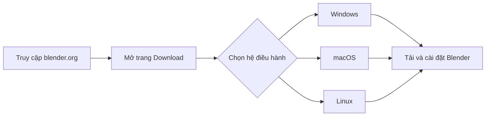
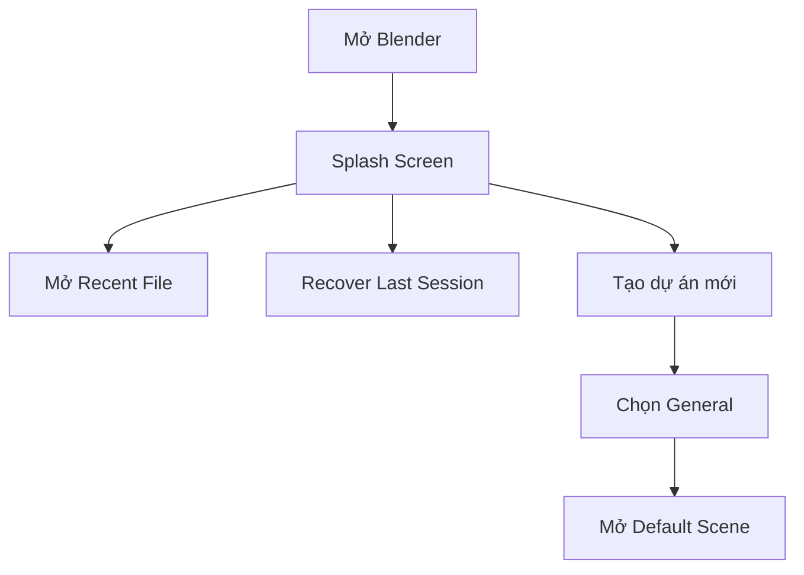
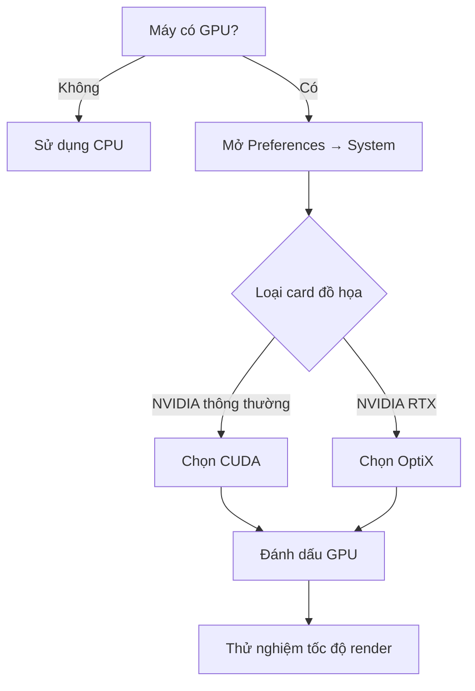

# 003 — Downloading Blender

| Thuộc tính              | Nội dung                                        |
| ----------------------- | ----------------------------------------------- |
| **Module**              | Module 01 — Introduction & Setup                |
| **Bài học**             | Downloading Blender                             |
| **Thời lượng**          | 3 phút 51 giây                                  |
| **Phiên bản trong bài** | Blender 4.4.3                                   |
| **Chủ đề chính**        | Tải xuống, cài đặt và thiết lập Blender lần đầu |

---

## 1. Mục tiêu bài học

Sau bài học này, người học có thể:

* Truy cập đúng trang web chính thức để tải Blender.
* Chọn phiên bản Blender phù hợp với hệ điều hành.
* Phân biệt phiên bản ổn định với phiên bản thử nghiệm.
* Cài đặt và khởi động Blender lần đầu.
* Mở một tệp gần đây hoặc tạo dự án mới bằng mẫu **General**.
* Điều chỉnh kích thước giao diện khi cần.
* Kích hoạt GPU để tăng tốc quá trình render.
* Biết cách bật **OptiX** khi sử dụng card đồ họa NVIDIA RTX.
* Kiểm tra phiên bản Blender đang sử dụng.
* Hiểu tầm quan trọng của việc lưu dự án thường xuyên.

---

## 2. Tải Blender từ trang chính thức

Blender có thể được tải xuống từ trang web chính thức:

https://www.blender.org/

Tại trang tải xuống, Blender thường tự đề xuất phiên bản phù hợp với hệ điều hành đang sử dụng.

Trong bài giảng, giảng viên sử dụng:

* **Blender 4.4**
* Phiên bản cụ thể: **Blender 4.4.3**
* Hệ điều hành minh họa: **Windows**

Trên trang Download, nút lớn **Download Blender** sẽ tải trình cài đặt dành cho Windows.

Người dùng macOS hoặc Linux có thể chọn phiên bản tương ứng ngay trên trang tải xuống.



---

## 3. Phiên bản Blender trong khóa học

Khóa học cố gắng cập nhật nội dung theo những phiên bản Blender mới.

Khi Blender có những thay đổi lớn, đội ngũ khóa học có thể:

* Quay lại toàn bộ một section.
* Thay thế các video cũ bằng phiên bản mới.
* Chèn thêm những video cập nhật ngắn.
* Điều chỉnh một số bài học nếu thay đổi không quá lớn.

Vì vậy, người học có thể gặp:

* Một số bài được quay bằng phiên bản Blender cũ hơn.
* Một số bài được quay bằng phiên bản mới hơn Blender 4.4.3.
* Một vài khác biệt nhỏ về giao diện hoặc vị trí công cụ.

Những khác biệt này là bình thường và không nhất thiết ảnh hưởng đến nội dung chính của bài học.

---

## 4. Phiên bản thử nghiệm

Khi kéo xuống phía dưới trang tải Blender, người dùng có thể thấy tùy chọn:

**Go Experimental**

Khu vực này cung cấp các phiên bản Blender đang trong quá trình phát triển, chẳng hạn như phiên bản alpha của Blender 4.5 tại thời điểm bài giảng được quay.

### Đặc điểm của phiên bản thử nghiệm

* Cho phép trải nghiệm sớm những tính năng mới.
* Có thể chứa nhiều lỗi chưa được khắc phục.
* Có nguy cơ gặp hiện tượng treo hoặc đóng ứng dụng.
* Chưa phù hợp với người mới bắt đầu.
* Không nên sử dụng cho những dự án quan trọng.

> Người mới nên sử dụng phiên bản Blender ổn định trên trang Download chính thay vì các bản alpha hoặc experimental.

| Loại phiên bản         | Đặc điểm                          | Khuyến nghị                     |
| ---------------------- | --------------------------------- | ------------------------------- |
| **Stable**             | Ổn định hơn, ít lỗi hơn           | Nên dùng để học                 |
| **Experimental/Alpha** | Có tính năng mới nhưng dễ gặp lỗi | Không khuyến nghị cho người mới |

---

## 5. Cài đặt Blender

Sau khi nhấn **Download Blender**, trình duyệt sẽ tải về một tệp cài đặt.

Quy trình tổng quát:

1. Truy cập trang Blender.
2. Mở khu vực Download.
3. Tải phiên bản phù hợp với hệ điều hành.
4. Mở tệp vừa tải.
5. Thực hiện quá trình cài đặt.
6. Khởi động Blender.

Khi mở Blender lần đầu, chương trình có thể hiển thị màn hình yêu cầu lựa chọn một số thiết lập ban đầu.

Theo hướng dẫn của giảng viên, người mới có thể giữ nguyên các thiết lập mặc định.

> Các tùy chọn mặc định là đủ để bắt đầu khóa học.

---

## 6. Màn hình khởi động Blender

Khi Blender được mở, một màn hình chào hoặc **Splash Screen** sẽ xuất hiện.

Màn hình này cung cấp các lựa chọn chính:

* Mở tệp Blender đã lưu gần đây.
* Khôi phục phiên làm việc trước.
* Mở một tệp có sẵn.
* Tạo một dự án Blender mới.

### 6.1. Recent Files

Khu vực **Recent Files** hiển thị những dự án đã được mở hoặc lưu gần đây.

Người học có thể chọn trực tiếp một tệp trong danh sách để tiếp tục làm việc.

### 6.2. Recover Last Session

Ở phía dưới màn hình có tùy chọn:

**Recover Last Session**

Tính năng này có thể giúp khôi phục phiên làm việc nếu Blender bị đóng bất ngờ.

Tuy nhiên, Blender không phải lúc nào cũng có thể khôi phục đầy đủ dự án.

> Không nên phụ thuộc hoàn toàn vào Recover Last Session. Hãy lưu dự án thường xuyên trong quá trình làm việc.

### 6.3. Tạo dự án mới

Người học có thể tạo một dự án mới từ các mẫu được Blender cung cấp.

Trong khóa học, mẫu được sử dụng chủ yếu là:

**General**

Mẫu General mở cảnh mặc định của Blender.



---

## 7. Cảnh mặc định

Sau khi chọn **General**, Blender mở cảnh mặc định.

Cảnh này thường chứa ba đối tượng:

* Một khối lập phương.
* Một camera.
* Một nguồn sáng.

Đây là điểm bắt đầu cho hầu hết các bài thực hành đầu tiên trong khóa học.

---

## 8. Điều chỉnh kích thước giao diện

Giao diện trong video của giảng viên có thể trông lớn hơn giao diện mặc định trên máy của người học.

Nguyên nhân là giảng viên đã tăng giá trị **Resolution Scale** để chữ và các nút dễ nhìn hơn trong video.

Đường dẫn:

```text
Edit → Preferences → Interface → Resolution Scale
```

Giá trị được giảng viên sử dụng:

```text
1.35
```

Khi tăng Resolution Scale:

* Chữ trên giao diện trở nên lớn hơn.
* Các biểu tượng và nút điều khiển lớn hơn.
* Nội dung dễ quan sát hơn trên màn hình có độ phân giải cao.

Khi giảm Resolution Scale:

* Chữ và các thành phần giao diện nhỏ hơn.
* Có nhiều không gian làm việc hơn.

Người học không bắt buộc phải đặt giá trị giống giảng viên. Có thể giữ giá trị mặc định hoặc điều chỉnh theo kích thước màn hình và khả năng quan sát.

---

## 9. Kích hoạt GPU để render

Nếu máy tính có card đồ họa, Blender có thể sử dụng GPU để tăng tốc quá trình render.

Đường dẫn thiết lập:

```text
Edit → Preferences → System
```

Trong phần thiết bị render, người dùng có thể thấy những lựa chọn khác nhau tùy theo phần cứng.

Ví dụ với card đồ họa NVIDIA:

* CUDA
* OptiX

### 9.1. CUDA

Nếu máy sử dụng card đồ họa NVIDIA được hỗ trợ, người dùng có thể:

1. Chọn tab hoặc tùy chọn **CUDA**.
2. Đánh dấu card đồ họa muốn sử dụng.
3. Đóng cửa sổ Preferences sau khi hoàn tất.

Blender sau đó có thể dùng GPU để xử lý render.

Trong nhiều trường hợp, GPU render nhanh hơn CPU render.

Tuy nhiên, hiệu năng còn phụ thuộc vào:

* Đời card đồ họa.
* Bộ xử lý CPU.
* Dung lượng bộ nhớ của card.
* Độ phức tạp của cảnh.
* Cài đặt render.

Nếu sử dụng một card đồ họa cũ, CPU đôi khi có thể đạt hiệu quả tốt hơn. Người dùng nên thử nghiệm cả hai khi học đến phần rendering.

### 9.2. OptiX dành cho NVIDIA RTX

Giảng viên khuyến nghị các dòng card đồ họa **NVIDIA RTX** vì chúng hỗ trợ **OptiX**.

Nếu có card RTX:

1. Mở `Edit → Preferences`.
2. Chọn `System`.
3. Chọn `OptiX`.
4. Đánh dấu card NVIDIA RTX.
5. Đóng Preferences.

Trong bài giảng, giảng viên sử dụng:

```text
NVIDIA GeForce RTX 4090
```

OptiX có thể giúp:

* Tăng tốc quá trình render.
* Tận dụng phần cứng chuyên dụng trên card RTX.
* Hỗ trợ các kỹ thuật khử nhiễu bằng trí tuệ nhân tạo.
* Giảm thời gian xử lý hình ảnh.



---

## 10. Lưu tự động các thiết lập Preferences

Trong cửa sổ Preferences có biểu tượng menu ba đường kẻ.

Tại đây, người dùng có thể kiểm tra tùy chọn:

**Auto-Save Preferences**

Tùy chọn này thường được bật mặc định.

Khi Auto-Save Preferences được bật:

* Những thay đổi trong Preferences được lưu tự động.
* Người dùng không cần nhấn nút Save riêng.
* Có thể đóng cửa sổ Preferences sau khi thay đổi thiết lập.
* Các thiết lập sẽ tiếp tục được sử dụng trong lần mở Blender tiếp theo.

Ví dụ, những thay đổi sau có thể được lưu:

* Resolution Scale.
* Thiết bị render.
* Chủ đề giao diện.
* Thiết lập nhập liệu.
* Một số tùy chọn hệ thống khác.

---

## 11. Kiểm tra phiên bản Blender

Nếu không chắc mình đang dùng phiên bản Blender nào, người dùng có thể kiểm tra thông tin phiên bản ở góc dưới của giao diện hoặc trên Splash Screen, tùy theo cách hiển thị của phiên bản Blender.

Thông tin này thường có dạng:

```text
Blender 4.4.3
```

Việc biết chính xác phiên bản đang sử dụng rất hữu ích khi:

* So sánh giao diện với video.
* Tìm tài liệu hướng dẫn.
* Báo lỗi cho cộng đồng.
* Kiểm tra khả năng tương thích của add-on.
* Xác định nguyên nhân một công cụ hoạt động khác bài giảng.

---

## 12. Quy trình thực hành

### Bước 1: Truy cập trang Blender

Mở:

https://www.blender.org/

### Bước 2: Mở trang Download

Nhấn nút hoặc menu **Download**.

### Bước 3: Chọn phiên bản ổn định

Tải phiên bản dành cho hệ điều hành đang sử dụng.

Không chọn bản Experimental hoặc Alpha khi mới bắt đầu.

### Bước 4: Cài đặt Blender

Mở tệp vừa tải và hoàn thành quá trình cài đặt.

### Bước 5: Khởi động Blender

Khi Blender hỏi về thiết lập ban đầu, giữ nguyên các giá trị mặc định.

### Bước 6: Tạo dự án mới

Trên Splash Screen, chọn:

```text
New File → General
```

### Bước 7: Điều chỉnh giao diện nếu cần

Mở:

```text
Edit → Preferences → Interface
```

Điều chỉnh **Resolution Scale** nếu chữ quá nhỏ hoặc quá lớn.

### Bước 8: Kích hoạt card đồ họa

Mở:

```text
Edit → Preferences → System
```

* Chọn CUDA nếu sử dụng GPU NVIDIA phù hợp.
* Chọn OptiX nếu sử dụng card NVIDIA RTX.
* Đánh dấu card đồ họa muốn dùng.

### Bước 9: Kiểm tra Auto-Save Preferences

Xác nhận **Auto-Save Preferences** đang được bật.

### Bước 10: Kiểm tra phiên bản

Quan sát thông tin phiên bản Blender trên giao diện.

---

## 13. Phím tắt và công cụ liên quan

Bài học chủ yếu tập trung vào quá trình tải xuống và thiết lập Blender, chưa yêu cầu sử dụng nhiều phím tắt.

Một số thao tác lưu tệp hữu ích:

| Thao tác          | Phím tắt             |
| ----------------- | -------------------- |
| Lưu tệp hiện tại  | `Ctrl + S`           |
| Lưu thành tệp mới | `Ctrl + Shift + S`   |
| Mở tệp Blender    | `Ctrl + O`           |
| Tạo tệp mới       | `Ctrl + N`           |
| Mở Preferences    | `Edit → Preferences` |

> Trong bài giảng, giảng viên đặc biệt nhấn mạnh việc lưu dự án thường xuyên vì tính năng Recover Last Session không phải lúc nào cũng khôi phục được toàn bộ dữ liệu.

---

## 14. Lưu ý quan trọng

### 14.1. Nên dùng phiên bản ổn định

Các phiên bản Experimental hoặc Alpha có thể gặp lỗi và đóng ứng dụng bất ngờ.

Người mới nên sử dụng phiên bản ổn định được hiển thị trên trang Download chính.

### 14.2. Giao diện có thể khác video

Một số bài học trong khóa học có thể được quay bằng những phiên bản Blender khác nhau.

Các khác biệt nhỏ về:

* Màu sắc.
* Biểu tượng.
* Vị trí nút.
* Tên menu.
* Bố cục Preferences.

là điều bình thường.

### 14.3. Không bắt buộc phải thay đổi Resolution Scale

Giảng viên đặt Resolution Scale thành 1.35 để nội dung dễ nhìn trong video. Người học có thể giữ nguyên giá trị mặc định.

### 14.4. Không phải máy nào cũng có OptiX

OptiX chỉ xuất hiện khi Blender nhận diện được phần cứng NVIDIA tương thích, đặc biệt là dòng RTX.

Nếu không thấy OptiX, người học vẫn có thể:

* Sử dụng CUDA nếu được hỗ trợ.
* Render bằng CPU.
* Tiếp tục học modeling bình thường.

### 14.5. Hãy lưu dự án thường xuyên

Recover Last Session chỉ là biện pháp khôi phục dự phòng và không bảo đảm lấy lại được toàn bộ công việc.

---

## 15. Lỗi thường gặp

| Lỗi                               | Nguyên nhân có thể                         | Cách xử lý                                  |
| --------------------------------- | ------------------------------------------ | ------------------------------------------- |
| Tải nhầm phiên bản Alpha          | Chọn mục Go Experimental                   | Quay lại trang Download và tải bản ổn định  |
| Giao diện khác video              | Khác phiên bản hoặc Resolution Scale       | Kiểm tra phiên bản và thiết lập Interface   |
| Chữ trên giao diện quá nhỏ        | Màn hình có độ phân giải cao               | Tăng Resolution Scale trong Preferences     |
| Không thấy OptiX                  | Không có card RTX hoặc driver chưa phù hợp | Dùng CUDA hoặc CPU                          |
| Không thấy card đồ họa            | Blender chưa nhận diện GPU                 | Kiểm tra driver và khởi động lại Blender    |
| Blender render bằng CPU           | Chưa chọn GPU trong Preferences            | Mở System và đánh dấu thiết bị              |
| Mất dự án sau khi Blender bị đóng | Chưa lưu tệp thường xuyên                  | Sử dụng `Ctrl + S` trong quá trình làm việc |
| Thiết lập Preferences bị mất      | Auto-Save Preferences bị tắt               | Bật Auto-Save Preferences                   |

---

## 16. Checklist thực hành

### Tải và cài đặt

* [ ] Đã truy cập trang web chính thức của Blender.
* [ ] Đã mở trang Download.
* [ ] Đã chọn phiên bản ổn định.
* [ ] Đã tải phiên bản phù hợp với hệ điều hành.
* [ ] Đã cài đặt Blender thành công.
* [ ] Đã mở được Blender.

### Khởi tạo dự án

* [ ] Đã quan sát khu vực Recent Files.
* [ ] Đã xác định được tùy chọn Recover Last Session.
* [ ] Đã chọn `New File → General`.
* [ ] Đã mở được cảnh mặc định.

### Thiết lập giao diện

* [ ] Đã mở `Edit → Preferences`.
* [ ] Đã tìm thấy phần Interface.
* [ ] Đã kiểm tra Resolution Scale.
* [ ] Đã điều chỉnh kích thước giao diện nếu cần.

### Thiết lập GPU

* [ ] Đã mở `Preferences → System`.
* [ ] Đã kiểm tra các thiết bị render được hỗ trợ.
* [ ] Đã bật CUDA nếu có GPU NVIDIA phù hợp.
* [ ] Đã bật OptiX nếu có card NVIDIA RTX.
* [ ] Đã đánh dấu đúng card đồ họa.

### Lưu thiết lập và dự án

* [ ] Đã kiểm tra Auto-Save Preferences.
* [ ] Đã xác định được phiên bản Blender đang sử dụng.
* [ ] Đã lưu thử một tệp Blender bằng `Ctrl + S`.
* [ ] Đã hiểu rằng cần lưu dự án thường xuyên.

---

## 17. Tóm tắt bài học

Blender được tải từ trang web chính thức tại **blender.org**. Trong bài giảng, giảng viên sử dụng Blender 4.4.3 trên Windows, nhưng khóa học có thể bao gồm các bài được quay bằng những phiên bản Blender khác.

Người mới nên tải phiên bản ổn định và tránh các bản Experimental hoặc Alpha vì chúng có thể chứa lỗi và dễ bị đóng đột ngột.

Sau khi cài đặt, người học mở Blender, giữ nguyên các thiết lập mặc định và chọn mẫu **General** để bắt đầu với cảnh mặc định.

Trong Preferences, người học có thể điều chỉnh **Resolution Scale** để thay đổi kích thước chữ và các thành phần giao diện. Nếu có card đồ họa, có thể kích hoạt GPU trong phần **System**. Người dùng card NVIDIA RTX nên chọn **OptiX** để tăng tốc render và sử dụng khả năng khử nhiễu bằng AI.

Các thay đổi trong Preferences thường được lưu tự động khi **Auto-Save Preferences** được bật. Cuối cùng, người học cần kiểm tra phiên bản Blender và hình thành thói quen lưu dự án thường xuyên.

---

## 18. Ghi nhớ nhanh

> **Tải bản Blender ổn định từ blender.org, chọn General để bắt đầu, kích hoạt GPU nếu có và luôn lưu dự án thường xuyên.**

---

# Bài luyện tập

## Mục tiêu


## Đề bài


## Yêu cầu hoàn thành

- [ ] 
- [ ] 
- [ ] 

## Kết quả / lời giải


## Ghi chú
