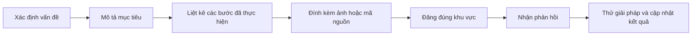
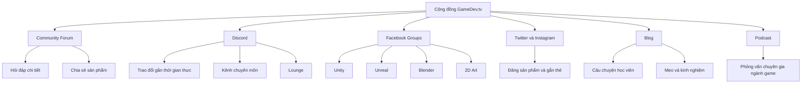

# 004 — Community & Support

| Thuộc tính           | Nội dung                                                      |
| -------------------- | ------------------------------------------------------------- |
| **Module**           | Module 01 — Introduction & Setup                              |
| **Bài học**          | Community & Support                                           |
| **Người giới thiệu** | Lucy — Head of Community tại GameDev.tv                       |
| **Thời lượng**       | 1 phút 32 giây                                                |
| **Chủ đề chính**     | Các kênh cộng đồng, hỗ trợ và chia sẻ sản phẩm của GameDev.tv |

---

## 1. Mục tiêu bài học

Sau bài học này, người học có thể:

* Biết các kênh cộng đồng của GameDev.tv.
* Xác định nơi phù hợp để đặt câu hỏi về khóa học.
* Biết cách chia sẻ sản phẩm và tiến độ học tập.
* Hiểu cách cung cấp đầy đủ thông tin khi yêu cầu hỗ trợ.
* Biết nơi trò chuyện trực tiếp với những học viên khác.
* Khám phá thêm nội dung về ngành phát triển game thông qua blog và podcast.

---

## 2. Giới thiệu cộng đồng GameDev.tv

Lucy, người phụ trách cộng đồng của GameDev.tv, giới thiệu các địa điểm mà học viên có thể sử dụng để:

* Đặt câu hỏi.
* Chia sẻ sản phẩm.
* Nhận hỗ trợ từ đội ngũ giảng dạy.
* Trao đổi với những người học khác.
* Thảo luận về phát triển game.
* Theo dõi câu chuyện và kinh nghiệm của các học viên khác.

Các liên kết cụ thể sẽ được cung cấp trong bài học tiếp theo, vì vậy người học chưa cần ghi lại toàn bộ thông tin ngay trong bài này.

---

## 3. Diễn đàn cộng đồng GameDev.tv

**GameDev.tv Community Forum** là một trong những kênh hỗ trợ chính dành cho học viên.

Người học có thể sử dụng diễn đàn để:

* Đặt câu hỏi liên quan đến bài học.
* Chia sẻ sản phẩm đang thực hiện.
* Đăng kết quả của các thử thách.
* Nhận góp ý từ những học viên khác.
* Nhận hỗ trợ từ đội ngũ trợ giảng.
* Theo dõi cách những học viên khác giải quyết vấn đề.

Đây là nơi phù hợp khi câu hỏi cần:

* Mô tả dài.
* Hình ảnh minh họa.
* Đoạn mã nguồn.
* Nhiều bước giải thích.
* Thảo luận qua nhiều phản hồi.

---

## 4. Cách đặt câu hỏi hiệu quả

Khi đăng câu hỏi, người học nên cung cấp càng nhiều thông tin liên quan càng tốt.

Đối với các vấn đề lập trình, cần đính kèm đoạn mã có liên quan. Đối với Blender, nên bổ sung ảnh chụp màn hình và mô tả rõ thao tác đã thực hiện.

Một câu hỏi tốt nên bao gồm:

* Bài học hoặc section đang thực hiện.
* Mục tiêu muốn đạt được.
* Các bước đã làm.
* Kết quả mong đợi.
* Kết quả thực tế.
* Thông báo lỗi nếu có.
* Phiên bản phần mềm đang sử dụng.
* Ảnh chụp toàn bộ giao diện.
* Tệp hoặc đoạn mã liên quan nếu cần.

### Quy trình đặt câu hỏi



Thông tin đầy đủ giúp đội ngũ trợ giảng:

* Hiểu vấn đề nhanh hơn.
* Tái hiện đúng lỗi.
* Tránh phải hỏi lại nhiều lần.
* Đưa ra giải pháp chính xác hơn.

> Không nên chỉ viết “Blender của tôi không hoạt động” mà không cung cấp thêm ngữ cảnh.

---

## 5. Máy chủ Discord

GameDev.tv có một máy chủ Discord hoạt động tích cực, phù hợp với những cuộc trò chuyện gần thời gian thực.

Trên Discord, người học có thể:

* Đặt câu hỏi trong kênh phù hợp.
* Trao đổi nhanh với những học viên khác.
* Thảo luận về các công cụ phát triển game.
* Chia sẻ tiến độ học tập.
* Nhận phản hồi không chính thức.
* Tham gia các cuộc trò chuyện chung.

### Kênh chuyên môn

Các câu hỏi cụ thể nên được đăng trong đúng kênh liên quan đến chủ đề.

Ví dụ:

* Blender.
* Unity.
* Unreal Engine.
* Lập trình.
* Nghệ thuật 2D.
* Phát triển game nói chung.

### Lounge

Khu vực **Lounge** được sử dụng cho những cuộc trò chuyện tổng quát hơn về:

* Game development.
* Quá trình học.
* Dự án cá nhân.
* Kinh nghiệm làm game.
* Những chủ đề không thuộc một công cụ cụ thể.

| Nhu cầu                              | Kênh phù hợp           |
| ------------------------------------ | ---------------------- |
| Câu hỏi cần mô tả chi tiết           | Community Forum        |
| Trò chuyện nhanh                     | Discord                |
| Câu hỏi về công cụ cụ thể            | Kênh Discord tương ứng |
| Trò chuyện chung về game development | Lounge                 |

---

## 6. Các nhóm Facebook

GameDev.tv có nhiều cộng đồng hoạt động trên Facebook.

Các nhóm được tổ chức theo từng lĩnh vực, bao gồm:

* Unity.
* Unreal Engine.
* Blender.
* Nghệ thuật 2D.

Người học có thể sử dụng các nhóm Facebook để:

* Chia sẻ tiến độ học tập.
* Đăng sản phẩm đã hoàn thành.
* Đặt câu hỏi.
* Xem sản phẩm của học viên khác.
* Nhận lời khuyên và sự động viên.
* Trao đổi kinh nghiệm thực hành.

Đối với khóa học Blender, người học nên tham gia nhóm Blender để câu hỏi tiếp cận đúng những người có kinh nghiệm liên quan.

---

## 7. Chia sẻ sản phẩm trên mạng xã hội

Nếu chia sẻ sản phẩm trên Twitter hoặc Instagram, người học được khuyến khích gắn thẻ GameDev.tv.

Đội ngũ GameDev.tv rất quan tâm đến những sản phẩm được học viên tạo ra.

Có thể chia sẻ:

* Mô hình 3D.
* Hình ảnh render.
* Animation.
* Sản phẩm từ thử thách cuối section.
* So sánh phiên bản trước và sau khi chỉnh sửa.
* Tiến độ của một dự án đang thực hiện.

Việc chia sẻ sản phẩm có thể giúp người học:

* Tạo động lực tiếp tục học.
* Ghi lại quá trình phát triển kỹ năng.
* Nhận phản hồi từ cộng đồng.
* Xây dựng hồ sơ sản phẩm cá nhân.
* Kết nối với những người có cùng sở thích.

---

## 8. Blog GameDev.tv

Blog của GameDev.tv cung cấp thêm nội dung về:

* Hành trình của những học viên khác.
* Kinh nghiệm học phát triển game.
* Mẹo và hướng dẫn thực hành.
* Câu chuyện nghề nghiệp.
* Những bài học từ người làm trong ngành.

Việc đọc câu chuyện của các học viên khác có thể giúp người mới hiểu rằng:

* Mỗi người có tốc độ học khác nhau.
* Khó khăn trong quá trình học là điều bình thường.
* Kỹ năng được xây dựng thông qua nhiều dự án.
* Có nhiều con đường khác nhau để bước vào ngành game.

---

## 9. Podcast hằng tuần

GameDev.tv còn có một chương trình podcast được phát hành hằng tuần.

Podcast bao gồm các cuộc phỏng vấn với chuyên gia thuộc nhiều lĩnh vực trong ngành game.

Các chủ đề có thể liên quan đến:

* Lập trình game.
* Thiết kế game.
* Nghệ thuật 2D và 3D.
* Animation.
* Sản xuất game.
* Quản lý dự án.
* Nghề nghiệp trong ngành game.
* Kinh nghiệm phát triển và phát hành sản phẩm.

Podcast là nguồn bổ sung hữu ích để người học:

* Hiểu thêm về ngành công nghiệp game.
* Biết vai trò của từng vị trí trong một nhóm phát triển.
* Học kinh nghiệm từ những người đang làm việc trong ngành.
* Mở rộng góc nhìn ngoài nội dung kỹ thuật của khóa học.

---

## 10. Hệ thống hỗ trợ của GameDev.tv

Các kênh cộng đồng có thể được phân loại như sau:



---

## 11. Quy trình tìm kiếm hỗ trợ

Khi gặp khó khăn trong khóa học, người học có thể làm theo quy trình sau:

### Bước 1: Kiểm tra lại bài giảng

* Xem lại đoạn video liên quan.
* So sánh từng thao tác với hướng dẫn.
* Kiểm tra xem có bỏ qua bước nào không.

### Bước 2: Xác định vấn đề

Viết rõ:

* Bạn đang cố làm gì?
* Vấn đề xuất hiện ở bước nào?
* Kết quả nào khác với bài giảng?

### Bước 3: Thu thập thông tin

Chuẩn bị:

* Tên khóa học.
* Tên section và bài học.
* Phiên bản Blender.
* Ảnh chụp giao diện.
* Thông báo lỗi.
* Tệp dự án nếu phù hợp.

### Bước 4: Chọn kênh hỗ trợ

| Trường hợp                   | Kênh đề xuất           |
| ---------------------------- | ---------------------- |
| Lỗi phức tạp, cần nhiều ảnh  | Community Forum        |
| Cần trao đổi nhanh           | Discord                |
| Muốn chia sẻ tiến độ         | Facebook hoặc Forum    |
| Muốn đăng sản phẩm công khai | Twitter hoặc Instagram |
| Muốn tìm kinh nghiệm học tập | Blog                   |
| Muốn tìm hiểu ngành game     | Podcast                |

### Bước 5: Cập nhật kết quả

Sau khi nhận được giải pháp:

* Thử lại trong dự án.
* Phản hồi xem giải pháp có hiệu quả không.
* Chia sẻ thêm thông tin nếu lỗi vẫn còn.
* Đánh dấu câu trả lời hữu ích nếu nền tảng hỗ trợ.

---

## 12. Mẫu câu hỏi hỗ trợ Blender

Khi cần hỏi về Blender, có thể sử dụng cấu trúc sau:

```text
Khóa học:
Section/Bài học:
Phiên bản Blender:

Tôi đang cố thực hiện:
...

Các bước tôi đã làm:
1. ...
2. ...
3. ...

Kết quả mong đợi:
...

Kết quả thực tế:
...

Thông báo lỗi:
...

Tôi đã thử:
...

Ảnh chụp hoặc tệp đính kèm:
...
```

### Ví dụ

```text
Khóa học: Complete Blender Creator
Section: Introduction & Setup
Bài học: Community & Support
Phiên bản Blender: 4.4.3

Tôi đang cố mở cảnh General giống trong video.

Tôi đã chọn File → New → General, nhưng giao diện của tôi
khác với giao diện giảng viên và không thấy Timeline.

Tôi đã thử khởi động lại Blender nhưng giao diện vẫn không thay đổi.

Tôi đã đính kèm ảnh chụp toàn bộ cửa sổ Blender.
```

---

## 13. Phím tắt và công cụ liên quan

Bài học không giới thiệu phím tắt hoặc công cụ Blender cụ thể.

Trọng tâm của bài là:

* Tìm đúng kênh hỗ trợ.
* Đặt câu hỏi rõ ràng.
* Chia sẻ sản phẩm.
* Tham gia cộng đồng học tập.

---

## 14. Lưu ý quan trọng

### 14.1. Cung cấp đầy đủ ngữ cảnh

Một câu hỏi càng chi tiết thì khả năng nhận được câu trả lời phù hợp càng cao.

### 14.2. Đăng đúng kênh

Các câu hỏi Blender nên được đăng trong khu vực Blender thay vì một kênh không liên quan.

### 14.3. Đính kèm toàn bộ giao diện

Khi hỏi về Blender, ảnh chỉ chụp một vùng nhỏ đôi khi không đủ để xác định vấn đề.

Nên chụp:

* Toàn bộ cửa sổ Blender.
* Outliner.
* Properties Editor.
* Chế độ hiện tại.
* Đối tượng đang được chọn.
* Thông báo lỗi nếu có.

### 14.4. Giữ thái độ tích cực

Cộng đồng được xây dựng để học viên:

* Giúp đỡ lẫn nhau.
* Chia sẻ tiến độ.
* Khuyến khích nhau tiếp tục học.
* Trao đổi kinh nghiệm một cách tôn trọng.

### 14.5. Không ngại hỏi câu hỏi cơ bản

Người mới có thể chưa quen với giao diện, phím tắt hoặc thuật ngữ. Việc đặt câu hỏi là một phần bình thường của quá trình học.

---

## 15. Lỗi thường gặp khi yêu cầu hỗ trợ

| Lỗi                              | Hậu quả                                             | Cách cải thiện                      |
| -------------------------------- | --------------------------------------------------- | ----------------------------------- |
| Chỉ viết “không hoạt động”       | Người hỗ trợ không biết vấn đề cụ thể               | Mô tả mục tiêu, thao tác và kết quả |
| Không ghi tên bài học            | Khó xác định phần hướng dẫn liên quan               | Ghi rõ section và lecture           |
| Không ghi phiên bản Blender      | Giao diện và tính năng có thể khác nhau             | Ghi số phiên bản đầy đủ             |
| Chụp ảnh quá nhỏ                 | Không nhìn thấy trạng thái giao diện                | Chụp toàn bộ cửa sổ Blender         |
| Không đính kèm mã nguồn          | Không thể xác định lỗi lập trình                    | Chèn đoạn mã có liên quan           |
| Đăng sai kênh                    | Câu hỏi khó tiếp cận đúng người                     | Chọn đúng kênh hoặc nhóm chuyên môn |
| Không phản hồi sau khi được giúp | Người hỗ trợ không biết lỗi đã được giải quyết chưa | Cập nhật kết quả sau khi thử        |
| Xóa bài sau khi nhận được đáp án | Những học viên khác không thể tham khảo             | Giữ lại bài và ghi rõ giải pháp     |

---

## 16. Checklist thực hành

### Tìm hiểu cộng đồng

* [ ] Đã biết GameDev.tv có Community Forum.
* [ ] Đã biết GameDev.tv có máy chủ Discord.
* [ ] Đã biết có các nhóm Facebook theo từng lĩnh vực.
* [ ] Đã biết có thể gắn thẻ GameDev.tv trên Twitter hoặc Instagram.
* [ ] Đã biết GameDev.tv có blog.
* [ ] Đã biết GameDev.tv có podcast hằng tuần.

### Chuẩn bị đặt câu hỏi

* [ ] Đã biết cần ghi rõ tên bài học.
* [ ] Đã biết cần mô tả các bước đã thực hiện.
* [ ] Đã biết cần ghi kết quả mong đợi và kết quả thực tế.
* [ ] Đã biết cần đính kèm ảnh hoặc mã nguồn liên quan.
* [ ] Đã biết cần ghi phiên bản Blender.
* [ ] Đã biết nên đăng câu hỏi trong đúng kênh.

### Tham gia cộng đồng

* [ ] Đã chọn ít nhất một nền tảng cộng đồng để tham gia.
* [ ] Đã xem một số bài chia sẻ của học viên khác.
* [ ] Sẵn sàng chia sẻ sản phẩm đầu tiên.
* [ ] Sẵn sàng yêu cầu hỗ trợ khi gặp khó khăn.

---

## 17. Tóm tắt bài học

GameDev.tv cung cấp nhiều kênh cộng đồng để hỗ trợ học viên trong quá trình học.

**Community Forum** phù hợp với những câu hỏi cần mô tả chi tiết, hình ảnh hoặc mã nguồn. **Discord** phù hợp với các cuộc trò chuyện nhanh và có những kênh riêng cho từng chủ đề. Các nhóm **Facebook** dành cho Unity, Unreal, Blender và nghệ thuật 2D là nơi người học có thể chia sẻ tiến độ và đặt câu hỏi.

Người học cũng có thể đăng sản phẩm lên Twitter hoặc Instagram và gắn thẻ GameDev.tv. Blog cung cấp câu chuyện, gợi ý và kinh nghiệm từ những học viên khác, trong khi podcast hằng tuần giới thiệu các cuộc phỏng vấn với chuyên gia trong nhiều lĩnh vực của ngành game.

Khi yêu cầu hỗ trợ, cần cung cấp càng nhiều thông tin liên quan càng tốt, bao gồm các bước đã thực hiện, ảnh chụp màn hình, mã nguồn và thông báo lỗi. Điều này giúp đội ngũ trợ giảng và cộng đồng hiểu vấn đề và đưa ra giải pháp nhanh hơn.

---

## 18. Ghi nhớ nhanh

> **Khi gặp khó khăn, hãy đặt câu hỏi rõ ràng, cung cấp đầy đủ thông tin và sử dụng đúng kênh cộng đồng. Đồng thời, đừng quên chia sẻ sản phẩm và tiến độ học tập của bạn.**
