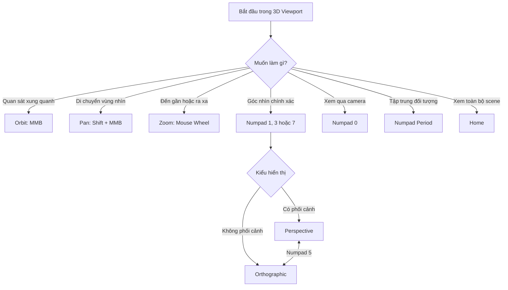

# 005 — Navigation

| Thuộc tính       | Nội dung                         |
| ---------------- | -------------------------------- |
| **Module**       | Module 01 — Introduction & Setup |
| **Bài học**      | Navigation                       |
| **Thời lượng**   | 7:12                             |
| **Chủ đề chính** | Điều hướng trong không gian 3D   |
| **Phần mềm**     | Blender                          |
| **Cấp độ**       | Người mới bắt đầu                |

---

## 1. Giới thiệu bài học

Trong bài học này, chúng ta sẽ tìm hiểu cách **điều hướng trong 3D Viewport** và thiết lập một số tùy chọn đầu vào quan trọng trong Blender.

Giao diện Blender ban đầu có thể khá phức tạp vì được chia thành nhiều khu vực:

* **3D Viewport**: khu vực chính để quan sát và thao tác với các đối tượng 3D.
* **Outliner**: hiển thị danh sách đối tượng trong scene.
* **Properties Editor**: chứa các thiết lập của scene, object, vật liệu, ánh sáng và render.
* **Timeline**: dùng để điều khiển thời gian khi làm animation.

Trong bài học này, chúng ta tập trung chủ yếu vào **3D Viewport**.

```text
┌───────────────────────────────────────────────────────┐
│                     Blender UI                        │
├────────────────────────────────────┬──────────────────┤
│                                    │     Outliner     │
│                                    ├──────────────────┤
│            3D Viewport             │    Properties    │
│                                    │      Editor      │
│                                    │                  │
├────────────────────────────────────┴──────────────────┤
│                      Timeline                         │
└───────────────────────────────────────────────────────┘
```

---

## 2. Mục tiêu bài học

Sau khi hoàn thành bài học, bạn có thể:

* Nhận biết các khu vực chính trong giao diện Blender.
* Xoay góc nhìn bằng thao tác **Orbit**.
* Di chuyển góc nhìn bằng thao tác **Pan**.
* Phóng to và thu nhỏ bằng thao tác **Zoom**.
* Sử dụng các góc nhìn chuẩn bằng bàn phím số.
* Phân biệt **Perspective View** và **Orthographic View**.
* Sử dụng trục tọa độ để thay đổi góc nhìn.
* Truy cập góc nhìn của camera.
* Thiết lập Blender khi không có chuột ba nút hoặc bàn phím số.
* Hiểu tỷ lệ cơ bản của lưới trong Blender.

---

## 3. Các khu vực chính trong giao diện Blender

### 3.1. 3D Viewport

**3D Viewport** là khu vực trung tâm của Blender. Đây là nơi bạn:

* Quan sát scene.
* Chọn đối tượng.
* Di chuyển, xoay và thay đổi kích thước đối tượng.
* Modeling các mô hình 3D.
* Thiết lập camera và ánh sáng.
* Xem trước kết quả vật liệu và render.

Ở góc trên bên trái của mỗi khu vực có nút **Editor Type**, cho phép thay đổi loại trình chỉnh sửa.

Ví dụ, một khu vực có thể được đổi thành:

* 3D Viewport.
* Image Editor.
* Shader Editor.
* UV Editor.
* Graph Editor.
* Text Editor.

> Trong bài học này, khu vực trung tâm được đặt ở chế độ **3D Viewport**.

---

### 3.2. Outliner

**Outliner** thường nằm ở góc trên bên phải.

Nó hiển thị cấu trúc của scene, chẳng hạn như:

```text
Scene Collection
├── Camera
├── Cube
└── Light
```

Bạn có thể dùng Outliner để:

* Chọn đối tượng.
* Đổi tên đối tượng.
* Ẩn hoặc hiện đối tượng.
* Tổ chức đối tượng thành Collection.
* Kiểm tra các đối tượng hiện có trong scene.

---

### 3.3. Properties Editor

**Properties Editor** chứa các thiết lập liên quan đến:

* Render.
* Output.
* Scene.
* World.
* Object.
* Modifier.
* Material.
* Texture.
* Physics.

Mỗi nhóm thiết lập được biểu diễn bằng một biểu tượng ở cạnh của Properties Editor.

---

### 3.4. Timeline

**Timeline** nằm ở phía dưới giao diện và chủ yếu được dùng cho animation.

Timeline cho phép:

* Di chuyển giữa các frame.
* Phát hoặc dừng animation.
* Đặt keyframe.
* Kiểm soát khoảng thời gian của hoạt ảnh.

Trong bài học điều hướng này, chúng ta chưa cần sử dụng Timeline.

---

## 4. Ba thao tác điều hướng cơ bản

Ba thao tác quan trọng nhất trong 3D Viewport là:

```text
Điều hướng Viewport
├── Orbit — xoay góc nhìn
├── Pan   — di chuyển góc nhìn
└── Zoom  — phóng to hoặc thu nhỏ
```

---

## 5. Orbit — xoay góc nhìn

### 5.1. Cách thực hiện

Để xoay góc nhìn quanh scene:

```text
Giữ MMB + kéo chuột
```

Trong đó, **MMB** là nút chuột giữa hoặc con lăn chuột.

Khi thực hiện Orbit, góc nhìn sẽ xoay quanh một điểm trung tâm. Trong scene mặc định, điểm trung tâm thường nằm gần khối Cube.

### 5.2. Mục đích

Orbit giúp bạn:

* Quan sát đối tượng từ nhiều phía.
* Kiểm tra hình dạng 3D.
* Chuyển từ góc nhìn trước sang góc nhìn chéo.
* Quan sát chiều sâu của scene.
* Kiểm tra các mặt bị che khuất.

### 5.3. Minh họa

```text
               Camera người xem
                     ●
                  ↙     ↘
               ↙           ↘
            ●────── Cube ──────●
               ↖           ↗
                  ↖     ↗

       Orbit xoay góc nhìn quanh đối tượng
```

---

## 6. Pan — lia góc nhìn

### 6.1. Cách thực hiện

Để di chuyển góc nhìn sang trái, phải, lên hoặc xuống:

```text
Shift + MMB + kéo chuột
```

Pan không xoay scene mà chỉ dịch chuyển vùng quan sát.

### 6.2. Công cụ trên giao diện

Bạn cũng có thể dùng biểu tượng **Move the View** ở bên phải 3D Viewport.

Tuy nhiên, sử dụng phím tắt thường nhanh hơn.

### 6.3. Mục đích

Pan hữu ích khi:

* Đối tượng nằm lệch khỏi trung tâm viewport.
* Bạn muốn quan sát một khu vực khác mà không thay đổi góc quay.
* Bạn đang làm việc với scene lớn.
* Bạn cần căn chỉnh bố cục trong góc nhìn Front, Side hoặc Top.

```text
Trước khi Pan                 Sau khi Pan

┌────────────────┐           ┌────────────────┐
│       Cube     │   →       │  Cube          │
│                │           │                │
└────────────────┘           └────────────────┘
```

---

## 7. Zoom — phóng to và thu nhỏ

### 7.1. Zoom bằng con lăn

Để phóng to hoặc thu nhỏ:

```text
Lăn con lăn chuột
```

* Lăn lên: phóng to.
* Lăn xuống: thu nhỏ.

Cách này thay đổi khoảng cách theo từng bước nên đôi khi có cảm giác hơi giật.

---

### 7.2. Smooth Zoom

Để zoom mượt hơn:

```text
Ctrl + MMB + kéo chuột lên hoặc xuống
```

Thao tác này cho phép kiểm soát khoảng cách chính xác hơn so với con lăn chuột.

---

### 7.3. Biểu tượng Zoom

Bạn cũng có thể sử dụng biểu tượng kính lúp ở bên phải viewport:

1. Nhấn giữ vào biểu tượng Zoom.
2. Kéo chuột lên hoặc xuống.
3. Thả chuột khi đạt được khoảng cách mong muốn.

---

## 8. Thiết lập khi không có chuột ba nút

Nếu chuột không có nút giữa, Blender cung cấp chế độ **Emulate 3 Button Mouse**.

### 8.1. Cách bật

Đi tới:

```text
Edit
└── Preferences
    └── Input
        └── Emulate 3 Button Mouse
```

Sau khi bật, bạn có thể dùng:

```text
Alt + LMB
```

để thay thế thao tác MMB.

Trong đó:

* **LMB**: nút chuột trái.
* **MMB**: nút chuột giữa.
* **RMB**: nút chuột phải.

### 8.2. Các thao tác khi mô phỏng chuột ba nút

| Thao tác  | Chuột bình thường | Khi bật Emulate 3 Button Mouse |
| --------- | ----------------- | ------------------------------ |
| Orbit     | `MMB`             | `Alt + LMB`                    |
| Pan       | `Shift + MMB`     | `Alt + Shift + LMB`            |
| Zoom mượt | `Ctrl + MMB`      | `Alt + Ctrl + LMB`             |

> Tùy hệ điều hành, tổ hợp `Alt + LMB` có thể bị hệ thống sử dụng để di chuyển cửa sổ. Khi đó, dùng chuột ba nút vật lý sẽ thuận tiện hơn.

---

## 9. Thiết lập khi không có Numpad

Một số laptop không có bàn phím số riêng. Blender cung cấp tùy chọn **Emulate Numpad**.

### 9.1. Cách bật

Đi tới:

```text
Edit
└── Preferences
    └── Input
        └── Emulate Numpad
```

Khi bật tùy chọn này, hàng phím số phía trên bàn phím có thể được dùng thay cho Numpad.

### 9.2. Hạn chế

Khi bật Emulate Numpad:

* Các phím số thông thường được chuyển thành phím điều hướng góc nhìn.
* Một số phím tắt sử dụng số có thể hoạt động khác.
* Việc chuyển đổi nhanh giữa chế độ chọn và góc nhìn có thể cần làm quen.

Ngoài ra, bạn có thể sử dụng **Navigation Gizmo** hoặc **View Pie Menu** thay cho Numpad.

---

## 10. Các góc nhìn chuẩn bằng Numpad

Bàn phím số cung cấp các góc nhìn trực giao chuẩn.

| Góc nhìn                   | Phím tắt          |
| -------------------------- | ----------------- |
| Front View                 | `Numpad 1`        |
| Back View                  | `Ctrl + Numpad 1` |
| Right View                 | `Numpad 3`        |
| Left View                  | `Ctrl + Numpad 3` |
| Top View                   | `Numpad 7`        |
| Bottom View                | `Ctrl + Numpad 7` |
| Camera View                | `Numpad 0`        |
| Perspective ↔ Orthographic | `Numpad 5`        |

### Sơ đồ các góc nhìn

```text
                        Top View
                       Numpad 7
                           │
                           ▼
                ┌──────────────────┐
                │                  │
 Left View ◄────│      Object      │────► Right View
 Ctrl + Num 3   │                  │      Numpad 3
                └──────────────────┘
                           ▲
                           │
                      Bottom View
                    Ctrl + Numpad 7


         Front View                  Back View
          Numpad 1                Ctrl + Numpad 1
```

---

## 11. Front View

Nhấn:

```text
Numpad 1
```

để chuyển sang **Front View**.

Trong Front View:

* Trục X chạy ngang.
* Trục Z chạy dọc.
* Camera nhìn theo hướng của trục Y.
* Góc nhìn mặc định chuyển sang Orthographic.

```text
             +Z
              ↑
              │
     -X ←─────┼─────→ +X
              │
              ↓
             -Z
```

Front View đặc biệt hữu ích khi:

* Căn chỉnh chiều rộng và chiều cao.
* Modeling mặt trước của nhân vật hoặc đồ vật.
* Đảm bảo các đối tượng thẳng hàng.
* Kiểm tra tính đối xứng.

---

## 12. Back View

Nhấn:

```text
Ctrl + Numpad 1
```

để chuyển sang **Back View**.

Back View là góc đối diện với Front View. Nó hữu ích khi cần quan sát hoặc chỉnh sửa mặt sau của mô hình.

---

## 13. Right View và Left View

### Right View

Nhấn:

```text
Numpad 3
```

để quan sát đối tượng từ bên phải.

Ở góc nhìn này:

* Trục Y chạy ngang.
* Trục Z chạy dọc.
* Góc nhìn hướng theo trục X.

### Left View

Nhấn:

```text
Ctrl + Numpad 3
```

để quan sát đối tượng từ bên trái.

Các góc nhìn bên thường được dùng để:

* Kiểm tra chiều sâu của mô hình.
* Căn chỉnh đầu, thân hoặc chân của nhân vật.
* Modeling xe cộ, đồ nội thất hoặc kiến trúc.
* So sánh tỷ lệ trước–sau.

---

## 14. Top View và Bottom View

### Top View

Nhấn:

```text
Numpad 7
```

để nhìn đối tượng từ trên xuống.

Top View thường được dùng để:

* Sắp xếp bố cục scene.
* Đặt vị trí các đối tượng trên mặt phẳng.
* Modeling bản đồ hoặc mặt bằng.
* Căn chỉnh đối tượng theo trục X và Y.

### Bottom View

Nhấn:

```text
Ctrl + Numpad 7
```

để quan sát từ phía dưới lên.

---

## 15. Navigation Gizmo và hệ tọa độ Cartesian

Ở góc trên bên phải của 3D Viewport có **Navigation Gizmo**.

Gizmo hiển thị ba trục tọa độ:

| Trục | Màu sắc    | Ý nghĩa     |
| ---- | ---------- | ----------- |
| X    | Đỏ         | Trái ↔ phải |
| Y    | Xanh lá    | Trước ↔ sau |
| Z    | Xanh dương | Dưới ↔ trên |

```text
                  +Z
                   ↑
                   │
                   ●────────→ +X
                  /
                 /
               +Y
```

Bạn có thể nhấn trực tiếp vào các trục trên Gizmo để chuyển góc nhìn.

Ví dụ:

* Nhấn vào **X**: chuyển sang góc nhìn bên.
* Nhấn vào **Y**: chuyển sang Front hoặc Back View.
* Nhấn vào **Z**: chuyển sang Top hoặc Bottom View.
* Nhấn và kéo vùng bên ngoài các trục: xoay góc nhìn.

Khi di chuột lên các thành phần của Gizmo, Blender có thể hiển thị tên góc nhìn và phím tắt tương ứng.

> Navigation Gizmo đặc biệt hữu ích với người dùng laptop không có Numpad.

---

## 16. Perspective và Orthographic

Blender có hai kiểu hiển thị góc nhìn chính:

```text
Viewport Projection
├── Perspective
└── Orthographic
```

---

### 16.1. Perspective View

**Perspective View** mô phỏng cách mắt người hoặc camera nhìn thế giới.

Đặc điểm:

* Đối tượng ở gần trông lớn hơn.
* Đối tượng ở xa trông nhỏ hơn.
* Các đường song song có thể hội tụ về phía xa.
* Thể hiện cảm giác chiều sâu tự nhiên.

```text
Gần người xem                         Xa người xem

┌─────────────┐                         ┌──────┐
│   Object    │                         │Object│
└─────────────┘                         └──────┘
```

Perspective phù hợp để:

* Quan sát tổng thể mô hình.
* Kiểm tra cảm giác không gian.
* Đặt camera.
* Xem scene gần giống kết quả thực tế.

---

### 16.2. Orthographic View

**Orthographic View** không có biến dạng phối cảnh.

Đặc điểm:

* Vật thể xa và gần có cùng tỷ lệ hiển thị.
* Các đường song song vẫn song song.
* Không có cảm giác hội tụ về điểm xa.
* Dễ căn chỉnh chính xác.

```text
Gần người xem                         Xa người xem

┌──────────┐                          ┌──────────┐
│  Object  │                          │  Object  │
└──────────┘                          └──────────┘
```

Orthographic phù hợp để:

* Modeling chính xác.
* Căn chỉnh đối tượng.
* Làm việc ở Front, Side và Top View.
* Kiểm tra tỷ lệ.
* Thiết kế kiến trúc hoặc sản phẩm.

---

### 16.3. Chuyển đổi giữa hai chế độ

Nhấn:

```text
Numpad 5
```

để chuyển đổi:

```text
Perspective ↔ Orthographic
```

Bạn cũng có thể nhấn vào biểu tượng Projection trong Navigation Gizmo.

Khi đang ở một góc nhìn chuẩn như Front View, nếu bắt đầu Orbit bằng MMB, Blender thường chuyển từ góc nhìn Orthographic chuẩn sang góc nhìn Perspective tự do.

---

## 17. Xoay góc nhìn bằng Numpad

Ngoài các góc nhìn chuẩn, bạn có thể xoay viewport theo từng bước cố định:

| Thao tác       | Phím tắt   |
| -------------- | ---------- |
| Xoay sang trái | `Numpad 4` |
| Xoay sang phải | `Numpad 6` |
| Xoay lên       | `Numpad 8` |
| Xoay xuống     | `Numpad 2` |

Các phím này hữu ích khi:

* Không muốn dùng chuột.
* Cần xoay góc nhìn với khoảng cách đều nhau.
* Muốn quan sát nhanh các hướng xung quanh đối tượng.

```text
             Numpad 8
                 ↑
                 │
Numpad 4  ←  Viewport  →  Numpad 6
                 │
                 ↓
             Numpad 2
```

---

## 18. Camera View

### 18.1. Truy cập Camera View

Nhấn:

```text
Numpad 0
```

để nhìn qua camera của scene.

Nhấn `Numpad 0` lần nữa để quay lại góc nhìn trước đó.

Bạn cũng có thể nhấn biểu tượng Camera trong Navigation Gizmo.

---

### 18.2. Vai trò của camera

Camera xác định phần scene sẽ xuất hiện trong hình ảnh hoặc video cuối cùng.

```text
Scene 3D
   │
   ▼
┌─────────────┐
│   Camera    │
│   Frame     │
└─────────────┘
   │
   ▼
Ảnh hoặc video được render
```

Chỉ những gì nằm trong khung camera mới xuất hiện trong kết quả render.

Camera View thường được dùng để:

* Thiết lập bố cục.
* Chọn góc quay.
* Kiểm tra phần hình ảnh sẽ được render.
* Chuẩn bị scene trước khi xuất ảnh.

---

### 18.3. Thoát Camera View

Bạn có thể:

* Nhấn lại `Numpad 0`.
* Orbit bằng MMB để rời khỏi camera.
* Chọn một góc nhìn chuẩn khác.

---

## 19. Lưới và đơn vị đo trong Blender

Trong các góc nhìn chuẩn, viewport hiển thị hệ thống đường lưới để hỗ trợ căn chỉnh.

Theo thiết lập scene mặc định được minh họa trong bài học:

* Một ô lưới nhỏ có thể biểu diễn khoảng **10 centimet**.
* Mười ô nhỏ tạo thành một ô lớn.
* Một ô lớn biểu diễn khoảng **1 mét**.
* Khối Cube mặc định có kích thước khoảng **2 × 2 × 2 mét**.

```text
┌─┬─┬─┬─┬─┬─┬─┬─┬─┬─┐
│ │ │ │ │ │ │ │ │ │ │
├─┼─┼─┼─┼─┼─┼─┼─┼─┼─┤
│ │ │ │ │ │ │ │ │ │ │
├─┼─┼─┼─┼─┼─┼─┼─┼─┼─┤
│ │ │ │ │ │ │ │ │ │ │  10 ô nhỏ
├─┼─┼─┼─┼─┼─┼─┼─┼─┼─┤  ≈ 1 mét
│ │ │ │ │ │ │ │ │ │ │
└─┴─┴─┴─┴─┴─┴─┴─┴─┴─┘
```

Tỷ lệ lưới có thể thay đổi tùy theo:

* Mức zoom.
* Hệ đơn vị của scene.
* Thiết lập Unit Scale.
* Phiên bản và cấu hình Blender.

> Không nên chỉ dựa vào hình thức của lưới để xác định kích thước. Khi modeling chính xác, hãy kiểm tra thông số **Dimensions** của đối tượng.

---

## 20. Chọn đối tượng

Để chọn một đối tượng trong scene:

```text
LMB vào đối tượng
```

Đối tượng được chọn thường có:

* Đường viền màu cam.
* Điểm origin được hiển thị.
* Tên đối tượng được đánh dấu trong Outliner.

Ví dụ, khi chọn Cube:

```text
Không được chọn       Được chọn
┌─────────┐           ╔═════════╗
│  Cube   │           ║  Cube   ║ ← viền màu cam
└─────────┘           ╚═════════╝
```

Việc chọn đối tượng là bước cần thiết trước khi:

* Di chuyển.
* Xoay.
* Thay đổi kích thước.
* Xóa.
* Thêm Modifier.
* Chỉnh sửa mesh.

---

## 21. Focus vào đối tượng

### 21.1. View Selected

Để đưa đối tượng đang chọn vào giữa viewport:

```text
Numpad .
```

Phím này còn được gọi là:

* **View Selected**.
* **Frame Selected**.
* **Focus Selected**.

Quy trình:

```text
Chọn đối tượng
      ↓
Nhấn Numpad .
      ↓
Viewport tập trung vào đối tượng
```

View Selected rất hữu ích khi:

* Đối tượng quá nhỏ.
* Đối tượng nằm xa.
* Viewport đang xoay quanh sai điểm.
* Bạn muốn modeling chi tiết một bộ phận cụ thể.

---

### 21.2. View All

Để đưa toàn bộ đối tượng trong scene vào vùng nhìn:

```text
Home
```

View All hữu ích khi:

* Bạn bị lạc trong scene.
* Đã zoom quá xa hoặc quá gần.
* Một số đối tượng nằm ngoài viewport.
* Muốn kiểm tra bố cục tổng thể.

---

## 22. View Pie Menu

Nếu không có Numpad, bạn có thể mở **View Pie Menu** bằng:

```text
~
```

Phím `~` thường nằm phía trên phím `Tab`.

View Pie Menu cung cấp các lựa chọn như:

* Front.
* Back.
* Left.
* Right.
* Top.
* Bottom.
* Camera.
* View Selected.

```text
                    Top
                     ▲
                     │
          Left ◄── View ──► Right
                     │
                     ▼
                   Bottom
```

Pie Menu giúp truy cập nhanh các góc nhìn mà không cần bàn phím số.

---

## 23. Walk/Fly Navigation

Blender hỗ trợ chế độ di chuyển tự do giống game góc nhìn thứ nhất.

Có thể mở bằng:

```text
Shift + ~
```

hoặc qua menu:

```text
View
└── Navigation
    └── Walk Navigation
```

Trong Walk Navigation, các phím thường dùng gồm:

| Thao tác            | Phím                    |
| ------------------- | ----------------------- |
| Đi tới              | `W`                     |
| Đi lùi              | `S`                     |
| Sang trái           | `A`                     |
| Sang phải           | `D`                     |
| Di chuyển lên/xuống | Tùy chế độ và thiết lập |
| Xác nhận vị trí     | `LMB` hoặc `Enter`      |
| Hủy                 | `Esc` hoặc `RMB`        |

Walk/Fly Navigation hữu ích với:

* Scene kiến trúc.
* Môi trường game.
* Nội thất.
* Thành phố hoặc không gian lớn.
* Kiểm tra scene ở góc nhìn của người dùng.

---

## 24. Quy trình điều hướng tổng quát



---

## 25. Quy trình thực hành đề xuất

### Bước 1: Quan sát giao diện

Mở Blender và xác định:

* 3D Viewport.
* Outliner.
* Properties Editor.
* Timeline.

Không cần thay đổi bố cục ở giai đoạn này.

---

### Bước 2: Thực hành Orbit

1. Đưa con trỏ vào 3D Viewport.
2. Giữ MMB.
3. Kéo chuột sang trái, phải, lên và xuống.
4. Quan sát Cube từ nhiều phía.

Mục tiêu là cảm nhận được điểm xoay hiện tại của viewport.

---

### Bước 3: Thực hành Pan

1. Giữ `Shift + MMB`.
2. Kéo chuột theo chiều ngang.
3. Kéo chuột theo chiều dọc.
4. Đưa Cube trở lại giữa viewport.

---

### Bước 4: Thực hành Zoom

1. Lăn con lăn để phóng to Cube.
2. Lăn theo chiều ngược lại để thu nhỏ.
3. Giữ `Ctrl + MMB`.
4. Kéo chuột để so sánh Smooth Zoom với con lăn.

---

### Bước 5: Thực hành các góc nhìn chuẩn

Lần lượt nhấn:

```text
Numpad 1 → Front View
Numpad 3 → Right View
Numpad 7 → Top View
```

Sau đó thử:

```text
Ctrl + Numpad 1
Ctrl + Numpad 3
Ctrl + Numpad 7
```

để xem các góc đối diện.

---

### Bước 6: Thực hành Projection

1. Chuyển sang Front View bằng `Numpad 1`.
2. Quan sát nhãn **Front Orthographic**.
3. Nhấn `Numpad 5`.
4. Quan sát sự thay đổi giữa Perspective và Orthographic.
5. Orbit bằng MMB để trở lại góc nhìn tự do.

---

### Bước 7: Sử dụng Navigation Gizmo

1. Nhấn vào trục X.
2. Nhấn vào trục Y.
3. Nhấn vào trục Z.
4. Nhấn vào phía đối diện của từng trục.
5. Kéo vùng xung quanh Gizmo để xoay viewport.

---

### Bước 8: Sử dụng Camera View

1. Nhấn `Numpad 0`.
2. Quan sát khung camera.
3. Xác định phần scene nằm trong khung.
4. Nhấn lại `Numpad 0` để thoát.
5. Thử MMB để rời Camera View.

---

### Bước 9: Focus vào đối tượng

1. Chọn Cube bằng LMB.
2. Nhấn `Numpad .`.
3. Quan sát Cube được đưa vào trung tâm.
4. Nhấn `Home` để xem toàn bộ scene.

---

## 26. Bảng phím tắt

| Thao tác                   | Phím tắt             |
| -------------------------- | -------------------- |
| Orbit                      | Giữ và kéo `MMB`     |
| Pan                        | `Shift + MMB`        |
| Zoom theo bước             | Lăn con lăn          |
| Zoom mượt                  | `Ctrl + MMB`         |
| Chọn đối tượng             | `LMB`                |
| Front View                 | `Numpad 1`           |
| Back View                  | `Ctrl + Numpad 1`    |
| Right View                 | `Numpad 3`           |
| Left View                  | `Ctrl + Numpad 3`    |
| Top View                   | `Numpad 7`           |
| Bottom View                | `Ctrl + Numpad 7`    |
| Camera View                | `Numpad 0`           |
| Perspective ↔ Orthographic | `Numpad 5`           |
| Xoay sang trái             | `Numpad 4`           |
| Xoay sang phải             | `Numpad 6`           |
| Xoay lên                   | `Numpad 8`           |
| Xoay xuống                 | `Numpad 2`           |
| View Selected              | `Numpad .`           |
| View All                   | `Home`               |
| View Pie Menu              | `~`                  |
| Walk Navigation            | `Shift + ~`          |
| Mở Preferences             | `Edit > Preferences` |

---

## 27. Lưu ý quan trọng

### 27.1. Preferences được lưu tự động

Nếu tùy chọn **Auto-Save Preferences** đang bật, các thay đổi trong Preferences sẽ được Blender lưu tự động.

Ví dụ:

* Emulate 3 Button Mouse.
* Emulate Numpad.
* Giao diện.
* Keymap.
* Add-ons.

Bạn không cần nhấn nút Save thủ công sau mỗi thay đổi.

---

### 27.2. Góc nhìn chuẩn thường dùng Orthographic

Khi nhấn `Numpad 1`, `3` hoặc `7`, Blender thường đưa viewport vào một góc nhìn Orthographic chuẩn.

Điều này giúp:

* Căn chỉnh dễ hơn.
* Không bị biến dạng phối cảnh.
* So sánh vị trí đối tượng chính xác hơn.

Khi Orbit bằng MMB, Blender sẽ rời khỏi góc nhìn chuẩn và trở lại góc nhìn tự do.

---

### 27.3. Camera View không phải viewport thông thường

Khung Camera View thể hiện chính xác khu vực sẽ được render.

Những đối tượng nằm ngoài khung camera vẫn tồn tại trong scene nhưng không xuất hiện trong ảnh render.

---

### 27.4. Chuột ba nút giúp làm việc nhanh hơn

Mặc dù Blender hỗ trợ mô phỏng chuột giữa, một chuột vật lý có:

* Nút trái.
* Nút phải.
* Nút giữa.
* Con lăn.

sẽ giúp thao tác nhanh, chính xác và thoải mái hơn.

---

## 28. Lỗi thường gặp

### Lỗi 1: Không Orbit được bằng chuột

**Nguyên nhân:**

* Chuột không có nút giữa.
* Nút giữa bị hỏng.
* Thao tác bên ngoài 3D Viewport.

**Cách xử lý:**

* Bật **Emulate 3 Button Mouse**.
* Sử dụng `Alt + LMB`.
* Kiểm tra con trỏ đang nằm trong viewport.

---

### Lỗi 2: Phím số không đổi góc nhìn

**Nguyên nhân:**

* Đang dùng hàng số phía trên bàn phím thay vì Numpad.
* Laptop không có Numpad.
* Num Lock đang tắt.
* Emulate Numpad chưa được bật.

**Cách xử lý:**

* Bật Num Lock.
* Bật **Emulate Numpad**.
* Dùng Navigation Gizmo.
* Dùng View Pie Menu với phím `~`.

---

### Lỗi 3: Viewport bị lệch khỏi đối tượng

**Nguyên nhân:**

* Pan quá xa.
* Zoom quanh một điểm khác.
* Điểm xoay không còn nằm ở đối tượng.

**Cách xử lý:**

1. Chọn đối tượng.
2. Nhấn `Numpad .`.
3. Tiếp tục Orbit quanh đối tượng.

---

### Lỗi 4: Không thấy toàn bộ scene

**Cách xử lý:**

```text
Nhấn Home
```

Blender sẽ điều chỉnh viewport để hiển thị toàn bộ các đối tượng.

---

### Lỗi 5: Đối tượng trông không có chiều sâu

**Nguyên nhân:**

Viewport đang ở chế độ Orthographic.

**Cách xử lý:**

```text
Nhấn Numpad 5
```

để chuyển về Perspective.

---

### Lỗi 6: Không nhìn thấy đối tượng sau khi zoom

**Nguyên nhân:**

* Zoom quá sâu.
* Viewport đang hướng vào một điểm khác.
* Đối tượng nằm ngoài khung nhìn.

**Cách xử lý:**

* Chọn đối tượng trong Outliner.
* Nhấn `Numpad .`.
* Hoặc nhấn `Home`.

---

### Lỗi 7: Nhầm Pan và Orbit

| Thao tác      | Kết quả            |
| ------------- | ------------------ |
| `MMB`         | Xoay góc nhìn      |
| `Shift + MMB` | Di chuyển góc nhìn |
| `Ctrl + MMB`  | Zoom mượt          |

Mẹo ghi nhớ:

```text
MMB         = Rotate
Shift + MMB = Shift the view
Ctrl + MMB  = Control the zoom
```

---

## 29. So sánh Perspective và Orthographic

| Tiêu chí                   | Perspective   | Orthographic    |
| -------------------------- | ------------- | --------------- |
| Cảm giác chiều sâu         | Tự nhiên      | Phẳng hơn       |
| Vật ở xa                   | Nhỏ hơn       | Không nhỏ hơn   |
| Đường song song            | Có thể hội tụ | Luôn song song  |
| Phù hợp quan sát thực tế   | Có            | Không hoàn toàn |
| Phù hợp căn chỉnh          | Khó hơn       | Rất phù hợp     |
| Phù hợp đặt camera         | Có            | Ít dùng hơn     |
| Phù hợp modeling chính xác | Có thể dùng   | Rất phù hợp     |

---

## 30. Ví dụ ứng dụng trong modeling

Giả sử bạn đang modeling một chiếc bàn:

1. Dùng **Perspective View** để quan sát hình dạng tổng thể.
2. Dùng **Front View** để chỉnh chiều cao chân bàn.
3. Dùng **Right View** để chỉnh chiều sâu.
4. Dùng **Top View** để căn vị trí bốn chân bàn.
5. Dùng **View Selected** để tập trung vào một chân bàn.
6. Dùng **Camera View** để kiểm tra bố cục render.

```text
Perspective
    ↓
Quan sát tổng thể
    ↓
Front / Right / Top
    ↓
Căn chỉnh chính xác
    ↓
Camera View
    ↓
Chuẩn bị render
```

---

## 31. Bài tập thực hành

### Bài tập 1: Điều hướng cơ bản

Thực hiện liên tục các thao tác:

1. Orbit quanh Cube.
2. Pan Cube sang bên trái viewport.
3. Zoom lại gần Cube.
4. Pan Cube trở về trung tâm.
5. Zoom ra để nhìn thấy Camera và Light.

---

### Bài tập 2: Nhận biết góc nhìn

Không nhìn vào tên góc nhìn ở góc trên viewport, hãy thử xác định:

* Đâu là Front View?
* Đâu là Right View?
* Đâu là Top View?
* Trục nào đang chạy ngang?
* Trục nào đang chạy dọc?

---

### Bài tập 3: Perspective và Orthographic

1. Chuyển sang Perspective.
2. Đặt Cube gần một vật thể khác.
3. Quan sát sự khác biệt kích thước theo khoảng cách.
4. Chuyển sang Orthographic.
5. So sánh lại hai vật thể.

---

### Bài tập 4: Camera View

1. Nhấn `Numpad 0`.
2. Xác định Cube có nằm trong khung camera hay không.
3. Thoát Camera View.
4. Orbit quanh Camera để quan sát hình dạng của nó.
5. Quay lại Camera View.

---

## 32. Câu hỏi ôn tập

### Câu 1

Ba thao tác điều hướng cơ bản trong Blender là gì?

<details>
<summary>Đáp án</summary>

* Orbit.
* Pan.
* Zoom.

</details>

### Câu 2

Phím tắt để Orbit là gì?

<details>
<summary>Đáp án</summary>

Giữ và kéo nút chuột giữa — `MMB`.

</details>

### Câu 3

Sự khác biệt giữa Orbit và Pan là gì?

<details>
<summary>Đáp án</summary>

* Orbit xoay góc nhìn quanh một điểm.
* Pan di chuyển vùng nhìn mà không thay đổi hướng quan sát.

</details>

### Câu 4

Phím nào chuyển sang Front View?

<details>
<summary>Đáp án</summary>

`Numpad 1`.

</details>

### Câu 5

Phím nào chuyển sang Right View?

<details>
<summary>Đáp án</summary>

`Numpad 3`.

</details>

### Câu 6

Phím nào chuyển sang Top View?

<details>
<summary>Đáp án</summary>

`Numpad 7`.

</details>

### Câu 7

Phím nào chuyển sang Camera View?

<details>
<summary>Đáp án</summary>

`Numpad 0`.

</details>

### Câu 8

Orthographic View có đặc điểm gì?

<details>
<summary>Đáp án</summary>

Các vật thể không nhỏ dần theo khoảng cách và các đường song song không hội tụ, nhờ đó việc căn chỉnh trở nên chính xác hơn.

</details>

### Câu 9

Làm thế nào để tập trung viewport vào đối tượng đang chọn?

<details>
<summary>Đáp án</summary>

Nhấn `Numpad .`.

</details>

### Câu 10

Làm thế nào để hiển thị toàn bộ scene trong viewport?

<details>
<summary>Đáp án</summary>

Nhấn `Home`.

</details>

---

## 33. Checklist thực hành

* [ ] Nhận biết được 3D Viewport, Outliner, Properties và Timeline.
* [ ] Orbit thành thạo bằng MMB.
* [ ] Pan thành thạo bằng `Shift + MMB`.
* [ ] Zoom bằng con lăn chuột.
* [ ] Zoom mượt bằng `Ctrl + MMB`.
* [ ] Chuyển được sang Front View.
* [ ] Chuyển được sang Right View.
* [ ] Chuyển được sang Top View.
* [ ] Chuyển được sang Camera View.
* [ ] Phân biệt được Perspective và Orthographic.
* [ ] Biết sử dụng Navigation Gizmo.
* [ ] Biết bật Emulate 3 Button Mouse.
* [ ] Biết bật Emulate Numpad.
* [ ] Biết dùng View Selected.
* [ ] Biết dùng View All.
* [ ] Đã thử View Pie Menu.
* [ ] Đã thử Walk Navigation.

---

## 34. Ghi nhớ nhanh

```text
MMB          → Orbit
Shift + MMB  → Pan
Mouse Wheel  → Zoom
Ctrl + MMB   → Smooth Zoom

Numpad 1     → Front
Numpad 3     → Right
Numpad 7     → Top
Numpad 0     → Camera
Numpad 5     → Perspective / Orthographic

Numpad .     → Focus đối tượng
Home         → Hiển thị toàn bộ scene
```

---

## 35. Tóm tắt bài học

Điều hướng trong 3D Viewport là một trong những kỹ năng nền tảng quan trọng nhất khi sử dụng Blender.

Ba thao tác cần thành thạo đầu tiên là:

* **Orbit** để xoay góc nhìn.
* **Pan** để di chuyển vùng quan sát.
* **Zoom** để thay đổi khoảng cách quan sát.

Bàn phím số giúp chuyển nhanh giữa các góc nhìn Front, Side, Top và Camera. Trong đó, các góc nhìn Orthographic rất hữu ích cho việc căn chỉnh và modeling chính xác, còn Perspective View phù hợp để kiểm tra chiều sâu và cảm giác không gian.

Nếu thiết bị không có chuột giữa hoặc Numpad, Blender cung cấp các tùy chọn:

* **Emulate 3 Button Mouse**.
* **Emulate Numpad**.
* **Navigation Gizmo**.
* **View Pie Menu**.

Việc luyện tập các thao tác điều hướng cho đến khi trở thành phản xạ sẽ giúp tăng đáng kể tốc độ modeling và làm việc trong tất cả các bài học Blender tiếp theo.

> **Không cần lưu scene trong bài học này**, vì bài học tiếp theo sẽ bắt đầu bằng một scene mới.

---

# Bài luyện tập

## Mục tiêu


## Đề bài


## Yêu cầu hoàn thành

- [ ] 
- [ ] 
- [ ] 

## Kết quả / lời giải


## Ghi chú
