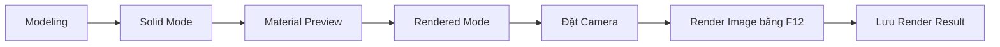
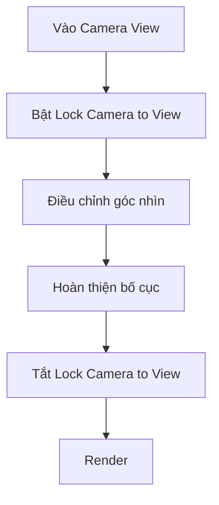
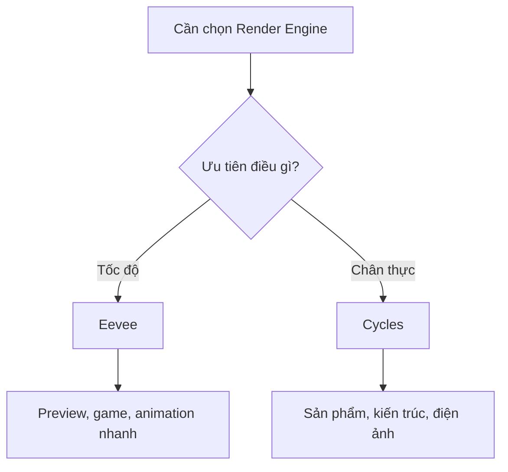

# 007 — Viewport & Rendering

| Thuộc tính       | Nội dung                                      |
| ---------------- | --------------------------------------------- |
| **Module**       | Module 01 — Introduction & Setup              |
| **Bài học**      | Viewport & Rendering                          |
| **Thời lượng**   | 16:35                                         |
| **Chủ đề chính** | Chế độ hiển thị Viewport và kết xuất hình ảnh |

---

## 1. Mục tiêu bài học

Sau bài học này, người học có thể:

* Phân biệt bốn chế độ hiển thị trong 3D Viewport:

  * Wireframe
  * Solid
  * Material Preview
  * Rendered
* Hiểu cách sử dụng **X-Ray Mode** trong Wireframe và Solid Mode.
* Phân biệt ánh sáng mô phỏng trong Material Preview với ánh sáng thật của scene.
* Hiểu sự khác nhau giữa hai Render Engine chính:

  * Eevee
  * Cycles
* Biết cách:

  * Đưa Camera vào đúng vị trí.
  * Render một ảnh tĩnh.
  * Xem lại Render Result.
  * Lưu ảnh render.
* Phân biệt trạng thái ẩn đối tượng trong Viewport và trạng thái ẩn khi render.
* Làm quen với GPU Rendering và Color Management.

---

## 2. Tổng quan quy trình hiển thị và render



Mỗi chế độ hiển thị phục vụ một giai đoạn khác nhau:

| Giai đoạn                           | Chế độ thường dùng   |
| ----------------------------------- | -------------------- |
| Dựng hình và chỉnh sửa đối tượng    | Solid                |
| Căn chỉnh xuyên qua nhiều đối tượng | Wireframe hoặc X-Ray |
| Tạo và kiểm tra vật liệu            | Material Preview     |
| Kiểm tra ánh sáng thật của scene    | Rendered             |
| Xuất sản phẩm cuối cùng             | Render Image         |

---

## 3. Điều hướng cơ bản trong Viewport

Trước khi tìm hiểu các chế độ hiển thị, cần nhớ một số thao tác điều hướng:

| Thao tác               | Điều khiển         |
| ---------------------- | ------------------ |
| Xoay góc nhìn          | Giữ và kéo `MMB`   |
| Lia góc nhìn – Pan     | `Shift + MMB`      |
| Phóng to hoặc thu nhỏ  | Cuộn con lăn chuột |
| Mở hoặc đóng Sidebar   | `N`                |
| Góc nhìn Camera        | `Numpad 0`         |
| Góc nhìn chính diện    | `Numpad 1`         |
| Góc nhìn cạnh          | `Numpad 3`         |
| Góc nhìn từ trên xuống | `Numpad 7`         |

> `MMB` là nút chuột giữa.

---

## 4. Các chế độ Viewport Shading

Các chế độ hiển thị nằm ở góc trên bên phải của 3D Viewport. Mỗi chế độ được biểu diễn bằng một biểu tượng hình cầu.

Có thể nhấn `Z` để mở **Shading Pie Menu** và chuyển nhanh giữa các chế độ.

```text
                         Rendered
                            ▲
                            │
               Wireframe ◀  Z  ▶ Solid
                            │
                            ▼
                     Material Preview
```

---

### 4.1. Wireframe Mode

Wireframe chỉ hiển thị:

* Đỉnh – Vertex
* Cạnh – Edge
* Khung cấu trúc của vật thể

Bề mặt của vật thể không được hiển thị dưới dạng khối đặc.

#### Công dụng

Wireframe đặc biệt hữu ích khi:

* Cần nhìn xuyên qua vật thể.
* Căn chỉnh nhiều đối tượng với nhau.
* Đặt một đối tượng vào bên trong đối tượng khác.
* Kiểm tra cấu trúc hình học của mô hình.
* Chỉnh sửa các đỉnh hoặc cạnh bị che khuất.

#### Ví dụ căn chỉnh

1. Chuyển sang góc nhìn chính diện bằng `Numpad 1`.
2. Chọn đối tượng.
3. Nhấn `G` để di chuyển.
4. Nhấn `Z` để giới hạn theo trục Z.
5. Di chuyển đối tượng đến vị trí mong muốn.

```text
Chọn Torus
    ↓
Nhấn G
    ↓
Nhấn Z
    ↓
Di chuyển theo trục Z
```

---

### 4.2. X-Ray Mode

X-Ray làm cho đối tượng trở nên bán trong suốt, cho phép nhìn và lựa chọn các thành phần ở phía sau.

Bật hoặc tắt X-Ray bằng:

```text
Alt + Z
```

X-Ray có thể được sử dụng trong cả:

* Wireframe Mode
* Solid Mode

#### X-Ray trong Wireframe

Wireframe thường được sử dụng cùng X-Ray để:

* Nhìn xuyên toàn bộ mô hình.
* Căn chỉnh đối tượng dễ dàng.
* Chọn các đỉnh ở cả mặt trước và mặt sau.

#### X-Ray trong Solid Mode

Trong Solid Mode, X-Ray tạo ra hiệu ứng khối bán trong suốt.

Chế độ này rất hữu ích khi bước vào **Edit Mode**, vì người dùng có thể chọn cả những đỉnh bị che ở phía sau vật thể.

> Blender có thể ghi nhớ trạng thái X-Ray riêng cho từng chế độ hiển thị.

---

### 4.3. Solid Mode

Solid là chế độ mặc định khi dựng hình.

Trong chế độ này:

* Vật thể được hiển thị dưới dạng khối đặc.
* Có ánh sáng và bóng đổ đơn giản giúp nhận biết chiều sâu.
* Không cần vật liệu hoàn chỉnh.
* Không chịu ảnh hưởng bởi các Light trong scene.

Ví dụ, khi di chuyển một Point Light trong Solid Mode, độ sáng của vật thể không thay đổi.

#### Solid Mode phù hợp với

* Modeling
* Chỉnh sửa hình dạng
* Di chuyển và căn chỉnh đối tượng
* Làm việc với số lượng lớn đối tượng
* Kiểm tra tỷ lệ và bố cục

```text
Solid Mode
├── Hiển thị nhanh
├── Có shading cơ bản
├── Không dùng ánh sáng thật
└── Phù hợp để modeling
```

---

### 4.4. Material Preview Mode

Material Preview hiển thị gần đúng:

* Màu sắc vật liệu
* Độ nhám
* Độ bóng
* Metallic
* Texture
* Principled BSDF

Nếu chưa gán vật liệu riêng, các đối tượng thường xuất hiện với vật liệu mặc định màu trắng.

#### Ánh sáng HDRI

Material Preview sử dụng một môi trường ánh sáng studio được tạo bởi **HDRI**.

HDRI là viết tắt của:

> High Dynamic Range Image

HDRI chứa thông tin ánh sáng có phạm vi rộng, bao gồm:

* Vùng sáng mạnh
* Vùng tối
* Màu sắc môi trường
* Hướng chiếu sáng
* Ánh sáng bao quanh

Nhờ đó, HDRI có thể tạo:

* Ánh sáng tự nhiên.
* Bóng đổ dễ quan sát.
* Phản xạ môi trường.
* Một môi trường sạch để đánh giá vật liệu.

#### Điểm quan trọng

Theo mặc định, Material Preview:

* Sử dụng HDRI studio.
* Không sử dụng các Light đã thêm vào scene.
* Không phản ánh chính xác thiết lập ánh sáng cuối cùng.

Do đó, khi di chuyển Point Light hoặc Sun Light trong scene, bóng đổ trong Material Preview có thể không thay đổi.

> Material Preview chủ yếu giúp kiểm tra vật liệu, không phải để đánh giá chính xác hệ thống ánh sáng cuối cùng.

---

### 4.5. Rendered Mode

Rendered Mode hiển thị kết quả gần với ảnh render cuối cùng.

Chế độ này sử dụng:

* Render Engine hiện tại.
* Light thật trong scene.
* World Lighting.
* Material.
* Shadow.
* Reflection.
* Các hiệu ứng render khác.

Khi di chuyển một Light trong Rendered Mode, người dùng có thể quan sát trực tiếp:

* Độ sáng thay đổi.
* Vị trí bóng đổ thay đổi.
* Hướng phản xạ thay đổi.
* Màu sắc vật thể bị ảnh hưởng.

#### So sánh Material Preview và Rendered

| Đặc điểm                       | Material Preview | Rendered                |
| ------------------------------ | ---------------- | ----------------------- |
| Dùng HDRI studio mặc định      | Có               | Không mặc định          |
| Dùng Light thật trong scene    | Không mặc định   | Có                      |
| Phù hợp kiểm tra vật liệu      | Rất phù hợp      | Có                      |
| Phù hợp kiểm tra ánh sáng cuối | Không hoàn toàn  | Có                      |
| Tốc độ                         | Nhanh            | Phụ thuộc Render Engine |
| Gần với kết quả cuối           | Tương đối        | Rất gần                 |

---

## 5. Shading Workspace

Để làm việc với vật liệu thuận tiện hơn, Blender cung cấp **Shading Workspace**.

Có thể chọn tab `Shading` ở phía trên giao diện.

Workspace này thường bao gồm:

| Khu vực       | Chức năng                            |
| ------------- | ------------------------------------ |
| 3D Viewport   | Quan sát vật thể và vật liệu         |
| Shader Editor | Tạo và kết nối các node vật liệu     |
| Image Editor  | Xem và chỉnh sửa hình ảnh texture    |
| File Browser  | Duyệt và kéo texture vào Blender     |
| Outliner      | Quản lý đối tượng                    |
| Properties    | Điều chỉnh vật liệu, render và scene |

### Shader Editor

Shader Editor là nơi tạo vật liệu bằng hệ thống node.

Ví dụ, vật liệu cơ bản thường bắt đầu với:

```text
Principled BSDF ─────▶ Material Output
```

Các thuộc tính thường được điều chỉnh trong Principled BSDF gồm:

* Base Color
* Metallic
* Roughness
* Alpha
* Normal
* Emission

---

## 6. Quản lý các vùng giao diện

Blender cho phép tùy biến bố cục Workspace.

### Thay đổi kích thước vùng

Đưa con trỏ đến đường phân cách giữa hai vùng, sau đó kéo để thay đổi kích thước.

### Gộp hai vùng

1. Đưa chuột đến đường phân cách.
2. Nhấn chuột phải.
3. Chọn `Join Areas`.
4. Chọn vùng cần giữ lại.

### Tạo một vùng mới

1. Đưa chuột đến góc của một vùng.
2. Khi xuất hiện biểu tượng dấu cộng hoặc con trỏ chữ thập, kéo ra ngoài.
3. Chọn loại Editor cần sử dụng.

Ví dụ:

* 3D Viewport
* Shader Editor
* Image Editor
* File Browser
* Outliner

> Nếu vô tình làm thay đổi bố cục Workspace, người dùng có thể chia lại vùng và chọn đúng loại Editor.

---

## 7. Ẩn đối tượng trong Viewport và khi render

Trong Outliner, mỗi đối tượng có thể có hai trạng thái hiển thị khác nhau:

| Biểu tượng | Chức năng                            |
| ---------- | ------------------------------------ |
| Con mắt    | Hiện hoặc ẩn trong Viewport          |
| Camera     | Có hoặc không xuất hiện trong Render |

### Ẩn trong Viewport

Khi tắt biểu tượng con mắt:

* Đối tượng biến mất khỏi 3D Viewport.
* Scene trở nên gọn hơn.
* Người dùng có thể tập trung vào các đối tượng khác.

Tuy nhiên, đối tượng vẫn có thể xuất hiện trong ảnh render.

### Ẩn khi render

Khi tắt biểu tượng Camera:

* Đối tượng vẫn có thể nhìn thấy trong Viewport.
* Đối tượng không xuất hiện trong Render Result.

### Lỗi thường gặp

```text
Nhìn thấy trong Viewport
          │
          ├── Camera bật  → Có trong ảnh render
          └── Camera tắt → Biến mất khỏi ảnh render
```

Đây là lỗi đặc biệt nghiêm trọng khi render animation, vì người dùng có thể mất nhiều thời gian render rồi mới phát hiện một đối tượng quan trọng đã bị tắt khỏi kết quả.

Ngược lại, một đối tượng bị ẩn trong Viewport nhưng vẫn bật biểu tượng Camera có thể bất ngờ xuất hiện trong ảnh render.

> Trước khi render, luôn kiểm tra cả biểu tượng con mắt và biểu tượng Camera trong Outliner.

---

## 8. Camera và khung hình render

Blender chỉ render những gì Camera nhìn thấy.

### Vào Camera View

Nhấn:

```text
Numpad 0
```

Nhấn lại `Numpad 0` để thoát khỏi Camera View.

Ngoài ra, có thể sử dụng biểu tượng Camera trong khu vực điều hướng Viewport.

---

### Lock Camera to View

Để căn chỉnh Camera bằng các thao tác điều hướng thông thường:

1. Vào Camera View bằng `Numpad 0`.
2. Mở Sidebar bằng `N`.
3. Chọn tab `View`.
4. Bật `Lock Camera to View`.
5. Dùng các thao tác:

   * `MMB` để xoay.
   * `Shift + MMB` để lia.
   * Cuộn chuột để phóng to hoặc thu nhỏ.
6. Khi khung hình đã hoàn chỉnh, tắt `Lock Camera to View`.



### Lỗi thường gặp

Nếu quên tắt `Lock Camera to View`, người dùng có thể vô tình làm thay đổi vị trí Camera khi chỉ muốn điều hướng quanh scene.

Do đó:

> Sau khi đặt Camera xong, hãy tắt Lock Camera to View trước khi tiếp tục làm việc.

---

## 9. Render một ảnh tĩnh

### Cách render

Có hai cách chính:

#### Cách 1: Dùng menu

```text
Render > Render Image
```

#### Cách 2: Dùng phím tắt

```text
F12
```

Blender sẽ render hình ảnh dựa trên:

* Camera hiện tại.
* Render Engine.
* Ánh sáng trong scene.
* Vật liệu.
* Độ phân giải.
* Số lượng Samples.
* Các thiết lập Render Properties.

---

### Xem lại kết quả render

Nếu đóng hoặc chuyển khỏi cửa sổ Render Result, không nhất thiết phải render lại.

Có thể chọn:

```text
Render > View Render
```

Hoặc chuyển một Editor sang `Image Editor` và chọn `Render Result`.

---

### Lưu ảnh render

Trong cửa sổ Render Result, chọn:

```text
Image > Save As
```

Sau đó:

1. Chọn thư mục lưu.
2. Đặt tên file.
3. Chọn định dạng.
4. Nhấn `Save As Image`.

Một số định dạng thường dùng:

| Định dạng | Công dụng                                           |
| --------- | --------------------------------------------------- |
| PNG       | Chất lượng tốt, hỗ trợ nền trong suốt               |
| JPEG      | Dung lượng nhỏ, phù hợp đăng web                    |
| TIFF      | Chất lượng cao                                      |
| OpenEXR   | Dữ liệu màu dải rộng, dùng cho hậu kỳ chuyên nghiệp |

> `F3` mở hộp tìm kiếm lệnh của Blender. Người dùng có thể tìm lệnh lưu ảnh từ đây, nhưng cách rõ ràng nhất vẫn là `Image > Save As`.

---

## 10. Viewport Render và Render Image

Rendered Viewport và Render Image không hoàn toàn giống nhau.

### Rendered Viewport

* Hiển thị trực tiếp trong Viewport.
* Cập nhật khi người dùng di chuyển Camera hoặc Light.
* Thường sử dụng chất lượng thấp hơn để duy trì tốc độ.
* Có thể xuất hiện nhiễu hoặc bóng đổ chưa mượt.

### Render Image

* Tạo một ảnh tĩnh hoàn chỉnh.
* Sử dụng thiết lập Render Samples.
* Có thể cho bóng đổ và ánh sáng chi tiết hơn.
* Có thể mất từ vài giây đến nhiều giờ, tùy độ phức tạp.

| Tiêu chí             | Rendered Viewport | Render Image |
| -------------------- | ----------------- | ------------ |
| Cập nhật trực tiếp   | Có                | Không        |
| Dùng để xem nhanh    | Có                | Không        |
| Chất lượng cuối cùng | Tương đối         | Cao hơn      |
| Xuất thành file ảnh  | Không trực tiếp   | Có           |
| Phím tắt             | Qua `Z`           | `F12`        |

---

## 11. Render Engine

Render Engine được chọn trong:

```text
Properties > Render Properties > Render Engine
```

Ba lựa chọn có thể xuất hiện gồm:

* Eevee
* Cycles
* Workbench

Trong quy trình dựng cảnh và tạo sản phẩm hoàn chỉnh, hai engine được sử dụng phổ biến nhất là Eevee và Cycles.

---

### 11.1. Eevee

Eevee là Render Engine hướng đến tốc độ và khả năng hiển thị gần thời gian thực.

#### Đặc điểm

* Render nhanh.
* Viewport phản hồi mượt.
* Phù hợp với máy có cấu hình vừa phải.
* Tốt cho animation cần thời gian render ngắn.
* Phù hợp cho:

  * Game asset
  * Motion graphics
  * Stylized animation
  * Preview
  * Dự án có deadline ngắn

#### Hạn chế

* Ánh sáng gián tiếp không tự nhiên bằng Cycles.
* Một số hiệu ứng phản xạ và khúc xạ cần cấu hình thêm.
* Bóng và ánh sáng trong các khe nhỏ có thể kém chi tiết.
* Cảnh có thể trông phẳng hơn nếu chưa tối ưu thiết lập.

---

### 11.2. Cycles

Cycles là Render Engine sử dụng phương pháp mô phỏng đường đi của tia sáng.

#### Nguyên lý đơn giản

```text
Nguồn sáng
    ↓
Tia sáng chiếu vào vật thể
    ↓
Ánh sáng phản xạ hoặc tán xạ
    ↓
Ánh sáng tiếp tục chiếu sang vật thể khác
    ↓
Camera thu nhận kết quả
```

Cycles tính toán:

* Ánh sáng trực tiếp.
* Ánh sáng gián tiếp.
* Ánh sáng dội.
* Bóng mềm.
* Phản xạ.
* Khúc xạ.
* Global Illumination.
* Màu sắc truyền giữa các bề mặt.

Ví dụ, khi ánh sáng chiếu vào một mặt của Cube, một phần ánh sáng có thể dội xuống mặt sàn và làm vùng bóng gần đó sáng nhẹ hơn.

#### Ưu điểm

* Ánh sáng chân thực.
* Bóng đổ có chiều sâu.
* Các khe và vùng tiếp xúc có độ tối tự nhiên.
* Phản xạ và vật liệu chính xác hơn.
* Phù hợp cho:

  * Kiến trúc
  * Sản phẩm
  * Điện ảnh
  * Hình ảnh photorealistic

#### Hạn chế

* Render chậm hơn Eevee.
* Viewport có thể xuất hiện nhiều nhiễu.
* Cần nhiều Samples để làm sạch hình ảnh.
* Đòi hỏi CPU hoặc GPU mạnh hơn.

---

### 11.3. So sánh Eevee và Cycles

| Tiêu chí                  | Eevee                   | Cycles                      |
| ------------------------- | ----------------------- | --------------------------- |
| Phương pháp               | Kết xuất thời gian thực | Mô phỏng đường đi tia sáng  |
| Tốc độ                    | Rất nhanh               | Chậm hơn                    |
| Độ chân thực              | Khá tốt                 | Cao                         |
| Ánh sáng dội              | Giới hạn hoặc mô phỏng  | Tự nhiên hơn                |
| Bóng trong khe nhỏ        | Ít chi tiết hơn         | Chi tiết hơn                |
| Nhiễu hình ảnh            | Ít                      | Có thể nhiều khi ít Samples |
| Phù hợp máy yếu           | Tốt hơn                 | Khó hơn                     |
| Preview nhanh             | Rất phù hợp             | Không tối ưu                |
| Render sản phẩm chân thực | Có thể                  | Rất phù hợp                 |

### Cách lựa chọn



---

## 12. CPU và GPU Rendering

Cycles có thể render bằng:

* CPU
* GPU

Trong nhiều trường hợp, GPU render nhanh hơn CPU.

### Chọn thiết bị trong Render Properties

Trong Cycles:

```text
Render Properties
└── Device
    ├── CPU
    └── GPU Compute
```

### Cấu hình GPU trong Preferences

Mở:

```text
Edit > Preferences > System
```

Sau đó chọn công nghệ phù hợp:

| Phần cứng           | Công nghệ thường dùng |
| ------------------- | --------------------- |
| NVIDIA              | CUDA hoặc OptiX       |
| AMD                 | HIP                   |
| Apple Silicon/macOS | Metal                 |

Sau khi kích hoạt thiết bị, quay lại Render Properties và chọn:

```text
Device: GPU Compute
```

> Không phải GPU nào cũng hỗ trợ đầy đủ mọi công nghệ. Nếu không thấy GPU, cần kiểm tra driver, phiên bản Blender và thiết lập trong Preferences.

---

## 13. Samples và nhiễu hình ảnh

Khi sử dụng Cycles, hình ảnh ban đầu thường xuất hiện nhiều hạt nhiễu.

Mỗi lần Cycles tính toán thêm một mẫu ánh sáng được gọi là một **Sample**.

```text
Ít Samples
├── Render nhanh
└── Nhiều nhiễu

Nhiều Samples
├── Render lâu
└── Hình ảnh sạch hơn
```

Khi di chuyển trong Rendered Viewport, Cycles thường bắt đầu tính Samples lại từ đầu.

Do đó:

* Không nên đặt Viewport Samples quá cao khi đang chỉnh sửa.
* Có thể tăng Render Samples khi chuẩn bị xuất ảnh cuối.
* Có thể sử dụng Denoising để giảm nhiễu.

Các thiết lập này nằm trong:

```text
Render Properties > Sampling
```

---

## 14. Output Properties

Output Properties quyết định kích thước và định dạng của ảnh render.

Các thiết lập quan trọng gồm:

### Resolution

Ví dụ:

```text
1920 × 1080 px
```

Đây là độ phân giải Full HD theo tỷ lệ 16:9.

### Resolution Percentage

Nếu đặt:

```text
Resolution Percentage: 50%
```

Ảnh 1920 × 1080 sẽ được render thành:

```text
960 × 540
```

### File Format

Có thể chọn:

* PNG
* JPEG
* TIFF
* OpenEXR

### Color

Tùy định dạng, có thể chọn:

| Thiết lập | Ý nghĩa                 |
| --------- | ----------------------- |
| BW        | Ảnh đen trắng           |
| RGB       | Ảnh màu, không có Alpha |
| RGBA      | Ảnh màu, có kênh Alpha  |

---

## 15. Color Management

Color Management kiểm soát cách dữ liệu ánh sáng được chuyển thành màu sắc hiển thị trên màn hình.

Thiết lập này ảnh hưởng đến:

* Độ tương phản.
* Độ bão hòa.
* Highlight.
* Shadow.
* Cảm giác tổng thể của ảnh.

Có thể tìm trong khu vực Color Management của scene hoặc Render Properties, tùy phiên bản và bố cục Blender.

### View Transform

Các lựa chọn thường gặp:

#### AgX

* Giữ chi tiết vùng sáng tốt.
* Chuyển vùng highlight mềm hơn.
* Màu sắc tự nhiên.
* Hạn chế hiện tượng cháy sáng.
* Phù hợp với nhiều cảnh hiện đại.

#### Standard

* Hiển thị màu gần với giá trị RGB thô.
* Tương phản mạnh.
* Màu có thể rực hơn.
* Vùng sáng dễ bị cháy trắng.
* Phù hợp với một số phong cách đồ họa đơn giản hoặc yêu cầu màu chính xác theo RGB.

#### Filmic

* Là lựa chọn được sử dụng phổ biến trong các phiên bản Blender trước.
* Giữ dải sáng tốt hơn Standard.
* Có thể tạo cảm giác điện ảnh.
* Hiện nay thường được thay thế bởi AgX trong quy trình mới.

### So sánh tổng quát

| View Transform | Đặc điểm                                    |
| -------------- | ------------------------------------------- |
| AgX            | Highlight mềm, tự nhiên, giữ chi tiết tốt   |
| Standard       | Màu trực tiếp, tương phản cao, dễ cháy sáng |
| Filmic         | Dải sáng rộng, phong cách cũ hơn            |

> Nên chọn View Transform từ sớm và giữ nhất quán trong quá trình thiết lập ánh sáng, vật liệu và hậu kỳ.

---

## 16. Quy trình thực hành đề xuất

### Bài tập 1: Khám phá Viewport Shading

1. Mở scene có nhiều đối tượng.
2. Nhấn `Z`.
3. Lần lượt chọn:

   * Wireframe
   * Solid
   * Material Preview
   * Rendered
4. Quan sát sự khác nhau.

---

### Bài tập 2: Thử X-Ray

1. Chuyển sang Solid Mode.
2. Nhấn `Alt + Z`.
3. Quan sát vật thể trở nên bán trong suốt.
4. Chuyển sang Wireframe.
5. Bật và tắt X-Ray để so sánh.

---

### Bài tập 3: So sánh ánh sáng

1. Chuyển sang Material Preview.
2. Chọn Light mặc định.
3. Nhấn `G` và di chuyển Light.
4. Quan sát bóng đổ gần như không thay đổi.
5. Chuyển sang Rendered Mode.
6. Tiếp tục di chuyển Light.
7. Quan sát ánh sáng và bóng đổ thay đổi.

---

### Bài tập 4: Đặt Camera

1. Nhấn `Numpad 0`.
2. Bật `Lock Camera to View`.
3. Điều chỉnh góc nhìn bằng chuột.
4. Đưa toàn bộ đối tượng vào khung hình.
5. Tắt `Lock Camera to View`.

---

### Bài tập 5: Render và lưu ảnh

1. Kiểm tra biểu tượng Camera của các đối tượng trong Outliner.
2. Nhấn `F12`.
3. Chờ quá trình render hoàn tất.
4. Chọn `Image > Save As`.
5. Lưu ảnh dưới định dạng PNG.

---

### Bài tập 6: So sánh Eevee và Cycles

1. Chọn Eevee.
2. Render một ảnh.
3. Chuyển sang Cycles.
4. Chọn GPU Compute nếu có.
5. Render lại cùng góc Camera.
6. So sánh:

   * Thời gian render.
   * Độ mềm của bóng.
   * Độ tối trong các khe.
   * Ánh sáng dội.
   * Mức độ chân thực.

---

### Bài tập 7: Thử Color Management

1. Giữ nguyên scene và ánh sáng.
2. Chọn View Transform `Standard`.
3. Quan sát vùng sáng.
4. Chuyển sang `AgX`.
5. So sánh độ chuyển màu ở highlight.
6. Thử `Filmic` nếu phiên bản Blender còn cung cấp tùy chọn này.

---

## 17. Phím tắt và công cụ liên quan

| Thao tác                           | Phím tắt hoặc vị trí   |
| ---------------------------------- | ---------------------- |
| Mở Shading Pie Menu                | `Z`                    |
| Bật hoặc tắt X-Ray                 | `Alt + Z`              |
| Chuyển nhanh sang Rendered Shading | `Shift + Z`            |
| Di chuyển đối tượng                | `G`                    |
| Giới hạn theo trục X               | `G`, sau đó `X`        |
| Giới hạn theo trục Y               | `G`, sau đó `Y`        |
| Giới hạn theo trục Z               | `G`, sau đó `Z`        |
| Camera View                        | `Numpad 0`             |
| Front View                         | `Numpad 1`             |
| Side View                          | `Numpad 3`             |
| Top View                           | `Numpad 7`             |
| Render Image                       | `F12`                  |
| Hủy quá trình render               | `Esc`                  |
| Xem Render Result                  | `Render > View Render` |
| Lưu ảnh                            | `Image > Save As`      |
| Mở Command Search                  | `F3`                   |
| Mở hoặc đóng Sidebar               | `N`                    |
| Lia Viewport                       | `Shift + MMB`          |
| Xoay Viewport                      | `MMB`                  |

> `Shift + Z` thường dùng để chuyển nhanh giữa Rendered Shading và chế độ hiển thị trước đó, không phải phím tắt riêng của Wireframe.

---

## 18. Lỗi thường gặp

### 18.1. Material Preview sáng nhưng Rendered Mode tối

**Nguyên nhân:** Material Preview sử dụng HDRI studio, trong khi scene chưa có Light thật.

**Cách khắc phục:**

* Thêm Light bằng `Shift + A > Light`.
* Tăng cường độ Light.
* Thiết lập World Lighting.
* Thêm HDRI vào World của scene.

---

### 18.2. Di chuyển Light nhưng vật thể không thay đổi

**Nguyên nhân:** Đang ở Solid Mode hoặc Material Preview mặc định.

**Cách khắc phục:** Chuyển sang Rendered Mode.

---

### 18.3. Đối tượng nhìn thấy nhưng không xuất hiện khi render

**Nguyên nhân:** Biểu tượng Camera của đối tượng trong Outliner đang bị tắt.

**Cách khắc phục:** Bật lại biểu tượng Camera trước khi render.

---

### 18.4. Đối tượng bị ẩn nhưng vẫn xuất hiện trong ảnh render

**Nguyên nhân:** Chỉ tắt biểu tượng con mắt, nhưng biểu tượng Camera vẫn bật.

**Cách khắc phục:** Tắt cả trạng thái render nếu không muốn đối tượng xuất hiện trong kết quả.

---

### 18.5. Camera tự thay đổi khi điều hướng

**Nguyên nhân:** `Lock Camera to View` vẫn đang được bật.

**Cách khắc phục:** Tắt tùy chọn này sau khi hoàn tất bố cục Camera.

---

### 18.6. Cycles quá chậm

**Nguyên nhân có thể gồm:**

* Đang render bằng CPU.
* Chưa bật GPU trong Preferences.
* Samples quá cao.
* Scene có quá nhiều Polygon.
* Texture có độ phân giải quá lớn.
* Có nhiều nguồn sáng hoặc hiệu ứng phức tạp.
* Denoising hoặc Light Paths chưa được tối ưu.

**Cách khắc phục:**

* Bật GPU Compute.
* Giảm Samples khi preview.
* Sử dụng Denoising.
* Tối ưu mô hình và texture.
* Dùng Eevee trong quá trình làm việc.
* Chỉ chuyển sang Cycles khi cần kiểm tra kết quả cuối.

---

### 18.7. Ảnh render bị nhiễu

**Nguyên nhân:** Cycles chưa tính đủ Samples.

**Cách khắc phục:**

* Tăng Render Samples.
* Bật Denoising.
* Cải thiện ánh sáng trong scene.
* Tránh để các vùng quá tối.
* Sử dụng GPU để tăng tốc render.

---

### 18.8. Màu vật liệu khác với dự kiến

**Nguyên nhân có thể gồm:**

* View Transform khác nhau.
* Material Preview dùng HDRI khác với World của scene.
* Light trong scene có màu.
* Color Space của texture chưa đúng.

**Cách khắc phục:**

* Kiểm tra Color Management.
* Đánh giá màu trong Rendered Mode.
* Giữ View Transform nhất quán.
* Kiểm tra Color Space của từng texture.

---

## 19. Checklist thực hành

### Viewport

* [ ] Đã chuyển qua đủ bốn chế độ Viewport Shading.
* [ ] Đã phân biệt Wireframe và Solid.
* [ ] Đã thử bật, tắt X-Ray bằng `Alt + Z`.
* [ ] Đã hiểu Material Preview sử dụng HDRI studio.
* [ ] Đã hiểu Rendered Mode sử dụng ánh sáng thật của scene.

### Camera và Outliner

* [ ] Đã vào Camera View bằng `Numpad 0`.
* [ ] Đã thử `Lock Camera to View`.
* [ ] Đã tắt Lock Camera sau khi căn chỉnh.
* [ ] Đã phân biệt biểu tượng con mắt và biểu tượng Camera trong Outliner.

### Rendering

* [ ] Đã render ảnh bằng `F12`.
* [ ] Đã xem lại Render Result.
* [ ] Đã lưu ảnh bằng `Image > Save As`.
* [ ] Đã thử render bằng Eevee.
* [ ] Đã thử render bằng Cycles.
* [ ] Đã kiểm tra GPU Compute.

### Màu sắc

* [ ] Đã thử View Transform Standard.
* [ ] Đã thử View Transform AgX.
* [ ] Đã quan sát sự khác biệt ở vùng sáng và vùng tối.

---

## 20. Tóm tắt bài học

Bốn chế độ Viewport Shading phục vụ những mục đích khác nhau:

```text
Wireframe
└── Nhìn xuyên và căn chỉnh cấu trúc

Solid
└── Modeling nhanh và rõ hình khối

Material Preview
└── Kiểm tra vật liệu bằng HDRI studio

Rendered
└── Kiểm tra ánh sáng và kết quả gần với render cuối
```

Material Preview không mặc định sử dụng các Light trong scene, trong khi Rendered Mode thể hiện ảnh hưởng thực tế của nguồn sáng, World và Render Engine.

Eevee ưu tiên tốc độ và khả năng phản hồi gần thời gian thực. Cycles mô phỏng sự di chuyển và phản xạ của ánh sáng nên cho kết quả chân thực hơn, nhưng yêu cầu nhiều thời gian tính toán hơn.

Kết quả render luôn dựa trên góc nhìn của Camera. Trước khi nhấn `F12`, cần kiểm tra:

* Vị trí Camera.
* Trạng thái hiển thị render của đối tượng.
* Render Engine.
* Samples.
* Độ phân giải.
* Color Management.
* Thiết bị CPU hoặc GPU.

Hiểu rõ Viewport, Camera và Render Engine là nền tảng quan trọng để chuyển từ giai đoạn dựng hình sang tạo ra sản phẩm 3D hoàn chỉnh.

---

# Bài luyện tập

## Mục tiêu


## Đề bài


## Yêu cầu hoàn thành

- [ ] 
- [ ] 
- [ ] 

## Kết quả / lời giải


## Ghi chú
