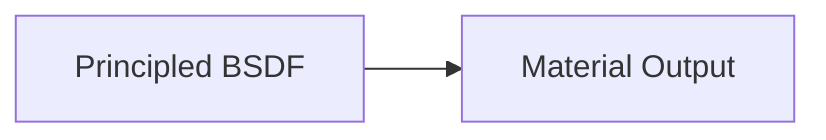
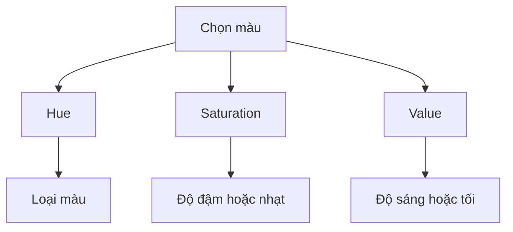
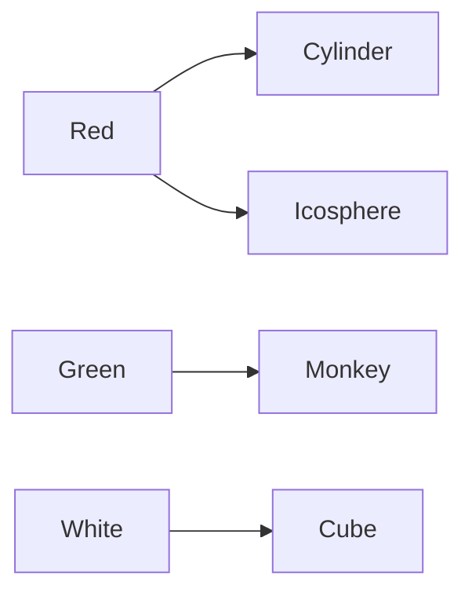
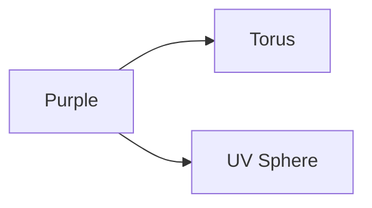
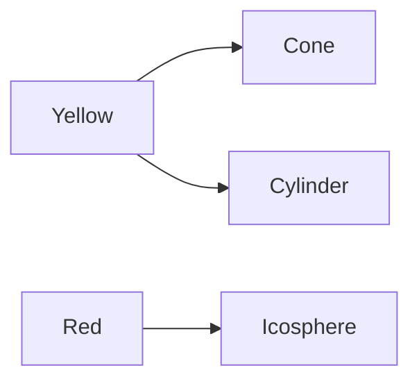
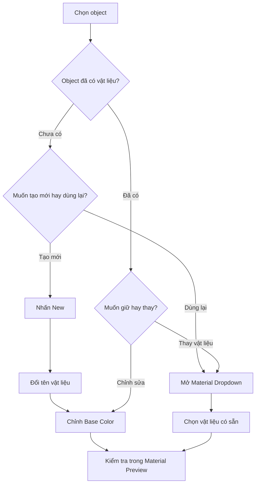
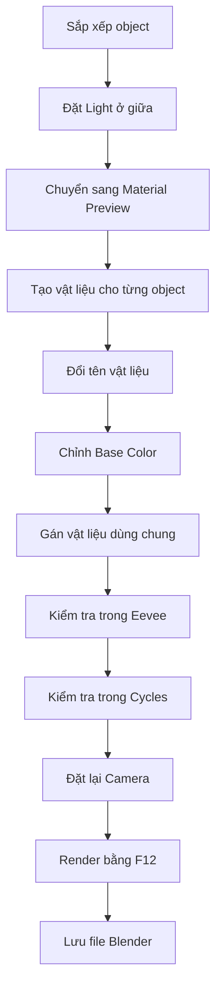

# 008 — Material Colours

| Thuộc tính           | Nội dung                                        |
| -------------------- | ----------------------------------------------- |
| **Module**           | Module 01 — Introduction & Setup                |
| **Bài học**          | Material Colours                                |
| **Thời lượng**       | 11:03                                           |
| **Chủ đề chính**     | Tạo, đặt tên, gán và tái sử dụng vật liệu màu   |
| **Nội dung mở rộng** | So sánh hiển thị vật liệu trong Eevee và Cycles |

---

## 1. Mục tiêu bài học

Sau bài học này, người học có thể:

* Tạo một vật liệu mới trong **Material Properties** hoặc **Shader Editor**.

* Hiểu vai trò của shader **Principled BSDF**.

* Thay đổi màu vật liệu bằng tham số **Base Color**.

* Sử dụng bảng chọn màu theo Hue, Saturation và Value.

* Đặt tên vật liệu có ý nghĩa như `Red`, `Green`, `Purple`.

* Gán một vật liệu cho nhiều object khác nhau.

* Hiểu sự khác biệt giữa:

  * Tạo một vật liệu mới.
  * Gán lại một vật liệu có sẵn.
  * Chỉnh sửa vật liệu đang được nhiều object dùng chung.

* Quan sát vật liệu trong **Material Preview** và **Rendered View**.

* So sánh sơ bộ khả năng phản xạ và ánh sáng của **Eevee** với **Cycles**.

* Render scene bằng phím `F12`.

---

## 2. Chuẩn bị scene

Trước khi tạo vật liệu, bài giảng yêu cầu sắp xếp các object thành một nhóm ở giữa scene.

### 2.1. Sắp xếp các object

Có thể thực hiện trong workspace **Layout** hoặc **Shading**.

Quy trình gợi ý:

1. Chuyển viewport sang **Solid Shading** để dễ quan sát.
2. Nhấn `Numpad 7` để chuyển sang góc nhìn từ trên xuống.
3. Chọn từng object.
4. Nhấn `G` để di chuyển object vào giữa scene.
5. Nhấn `R` nếu muốn xoay object.
6. Sắp xếp các object thành một cụm tương đối gọn.

Ví dụ:

```text
             UV Sphere

     Torus      Cube      Cone

        Cylinder     Monkey
```

Không cần sắp xếp chính xác tuyệt đối. Mục tiêu là tạo một scene nhỏ có nhiều object để thực hành gán màu.

### 2.2. Di chuyển nguồn sáng

1. Chọn object **Light**.
2. Nhấn `Numpad 7` để kiểm tra vị trí từ trên xuống.
3. Nhấn `G` để đưa đèn vào giữa nhóm object.
4. Chuyển sang Front View bằng `Numpad 1`.
5. Nhấn:

```text
G → Z
```

để nâng đèn lên cao hơn.

Sau đó chuyển sang **Rendered View** để kiểm tra hướng chiếu sáng và bóng đổ.

> Khi nguồn sáng nằm phía trên chính giữa nhóm object, bóng của các vật thể thường tỏa ra theo nhiều hướng.

---

## 3. Material trong Blender là gì?

**Material** là tập hợp các thuộc tính quyết định cách bề mặt của object tương tác với ánh sáng.

Material có thể điều khiển:

* Màu sắc.
* Độ bóng.
* Độ nhám.
* Tính kim loại.
* Độ trong suốt.
* Phản xạ.
* Khả năng phát sáng.
* Chi tiết gồ ghề trên bề mặt.

Trong bài này, nội dung chỉ tập trung vào **màu sắc cơ bản**.

Các thuộc tính như reflection, metallic, roughness và bump sẽ được học ở những bài sau.

---

## 4. Material Properties và Shader Editor

Blender cung cấp hai khu vực thường dùng để quản lý vật liệu.

### Material Properties

Nằm trong **Properties Panel**, có biểu tượng hình quả cầu màu đỏ hoặc quả cầu sọc caro.

Tại đây có thể:

* Tạo vật liệu mới.
* Chọn vật liệu có sẵn.
* Đổi tên vật liệu.
* Điều chỉnh các thuộc tính cơ bản.

### Shader Editor

Shader Editor hiển thị vật liệu dưới dạng hệ thống node.

Vật liệu mặc định thường gồm hai node:



* **Principled BSDF**: xác định đặc tính bề mặt.
* **Material Output**: đưa kết quả vật liệu ra bề mặt object.

Trong bài này, chủ yếu điều chỉnh tham số **Base Color** trên node Principled BSDF.

---

## 5. Tạo vật liệu mới

### 5.1. Object đã có vật liệu

Một số object có thể đã được gán vật liệu từ trước.

Khi chọn object, Shader Editor sẽ hiển thị các node vật liệu hiện tại.

Ví dụ:

```text
Cube
└── Material
    ├── Principled BSDF
    └── Material Output
```

### 5.2. Object chưa có vật liệu

Khi chọn một object chưa có vật liệu:

1. Mở **Material Properties** hoặc Shader Editor.
2. Nhấn **New**.
3. Blender tạo một vật liệu mặc định.
4. Vật liệu mới sử dụng shader **Principled BSDF**.

Nếu scene đã có một vật liệu tên `Material`, Blender có thể tự đặt tên vật liệu tiếp theo như:

```text
Material
Material.001
Material.002
Material.003
```

Những tên này không giúp nhận biết chức năng vật liệu. Vì vậy nên đổi tên ngay sau khi tạo.

---

## 6. Đặt tên vật liệu

Có thể đổi tên vật liệu bằng cách nhấp vào ô tên vật liệu và nhập tên mới.

Ví dụ:

| Tên chưa rõ nghĩa | Tên nên sử dụng |
| ----------------- | --------------- |
| `Material`        | `White`         |
| `Material.001`    | `Red`           |
| `Material.002`    | `Green`         |
| `Material.003`    | `Purple`        |
| `Material.004`    | `Yellow`        |
| `Material.005`    | `Floor_Blue`    |

Trong những dự án lớn, có thể sử dụng quy tắc đặt tên chi tiết hơn:

```text
Wall_Red
Metal_Dark
Glass_Clear
Wood_Oak
Floor_Blue
Character_Skin
```

Tên vật liệu rõ ràng giúp:

* Dễ tìm kiếm.
* Dễ tái sử dụng.
* Hạn chế tạo vật liệu trùng lặp.
* Dễ quản lý scene có nhiều object.

---

## 7. Principled BSDF

**Principled BSDF** là shader vật lý tổng hợp được sử dụng phổ biến trong Blender.

Shader này có thể mô phỏng nhiều loại vật liệu:

* Nhựa.
* Kim loại.
* Gỗ.
* Da.
* Vải.
* Sơn.
* Kính.
* Cao su.

Trong bài này, chỉ cần quan tâm đến tham số đầu tiên:

```text
Principled BSDF
└── Base Color
```

---

## 8. Base Color

**Base Color** quyết định màu sắc gốc của vật liệu.

Có thể hiểu đây là màu của bề mặt trước khi tính thêm:

* Phản xạ.
* Độ bóng.
* Ánh sáng.
* Bóng đổ.
* Texture.
* Hiệu ứng môi trường.

### Cách thay đổi Base Color

1. Chọn object.
2. Chọn hoặc tạo vật liệu.
3. Tìm node **Principled BSDF**.
4. Nhấp vào ô màu cạnh **Base Color**.
5. Chọn màu trong bảng Color Picker.

---

## 9. Color Picker

Color Picker cho phép lựa chọn màu bằng nhiều phương pháp.

### 9.1. Hue

**Hue** xác định loại màu.

Ví dụ:

* Đỏ.
* Cam.
* Vàng.
* Xanh lá.
* Xanh lam.
* Tím.

Trong vòng tròn màu, Hue thay đổi khi di chuyển quanh chu vi.

```text
Đỏ → Cam → Vàng → Xanh lá → Xanh lam → Tím → Đỏ
```

### 9.2. Saturation

**Saturation** là độ bão hòa của màu.

* Gần mép ngoài: màu đậm và bão hòa cao.
* Gần tâm: màu nhạt, gần xám hoặc trắng hơn.

```text
Tâm vòng màu               Mép vòng màu
Ít bão hòa  ────────────>  Bão hòa cao
```

### 9.3. Value

**Value** là độ sáng hoặc tối của màu.

* Value cao: màu sáng.
* Value thấp: màu tối.
* Value bằng `0`: màu đen.

### 9.4. Alpha

**Alpha** liên quan đến độ trong suốt.

Trong bài này chưa cần điều chỉnh Alpha vì để tạo vật liệu trong suốt còn cần cấu hình thêm các thuộc tính khác.

### 9.5. Mô hình HSV



---

## 10. Điều hướng trong Shader Editor

Shader Editor sử dụng các thao tác điều hướng gần giống viewport.

| Thao tác              | Điều khiển            |
| --------------------- | --------------------- |
| Phóng to hoặc thu nhỏ | Cuộn con lăn chuột    |
| Di chuyển vùng nhìn   | Giữ chuột giữa và kéo |
| Frame node đang chọn  | `Numpad .`            |
| Hiển thị toàn bộ node | `Home`                |
| Chọn node             | Nhấp chuột trái       |

### Frame Selected

Nếu một node đang được chọn, nhấn:

```text
Numpad .
```

để đưa node đó vào giữa màn hình.

### Frame All

Nhấn:

```text
Home
```

để hiển thị toàn bộ hệ thống node.

Các lệnh này cũng có thể tìm thấy trong menu:

```text
View
├── Frame Selected
└── Frame All
```

---

## 11. Gán màu đỏ cho Cylinder

Quy trình thực hành đầu tiên:

1. Chọn **Cylinder**.
2. Nhấn **New** để tạo vật liệu.
3. Đổi tên vật liệu thành:

```text
Red
```

4. Nhấp vào **Base Color**.
5. Di chuyển Hue sang vùng màu đỏ.
6. Điều chỉnh Saturation và Value theo ý muốn.

Kết quả:

```text
Cylinder
└── Material: Red
```

---

## 12. Gán màu xanh lá cho Monkey

1. Chọn object **Monkey**.
2. Nhấn **New**.
3. Đổi tên vật liệu thành:

```text
Green
```

4. Thay đổi Base Color sang màu xanh lá.

Kết quả:

```text
Monkey
└── Material: Green
```

---

## 13. Tái sử dụng vật liệu

Một vật liệu có thể được dùng bởi nhiều object.

Có thể hình dung vật liệu giống như một **hũ sơn không bao giờ hết**:

```text
                  Material: Red
                       │
          ┌────────────┼────────────┐
          │            │            │
      Cylinder     Icosphere       Cube
```

Các object không chứa bản sao riêng của màu đỏ. Chúng cùng tham chiếu đến một vật liệu có tên `Red`.

### Cách gán vật liệu có sẵn

1. Chọn object chưa có vật liệu.
2. Không nhấn **New**.
3. Mở danh sách thả xuống của vật liệu.
4. Chọn vật liệu có sẵn.

Ví dụ, để gán vật liệu `Red` cho Icosphere:

```text
Chọn Icosphere
→ Mở Material Dropdown
→ Chọn Red
```

Sau đó:

```text
Cylinder ───┐
            ├── Material: Red
Icosphere ──┘
```

---

## 14. Thay đổi vật liệu dùng chung

Khi nhiều object sử dụng cùng một vật liệu, chỉnh sửa vật liệu đó sẽ cập nhật tất cả object liên quan.

Ví dụ:

```text
Cylinder ───┐
            ├── Red
Icosphere ──┘
```

Nếu thay đổi `Red` từ đỏ sáng sang đỏ tối:

```text
Red sáng → Red tối
```

thì cả Cylinder và Icosphere đều chuyển sang đỏ tối.

### Nguyên tắc quan trọng

> Chỉnh sửa vật liệu không chỉ ảnh hưởng đến object đang chọn mà ảnh hưởng đến tất cả object đang sử dụng vật liệu đó.

Đây là một tính năng hữu ích khi nhiều object cần có bề mặt giống nhau.

Ví dụ:

* Nhiều bức tường dùng chung một loại sơn.
* Nhiều phần kim loại dùng chung vật liệu thép.
* Nhiều chiếc ghế dùng chung vật liệu gỗ.
* Các bánh xe dùng chung vật liệu cao su.

---

## 15. Thay đổi vật liệu của object

Một object đang dùng vật liệu này có thể được chuyển sang vật liệu khác.

Ví dụ Cube đang dùng vật liệu `Red`, nhưng muốn chuyển về `White`:

```text
Chọn Cube
→ Material Dropdown
→ Chọn White
```

Việc này không xóa vật liệu `Red`. Nó chỉ thay đổi vật liệu đang được gán cho Cube.

---

## 16. Bài thực hành gán màu

### Yêu cầu 1

Gán vật liệu như sau:

| Object    | Vật liệu |
| --------- | -------- |
| Cylinder  | Red      |
| Icosphere | Red      |
| Monkey    | Green    |
| Cube      | White    |

Mối quan hệ vật liệu:



### Yêu cầu 2

1. Chọn **Torus**.
2. Tạo vật liệu mới tên `Purple`.
3. Đổi Base Color sang màu tím.
4. Chọn **UV Sphere**.
5. Gán lại vật liệu `Purple`.



### Yêu cầu 3

1. Chọn **Cone**.
2. Tạo vật liệu mới tên `Yellow`.
3. Chọn màu vàng.
4. Chọn **Cylinder**.
5. Thay vật liệu `Red` bằng `Yellow`.

Kết quả:



### Yêu cầu 4

Chọn object mặt sàn và tạo vật liệu riêng.

Ví dụ:

```text
Tên vật liệu: Floor_Blue
Base Color: Xanh lam nhạt
```

---

## 17. Sơ đồ quy trình tạo và gán vật liệu



---

## 18. Material Preview và Rendered View

Màu vật liệu được quan sát rõ nhất trong:

* **Material Preview**.
* **Rendered View**.

Có thể mở menu Viewport Shading bằng:

```text
Z
```

Sau đó chọn:

```text
Material Preview
```

hoặc:

```text
Rendered
```

### Material Preview

Phù hợp để:

* Kiểm tra màu nhanh.
* Chỉnh vật liệu.
* Xem texture.
* Làm việc mà không cần render toàn bộ scene.

### Rendered View

Phù hợp để:

* Kiểm tra ánh sáng thật của scene.
* Quan sát bóng đổ.
* Kiểm tra phản xạ.
* So sánh các Render Engine.

### Solid View

Solid View chủ yếu phục vụ modeling.

Mặc định, Solid View có thể không hiển thị đầy đủ Base Color của vật liệu.

Có thể thay đổi trong:

```text
Viewport Shading Dropdown
└── Color
    └── Material
```

---

## 19. So sánh Eevee và Cycles

Bài giảng thử quan sát scene bằng cả hai Render Engine.

### Eevee

Eevee là render engine thời gian thực.

Ưu điểm:

* Hiển thị nhanh.
* Phù hợp để xem trước.
* Render nhanh hơn.
* Thích hợp cho animation thời gian thực và scene cần tốc độ.

Hạn chế:

* Ánh sáng phản xạ và ánh sáng dội có thể kém chính xác hơn Cycles.
* Một số hiệu ứng cần bật thêm tùy chọn.

### Cycles

Cycles là render engine theo phương pháp path tracing.

Ưu điểm:

* Ánh sáng chân thực hơn.
* Phản xạ rõ hơn.
* Có ánh sáng dội giữa các object.
* Bóng đổ thường chi tiết và tự nhiên hơn.

Hạn chế:

* Render chậm hơn.
* Cần nhiều tài nguyên phần cứng hơn.
* Viewport có thể xuất hiện nhiễu trong lúc tính toán.

### Bảng so sánh

| Tiêu chí            | Eevee                | Cycles           |
| ------------------- | -------------------- | ---------------- |
| Tốc độ viewport     | Nhanh                | Chậm hơn         |
| Tốc độ render       | Nhanh                | Chậm hơn         |
| Phản xạ             | Gần đúng             | Chính xác hơn    |
| Ánh sáng dội        | Hạn chế hơn          | Tự nhiên hơn     |
| Nhiễu khi xem trước | Ít                   | Có thể có        |
| Phù hợp             | Xem nhanh, animation | Render chân thực |

---

## 20. Ánh sáng dội màu

Trong Cycles, ánh sáng có thể dội từ một object màu sang bề mặt xung quanh.

Ví dụ:

```text
Ánh sáng
    ↓
Monkey màu xanh lá
    ↓
Ánh sáng xanh lá phản xạ nhẹ xuống mặt sàn
```

Hiện tượng này được gọi là **color bleeding** hoặc ánh sáng dội màu.

Cycles thường thể hiện hiệu ứng này rõ hơn Eevee.

---

## 21. Ray Tracing trong Eevee

Trong các phiên bản Blender mới, Eevee có tùy chọn **Ray Tracing** để cải thiện một số hiệu ứng ánh sáng và phản xạ.

Vị trí:

```text
Render Properties
└── Ray Tracing
```

Khi bật tùy chọn này:

* Một số phản xạ xuất hiện rõ hơn.
* Chất lượng ánh sáng được cải thiện.
* Eevee có thể gần giống Cycles hơn trong một số trường hợp.

Tuy nhiên:

* Phản xạ vẫn có thể không chính xác bằng Cycles.
* Chất lượng phụ thuộc vào scene và cấu hình render.
* Giao diện có thể khác giữa các phiên bản Blender.

> Trong các phiên bản Blender cũ, một số chức năng tương tự được quản lý bằng Ambient Occlusion và Screen Space Reflections.

---

## 22. Đặt camera để render

Sau khi hoàn thành màu sắc cho scene, cần đặt lại camera.

### Chuyển sang Camera View

Nhấn:

```text
Numpad 0
```

### Điều chỉnh camera qua viewport

Mở Sidebar bằng `N`, sau đó bật:

```text
View
└── Lock
    └── Camera to View
```

Khi bật **Camera to View**, các thao tác điều hướng viewport sẽ di chuyển camera.

Điều chỉnh góc nhìn sao cho:

* Tất cả object nằm trong khung hình.
* Không có object bị cắt.
* Nhìn rõ màu của từng object.
* Mặt sàn và bóng đổ được hiển thị hợp lý.

Sau khi đặt camera xong, nên tắt **Camera to View** để tránh vô tình làm thay đổi camera.

---

## 23. Render scene

Phím tắt render ảnh tĩnh:

```text
F12
```

### Render bằng Eevee

1. Mở **Render Properties**.
2. Chọn Render Engine là **Eevee**.
3. Nhấn `F12`.
4. Ghi lại thời gian render.

### Render bằng Cycles

1. Đóng cửa sổ kết quả render nếu cần.
2. Chuyển Render Engine sang **Cycles**.
3. Nhấn `F12`.
4. Ghi lại thời gian render.
5. So sánh với Eevee.

### Bảng ghi kết quả

| Render Engine | Thời gian render | Nhận xét                         |
| ------------- | ---------------: | -------------------------------- |
| Eevee         |           … giây | Nhanh, phản xạ đơn giản          |
| Cycles        |           … giây | Chậm hơn, ánh sáng chân thực hơn |

Thời gian render phụ thuộc vào:

* CPU hoặc GPU.
* Độ phân giải.
* Số lượng samples.
* Độ phức tạp của scene.
* Số lượng nguồn sáng.
* Hiệu ứng phản xạ.
* Render Engine đang sử dụng.

---

## 24. Quy trình thực hành hoàn chỉnh



---

## 25. Phím tắt và công cụ liên quan

| Thao tác                           | Phím tắt hoặc vị trí         |
| ---------------------------------- | ---------------------------- |
| Chọn object                        | Chuột trái                   |
| Di chuyển object                   | `G`                          |
| Di chuyển theo trục Z              | `G` → `Z`                    |
| Xoay object                        | `R`                          |
| Scale object                       | `S`                          |
| Top View                           | `Numpad 7`                   |
| Front View                         | `Numpad 1`                   |
| Camera View                        | `Numpad 0`                   |
| Mở Shading Pie Menu                | `Z`                          |
| Material Preview                   | `Z` → Material Preview       |
| Rendered View                      | `Z` → Rendered               |
| Frame Selected trong Shader Editor | `Numpad .`                   |
| Frame All trong Shader Editor      | `Home`                       |
| Render ảnh                         | `F12`                        |
| Mở Sidebar                         | `N`                          |
| Tạo vật liệu mới                   | Material Properties → New    |
| Chọn vật liệu có sẵn               | Material Dropdown            |
| Đổi Base Color                     | Principled BSDF → Base Color |

---

## 26. Lỗi thường gặp

### 26.1. Không nhìn thấy màu vật liệu

**Nguyên nhân:** Viewport đang ở Solid View mặc định.

**Cách khắc phục:**

```text
Z → Material Preview
```

hoặc:

```text
Z → Rendered
```

Ngoài ra có thể đổi Solid View Color sang `Material`.

---

### 26.2. Nhấn New cho mọi object

**Vấn đề:** Mỗi object có một vật liệu riêng dù chúng cần cùng màu.

Ví dụ không nên:

```text
Red
Red.001
Red.002
Red.003
```

Nên tạo một vật liệu `Red` và gán lại cho nhiều object.

---

### 26.3. Đổi màu một object nhưng object khác cũng đổi theo

**Nguyên nhân:** Hai object đang dùng chung một vật liệu.

Ví dụ:

```text
Cylinder ───┐
            ├── Red
Icosphere ──┘
```

Khi chỉnh `Red`, cả hai object đều thay đổi.

Đây không phải lỗi mà là nguyên lý hoạt động của vật liệu dùng chung.

---

### 26.4. Tên vật liệu khó hiểu

Các tên như `Material.001` hoặc `Material.002` sẽ khó quản lý khi scene lớn.

Nên đổi thành tên mô tả rõ màu sắc hoặc chất liệu.

---

### 26.5. Màu đúng nhưng vật liệu chưa giống kim loại hoặc nhựa

Base Color chỉ quyết định màu gốc.

Các đặc tính khác được điều khiển bởi:

* Metallic.
* Roughness.
* Specular.
* Transmission.
* Coat.
* Normal.
* Bump.

Những thuộc tính này sẽ được học trong các bài tiếp theo.

---

### 26.6. Màu hiển thị khác khi chuyển Render Engine

Eevee và Cycles tính ánh sáng khác nhau nên màu cảm nhận có thể thay đổi do:

* Phản xạ.
* Ánh sáng dội.
* Bóng đổ.
* Môi trường.
* Color Management.

Cần kiểm tra vật liệu trong Render Engine sẽ dùng cho sản phẩm cuối.

---

### 26.7. Vô tình di chuyển camera khi zoom

**Nguyên nhân:** Đang bật `Camera to View`.

Sau khi đặt camera xong nên tắt:

```text
N → View → Lock → Camera to View
```

---

## 27. Bài tập thực hành

### Bài tập bắt buộc

Tạo scene với các vật liệu:

| Object    | Material |
| --------- | -------- |
| Cube      | White    |
| Monkey    | Green    |
| Torus     | Purple   |
| UV Sphere | Purple   |
| Cone      | Yellow   |
| Cylinder  | Yellow   |
| Icosphere | Red      |
| Floor     | Blue     |

### Yêu cầu

* Đặt tên rõ ràng cho mọi vật liệu.
* Torus và UV Sphere phải dùng chung vật liệu `Purple`.
* Cone và Cylinder phải dùng chung vật liệu `Yellow`.
* Khi chỉnh màu tím, Torus và UV Sphere phải cùng thay đổi.
* Khi chỉnh màu vàng, Cone và Cylinder phải cùng thay đổi.
* Đặt lại camera để toàn bộ scene nằm trong khung hình.
* Render bằng cả Eevee và Cycles.
* So sánh thời gian và chất lượng hình ảnh.
* Lưu file sau khi hoàn thành.

---

## 28. Checklist thực hành

### Chuẩn bị scene

* [ ] Đã di chuyển các object thành một cụm ở giữa.
* [ ] Đã đưa nguồn sáng lên phía trên nhóm object.
* [ ] Đã kiểm tra scene trong Rendered View.

### Material

* [ ] Đã tạo được ít nhất một vật liệu mới.
* [ ] Đã đổi tên vật liệu.
* [ ] Đã thay đổi Base Color.
* [ ] Đã hiểu Hue, Saturation và Value.
* [ ] Đã gán một vật liệu cho nhiều object.
* [ ] Đã quan sát nhiều object thay đổi khi chỉnh vật liệu dùng chung.
* [ ] Không tạo quá nhiều vật liệu trùng lặp.

### Hiển thị và render

* [ ] Đã xem vật liệu trong Material Preview.
* [ ] Đã xem vật liệu trong Eevee.
* [ ] Đã xem vật liệu trong Cycles.
* [ ] Đã thử bật Ray Tracing trong Eevee nếu phiên bản hỗ trợ.
* [ ] Đã đặt lại camera.
* [ ] Đã render scene bằng `F12`.
* [ ] Đã ghi lại thời gian render của Eevee và Cycles.
* [ ] Đã lưu file Blender.

---

## 29. Ghi nhớ nhanh

```text
New
↓
Tạo vật liệu mới

Material Dropdown
↓
Chọn vật liệu đã tồn tại

Base Color
↓
Màu sắc gốc của vật liệu

Nhiều object dùng chung một material
↓
Chỉnh material một lần, tất cả object cùng cập nhật

Eevee
↓
Nhanh hơn

Cycles
↓
Ánh sáng và phản xạ chân thực hơn

F12
↓
Render ảnh
```

---

## 30. Tóm tắt

Material trong Blender quyết định cách bề mặt của object hiển thị và phản ứng với ánh sáng. Vật liệu mặc định thường sử dụng shader **Principled BSDF**, trong đó **Base Color** là tham số cơ bản quyết định màu sắc gốc.

Mỗi vật liệu nên được đặt tên rõ ràng và có thể được tái sử dụng cho nhiều object. Khi nhiều object dùng chung một vật liệu, mọi thay đổi trên vật liệu đó sẽ tự động áp dụng cho tất cả các object liên quan.

Màu vật liệu nên được kiểm tra trong **Material Preview** hoặc **Rendered View**. Eevee cho tốc độ nhanh, trong khi Cycles thường cho ánh sáng, phản xạ và ánh sáng dội chân thực hơn. Sau khi hoàn thiện scene, có thể đặt camera và nhấn `F12` để render hình ảnh.
