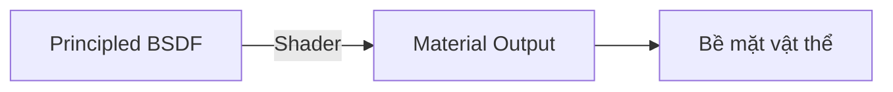
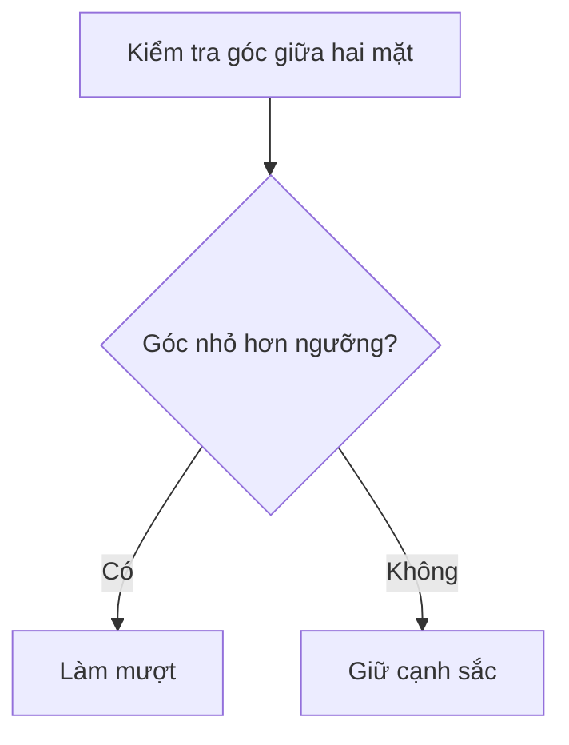
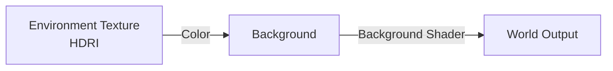
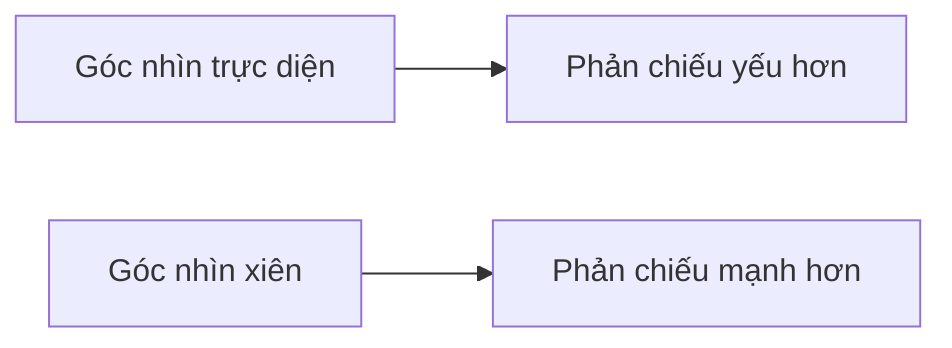
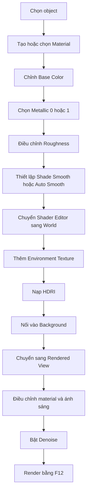

# 009 — Material Reflections

| Thuộc tính        | Nội dung                                     |
| ----------------- | -------------------------------------------- |
| **Module**        | Module 01 — Introduction & Setup             |
| **Bài học**       | Material Reflections                         |
| **Thời lượng**    | 13:38                                        |
| **Chủ đề chính**  | Độ phản chiếu của vật liệu                   |
| **Công cụ chính** | Principled BSDF, HDRI, Shade Smooth, Denoise |

---

## 1. Mục tiêu bài học

Sau khi hoàn thành bài học, người học có thể:

* Hiểu vai trò của hai tham số **Metallic** và **Roughness** trong shader Principled BSDF.
* Phân biệt vật liệu **kim loại** và **phi kim loại**.
* Tạo vật liệu kim loại bóng, kim loại nhám, nhựa bóng và nhựa mờ.
* Hiểu ảnh hưởng của môi trường đối với độ phản chiếu của vật liệu.
* Thiết lập ảnh **HDRI** làm môi trường chiếu sáng và phản chiếu.
* Sử dụng đúng **Environment Texture** trong World Shader.
* Phân biệt `Shade Smooth`, `Shade Flat` và `Shade Auto Smooth`.
* Biết cách giảm thời gian render bằng **Time Limit** và **Denoise**.
* Nhận biết lỗi texture bị mất thông qua màu hồng đặc trưng của Blender.

---

## 2. Các thành phần quan trọng của Principled BSDF

**Principled BSDF** là shader mặc định được Blender sử dụng để mô phỏng nhiều loại vật liệu thực tế.

Bốn thành phần cơ bản quan trọng nhất gồm:

| Thành phần     | Chức năng                                      |
| -------------- | ---------------------------------------------- |
| **Base Color** | Màu nền của vật liệu                           |
| **Metallic**   | Xác định vật liệu là kim loại hay phi kim loại |
| **Roughness**  | Kiểm soát độ nhám và độ sắc nét của phản chiếu |
| **Normal**     | Kiểm soát cảm giác lồi lõm, gồ ghề của bề mặt  |

> Giao diện Principled BSDF có thể thay đổi nhẹ giữa các phiên bản Blender, đặc biệt từ Blender 4.x, nhưng nguyên lý hoạt động vẫn giống nhau.

### Sơ đồ cơ bản của vật liệu



Trong Shader Editor, dữ liệu thường được truyền từ **trái sang phải**.

---

## 3. Metallic — Tính chất kim loại

Tham số **Metallic** xác định vật liệu có phải là kim loại hay không.

| Giá trị | Ý nghĩa                                                     |
| ------: | ----------------------------------------------------------- |
|     `0` | Vật liệu phi kim loại                                       |
|     `1` | Vật liệu kim loại                                           |
|   `0–1` | Giá trị trung gian, chủ yếu dùng để tạo hiệu ứng nghệ thuật |

### 3.1. Vật liệu phi kim loại

Các vật liệu phi kim phổ biến gồm:

* Nhựa
* Gỗ
* Vải
* Da
* Đá
* Gốm
* Cao su

Các vật liệu này thường sử dụng:

```text
Metallic = 0
```

### 3.2. Vật liệu kim loại

Các vật liệu kim loại phổ biến gồm:

* Sắt
* Thép
* Nhôm
* Đồng
* Vàng
* Bạc

Các vật liệu này thường sử dụng:

```text
Metallic = 1
```

Kim loại không biểu hiện màu sắc theo cách giống nhựa hoặc gỗ. Phần lớn màu sắc và hình ảnh nhìn thấy trên kim loại đến từ:

* Màu Base Color.
* Ánh sáng trong scene.
* Môi trường xung quanh.
* Các vật thể được phản chiếu.

> Theo nguyên tắc vật lý, vật liệu thực tế thường có `Metallic = 0` hoặc `Metallic = 1`. Giá trị trung gian có thể được dùng để tạo hiệu ứng đặc biệt, nhưng ít chính xác về mặt vật lý.

---

## 4. Roughness — Độ nhám bề mặt

**Roughness** kiểm soát mức độ sắc nét hoặc mờ của phản chiếu.

| Roughness | Kết quả                             |
| --------: | ----------------------------------- |
|     `0.0` | Phản chiếu rất sắc, gần giống gương |
| `0.1–0.3` | Bề mặt bóng, phản chiếu rõ          |
| `0.4–0.6` | Phản chiếu mờ vừa phải              |
| `0.7–0.9` | Bề mặt nhám, phản chiếu rất mờ      |
|     `1.0` | Bề mặt mờ gần như hoàn toàn         |

### 4.1. Roughness thấp

Khi Roughness gần `0`:

* Phản chiếu sắc nét.
* Điểm sáng nhỏ và rõ.
* Vật liệu có cảm giác bóng.
* Có thể trông giống gương hoặc kim loại đánh bóng.

### 4.2. Roughness cao

Khi Roughness gần `1`:

* Phản chiếu bị khuếch tán.
* Điểm sáng rộng và mềm.
* Bề mặt có cảm giác thô hoặc mờ.
* Kim loại có thể không còn trông rõ tính chất kim loại nếu độ nhám quá cao.

### Lưu ý quan trọng

Roughness không trực tiếp quyết định vật thể có “sáng hơn” hay không. Nó chủ yếu quyết định:

* Độ sắc nét của phản chiếu.
* Độ rộng của vùng highlight.
* Cảm giác nhẵn hoặc thô của bề mặt.

---

## 5. Kết hợp Metallic và Roughness

Metallic và Roughness cần được kết hợp để tạo ra cảm giác vật liệu phù hợp.

| Loại vật liệu      | Metallic | Roughness gợi ý |
| ------------------ | -------: | --------------: |
| Kim loại đánh bóng |    `1.0` |     `0.05–0.15` |
| Kim loại bóng vừa  |    `1.0` |      `0.2–0.35` |
| Kim loại xước      |    `1.0` |       `0.4–0.6` |
| Kim loại cũ, thô   |    `1.0` |       `0.7–0.9` |
| Nhựa bóng          |    `0.0` |     `0.15–0.35` |
| Nhựa mờ            |    `0.0` |      `0.6–0.85` |
| Cao su             |    `0.0` |     `0.75–0.95` |
| Gỗ đánh bóng       |    `0.0` |     `0.25–0.45` |
| Gỗ thô             |    `0.0` |      `0.6–0.85` |

### So sánh nhanh

```text
Metallic = 1 + Roughness thấp
→ Kim loại bóng, phản chiếu rõ

Metallic = 1 + Roughness cao
→ Kim loại thô hoặc kim loại xước

Metallic = 0 + Roughness thấp
→ Nhựa hoặc gốm bóng

Metallic = 0 + Roughness cao
→ Nhựa mờ, cao su hoặc bề mặt thô
```

> Trong thực tế, rất ít bề mặt có Roughness bằng `0` tuyệt đối. Tăng Roughness lên một lượng nhỏ thường tạo kết quả tự nhiên hơn.

---

## 6. Vật liệu được chia sẻ giữa nhiều object

Trong scene, nhiều object có thể cùng sử dụng một material.

Ví dụ:

```text
Sphere ─┐
        ├── Purple Material
Torus ──┘
```

Khi thay đổi Metallic hoặc Roughness của `Purple Material`, cả Sphere và Torus đều thay đổi.

### Dấu hiệu nhận biết

Nếu hai object cùng thay đổi màu sắc hoặc độ phản chiếu khi chỉnh material, chúng có thể đang chia sẻ cùng một material datablock.

### Tạo material riêng cho một object

Để object không còn bị ảnh hưởng bởi material dùng chung:

1. Chọn object.
2. Mở **Material Properties** hoặc Shader Editor.
3. Kiểm tra material đang được sử dụng.
4. Nhấn nút tạo bản sao material hoặc ngắt material hiện tại.
5. Chọn `New` để tạo material riêng.
6. Đặt tên material rõ ràng.

Ví dụ:

```text
MAT_Metal_Polished
MAT_Metal_Rough
MAT_Plastic_Glossy
MAT_Plastic_Matte
```

---

## 7. Làm mịn bề mặt vật thể

Độ phản chiếu làm cho các mặt polygon và khuyết điểm trên bề mặt dễ nhìn thấy hơn. Vì vậy, cần thiết lập shading phù hợp.

---

### 7.1. Shade Flat

`Shade Flat` là chế độ mặc định, trong đó mỗi mặt polygon được hiển thị riêng biệt.

Kết quả:

* Các mặt phẳng nhìn rõ.
* Vật thể có cảm giác góc cạnh.
* Phù hợp với phong cách low-poly.

Cách sử dụng:

1. Chọn object.
2. Nhấn chuột phải.
3. Chọn `Shade Flat`.

---

### 7.2. Shade Smooth

`Shade Smooth` làm mượt cách ánh sáng chuyển tiếp giữa các mặt polygon.

Cách sử dụng:

1. Chọn object.
2. Nhấn chuột phải.
3. Chọn `Shade Smooth`.

Phù hợp với:

* UV Sphere.
* Torus.
* Các bề mặt cong.
* Vật thể hữu cơ.

### Điều cần lưu ý

`Shade Smooth` không làm tăng số lượng polygon và không thay đổi hình học thật của object.

```text
Shade Smooth
    ↓
Thay đổi cách ánh sáng được nội suy
    ↓
Không thêm mặt
Không tăng độ phân giải mesh
Không sửa đường viền silhouette
```

Ví dụ, một Icosphere ít mặt vẫn có đường viền hơi góc cạnh dù đã sử dụng `Shade Smooth`.

---

### 7.3. Shade Auto Smooth

Nếu sử dụng `Shade Smooth` cho Cylinder hoặc Cone, các cạnh 90° có thể bị làm mềm không mong muốn.

`Shade Auto Smooth` giúp:

* Giữ các mặt cong được mượt.
* Giữ các cạnh có góc lớn được sắc.
* Tránh hiện tượng nắp Cylinder hoặc đáy Cone trông bị bo tròn.

Cách sử dụng:

1. Chọn Cylinder hoặc Cone.
2. Nhấn chuột phải.
3. Chọn `Shade Auto Smooth`.

Trong Blender 4.x, thao tác này có thể thêm thiết lập hoặc modifier **Smooth by Angle**.

### Nguyên lý Smooth by Angle



Ví dụ với ngưỡng `30°`:

* Các cạnh có góc nhỏ hơn `30°` được làm mượt.
* Các cạnh có góc lớn hơn `30°` được giữ sắc.

Nếu tăng ngưỡng vượt quá `90°`, các cạnh vuông có thể bị làm mềm.

---

## 8. Vì sao kim loại trông tối hoặc không phản chiếu đẹp?

Một bề mặt kim loại cần có môi trường để phản chiếu.

Nếu scene chỉ có nền xám đơn giản:

* Kim loại chủ yếu phản chiếu nền xám.
* Hình ảnh có thể tối hoặc thiếu chi tiết.
* Vật liệu có thể trông không hấp dẫn dù Metallic và Roughness đã đúng.

```text
Kim loại đẹp
= Material phù hợp
+ Ánh sáng phù hợp
+ Môi trường có chi tiết để phản chiếu
```

Đây là lý do vật liệu có thể trông đẹp trong **Material Preview** nhưng kém hấp dẫn trong **Rendered View**.

---

## 9. Material Preview và Rendered View

### Material Preview

Material Preview sử dụng môi trường studio giả lập có sẵn của Blender.

Ưu điểm:

* Nhanh.
* Dễ quan sát material.
* Không cần tự thiết lập ánh sáng.
* Phù hợp để chỉnh Base Color, Metallic và Roughness ban đầu.

Hạn chế:

* Không phản ánh hoàn toàn ánh sáng thật của scene.
* Môi trường phản chiếu có thể khác kết quả render cuối cùng.

### Rendered View

Rendered View sử dụng:

* Render Engine hiện tại.
* World của scene.
* Đèn thật trong scene.
* HDRI đã thiết lập.
* Các thiết lập render thực tế.

Phím tắt:

```text
Z → Rendered
```

> Nên sử dụng Material Preview để chỉnh nhanh và Rendered View để đánh giá kết quả cuối cùng.

---

## 10. HDRI là gì?

**HDRI** là viết tắt của **High Dynamic Range Image**.

HDRI thường là ảnh toàn cảnh 360° chứa thông tin ánh sáng với dải sáng rộng. Khi được dùng làm World Environment, HDRI có thể:

* Tạo ánh sáng môi trường.
* Tạo màu sắc tổng thể cho scene.
* Tạo phản chiếu trên kim loại và vật liệu bóng.
* Tạo bóng đổ mềm hoặc sắc.
* Giúp scene trông chân thực hơn.

### Ảnh hưởng của từng loại HDRI

| Loại HDRI            | Ảnh hưởng                                          |
| -------------------- | -------------------------------------------------- |
| Trời nhiều mây       | Bóng mềm, ánh sáng dịu                             |
| Trời nắng mạnh       | Bóng sắc, tương phản cao                           |
| Hoàng hôn            | Ánh sáng vàng, cam hoặc hồng                       |
| Môi trường thành phố | Phản chiếu nhiều chi tiết kiến trúc                |
| Studio               | Ánh sáng kiểm soát tốt, phù hợp trình bày sản phẩm |
| Nội thất             | Tạo phản chiếu cửa sổ, tường và đèn trong phòng    |

> Màu sắc của HDRI cũng ảnh hưởng trực tiếp đến màu ánh sáng và phản chiếu trên vật thể.

---

## 11. Thiết lập HDRI trong World Shader

### 11.1. Chuyển Shader Editor sang World

Trong Shader Editor:

1. Mở menu loại shader ở góc trên bên trái.
2. Chuyển từ `Object` sang `World`.
3. Quan sát hai node mặc định:

```text
Background → World Output
```

Nếu không nhìn thấy node, nhấn:

```text
Home
```

để hiển thị toàn bộ node trong Shader Editor.

---

### 11.2. Thêm Environment Texture

Để thêm HDRI:

1. Trong Shader Editor, chọn chế độ `World`.
2. Nhấn `Shift + A`.
3. Chọn `Texture`.
4. Chọn `Environment Texture`.
5. Nhấn `Open`.
6. Chọn file HDRI.
7. Nối đầu ra `Color` của Environment Texture với đầu vào `Color` của Background.

### Sơ đồ node HDRI



Hoặc biểu diễn đơn giản:

```text
Environment Texture: Color
            │
            ▼
Background: Color
            │
            ▼
World Output: Surface
```

### Lưu ý

Phải sử dụng:

```text
Environment Texture
```

Không nên sử dụng:

```text
Image Texture
```

`Environment Texture` được thiết kế để đọc ảnh môi trường toàn cảnh và ánh xạ chúng xung quanh scene.

---

## 12. Màu socket và cách nối node

Các socket trên node được phân biệt bằng màu.

| Màu socket | Loại dữ liệu thường gặp |
| ---------- | ----------------------- |
| Vàng       | Color                   |
| Xám        | Value                   |
| Xanh lá    | Shader                  |
| Tím        | Vector                  |

Khi nối node, nên nối các socket có loại dữ liệu tương thích.

Ví dụ:

```text
Color màu vàng → Color màu vàng
Shader màu xanh lá → Surface màu xanh lá
```

Các đường nối giữa node thường được gọi không chính thức là **noodles**.

---

## 13. Điều chỉnh độ sáng của HDRI

Node `Background` có tham số **Strength**.

|    Strength | Kết quả             |
| ----------: | ------------------- |
| Nhỏ hơn `1` | Môi trường tối hơn  |
|         `1` | Cường độ mặc định   |
| Lớn hơn `1` | Môi trường sáng hơn |

Ví dụ:

```text
Environment Texture → Background → World Output
                           ↑
                       Strength
```

Tăng Strength làm scene sáng hơn, nhưng không thay thế cho việc chọn một HDRI phù hợp.

---

## 14. Lỗi scene chuyển sang màu hồng

Trong Blender, màu hồng hoặc magenta thường cho biết chương trình không tìm thấy file ảnh hoặc texture.

Nguyên nhân phổ biến:

* File HDRI đã bị di chuyển.
* File đã bị đổi tên.
* File đã bị xóa.
* Project được mở trên máy khác.
* Đường dẫn tới texture không còn chính xác.

### Cách xử lý

1. Mở node `Environment Texture`.
2. Nhấn `Open`.
3. Chọn lại file HDRI.
4. Hoặc chọn lại ảnh từ danh sách ảnh đã được nạp vào Blender.
5. Lưu lại file `.blend`.

### Đóng gói tài nguyên vào file Blender

Để hạn chế mất texture khi di chuyển project:

```text
File → External Data → Pack Resources
```

Thao tác này đóng gói các tài nguyên bên ngoài vào file `.blend`.

---

## 15. Quy trình thực hành hoàn chỉnh

### Bước 1: Tạo vật liệu kim loại bóng

1. Chọn UV Sphere.
2. Tạo hoặc chọn material.
3. Đặt:

```text
Metallic = 1.0
Roughness = 0.05
```

4. Nhấn chuột phải vào Sphere.
5. Chọn `Shade Smooth`.

---

### Bước 2: Quan sát ảnh hưởng của Roughness

Thử lần lượt:

```text
Roughness = 0.0
Roughness = 0.2
Roughness = 0.5
Roughness = 1.0
```

Quan sát:

* Độ sắc nét của phản chiếu.
* Kích thước vùng highlight.
* Cảm giác nhẵn hoặc thô của vật liệu.

---

### Bước 3: So sánh kim loại và nhựa

Giữ Roughness thấp và thay đổi Metallic:

```text
Metallic = 1
→ Kim loại phản chiếu môi trường

Metallic = 0
→ Bề mặt giống nhựa hoặc gốm bóng
```

---

### Bước 4: Thiết lập shading

* UV Sphere: `Shade Smooth`.
* Torus: `Shade Smooth`.
* Cylinder: `Shade Auto Smooth`.
* Cone: `Shade Auto Smooth`.

---

### Bước 5: Thêm HDRI

1. Chuyển Shader Editor sang `World`.
2. Nhấn `Shift + A`.
3. Chọn `Texture → Environment Texture`.
4. Mở file HDRI.
5. Nối `Color` vào `Background Color`.
6. Chuyển viewport sang Rendered View.

---

### Bước 6: Tạo material riêng

Nếu nhiều object đang dùng chung material:

1. Chọn từng object.
2. Tạo bản sao hoặc material mới.
3. Thử các kết hợp Metallic và Roughness khác nhau.

Ví dụ:

| Object    | Material      |
| --------- | ------------- |
| UV Sphere | Kim loại bóng |
| Icosphere | Kim loại thô  |
| Torus     | Nhựa bóng     |
| Cylinder  | Kim loại xước |
| Cone      | Nhựa mờ       |

---

### Bước 7: Render kết quả

Nhấn:

```text
F12
```

Quan sát:

* Thời gian render.
* Mức độ nhiễu.
* Phản chiếu trên vật thể.
* Bóng đổ.
* Sự khác biệt so với Material Preview.

---

## 16. Giảm thời gian render

### 16.1. Thiết lập Time Limit

Trong **Render Properties**, có thể đặt giới hạn thời gian cho quá trình render.

Ví dụ:

```text
Time Limit = 1 giây
```

Khi nhấn `F12`, Blender sẽ dừng tính toán khi đạt giới hạn thời gian.

Ưu điểm:

* Tạo bản preview nhanh.
* Kiểm tra bố cục và material.
* Không phải chờ render hoàn chỉnh.

Hạn chế:

* Có thể xuất hiện nhiễu nếu số sample chưa đủ.
* Chất lượng phụ thuộc vào độ phức tạp của scene và phần cứng.

---

## 17. Denoise — Khử nhiễu

Render bằng Cycles có thể xuất hiện các hạt nhiễu, đặc biệt ở:

* Vùng tối.
* Bề mặt bóng.
* Các góc khuất.
* Scene có ít sample.
* Scene có nguồn sáng nhỏ.

**Denoise** giúp làm sạch các hạt nhiễu sau hoặc trong quá trình render.

### Render Denoise

Trong Render Properties:

1. Tìm phần `Denoise`.
2. Bật tùy chọn khử nhiễu.
3. Render lại bằng `F12`.

Kết quả:

* Hình ảnh sạch hơn.
* Giảm hạt nhiễu.
* Có thể làm một số chi tiết nhỏ hơi mềm.

---

### Viewport Denoise

Có thể bật Denoise riêng cho Rendered Viewport.

Lợi ích:

* Di chuyển trong scene mượt hơn.
* Preview sạch hơn.
* Dễ đánh giá material và ánh sáng.
* Giảm cảm giác nhiễu khi camera đang đứng yên.

---

### OptiX Denoiser

Nếu máy sử dụng GPU NVIDIA tương thích, có thể chọn:

```text
Denoiser = OptiX
```

OptiX thường cho tốc độ khử nhiễu nhanh nhờ xử lý bằng GPU.

> Tùy chọn khả dụng phụ thuộc vào card đồ họa, driver và cấu hình render của hệ thống.

---

## 18. IOR và phản xạ phi kim loại

**IOR** là viết tắt của **Index of Refraction**, tức chỉ số khúc xạ.

Đối với vật liệu phi kim loại, IOR ảnh hưởng đến phản xạ Fresnel, đặc biệt ở các góc nhìn xiên.

| Vật liệu          |      IOR tham khảo |
| ----------------- | -----------------: |
| Không khí         |      Khoảng `1.00` |
| Nước              |      Khoảng `1.33` |
| Kính thông thường | Khoảng `1.45–1.52` |
| Nhựa              | Khoảng `1.45–1.60` |
| Kim cương         |      Khoảng `2.42` |

Trong phần lớn trường hợp:

```text
IOR = 1.5
```

là giá trị mặc định hợp lý cho nhiều vật liệu phi kim thông thường.

### Hiệu ứng Fresnel

Khi nhìn trực diện vào bề mặt phi kim:

* Phản chiếu thường yếu hơn.

Khi nhìn ở góc xiên hoặc gần rìa vật thể:

* Phản chiếu trở nên mạnh hơn.



---

## 19. Các tham số nâng cao

Ngoài Metallic và Roughness, Principled BSDF còn có một số nhóm tham số nâng cao.

| Tham số            | Công dụng                                         |
| ------------------ | ------------------------------------------------- |
| **IOR**            | Kiểm soát phản xạ và khúc xạ của vật liệu phi kim |
| **Transmission**   | Tạo vật liệu truyền sáng như kính hoặc nước       |
| **Coat/Clearcoat** | Tạo thêm một lớp phủ bóng bên ngoài               |
| **Sheen**          | Tạo phản xạ mềm thường thấy trên vải              |
| **Normal**         | Tạo cảm giác gồ ghề hoặc lồi lõm                  |
| **Emission**       | Làm vật liệu tự phát sáng                         |

Trong bài học này, người học chỉ cần tập trung chính vào:

```text
Base Color
Metallic
Roughness
```

Các tham số nâng cao sẽ được sử dụng nhiều hơn khi xây dựng những material phức tạp trong các module sau.

---

## 20. Phím tắt và công cụ liên quan

| Phím hoặc công cụ                | Chức năng                                 |
| -------------------------------- | ----------------------------------------- |
| `Z`                              | Mở Shading Pie Menu                       |
| `Z → Material Preview`           | Xem nhanh material bằng môi trường studio |
| `Z → Rendered`                   | Xem scene với ánh sáng và World thực      |
| `Shift + A`                      | Thêm node hoặc object tùy editor          |
| `Home`                           | Hiển thị toàn bộ node trong Shader Editor |
| `G`                              | Di chuyển node hoặc object                |
| `F12`                            | Render hình ảnh                           |
| `Numpad 0`                       | Vào hoặc thoát Camera View                |
| Chuột phải → `Shade Smooth`      | Làm mượt bề mặt cong                      |
| Chuột phải → `Shade Auto Smooth` | Làm mượt nhưng giữ cạnh sắc               |
| Chuột phải → `Shade Flat`        | Hiển thị từng mặt polygon                 |

---

## 21. Lỗi thường gặp

### 21.1. Metallic bằng 1 nhưng vật thể trông đen

**Nguyên nhân:** Không có môi trường hoặc vật thể đủ sáng để phản chiếu.

**Cách khắc phục:**

* Thêm HDRI.
* Thêm đèn.
* Tăng World Strength hợp lý.
* Đặt các vật thể khác quanh đối tượng để tạo chi tiết phản chiếu.

---

### 21.2. Roughness thấp nhưng vật thể không giống kim loại

**Nguyên nhân:** Metallic vẫn đang bằng `0`.

**Cách khắc phục:**

```text
Metallic = 1
Roughness = giá trị thấp
```

Roughness thấp chỉ làm vật liệu bóng, không tự động biến vật liệu thành kim loại.

---

### 21.3. Cylinder hoặc Cone bị bo tròn ở cạnh

**Nguyên nhân:** Sử dụng `Shade Smooth` trên toàn bộ object.

**Cách khắc phục:**

```text
Chuột phải → Shade Auto Smooth
```

Sau đó kiểm tra ngưỡng góc trong thiết lập `Smooth by Angle`.

---

### 21.4. Shade Smooth không làm đường viền tròn hơn

**Nguyên nhân:** Object có quá ít polygon.

`Shade Smooth` chỉ thay đổi cách tính shading, không thay đổi geometry.

**Cách khắc phục:**

* Tăng số segment khi tạo object.
* Subdivide mesh.
* Sử dụng Subdivision Surface Modifier nếu phù hợp.

---

### 21.5. Scene chuyển sang màu hồng

**Nguyên nhân:** Blender không tìm thấy HDRI hoặc texture.

**Cách khắc phục:**

* Mở lại file texture.
* Kiểm tra đường dẫn.
* Dùng `Find Missing Files`.
* Dùng `Pack Resources` trước khi di chuyển project.

---

### 21.6. Material Preview đẹp nhưng render không đẹp

**Nguyên nhân:** Material Preview sử dụng HDRI studio riêng, trong khi Rendered View sử dụng ánh sáng thật của scene.

**Cách khắc phục:**

* Kiểm tra World Shader.
* Thêm HDRI hoặc ánh sáng.
* Đánh giá vật liệu trong Rendered View.
* Render thử bằng `F12`.

---

### 21.7. Render bị nhiễu

**Nguyên nhân:**

* Sample thấp.
* Time Limit quá ngắn.
* Scene thiếu sáng.
* Nhiều bề mặt phản chiếu.
* Denoise chưa bật.

**Cách khắc phục:**

* Bật Denoise.
* Tăng Samples.
* Tăng Time Limit.
* Cải thiện ánh sáng.
* Sử dụng OptiX nếu phần cứng hỗ trợ.

---

## 22. Sơ đồ quy trình tạo vật liệu phản chiếu



---

## 23. Bài thực hành đề xuất

### Bài tập 1: Kim loại bóng

Tạo một UV Sphere với:

```text
Metallic = 1.0
Roughness = 0.08
Shade Smooth
```

Thêm HDRI thành phố hoặc studio và quan sát phản chiếu.

---

### Bài tập 2: Kim loại xước

Tạo một Cylinder với:

```text
Metallic = 1.0
Roughness = 0.45
Shade Auto Smooth
```

So sánh với Sphere kim loại bóng.

---

### Bài tập 3: Nhựa bóng

Tạo một Torus với:

```text
Metallic = 0.0
Roughness = 0.2
```

Quan sát sự khác biệt giữa vật liệu bóng phi kim và kim loại.

---

### Bài tập 4: Nhựa mờ

Tạo một Icosphere với:

```text
Metallic = 0.0
Roughness = 0.8
Shade Smooth
```

Quan sát đường viền polygon của Icosphere.

---

### Bài tập 5: So sánh HDRI

Thử ít nhất hai HDRI:

* Một HDRI trời nhiều mây.
* Một HDRI có nắng mạnh hoặc hoàng hôn.

So sánh:

* Độ sắc của bóng.
* Màu ánh sáng.
* Phản chiếu trên kim loại.
* Cảm giác tổng thể của scene.

---

### Bài tập 6: So sánh Denoise

Render hai lần với cùng Time Limit:

1. Denoise tắt.
2. Denoise bật.

Quan sát:

* Hạt nhiễu ở vùng tối.
* Chi tiết trên bề mặt.
* Độ mềm của kết quả.
* Thời gian render.

---

## 24. Checklist thực hành

### Material

* [ ] Đã tạo được vật liệu kim loại bóng.
* [ ] Đã tạo được vật liệu kim loại nhám.
* [ ] Đã tạo được vật liệu nhựa bóng.
* [ ] Đã tạo được vật liệu nhựa mờ.
* [ ] Đã thử thay đổi Metallic giữa `0` và `1`.
* [ ] Đã thử nhiều mức Roughness.

### Shading

* [ ] Đã sử dụng `Shade Smooth` cho Sphere hoặc Torus.
* [ ] Đã sử dụng `Shade Auto Smooth` cho Cylinder hoặc Cone.
* [ ] Đã hiểu Shade Smooth không thay đổi geometry.
* [ ] Đã thử điều chỉnh ngưỡng Smooth by Angle.

### HDRI

* [ ] Đã chuyển Shader Editor từ Object sang World.
* [ ] Đã thêm node Environment Texture.
* [ ] Đã nối HDRI vào Background.
* [ ] Đã quan sát phản chiếu trong Rendered View.
* [ ] Đã biết màu hồng báo hiệu texture bị mất.
* [ ] Đã lưu hoặc đóng gói tài nguyên của project.

### Render

* [ ] Đã render bằng `F12`.
* [ ] Đã ghi nhận thời gian render.
* [ ] Đã thử thiết lập Time Limit.
* [ ] Đã bật Render Denoise.
* [ ] Đã bật Viewport Denoise.
* [ ] Đã thử OptiX nếu phần cứng hỗ trợ.

---

## 25. Câu hỏi ôn tập

1. Metallic bằng `0` và `1` khác nhau như thế nào?
2. Roughness có làm vật liệu sáng hơn không?
3. Vì sao một vật liệu kim loại có thể trông đen trong Rendered View?
4. Shade Smooth có làm tăng số polygon không?
5. Khi nào nên sử dụng Shade Auto Smooth?
6. Vì sao Cylinder có thể trông kỳ lạ sau khi dùng Shade Smooth?
7. Environment Texture khác Image Texture như thế nào?
8. Vì sao HDRI ảnh hưởng đến cả ánh sáng và phản chiếu?
9. Màu hồng trong Blender thường báo hiệu lỗi gì?
10. Denoise có tác dụng gì?
11. Material Preview và Rendered View sử dụng môi trường ánh sáng giống nhau không?
12. Vì sao Roughness bằng `0` không phải lúc nào cũng tạo kết quả tự nhiên?

---

## 26. Tóm tắt bài học

Hai tham số quan trọng nhất để tạo cảm giác phản chiếu trong Principled BSDF là:

```text
Metallic
Roughness
```

* **Metallic** quyết định vật liệu là kim loại hay phi kim loại.
* **Roughness** quyết định phản chiếu sắc nét hay mờ.
* `Shade Smooth` làm mượt ánh sáng trên bề mặt nhưng không thay đổi geometry.
* `Shade Auto Smooth` phù hợp với vật thể vừa có bề mặt cong vừa có cạnh sắc.
* Kim loại cần môi trường có chi tiết để phản chiếu.
* HDRI cung cấp ánh sáng, màu sắc và hình ảnh phản chiếu cho scene.
* HDRI phải được đưa vào World Shader bằng node `Environment Texture`.
* Material Preview phù hợp để chỉnh nhanh, nhưng Rendered View mới phản ánh ánh sáng thật của scene.
* Denoise giúp giảm nhiễu khi render với số sample hoặc thời gian thấp.
* Nên lưu file và đóng gói các tài nguyên bên ngoài để tránh mất HDRI hoặc texture.

### Công thức ghi nhớ

```text
Vật liệu phản chiếu đẹp
= Metallic phù hợp
+ Roughness phù hợp
+ Shading phù hợp
+ Môi trường HDRI
+ Ánh sáng tốt
+ Render và Denoise hợp lý
```

---

# Bài luyện tập

## Mục tiêu


## Đề bài


## Yêu cầu hoàn thành

- [ ] 
- [ ] 
- [ ] 

## Kết quả / lời giải


## Ghi chú
