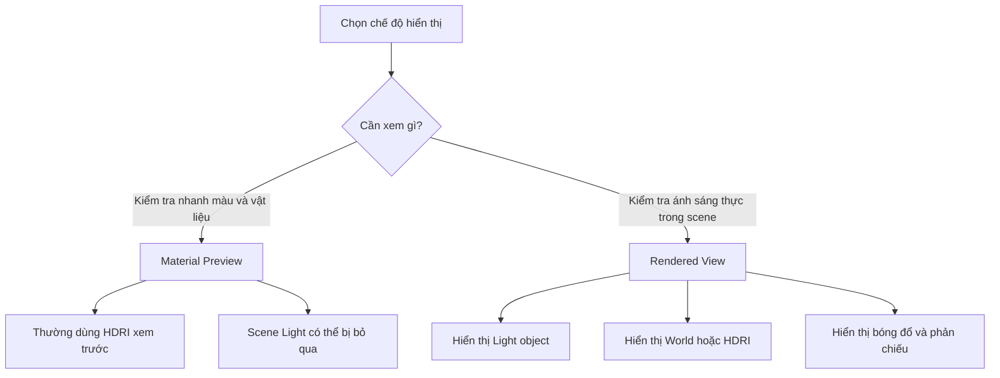
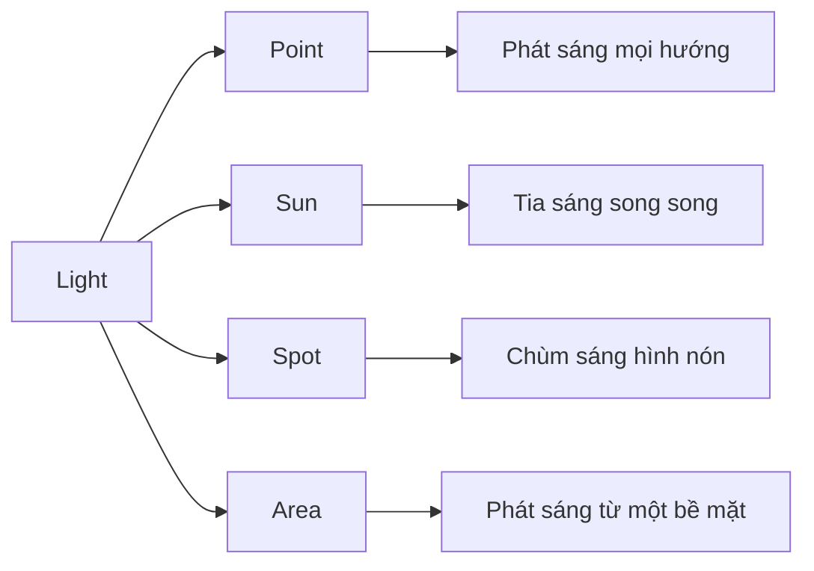
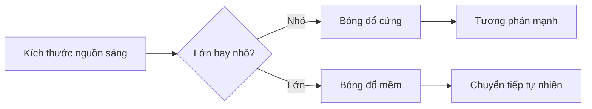
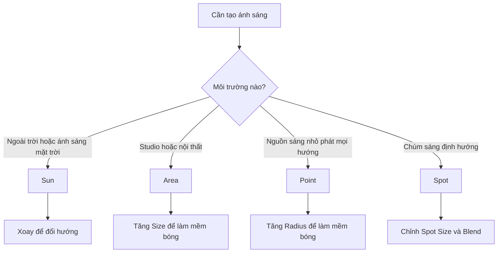

# 010 — Lighting

| Thuộc tính       | Nội dung                                                    |
| ---------------- | ----------------------------------------------------------- |
| **Module**       | Module 01 — Introduction & Setup                            |
| **Bài học**      | Lighting                                                    |
| **Thời lượng**   | 10:14                                                       |
| **Chủ đề chính** | Các loại ánh sáng và cách điều chỉnh ánh sáng trong Blender |

---

## 1. Mục tiêu bài học

Sau bài học này, người học có thể:

* Nhận biết và sử dụng 4 loại Light object trong Blender:

  * Point
  * Sun
  * Spot
  * Area
* Hiểu cách các tham số **Color**, **Power**, **Strength**, **Radius**, **Angle** và **Size** ảnh hưởng đến ánh sáng.
* Phân biệt cách hoạt động của đèn trong **Material Preview** và **Rendered View**.
* Biết thay đổi màu sắc, cường độ và hướng chiếu của từng loại đèn.
* Biết nhân bản đèn bằng `Shift + D` để xây dựng hệ thống nhiều nguồn sáng.
* Biết điều chỉnh ánh sáng môi trường thông qua **World Shader** và HDRI.
* Biết lựa chọn loại đèn phù hợp cho từng tình huống trong scene.

---

## 2. Ôn tập nhanh trước khi thiết lập ánh sáng

Trước khi bắt đầu phần Lighting, bài học thực hiện hai bài luyện tập ngắn.

### 2.1. Đổi màu vật liệu của mặt sàn

Chọn mặt sàn và đổi vật liệu thành màu xám trung tính:

1. Chọn object mặt sàn.
2. Mở **Material Properties**.
3. Đổi tên material thành `Gray`.
4. Mở bảng chọn **Base Color**.
5. Giảm **Saturation** về `0`.
6. Điều chỉnh **Value/Brightness** để tạo màu xám trung bình.

> Khi Saturation bằng `0`, màu sắc mất hoàn toàn độ bão hòa và trở thành một sắc độ xám.

---

### 2.2. Sắp xếp các object

Bài thực hành yêu cầu:

* Đặt Suzanne — đầu khỉ — lên trên Cube.
* Đặt UV Sphere lên trên Cylinder.

Nên sử dụng các góc nhìn trực giao để căn chỉnh chính xác:

| Góc nhìn                 |   Phím tắt |
| ------------------------ | ---------: |
| Front View               | `Numpad 1` |
| Side View                | `Numpad 3` |
| Top View                 | `Numpad 7` |
| Perspective/Orthographic | `Numpad 5` |

Quy trình căn chỉnh:

1. Chọn object.
2. Nhấn `G` để di chuyển.
3. Nhấn `X`, `Y` hoặc `Z` để khóa chuyển động theo một trục.
4. Kiểm tra object ở ít nhất hai góc nhìn.
5. Có thể chuyển sang **Wireframe** hoặc bật **X-Ray** để nhìn xuyên qua vật thể.

Ví dụ:

```text
Front View → căn vị trí theo X và Z
Side View  → căn vị trí theo Y và Z
```

---

## 3. Material Preview và Rendered View

Một điểm quan trọng trong bài học là phân biệt ánh sáng trong hai chế độ hiển thị.

### 3.1. Material Preview

Trong **Material Preview**, Blender thường sử dụng một HDRI mặc định để giúp người dùng xem nhanh:

* Màu vật liệu.
* Roughness.
* Metallic.
* Phản chiếu cơ bản.
* Hình dạng của object.

Theo thiết lập mặc định, các Light object trong scene có thể không tác động trực tiếp đến kết quả hiển thị của Material Preview.

Vì vậy, khi di chuyển Light object trong Material Preview, scene có thể gần như không thay đổi.

---

### 3.2. Rendered View

Để đánh giá chính xác ánh sáng trong scene, chuyển sang:

```text
Z → Rendered
```

Trong **Rendered View**, Blender hiển thị kết quả dựa trên:

* Các Light object trong scene.
* World Background hoặc HDRI.
* Render Engine đang sử dụng.
* Material của object.
* Bóng đổ và phản chiếu thực tế hơn.

---

### 3.3. Sơ đồ ánh sáng trong viewport



---

## 4. Lựa chọn Render Engine

Trong **Render Properties**, có thể lựa chọn render engine phù hợp.

### Eevee

Eevee phù hợp khi:

* Máy tính không quá mạnh.
* Cần phản hồi nhanh trong viewport.
* Đang thử nghiệm vị trí, màu sắc và cường độ đèn.
* Chưa cần kết quả ánh sáng chính xác ở mức cao nhất.

### Cycles

Cycles phù hợp khi:

* Cần ánh sáng và phản xạ chân thực hơn.
* Máy tính có cấu hình đủ mạnh.
* Cần kết quả render cuối cùng có chất lượng cao.
* Có thể chấp nhận thời gian tính toán dài hơn.

Khi sử dụng Cycles, có thể bật **Denoise** để giảm nhiễu và giúp hình ảnh sạch nhanh hơn.

> Trong giai đoạn bố trí ánh sáng, Eevee thường thuận tiện hơn vì phản hồi nhanh. Sau đó có thể chuyển sang Cycles để kiểm tra kết quả cuối.

---

## 5. Truy cập Light Properties

Khi chọn một Light object, tab **Object Data Properties** sẽ hiển thị biểu tượng bóng đèn.

```text
Chọn Light object
       ↓
Object Data Properties
       ↓
Light Properties
```

Tại đây có thể thay đổi:

* Loại đèn.
* Màu ánh sáng.
* Cường độ.
* Kích thước nguồn sáng.
* Hình dạng hoặc vùng chiếu sáng.
* Các tham số riêng của từng loại đèn.

Nếu chọn một Mesh object, biểu tượng này thường chuyển thành biểu tượng tam giác xanh của dữ liệu mesh.

---

# 6. Bốn loại Light trong Blender

Blender cung cấp bốn loại Light object chính:

```text
Shift + A → Light
```



---

## 6.1. Point Light

### Đặc điểm

Point Light phát sáng từ một điểm và tỏa đều theo mọi hướng.

Có thể hình dung nó giống:

* Bóng đèn tròn.
* Ngọn nến.
* Bóng đèn treo nhỏ.
* Một nguồn sáng phát ra từ vị trí cụ thể.

```text
        ↑
     ↖  |  ↗
   ←   Light   →
     ↙  |  ↘
        ↓
```

Point Light chiếu sáng cả:

* Phía trên.
* Phía dưới.
* Hai bên.
* Phía trước và phía sau.

### Tham số quan trọng

#### Color

Thay đổi màu ánh sáng.

Ví dụ:

* Màu đỏ tạo ánh sáng đỏ.
* Màu xanh tạo ánh sáng lạnh.
* Màu vàng cam tạo cảm giác ấm.
* Màu trắng trung tính phù hợp với ánh sáng cơ bản.

#### Power

Điều chỉnh cường độ ánh sáng, thường được thể hiện bằng Watt.

Ví dụ trong bài học:

```text
500 W   → ánh sáng tương đối nhẹ
1000 W  → ánh sáng mạnh hơn
5000 W  → ánh sáng rất mạnh
```

Tuy nhiên, cường độ phù hợp còn phụ thuộc vào:

* Kích thước object.
* Khoảng cách từ đèn đến object.
* Scale của scene.
* Ánh sáng môi trường.
* Render engine.

Trong scene của bài học, các object có kích thước khá lớn nên `1000 W` chưa chắc đã là quá mạnh.

#### Radius

Radius biểu thị kích thước vật lý của nguồn sáng.

* Radius nhỏ → bóng sắc hơn.
* Radius lớn → bóng mềm hơn.

```text
Radius nhỏ                Radius lớn
     •                      (     )
  bóng sắc                 bóng mềm
```

### Ứng dụng

Point Light phù hợp cho:

* Bóng đèn trong phòng.
* Đèn ngủ.
* Ngọn nến.
* Đèn trang trí.
* Nguồn sáng phát ra từ một điểm cụ thể.

---

## 6.2. Sun Light

### Đặc điểm

Sun Light mô phỏng ánh sáng mặt trời.

Các tia sáng của Sun được xem là:

* Song song với nhau.
* Chiếu trên toàn bộ scene.
* Không suy giảm theo khoảng cách như Point Light.

```text
→ → → → → → → →
→ → → → → → → →
→ → → → → → → →
```

### Vị trí không ảnh hưởng đến ánh sáng

Khi di chuyển Sun bằng `G`, ánh sáng trong scene không thay đổi.

```text
Di chuyển Sun → Không thay đổi kết quả
Xoay Sun      → Thay đổi hướng chiếu sáng
```

Nguyên nhân là Sun không hoạt động như một bóng đèn nằm tại một vị trí cụ thể. Nó đại diện cho một khối ánh sáng song song chiếu từ một hướng rất xa.

### Rotation

Rotation là yếu tố quan trọng nhất của Sun Light.

Thao tác:

```text
R
```

Hoặc xoay quanh một trục:

```text
R → X
R → Y
R → Z
```

Khi xoay Sun:

* Hướng chiếu thay đổi.
* Vị trí bóng đổ thay đổi.
* Chiều dài bóng thay đổi.
* Góc chiếu lên bề mặt thay đổi.

### Strength

Sun sử dụng tham số **Strength** thay vì cách hiểu trực quan giống Power của các loại đèn khác.

Giá trị của Sun không nên so sánh trực tiếp với Watt của Point, Spot hoặc Area.

Trong bài học, giá trị được thử nghiệm khoảng:

```text
5
10
```

Mức phù hợp tùy thuộc vào scene và World Lighting.

### Angle

Angle kiểm soát độ mềm của bóng đổ:

* Angle nhỏ → bóng sắc, giống nắng gắt.
* Angle lớn → bóng mềm, giống ánh sáng bị tán xạ bởi mây.

### Ứng dụng

Sun Light phù hợp cho:

* Cảnh ngoài trời.
* Ánh sáng ban ngày.
* Ánh sáng mặt trời chiếu qua cửa sổ.
* Scene phong cảnh.
* Mô phỏng thời gian sáng, trưa hoặc chiều.

---

## 6.3. Spot Light

### Đặc điểm

Spot Light phát ra một chùm sáng hình nón.

Nó giống:

* Đèn pin.
* Đèn sân khấu.
* Đèn rọi.
* Đèn pha.
* Đèn hải đăng.

```text
        Light
          ▼
         / \
        /   \
       /     \
      /       \
```

Khác với Point Light, Spot Light chỉ chiếu sáng về một hướng xác định.

### Rotation

Cần xoay Spot Light để hướng chùm sáng vào object.

```text
R → xoay đèn
G → di chuyển đèn
```

Trong viewport, đường hoặc gizmo định hướng giúp quan sát hướng chiếu của đèn.

### Power

Spot Light sử dụng Power.

Khi đổi từ Sun sang Spot, Blender có thể đặt lại cường độ về một giá trị thấp. Vì vậy cần tăng Power để nhìn thấy hiệu ứng rõ hơn.

Ví dụ trong bài:

```text
1000 W
5000 W
20000 W
```

Giá trị cao được sử dụng chủ yếu để quan sát rõ vùng sáng và phần viền của chùm đèn.

### Spot Size

Spot Size điều chỉnh góc mở của hình nón:

* Giá trị nhỏ → vùng sáng hẹp.
* Giá trị lớn → vùng sáng rộng.

```text
Spot Size nhỏ          Spot Size lớn
      /\                    /  \
     /  \                  /    \
    /____\                /______\
```

### Blend

Blend điều chỉnh độ mềm tại rìa vùng sáng:

* Blend thấp → đường biên rõ và cứng.
* Blend cao → đường biên mềm, chuyển tiếp tự nhiên hơn.

```text
Blend thấp → sáng | tối
Blend cao  → sáng → trung gian → tối
```

### Ứng dụng

Spot Light phù hợp cho:

* Đèn pin.
* Đèn sân khấu.
* Đèn hải đăng.
* Đèn pha ô tô.
* Đèn rọi sản phẩm.
* Ánh sáng cần giới hạn trong một khu vực.

---

## 6.4. Area Light

### Đặc điểm

Area Light phát sáng từ một bề mặt thay vì từ một điểm.

Nó có thể có các hình dạng như:

* Square.
* Rectangle.
* Disk.
* Ellipse.

```text
┌───────────────┐
│  Area Light   │
└───────────────┘
        ↓
    ↓   ↓   ↓
  vùng chiếu sáng
```

Ánh sáng phát ra từ một phía của mặt phẳng Area Light. Đường định hướng trong viewport cho biết phía đang phát sáng.

### Power

Area Light sử dụng Power, thường tính theo Watt.

Khi tăng kích thước Area Light nhưng giữ nguyên Power, lượng ánh sáng được phân bố trên một bề mặt lớn hơn.

### Size

Size là tham số quan trọng nhất để kiểm soát độ mềm của bóng đổ.

* Area nhỏ → bóng đổ cứng và sắc.
* Area lớn → bóng đổ mềm và tự nhiên.

```text
Nguồn sáng nhỏ             Nguồn sáng lớn
      □                   ┌───────────┐
      ↓                   │           │
  bóng sắc                └───────────┘
                               ↓
                           bóng mềm
```

Có thể thay đổi kích thước bằng:

```text
S
```

Hoặc chỉnh trực tiếp thông số **Size** trong Light Properties.

> Về lâu dài, chỉnh Size trong Light Properties thường rõ ràng và dễ kiểm soát hơn so với chỉ thay đổi Object Scale.

### Shape

Có thể lựa chọn hình dạng của nguồn sáng:

| Shape     | Đặc điểm                 |
| --------- | ------------------------ |
| Square    | Nguồn sáng hình vuông    |
| Rectangle | Nguồn sáng hình chữ nhật |
| Disk      | Nguồn sáng hình tròn     |
| Ellipse   | Nguồn sáng hình ellipse  |

Shape có thể ảnh hưởng đến:

* Hình dạng phản chiếu trên vật liệu bóng.
* Đặc điểm vùng sáng.
* Cách mô phỏng đèn studio hoặc cửa sổ.

### Ứng dụng

Area Light phù hợp cho:

* Ánh sáng chính trong studio.
* Softbox.
* Ánh sáng cửa sổ.
* Chiếu sáng nội thất.
* Chụp sản phẩm.
* Tạo phản chiếu đẹp trên vật liệu bóng.

---

## 7. Bảng so sánh bốn loại đèn

| Loại đèn  | Hình thức phát sáng       | Vị trí có quan trọng? | Hướng xoay có quan trọng? | Kiểm soát bóng mềm | Ứng dụng                  |
| --------- | ------------------------- | --------------------: | ------------------------: | ------------------ | ------------------------- |
| **Point** | Tỏa mọi hướng từ một điểm |                    Có |             Không đáng kể | Radius             | Bóng đèn, nến             |
| **Sun**   | Các tia song song         |                 Không |                        Có | Angle              | Mặt trời, cảnh ngoài trời |
| **Spot**  | Chùm sáng hình nón        |                    Có |                        Có | Radius và Blend    | Đèn pin, đèn rọi          |
| **Area**  | Phát từ một bề mặt        |                    Có |                        Có | Size               | Studio, nội thất          |

---

## 8. Quy tắc về kích thước nguồn sáng và bóng đổ

Một nguyên tắc quan trọng trong chiếu sáng:

```text
Nguồn sáng càng nhỏ → bóng càng sắc
Nguồn sáng càng lớn → bóng càng mềm
```



Nguyên tắc này có thể quan sát thông qua:

* Radius của Point Light.
* Angle của Sun Light.
* Radius của Spot Light.
* Size của Area Light.

---

## 9. Thêm và nhân bản Light object

### 9.1. Thêm một Light mới

Sử dụng:

```text
Shift + A → Light
```

Sau đó lựa chọn:

* Point
* Sun
* Spot
* Area

---

### 9.2. Nhân bản Light

Có thể nhân bản một đèn đang có bằng:

```text
Shift + D
```

Sau khi nhấn `Shift + D`, Blender:

1. Tạo một bản sao của Light.
2. Chuyển ngay sang chế độ di chuyển.
3. Cho phép đặt đèn mới tại vị trí khác.

Ví dụ:

```text
Shift + D
Y
```

Thao tác này nhân bản đèn và chỉ di chuyển bản sao theo trục Y.

Sau đó có thể:

* Nhấn `R` để xoay.
* Thay đổi màu.
* Thay đổi Power.
* Hướng đèn vào một phía khác của object.

---

## 10. Thiết lập hệ thống nhiều đèn

Một scene thường không chỉ sử dụng một nguồn sáng.

Ví dụ đơn giản:

```text
        Area Light 1
          màu ấm
             \
              \
             Object
              /
             /
        Area Light 2
          màu lạnh
```

Có thể thiết lập:

* Một đèn chính màu ấm.
* Một đèn phụ màu xanh hoặc tím.
* Một World Background có cường độ thấp.
* Phản chiếu HDRI vẫn xuất hiện trên vật liệu bóng.

Kết quả là scene có:

* Chiều sâu tốt hơn.
* Tách biệt giữa object và nền.
* Màu sắc thú vị hơn.
* Phản chiếu phong phú hơn.

---

## 11. World Lighting và HDRI

Ngoài Light object, Blender còn có ánh sáng môi trường từ **World**.

World bao quanh toàn bộ scene và có thể cung cấp:

* Màu nền.
* Ánh sáng môi trường.
* HDRI.
* Phản chiếu môi trường.

---

### 11.1. Chuyển Shader Editor sang World

Trong workspace **Shading**:

1. Mở Shader Editor.
2. Chuyển chế độ từ `Object` sang `World`.
3. Tìm node **Background**.
4. Điều chỉnh tham số **Strength**.

```text
Shader Editor
     ↓
Object → World
     ↓
Background Node
     ↓
Strength
```

---

### 11.2. Điều chỉnh World Strength

* Strength cao → toàn scene sáng hơn.
* Strength thấp → ánh sáng chủ yếu đến từ các Light object.
* Strength bằng `0` → World không đóng góp ánh sáng.

Ví dụ:

```text
World Strength = 0
→ Chỉ các Light object chiếu sáng scene.

World Strength thấp
→ Vẫn giữ phản chiếu môi trường nhưng đèn chính nổi bật hơn.

World Strength cao
→ HDRI hoặc World chiếu sáng mạnh toàn bộ scene.
```

Một cách thiết lập hữu ích là:

* Giảm World Strength xuống mức thấp.
* Giữ HDRI để tạo phản chiếu.
* Dùng Light object làm nguồn sáng chính.

---

### 11.3. HDRI

HDRI là ảnh môi trường toàn cảnh 360° có dải sáng rộng.

HDRI có thể cung cấp:

* Ánh sáng môi trường.
* Phản chiếu chân thực.
* Bầu trời hoặc bối cảnh xung quanh.
* Màu sắc ánh sáng phù hợp với môi trường.

Sơ đồ đơn giản:

```text
               HDRI / World
        ┌────────────────────────┐
        │                        │
        │        Scene           │
        │       Object           │
        │                        │
        └────────────────────────┘
```

HDRI đặc biệt hữu ích khi:

* Render sản phẩm.
* Tạo cảnh ngoài trời.
* Tạo phản chiếu trên kim loại.
* Chiếu sáng scene nhanh mà chưa cần bố trí nhiều đèn.

---

## 12. Sơ đồ lựa chọn loại đèn



---

## 13. Quy trình thực hành

### Bước 1: Chuẩn bị scene

* Đặt Suzanne lên Cube.
* Đặt UV Sphere lên Cylinder.
* Đổi mặt sàn thành màu xám trung tính.
* Chuyển sang Rendered View.

---

### Bước 2: Thử Point Light

1. Chọn Light mặc định.
2. Chuyển loại đèn thành **Point**.
3. Di chuyển đèn quanh scene bằng `G`.
4. Thay đổi Color.
5. Thử các mức Power khác nhau.
6. Tăng và giảm Radius.
7. Quan sát vùng sáng và độ mềm bóng đổ.

---

### Bước 3: Thử Sun Light

1. Chuyển Light thành **Sun**.
2. Giảm Strength xuống mức phù hợp.
3. Di chuyển Sun bằng `G`.
4. Quan sát rằng ánh sáng không thay đổi.
5. Xoay Sun bằng `R`.
6. Quan sát hướng và chiều dài bóng.
7. Thay đổi Angle để kiểm tra độ mềm bóng.

---

### Bước 4: Thử Spot Light

1. Chuyển Light thành **Spot**.
2. Tăng Power để vùng sáng dễ quan sát.
3. Di chuyển và xoay đèn về phía các object.
4. Thay đổi Spot Size.
5. Thay đổi Blend.
6. Quan sát vùng sáng hình nón và viền chuyển tiếp.

---

### Bước 5: Thử Area Light

1. Chuyển Light thành **Area**.
2. Xoay mặt phát sáng về phía các object.
3. Tăng Power nếu cần.
4. Thu nhỏ Area Light.
5. Quan sát bóng đổ trở nên sắc hơn.
6. Phóng lớn Area Light.
7. Quan sát bóng đổ mềm hơn.
8. Thử thay đổi Shape.

---

### Bước 6: Nhân bản đèn

1. Chọn Area Light.
2. Nhấn `Shift + D`.
3. Di chuyển bản sao sang phía đối diện.
4. Xoay đèn về phía object.
5. Đổi màu của một trong hai đèn.
6. Điều chỉnh Power để cân bằng ánh sáng.

---

### Bước 7: Giảm ánh sáng môi trường

1. Chuyển sang workspace **Shading**.
2. Đổi Shader Editor từ `Object` sang `World`.
3. Tìm node Background.
4. Giảm Strength.
5. Quan sát Light object trở thành nguồn sáng chính.
6. Giữ một lượng World Light nhỏ để duy trì phản chiếu HDRI.

---

### Bước 8: Lưu file

Sau khi hoàn thành:

```text
Ctrl + S
```

Đảm bảo lưu scene để tiếp tục ở bài học tiếp theo.

---

## 14. Phím tắt và công cụ liên quan

| Thao tác            | Phím tắt/Vị trí                 |
| ------------------- | ------------------------------- |
| Mở Add Menu         | `Shift + A`                     |
| Thêm Light          | `Shift + A → Light`             |
| Di chuyển Light     | `G`                             |
| Di chuyển theo trục | `G → X/Y/Z`                     |
| Xoay Light          | `R`                             |
| Xoay theo trục      | `R → X/Y/Z`                     |
| Thay đổi kích thước | `S`                             |
| Nhân bản Light      | `Shift + D`                     |
| Front View          | `Numpad 1`                      |
| Side View           | `Numpad 3`                      |
| Top View            | `Numpad 7`                      |
| Mở Shading Pie Menu | `Z`                             |
| Xem ánh sáng thực   | `Z → Rendered`                  |
| World Shader        | Shading → Shader Editor → World |
| Lưu file            | `Ctrl + S`                      |

---

## 15. Lưu ý quan trọng

### 15.1. Material Preview có thể không dùng Scene Light

Nếu di chuyển Light nhưng không thấy scene thay đổi, hãy kiểm tra xem viewport có đang ở Material Preview hay không.

Để kiểm tra ánh sáng chính xác:

```text
Z → Rendered
```

---

### 15.2. Scale của scene ảnh hưởng đến Power

Một Light có Power `1000 W` có thể:

* Rất mạnh trong một scene nhỏ.
* Khá yếu trong một scene có object lớn.
* Yếu nếu đặt quá xa object.

Không nên đánh giá Power chỉ dựa vào con số.

---

### 15.3. Không so sánh trực tiếp Sun Strength với Power

Sun hoạt động khác Point, Spot và Area.

```text
Point / Spot / Area → Power
Sun                 → Strength
```

Giá trị `10` của Sun không tương đương `10 W` của Point Light.

---

### 15.4. Di chuyển Sun không thay đổi ánh sáng

Đây không phải lỗi.

Sun chỉ quan tâm đến:

* Rotation.
* Strength.
* Color.
* Angle.

---

### 15.5. Area Light chỉ chiếu về một phía

Nếu Area Light không chiếu vào object, có thể mặt phát sáng đang quay sai hướng.

Hãy quan sát đường định hướng hoặc gizmo rồi xoay đèn bằng `R`.

---

### 15.6. World vẫn có thể làm scene sáng

Ngay cả khi không có Light object hoặc Light có Power thấp, scene vẫn có thể sáng do:

* World Background.
* HDRI.
* Material Preview HDRI.
* World Strength chưa được giảm.

---

### 15.7. Radius hoặc Size bằng 0 tạo bóng quá sắc

Nguồn sáng có kích thước bằng `0` gần với nguồn sáng lý tưởng về mặt toán học và thường tạo bóng đổ rất cứng.

Trong scene thực tế, nên sử dụng một giá trị nhỏ nhưng lớn hơn `0`.

---

### 15.8. Màu ánh sáng ảnh hưởng màu vật liệu

Một object màu trắng không phải lúc nào cũng xuất hiện màu trắng.

Ví dụ:

```text
Vật liệu trắng + đèn đỏ  → object có sắc đỏ
Vật liệu trắng + đèn xanh → object có sắc xanh
```

Màu quan sát được là kết quả kết hợp giữa:

* Base Color của vật liệu.
* Màu ánh sáng.
* Cường độ ánh sáng.
* World Lighting.
* Color Management.

---

## 16. Lỗi thường gặp

| Lỗi                                 | Nguyên nhân                            | Cách khắc phục                     |
| ----------------------------------- | -------------------------------------- | ---------------------------------- |
| Di chuyển đèn nhưng scene không đổi | Đang ở Material Preview                | Chuyển sang Rendered View          |
| Di chuyển Sun nhưng bóng không đổi  | Sun không phụ thuộc vị trí             | Xoay Sun bằng `R`                  |
| Spot không chiếu vào object         | Sai hướng                              | Xoay Spot về phía object           |
| Area không tạo ánh sáng             | Mặt phát sáng quay ngược               | Xoay Area Light                    |
| Scene quá tối                       | Power thấp hoặc đèn ở quá xa           | Tăng Power hoặc đưa đèn lại gần    |
| Scene quá sáng                      | Power hoặc World Strength quá cao      | Giảm Power và World Strength       |
| Bóng quá cứng                       | Nguồn sáng quá nhỏ                     | Tăng Radius, Angle hoặc Size       |
| Không thấy tác dụng của Blend       | Power thấp hoặc vùng sáng khó quan sát | Tăng Power tạm thời để kiểm tra    |
| Cycles phản hồi chậm                | Scene nặng hoặc máy yếu                | Chuyển sang Eevee hoặc bật Denoise |
| Phản chiếu không rõ                 | World/HDRI yếu hoặc vật liệu quá nhám  | Điều chỉnh HDRI và Roughness       |

---

## 17. Bài tập thực hành

### Bài tập 1: So sánh bốn loại đèn

Sử dụng cùng một vị trí và lần lượt chuyển Light thành:

1. Point.
2. Sun.
3. Spot.
4. Area.

Ghi lại sự khác biệt về:

* Hướng phát sáng.
* Bóng đổ.
* Vùng ảnh hưởng.
* Cường độ.
* Cách điều khiển.

---

### Bài tập 2: Thử nghiệm màu ánh sáng

Tạo hai Area Light:

* Đèn bên trái có màu ấm.
* Đèn bên phải có màu lạnh.

Ví dụ:

```text
Bên trái → vàng hoặc cam
Bên phải → xanh lam hoặc tím
```

Quan sát sự pha trộn màu trên object và mặt sàn.

---

### Bài tập 3: Kiểm tra độ mềm bóng

Với Area Light, thử ba kích thước:

```text
Size nhỏ
Size trung bình
Size lớn
```

So sánh:

* Độ sắc của mép bóng.
* Độ rộng vùng chuyển tiếp.
* Cảm giác ánh sáng trên object.

---

### Bài tập 4: Giảm World Strength

Thiết lập hai trường hợp:

```text
Trường hợp A: World Strength cao
Trường hợp B: World Strength thấp
```

So sánh:

* Độ tương phản.
* Độ rõ của bóng.
* Tầm ảnh hưởng của Light object.
* Phản chiếu trên UV Sphere.

---

## 18. Checklist thực hành

* [ ] Đã đổi màu mặt sàn thành xám trung tính.
* [ ] Đã đặt Suzanne lên Cube.
* [ ] Đã đặt UV Sphere lên Cylinder.
* [ ] Đã chuyển sang Rendered View để kiểm tra ánh sáng.
* [ ] Đã thử nghiệm Point Light.
* [ ] Đã thử nghiệm Sun Light.
* [ ] Đã thử nghiệm Spot Light.
* [ ] Đã thử nghiệm Area Light.
* [ ] Đã thay đổi màu ánh sáng.
* [ ] Đã thay đổi Power hoặc Strength.
* [ ] Đã quan sát ảnh hưởng của Radius, Angle hoặc Size.
* [ ] Đã thay đổi Spot Size và Blend.
* [ ] Đã nhân bản Light bằng `Shift + D`.
* [ ] Đã sử dụng ít nhất hai đèn trong scene.
* [ ] Đã giảm World Background Strength.
* [ ] Đã lưu file bằng `Ctrl + S`.

---

## 19. Ghi nhớ nhanh

```text
Point
→ Tỏa sáng mọi hướng.
→ Di chuyển đèn để đổi vùng chiếu.
→ Radius lớn làm bóng mềm hơn.

Sun
→ Mô phỏng ánh sáng mặt trời.
→ Vị trí không quan trọng.
→ Rotation quyết định hướng sáng.
→ Angle quyết định độ mềm bóng.

Spot
→ Chùm sáng hình nón.
→ Spot Size quyết định độ rộng.
→ Blend quyết định độ mềm của viền.

Area
→ Phát sáng từ một bề mặt.
→ Size lớn tạo bóng mềm.
→ Phù hợp với studio và nội thất.

World
→ Cung cấp ánh sáng môi trường.
→ Giảm Strength để Light object nổi bật hơn.
```

---

## 20. Tóm tắt

Blender cung cấp bốn loại Light object với cách hoạt động khác nhau:

* **Point Light** phát sáng theo mọi hướng từ một điểm.
* **Sun Light** tạo các tia sáng song song và được điều khiển chủ yếu bằng Rotation.
* **Spot Light** tạo một chùm sáng hình nón có thể kiểm soát độ rộng và độ mềm của viền.
* **Area Light** phát sáng từ một bề mặt và đặc biệt phù hợp để tạo bóng đổ mềm.

Hai yếu tố quan trọng nhất khi thiết lập ánh sáng là:

1. **Cường độ và màu sắc của nguồn sáng.**
2. **Kích thước vật lý của nguồn sáng và độ mềm của bóng đổ.**

Ngoài các Light object, **World Background hoặc HDRI** cũng đóng góp ánh sáng và phản chiếu cho toàn bộ scene. Giảm World Strength và sử dụng các đèn nhân tạo làm nguồn sáng chính là một phương pháp hiệu quả để kiểm soát ánh sáng rõ ràng hơn.

Nguyên tắc cần ghi nhớ:

> Nguồn sáng càng lớn thì bóng đổ càng mềm; nguồn sáng càng nhỏ thì bóng đổ càng sắc.
